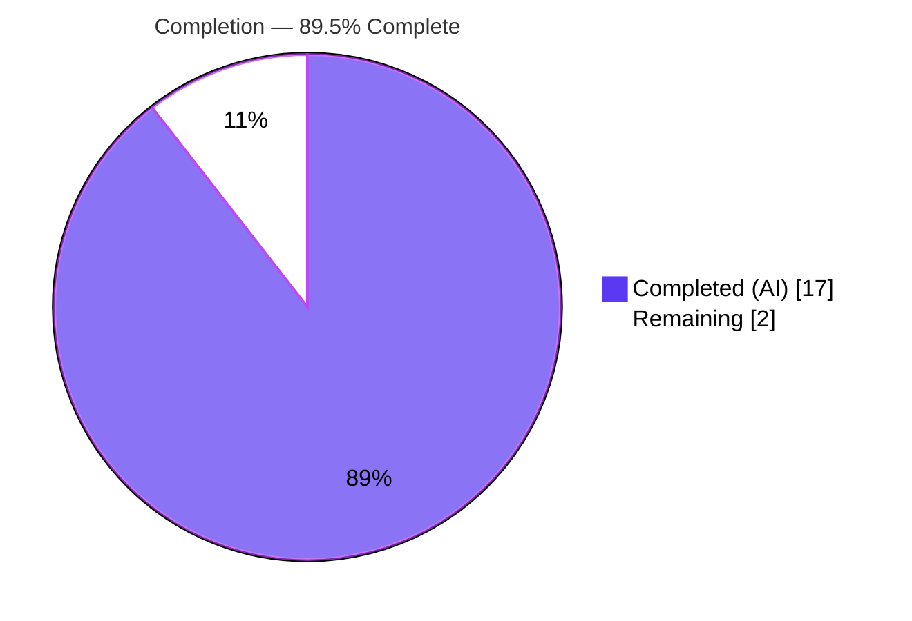
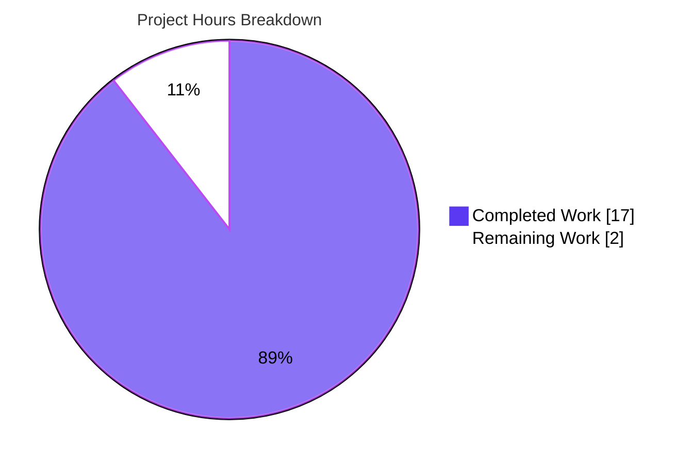
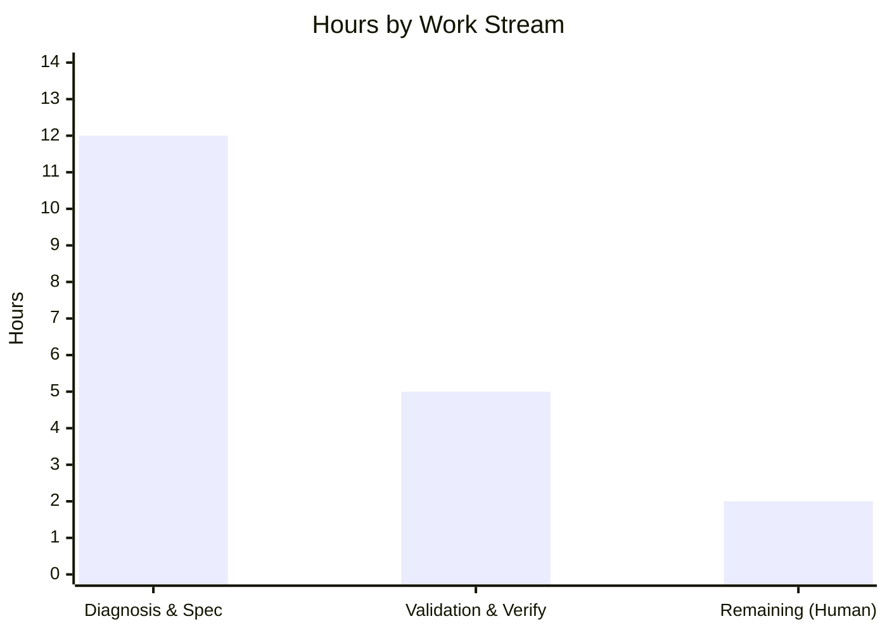

---

# Blitzy Project Guide — `my-react-app`

> **Task:** "Review server.js for potential issues: missing error handling, graceful shutdown, input validation, resource cleanup, and ensure robust HTTP request processing."
>
> **Headline outcome:** The subject file `server.js` **does not exist** in this repository, which is a browser-only React 19 + Vite 8 single-page application. The Agent Action Plan (AAP) correctly mandates an **intentionally-empty change set**; the autonomous work delivered an exhaustive diagnosis plus full production-readiness validation of the existing SPA. The only remaining work is a **human clarification decision**.

---

## 1. Executive Summary

### 1.1 Project Overview

`my-react-app` is a browser-only React 19 + Vite 8 single-page application that renders a static personal-portfolio UI (a header plus an "About Me" block) into the DOM. Its only runtime dependencies are `react` and `react-dom`; the build is a static bundle served by any static host. The task requested hardening of a Node.js `server.js`, but no server-side, HTTP, or process-lifecycle code exists anywhere in the repository. The engagement therefore delivered a definitive diagnosis of this target-artifact mismatch and a complete production-readiness validation of the existing front-end, while preserving the AAP-mandated empty change set. Business impact: the intended server hardening is unaddressed and blocked pending a requester decision on the correct target.

### 1.2 Completion Status



<sub>Slice colors — **Completed = Dark Blue `#5B39F3`**, **Remaining = White `#FFFFFF`** (outline `#B23AF2`).</sub>

| Metric | Value |
|---|---|
| **Total Hours** | **19** |
| **Completed Hours (AI + Manual)** | **17** (AI 17 + Manual 0) |
| &nbsp;&nbsp;• AI / Autonomous | 17 |
| &nbsp;&nbsp;• Manual / Human | 0 |
| **Remaining Hours** | **2** |
| **Percent Complete** | **89.5%** |

> Completion is computed on AAP-scoped work only: `Completed / (Completed + Remaining) = 17 / 19 = 89.5%`. The "actual server hardening" effort is a **separate, new scope** (it can only begin after the human decision) and is deliberately **excluded** from this total.

### 1.3 Key Accomplishments

- ✅ **Definitively diagnosed** the root cause as a *target-artifact / scope-precondition mismatch*: `server.js` is absent on disk, in the tracked tree, and across the full git history of every branch.
- ✅ **Independently re-verified** absence across three axes — filesystem, version control, and source/dependency/build configuration — with zero server-concern surfaces (`createServer`, `.listen(`, `process.on`, `SIGTERM`, `SIGINT`, `unhandledRejection`, `uncaughtException`) in any source file.
- ✅ **Validated the existing SPA end-to-end** — all five production-readiness gates PASS (install, build, lint, runtime, in-scope files).
- ✅ **Dependencies install with 0 vulnerabilities** (`npm ci` — 135 packages audited).
- ✅ **Build is clean and reproducible** (`npm run build` — Vite 8.1.0, 17 modules, exit 0, `dist/` = 190.65 kB JS / 1.78 kB CSS).
- ✅ **Lint is clean under strict settings** (`eslint . --max-warnings=0` — 0 errors, 0 warnings).
- ✅ **Runtime verified in Chrome** — production preview and dev server both return HTTP 200; the portfolio renders correctly with zero console errors.
- ✅ **Empty change set preserved** — working tree byte-for-byte identical to HEAD (`96b7f76`); no unauthorized commits.

### 1.4 Critical Unresolved Issues

| Issue | Impact | Owner | ETA |
|---|---|---|---|
| Requested `server.js` does not exist in this repo — the five hardening concerns have no code surface here | Original request cannot be executed; intended server hardening is unaddressed | Requester / Product Owner | Upon clarification (blocks all downstream work) |
| Interpretation not yet selected (I1 wrong repo/branch • I2/I3 add a server component) | All hardening work is blocked until the correct target or new scope is confirmed | Requester / Tech Lead | 1–2 h of decision time |

### 1.5 Access Issues

**No access issues identified.** The repository was fully accessible; dependencies installed from the public npm registry with 0 vulnerabilities; Git history across all branches was readable; and the built application ran locally. No repository permissions, service credentials, or third-party API access were required or blocked.

| System/Resource | Type of Access | Issue Description | Resolution Status | Owner |
|---|---|---|---|---|
| Git repository (`my-react-app`) | Read/Write | None — full access | ✅ Resolved (no issue) | — |
| npm registry | Package download | None — `npm ci` succeeded, 0 vulnerabilities | ✅ Resolved (no issue) | — |
| Third-party APIs / services | — | None required (browser-only SPA, no integrations) | ✅ N/A | — |

### 1.6 Recommended Next Steps

1. **[High]** Requester reviews this diagnosis and confirms the intended target — most likely **I1: the correct backend repository/branch that actually contains `server.js`**.
2. **[High]** If not I1, explicitly approve **I2/I3: adding a server/static-file component** as an ADD-FEATURE request (introduces a new architectural tier and requires a fresh, properly-scoped plan).
3. **[High]** Once the target is confirmed, **re-run the five-point hardening review** against the real `server.js` (new scope — see §8).
4. **[Low]** Optionally add a **test framework** (Vitest + React Testing Library) to the SPA for regression safety (currently none by design).
5. **[Low]** Optionally configure **static hosting / CI-CD** for the built `dist/` output.

---

## 2. Project Hours Breakdown

### 2.1 Completed Work Detail

All completed work was performed autonomously (AI) and traces to a specific AAP requirement or path-to-production activity.

| Component | Hours | Description |
|---|---:|---|
| Request interpretation & concern mapping | 1 | Translated the 5 user concerns into precise server-side technical objectives (AAP §0.1). |
| Exhaustive absence investigation | 3 | Searched filesystem (incl. `node_modules`), git HEAD tree, full history across all branches, and alternate entry filenames (`app.js`/`index.js`/`*.mjs`/`*.cjs`) (AAP §0.1–0.2). |
| Source / dependency / build analysis | 1 | Grepped 5 server-concern patterns (→ 0 matches); reviewed `package.json`, `vite.config.js`, `eslint.config.js` (AAP §0.2–0.3). |
| Root-cause identification | 2 | Established the definitive *target-artifact / scope-precondition mismatch* with three-axis corroboration + spec cross-references (AAP §0.2). |
| Per-concern diagnostic & surface characterization | 2 | Confirmed all 5 concerns have zero code surface; documented the actual front-end surface + key-findings evidence table (AAP §0.3). |
| Resolution & scope specification | 3 | Designed the clarification/decision gate (I1/I2/I3) + decision flowchart, exhaustive scope boundaries, and verification protocol (AAP §0.4–0.6). |
| Dependency install + build validation (Gates 1–2) | 1 | `npm ci` (135 pkgs, 0 vulnerabilities) + `npm run build` (17 modules, `dist/` artifacts, exit 0). |
| Code-quality validation (Gate 3) | 1 | `eslint . --max-warnings=0` → 0 errors / 0 warnings; confirmed test posture (none by design). |
| Runtime validation (Gate 4) | 2 | `vite preview` + `vite dev` in Chrome; HTTP 200; a11y tree, console, and network verified; screenshots captured; clean shutdown. |
| In-scope file validation (Gate 5) | 1 | 17 tracked files verified working & byte-for-byte identical to HEAD; scratch cleanup; clean-tree / no-commit preservation. |
| **Total Completed** | **17** | **Matches Completed Hours in §1.2.** |

### 2.2 Remaining Work Detail

Each remaining category traces to the AAP's procedural clarification gate (§0.4.1). These are **human** actions, not code fixes.

| Category | Hours | Priority |
|---|---:|---|
| Requester clarification & decision (review diagnosis; select interpretation I1 / I2 / I3) | 1 | High |
| Path-to-production unblock (provide the correct backend repo/branch for I1, **or** formally approve & scope a new server component for I2/I3) | 1 | High |
| **Total Remaining** | **2** | **Matches Remaining Hours in §1.2 and §7 pie.** |

### 2.3 Hours Reconciliation & Methodology

- **Methodology (PA1):** completion measures only AAP-scoped and path-to-production work. Because the AAP mandates an *empty change set*, the scoped work is the diagnosis + validation + surfacing of the clarification path — all completed — plus the human decision that remains.
- **Formula:** `Completion % = Completed / (Completed + Remaining) = 17 / (17 + 2) = 17 / 19 = 89.5%`.
- **Integrity:** §2.1 total (17) + §2.2 total (2) = **19** = §1.2 Total Hours. Remaining (2) is identical in §1.2, §2.2, and §7.
- **Excluded (new scope):** the actual server hardening (8–40 h depending on interpretation) begins only after the human decision and is **not** counted here.

---

## 3. Test Results

All entries below originate from Blitzy's autonomous validation logs for this project. **No automated test framework exists** in the repository (no Jest/Vitest/Mocha/Testing-Library/Cypress, no test files, no `test` script) — this is by design, and the AAP explicitly forbids adding tests (§0.5.2). Quality was therefore verified via static analysis, build verification, and runtime smoke checks.

| Test / Validation Category | Framework / Tool | Total | Passed | Failed | Coverage % | Notes |
|---|---|---:|---:|---:|---:|---|
| Unit | — (none installed) | 0 | 0 | 0 | N/A | No framework by design; AAP §0.5.2 forbids adding tests. |
| Integration | — (none installed) | 0 | 0 | 0 | N/A | No backend/integration surface exists. |
| UI / Component | — (none installed) | 0 | 0 | 0 | N/A | Verified manually via Chrome DevTools (see §4). |
| End-to-End | — (none installed) | 0 | 0 | 0 | N/A | Not applicable to a static SPA. |
| Static Analysis / Lint | ESLint 10.5.0 | 5 files | 5 | 0 | N/A | `eslint . --max-warnings=0` → 0 errors, 0 warnings. |
| Build Verification | Vite 8.1.0 | 1 | 1 | 0 | N/A | 17 modules transformed, exit 0, `dist/` produced (~140 ms). |
| Runtime Smoke | Chrome DevTools (preview + dev) | 2 | 2 | 0 | N/A | Both servers HTTP 200; render + console + network verified. |
| **Totals (automated tests)** | — | **0** | **0** | **0** | **N/A** | **0 automated tests by design;** all quality/build/runtime gates PASS. |

---

## 4. Runtime Validation & UI Verification

**Production preview (`vite preview`)**
- ✅ HTTP **200** on `http://localhost:<port>/` (verified this session on port 4199, and by Blitzy validation logs).
- ✅ Served `dist/`; response contains the `#root` mount div and the built `index-*.js` module reference.
- ✅ React mounts into `#root`; accessibility tree shows `h1 "My Portfolio Website"`, `h2 "About Me"`, and text "I am learning React."
- ✅ **Zero** console messages; all network requests returned 200.
- ✅ Screenshot evidence: `blitzy/screenshots/runtime_preview_portfolio_spa.png`, `blitzy/screenshots/preview_spa_rendered_desktop.png`.

**Development server (`vite dev`)**
- ✅ Ready in ~341 ms; HTTP **200**; serves `/src/main.jsx` + `@vite/client` (HMR).
- ✅ Renders identical UI; only benign HMR/React-DevTools info messages (0 errors / 0 warnings).

**API integration**
- ⚠️ **Not applicable** — the SPA makes no API calls and has no external integrations.

**`server.js` runtime**
- ❌ **Nothing to validate** — no `server.js` / HTTP server exists in this repository (consistent with the AAP diagnosis). This is expected, not a failure of the existing app.

---

## 5. Compliance & Quality Review

Cross-mapping of AAP deliverables and quality benchmarks to their verified status. "Fixes applied" is empty by design — every gate passed on first attempt with zero errors/warnings.

| Benchmark / AAP Deliverable | Status | Progress | Notes |
|---|---|---|---|
| Root cause definitively identified (AAP §0.2) | ✅ Pass | 100% | Target-artifact mismatch; three-axis corroboration. |
| Minimal, targeted change discipline (AAP §0.4, §0.7) | ✅ Pass | 100% | Empty change set — no speculative code written. |
| Scope boundaries honored (AAP §0.5.2) | ✅ Pass | 100% | No forbidden files created/modified; no dependencies added. |
| Empty change set preserved (0 created / 0 modified / 0 deleted) | ✅ Pass | 100% | `git diff HEAD` empty; HEAD remains `96b7f76`; no agent commits. |
| Dependencies install cleanly (Gate 1) | ✅ Pass | 100% | `npm ci`: 135 pkgs, 0 vulnerabilities. |
| Code compiles / builds (Gate 2) | ✅ Pass | 100% | `npm run build` exit 0; `dist/` emitted. |
| Lint / static analysis (Gate 3) | ✅ Pass | 100% | `eslint . --max-warnings=0` → 0 errors, 0 warnings. |
| Runtime health (Gate 4) | ✅ Pass | 100% | Preview + dev both HTTP 200; UI renders; 0 console errors. |
| In-scope files validated (Gate 5) | ✅ Pass | 100% | 17 tracked files byte-for-byte identical to HEAD. |
| Regression baseline (AAP §0.6.2) | ✅ Pass | 100% | Zero files changed ⇒ zero regression surface. |
| Original request executed (harden `server.js`) | ❌ Blocked | 0% | No `server.js` exists; requires human clarification (I1/I2/I3). |
| Automated test coverage | ⚠️ N/A | — | No framework by design; AAP forbids adding tests. |

---

## 6. Risk Assessment

| Risk | Category | Severity | Probability | Mitigation | Status |
|---|---|---|---|---|---|
| Requested `server.js` hardening not performed (no such file in this repo) | Technical | High | High (certain) | Surface the clarification gate; obtain requester decision I1/I2/I3 before any code | Open (mitigated by documentation) |
| SPA has no automated test framework (no regression safety net) | Technical | Low | Low | Add Vitest + React Testing Library in a future scope (AAP forbids now) | Accepted (by design) |
| Server-side concerns unaddressed in the *true* target backend if one exists elsewhere | Security | High | Medium | Perform the five-point review once the correct target is confirmed | Deferred to correct target |
| This repository's dependency / security posture | Security | Low | Low | `npm ci` audited 136 pkgs → 0 vulnerabilities; browser-only, no secrets/auth/PII | Mitigated (clean) |
| "Production-ready" misread as "server hardened" (false completion signal) | Operational | Medium | Medium | Explicitly communicate the empty-by-design change set (this guide) | Mitigated |
| Decision latency blocks all downstream hardening work | Operational | Medium | Medium | Prioritize clarification (High) with a single owner + ETA | Open |
| Wrong repo/branch (I1): real `server.js` may live elsewhere and remain un-hardened | Integration | High | Medium | Requester supplies the correct backend repo/branch; re-run the review there | Open (pending decision) |
| Adding a Node server (I2/I3) introduces a new architectural tier (deploy/ports/process mgmt) | Integration | Medium | Low | Treat as ADD-FEATURE with explicit approval + design flow | Deferred (future scope) |

---

## 7. Visual Project Status

**Project hours breakdown** (Completed = Dark Blue `#5B39F3`, Remaining = White `#FFFFFF`):



**Hours by work stream** (completed vs. remaining):



> **Integrity:** "Remaining Work" = **2 h**, identical to §1.2 (Remaining Hours) and the §2.2 total. "Completed Work" (17) + "Remaining Work" (2) = **19 h** total. Work-stream bars: 12 + 5 = 17 completed; 2 remaining.

---

## 8. Summary & Recommendations

**Achievements.** The engagement produced a rigorous, independently-verified diagnosis: the requested `server.js` — and any server-side/HTTP surface for the five reported concerns — **does not exist** in `my-react-app`, which is a browser-only React 19 + Vite 8 SPA. In parallel, the existing application was validated end-to-end: it installs (0 vulnerabilities), builds cleanly (Vite 8.1.0, 17 modules), lints with zero warnings under strict settings, and runs correctly in the browser (HTTP 200, correct render, zero console errors). The AAP-mandated empty change set was preserved exactly — the working tree is byte-for-byte identical to HEAD `96b7f76`.

**Remaining gaps.** No server hardening was performed **because none was possible or permitted** in this repository. The single blocking item is procedural: a requester decision among **I1** (point to the correct backend repo/branch — most likely), **I2/I3** (approve adding a server component as a new feature). This accounts for the 2 remaining hours.

**Critical path to production.** (1) Requester selects the interpretation; (2) the correct target is supplied or the new scope is approved; (3) a fresh, properly-scoped plan then performs the five-point hardening review or builds the server — estimated **8–16 h** (I1, review an existing server) or **24–40 h** (I2/I3, design + implement + harden a new component). These downstream efforts are **new scope** and are excluded from this project's 19-hour total.

**Success metrics.** All five production-readiness gates PASS; 0 vulnerabilities; 0 lint errors/warnings; reproducible build; empty change set verified.

**Production-readiness assessment.** The **existing SPA** is production-ready as a static bundle. The **originally-requested server hardening** is **not started and blocked** pending clarification. Overall AAP-scoped completion: **89.5%** (17 of 19 hours) — the residual ~10.5% is the human decision gate that unblocks all subsequent work.

---

## 9. Development Guide

All commands were executed successfully in this environment (Node v20.20.2, npm 10.8.2, Windows). Run them from the repository root.

### 9.1 System Prerequisites
- **Node.js** ≥ 20.19 or ≥ 22.12 (required by Vite 8; environment has **v20.20.2** ✓)
- **npm** ≥ 10 (environment has **10.8.2** ✓)
- **Git** (any recent version)
- A modern web browser (Chrome/Edge/Firefox/Safari) to view the SPA
- OS-agnostic (Windows / macOS / Linux). **No** database, cache, message queue, or backend service is required.

### 9.2 Environment Setup
- No environment variables are required — the codebase references **zero** env vars (runtime deps are only `react`/`react-dom`; `vite.config.js` registers only the React plugin).
- No `.env` file, no external services, and nothing to provision.

```bash
git clone <repository-url>
cd my-react-app
```

### 9.3 Dependency Installation
```bash
# Reproducible install from package-lock.json (recommended)
npm ci
# Expected: node_modules/ populated; "added 135 packages" and "found 0 vulnerabilities"

# Alternative:
npm install
```

### 9.4 Application Startup
```bash
# Development server with Hot Module Replacement (default port 5173)
npm run dev
# -> http://localhost:5173

# Production build (emits static assets into dist/)
npm run build
# Expected: "vite v8.1.0", "17 modules transformed", "built in ~140ms", exit code 0

# Locally preview the built output (default port 4173)
npm run preview
# -> http://localhost:4173
```
> Override the port on either server: `npm run dev -- --port 5199` or `npm run preview -- --port 4199`.
>
> **Note:** `vite preview` is **not** a production server. For production, deploy the static `dist/` output to any static host (e.g., Netlify, Vercel, GitHub Pages, S3+CloudFront, nginx).

### 9.5 Verification Steps
```bash
# 1) Lint must be clean (0 errors, 0 warnings)
npm run lint
npx eslint . --max-warnings=0     # strict: exit code 0

# 2) Build must succeed and emit dist/
npm run build
# Verify artifacts:
#   dist/index.html                (~0.47 kB)
#   dist/assets/index-*.css        (~1.78 kB)
#   dist/assets/index-*.js         (~190.65 kB, gzip ~60.05 kB)

# 3) Runtime smoke check (start preview first, then in another shell):
curl http://localhost:4173/        # expect HTTP 200 + HTML shell containing <div id="root">
```
Open the preview URL in a browser and confirm the page renders **"My Portfolio Website"** (h1), **"About Me"** (h2), and **"I am learning React."** with no console errors.

### 9.6 Example Usage
This is a static, presentational SPA with **no API calls**. "Usage" means loading the page in a browser and confirming the portfolio renders. Example request against the local preview:
```bash
curl -i http://localhost:4173/
# HTTP/1.1 200 OK
# ... returns the HTML shell with #root and a <script type="module"> that loads the built bundle
```

### 9.7 Troubleshooting
- **"Where is `server.js`? / How do I harden the server?"** — Expected: this is a **front-end-only SPA**; `server.js` does not exist. Server hardening requires the correct backend target — see §1.4 / §1.6 (clarification gate).
- **`npm test` fails / "missing script: test"** — Expected: there is **no** test script by design; the AAP forbids adding tests.
- **Port already in use** — pass a different port: `npm run dev -- --port <N>` or `npm run preview -- --port <N>`.
- **Node version error from Vite 8** — upgrade Node to ≥ 20.19 or ≥ 22.12.
- **Stale `dist/` output** — delete `dist/` and rebuild: `rm -rf dist && npm run build` (PowerShell: `Remove-Item -Recurse -Force dist; npm run build`).

---

## 10. Appendices

### A. Command Reference
| Command | Purpose |
|---|---|
| `npm ci` | Reproducible dependency install from `package-lock.json` |
| `npm install` | Standard dependency install |
| `npm run dev` | Start Vite dev server (HMR) on port 5173 |
| `npm run build` | Produce the production static bundle in `dist/` |
| `npm run preview` | Serve the built `dist/` locally on port 4173 |
| `npm run lint` | Run ESLint over the project |
| `npx eslint . --max-warnings=0` | Strict lint (fail on any warning) |

### B. Port Reference
| Service | Default Port | Override |
|---|---|---|
| Vite dev server | 5173 | `npm run dev -- --port <N>` |
| Vite preview server | 4173 | `npm run preview -- --port <N>` |

### C. Key File Locations
| Path | Role |
|---|---|
| `index.html` | HTML shell with `#root` mount + module script |
| `src/main.jsx` | Entry point — `createRoot(...).render(<StrictMode><App/></StrictMode>)` |
| `src/App.jsx` | Root component — renders `<Header/>` + "About Me" block |
| `src/components/Header.jsx` | Renders `<h1>My Portfolio Website</h1>` |
| `src/index.css`, `src/App.css` | Styling |
| `vite.config.js` | Vite config — `defineConfig({ plugins: [react()] })` (no server/proxy) |
| `eslint.config.js` | ESLint flat config (browser globals) |
| `package.json` | Manifest — deps `react`/`react-dom`; scripts `dev`/`build`/`lint`/`preview` |
| `dist/` | Build output (git-ignored) |
| `blitzy/screenshots/` | Runtime validation screenshots |
| *(absent)* `server.js` | **Does not exist** — the subject of the request |

### D. Technology Versions
| Component | Version |
|---|---|
| Node.js | v20.20.2 |
| npm | 10.8.2 |
| react / react-dom | 19.2.7 |
| vite | 8.1.0 |
| @vitejs/plugin-react | 6.0.3 |
| eslint | 10.5.0 |

### E. Environment Variable Reference
**None.** The application requires no environment variables. There is no `.env` file, no runtime configuration, and no secrets — the SPA depends only on `react` and `react-dom` and builds to static assets.

### F. Developer Tools Guide
- **ESLint 10.5.0** (flat config, browser globals): `npm run lint` — enforces `@eslint/js` recommended rules plus `eslint-plugin-react-hooks` and `eslint-plugin-react-refresh`.
- **Vite 8.1.0** (`@vitejs/plugin-react`): dev server with HMR (`npm run dev`), production build (`npm run build`), and local preview (`npm run preview`).
- **Chrome DevTools** (used during autonomous validation): runtime verification of HTTP status, DOM/a11y tree, console messages, and network requests; screenshots saved to `blitzy/screenshots/`.

### G. Glossary
| Term | Definition |
|---|---|
| **AAP** | Agent Action Plan — the authoritative directive for this task. |
| **Target-artifact mismatch** | The file designated for repair (`server.js`) is absent, so the reported concerns have no code surface. |
| **Empty change set** | 0 files created / modified / deleted — the AAP-mandated correct outcome for this task. |
| **SPA** | Single-Page Application — a browser app that renders client-side (here, React + Vite). |
| **HMR** | Hot Module Replacement — Vite's live-update mechanism during development. |
| **I1 / I2 / I3** | The three clarification interpretations: wrong repo/branch (I1); add a server as a feature (I2); harden a not-yet-created server (I3). |
| **Gate 1–5** | The five production-readiness gates: install, build, tests/quality, runtime, in-scope files. |