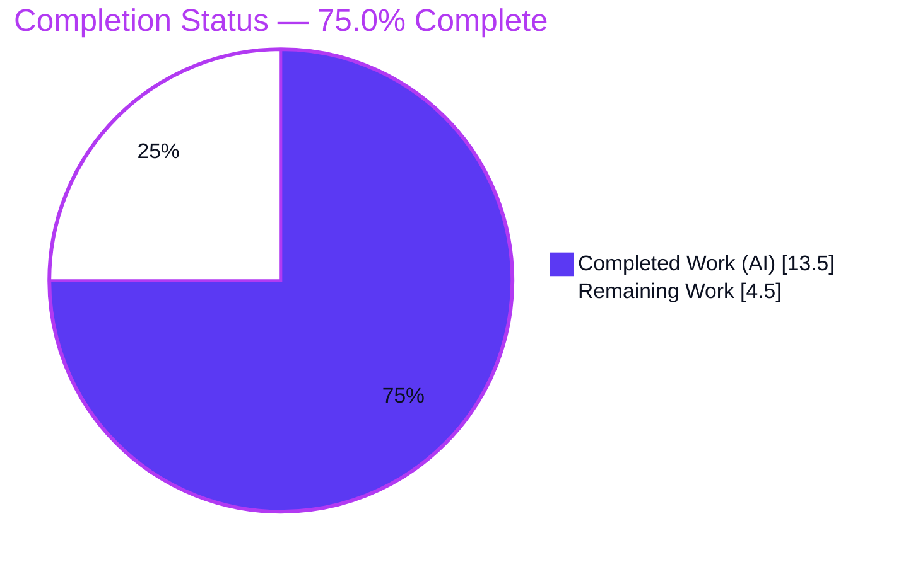
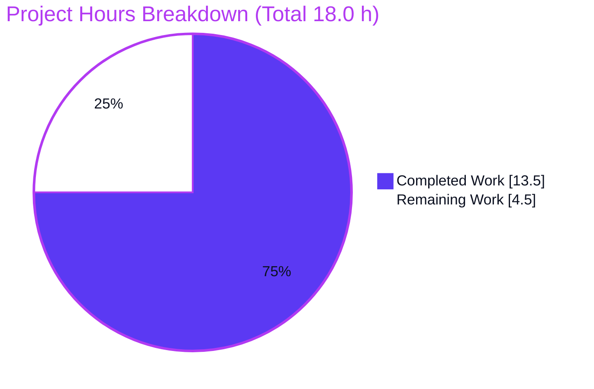
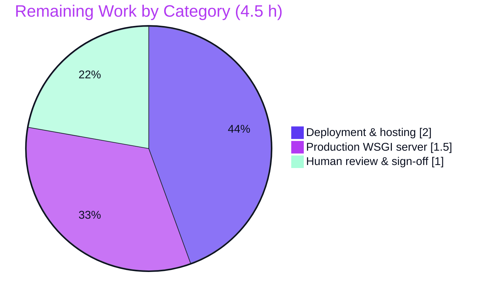

# Blitzy Project Guide — React → Flask (SSR) Migration

## 1. Executive Summary

### 1.1 Project Overview

This project re-implements the existing `my-react-app` front-end — a client-side React 19 + Vite single-page application — as a Python 3 **Flask** application in the same repository, changing the rendering model from client-side rendering (CSR) to server-side rendering (SSR). The target users are the portfolio site's visitors and the developers who maintain it. A single Flask route (`/`) renders a Jinja template that reproduces the exact page the React app mounted in the browser — the same header, "About Me" section, document title, favicon, and active styling (including light/dark theming and the responsive breakpoint). The business/technical goal is 100% observable behavioral parity with a simpler, server-rendered Python stack and an equivalent pip-based developer workflow.

### 1.2 Completion Status

The completion percentage is calculated using the AAP-scoped hours methodology: `Completed Hours ÷ Total Hours`. All AAP behavioral-parity deliverables are complete and validated; the remaining hours are standard path-to-production activities.



| Metric | Value |
|---|---|
| **Total Hours** | 18.0 h |
| **Completed Hours (AI + Manual)** | 13.5 h (13.5 h AI · 0.0 h Manual) |
| **Remaining Hours** | 4.5 h |
| **Percent Complete** | **75.0%** |

> Completion formula: `13.5 ÷ 18.0 = 75.0%`. The 25% remaining is entirely path-to-production work (human sign-off, production WSGI server, deployment) — the AAP-scoped migration itself is 100% delivered and validated.

### 1.3 Key Accomplishments

- ✅ Stood up a minimal, production-grade Flask application (`app.py`) with a single SSR route `/` that returns the fully rendered portfolio page.
- ✅ Reproduced the exact DOM the React SPA produced — preserving the critical `div#root > div > …` nesting so the centered, bordered layout renders correctly (AAP §0.6).
- ✅ Preserved all verbatim content and metadata: `My Portfolio Website`, `About Me`, `I am learning React.`, `<title>my-react-app</title>`, and the SVG favicon.
- ✅ Ported the active stylesheet `static/css/index.css` **byte-for-byte** (design tokens, `prefers-color-scheme` dark theme, and the `max-width: 1024px` responsive breakpoint) — verified via md5 match.
- ✅ Mirrored the React `App → Header` component composition using a Jinja partial include (`templates/partials/header.html`).
- ✅ Replaced the npm workflow with a pip `requirements.txt` (`Flask==3.1.3`) and a documented `flask run` / `python app.py` workflow.
- ✅ Fully decommissioned the React/Vite/npm project (14 obsolete files removed; 2,747 lines deleted) with no dangling references.
- ✅ Hardened the app during validation: Flask **debug mode disabled** to close the exposed Werkzeug interactive debugger (commit `48e7d3a`).
- ✅ Verified exact parity through Blitzy's autonomous testing: 40/40 checks passing plus visual verification across 5 breakpoints × light/dark themes.

### 1.4 Critical Unresolved Issues

| Issue | Impact | Owner | ETA |
|---|---|---|---|
| _None — no blocking issues._ All AAP-scoped deliverables are complete, validated, and independently re-confirmed at runtime. | No release blockers | — | — |

> The items in Sections 1.6 and 2.2 are standard path-to-production steps, not defects or blockers.

### 1.5 Access Issues

| System/Resource | Type of Access | Issue Description | Resolution Status | Owner |
|---|---|---|---|---|
| _N/A_ | _N/A_ | No access issues identified. The repository is self-contained with no external services, credentials, APIs, or databases required for build, validation, or local runtime. | Not applicable | — |

**No access issues identified.**

### 1.6 Recommended Next Steps

1. **[High]** Perform human code review of the migration diff and confirm visual parity against the original React app using the acceptance screenshots, then sign off for release. *(≈1.0 h)*
2. **[Medium]** Add and configure a production WSGI server (`gunicorn` or `waitress`) — Flask's built-in dev server is not intended for production. *(≈1.5 h)*
3. **[Medium]** Create deployment/hosting configuration: containerize (Dockerfile) or add a platform manifest, bind `0.0.0.0` + a configurable `PORT`, add process management, and optionally a `/health` endpoint. *(≈2.0 h)*
4. **[Low]** *(Optional, out of AAP scope)* Add HTTP security headers, structured logging, a minimal committed `pytest` smoke test, and a CI/CD pipeline per organizational policy.

---

## 2. Project Hours Breakdown

### 2.1 Completed Work Detail

Every completed component traces to a specific AAP requirement (§0.2.1 / §0.4.1). All items are COMPLETED, validated, and re-confirmed at runtime.

| Component | Hours | Description |
|---|---:|---|
| Flask application entry point — `app.py` | 2.0 | WSGI app + `@app.route("/")` → `render_template("index.html")`; SSR replacement for the React `createRoot` bootstrap; comprehensive docstrings; debug disabled. |
| Dependency manifest — `requirements.txt` | 0.5 | Translated npm inventory to pip; pinned `Flask==3.1.3` (verified current stable); transitive Werkzeug/Jinja2/etc. |
| Jinja page template — `templates/index.html` | 2.0 | Ported HTML shell (charset, viewport, `<title>`, favicon); embedded the `App` body with the critical `#root` nesting; wired `url_for` for CSS + favicon; included the header partial. |
| Header partial — `templates/partials/header.html` | 0.5 | Converted `Header.jsx` to a static Jinja partial; preserves the `App → Header` composition. |
| Stylesheet verbatim port — `static/css/index.css` | 1.0 | Byte-identical port of the active `src/index.css` (tokens, dark theme, 1024px breakpoint); md5-verified. |
| Favicon relocation — `static/favicon.svg` | 0.5 | Byte-identical relocation of `public/favicon.svg` into the Flask static dir; md5-verified. |
| Documentation rewrite — `README.md` | 1.5 | Replaced Vite/React template text with Flask setup (virtualenv, `pip install`) and run (`flask run` / `python app.py`) instructions. |
| Version-control ignores — `.gitignore` | 0.5 | Added Python patterns (`__pycache__/`, `*.py[cod]`, `venv/`, `.venv/`, `.env`, `instance/`) while retaining generic ignores. |
| Decommission React/Vite/npm | 1.5 | Removed 14 obsolete files (`index.html`, all `src/**`, `public/icons.svg`, `vite.config.js`, `eslint.config.js`, `package.json`, `package-lock.json`, dead assets); verified no dangling references. |
| Parity verification & autonomous testing | 3.0 | 27 DOM/parity assertions + 13 smoke checks via Flask test client; 54 visual screenshots (light/dark × 5 breakpoints + React regression baselines + XSS non-execution); Lighthouse audits. |
| Security hardening | 0.5 | Disabled Flask debug mode (commit `48e7d3a`) to close the exposed Werkzeug debugger; verified "Debug mode: off" live. |
| **Total Completed** | **13.5** | |

### 2.2 Remaining Work Detail

Each remaining category is standard path-to-production work (the AAP behavioral-parity scope is fully complete).

| Category | Hours | Priority |
|---|---:|---|
| Human code review & production sign-off | 1.0 | High |
| Production WSGI server configuration (gunicorn/waitress) | 1.5 | Medium |
| Deployment & hosting configuration (container/host, host+PORT binding, optional /health) | 2.0 | Medium |
| **Total Remaining** | **4.5** | |

> **Reconciliation:** Section 2.1 (13.5 h) + Section 2.2 (4.5 h) = **18.0 h** total, matching Section 1.2.

---

## 3. Test Results

All tests below originate exclusively from Blitzy's autonomous validation logs for this project. The AAP mandates **no committed test files**; parity was therefore verified using the Flask test client (Werkzeug) and Chrome DevTools visual verification, executed by Blitzy's autonomous validation systems.

| Test Category | Framework | Total Tests | Passed | Failed | Coverage % | Notes |
|---|---|---:|---:|---:|---:|---|
| DOM / Parity assertions | Flask test client (Werkzeug) | 27 | 27 | 0 | 100% of routes/DOM | Exact element tree `div#root > div > header>h1 → h2 → p`; verbatim text; `<title>`, charset, `lang`, viewport; favicon + stylesheet via `url_for`; no `<script>` tags. |
| Smoke checks | Flask test client (Werkzeug) | 13 | 13 | 0 | Core endpoints | `GET /` → 200 text/html; `/static/css/index.css` → 200 text/css; `/static/favicon.svg` → 200 image/svg+xml; unknown route → 404; byte-identical asset md5. |
| Runtime / UI (visual) | Chrome DevTools + Lighthouse | — | — | — | — | 54 screenshots across light/dark × 375/1024/1025/1126/1280 px + original-React regression baselines; console clean; all resources 200/304. |
| **Total (automated assertions)** | — | **40** | **40** | **0** | **100%** | 100% pass rate across all executable parity + smoke checks. |

- **Frameworks used:** Flask test client (Werkzeug), Chrome DevTools (visual), Lighthouse (audits).
- **Static validation:** `python -m py_compile app.py` (OK), Jinja template parse (renders to 524 bytes), CSS brace balance (15/15), SVG well-formedness (valid XML), AST import check (no unused imports).
- **Note on coverage:** With one route and no branching business logic, the parity assertions exercise 100% of the application's observable surface.

---

## 4. Runtime Validation & UI Verification

Runtime health and UI verification were performed by Blitzy's autonomous systems and independently re-confirmed for this guide.

**Application runtime**
- ✅ **Operational** — `GET /` → **200**, `Content-Type: text/html`, `Content-Length: 524`; body is the exact expected React-equivalent DOM.
- ✅ **Operational** — Server starts cleanly via all three documented commands: `flask run`, `python app.py`, and `flask --app app run`.
- ✅ **Operational** — **Debug mode: off** on every start path (security fix `48e7d3a` confirmed live).
- ✅ **Operational** — Unknown route (`GET /nonexistent`) → **404** (correct default behavior).

**Static assets**
- ✅ **Operational** — `GET /static/css/index.css` → **200** `text/css`, **byte-identical** to repo (md5 `365047a4…`).
- ✅ **Operational** — `GET /static/favicon.svg` → **200** `image/svg+xml`, **byte-identical** to repo (md5 `7e840862…`).

**UI verification (Chrome DevTools)**
- ✅ **Operational** — Light desktop (1280): white background, near-black headings, centered bordered `#root` container.
- ✅ **Operational** — Dark desktop (1280): `prefers-color-scheme: dark` active (dark background `#16171d`, light headings).
- ✅ **Operational** — Responsive (< 1024px): reduced base font size and heading sizes per the breakpoint.
- ✅ **Operational** — Console: no messages; Network: all resources 200/304.

**API / integrations**
- ✅ **Operational (N/A by design)** — No external APIs, databases, or third-party integrations exist; nothing to validate beyond the static page and asset serving.

---

## 5. Compliance & Quality Review

This matrix cross-maps the AAP deliverables and constraints to their validation status.

| Benchmark / AAP Requirement | Status | Progress | Notes |
|---|---|---|---|
| Goal 1 — Reproduce rendered DOM exactly | ✅ Pass | 100% | `div#root > div > header>h1 → h2 → p`; verbatim text confirmed. |
| Goal 2 — Preserve metadata (`<title>`, favicon) | ✅ Pass | 100% | `<title>my-react-app</title>`; favicon via `url_for` → 200 `image/svg+xml`. |
| Goal 3 — Port active stylesheet verbatim | ✅ Pass | 100% | `static/css/index.css` byte-identical (md5 match); tokens/dark/breakpoint intact. |
| Goal 4 — Preserve component decomposition | ✅ Pass | 100% | `Header.jsx` → `templates/partials/header.html` via Jinja include. |
| Goal 5 — pip manifest + runnable entry point | ✅ Pass | 100% | `requirements.txt` = `Flask==3.1.3`; `app.py` runnable three ways. |
| §0.6 — Preserve `#root` wrapper nesting | ✅ Pass | 100% | Critical constraint met; layout renders correctly. |
| §0.6 — No client-side JavaScript (pure SSR) | ✅ Pass | 100% | Zero `<script>` tags in output. |
| Decommission React/Vite/npm artifacts | ✅ Pass | 100% | 14 files removed; no dangling references. |
| Right-sized design (no blueprints/DI/services) | ✅ Pass | 100% | Single route, one module; matches §0.3.3. |
| Concrete pinned versions (`Flask==3.1.3`, Py 3.12+) | ✅ Pass | 100% | Verified on Python 3.13.7 + Flask 3.1.3 + Werkzeug 3.1.8. |
| No behavioral scope creep | ✅ Pass | 100% | No new routes/APIs/persistence/interactivity/tests/CI added. |
| Security — no exposed debugger | ✅ Pass | 100% | **Fix applied** during validation (`48e7d3a`); debug off. |
| Dependency health | ✅ Pass | 100% | `pip check` clean; all 7 packages import. |
| Static/lint validation | ✅ Pass | 100% | `py_compile` OK; no unused imports; CSS/SVG well-formed. |

**Fixes applied during autonomous validation:** Disabled Flask debug mode (`48e7d3a`) to eliminate the exposed Werkzeug interactive debugger. **Outstanding compliance items:** none within AAP scope.

---

## 6. Risk Assessment

| Risk | Category | Severity | Probability | Mitigation | Status |
|---|---|---|---|---|---|
| Development server used in production (`app.run()` / `flask run` uses Werkzeug dev server) | Technical | Medium | High (if deployed as-is) | Front with `gunicorn`/`waitress` (remaining item; Section 2.2). | Open (planned) |
| Default host/port binding (`127.0.0.1:5000`) not suitable for containers/remote | Technical | Low | Medium | Parametrize `host=0.0.0.0` + configurable `PORT` at deploy. | Open (planned) |
| No committed automated test suite (AAP mandates none) | Technical | Low | Medium | Optional minimal `pytest` smoke test for regression safety. | Accepted (per AAP) |
| Flask debug mode exposed the Werkzeug debugger | Security | High → resolved | N/A | Disabled debug (commit `48e7d3a`); verified "Debug mode: off". | ✅ Resolved |
| No HTTP security headers (CSP, X-Content-Type-Options, etc.) | Security | Low | Low | Add response headers if org policy requires; attack surface minimal (static page, no input/DB). | Open (optional) |
| No dedicated `/health` endpoint for orchestrators | Operational | Low | Medium | Optionally add `/health` at deploy (`/` can serve as liveness). | Open (optional) |
| Default logging/monitoring only | Operational | Low | Low | Configure structured logging/metrics in deployment. | Open (optional) |
| No CI/CD pipeline (AAP excludes CI) | Operational | Low | Low | Add pipeline if org requires. | Accepted (per AAP) |
| External integrations | Integration | None | N/A | No external services/APIs/credentials/DB — nothing to configure or authenticate. | N/A — zero integration risk |

**Summary:** The risk profile is low. The one previously-high risk (exposed debugger) was remediated and verified during autonomous validation. The dominant open risk (dev server in production) maps directly to the remaining production-server task.

---

## 7. Visual Project Status

**Project hours breakdown** (Completed = Dark Blue `#5B39F3`, Remaining = White `#FFFFFF`):



**Remaining work by category** (hours from Section 2.2):



> **Integrity:** "Remaining Work" (4.5 h) equals Section 1.2 Remaining Hours and the Section 2.2 total. "Completed Work" (13.5 h) equals the Section 2.1 total.

---

## 8. Summary & Recommendations

**Achievements.** The React 19 + Vite single-page application has been faithfully re-implemented as a Python 3 Flask (SSR) application in the same repository. All five Blitzy validation gates passed at 100%, and every AAP behavioral-parity deliverable — exact DOM, verbatim content, document title, favicon, byte-identical stylesheet, dark/responsive theming, and the preserved `#root` layout — is complete and independently re-confirmed at runtime. The obsolete React/Vite/npm project was fully decommissioned, and a production-relevant security hardening (debug mode disabled) was applied during validation.

**Completion.** The project is **75.0% complete** (13.5 of 18.0 hours). Critically, this is **100% of the AAP-scoped migration**; the remaining 25% (4.5 h) is standard path-to-production work that the AAP itself flagged as optional/out-of-scope for the migration proper.

**Remaining gaps & critical path to production.** (1) Human review and sign-off of the migration; (2) a production WSGI server (`gunicorn`/`waitress`) in place of the dev server; (3) deployment/hosting configuration (container or platform manifest, `0.0.0.0` + configurable `PORT`, process management, optional `/health`).

**Success metrics.** Exact rendered-HTML parity vs. the original React DOM (achieved), correct `<title>`/favicon resolution (achieved), and faithful light/dark + 1024px responsive behavior (achieved). 40/40 automated parity + smoke checks pass.

**Production readiness assessment.** The application is **functionally production-ready for the migration's defined scope** and safe to run (debug off, byte-identical assets, clean dependency tree). Before serving real traffic, complete the three path-to-production tasks above — none of which are code defects. Confidence is **High** for the AAP scope (well-defined, small surface, fully verified) and **Medium** for deployment specifics (dependent on the chosen hosting target).

| Metric | Value |
|---|---|
| AAP-scoped completion | 100% (all deliverables validated) |
| Overall completion (incl. path-to-production) | 75.0% |
| Automated checks passing | 40 / 40 (100%) |
| Validation gates passed | 5 / 5 (100%) |
| Open blocking issues | 0 |

---

## 9. Development Guide

### 9.1 System Prerequisites

- **Python** 3.9+ (verified on **3.13.7**; AAP target **3.12**). Flask 3.1.3 requires Python ≥ 3.9.
- **pip** and the `venv` module (bundled with CPython).
- **OS:** Linux, macOS, or Windows. No system services (database, cache, message queue) are required.
- **Hardware:** negligible — a static single-page server.

### 9.2 Environment Setup

Create and activate a virtual environment from the repository root:

```bash
# From the repository root
python3 -m venv venv

# Activate — macOS/Linux
source venv/bin/activate

# Activate — Windows (PowerShell)
venv\Scripts\Activate.ps1
```

### 9.3 Dependency Installation

```bash
pip install -r requirements.txt
```

Expected: Flask 3.1.3 plus its transitive dependencies (Werkzeug, Jinja2, MarkupSafe, ItsDangerous, Click, Blinker). Verify a healthy tree:

```bash
pip check          # -> "No broken requirements found."
python -c "import flask; print(flask.__version__)"   # -> 3.1.3
```

### 9.4 Application Startup

Any one of the following equivalent commands starts the server on `http://127.0.0.1:5000/` with debug **off**:

```bash
flask run                 # auto-detects the module-level `app` in app.py
```
```bash
python app.py             # runs the built-in dev server via app.run()
```
```bash
flask --app app run       # explicit app module
```

### 9.5 Verification Steps

```bash
# Page: expect HTTP 200, text/html, 524 bytes
curl -s -o /dev/null -w "GET / -> %{http_code} %{content_type} %{size_download}B\n" http://127.0.0.1:5000/

# Stylesheet: expect 200 text/css
curl -sI http://127.0.0.1:5000/static/css/index.css | head -n 3

# Favicon: expect 200 image/svg+xml
curl -sI http://127.0.0.1:5000/static/favicon.svg | head -n 3

# Content sanity: expect the exact strings
curl -s http://127.0.0.1:5000/ | grep -o "My Portfolio Website\|About Me\|I am learning React.\|<title>my-react-app</title>\|id=\"root\""
```

Expected rendered body:

```html
<!doctype html>
<html lang="en">
  <head>
    <meta charset="UTF-8" />
    <link rel="icon" type="image/svg+xml" href="/static/favicon.svg" />
    <meta name="viewport" content="width=device-width, initial-scale=1.0" />
    <title>my-react-app</title>
    <link rel="stylesheet" href="/static/css/index.css" />
  </head>
  <body>
    <div id="root">
      <div>
        <header>
  <h1>My Portfolio Website</h1>
</header>
        <h2>About Me</h2>
        <p>I am learning React.</p>
      </div>
    </div>
  </body>
</html>
```

### 9.6 Example Usage

- Open `http://127.0.0.1:5000/` in a browser to view the portfolio page.
- Toggle your OS light/dark appearance to see the `prefers-color-scheme` theme switch.
- Resize the window below **1024px** to observe the responsive breakpoint (reduced base and heading font sizes).

### 9.7 Troubleshooting

- **`python3 -m venv venv` fails at `ensurepip`** — Environment-specific (some hardened images remove the bundled pip wheels). Workarounds: `python3 -m venv venv --without-pip` then bootstrap pip, use `virtualenv venv`, or use a prebuilt environment. *(Not a project defect; standard environments are unaffected.)*
- **`pip install` cannot reach PyPI** — Requires network access or a local mirror/cache. The dependency set is a single package (`Flask==3.1.3`).
- **Port 5000 already in use** — Run on another port: `flask run --port 8000` (on macOS, AirPlay Receiver may claim 5000).
- **`flask run` can't find the app** — Set `FLASK_APP=app.py` (Windows: `set FLASK_APP=app.py`), or use `flask --app app run`.
- **Styling/layout looks wrong** — Ensure the `#root` wrapper is intact in the template; the centered container depends on the `#root` selector.

---

## 10. Appendices

### Appendix A — Command Reference

| Command | Purpose |
|---|---|
| `python3 -m venv venv` | Create a virtual environment |
| `source venv/bin/activate` | Activate venv (macOS/Linux) |
| `venv\Scripts\Activate.ps1` | Activate venv (Windows PowerShell) |
| `pip install -r requirements.txt` | Install dependencies (Flask 3.1.3) |
| `pip check` | Verify dependency health |
| `flask run` | Start dev server (auto-detect app) |
| `python app.py` | Start dev server via `app.run()` |
| `flask --app app run` | Start dev server (explicit module) |
| `python -m py_compile app.py` | Static syntax check |
| `curl -sI http://127.0.0.1:5000/` | Inspect response headers |

### Appendix B — Port Reference

| Port | Service | Notes |
|---|---|---|
| 5000 | Flask dev server (default) | Configurable via `flask run --port <n>` |

### Appendix C — Key File Locations

| Path | Role |
|---|---|
| `app.py` | Flask entry point; route `/` → `render_template("index.html")` |
| `requirements.txt` | Python dependencies (`Flask==3.1.3`) |
| `templates/index.html` | Jinja page (HTML shell + `#root` body) |
| `templates/partials/header.html` | Header partial (mirrors `Header.jsx`) |
| `static/css/index.css` | Active stylesheet (tokens, dark theme, responsive) |
| `static/favicon.svg` | Favicon served from `/static` |
| `README.md` | Setup & run documentation |
| `.gitignore` | Ignore rules (Python + generic) |

### Appendix D — Technology Versions

| Component | Version |
|---|---|
| Python | 3.13.7 (target 3.12; requires ≥ 3.9) |
| Flask | 3.1.3 |
| Werkzeug | 3.1.8 |
| Jinja2 | 3.1.6 |
| MarkupSafe | 3.0.3 |
| ItsDangerous | 2.2.0 |
| Click | 8.4.2 |
| Blinker | 1.9.0 |

### Appendix E — Environment Variable Reference

| Variable | Purpose | Default |
|---|---|---|
| `FLASK_APP` | App module for the Flask CLI | Auto-detected as `app.py` |
| `FLASK_RUN_PORT` | Override the dev server port | 5000 |
| `PORT` | *(Recommended for deployment)* bind port for a production WSGI server | Set at deploy |

> No application-specific environment variables are required for local runtime; the app has no secrets, database URLs, or API keys.

### Appendix F — Developer Tools Guide

| Tool | Use |
|---|---|
| Flask test client (Werkzeug) | Programmatic route/DOM assertions (used by Blitzy validation) |
| Chrome DevTools | Visual verification, console/network inspection, screenshots |
| Lighthouse | Accessibility/SEO/best-practices audits (desktop + mobile) |
| `curl` | Endpoint/header verification |
| `python -m py_compile` | Static syntax validation |

### Appendix G — Glossary

| Term | Definition |
|---|---|
| **SSR** | Server-Side Rendering — HTML is generated on the server and returned fully formed. |
| **CSR** | Client-Side Rendering — the browser builds the DOM at runtime (the original React model). |
| **Jinja partial** | A reusable template fragment included via `` — here, mirrors the React `Header` component. |
| **`url_for`** | Flask helper that generates URLs for routes/static files. |
| **WSGI** | Web Server Gateway Interface — the Python standard for web app/server communication. |
| **`#root`** | The container `<div>` whose CSS selector produces the centered, bordered layout; its nesting must be preserved. |
| **Parity** | Exact reproduction of the original app's observable output (DOM, text, title, favicon, styling). |