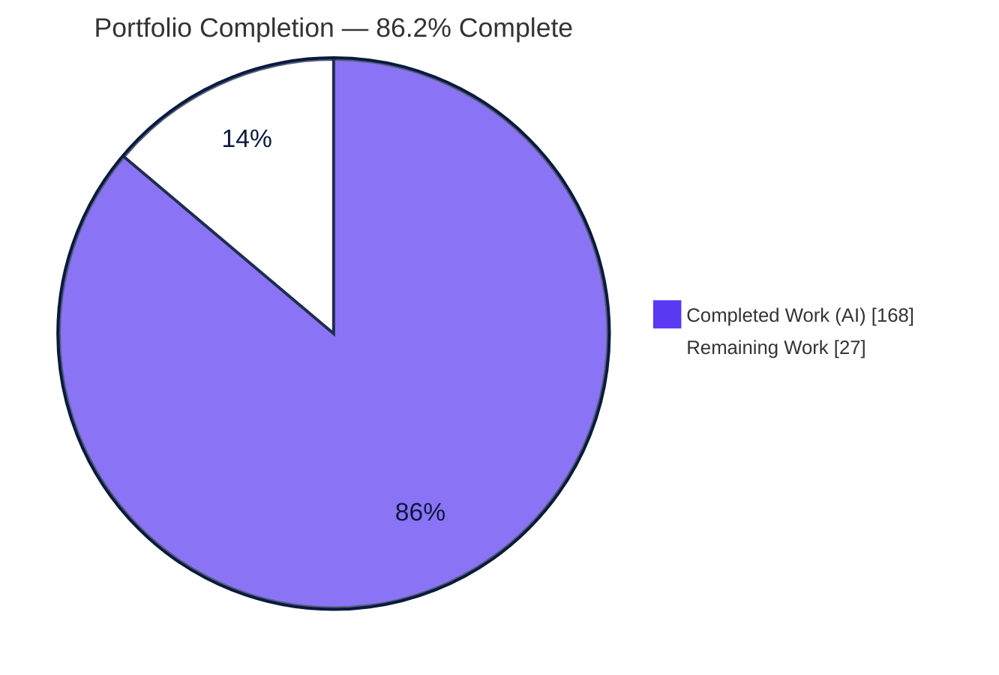
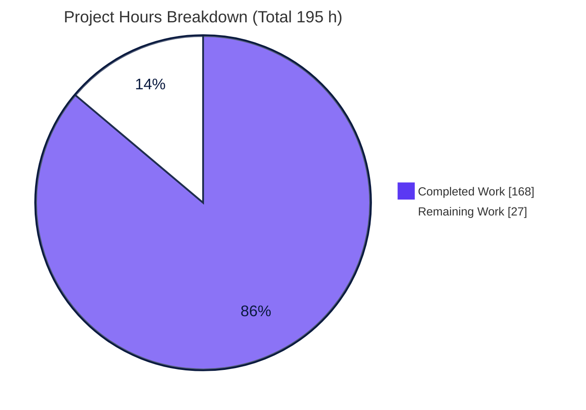
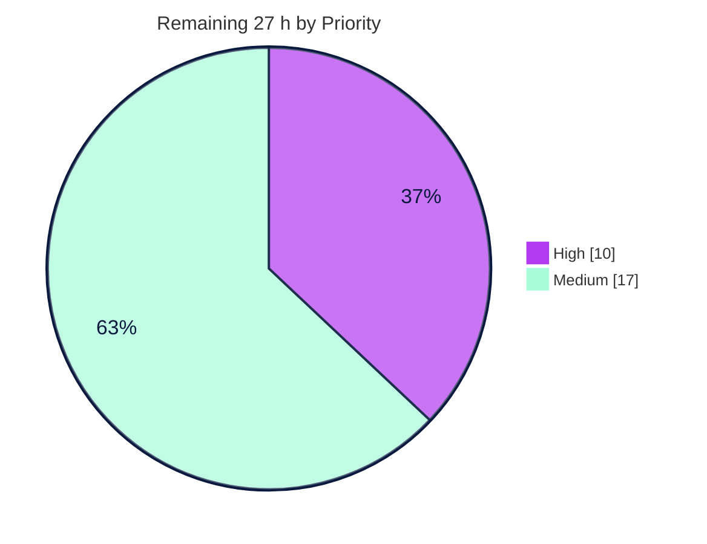
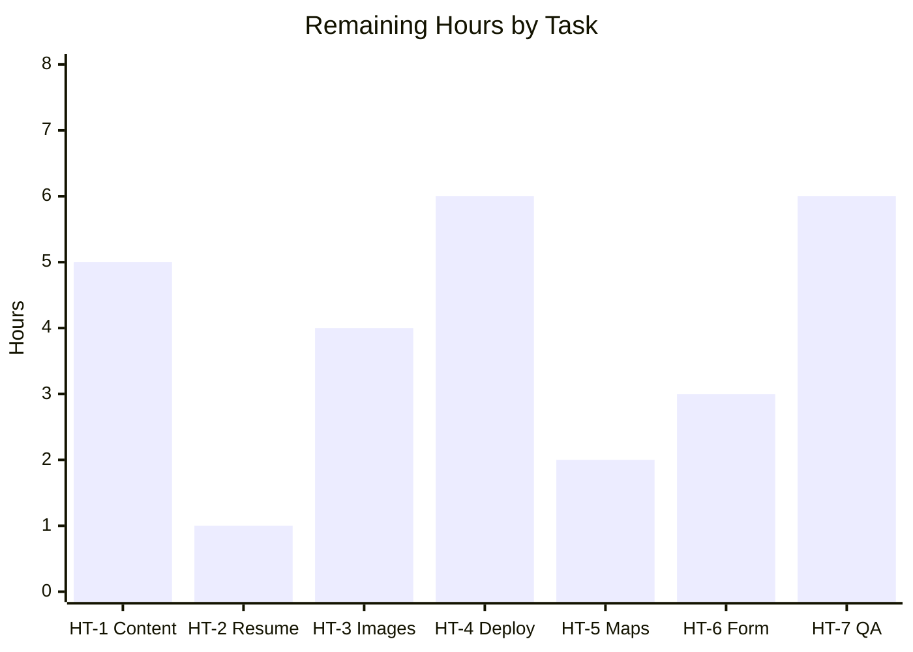

# Blitzy Project Guide — `my-react-app` Personal Portfolio SPA

> **Project:** Premium personal portfolio website for a Software QA Engineer & React Developer
> **Stack:** React 19 · Vite 8 · Framer Motion · React Router v8 · React Icons · CSS Modules
> **Branch:** `blitzy-1626e0fe-a39b-4547-be05-12c9d81c24b0`
> **Status legend — Completed / AI Work:** 🟦 Dark Blue `#5B39F3` · **Remaining / Not Completed:** ⬜ White `#FFFFFF`

---

## 1. Executive Summary

### 1.1 Project Overview

This project transforms a greenfield Vite + React 19 scaffold into a complete, modern, premium **single-page personal portfolio** for a professional who identifies as a Software QA Engineer & React Developer, targeting recruiters, prospective clients, and software companies. The deliverable is a client-side SPA composed of a sticky glassmorphism navigation bar, **eight content sections** (Hero, About, Skills, Projects, Experience Timeline, Services, Resume, Contact), and a footer — built on a reusable CSS-variable design-token system with a dark-blue/white/royal-blue palette, manual dark-mode toggle, smooth scrolling, subtle animations, full responsiveness, accessibility, and SEO. It is a frontend-only build with no backend, database, or authentication in scope.

### 1.2 Completion Status

The completion percentage is calculated using the AAP-scoped (PA1) methodology: `Completed Hours ÷ Total Hours`, where the work universe is the AAP code deliverables plus standard path-to-production activities. **Every AAP code deliverable is complete and validated;** the remaining hours are path-to-production work (real content, deployment, final human QA).



| Metric | Value |
| --- | --- |
| **Total Hours** | **195 h** |
| **Completed Hours (AI + Manual)** | **168 h** (168 h AI · 0 h Manual) |
| **Remaining Hours** | **27 h** |
| **Percent Complete** | **86.2 %** |

> Calculation: `168 ÷ 195 = 86.15 % → 86.2 %`. Manual hours are 0 because the Final Validator required zero fixes — all completed work was delivered autonomously.

### 1.3 Key Accomplishments

- ✅ All **8 content sections** implemented (Hero, About, Skills, Projects, Experience, Services, Resume, Contact) plus sticky **Navbar** and **Footer**.
- ✅ **13 reusable UI primitives** + **4 layout** components, all composed from a single design-token layer (**0 hardcoded colors** in `*.module.css`).
- ✅ **Client-side routing** (react-router v8) with `React.lazy` + `Suspense` code-splitting (separate Home / NotFound chunks).
- ✅ **7 custom hooks** (theme with `localStorage` + OS-seed, typewriter, active-section observer, contact-form, scroll-to-top, media-query, reduced-motion).
- ✅ **Manual dark-mode toggle** with persistence, converting the scaffold's automatic `prefers-color-scheme` mode; palette migrated purple → royal-blue `#2563EB`.
- ✅ **Accessibility** (semantic landmarks, aria labels, focus trap/restore, keyboard nav) and **SEO** (title/meta/OG/Twitter + robots.txt/sitemap.xml).
- ✅ **3 dependencies** added exactly per AAP (framer-motion 12.42.2, react-router 8.1.0, react-icons 5.7.0); **all 5 AAP deletions** performed.
- ✅ **Quality gates 100%:** production build exit 0 (446 modules), ESLint **0 errors / 0 warnings** (87 files), **0 npm vulnerabilities**, zero console errors/warnings at runtime.

### 1.4 Critical Unresolved Issues

There are **no unresolved code defects**. The items below are AAP-sanctioned user-content placeholders that block a *real* public launch (not the build/lint/runtime gates).

| Issue | Impact | Owner | ETA |
| --- | --- | --- | --- |
| Placeholder content in `src/data/*` (`johndoe`, `example.com` URLs, sample bio) | Site shows sample identity, not the real portfolio | Content owner / Developer | 0.5 day |
| `public/resume.pdf` is a 690-byte stub | Download/View Resume actions serve a non-real file | Content owner | 0.25 day |
| Profile + 6 project images are SVG placeholders | Visuals not representative of real work | Designer / Developer | 0.5 day |
| No hosting/deployment configured | Site is not publicly reachable | DevOps / Developer | 1 day |

### 1.5 Access Issues

| System / Resource | Type of Access | Issue Description | Resolution Status | Owner |
| --- | --- | --- | --- | --- |
| Google Maps Platform | API key (optional) | No key provided; Contact uses a generic `<iframe>` placeholder embed | Open — needed only for keyed Embed/JS API | Developer |
| Email delivery (emailjs / serverless) | Account / API key (optional) | No provider configured; contact form shows client-side success only | Open — optional per AAP §0.3.2 | Developer |
| Hosting provider (Vercel/Netlify/CF Pages) | Account + repo connection | No host account/CD connected yet | Open — required for public launch | DevOps |

> No access issues block **build, lint, or local runtime** — all validated locally with no credentials required. The above affect *public deployment and optional integrations* only.

### 1.6 Recommended Next Steps

1. **[High]** Populate `src/data/*` with real content and swap in the real **resume PDF** *(HT-1, HT-2)*.
2. **[High]** Replace profile + project **image placeholders** with optimized real media *(HT-3)*.
3. **[Medium]** Configure **deployment & hosting** with an SPA catch-all rewrite so deep links + the 404 route resolve *(HT-4)*.
4. **[Medium]** Wire the **real Google Maps embed** and (optionally) the **contact-form delivery** integration *(HT-5, HT-6)*.
5. **[Medium]** Run **final cross-browser/device QA + Lighthouse/a11y audit** with real content and obtain stakeholder sign-off *(HT-7)*.

---

## 2. Project Hours Breakdown

### 2.1 Completed Work Detail

All completed work was delivered autonomously (AI). Each component traces to an AAP requirement group.

| Component | Hours | Description |
| --- | --- | --- |
| Design system foundation | 10 | `variables.css` light+dark tokens, `global.css` reset, `#root` de-constraint, purple→royal-blue palette migration |
| Build config & docs | 5 | `package.json` (3 deps + lockfile), `vite.config.js` `@`→/src alias + esnext target, README rewrite |
| SEO document head & crawler assets | 6 | `index.html` title/meta/OG/Twitter/preconnect, `robots.txt`, `sitemap.xml`, `og-image`, `llms.txt` |
| App bootstrap & routing | 6 | `main.jsx` ThemeProvider + router composition, `App.jsx` lazy Routes + Suspense + Loader fallback |
| Reusable UI primitive library (×13) | 30 | Button, Card, SectionTitle, Container, Badge, Modal (focus-trap/portal), ProgressBar, ThemeToggle, SocialLinks, StatCard, Loader, BackToTop, Reveal (jsx + module.css each) |
| Layout shell (×4) | 16 | Navbar (sticky/glass/mobile-hamburger/active-link), Footer (multi-column), Layout, Logo |
| Custom hooks (×7) | 15 | useTheme (context/persistence/OS-seed), useTypewriter, useActiveSection (IntersectionObserver), useContactForm, useScrollToTop, useMediaQuery, usePrefersReducedMotion |
| Utilities (×5) + content data (×10) | 13 | validators, scroll, constants, animations, index barrel; 10 data modules |
| Hero section | 7 | Heading, typewriter, profile image, CTAs, socials, animated background |
| About section | 5 | Summary, objective, education, achievements, stat cards |
| Skills section + SkillCard | 6 | 4 skill groups with animated progress bars |
| Projects section + ProjectCard + ProjectModal | 10 | Responsive card grid + accessible details modal |
| Experience section + TimelineItem | 6 | Vertical timeline (education, QA, React journey, certifications) |
| Services section + ServiceCard | 4 | Six service offerings with icons |
| Resume section | 2 | Download + View resume actions |
| Contact section + ContactForm + ContactInfo | 8 | Validated form, success/error states, Google Maps iframe |
| Cross-cutting quality | 10 | Responsive breakpoints, a11y (aria/focus/contrast), performance (memo/lazy), reduced-motion guards |
| Code review & QA remediation | 9 | CP1/CP2/final-acceptance review-finding fixes across commit history |
| **Total Completed** | **168** | **Matches Completed Hours in §1.2** |

### 2.2 Remaining Work Detail

All remaining work is path-to-production. Each category traces to an AAP-flagged placeholder (§0.5.4) or a standard path-to-production need.

| Category | Hours | Priority |
| --- | --- | --- |
| Real content population in `src/data/*` (bio, objective, real GitHub/demo URLs, certifications, contact) | 5 | High |
| Replace `public/resume.pdf` stub with real resume PDF | 1 | High |
| Replace profile + 6 project image placeholders with optimized real media | 4 | High |
| Deployment & hosting setup (host, domain, SPA 404 rewrite, env, pipeline) | 6 | Medium |
| Real Google Maps embed / Maps Platform API key | 2 | Medium |
| Contact-form real delivery integration (emailjs/serverless) | 3 | Medium |
| Final human QA & acceptance (cross-browser, device, Lighthouse/a11y audit, sign-off, smoke test) | 6 | Medium |
| **Total Remaining** | **27** | **Matches Remaining Hours in §1.2 and §7** |

### 2.3 Completion Calculation & Methodology

- **Total Project Hours** = Completed + Remaining = `168 + 27 = 195 h` *(satisfies Integrity Rule 2)*.
- **Completion %** = `Completed ÷ Total = 168 ÷ 195 = 86.15 % → 86.2 %`.
- **Scope basis (PA1):** denominator includes only AAP code deliverables + path-to-production. Items explicitly out of scope per AAP §0.6.2 (backend, auth, automated test suite/CI-CD as a feature, TypeScript migration, i18n, SSR) are **excluded** from the total.
- **Manual vs AI:** 168 h AI + 0 h Manual — the Final Validator made no code changes; the implementation was complete and correct on arrival.

---

## 3. Test Results

Per **AAP §0.6.2, automated unit testing and CI/CD are explicitly out of scope** — no test runner exists in the scaffold and none was requested. The "no console errors/warnings" requirement is satisfied through the ESLint contract and runtime validation. The table below aggregates the **quality gates executed by Blitzy's autonomous validation systems** (all originate from this project's validation logs).

| Test Category | Framework / Tool | Total Checks | Passed | Failed | Coverage % | Notes |
| --- | --- | --- | --- | --- | --- | --- |
| Unit Tests | — (none) | 0 | 0 | 0 | N/A | Out of AAP scope §0.6.2 — no test runner requested |
| Static Analysis (Lint) | ESLint 10 (flat: core + react-hooks + react-refresh) | 87 files | 87 | 0 | 100 % of files | `eslint . --no-fix --max-warnings 0` exit 0; 0 errors / 0 warnings |
| Build / Compile | Vite 8 (`vite build`) | 446 modules | 446 | 0 | 100 % of modules | Exit 0, ~314 ms; code-split chunks emitted |
| Dependency Audit | npm | full tree | pass | 0 vulns | — | `npm ci` clean; `npm audit` = 0 vulnerabilities |
| Runtime Console (dev + prod) | Chrome DevTools | 2 environments | 2 | 0 | — | :5173 and :4173 both — 0 console errors / 0 warnings |
| Runtime Feature Verification | Chrome DevTools (manual E2E) | 8 flows | 8 | 0 | — | Nav scroll, dark-mode, contact form, project modal, back-to-top, mobile menu, active-link, 404 route |

> **Integrity note:** these are the exact autonomous validation activities recorded for this project; no external or fabricated test suite is reported.

---

## 4. Runtime Validation & UI Verification

**Runtime health — ✅ Operational**
- ✅ Dev server (`:5173`) renders all 8 sections + sticky navbar + footer; Vite ready ~164 ms.
- ✅ Production preview (`:4173`) renders identically; **zero console messages** even unfiltered.
- ✅ **Zero console errors and zero warnings** in both environments, re-checked after every interaction.

**Feature verification — ✅ Operational**
- ✅ Navigation: nav links smooth-scroll to the correct section with a 72 px `scroll-margin-top` offset; active-link highlighting via `aria-current` + IntersectionObserver.
- ✅ Dark-mode toggle: sets `<html data-theme="dark">`, persists `localStorage.theme`, seeds from OS preference; `aria-pressed`/`aria-label` update.
- ✅ Contact form: empty→submit disabled; invalid email→inline error; valid→enabled; submit→success message + reset.
- ✅ Project modal: opens as `role="dialog"`, focus moves to close button, Escape closes and restores focus to the trigger (focus trap/restore correct).
- ✅ Back-to-top: hidden at top, appears on scroll, smooth-scrolls to top.
- ✅ Responsive mobile menu (@390 px): desktop links collapse to a hamburger; `aria-expanded` toggles; selecting a link scrolls and closes the menu.
- ✅ 404 route: unknown path renders NotFound with a working "Back to Home" link.

**Content/integration — ⚠ Partial (pending user content — see §2.2 / §6)**
- ⚠ Contact form **delivery**: client-side success only; no message is transmitted until an integration is added (HT-6).
- ⚠ Google Maps: generic `<iframe>` placeholder until a real embed/key is configured (HT-5).
- ⚠ Project **GitHub/Live-Demo** links: placeholder `johndoe`/`example.com` URLs until real data is entered (HT-1).
- ⚠ Resume download & images: serve stub/placeholder assets until replaced (HT-2, HT-3).

---

## 5. Compliance & Quality Review

Cross-map of AAP deliverables and the "Enterprise React Portfolio Development Standards v1.0" rules to their validation status.

| Benchmark / Requirement (AAP §0.7, §0.5) | Status | Progress | Evidence |
| --- | --- | --- | --- |
| Functional components + Hooks only (no classes) | ✅ Pass | 100% | 37 `.jsx` components; 7 hooks |
| CSS Modules + CSS Variables; **no 3rd-party UI library** | ✅ Pass | 100% | 32 `*.module.css`; only framer-motion/react-router/react-icons added |
| Zero hardcoded color values in modules | ✅ Pass | 100% | 0 hardcoded colors; all trace to `variables.css` tokens |
| Mandated 8-folder structure under `src/` | ✅ Pass | 100% | components, sections, pages, assets, hooks, utils, data, styles all present |
| Performance: lazy-load + Suspense + memoization + small bundle | ✅ Pass | 100% | Route-level `React.lazy`; Home/NotFound chunks; index gzip ~91 kB |
| Animation restraint + `prefers-reduced-motion` guard | ✅ Pass | 100% | Framer Motion `whileInView`; reduced-motion hook + CSS guard |
| Accessibility: semantic HTML, `alt`, keyboard, contrast, `aria-label` | ✅ Pass | 100% | Semantic landmarks, focus trap/restore, aria on icon controls |
| SEO: meaningful title + meta description + semantic headings | ✅ Pass | 100% | `index.html` title/description/OG/Twitter; single `h1`, `h2` per section |
| Forms: validate every input, success/error, prevent invalid submit | ✅ Pass | 100% | `validators.js` + `useContactForm`; disabled invalid submit |
| **No console errors and no warnings** (ESLint contract) | ✅ Pass | 100% | ESLint 0/0 across 87 files; runtime console clean |
| Preserve scaffold contract (`createRoot` + `StrictMode`, ESM) | ✅ Pass | 100% | Extended in `main.jsx`; ESLint config unmodified (reference) |
| Theme: convert auto dark-mode → manual toggle w/ persistence | ✅ Pass | 100% | `useTheme` data-attribute + localStorage + OS seed |
| Build integrity: complete code, no placeholders, builds cleanly | ✅ Pass | 100% | Zero stubs/TODO/FIXME; `vite build` exit 0 |
| Required deletions (index.css, App.css, Header.jsx, react/vite.svg) | ✅ Pass | 100% | All 5 confirmed removed |
| Real content / media (resume, images, project URLs, bio) | ⬜ Remaining | 0% | AAP-sanctioned placeholders (§0.5.4) — HT-1/2/3 |
| Deployment to a public host | ⬜ Remaining | 0% | Path-to-production — HT-4 |

**Fixes applied during autonomous validation:** review cycles (CP1/CP2/final-acceptance) resolved findings including 768 px navbar overflow (collapse to hamburger), reduced-motion guards, ProjectCard features/a11y, Escape-to-close returning focus to the hamburger, and SEO document-head hardening. The Final Validator subsequently required **zero additional fixes**.

---

## 6. Risk Assessment

| Risk | Category | Severity | Probability | Mitigation | Status |
| --- | --- | --- | --- | --- | --- |
| Placeholder content shipped if deployed as-is | Technical | High | High (until addressed) | Populate `src/data/*` + assets before deploy (HT-1/2/3) | Open |
| `resume.pdf` stub served by Download/View | Technical | Medium | High | Replace with real PDF (HT-2) | Open |
| No automated test suite for future regressions | Technical | Low–Med | Medium | Guarded by ESLint 0-warn + runtime validation; add Vitest/RTL if evolving | Accepted (out of scope) |
| SPA deep links 404 on static host | Technical | Medium | Medium | Configure catch-all rewrite to `/index.html` at deploy (HT-4) | Open |
| Secrets in client bundle | Security | Low | Low | Verified none present; keep secrets server-side | Mitigated 🟢 |
| Unsafe external links | Security | Low | Low | `rel="noopener noreferrer"` present on external links | Mitigated 🟢 |
| Contact form lacks server-side validation/anti-spam | Security | Low | Low | Add captcha/honeypot + provider validation only if real delivery added | N/A until HT-6 |
| Dependency vulnerabilities over time | Security | Low | Low | `npm audit` = 0 now; add periodic audit / Dependabot | Green 🟢 |
| No hosting/deploy pipeline configured | Operational | Medium | High | Set up host + CD (HT-4) | Open |
| No analytics / monitoring / error tracking | Operational | Low–Med | Medium | Optionally add Plausible/GA + Sentry | Accepted (out of scope) |
| No CI enforcing lint/build on future PRs | Operational | Low | Medium | Add GitHub Actions: `npm ci` + lint + build | Open (recommended) |
| Google Maps generic iframe placeholder | Integration | Low–Med | Medium | Swap real embed / provision key (HT-5) | Open |
| Contact form success is client-side only | Integration | Medium | High | Integrate emailjs/serverless delivery (HT-6) | Open |
| Project GitHub/Demo links are placeholders | Integration | Medium | High | Replace with real URLs in `src/data/projects.js` (HT-1) | Open |

---

## 7. Visual Project Status

**Project Hours — Completed vs Remaining** (Completed 🟦 `#5B39F3` · Remaining ⬜ `#FFFFFF`)



**Remaining Work — Priority Distribution** (High `#B23AF2` · Medium `#A8FDD9`)



**Remaining Hours by Task** (sums to 27 h — matches §2.2)



> **Integrity:** "Remaining Work" = **27 h** here equals the Remaining Hours in §1.2 and the sum of the §2.2 Hours column.

---

## 8. Summary & Recommendations

**Achievements.** The portfolio is functionally and structurally complete against the Agent Action Plan. Across 26 autonomous commits (+6,970 / −359 lines, 144 files), the build delivered all eight content sections, the sticky navigation and footer, a 13-component reusable UI library, a four-component layout shell, seven custom hooks, five utility modules, ten content-data modules, and client-side routing — all composed from a single CSS-variable design-token system with **zero hardcoded colors**. Every Blitzy quality gate passed at 100 %: clean production build (446 modules), ESLint with **0 errors / 0 warnings** across 87 files, **0 dependency vulnerabilities**, and a **console-clean runtime** in both dev and production preview.

**Remaining gaps & critical path.** The project is **86.2 % complete**. The remaining **27 hours** are exclusively path-to-production: substituting AAP-sanctioned placeholders with real content (bio, project URLs, certifications, resume PDF, images), configuring a public host with an SPA rewrite, wiring the real Google Maps embed and optional contact-form delivery, and a final cross-browser/device QA pass with stakeholder sign-off. The critical path to launch is **content first (HT-1/2/3) → deployment (HT-4) → integrations (HT-5/6) → final QA (HT-7)**.

**Success metrics.** Build exit 0 · Lint 0/0 · 0 vulnerabilities · 0 runtime console errors/warnings · all 8 sections + navbar + footer operational · all navigation links and buttons perform meaningful actions · 404 route functional.

**Production-readiness assessment.** The **codebase is production-ready** — it builds, lints clean, and runs without console errors. It is **not yet launch-ready as a public portfolio** until real content is supplied and the app is deployed. With the 27 hours of path-to-production work completed, the site is ready to go live. No blocking code defects exist.

---

## 9. Development Guide

### 9.1 System Prerequisites
- **Node.js ≥ 22.22.0** — **hard requirement** for `react-router@8` (tested on **v22.23.1**).
- **npm ≥ 11** (tested on **11.18.0**).
- **Git**; any modern browser (Chrome/Firefox/Safari/Edge) for runtime verification.
- OS: Linux, macOS, or Windows.

### 9.2 Environment Setup
- **No environment variables are required** for the base SPA — it is frontend-only with no secrets in the bundle.
- Optional (only when wiring HT-5/HT-6): add `VITE_`-prefixed variables (e.g., `VITE_EMAILJS_*`, `VITE_MAPS_*`) in a local `.env` that Vite exposes to the client.

### 9.3 Dependency Installation
```bash
# From the repository root — clean, reproducible install from the lockfile
npm ci
# Expected: install completes with "found 0 vulnerabilities"
```
> Use `npm install` if you intend to update the lockfile; prefer `npm ci` for reproducible builds.

### 9.4 Application Startup
```bash
# Development server with HMR
npm run dev
#   ➜  Local:   http://localhost:5173/   (Vite ready in ~164 ms)

# Production build → dist/
npm run build
#   ✓ 446 modules transformed — built in ~314 ms

# Serve the production build locally
npm run preview
#   ➜  Local:   http://localhost:4173/

# Lint (must be clean)
npm run lint
#   eslint .  →  0 errors, 0 warnings (87 files)
```

### 9.5 Verification Steps
```bash
# Health check the dev server (expect: HTTP 200)
curl -s -o /dev/null -w "HTTP %{http_code}\n" http://localhost:5173/

# Confirm the document title is served
curl -s http://localhost:5173/ | grep -i "<title>"
#   <title>John Doe | Software QA Engineer &amp; React Developer</title>
```
Then, in the browser: open DevTools → **Console must be empty** (0 errors, 0 warnings), and confirm all 8 sections + navbar + footer render.

### 9.6 Example Usage (interactive verification)
- Click each **nav link** → smooth-scrolls to the section; the active link highlights.
- Toggle **dark mode** → theme flips and persists across reload (`localStorage.theme`).
- Open a **project card** → accessible modal; press **Escape** → closes and restores focus.
- Fill the **Contact form** with an invalid email → inline error + disabled submit; valid → success message + reset.
- Scroll down → **Back-to-top** button appears; click → smooth-scrolls to top.
- Resize to ~390 px → nav collapses to a **hamburger**; open it and select a link.
- Visit `/#/does-not-exist` (unknown path) → **404 NotFound** with a "Back to Home" link.

### 9.7 Troubleshooting
- **`react-router@8` engine error** → your Node is < 22.22.0; upgrade Node (`nvm install 22`).
- **Port already in use** → Vite auto-increments, or run `npm run dev -- --port 3000`.
- **Deep-link 404 on a static host** → configure a catch-all rewrite to `/index.html` (see HT-4); required for the SPA router.
- **Blank page after clone** → ensure `npm ci` ran so dependencies and the `@`→`/src` alias resolve.
- **Stale production output** → delete `dist/` and re-run `npm run build`.

---

## 10. Appendices

### A. Command Reference
| Command | Purpose |
| --- | --- |
| `npm ci` | Clean install from `package-lock.json` (0 vulnerabilities) |
| `npm run dev` | Start Vite dev server on `:5173` |
| `npm run build` | Production build to `dist/` (446 modules) |
| `npm run preview` | Serve the production build on `:4173` |
| `npm run lint` | Run ESLint (`eslint .`) — must be 0/0 |
| `npm audit` | Dependency vulnerability scan |

### B. Port Reference
| Port | Service |
| --- | --- |
| `5173` | Vite dev server (`npm run dev`) |
| `4173` | Vite preview server (`npm run preview`) |

### C. Key File Locations
| Path | Role |
| --- | --- |
| `index.html` | HTML shell + SEO document head |
| `src/main.jsx` | Bootstrap: `createRoot` → `StrictMode` → `ThemeProvider` → `App` |
| `src/App.jsx` | Router: `createBrowserRouter` + `RouterProvider`, lazy Home/NotFound |
| `src/styles/variables.css` | Design tokens (light + `[data-theme="dark"]`) |
| `src/styles/global.css` | Reset + base styles + `#root` de-constraint |
| `src/components/ui/*` | 13 reusable UI primitives |
| `src/components/layout/*` | Navbar, Footer, Layout, Logo |
| `src/sections/*` | 8 content sections + subcomponents |
| `src/pages/*` | Home, NotFound |
| `src/hooks/*` | 7 custom hooks |
| `src/utils/*`, `src/data/*` | Helpers + content data modules |
| `public/resume.pdf` | Resume asset (placeholder — replace) |

### D. Technology Versions
| Package | Version |
| --- | --- |
| react / react-dom | 19.2.7 |
| vite | 8.1.0 |
| @vitejs/plugin-react | 6.0.2 |
| framer-motion | 12.42.2 |
| react-router | 8.1.0 |
| react-icons | 5.7.0 |
| eslint | 10.5.0 |
| Node.js (runtime) | ≥ 22.22.0 (tested 22.23.1) |

### E. Environment Variable Reference
| Variable | Required? | Purpose |
| --- | --- | --- |
| _(none)_ | No | Base SPA requires no env vars |
| `VITE_EMAILJS_*` | Optional | Only if wiring real contact-form delivery (HT-6) |
| `VITE_MAPS_*` | Optional | Only if using a keyed Google Maps Embed/JS API (HT-5) |

### F. Developer Tools Guide
- **ESLint (flat config)** — `eslint.config.js` enforces core + `react-hooks` + `react-refresh`; treated as the "no warnings" contract (not modified).
- **Vite** — dev server, HMR, and production bundler; `@`→`/src` path alias; build target `esnext`.
- **Chrome DevTools** — used for runtime verification (console-clean checks, responsive @390 px, feature E2E flows).
- **Framer Motion** — entrance/scroll-reveal (`whileInView`), `AnimatePresence` for modal/mobile-menu, guarded by `prefers-reduced-motion`.

### G. Glossary
| Term | Meaning |
| --- | --- |
| **AAP** | Agent Action Plan — the authoritative project specification |
| **SPA** | Single-Page Application (client-side routed) |
| **Path-to-production** | Standard activities to deploy AAP deliverables (content, deployment, final QA) |
| **Design token** | Named CSS custom property (color/spacing/radius/etc.) in `variables.css` |
| **Glassmorphism** | Translucent, blurred "frosted glass" surface style |
| **HT-n** | Human Task identifier from §2.2 / §1.6 |
