# Technical Specification

# 1. Introduction

## 1.1 Executive Summary

`my-react-app` is a client-side, single-page web application that implements a personal **portfolio website**. It is built on the official Vite + React project scaffold and is presently in its earliest development stage. This is corroborated by the project manifest, which declares a `version` of `0.0.0` and marks the package `private` (`package.json`), and by the version-control history, which contains a single commit titled "initial react project." The application renders one static page composed of a branding header reading "My Portfolio Website" (`src/components/Header.jsx`) followed by an "About Me" heading and the introductory text "I am learning React." (`src/App.jsx`).

#### Core Business Problem

The project addresses the need for an individual to establish a **personal online presence** — a portfolio that introduces who they are to visitors — while simultaneously serving as a hands-on vehicle for **learning the React framework**, a goal stated literally in the page content ("I am learning React."). Rather than authoring HTML, bundling, and tooling from scratch, the repository adopts a modern, low-friction frontend foundation (Vite for the build/development server and React for the component model) on which a richer portfolio can be progressively built. The README confirms this foundational intent, describing the codebase as a template that "provides a minimal setup to get React working in Vite with HMR and some ESLint rules" (`README.md`).

#### Key Stakeholders and Users

The project is small in scope and its stakeholder model reflects that. The roles below are inferred from the repository's structure, content, and single-author commit history.

| Stakeholder / User | Role and Interest |
| --- | --- |
| Project owner / developer | Builds, maintains, and extends the portfolio; the primary author indicated by the single "initial react project" commit. Consumes the `dev`, `build`, `lint`, and `preview` scripts in `package.json`. |
| Site visitors (end users) | View the rendered portfolio page in a browser; the audience for the "My Portfolio Website" header and "About Me" content. |
| Reviewers / collaborators | Any future contributors who clone the repository and rely on the ESLint configuration (`eslint.config.js`) and README guidance to work consistently. |

#### Expected Business Impact and Value Proposition

The value the repository delivers today is foundational rather than feature-rich: it establishes a maintainable, fast, and standards-aligned frontend baseline for a personal portfolio. Each value driver below is grounded in an artifact actually present in the repository.

| Value Driver | How the Repository Delivers It | Evidence |
| --- | --- | --- |
| Rapid, modern development workflow | Vite dev server with Hot Module Replacement and a one-command production build | `package.json` scripts (`dev`, `build`, `preview`), `vite.config.js`, `README.md` |
| Component-based, current UI stack | React 19 with `react-dom` rendering via `createRoot` and `StrictMode` | `package.json` dependencies, `src/main.jsx` |
| Consistent code quality | Flat ESLint config layering core, React Hooks, and React Refresh rule sets | `eslint.config.js`, `lint` script in `package.json` |
| Accessible, themeable presentation | Global design tokens with automatic light/dark mode and responsive breakpoints | `src/index.css` |

In summary, `my-react-app` is a deliberately minimal personal-portfolio frontend whose present value lies in providing a clean, extensible, and tooling-complete starting point. The sections that follow detail this system's context, capabilities, success criteria, and the precise boundaries of what is and is not included in the current implementation.

## 1.2 System Overview

This section places `my-react-app` in context, describes its high-level capabilities and components, and defines the criteria by which the current implementation can be judged successful. All statements are grounded in artifacts observed directly in the repository.

### 1.2.1 Project Context

**Business context and market positioning.** `my-react-app` is a **personal portfolio website**, not a commercial, multi-tenant, or enterprise product. Its positioning is established by its visible content — a "My Portfolio Website" header (`src/components/Header.jsx`) and an "About Me" section (`src/App.jsx`) — and by its manifest identity (`name: "my-react-app"`, `private: true`, `version: "0.0.0"` in `package.json`). It occupies the broad category of individual/personal web presence sites and doubles as a learning project for the React framework.

**Current system limitations and prior-system status.** This is a **greenfield** effort: the version-control history contains a single commit ("initial react project"), so the repository is not replacing or upgrading a documented predecessor system. The limitations of the *current* implementation are therefore characteristics of an initial scaffold rather than gaps relative to a legacy system. The principal limitations observed are summarized below.

| Limitation | Evidence |
| --- | --- |
| Single static page only; no routing or navigation between views | `src/App.jsx` renders one fixed composition; no router dependency in `package.json` |
| No dynamic data, state, or interactivity (no hooks, props, or event handlers) | `src/App.jsx`, `src/main.jsx`, `src/components/Header.jsx` are all static |
| Unused template remnants present in the tree | `src/App.css` is not imported anywhere; `src/assets/hero.png`, `react.svg`, `vite.svg`, and `public/icons.svg` are not referenced by current source |
| No automated tests or CI configuration | No test runner in `package.json`; no test files or workflow definitions in the repository |

**Integration with the existing enterprise landscape.** The application has **no backend, API, database, authentication, or third-party service integrations**. There is no server-side code, no HTTP client, and `vite.config.js` registers only the React plugin with no proxy, environment, or build customization. The system's only integration points are the standard web platform (the browser renders the bundled output and links `public/favicon.svg` via `index.html`) and the Node/npm ecosystem used at build and lint time. In short, it is a self-contained client-side frontend.

### 1.2.2 High-Level Description

**Primary system capabilities.** The capabilities present today are intentionally minimal and center on rendering and developer workflow:

- Render a single static portfolio page (branding header plus an "About Me" introduction) into the browser DOM (`src/main.jsx`, `src/App.jsx`).
- Provide a responsive, theme-aware presentation via CSS custom properties, including an automatic light/dark mode driven by `prefers-color-scheme` and a `max-width: 1024px` breakpoint (`src/index.css`).
- Offer a modern development workflow: a Vite dev server with Hot Module Replacement, a production build, a build preview, and source linting, exposed through `package.json` scripts.

**Major system components.** The system decomposes into a small set of cooperating parts.

| Component | Responsibility | Source |
| --- | --- | --- |
| HTML shell | Defines document metadata, the `#root` mount point, and loads the JS entry module | `index.html` |
| Runtime bootstrap | Creates the React root and renders `<App/>` inside `<StrictMode>`; imports global CSS | `src/main.jsx` |
| Root application component | Composes the page from the header and the "About Me" content | `src/App.jsx` |
| Header component | Renders the static branding header | `src/components/Header.jsx` |
| Global styling | Theme tokens, base layout/typography, light/dark and responsive rules | `src/index.css` |
| Build & lint tooling | Vite + `@vitejs/plugin-react` bundling/serving; flat ESLint configuration | `vite.config.js`, `eslint.config.js` |
| Static assets | Browser-served favicon and icon sprite; in-tree branding images | `public/`, `src/assets/` |

**Core technical approach.** The system is a **client-side React single-page application built and served by Vite**, written in modern JavaScript/JSX as ES modules (`"type": "module"` in `package.json`). React 19 with `react-dom`'s `createRoot` API renders a component tree wrapped in `StrictMode` (`src/main.jsx`); UI is expressed as composable function components (`App`, `Header`); and styling uses plain CSS with custom-property design tokens rather than a CSS-in-JS or utility framework (`src/index.css`). The following diagram depicts the build/render pipeline and component composition.

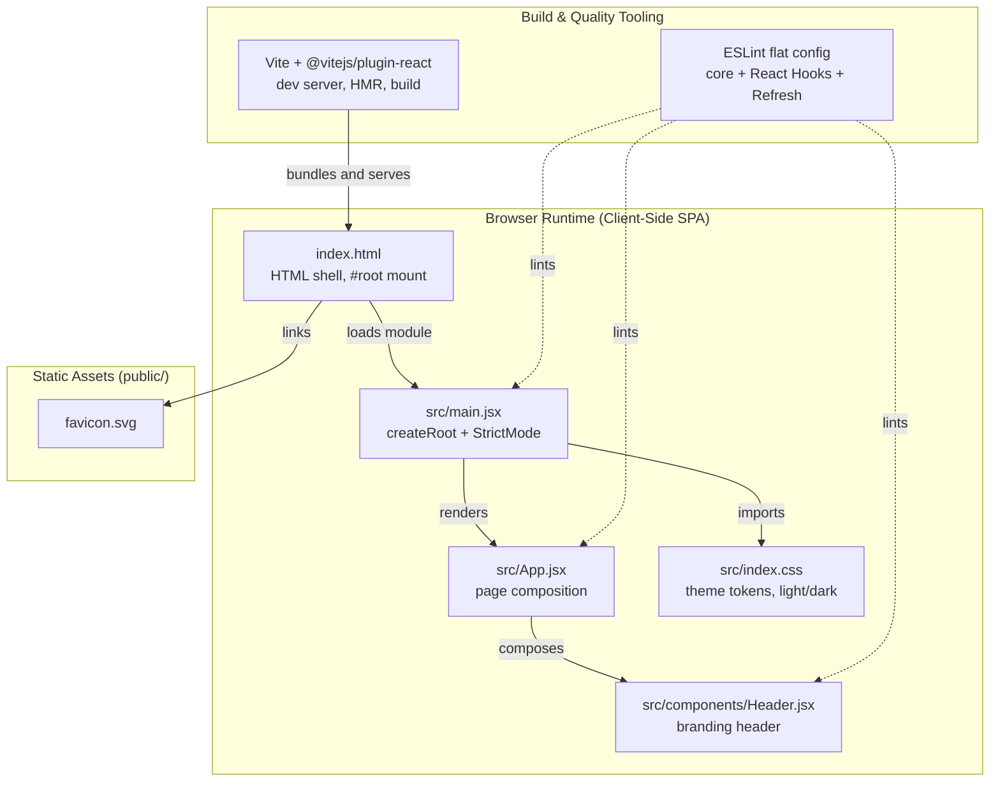
```mermaid
flowchart TD
    subgraph Tooling["Build & Quality Tooling"]
        Vite["Vite + @vitejs/plugin-react<br/>dev server, HMR, build"]
        ESLint["ESLint flat config<br/>core + React Hooks + Refresh"]
    end

    subgraph Browser["Browser Runtime (Client-Side SPA)"]
        HTML["index.html<br/>HTML shell, #root mount"]
        Main["src/main.jsx<br/>createRoot + StrictMode"]
        AppNode["src/App.jsx<br/>page composition"]
        Header["src/components/Header.jsx<br/>branding header"]
        CSS["src/index.css<br/>theme tokens, light/dark"]
    end

    subgraph Assets["Static Assets (public/)"]
        Favicon["favicon.svg"]
    end

    Vite -->|bundles and serves| HTML
    HTML -->|loads module| Main
    Main -->|imports| CSS
    Main -->|renders| AppNode
    AppNode -->|composes| Header
    HTML -->|links| Favicon
    ESLint -.->|lints| Main
    ESLint -.->|lints| AppNode
    ESLint -.->|lints| Header
```

### 1.2.3 Success Criteria

The repository does **not** codify any business-level Service Level Agreements (SLAs), Objectives and Key Results (OKRs), or quantitative Key Performance Indicators — there are no metrics, analytics, monitoring, or performance budgets defined anywhere in the source. Accordingly, the criteria below are **engineering success criteria derived from the toolchain and scripts that the repository actually provides** (`package.json`), and should be read as such rather than as pre-existing product targets.

**Measurable objectives.** Each objective is verifiable through a command or observable artifact present in the repository.

| Objective | Verification |
| --- | --- |
| Production build completes successfully | `npm run build` (`vite build`) produces a bundled `dist/` output (ignored via `.gitignore`) |
| Source passes static analysis | `npm run lint` (`eslint .`) reports zero errors against `**/*.{js,jsx}` |
| Application renders as intended | Dev server (`npm run dev`) or `npm run preview` displays the header and "About Me" content |
| Reproducible installs | `package-lock.json` pins the exact dependency graph for deterministic `npm install` |

**Critical success factors.** The factors most important to keeping the implementation healthy are: a valid Vite + React plugin configuration so JSX transforms and HMR function (`vite.config.js`); a correct component graph in which `main.jsx` mounts `App` and `App` composes `Header` without broken imports; adherence to the ESLint rule sets (core, React Hooks, React Refresh) enforced by `eslint.config.js`; and preservation of the global theme tokens in `src/index.css` that all components inherit.

**Key performance indicators (engineering signals).** In the absence of codified business KPIs, the meaningful, evidence-backed indicators for this codebase are binary/qualitative engineering signals: build exit status (success/failure), lint result (zero vs. non-zero error count), and successful rendering of the single page in a supported browser. Any quantitative performance, availability, or adoption KPIs would need to be defined in a future phase, as none exist in the current repository.

## 1.3 Scope

This section defines the boundaries of the current implementation. In-scope items are those actually present and operational in the repository; out-of-scope items are those absent from the codebase, including capabilities the project's own documentation flags as deferred.

### 1.3.1 In-Scope

#### Core Features and Functionalities

**Must-have capabilities (as implemented).**

| Capability | Description | Source |
| --- | --- | --- |
| Static portfolio page rendering | Renders a branding header and an "About Me" introduction into the browser | `src/App.jsx`, `src/components/Header.jsx`, `src/main.jsx` |
| Theme-aware, responsive presentation | CSS custom-property tokens with automatic light/dark mode and a 1024px breakpoint | `src/index.css` |
| Development workflow | Vite dev server with HMR, production build, and build preview | `package.json` scripts, `vite.config.js` |
| Static analysis | ESLint flat config enforcing core, React Hooks, and React Refresh rules | `eslint.config.js` |

**Primary user workflows.** Two workflows are supported. The *visitor* workflow consists of loading the built page in a browser and viewing the static portfolio content. The *developer* workflow consists of running `npm run dev` to develop with hot reload, editing function components and styles, running `npm run lint` to check code, and running `npm run build` followed by `npm run preview` to produce and inspect the production bundle (`package.json`).

**Essential integrations.** The repository integrates only with foundational platforms: the **browser/web platform** (which executes the bundled JavaScript and loads `public/favicon.svg` linked from `index.html`) and the **Node.js/npm toolchain** (which runs Vite and ESLint at development and build time). No application-level external integrations exist.

**Key technical requirements.** The implementation requires a Node/npm environment to execute its scripts and a modern, ES-module-capable browser to run the client bundle. The declared technology baseline is captured in `package.json`:

| Dependency | Version (declared) | Role |
| --- | --- | --- |
| `react` / `react-dom` | `^19.2.7` | UI component model and DOM rendering |
| `vite` | `^8.1.0` | Build tool and dev server |
| `@vitejs/plugin-react` | `^6.0.2` | React/JSX transforms and HMR integration |
| `eslint` (+ plugins) | `^10.5.0` | Static analysis and code-quality enforcement |

#### Implementation Boundaries

| Boundary Dimension | Coverage in the Current Implementation |
| --- | --- |
| System boundary | Strictly client-side; all logic runs in the browser, and the deployable output is a set of static assets produced by `vite build`. No server-side component exists. |
| User groups covered | The single project owner/developer and anonymous public site visitors. No roles, accounts, or permission tiers are defined. |
| Geographic / market coverage | No geographic targeting or internationalization is configured; content is authored in English (`<html lang="en">` in `index.html`). Hosting region/market is not specified in the repository. |
| Data domains included | Effectively none beyond presentational content: the only "data" is hardcoded display text and CSS design tokens. There is no user data, persistence, or business domain model. |

### 1.3.2 Out-of-Scope

**Explicitly excluded features and capabilities.** The following are not implemented in the repository and are therefore outside the scope of the current system:

| Excluded Area | Basis for Exclusion |
| --- | --- |
| Backend, server, APIs, databases, authentication, user accounts | No server-side code, HTTP client, or auth logic anywhere in the repository |
| Client-side routing / multi-page navigation | No router dependency in `package.json`; `App.jsx` renders one fixed view |
| State management, dynamic data fetching, forms, interactivity | All components are static (no hooks, props, state, or event handlers) |
| Automated testing and CI/CD pipelines | No test runner or scripts in `package.json`; no workflow/pipeline definitions present |
| TypeScript and type-aware linting | Source is JavaScript/JSX only; `README.md` recommends TypeScript for production but it is not adopted |
| React Compiler | `README.md` states it "is not enabled on this template because of its impact on dev & build performances" |
| Internationalization / localization, analytics, monitoring, SEO tooling | No i18n, analytics, telemetry, or SEO configuration exists beyond basic HTML meta tags |
| Deployment / hosting / containerization configuration | No Dockerfile, host configuration, or environment files are present |

**Future-phase considerations.** The repository's own documentation identifies concrete, deferred options rather than committed deliverables. `README.md` explicitly recommends adopting **TypeScript with type-aware lint rules** for a production application and points to a TypeScript template, and notes that the **React Compiler** can be added later. It also documents an alternative React plugin, `@vitejs/plugin-react-swc` (SWC-based), as an available choice that this project does not currently use. Any of these — along with the broader gaps noted above (routing, dynamic data, testing, deployment) — would constitute future-phase work; none are scheduled or configured in the present codebase.

**Integration points not covered.** No external integration points are wired in: there is no backend or REST/GraphQL API consumption, no database or storage layer, no authentication/identity provider, no content management system, and no third-party analytics or messaging services.

**Unsupported use cases.** The current implementation does not support any use case requiring dynamic or personalized content, user input or data capture, authenticated access, navigation across multiple pages or routes, server-side rendering, or data persistence. Such scenarios are beyond what the existing static, single-page frontend can serve and would require new components, dependencies, and infrastructure introduced in later phases.

## 1.4 References

The following repository artifacts were inspected as the evidentiary basis for this Introduction.

**Files**

- `package.json` - Project identity (`my-react-app`, `private`, `version 0.0.0`), `type: module`, scripts (`dev`, `build`, `lint`, `preview`), and the declared dependency baseline (React 19, Vite 8, ESLint 10 and plugins).
- `package-lock.json` - Confirmed pinning of the resolved dependency graph for reproducible installs.
- `vite.config.js` - Established the build/dev toolchain configuration: `@vitejs/plugin-react` only, with no proxy, environment, or build customization.
- `eslint.config.js` - Established the flat ESLint configuration (ignores `dist`; targets `**/*.{js,jsx}`; extends core, React Hooks, and React Refresh rule sets; browser globals; JSX enabled).
- `index.html` - Established the HTML shell, `#root` mount point, `lang="en"`, `<title>my-react-app</title>`, `favicon.svg` link, and the `/src/main.jsx` module entry.
- `README.md` - Established the project's template origin, the deferred React Compiler note, the TypeScript/type-aware lint recommendation, and the `plugin-react` vs. `plugin-react-swc` options.
- `src/main.jsx` - Established the runtime bootstrap (`createRoot` + `StrictMode`, global CSS import, `App` render).
- `src/App.jsx` - Established the page composition (`Header` + "About Me" + "I am learning React.") and the absence of state/props/`App.css` import.
- `src/components/Header.jsx` - Established the static branding header ("My Portfolio Website").
- `src/index.css` - Established the global theme tokens, light/dark mode (`prefers-color-scheme`), base layout/typography, and the responsive `max-width: 1024px` breakpoint.
- `src/App.css` - Established the presence of unused/leftover template styles (not imported by any module).
- `.gitignore` - Established the standard Vite/Node ignore set (e.g., `node_modules`, `dist`, `dist-ssr`, `*.local`).

**Folders**

- `src/` - Application source tree (entry, root component, components, styles, assets).
- `src/components/` - Reusable UI components; currently only `Header.jsx`.
- `src/assets/` - In-tree branding images (`hero.png`, `react.svg`, `vite.svg`); confirmed unreferenced by current source.
- `public/` - Directly served static assets (`favicon.svg`, and `icons.svg` sprite with six symbols); confirmed `favicon.svg` is linked by `index.html` while `icons.svg` is unreferenced by current source.

**Version control**

- Git history - A single commit ("initial react project") confirming the project's greenfield, earliest-stage status.

# 2. Product Requirements

## 2.1 Feature Catalog

This section decomposes `my-react-app` into discrete, individually testable features. Because the repository is a deliberately minimal, single-commit React + Vite scaffold (a personal portfolio frontend, as established in **1.1 Executive Summary** and **1.2 System Overview**), the feature set is small and bounded. Every feature documented here corresponds to code that is actually wired into the running application or to tooling that is actually invokable through `package.json`. Artifacts present in the tree but not referenced by any wired module — `src/App.css`, `public/icons.svg`, `src/assets/hero.png`, `src/assets/react.svg`, and `src/assets/vite.svg` — are **not** modeled as features here, consistent with the unused-remnant findings in **1.2 System Overview** and **1.3 Scope**.

**Cataloging conventions.** Feature identifiers use the `F-XXX` format. Priority Level reflects how essential the feature is to producing the deployable application (Critical = the app cannot render without it; High = central to the delivered experience or developer workflow; Medium = contributes specific content/UI). **Status** is reported as **Completed** for every feature because the repository's single commit ("initial react project") has a clean working tree and each feature's code is present and functional; no feature is partially built, stubbed, or flagged as in-progress.

**Feature summary.**

| Feature ID | Feature Name | Feature Category | Priority Level |
| --- | --- | --- | --- |
| F-001 | Application Bootstrap & Mounting | Application Runtime / Bootstrap | Critical |
| F-002 | HTML Document Shell & Browser Metadata | Application Shell / Hosting | Critical |
| F-003 | Portfolio Header Component | User Interface Component | Medium |
| F-004 | About Me Content Section & Page Composition | Content / Page Composition | Medium |
| F-005 | Global Theming & Responsive Layout | Presentation & Theming | High |
| F-006 | Build, Development & Lint Tooling | Build & Developer Tooling | High |

All six features carry **Status: Completed**. Detailed metadata, descriptions, and dependencies follow.

### 2.1.1 F-001 — Application Bootstrap & Mounting

**Feature Metadata**

| Attribute | Value |
| --- | --- |
| Unique ID | F-001 |
| Feature Name | Application Bootstrap & Mounting |
| Feature Category | Application Runtime / Bootstrap |
| Priority Level | Critical |
| Status | Completed |
| Primary Source | `src/main.jsx` |

**Description**

- **Overview:** The bootstrap module creates the React root on the page's mount element and renders the root `<App/>` component tree into the browser DOM.
- **Business Value:** This is the foundational capability that turns the static HTML shell into a live React application; without it nothing renders.
- **User Benefits:** Visitors receive a rendered page; developers get a single, conventional entry point that is easy to reason about and extend.
- **Technical Context:** `src/main.jsx` (10 lines) imports `createRoot` from `react-dom/client`, mounts on `document.getElementById('root')`, and renders `<App/>` wrapped in `<StrictMode>`. It also imports the global stylesheet (`import './index.css'`), making it the integration point for theming.

**Dependencies**

| Dependency Type | Detail |
| --- | --- |
| Prerequisite Features | F-002 (the HTML shell must supply the `#root` element and load this module); F-004 (the `App` component it renders); F-005 (the `index.css` it imports) |
| System Dependencies | `react` and `react-dom` (`^19.2.7`); the browser DOM |
| External Dependencies | `react-dom/client` `createRoot` API; `StrictMode` from `react` |
| Integration Requirements | Must execute after the `#root` DOM node exists; relies on Vite/`@vitejs/plugin-react` (F-006) to transform JSX |

### 2.1.2 F-002 — HTML Document Shell & Browser Metadata

**Feature Metadata**

| Attribute | Value |
| --- | --- |
| Unique ID | F-002 |
| Feature Name | HTML Document Shell & Browser Metadata |
| Feature Category | Application Shell / Hosting |
| Priority Level | Critical |
| Status | Completed |
| Primary Source | `index.html` |

**Description**

- **Overview:** The static HTML document that Vite serves and bundles; it defines document metadata, the `#root` mount point, and loads the JavaScript entry module.
- **Business Value:** Establishes the browser/runtime boundary and the baseline document presentation (tab title, favicon, responsive scaling).
- **User Benefits:** Correct page title (`my-react-app`), branded favicon, and proper mobile viewport scaling.
- **Technical Context:** `index.html` (13 lines) declares `<html lang="en">`, `<meta charset="UTF-8">`, a responsive `<meta name="viewport" content="width=device-width, initial-scale=1.0">`, `<title>my-react-app</title>`, a `<link rel="icon" type="image/svg+xml" href="/favicon.svg">`, the `<div id="root"></div>` mount, and `<script type="module" src="/src/main.jsx">`.

**Dependencies**

| Dependency Type | Detail |
| --- | --- |
| Prerequisite Features | None — it is the root of the load chain |
| System Dependencies | Served and bundled by Vite (F-006) |
| External Dependencies | A modern, ES-module-capable web browser; `public/favicon.svg` |
| Integration Requirements | References the `/src/main.jsx` module entry (F-001) and the `/favicon.svg` static asset |

### 2.1.3 F-003 — Portfolio Header Component

**Feature Metadata**

| Attribute | Value |
| --- | --- |
| Unique ID | F-003 |
| Feature Name | Portfolio Header Component |
| Feature Category | User Interface Component |
| Priority Level | Medium |
| Status | Completed |
| Primary Source | `src/components/Header.jsx` |

**Description**

- **Overview:** A static, reusable function component that renders the site's branding header.
- **Business Value:** Establishes the site identity by presenting the portfolio title.
- **User Benefits:** A clear, prominent page heading ("My Portfolio Website") at the top of the page.
- **Technical Context:** `src/components/Header.jsx` (8 lines) is a plain function declaration returning `<header><h1>My Portfolio Website</h1></header>` with a default export. It takes no props and holds no state.

**Dependencies**

| Dependency Type | Detail |
| --- | --- |
| Prerequisite Features | F-004 (the `App` component that imports and composes it); rendered transitively via F-001 |
| System Dependencies | `react` (JSX runtime via `@vitejs/plugin-react`) |
| External Dependencies | None |
| Integration Requirements | Imported by `src/App.jsx`; its `<h1>` inherits typography from the global theme (F-005) |

### 2.1.4 F-004 — About Me Content Section & Page Composition

**Feature Metadata**

| Attribute | Value |
| --- | --- |
| Unique ID | F-004 |
| Feature Name | About Me Content Section & Page Composition |
| Feature Category | Content / Page Composition |
| Priority Level | Medium |
| Status | Completed |
| Primary Source | `src/App.jsx` |

**Description**

- **Overview:** The root `App` component that composes the single page from the header plus an "About Me" content block.
- **Business Value:** Delivers the actual portfolio content — the introductory statement about the owner.
- **User Benefits:** Visitors read the "About Me" heading and the introductory text describing the owner.
- **Technical Context:** `src/App.jsx` (13 lines) imports `Header` from `./components/Header` and returns a `<div>` containing `<Header/>`, `<h2>About Me</h2>`, and `<p>I am learning React.</p>`. It declares no state, props, or event handlers, and does **not** import `src/App.css`.

**Dependencies**

| Dependency Type | Detail |
| --- | --- |
| Prerequisite Features | F-003 (the `Header` it composes); F-001 (which renders it) |
| System Dependencies | `react` (JSX runtime) |
| External Dependencies | None |
| Integration Requirements | Rendered by `src/main.jsx` (F-001); its `<h2>`/`<p>` are styled by the global theme (F-005) |

### 2.1.5 F-005 — Global Theming & Responsive Layout

**Feature Metadata**

| Attribute | Value |
| --- | --- |
| Unique ID | F-005 |
| Feature Name | Global Theming & Responsive Layout |
| Feature Category | Presentation & Theming |
| Priority Level | High |
| Status | Completed |
| Primary Source | `src/index.css` |

**Description**

- **Overview:** The global stylesheet that defines design tokens, automatic light/dark theming, responsive typography, and the centered root layout.
- **Business Value:** Provides a consistent, modern, theme-aware presentation layer that adapts to the visitor's OS color preference and viewport size.
- **User Benefits:** Automatic dark mode, readable typography that scales down on smaller screens, and a centered, bordered content column.
- **Technical Context:** `src/index.css` (111 lines) declares `:root` custom properties (e.g., `--text`, `--text-h`, `--bg`, `--border`, `--accent: #aa3bff`, `--shadow`, and `--sans`/`--heading`/`--mono` font stacks), sets `color-scheme: light dark` and an 18px base font, overrides tokens under `@media (prefers-color-scheme: dark)`, reduces the base font to 16px under `@media (max-width: 1024px)`, and lays out `#root` (`width: 1126px; max-width: 100%; margin: 0 auto; display: flex; flex-direction: column; min-height: 100svh; border-inline`). It also styles `h1`, `h2`, `p`, and `code`.

**Dependencies**

| Dependency Type | Detail |
| --- | --- |
| Prerequisite Features | F-001 (imports this stylesheet at bootstrap) |
| System Dependencies | A browser CSS engine supporting custom properties, `prefers-color-scheme`, `svh` units, and CSS nesting |
| External Dependencies | The `system-ui`/`Segoe UI`/`Roboto` font stack (no web-font fetch) |
| Integration Requirements | Applied globally; consumed by the `#root` element (F-002) and by the `<h1>`/`<h2>`/`<p>` elements of F-003 and F-004 |

### 2.1.6 F-006 — Build, Development & Lint Tooling

**Feature Metadata**

| Attribute | Value |
| --- | --- |
| Unique ID | F-006 |
| Feature Name | Build, Development & Lint Tooling |
| Feature Category | Build & Developer Tooling |
| Priority Level | High |
| Status | Completed |
| Primary Source | `vite.config.js`, `package.json`, `eslint.config.js`, `package-lock.json` |

**Description**

- **Overview:** The Vite-based build/development pipeline and the ESLint static-analysis configuration, exposed through `package.json` scripts.
- **Business Value:** Enables a fast, modern development loop (Hot Module Replacement), reproducible production builds, and automated code-quality enforcement.
- **User Benefits (developer):** One-command `dev`, `build`, `preview`, and `lint` workflows plus deterministic installs.
- **Technical Context:** `package.json` defines `dev` (`vite`), `build` (`vite build`), `preview` (`vite preview`), and `lint` (`eslint .`). `vite.config.js` registers only `@vitejs/plugin-react`. `eslint.config.js` is a flat config that ignores `dist`, targets `**/*.{js,jsx}`, enables browser globals and JSX, and extends `@eslint/js` recommended plus the React Hooks and React Refresh rule sets. `package-lock.json` pins the resolved dependency graph. Declared tooling versions include `vite ^8.1.0`, `@vitejs/plugin-react ^6.0.2`, and `eslint ^10.5.0`.

**Dependencies**

| Dependency Type | Detail |
| --- | --- |
| Prerequisite Features | None — it operates over all source files |
| System Dependencies | A Node.js / npm environment |
| External Dependencies | `vite`, `@vitejs/plugin-react`, `eslint`, `@eslint/js`, `eslint-plugin-react-hooks`, `eslint-plugin-react-refresh`, `globals` |
| Integration Requirements | Bundles and serves F-002 (HTML shell) and F-001 (entry module); lints all `.js`/`.jsx` sources including F-001, F-003, and F-004 |

## 2.2 Functional Requirements

This section enumerates the testable functional requirements for each feature in **2.1 Feature Catalog**. Requirement identifiers follow the `F-XXX-RQ-YYY` format. Each requirement lists an acceptance criterion that can be verified by inspecting the source, running a `package.json` script, or observing the rendered page. Because this is a static, client-side presentational frontend with no inputs, persistence, network calls, or authentication (established in **1.3 Scope**), the **Technical Specifications & Validation Rules** tables honestly record "None defined" or "None" for dimensions the repository does not implement, rather than asserting requirements that are not present in code. Build verification is cross-referenced in **1.2 System Overview** (Success Criteria), and dependency versions in **3. Technology Stack**.

Priority uses Must-Have / Should-Have / Could-Have; Complexity uses High / Medium / Low (combined in a single column to respect the four-column table limit).

### 2.2.1 F-001 — Application Bootstrap & Mounting

| Requirement ID | Description | Acceptance Criteria | Priority / Complexity |
| --- | --- | --- | --- |
| F-001-RQ-001 | Create a React root on the page mount element and render the application tree | `createRoot(document.getElementById('root')).render(...)` executes in `src/main.jsx`; the `<App/>` tree is present under `#root` in the live DOM | Must-Have / Low |
| F-001-RQ-002 | Render the tree inside React `StrictMode` | `<App/>` is wrapped in `<StrictMode>` in `src/main.jsx`, enabling React's development-time checks | Should-Have / Low |
| F-001-RQ-003 | Apply global styles during bootstrap | `import './index.css'` is present in `src/main.jsx`, so theme tokens load with the application | Must-Have / Low |

**Technical Specifications & Validation Rules — F-001**

| Aspect | Specification |
| --- | --- |
| Input Parameters | The `#root` DOM element resolved at runtime; no user or configuration input |
| Output / Response | A mounted React component tree rendered into `#root` |
| Performance Criteria | None defined in the repository |
| Data Requirements | None — no data is fetched or passed; render is static |
| Business Rules | None defined |
| Data Validation | None — no external input is accepted |
| Security Requirements | No `dangerouslySetInnerHTML`, no network input; `StrictMode` aids correctness; no authentication surface |
| Compliance Requirements | None defined |

### 2.2.2 F-002 — HTML Document Shell & Browser Metadata

| Requirement ID | Description | Acceptance Criteria | Priority / Complexity |
| --- | --- | --- | --- |
| F-002-RQ-001 | Provide the application mount element | `<div id="root"></div>` exists in `index.html` | Must-Have / Low |
| F-002-RQ-002 | Load the ES module entry point | `<script type="module" src="/src/main.jsx">` is present in `index.html` | Must-Have / Low |
| F-002-RQ-003 | Define core document metadata | `index.html` declares `<title>my-react-app</title>`, `<meta charset="UTF-8">`, a `width=device-width, initial-scale=1.0` viewport meta, and `<html lang="en">` | Must-Have / Low |
| F-002-RQ-004 | Link a browser favicon | `<link rel="icon" type="image/svg+xml" href="/favicon.svg">` is present and `public/favicon.svg` exists | Should-Have / Low |

**Technical Specifications & Validation Rules — F-002**

| Aspect | Specification |
| --- | --- |
| Input Parameters | None — a static document |
| Output / Response | A parsed HTML document exposing `#root` and loading the module entry |
| Performance Criteria | None defined in the repository |
| Data Requirements | Static markup only |
| Business Rules | None defined |
| Data Validation | None |
| Security Requirements | Only a same-origin ES-module loader script; no third-party `<script>` tags; favicon is a local same-origin asset |
| Compliance Requirements | None defined; basic semantic HTML with a `lang="en"` attribute is present |

### 2.2.3 F-003 — Portfolio Header Component

| Requirement ID | Description | Acceptance Criteria | Priority / Complexity |
| --- | --- | --- | --- |
| F-003-RQ-001 | Render the branding header | `src/components/Header.jsx` returns `<header><h1>My Portfolio Website</h1></header>` | Must-Have / Low |
| F-003-RQ-002 | Expose a reusable default export | `export default Header` is declared and `src/App.jsx` imports it without error | Must-Have / Low |

**Technical Specifications & Validation Rules — F-003**

| Aspect | Specification |
| --- | --- |
| Input Parameters | None — the component accepts no props |
| Output / Response | A `<header>` element containing the title `<h1>` |
| Performance Criteria | None defined in the repository |
| Data Requirements | None — the header text is hardcoded |
| Business Rules | None defined |
| Data Validation | None |
| Security Requirements | No dynamic or user-supplied content; no injection surface |
| Compliance Requirements | None defined |

### 2.2.4 F-004 — About Me Content Section & Page Composition

| Requirement ID | Description | Acceptance Criteria | Priority / Complexity |
| --- | --- | --- | --- |
| F-004-RQ-001 | Compose the page from the header and the "About Me" content | `src/App.jsx` renders `<Header/>` followed by `<h2>About Me</h2>` and `<p>I am learning React.</p>` | Must-Have / Low |
| F-004-RQ-002 | Import the header component | `import Header from "./components/Header"` resolves and renders without error | Must-Have / Low |

**Technical Specifications & Validation Rules — F-004**

| Aspect | Specification |
| --- | --- |
| Input Parameters | None |
| Output / Response | A `<div>` containing the header and the "About Me" heading and paragraph |
| Performance Criteria | None defined in the repository |
| Data Requirements | Static, hardcoded display text |
| Business Rules | None defined |
| Data Validation | None |
| Security Requirements | No dynamic content; static markup only |
| Compliance Requirements | None defined |

### 2.2.5 F-005 — Global Theming & Responsive Layout

| Requirement ID | Description | Acceptance Criteria | Priority / Complexity |
| --- | --- | --- | --- |
| F-005-RQ-001 | Define design tokens as CSS custom properties | `:root` in `src/index.css` declares tokens such as `--text`, `--bg`, `--accent: #aa3bff`, `--shadow`, and the `--sans`/`--heading`/`--mono` font stacks | Must-Have / Low |
| F-005-RQ-002 | Provide automatic light/dark theming | `@media (prefers-color-scheme: dark)` overrides the token values in `src/index.css` | Should-Have / Low |
| F-005-RQ-003 | Apply a responsive typography breakpoint | `@media (max-width: 1024px)` reduces the base font to 16px and shrinks heading sizes | Should-Have / Medium |
| F-005-RQ-004 | Center and constrain the root layout | `#root` is styled with `width: 1126px; max-width: 100%; margin: 0 auto; display: flex; flex-direction: column; min-height: 100svh` | Should-Have / Low |

**Technical Specifications & Validation Rules — F-005**

| Aspect | Specification |
| --- | --- |
| Input Parameters | Browser media features: `prefers-color-scheme` and viewport width |
| Output / Response | Computed styles and CSS custom-property values applied to the document |
| Performance Criteria | None defined in the repository |
| Data Requirements | Static design tokens (color hex values, font stacks, sizes) |
| Business Rules | None defined |
| Data Validation | None |
| Security Requirements | Pure CSS with no external resources or `@import`; no network fetch |
| Compliance Requirements | None formally defined; `color-scheme: light dark` respects the OS theme preference |

### 2.2.6 F-006 — Build, Development & Lint Tooling

| Requirement ID | Description | Acceptance Criteria | Priority / Complexity |
| --- | --- | --- | --- |
| F-006-RQ-001 | Provide a development server with Hot Module Replacement | `npm run dev` (`vite`) starts the dev server with `@vitejs/plugin-react` enabling JSX transforms and Fast Refresh | Must-Have / Low |
| F-006-RQ-002 | Produce a production build | `npm run build` (`vite build`) emits a bundled `dist/` directory | Must-Have / Low |
| F-006-RQ-003 | Preview the production build | `npm run preview` (`vite preview`) serves the built output for inspection | Should-Have / Low |
| F-006-RQ-004 | Lint all JavaScript/JSX sources | `npm run lint` (`eslint .`) runs over `**/*.{js,jsx}` applying core, React Hooks, and React Refresh rule sets and reports zero errors | Must-Have / Low |
| F-006-RQ-005 | Guarantee reproducible installs | `package-lock.json` pins the exact resolved dependency graph for deterministic `npm install` | Could-Have / Low |

**Technical Specifications & Validation Rules — F-006**

| Aspect | Specification |
| --- | --- |
| Input Parameters | Source files (`.js`/`.jsx`), `vite.config.js`, `eslint.config.js`, and the npm CLI commands |
| Output / Response | A running dev server (HMR), a `dist/` production bundle, a preview server, and an ESLint report |
| Performance Criteria | None codified (no build-time or runtime performance budgets in the repository) |
| Data Requirements | Not applicable |
| Business Rules | ESLint rule sets (core recommended, React Hooks, React Refresh) act as enforced quality rules; `dist` is globally ignored |
| Data Validation | ESLint static analysis validates source files against the configured rule sets |
| Security Requirements | No secrets are committed in `vite.config.js` or `eslint.config.js`; the Vite config defines no proxy or environment exposure |
| Compliance Requirements | None defined |

## 2.3 Feature Relationships

The relationships below are derived strictly from the repository's actual import and load graph (`index.html` → `src/main.jsx` → `src/index.css` and `src/App.jsx`; `src/App.jsx` → `src/components/Header.jsx`) and the `package.json`/`vite.config.js`/`eslint.config.js` tooling configuration. No speculative relationships are introduced. This view complements the build/render pipeline diagram in **1.2 System Overview**.

### 2.3.1 Feature Dependency Map

The diagram shows build-time relationships (solid where one feature produces/serves another, dashed for linting) and runtime relationships (load, render, compose, style).

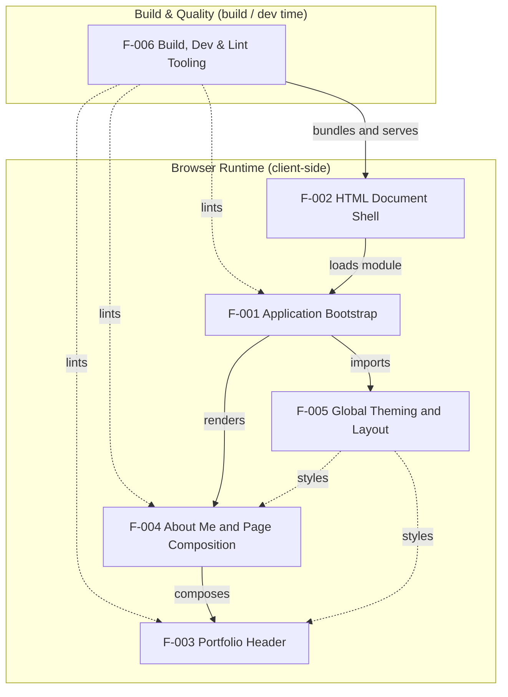
```mermaid
flowchart TD
    subgraph BuildTime["Build & Quality (build / dev time)"]
        F006["F-006 Build, Dev & Lint Tooling"]
    end
    subgraph Runtime["Browser Runtime (client-side)"]
        F002["F-002 HTML Document Shell"]
        F001["F-001 Application Bootstrap"]
        F004["F-004 About Me and Page Composition"]
        F003["F-003 Portfolio Header"]
        F005["F-005 Global Theming and Layout"]
    end

    F006 -->|bundles and serves| F002
    F006 -.->|lints| F001
    F006 -.->|lints| F003
    F006 -.->|lints| F004
    F002 -->|loads module| F001
    F001 -->|imports| F005
    F001 -->|renders| F004
    F004 -->|composes| F003
    F005 -.->|styles| F003
    F005 -.->|styles| F004
```

The chain is linear and acyclic: tooling (F-006) builds and serves the shell (F-002), which loads the bootstrap (F-001), which imports the theme (F-005) and renders the page composition (F-004), which composes the header (F-003). Theming (F-005) is applied cross-cuttingly to the elements rendered by F-002, F-003, and F-004.

### 2.3.2 Integration Points

| Integration Point | Producer | Consumer | Mechanism |
| --- | --- | --- | --- |
| HTML → JS module entry | F-002 | F-001 | `<script type="module" src="/src/main.jsx">` in `index.html` |
| React mount target | F-002 | F-001 | `createRoot(document.getElementById('root'))` binds to the `#root` element |
| Global stylesheet import | F-005 | F-001 | `import './index.css'` in `src/main.jsx` |
| Component composition | F-003 | F-004 | `import Header from "./components/Header"` in `src/App.jsx` |
| Favicon reference | `public/favicon.svg` | F-002 | `<link rel="icon" type="image/svg+xml" href="/favicon.svg">` |
| Bundling / serving | F-006 | F-002, F-001 | Vite + `@vitejs/plugin-react` (JSX transform, HMR, build) |
| Static analysis | F-006 | F-001, F-003, F-004 | `eslint .` over `**/*.{js,jsx}` |

### 2.3.3 Shared Components

| Shared Component | Used By | Notes |
| --- | --- | --- |
| `Header` component (`src/components/Header.jsx`) | F-004 | The only reusable UI component; currently a single consumer (`App`) |
| Global design tokens (`:root` custom properties in `src/index.css`) | F-002 (`#root`), F-003 (`h1`), F-004 (`h2`/`p`) | Shared theming contract inherited by all rendered elements |
| `#root` mount element | F-001 (mount target), F-002 (definition), F-005 (layout styling) | Shared DOM anchor for the application |

### 2.3.4 Common Services

The application defines **no runtime services**. There are no React Context providers, custom hooks, state stores, utility/service modules, API clients, or data-access layers anywhere in the source — consistent with the absence of state, interactivity, and integrations documented in **1.3 Scope**. The only cross-cutting, shared infrastructure that functions in a service-like role is:

- **F-006 (Build, Development & Lint Tooling)** — a shared build/quality service applied to all source files at development and build time.
- **F-005 (Global Theming & Responsive Layout)** — a shared presentation layer whose design tokens are inherited globally by every rendered element.

No other common services exist in the current implementation.

## 2.4 Implementation Considerations

The considerations below are derived from observed code characteristics. The repository codifies **no** performance budgets, security policies, scalability targets, or compliance requirements (consistent with **1.2 System Overview**, Success Criteria); where a dimension is not codified, that is stated explicitly rather than assumed.

### 2.4.1 Technical Constraints

| Feature | Technical Constraints |
| --- | --- |
| F-001 | Requires the `#root` element to exist before execution; depends on the `react-dom/client` `createRoot` API and on Vite/`@vitejs/plugin-react` to transform JSX |
| F-002 | Must remain the Vite entry document at the project root; the `/src/main.jsx` path is resolved by Vite, and absolute-path assets such as `/favicon.svg` must reside in `public/` |
| F-003 | Static component — the header text is hardcoded in JSX, so any change requires a code edit and rebuild |
| F-004 | Single fixed page composition (no routing); all content lives on one page, and `src/App.css` is not imported, so its rules never apply |
| F-005 | Relies on modern CSS (custom properties, `prefers-color-scheme`, `svh` units, native CSS nesting), constraining support to recent browsers; uses a fixed `#root` width of 1126px with a single `1024px` breakpoint |
| F-006 | Requires a Node.js/npm environment; the flat ESLint config targets only `**/*.{js,jsx}` (no TypeScript); `vite.config.js` defines no proxy/env/build customization |

### 2.4.2 Performance Requirements

No quantitative performance criteria, budgets, or monitoring are defined anywhere in the repository. The observable characteristics are:

| Feature | Performance Characteristics (observed; no codified targets) |
| --- | --- |
| F-001 / F-003 / F-004 | Trivial render cost — a static tree of a few DOM nodes with no state and therefore no re-renders |
| F-002 | Minimal HTML document loading a single ES-module script |
| F-005 | Pure CSS with no runtime JavaScript cost; uses a `system-ui` font stack, so there is no web-font fetch latency |
| F-006 | Vite provides fast HMR in development and bundling for production; no performance budgets are configured |

### 2.4.3 Scalability Considerations

As a client-side static SPA with no backend, "scalability" concerns codebase growth and static/CDN hosting rather than server capacity.

| Feature | Scalability Considerations |
| --- | --- |
| F-001 / F-002 | Standard single-entry SPA bootstrap; supporting SSR or multiple entry points would require new configuration not present today |
| F-003 | The reusable component pattern supports adding more components; the header currently has a single consumer |
| F-004 | Single composition with no routing; adding pages or sections would require introducing a router and additional components (absent today), and content scaling is manual (hardcoded JSX) |
| F-005 | Token-based theming scales cleanly to more components via shared variables; the fixed-width layout may need revisiting as content grows |
| F-006 | Vite and the flat ESLint config extend to substantially larger codebases without architectural change |

### 2.4.4 Security Implications

The attack surface is minimal: there is no authentication, no user input, no data persistence, and no network calls (see **1.3 Scope**).

| Feature | Security Implications |
| --- | --- |
| F-001 | Renders only static content under `StrictMode`; no `dangerouslySetInnerHTML`, so a negligible XSS surface |
| F-002 | No third-party `<script>` tags; the module entry and favicon are same-origin assets; no inline event handlers |
| F-003 / F-004 | Static, hardcoded content with no user input and therefore no injection vectors; React's default JSX escaping applies |
| F-005 | Pure CSS with no external `@import` or remote resource fetches |
| F-006 | Development/build tooling only; no secrets are committed in `vite.config.js` or `eslint.config.js` |

No security requirements are codified in the repository.

### 2.4.5 Maintenance Requirements

| Feature | Maintenance Requirements |
| --- | --- |
| F-006 | Dependencies use caret (`^`) ranges while `package-lock.json` pins exact versions; periodic dependency updates are advisable, and ESLint enforces ongoing code consistency |
| F-001 / F-002 | Stable infrastructure files that change rarely |
| F-003 / F-004 | Content updates require code changes and a rebuild (there is no CMS or dynamic content source) |
| F-005 | Centralized design tokens ease theme maintenance; the orphaned `src/App.css` is maintenance debt that should be removed or wired in to avoid confusion |
| Cross-cutting | Unused assets (`src/App.css`, `public/icons.svg`, `src/assets/hero.png`, `react.svg`, `vite.svg`) are present but unreferenced; with no automated tests, regressions are caught only by `eslint` and manual verification |

## 2.5 Traceability Matrix

This matrix traces every feature and requirement to the source artifact that implements it and to the verification method and related specification section. Process and composition flows are depicted in **2.3 Feature Relationships** (Feature Dependency Map) and **1.2 System Overview** (build/render pipeline).

### 2.5.1 Feature-to-Source Traceability

| Feature | Requirements | Source Artifact(s) |
| --- | --- | --- |
| F-001 | F-001-RQ-001 … F-001-RQ-003 | `src/main.jsx` |
| F-002 | F-002-RQ-001 … F-002-RQ-004 | `index.html`, `public/favicon.svg` |
| F-003 | F-003-RQ-001 … F-003-RQ-002 | `src/components/Header.jsx` |
| F-004 | F-004-RQ-001 … F-004-RQ-002 | `src/App.jsx` |
| F-005 | F-005-RQ-001 … F-005-RQ-004 | `src/index.css` |
| F-006 | F-006-RQ-001 … F-006-RQ-005 | `package.json`, `vite.config.js`, `eslint.config.js`, `package-lock.json` |

### 2.5.2 Requirement Verification & Specification Cross-Reference

| Requirement ID | Verification Method | Related Specification |
| --- | --- | --- |
| F-001-RQ-001 | Inspect `src/main.jsx`; confirm the `<App/>` tree mounts under `#root` in the DOM | 1.2 System Overview |
| F-001-RQ-002 | Inspect `src/main.jsx` for the `<StrictMode>` wrapper | 2.1.1 / 1.2 System Overview |
| F-001-RQ-003 | Inspect `src/main.jsx` for `import './index.css'` | 2.1.5 Feature F-005 |
| F-002-RQ-001 | Inspect `index.html` for `<div id="root">` | 1.2 System Overview |
| F-002-RQ-002 | Inspect `index.html` for the module `<script>` entry | 1.2 System Overview |
| F-002-RQ-003 | Inspect `index.html` for title, charset, viewport, and `lang` | 1.3 Scope |
| F-002-RQ-004 | Inspect the favicon `<link>` and confirm `public/favicon.svg` exists | 1.4 References |
| F-003-RQ-001 | Inspect `src/components/Header.jsx` markup; observe the rendered `<h1>` | 1.1 Executive Summary |
| F-003-RQ-002 | Inspect the `export default` and the `App` import | 2.3 Feature Relationships |
| F-004-RQ-001 | Inspect `src/App.jsx` composition; observe the rendered page | 1.1 Executive Summary |
| F-004-RQ-002 | Inspect `src/App.jsx` import; confirm successful render | 2.3 Feature Relationships |
| F-005-RQ-001 | Inspect the `:root` custom properties in `src/index.css` | 1.2 System Overview |
| F-005-RQ-002 | Inspect the `prefers-color-scheme: dark` media block | 1.3 Scope |
| F-005-RQ-003 | Inspect the `max-width: 1024px` media block | 1.3 Scope |
| F-005-RQ-004 | Inspect the `#root` layout rules | 1.2 System Overview |
| F-006-RQ-001 | Run `npm run dev`; confirm the dev server starts with HMR | 1.2 System Overview (Success Criteria) |
| F-006-RQ-002 | Run `npm run build`; confirm a `dist/` bundle is produced | 1.2 System Overview (Success Criteria) |
| F-006-RQ-003 | Run `npm run preview`; confirm the built output is served | 1.3 Scope |
| F-006-RQ-004 | Run `npm run lint`; confirm zero ESLint errors | 1.2 System Overview (Success Criteria) |
| F-006-RQ-005 | Inspect `package-lock.json` for pinned dependency resolution | 1.4 References |

### 2.5.3 Assumptions and Constraints

- **Status assumption.** All features are marked **Completed** because the repository's single commit ("initial react project") has a clean working tree and every feature's code is present and functional; the repository contains no backlog, roadmap, or issue tracker indicating in-progress work.
- **Priority basis.** Priority levels are inferred from each feature's role in producing the deployable application; the repository contains no formal priority register.
- **Scope constraint.** Only code that is actually wired into the running application or invocable via `package.json` is modeled. Orphaned artifacts (`src/App.css`, `public/icons.svg`, `src/assets/hero.png`, `react.svg`, `vite.svg`) are explicitly excluded.
- **No codified non-functional targets.** No SLAs, KPIs, performance budgets, or compliance requirements exist in the repository; these are reported as "None defined" throughout rather than invented.
- **Verification constraint.** Because there is no automated test suite, acceptance criteria are verified by source inspection, `package.json` script execution, or visual rendering of the page.

### 2.5.4 Requirement Versioning

The repository has a single commit ("initial react project") and `package.json` declares `version: 0.0.0`. There is no requirements register, changelog, or issue tracker in the codebase. Accordingly, all requirements documented in this section constitute the **baseline (v1.0)** set, traced to that initial commit. Subsequent requirement additions or changes should be versioned against later commits as the project evolves.

## 2.6 References

The following repository artifacts and specification sections were inspected as the evidentiary basis for this Product Requirements section.

**Files**

- `package.json` - Established the project identity, the `dev`/`build`/`preview`/`lint` scripts, and the declared dependency/tooling versions underpinning F-006.
- `package-lock.json` - Established deterministic dependency pinning (F-006-RQ-005).
- `vite.config.js` - Established the Vite + `@vitejs/plugin-react` build/dev configuration with no proxy/env customization (F-006).
- `eslint.config.js` - Established the flat ESLint configuration (ignores `dist`; targets `**/*.{js,jsx}`; core + React Hooks + React Refresh rule sets) backing F-006-RQ-004.
- `index.html` - Established the HTML shell, `#root` mount, module entry, document metadata, and favicon link (F-002).
- `src/main.jsx` - Established the bootstrap behavior: `createRoot`, `StrictMode`, and the `index.css` import (F-001).
- `src/App.jsx` - Established the page composition (`Header` + "About Me" + intro paragraph) and the absence of state/props and of an `App.css` import (F-004).
- `src/components/Header.jsx` - Established the static branding header component (F-003).
- `src/index.css` - Established the design tokens, automatic dark mode, responsive breakpoint, and `#root` layout (F-005).
- `src/App.css` - Confirmed an unused/orphaned stylesheet (not imported), excluded from the feature catalog.
- `public/favicon.svg` - Confirmed the favicon asset referenced by `index.html` (F-002-RQ-004).
- `public/icons.svg` - Confirmed an unreferenced icon sprite, excluded from the feature catalog.
- `README.md` - Provided the project's template origin and minimal-setup intent (contextual framing for the catalog).
- `.gitignore` - Confirmed `dist` is ignored, supporting the F-006 build-output handling.

**Folders**

- `src/` - Application source tree (entry, root component, components, styles, assets).
- `src/components/` - Reusable UI components; currently only `Header.jsx`.
- `src/assets/` - In-tree branding images (`hero.png`, `react.svg`, `vite.svg`); confirmed unreferenced and excluded from the feature catalog.
- `public/` - Directly served static assets (`favicon.svg`, `icons.svg`).

**Specification cross-references**

- `1.1 Executive Summary` - Corroborated the portfolio purpose and the rendered content of F-003/F-004.
- `1.2 System Overview` - Corroborated the component breakdown, build/render pipeline, and the absence of codified SLAs/KPIs.
- `1.3 Scope` - Corroborated in-scope capabilities and the out-of-scope boundaries (no backend, routing, state, tests).
- `1.4 References` - Corroborated the orphaned-asset inventory and the single-commit baseline.

**Version control**

- Git history - A single commit ("initial react project") establishing the baseline (v1.0) against which all requirements are traced.

# 3. Technology Stack

## 3.1 Programming Languages

`my-react-app` is a **client-side frontend with no server tier**, so its language footprint is confined to the web platform and to the JavaScript-based build/lint tooling. There is no backend, mobile, or native component in the repository, and therefore none of the server-side or native languages from the proposed default stack (Python, Swift, Kotlin, Objective-C) appear. All statements below are grounded in files observed directly in the repository.

### 3.1.1 Language Inventory by Component

| Language | Version / Standard | Component & Usage | Evidence |
| --- | --- | --- | --- |
| JavaScript (ECMAScript Modules) | ES2015+ `import`/`export`; `"type": "module"` | Application bootstrap, component logic, and tool configuration | `src/main.jsx`, `src/App.jsx`, `vite.config.js`, `eslint.config.js`, `package.json` |
| JSX | React JSX (automatic runtime) | Declarative React component markup, compiled to JS | `src/main.jsx`, `src/App.jsx`, `src/components/Header.jsx` |
| CSS3 | Modern CSS (custom properties, `prefers-color-scheme`, `svh`, media queries) | Global theming, layout, typography, light/dark mode | `src/index.css` (active), `src/App.css` (present, not imported) |
| HTML5 | HTML Living Standard | Document shell, `#root` mount point, module-script and favicon links | `index.html` |
| SVG (XML) | SVG 1.1 vector markup | Favicon, icon sprite sheet, and branding logos | `public/favicon.svg`, `public/icons.svg`, `src/assets/react.svg`, `src/assets/vite.svg` |

The repository is written in **JavaScript/JSX (`.jsx`), not TypeScript** — there are three `.jsx` source files and no `.ts`/`.tsx` files. The JSX uses the **automatic JSX runtime**: the presentational components (`src/App.jsx`, `src/components/Header.jsx`) render JSX without importing `React`, and the only `react` import in the codebase is the named `StrictMode` import in `src/main.jsx`. This confirms that JSX-to-JavaScript transformation is delegated to the build plugin rather than requiring a manual `React` import in every module.

### 3.1.2 Selection Criteria and Justification

| Language | Rationale (evidence-based) |
| --- | --- |
| JavaScript / JSX | Native language of React; JSX expresses the component tree declaratively, and ECMAScript modules align with Vite's native-ESM dev server and the `"type": "module"` manifest setting. No type-system or transpilation-to-another-language step is required for a small static site. |
| CSS3 (plain) | Styling uses plain CSS with **custom-property design tokens** rather than a preprocessor, CSS-in-JS, or utility framework (e.g., the default-stack TailwindCSS is **not** used). This keeps the runtime free of styling dependencies while still supporting theming and automatic dark mode via `prefers-color-scheme`. |
| HTML5 | Standard entry document that Vite serves and bundles; provides the `#root` mount and the ES-module script tag. |
| SVG | Resolution-independent, lightweight, inline-styleable assets for the favicon, icon sprite, and framework logos. |

### 3.1.3 Constraints and Dependencies

- **No TypeScript adopted (by design, at present).** The source is `.jsx`; there is no `typescript` package, no `tsconfig*.json`, and the flat ESLint configuration lints only `**/*.{js,jsx}` (`eslint.config.js`). The `@types/react` (19.2.17) and `@types/react-dom` (19.2.3) packages are present as **dev-only type stubs** that can power editor IntelliSense, but no type-checking step exists in the build. `README.md` explicitly recommends migrating to TypeScript with type-aware lint rules for production applications — an upgrade path that has not yet been taken.
- **JSX requires a build-time transform.** Because components rely on the automatic JSX runtime, a transform (provided by `@vitejs/plugin-react`, detailed in **3.2 Frameworks & Libraries**) is mandatory; the raw `.jsx` files cannot run unbundled in the browser.
- **Toolchain language runtime.** The JavaScript-based tooling (Vite, ESLint) executes on **Node.js**, with the installed toolchain requiring Node `^20.19.0 || >=22.12.0` (see **3.6 Development & Deployment**). The application's own runtime, however, is the browser — the ESLint configuration enables `globals.browser`, confirming browser-targeted execution.
- **Modern-browser dependency.** The CSS relies on custom properties, `prefers-color-scheme`, `svh` viewport units, and media queries, which constrain support to recent evergreen browsers (consistent with **2.4 Implementation Considerations**).

## 3.2 Frameworks & Libraries

The application is built on a deliberately small framework set: **React** for the UI runtime and **Vite** for the build/dev toolchain, bridged by the official React plugin. The entire runtime dependency surface in `package.json` is just two packages — `react` and `react-dom` — reflecting the static, single-page nature of the product. Declared versions are taken from `package.json` and resolved versions from `package-lock.json` (lockfile version 3).

### 3.2.1 Core Frameworks

| Framework / Tool | Version (Declared → Resolved) | Dependency Class | Primary Role |
| --- | --- | --- | --- |
| React | `^19.2.7` → `19.2.7` | runtime (`dependencies`) | Component-based UI library; declarative function components and `StrictMode` |
| React DOM | `^19.2.7` → `19.2.7` | runtime (`dependencies`) | Web renderer; `createRoot` (from `react-dom/client`) mounts the tree at `#root` |
| Vite | `^8.1.0` → `8.1.0` | dev (`devDependencies`) | Frontend build tool and dev server (native-ESM serving, HMR, production bundling) |
| @vitejs/plugin-react | `^6.0.2` → `6.0.3` | dev (`devDependencies`) | React integration for Vite: JSX transform (via Oxc) and React Fast Refresh |

**Justification for each major choice (evidence-based):**

- **React 19.2.7** — Chosen as the UI framework; `src/main.jsx` wraps the tree in `StrictMode` and the application is composed of plain function components (`App`, `Header`). React 19 is the latest major line, giving access to the modern concurrent rendering model.
- **React DOM 19.2.7** — The browser renderer for React. `src/main.jsx` uses the `createRoot` client API (`react-dom/client`), i.e. the React 18+ concurrent root rather than the legacy `ReactDOM.render`. Its version is locked in lockstep with `react`.
- **Vite 8.1.0** — Selected as the build/dev tool because it provides a fast native-ESM dev server with Hot Module Replacement and an optimized production build, while requiring almost no configuration: `vite.config.js` does nothing beyond registering the React plugin. It is exposed through the `dev`, `build`, and `preview` npm scripts (see **3.6 Development & Deployment**).
- **@vitejs/plugin-react 6.0.3** — Enables JSX compilation and React Fast Refresh in Vite. Per `README.md`, this plugin performs the React transform using **Oxc** (the presence of `@oxc-project/types` in the lockfile corroborates this); the SWC-based alternative `@vitejs/plugin-react-swc` is documented in the README but is **not** installed. The README also notes the **React Compiler is intentionally not enabled** for dev/build performance reasons.

### 3.2.2 Supporting Libraries

The project carries **no supplemental application libraries** — there is no router (e.g., `react-router`), no state-management library (Redux/Zustand/MobX), no data-fetching/HTTP client, no UI component kit, and no form/validation library. This is consistent with the single static page documented in **1.2 System Overview**. The only library-level dependencies beyond the core frameworks are pulled in transitively:

| Library | Resolved Version | Origin / Role |
| --- | --- | --- |
| `scheduler` | `0.27.0` | React's cooperative scheduling runtime; transitive dependency of `react`/`react-dom` that underpins concurrent rendering |
| `@rolldown/pluginutils` | `1.0.1` | Direct dependency of `@vitejs/plugin-react`; plugin utility helpers for the Rolldown-based build |

React-specific **development** libraries (`eslint-plugin-react-hooks` 7.1.1 and `eslint-plugin-react-refresh` 0.5.3) support correct Hooks usage and Fast Refresh boundaries; they are catalogued with the rest of the open-source dependency graph in **3.3 Open Source Dependencies** and the tooling in **3.6 Development & Deployment**.

### 3.2.3 Compatibility Requirements

All declared peer-dependency relationships are satisfied by the installed graph:

| Package | Declared Peer Requirement | Satisfied By | Status |
| --- | --- | --- | --- |
| `react-dom` 19.2.7 | `react: ^19.2.7` | `react` 19.2.7 | Met — must be upgraded in lockstep with React |
| `@vitejs/plugin-react` 6.0.3 | `vite: ^8.0.0` | `vite` 8.1.0 | Met |
| `@types/react-dom` 19.2.3 | `@types/react: ^19.2.0` | `@types/react` 19.2.17 | Met |
| `eslint-plugin-react-hooks` 7.1.1 | `eslint: …^9.0.0 \|\| ^10.0.0` | `eslint` 10.5.0 | Met |
| `eslint-plugin-react-refresh` 0.5.3 | `eslint: ^9 \|\| ^10` | `eslint` 10.5.0 | Met |

Additional compatibility notes:

- **React Compiler peers are optional and unused.** `@vitejs/plugin-react` also declares optional peers `@rolldown/plugin-babel` and `babel-plugin-react-compiler`; neither is installed, which is consistent with the README's statement that the React Compiler is not enabled.
- **Node.js floor.** Both `vite` and `@vitejs/plugin-react` require Node `^20.19.0 || >=22.12.0` to build and serve the application (build/dev time only — see **3.6**).
- **Browser runtime.** Because the app ships ES modules and modern CSS, it targets current evergreen browsers; there is no legacy-browser transpilation target or polyfill set configured in `vite.config.js`.

## 3.3 Open Source Dependencies

All third-party code is open source and managed through **npm**. Dependencies are declared in `package.json` using caret (`^`) ranges and pinned to an exact, reproducible graph in `package-lock.json` (`lockfileVersion: 3`), which records **167 package entries** (the root project plus 166 installed packages) resolved from the public npm registry (`https://registry.npmjs.org/`). The project declares **11 direct dependencies** — 2 runtime and 9 development — with the remainder being transitive.

### 3.3.1 Direct Dependencies

| Package | Declared → Resolved | Class | Purpose |
| --- | --- | --- | --- |
| `react` | `^19.2.7` → `19.2.7` | runtime | Core UI component library |
| `react-dom` | `^19.2.7` → `19.2.7` | runtime | DOM renderer (`createRoot`) |
| `vite` | `^8.1.0` → `8.1.0` | dev | Build tool and dev server |
| `@vitejs/plugin-react` | `^6.0.2` → `6.0.3` | dev | React JSX transform + Fast Refresh |
| `eslint` | `^10.5.0` → `10.5.0` | dev | JavaScript/JSX linter |
| `@eslint/js` | `^10.0.1` → `10.0.1` | dev | ESLint's recommended core rule set |
| `eslint-plugin-react-hooks` | `^7.1.1` → `7.1.1` | dev | Lint rules for the Rules of Hooks |
| `eslint-plugin-react-refresh` | `^0.5.3` → `0.5.3` | dev | Lint rules for Fast Refresh boundaries |
| `globals` | `^17.6.0` → `17.7.0` | dev | Predefined global identifiers (browser globals) |
| `@types/react` | `^19.2.17` → `19.2.17` | dev | React type definitions (editor IntelliSense) |
| `@types/react-dom` | `^19.2.3` → `19.2.3` | dev | React DOM type definitions (editor IntelliSense) |

### 3.3.2 Key Transitive Dependencies (Build Toolchain)

The most significant transitive packages are those that make up the Vite 8 build engine. Notably, Vite 8 here is powered by the **Rust-based Rolldown bundler and Lightning CSS** rather than the classic Rollup/esbuild pairing (neither `esbuild` nor a standalone `rollup` package is present in the lockfile).

| Package | Resolved Version | Role in the Toolchain |
| --- | --- | --- |
| `rolldown` | `1.1.3` | Rust-based bundler used internally by Vite 8 (declared as Vite dependency `~1.1.2`) |
| `lightningcss` | `1.32.0` | Rust-based CSS transformer/minifier used by Vite for CSS processing |
| `@oxc-project/types` | `0.137.0` | Oxc toolchain types; Oxc powers the `@vitejs/plugin-react` JSX transform |
| `postcss` | `8.5.15` | CSS transformation pipeline retained as a Vite dependency |
| `@babel/core` | `7.29.7` | Babel core, present transitively within the React plugin's toolchain |
| `scheduler` | `0.27.0` | React's cooperative scheduler (transitive of `react`/`react-dom`) |

Platform-specific native binaries are also resolved as optional/transitive packages — for example `@rolldown/binding-*` (v1.1.3) and `lightningcss-*` (v1.32.0) for the various OS/architecture targets, and `fsevents` as an optional dependency of Vite for macOS file watching. Only the binary matching the host platform is installed at runtime.

### 3.3.3 Package Registry & Versioning Strategy

- **Registry:** the public npm registry (`https://registry.npmjs.org/`) is the sole source for every resolved package in `package-lock.json`; no private, scoped-proprietary, or alternate registries are configured.
- **Version pinning:** `package.json` uses caret ranges for flexibility, while `package-lock.json` (lockfile v3) pins exact resolved versions and integrity hashes for deterministic, reproducible installs across environments and CI (consistent with the reproducible-install objective in **1.2 System Overview**).
- **Maintenance implication:** because caret ranges permit minor/patch drift on a fresh `npm install` without a lockfile, periodic, deliberate dependency updates are advisable (see **2.4 Implementation Considerations**).

### 3.3.4 License Posture

Every resolved dependency carries a **permissive open-source license**, so there are no copyleft-at-scale obligations on the application code. The distribution across the 166 installed packages is:

| License | Package Count |
| --- | --- |
| MIT | 120 |
| Apache-2.0 | 14 |
| MPL-2.0 | 12 |
| ISC | 9 |
| BSD-2-Clause | 6 |
| BSD-3-Clause | 2 |
| CC-BY-4.0 | 1 |
| BlueOak-1.0.0 | 1 |
| 0BSD | 1 |

The core stack — `react`, `react-dom`, `vite`, `@vitejs/plugin-react`, `eslint`, `rolldown`, `scheduler`, and `globals` — is **MIT**-licensed. The notable exception is `lightningcss` (and its platform binaries), which is **MPL-2.0**; as a file-level copyleft license consumed as an unmodified build tool, it imposes no obligations on the application's own source. **Security note:** the permissive, MIT-dominant graph combined with an exact lockfile keeps the supply-chain surface auditable and reproducible.

## 3.4 Third-Party Services

The repository integrates **no third-party runtime services of any kind**. There are no external API calls (no `fetch`, `XMLHttpRequest`, or HTTP-client dependency), no authentication provider, no monitoring/analytics, and no cloud-service SDKs. A repository-wide search for outbound network usage found only SVG XML-namespace declarations (`xmlns="http://www.w3.org/2000/svg"`) inside the logo assets — i.e., document identifiers, **not** network requests. This contrasts deliberately with the proposed default stack (which suggested Auth0, AWS, and similar), none of which is adopted here.

### 3.4.1 External Service Inventory

| Service Category | Default-Stack Proposal | Status in Repository | Evidence |
| --- | --- | --- | --- |
| External APIs / integrations | — | **None** | No HTTP client dependency; no `fetch`/`XMLHttpRequest` in `src/`; `vite.config.js` defines no dev proxy |
| Authentication service | Auth0 | **None** | No auth library in `package.json`; no login/session/token code anywhere in `src/` |
| Monitoring / analytics / error tracking | — | **None** | No Sentry/analytics/telemetry SDK; `index.html` loads no third-party `<script>` tags |
| Cloud services (compute/storage/functions) | AWS | **None** | No cloud SDK in dependencies; no environment configuration or service credentials present |
| CDN-hosted runtime assets | — | **None** | All assets are same-origin (`public/`, `src/assets/`); the favicon is referenced locally from `index.html` |

### 3.4.2 External Touchpoints That Do Exist

The only external systems the project interacts with are **build/development-time infrastructure**, not runtime services consumed by end users:

- **npm public registry** (`https://registry.npmjs.org/`) — supplies open-source packages during `npm install` (build/dev only; see **3.3 Open Source Dependencies**).
- **The web platform / browser** — the runtime host that downloads and executes the bundled output and renders the favicon linked in `index.html`.

**Security implications.** The absence of third-party services yields a minimal external attack surface: there are **no API keys, OAuth secrets, or service credentials** to manage or leak; no cross-origin script inclusion; and no data leaving the user's browser. Any future integration (authentication, analytics, a backend API, or cloud hosting beyond static delivery) would introduce new trust boundaries, secret-management requirements, and configuration that do not exist today.

## 3.5 Databases & Storage

The application has **no database, no caching layer, and no data-persistence mechanism**. It is a static, presentational single-page app whose entire content is hardcoded in source (`src/App.jsx`, `src/components/Header.jsx`) and compiled into the bundle at build time. The proposed default-stack database (MongoDB) is **not** present, and there is no database driver, ORM/ODM, or query layer anywhere in the dependency graph.

### 3.5.1 Persistence & Storage Inventory

| Storage Concern | Default-Stack Proposal | Status in Repository | Evidence |
| --- | --- | --- | --- |
| Primary database | MongoDB | **None** | No DB driver/ORM in `package.json`; no backend tier exists |
| Secondary / analytics database | — | **None** | No data tier of any kind |
| Server-side persistence | — | **None** | No server code; the app is client-only (see **1.2 System Overview**) |
| Caching layer (e.g., Redis) | — | **None** | No cache server or client dependency |
| Browser client storage | — | **None** | No `localStorage`, `sessionStorage`, `IndexedDB`, or `document.cookie` usage in `src/` |
| Offline cache / Service Worker | — | **None** | No Service Worker, Cache API usage, or PWA manifest |

### 3.5.2 Data Strategy and "Storage" in Practice

Because there is no dynamic data, the application has **no data model, no schema, and no read/write data flow**. What functions as "storage" is limited to static, file-based artifacts handled by the build/hosting pipeline:

| Artifact | Nature | Location |
| --- | --- | --- |
| Static assets | Browser-served files (favicon, icon sprite, logos, hero image) | `public/` (`favicon.svg`, `icons.svg`), `src/assets/` (`react.svg`, `vite.svg`, `hero.png`) |
| Build output | Production bundle emitted by `vite build`, served as static files | `dist/` (generated; git-ignored via `.gitignore`) |
| Source-embedded content | Page text compiled into the JS bundle | `src/App.jsx`, `src/components/Header.jsx` |

**Security implications.** With no datastore and no client-side storage, there is **no persisted user data, no PII, and no storage-layer attack surface** (no injection sink, no credential store, no data-at-rest concerns). Introducing dynamic content later would require adding a data source and, if client storage were used, corresponding handling and privacy considerations that are absent today.

## 3.6 Development & Deployment

Development and deployment center on a single tool — **Vite** — driven through four npm scripts, with **ESLint** as the only automated quality gate. There is no containerization, no Infrastructure-as-Code, and no CI/CD pipeline in the repository; the deployment model is static-file hosting of the production build.

### 3.6.1 Development Tools

| Tool | Version | Role |
| --- | --- | --- |
| Node.js + npm | Node `^20.19.0 \|\| >=22.12.0` (toolchain floor) | JavaScript runtime and package manager for all scripts and installs |
| Vite dev server | `8.1.0` | Local development server with Hot Module Replacement (HMR) |
| @vitejs/plugin-react | `6.0.3` | JSX transform (Oxc) and React Fast Refresh during development |
| ESLint (flat config) | `10.5.0` | Static analysis of `**/*.{js,jsx}`; the sole automated check |
| `@types/react` / `@types/react-dom` | `19.2.17` / `19.2.3` | Editor IntelliSense type information (no compile-time type checking) |

The ESLint setup in `eslint.config.js` is a **flat config** that ignores `dist`, enables browser globals and JSX parsing, and composes three rule sets: `@eslint/js` recommended, `eslint-plugin-react-hooks` (flat recommended), and `eslint-plugin-react-refresh` (Vite preset). There is **no test framework** (no Vitest, Jest, or test files), so quality assurance relies on linting plus manual verification (consistent with **2.4 Implementation Considerations**).

### 3.6.2 Build System

The build system is npm-script-driven over Vite. The scripts declared in `package.json` are:

| Script | Command | Purpose |
| --- | --- | --- |
| `dev` | `vite` | Start the dev server with HMR |
| `build` | `vite build` | Produce the optimized production bundle in `dist/` |
| `preview` | `vite preview` | Serve the built `dist/` locally to verify the production output |
| `lint` | `eslint .` | Lint the entire project |

Under the hood, **Vite 8's build pipeline is powered by Rust-based tooling**: the **Rolldown** bundler (`1.1.3`, a direct Vite dependency) performs module bundling, **Lightning CSS** (`1.32.0`) is bundled for CSS transformation/minification (alongside `postcss` `8.5.15`), and the **Oxc**-based `@vitejs/plugin-react` handles the JSX transform. The end-to-end flow is:

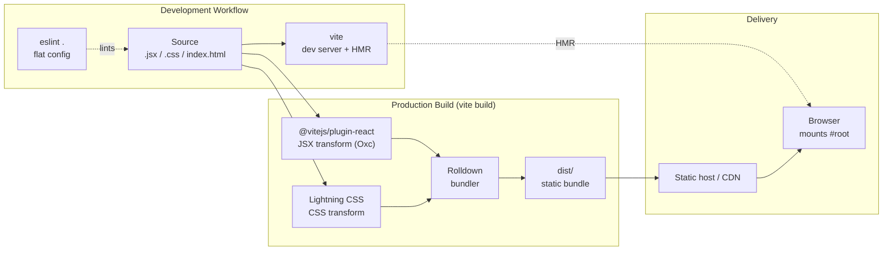
```mermaid
flowchart LR
    subgraph Development["Development Workflow"]
        DevSrc["Source<br/>.jsx / .css / index.html"]
        ViteDev["vite<br/>dev server + HMR"]
        ESLintNode["eslint .<br/>flat config"]
    end

    subgraph BuildStage["Production Build (vite build)"]
        Plugin["@vitejs/plugin-react<br/>JSX transform (Oxc)"]
        Lightning["Lightning CSS<br/>CSS transform"]
        Rolldown["Rolldown<br/>bundler"]
        Dist["dist/<br/>static bundle"]
    end

    subgraph Delivery["Delivery"]
        Host["Static host / CDN"]
        Browser["Browser<br/>mounts #root"]
    end

    ESLintNode -. lints .-> DevSrc
    DevSrc --> ViteDev
    ViteDev -. HMR .-> Browser
    DevSrc --> Plugin
    DevSrc --> Lightning
    Plugin --> Rolldown
    Lightning --> Rolldown
    Rolldown --> Dist
    Dist --> Host
    Host --> Browser
```

### 3.6.3 Containerization & Infrastructure as Code

There is **no containerization and no Infrastructure-as-Code** in the repository. Specifically: no `Dockerfile` or container manifest, and no Terraform (`*.tf`) or other IaC definitions — none of the proposed default-stack infrastructure tooling (Docker, Terraform) is present. The application therefore has no container image, orchestration manifest, or provisioned cloud infrastructure defined in source.

### 3.6.4 CI/CD & Deployment

- **CI/CD:** No continuous-integration or deployment pipeline is configured — there is no `.github/` directory (so no GitHub Actions, the default-stack CI choice) and no other pipeline definition (`*.yml`/`*.yaml`) anywhere in the tree. Builds and lint runs are executed manually via the npm scripts above.
- **Deployment model:** As a client-side SPA, the deployable artifact is the static `dist/` bundle emitted by `vite build`. It can be served by **any static web host or CDN**; no server runtime is required. `dist/` is intentionally git-ignored (`.gitignore`) as a build product.
- **Source control hygiene:** `.gitignore` excludes build/dependency artifacts and environment noise — `node_modules`, `dist`, `dist-ssr`, `*.local`, log files, and editor directories (`.vscode/*` except `extensions.json`, `.idea`, `.DS_Store`).
- **Security note:** because no pipeline, container, or cloud configuration exists, there are **no committed deployment secrets, registry credentials, or environment files** in the repository; introducing automated deployment later would require establishing secret management and a hosting target that are absent today.

## 3.7 References

The following repository artifacts and specification sections were examined as evidence for this Technology Stack section.

**Repository files**

- `package.json` - Declared dependencies/devDependencies, exact version ranges, npm scripts, `"type": "module"`, and project identity
- `package-lock.json` - Resolved/pinned versions (lockfile v3), npm registry source, peer dependencies, license metadata, Node engine requirements, and the transitive build toolchain (Rolldown, Lightning CSS, Oxc types, PostCSS, Babel, scheduler)
- `vite.config.js` - Vite configuration registering `@vitejs/plugin-react` (no proxy/env/build customization)
- `eslint.config.js` - Flat ESLint configuration: ignores, JS/JSX targets, browser globals, and React rule sets
- `index.html` - HTML5 shell, `#root` mount, ES-module script tag, favicon link, document metadata
- `README.md` - Template provenance; Oxc-based React plugin note; React Compiler disabled; TypeScript-for-production recommendation
- `.gitignore` - Ignored build/dependency/editor artifacts (`dist`, `node_modules`, etc.)
- `src/main.jsx` - Runtime bootstrap (`createRoot`, `StrictMode`, global CSS import); evidence of named `react` import only
- `src/App.jsx` - Page composition; JSX without a `React` import (automatic JSX runtime evidence)
- `src/components/Header.jsx` - Static header component; JSX without a `React` import
- `src/index.css` - Active global styling: custom-property tokens, `prefers-color-scheme`, responsive units
- `src/App.css` - Present but unimported template stylesheet

**Repository folders**

- `src/` - Application source (JSX components and CSS)
- `src/components/` - Reusable UI component(s)
- `src/assets/` - In-tree branding/image assets (`react.svg`, `vite.svg`, `hero.png`)
- `public/` - Browser-served static assets (`favicon.svg`, `icons.svg`)

**Cross-referenced specification sections**

- `1.2 System Overview` - Confirmed the client-side React-SPA architecture, greenfield status, and absence of backend/API/database/auth/third-party integrations
- `2.4 Implementation Considerations` - Confirmed Node/npm requirement, JS/JSX-only linting scope, absence of tests, and the un-codified status of performance/security/compliance dimensions

# 4. Process Flowchart

## 4.1 System Workflows

Because `my-react-app` is a **static, client-side React single-page application** with no backend, API, database, routing, or interactive state — established in **1.2 System Overview**, **1.3 Scope**, and **2.2 Functional Requirements** (which records "None defined" for Business Rules, Data Validation, and Compliance Requirements across every feature) — its "workflows" are not transactional business processes operating on a domain model. Instead, the system supports two human-facing, end-to-end journeys that operate over the six features catalogued in **2.1 Feature Catalog** (F-001 … F-006): a **visitor journey** (view the rendered page) and a **developer journey** (build, lint, run, and deploy the app). This section maps those journeys and the strictly platform-level integrations that support them. The diagrams here are deliberately process-, sequence-, and state-oriented so that they complement — rather than duplicate — the architectural pipeline and component-composition diagrams already presented in **1.2.2 High-Level Description** and **3.6.2 Build System**.

### 4.1.1 Core Business Processes

Two end-to-end processes exist, exactly as identified in **1.3 Scope** ("Primary user workflows"):

- **Visitor journey (runtime):** the visitor opens the deployed site → the browser fetches the static bundle from the host/CDN → React mounts and paints the single portfolio page → the visitor reads the "My Portfolio Website" header and the "About Me" introduction. Because the rendered output is fully deterministic (`src/App.jsx` and `src/components/Header.jsx` declare no props, state, or event handlers), the visitor side contains **no decision points, branches, inputs, navigation, or transactions**.
- **Developer journey (build/dev time):** the developer edits source → chooses one of four npm scripts (the single explicit decision point) → runs `dev` (HMR loop), `lint` (quality gate), `build` (emit `dist/`), or `preview` → iterates. A failed `lint` or `build` returns the developer to editing, which is the only error-handling/recovery path at this level (detailed in **4.4 Error Handling and Recovery Flows**).

The following high-level workflow uses swim lanes for each actor/system. The thick arrow denotes the **manual** deployment step (there is no CI/CD pipeline, per **3.6.4**); the dotted arrows denote dev-time-only channels (lint reporting and the HMR WebSocket).

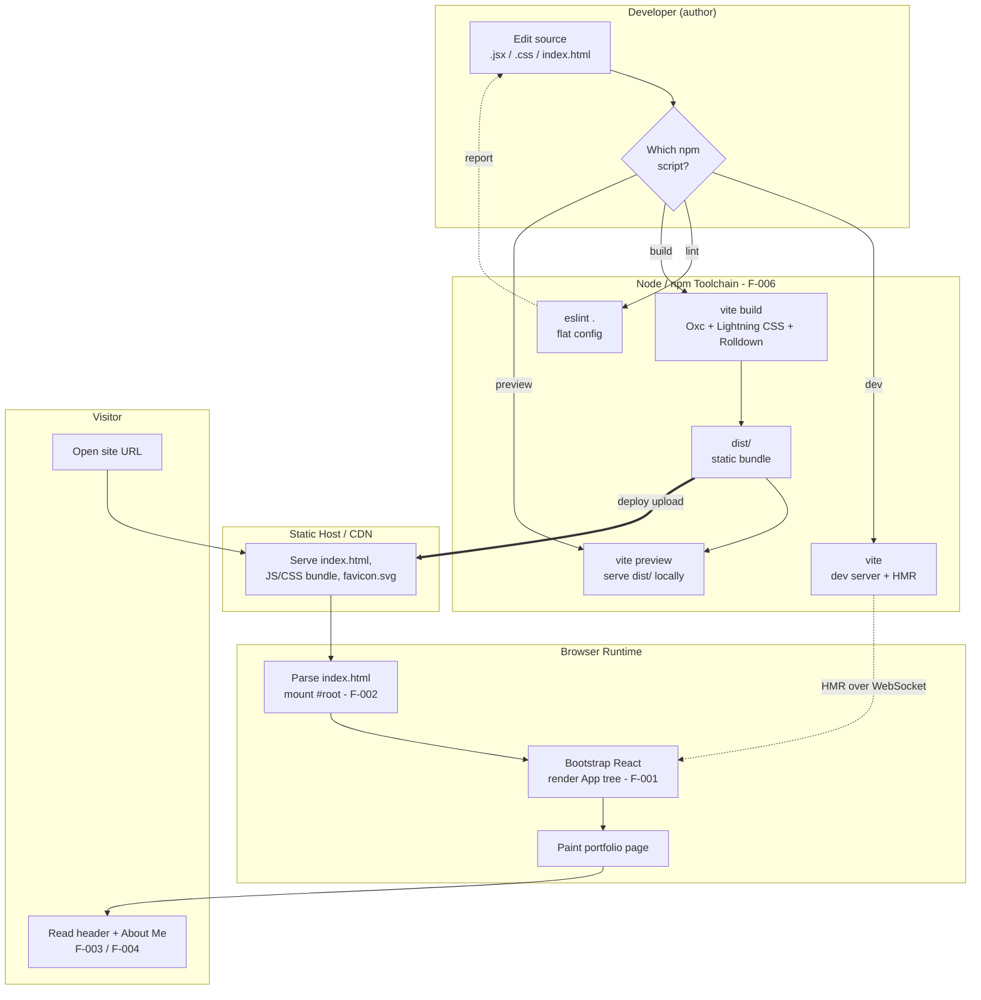
```mermaid
flowchart TD
    subgraph DevLane["Developer (author)"]
        D1["Edit source<br/>.jsx / .css / index.html"]
        D2{"Which npm<br/>script?"}
    end
    subgraph ToolLane["Node / npm Toolchain - F-006"]
        T1["vite<br/>dev server + HMR"]
        T2["eslint .<br/>flat config"]
        T3["vite build<br/>Oxc + Lightning CSS + Rolldown"]
        T5["dist/<br/>static bundle"]
        T4["vite preview<br/>serve dist/ locally"]
    end
    subgraph HostLane["Static Host / CDN"]
        H1["Serve index.html,<br/>JS/CSS bundle, favicon.svg"]
    end
    subgraph RuntimeLane["Browser Runtime"]
        B1["Parse index.html<br/>mount #root - F-002"]
        B2["Bootstrap React<br/>render App tree - F-001"]
        B3["Paint portfolio page"]
    end
    subgraph VisitorLane["Visitor"]
        V1["Open site URL"]
        V2["Read header + About Me<br/>F-003 / F-004"]
    end
    D1 --> D2
    D2 -->|dev| T1
    D2 -->|lint| T2
    D2 -->|build| T3
    D2 -->|preview| T4
    T2 -.->|report| D1
    T1 -.->|HMR over WebSocket| B2
    T3 --> T5
    T5 --> T4
    T5 ==>|deploy upload| H1
    V1 --> H1
    H1 --> B1
    B1 --> B2
    B2 --> B3
    B3 --> V2
```

**System interactions, boundaries, and touchpoints.** The swim lanes above correspond to the following actors/systems and the boundaries between them.

| Swim lane (system boundary) | Role in the workflow | Touchpoint / evidence |
| --- | --- | --- |
| Developer (author) | Edits source; selects an npm script (decision point) | `package.json` scripts; source files |
| Node / npm Toolchain (F-006) | Runs Vite (dev/build/preview) and ESLint | `vite.config.js`, `eslint.config.js`, `package.json` |
| Static Host / CDN | Serves the built `dist/` artifacts over HTTP | Deployment model in **3.6.4** (static-file hosting) |
| Browser Runtime | Parses `index.html`, mounts `#root`, bootstraps and paints React (F-001/F-002) | `index.html`, `src/main.jsx` |
| Visitor | Opens the URL and reads the static content (F-003/F-004) | `src/App.jsx`, `src/components/Header.jsx` |

**Decision points.** The only genuine decision diamond in the system is the developer's choice of npm script (`dev` / `lint` / `build` / `preview`). The runtime path is unconditional: there is no routing, feature flag, or conditional rendering in the source, so the visitor journey is a single deterministic sequence.

**Absence of transactional business processes (explicit).** There are no orders, payments, records, approvals, or other domain transactions, because there is no domain model, user input, or persisted data — **1.3 Scope** records the included data domains as "effectively none beyond presentational content," and the source contains no state, forms, or storage. Consequently, the prompt's notions of multi-step business decision logic and regulatory checkpoints do not map onto any code in this repository; they are documented as **not applicable** here and in **4.2.6**.

### 4.1.2 Integration Workflows

Per **1.3 Scope** ("Essential integrations"), the system integrates only with two foundational platforms — the **browser/web platform** and the **Node.js/npm toolchain** — and has **no application-level external integrations**. Each integration dimension named by the prompt is addressed below against the actual code:

- **Data flow between systems:** the only runtime data flow is the browser fetching static files (the HTML shell, content-hashed JS/CSS, and `favicon.svg`) from a static host or CDN, consistent with the deployment model in **3.6.4**. No data flows to or from any backend, because none exists.
- **API interactions:** **none.** There is no HTTP client, `fetch`/XHR call, or REST/GraphQL endpoint anywhere in the source (confirmed by inspection of `src/` and `index.html`, and by the out-of-scope list in **1.3 Scope**).
- **Event processing flows:** **none at the application level** — there is no event bus, message queue, or event handler in the source. The only event-style channel is the **dev-time Hot Module Replacement (HMR) WebSocket** that the Vite dev server uses to push module updates to the browser; it exists only under `npm run dev` and is absent from the production bundle (see **4.2.3**).
- **Batch processing sequences:** **none at the application level.** The closest batch-style operation is the **one-shot, non-interactive production build** (`vite build`), which transforms and bundles all sources in a single pass (see **4.2.4**).

The runtime integration surface — purely static-asset requests — is shown as a sequence diagram below.

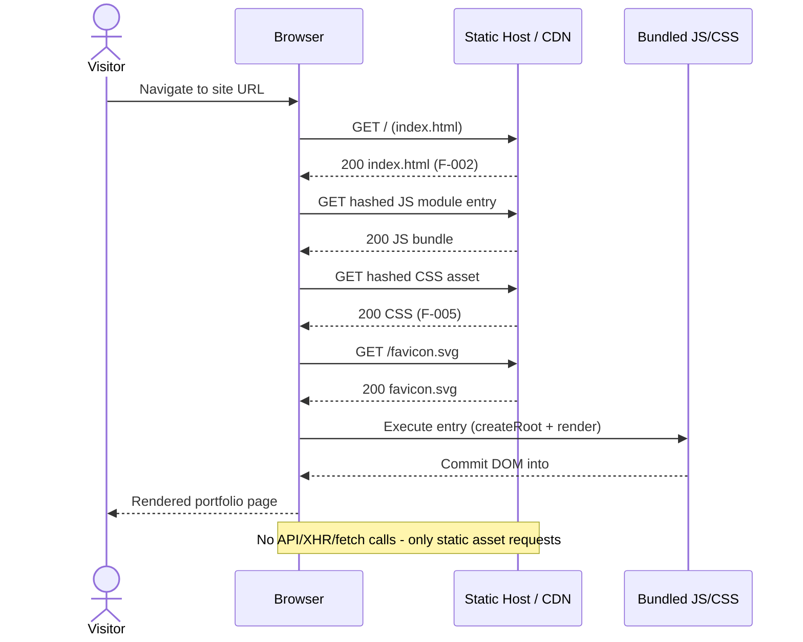
```mermaid
sequenceDiagram
    actor Visitor
    participant Browser
    participant Host as Static Host / CDN
    participant Runtime as Bundled JS/CSS
    Visitor->>Browser: Navigate to site URL
    Browser->>Host: GET / (index.html)
    Host-->>Browser: 200 index.html (F-002)
    Browser->>Host: GET hashed JS module entry
    Host-->>Browser: 200 JS bundle
    Browser->>Host: GET hashed CSS asset
    Host-->>Browser: 200 CSS (F-005)
    Browser->>Host: GET /favicon.svg
    Host-->>Browser: 200 favicon.svg
    Browser->>Runtime: Execute entry (createRoot + render)
    Runtime-->>Browser: Commit DOM into #root (F-001)
    Browser-->>Visitor: Rendered portfolio page
    Note over Browser,Host: No API/XHR/fetch calls - only static asset requests
```

**Integration surface summary.** The table contrasts the present (platform-level) integrations with the application-level integrations that the prompt anticipates but that this repository deliberately does not implement.

| Integration dimension | Status | Evidence |
| --- | --- | --- |
| Static asset delivery (browser ↔ host/CDN) | Present (platform-level, runtime) | **3.6.4** deployment model; `index.html` |
| Dev-time HMR (browser ↔ Vite dev server, WebSocket) | Present (development only) | F-006-RQ-001; `vite` + `@vitejs/plugin-react` |
| Backend / REST / GraphQL API | Absent | No HTTP client or `fetch` in source (**1.3 Scope**) |
| Database / storage integration | Absent | No persistence layer (**1.3 Scope**, **3.5**) |
| Authentication / identity provider | Absent | No auth surface (**2.2 Functional Requirements**) |
| Message queue / event bus / batch jobs | Absent | None present in source (**1.3 Scope**) |
| Third-party services (analytics / monitoring) | Absent | None present in source (**1.3 Scope**, **3.4**) |

## 4.2 Core Feature Process Flows

This section provides a detailed process flow for each core workflow that the repository actually implements, organized around the features defined in **2.1 Feature Catalog**. Two flows are **runtime** (the visitor-facing bootstrap and render of the page) and three are **build/development time** (the developer-facing HMR, build/deploy, and lint workflows of F-006). Each flow identifies its start/end points, process steps, decision diamonds, system boundaries, user touchpoints, and error/recovery paths. Timing and Service Level Agreement (SLA) considerations are addressed per flow and consolidated in **4.2.6**; note that the repository codifies **no quantitative SLAs, performance budgets, or KPIs** (per **1.2.3 Success Criteria** and the "Performance Criteria: None defined" entries throughout **2.2 Functional Requirements**), so timing is described qualitatively from observed toolchain behavior only.

### 4.2.1 Browser Load & Application Bootstrap Flow (F-001, F-002)

This runtime flow turns the static HTML shell into a live React application. **Start point:** the browser receives `index.html`. **End point:** React commits the component tree into `#root` and the browser paints the page. The **user touchpoint** is the visitor's browser; the **system boundary** is between the browser-delivered document (F-002) and the JavaScript runtime that executes the module entry (F-001).

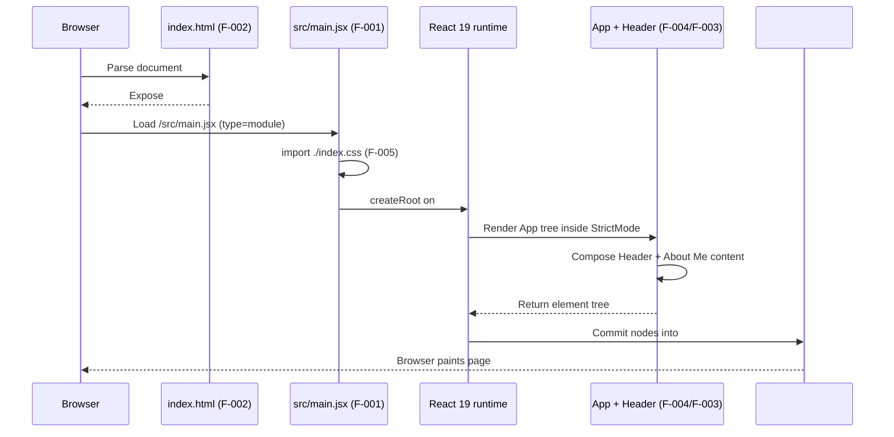
```mermaid
sequenceDiagram
    participant Browser
    participant HTML as index.html (F-002)
    participant Main as src/main.jsx (F-001)
    participant ReactRT as React 19 runtime
    participant Tree as App + Header (F-004/F-003)
    participant DOM as #root DOM node
    Browser->>HTML: Parse document
    HTML-->>Browser: Expose #root + module script
    Browser->>Main: Load /src/main.jsx (type=module)
    Main->>Main: import ./index.css (F-005)
    Main->>ReactRT: createRoot on #root element
    ReactRT->>Tree: Render App tree inside StrictMode
    Tree->>Tree: Compose Header + About Me content
    Tree-->>ReactRT: Return element tree
    ReactRT->>DOM: Commit nodes into #root
    DOM-->>Browser: Browser paints page
```

**Process detail.** `index.html` exposes `<div id="root"></div>` and `<script type="module" src="/src/main.jsx">` (F-002-RQ-001/RQ-002). The module entry imports the global stylesheet (`import './index.css'`, F-001-RQ-003 / F-005) and then calls `createRoot(document.getElementById('root')).render(<StrictMode><App/></StrictMode>)` (F-001-RQ-001/RQ-002). **Decision points:** none — the bootstrap is a single unconditional statement in `src/main.jsx`. **Error states:** if the `#root` element is missing, `createRoot` receives `null` and throws; if the module entry fails to resolve, the tree never mounts — both surface as console errors with no automatic recovery (detailed in **4.4**). **Timing:** the render is a single synchronous pass with no network round-trips beyond the initial static-asset fetch shown in **4.1.2**; no timing budget is defined.

### 4.2.2 Component Render & Page Composition Flow (F-003, F-004, F-005)

This runtime flow describes how the component tree is evaluated and committed. **Start point:** the React root render is invoked (continuing from 4.2.1). **End point:** the static page is painted, after which there are **no further transitions** because the source declares no state, effects, or events. The single decision diamond reflects React `StrictMode` (F-001-RQ-002), which intentionally invokes component render functions twice in development builds to surface impure render logic; in production builds they run once.

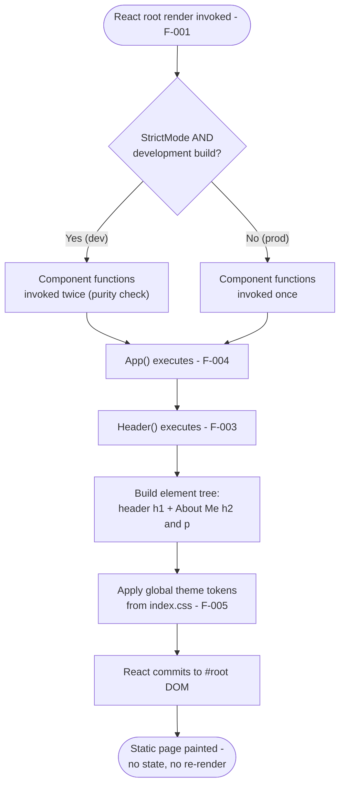
```mermaid
flowchart TD
    Start(["React root render invoked - F-001"]) --> SM{"StrictMode AND<br/>development build?"}
    SM -->|"Yes (dev)"| Double["Component functions<br/>invoked twice (purity check)"]
    SM -->|"No (prod)"| Single["Component functions<br/>invoked once"]
    Double --> AppC["App() executes - F-004"]
    Single --> AppC
    AppC --> HeaderC["Header() executes - F-003"]
    HeaderC --> Tree["Build element tree:<br/>header h1 + About Me h2 and p"]
    Tree --> Theme["Apply global theme tokens<br/>from index.css - F-005"]
    Theme --> Commit["React commits to #root DOM"]
    Commit --> End(["Static page painted -<br/>no state, no re-render"])
```

**Process detail.** `App()` composes `<Header/>` followed by `<h2>About Me</h2>` and `<p>I am learning React.</p>` (F-004-RQ-001), and `Header()` returns `<header><h1>My Portfolio Website</h1></header>` (F-003-RQ-001). The committed DOM inherits the design tokens, light/dark theming, and responsive typography defined in `src/index.css` (F-005-RQ-001…RQ-004). **Recovery path:** because the components are pure presentational functions with no runtime inputs, the only failure mode is an unhandled exception thrown during render, which — absent any React Error Boundary — causes React to unmount the tree (see **4.4.1**).

### 4.2.3 Development Workflow & Hot Module Replacement Loop (F-006)

This build-time flow is the developer's inner loop under `npm run dev`. **Start point:** the dev server starts; **end point:** none in normal operation — it is an intentional iterative loop until the developer stops the server. The **user touchpoint** is the developer's editor and terminal plus the live browser preview. The decision diamond is React **Fast Refresh** eligibility (provided by `@vitejs/plugin-react` and enforced by the `eslint-plugin-react-refresh` rules in `eslint.config.js`).

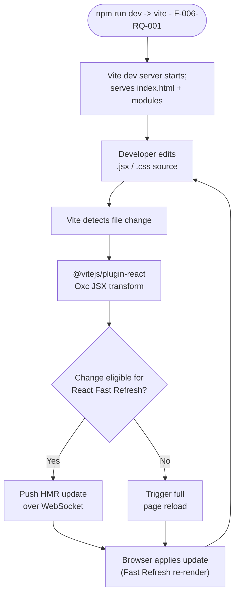
```mermaid
flowchart TD
    Start(["npm run dev -> vite - F-006-RQ-001"]) --> Serve["Vite dev server starts;<br/>serves index.html + modules"]
    Serve --> Edit["Developer edits<br/>.jsx / .css source"]
    Edit --> Detect["Vite detects file change"]
    Detect --> Transform["@vitejs/plugin-react<br/>Oxc JSX transform"]
    Transform --> Decide{"Change eligible for<br/>React Fast Refresh?"}
    Decide -->|Yes| HMR["Push HMR update<br/>over WebSocket"]
    Decide -->|No| Reload["Trigger full<br/>page reload"]
    HMR --> Update["Browser applies update<br/>(Fast Refresh re-render)"]
    Reload --> Update
    Update --> Edit
```

**Process detail.** Vite serves the source modules directly and transforms JSX via the Oxc-based React plugin (per **3.6.1**). On each saved change, eligible component edits are hot-swapped over a WebSocket channel; ineligible changes trigger a full reload. **Timing:** HMR updates are pushed incrementally for near-immediate feedback (qualitative; no numeric budget is codified). **Error states:** a transform or syntax error is reported in the terminal and as a Vite dev overlay, and the developer corrects the source and re-saves (the loop's built-in recovery).

### 4.2.4 Production Build & Deployment Flow (F-006)

This build-time flow produces and ships the deployable artifact. **Start point:** `npm run build`; **end point:** a live static site. It contains a build success/failure decision diamond and an explicit recovery loop. Deployment is **manual** — there is no CI/CD pipeline (**3.6.4**).

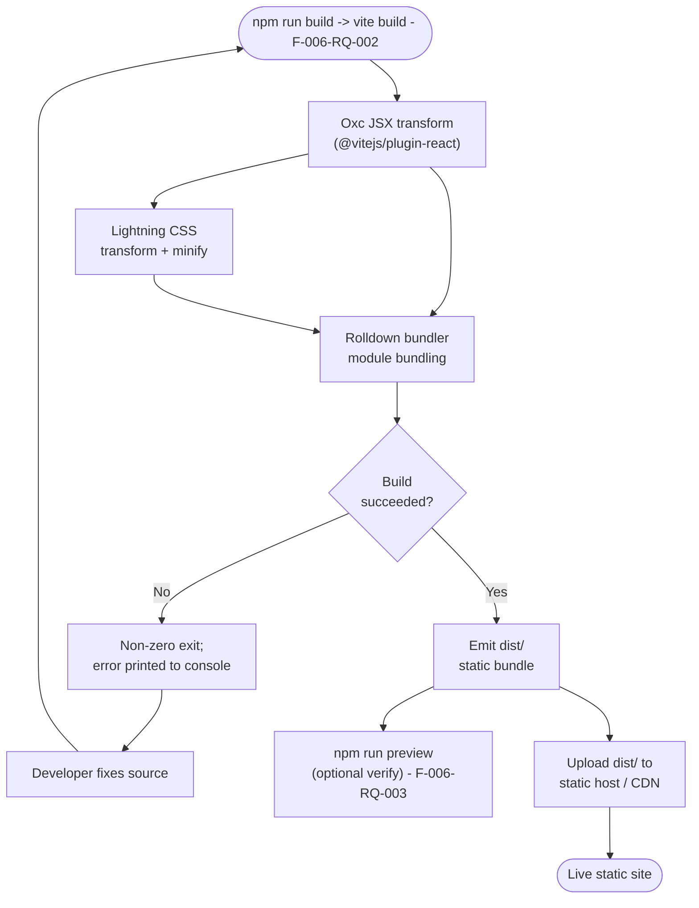
```mermaid
flowchart TD
    Start(["npm run build -> vite build - F-006-RQ-002"]) --> Transform["Oxc JSX transform<br/>(@vitejs/plugin-react)"]
    Transform --> CSS["Lightning CSS<br/>transform + minify"]
    Transform --> Bundle["Rolldown bundler<br/>module bundling"]
    CSS --> Bundle
    Bundle --> Check{"Build<br/>succeeded?"}
    Check -->|No| Fail["Non-zero exit;<br/>error printed to console"]
    Fail --> FixB["Developer fixes source"]
    FixB --> Start
    Check -->|Yes| Dist["Emit dist/<br/>static bundle"]
    Dist --> Preview["npm run preview<br/>(optional verify) - F-006-RQ-003"]
    Dist --> Deploy["Upload dist/ to<br/>static host / CDN"]
    Deploy --> End(["Live static site"])
```

**Process detail.** Under the hood, Vite 8's pipeline applies the Oxc JSX transform, Lightning CSS transformation/minification, and the Rolldown bundler to emit the optimized `dist/` directory (versions and tooling per **3.6.2**). `dist/` is git-ignored and is the sole deployable artifact (**3.6.4**); it can be served by any static host or CDN with no server runtime. **Decision/recovery:** on a non-zero exit, no `dist/` is produced and the developer must fix the source and re-run — there is no automated retry. **Timing:** the build is a one-shot batch operation; no build-time budget is codified.

### 4.2.5 Lint / Static-Analysis Validation Flow (F-006)

This build-time flow is the repository's **only automated quality gate** and the closest analogue to a "validation" process. **Start point:** `npm run lint`; **end points:** either a clean pass or a non-zero exit that routes the developer back to fixing code.

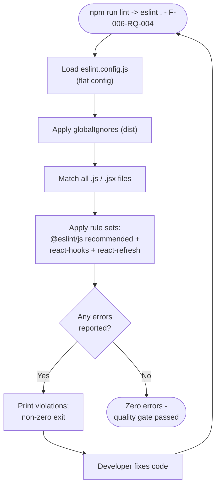
```mermaid
flowchart TD
    Start(["npm run lint -> eslint . - F-006-RQ-004"]) --> Load["Load eslint.config.js<br/>(flat config)"]
    Load --> Ignore["Apply globalIgnores (dist)"]
    Ignore --> Target["Match all .js / .jsx files"]
    Target --> Rules["Apply rule sets:<br/>@eslint/js recommended +<br/>react-hooks + react-refresh"]
    Rules --> Eval{"Any errors<br/>reported?"}
    Eval -->|Yes| Report["Print violations;<br/>non-zero exit"]
    Report --> Fix["Developer fixes code"]
    Fix --> Start
    Eval -->|No| Pass(["Zero errors -<br/>quality gate passed"])
```

**Process detail.** `eslint.config.js` is a flat config that applies `globalIgnores(['dist'])`, targets `**/*.{js,jsx}`, enables browser globals and JSX parsing, and composes three rule sets — `@eslint/js` recommended, `eslint-plugin-react-hooks` (flat recommended), and `eslint-plugin-react-refresh` (Vite preset) (F-006-RQ-004; details in **3.6.1**). **Recovery:** violations are printed to the console with a non-zero exit; the developer fixes the code and re-runs. There is **no test suite** in the repository (no Vitest/Jest or test files, per **3.6.1**), so lint plus manual verification are the entire automated/standard quality process.

### 4.2.6 Validation Rules, Authorization & Compliance Checkpoints

The prompt's "Validation Rules" dimensions (business rules at each step, data validation, authorization checkpoints, regulatory compliance) presuppose runtime inputs, protected actions, and a data domain. This repository has none of those, which **2.2 Functional Requirements** records explicitly as "None defined" across every feature. The table maps each dimension to the verified reality and to the single place a real rule is enforced (the lint/build gates).

| Validation dimension | Where it would normally apply | Reality in this repository | Evidence |
| --- | --- | --- | --- |
| Business rules at each step | Domain/business logic in runtime flows | None — no domain model or business logic exists | **2.2** ("Business Rules: None defined"); `src/` |
| Data validation requirements | Validating user/external input | None at runtime (no inputs). The only static validation is **ESLint** analysis of source (see 4.2.5) | **2.2** ("Data Validation: None"); `eslint.config.js` |
| Authorization checkpoints | Gating protected routes/actions | None — no authentication, accounts, roles, or protected routes | **1.3 Scope**; **2.2** (no auth surface) |
| Regulatory compliance checks | Privacy/data-handling obligations | None defined — no PII, cookies, tracking, or persisted data | **2.2** ("Compliance Requirements: None defined"); no client storage in source |

**Enforced rules (the only ones present).** The sole machine-enforced "rules" in the system are developer-facing quality gates, not runtime business validations: (1) the **ESLint rule sets** evaluated at `npm run lint` (4.2.5), and (2) the **implicit correctness checks of the build** — source must transform and bundle for `vite build` to emit `dist/` (4.2.4). **Authorization checkpoints** and **regulatory/compliance gates** are documented as **not applicable** to the current codebase and would be future-phase additions (consistent with the out-of-scope list in **1.3 Scope**).

**Timing & SLA considerations (consolidated).** No quantitative SLAs, latency targets, throughput goals, or performance budgets are defined anywhere in the repository (**1.2.3**, **2.2**). The only evidence-based, qualitative timing characteristics are: the bootstrap/render flow (4.2.1–4.2.2) is a single synchronous pass with no async waits; HMR (4.2.3) delivers incremental updates over a WebSocket for fast feedback; and `build`/`lint` (4.2.4–4.2.5) are one-shot batch operations with no codified duration bounds.

## 4.3 State Management and Transitions

State management in `my-react-app` is intentionally minimal: the source contains **no React state, effects, refs, context, props, or event handlers** (verified by inspecting `src/main.jsx`, `src/App.jsx`, and `src/components/Header.jsx`, and consistent with the out-of-scope determination in **1.3 Scope**). There is therefore no client-side application state to manage, no reducer/store, and no state-management library. The only meaningful "state" in the system is (1) the **runtime page-load lifecycle**, which progresses one way to a single steady state, and (2) the **developer-tooling process states** (idle / serving / building / linting). This sub-section documents both and accounts honestly for persistence, caching, and transaction boundaries.

### 4.3.1 Application Runtime State Transitions

At runtime the page advances through a short, linear lifecycle from document load to first paint and then remains in a terminal steady state. Because no `setState`, effect, timer, or event handler exists, there is **no re-render cycle** and no further transition after the initial commit.

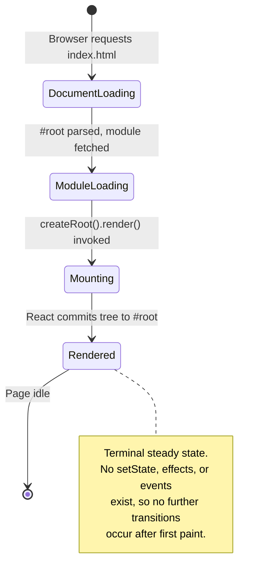
```mermaid
stateDiagram-v2
    [*] --> DocumentLoading: Browser requests index.html
    DocumentLoading --> ModuleLoading: #root parsed, module fetched
    ModuleLoading --> Mounting: createRoot().render() invoked
    Mounting --> Rendered: React commits tree to #root
    Rendered --> [*]: Page idle
    note right of Rendered
        Terminal steady state.
        No setState, effects, or events
        exist, so no further transitions
        occur after first paint.
    end note
```

**Transition detail.** `DocumentLoading → ModuleLoading` corresponds to the browser parsing `index.html` (F-002) and fetching the `/src/main.jsx` module; `ModuleLoading → Mounting` is the `createRoot(...).render(...)` call (F-001); `Mounting → Rendered` is React committing the `App`/`Header` tree into `#root` (F-004/F-003). Under React `StrictMode` in **development builds only** (F-001-RQ-002), the render functions are invoked twice during `Mounting` as a purity check — a transient behavior, not an additional persistent state, and it does not occur in the production bundle. The `Rendered` state is terminal for the lifetime of the page.

### 4.3.2 Data Persistence, Caching & Transaction Boundaries

**Data persistence points.** The application persists **no data**. There is no backend database (**1.3 Scope**, **3.5 Databases & Storage**), and the client uses no browser storage of any kind — no `localStorage`, `sessionStorage`, `IndexedDB`, cookies, Cache API, or Service Worker appear anywhere in `src/` or `index.html`. The only durable artifacts are build/development outputs, not runtime data.

| Persistence mechanism | Status | Evidence |
| --- | --- | --- |
| Backend database | Absent | No server/DB layer (**1.3 Scope**, **3.5**) |
| Browser storage (`localStorage` / `sessionStorage` / `IndexedDB`) | Absent | No usage in `src/` or `index.html` |
| Cookies | Absent | None set or read in source |
| Service Worker / Cache API (offline persistence) | Absent | No registration; no PWA manifest |
| Build artifact on disk (`dist/`) | Present (build output, git-ignored) | `vite build` (**3.6.4**) |
| Source under version control | Present (development) | Single-commit Git history (**1.2 System Overview**) |

**Caching requirements.** No application-level caching is implemented (no in-memory cache, memoization store, Service Worker, or Cache API in the source). At the **platform level**, the static assets served by the host/CDN are subject to standard browser HTTP caching; because Vite's production build emits **content-hashed asset filenames** by default (build tooling per **3.6.2**), the deployment model in **3.6.4** is naturally compatible with conventional long-lived caching and automatic cache-busting on change. This is a property of the static-hosting model and the bundler, not of any code in the repository.

**Transaction boundaries.** There are **no data transactions** in the system — no writes, no database, and nothing to commit or roll back at runtime. The only atomic, all-or-nothing operations are the **developer-tooling invocations**: a `vite build` either emits a complete `dist/` or fails with a non-zero exit and no artifact (4.2.4), and `eslint .` either passes cleanly or reports violations (4.2.5). The state diagram below models these tooling process states and their boundaries; each script run begins and ends at the `Idle` state.

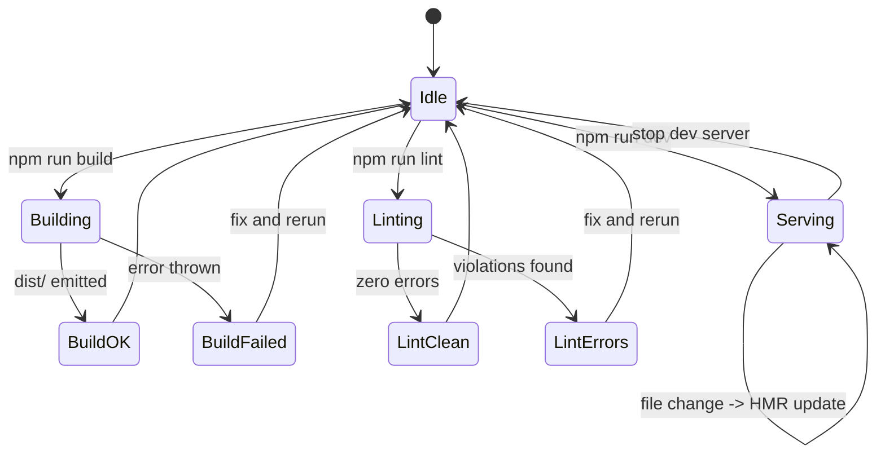
```mermaid
stateDiagram-v2
    [*] --> Idle
    Idle --> Serving: npm run dev
    Serving --> Serving: file change -> HMR update
    Serving --> Idle: stop dev server
    Idle --> Building: npm run build
    Building --> BuildOK: dist/ emitted
    Building --> BuildFailed: error thrown
    BuildOK --> Idle
    BuildFailed --> Idle: fix and rerun
    Idle --> Linting: npm run lint
    Linting --> LintClean: zero errors
    Linting --> LintErrors: violations found
    LintClean --> Idle
    LintErrors --> Idle: fix and rerun
```

**Summary.** State management here is the React mount lifecycle plus a set of stateless, idempotent developer commands. Persistent runtime state, caches, and transactional boundaries are **not applicable** to the current implementation and would be introduced only by future-phase features (dynamic data, storage, or a backend) noted as out-of-scope in **1.3 Scope**.

## 4.4 Error Handling and Recovery Flows

The repository implements **no application-level error handling**: the source contains no `try`/`catch` blocks, no React Error Boundary, no retry/backoff logic, no fallback UI, and no logging, telemetry, or alerting (consistent with the "no monitoring/analytics" findings in **1.3 Scope** and **3.4 Third-Party Services**). This is appropriate for a static, input-free, network-free SPA, but it means error handling is confined to two places: the **build/lint tooling**, which surfaces failures as non-zero process exits, and the **browser/React runtime**, which surfaces exceptions to the developer console (and, in development, the Vite error overlay). Recovery in every case is **manual**.

### 4.4.1 Failure Modes & Error-Handling Flowchart

The flowchart enumerates the realistic failure modes by stage. The lint and build stages are developer-time and gate the artifact before it ships; the runtime failures are the few ways the bootstrap/render flow (4.2.1–4.2.2) can fail in a browser. All paths converge on manual recovery because no automated handler exists.

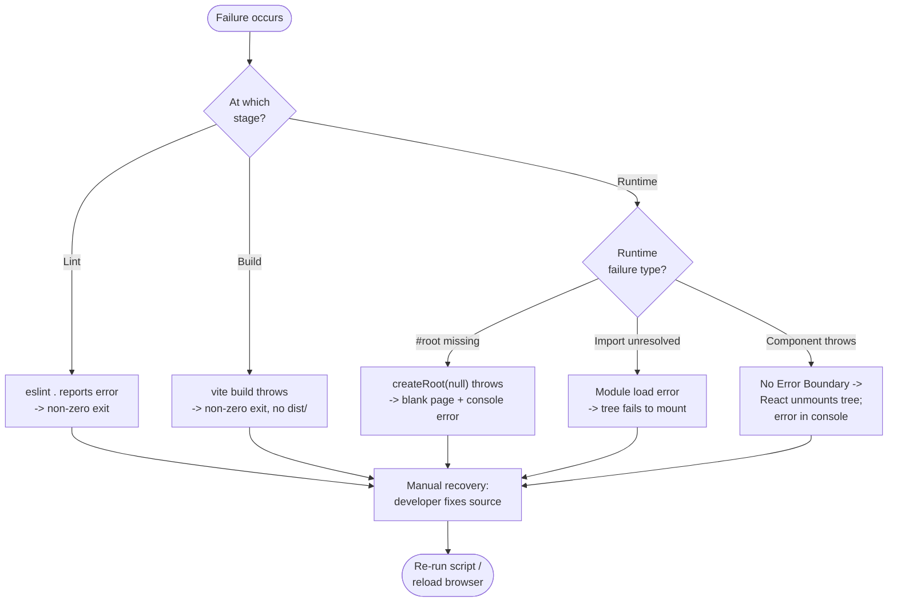
```mermaid
flowchart TD
    Start(["Failure occurs"]) --> Where{"At which<br/>stage?"}
    Where -->|Lint| L["eslint . reports error<br/>-> non-zero exit"]
    Where -->|Build| B["vite build throws<br/>-> non-zero exit, no dist/"]
    Where -->|Runtime| R{"Runtime<br/>failure type?"}
    R -->|"#root missing"| R1["createRoot(null) throws<br/>-> blank page + console error"]
    R -->|"Import unresolved"| R2["Module load error<br/>-> tree fails to mount"]
    R -->|"Component throws"| R3["No Error Boundary -><br/>React unmounts tree;<br/>error in console"]
    L --> Manual["Manual recovery:<br/>developer fixes source"]
    B --> Manual
    R1 --> Manual
    R2 --> Manual
    R3 --> Manual
    Manual --> Rerun(["Re-run script /<br/>reload browser"])
```

**Failure-mode detail.**

- **Lint failures** (`eslint .`) are reported with a non-zero exit and printed violations (4.2.5); they do not affect a running app but block a clean quality gate.
- **Build failures** (`vite build`) abort the pipeline with a non-zero exit and emit no `dist/`, so a broken build cannot be deployed (4.2.4). Import-resolution errors are normally caught here (or via the dev-server overlay) **before** reaching production.
- **Runtime — `#root` missing:** `createRoot(document.getElementById('root'))` receives `null` and throws, leaving a blank page with a console error (depends on F-002 supplying `#root`).
- **Runtime — component throws:** because there is **no Error Boundary** in the tree, an exception thrown during render propagates to the root, and React unmounts the entire tree and logs the error to the console. (React `StrictMode` is a development-time correctness aid, not a runtime error handler.)

### 4.4.2 Retry, Fallback, Notification & Recovery

Mapping the prompt's four error-handling dimensions to the verified code:

| Dimension | Status in this repository | Evidence / rationale |
| --- | --- | --- |
| Retry mechanisms | None | No retry/backoff logic in source; there are no network calls or async operations to retry |
| Fallback processes | None | No React Error Boundary, no fallback UI, no default/placeholder content on failure (`src/`) |
| Error notification flows | Console/terminal only | Lint/build print to the terminal with non-zero exit (4.2.4–4.2.5); runtime errors go to the browser devtools console and the Vite dev overlay. No user-facing error UI, monitoring, or alerting exists (**1.3 Scope**, **3.4**) |
| Recovery procedures | Manual | Developer fixes the source and re-runs the script or reloads the browser; for a deployed site, rebuild and re-upload the corrected `dist/` (4.2.4) |

**Notification flow (where errors are observed).** Build/lint diagnostics are emitted to the **developer's terminal** (and would appear in CI logs if a pipeline were ever added — none exists today per **3.6.4**). Runtime exceptions are emitted to the **browser's developer console**; during `npm run dev` they additionally appear in Vite's on-screen error overlay. There is no remote error reporting, log aggregation, or paging integration because no such third-party service is configured (**3.4 Third-Party Services**).

**Recovery procedures (the actual runbook).** For a lint or build failure, the developer corrects the flagged source and re-runs `npm run lint` / `npm run build`; for a runtime failure, the developer fixes the offending module and reloads (HMR applies the fix automatically in dev). Because deployment is a manual upload of `dist/` to a static host/CDN (**3.6.4**), recovering a broken production site means rebuilding and re-deploying. Automated retry, fallback rendering, error boundaries, and notification pipelines are **not applicable** to the current implementation and would be future-phase additions alongside the dynamic/interactive features listed as out-of-scope in **1.3 Scope**.

## 4.5 References

The following repository artifacts and previously authored specification sections were inspected as evidence for the workflows, diagrams, and determinations in Section 4. No external/web sources were used.

**Repository files examined**

- `index.html` — Established F-002: the `#root` mount point, the `type="module"` entry script, document metadata, and the `/favicon.svg` link; basis for the bootstrap (4.2.1) and integration (4.1.2) flows.
- `src/main.jsx` — Established F-001: `createRoot(...).render(<StrictMode><App/></StrictMode>)` and the `import './index.css'`; basis for the bootstrap sequence and runtime state lifecycle (4.2.1, 4.3.1).
- `src/App.jsx` — Established F-004 page composition (`<Header/>` + "About Me"); confirmed no state/props/events, grounding the deterministic render flow (4.2.2) and the "no transactional process" finding (4.1.1).
- `src/components/Header.jsx` — Established F-003 static branding header; confirmed it is pure presentational markup with no inputs.
- `src/index.css` — Established F-005 global theming/responsive layout applied during commit in the render flow (4.2.2).
- `vite.config.js` — Confirmed the Vite + `@vitejs/plugin-react` toolchain with no proxy/env customization; basis for the dev/HMR and build flows (4.2.3, 4.2.4).
- `eslint.config.js` — Established the flat-config rule sets (`@eslint/js` recommended + react-hooks + react-refresh), `globalIgnores(['dist'])`, and `**/*.{js,jsx}` targeting; basis for the lint/validation flow (4.2.5) and the "enforced rules" analysis (4.2.6).
- `package.json` — Established the `dev`/`build`/`preview`/`lint` scripts (F-006) that define the developer journey and its decision point (4.1.1), and the React 19 dependency baseline.
- `package-lock.json` — Underpins the pinned build-tool versions (Rolldown, Lightning CSS, Oxc plugin) referenced in the build flow (4.2.4) and deterministic installs (F-006-RQ-005).
- `README.md` — Confirmed the project is the minimal React + Vite template (no test framework; React Compiler not enabled), supporting the "lint + manual verification only" statement (4.2.5).
- `public/favicon.svg` — The only static asset actually served at runtime; appears in the integration sequence (4.1.2).
- `public/icons.svg` — Noted as an unused remnant (not referenced by source), excluded from the runtime flows.

**Repository folders examined**

- `src/` — Application source tree (entry, root component, styles); confirmed the absence of state, routing, persistence, and network code that underlies the honest "not applicable" determinations throughout Section 4.
- `src/components/` — Component directory containing only the static `Header.jsx`.
- `public/` — Directly served static assets (`favicon.svg`, `icons.svg`).

**Cross-referenced specification sections**

- **1.2 System Overview** (incl. 1.2.2 High-Level Description, 1.2.3 Success Criteria) — Greenfield single-commit status, client-side SPA characterization, and the "no codified SLAs/KPIs" basis for the timing notes.
- **1.3 Scope** — The two primary user workflows (visitor/developer), the browser + Node/npm integration boundary, and the out-of-scope list (no backend/API/DB/auth/routing/state/testing/CI/CD).
- **2.1 Feature Catalog** — Feature identifiers F-001…F-006 referenced throughout the flows.
- **2.2 Functional Requirements** — Requirement IDs (F-XXX-RQ-YYY) and the "None defined" entries for Business Rules, Data Validation, Compliance, and Performance Criteria used in 4.2.6.
- **3.4 Third-Party Services** — Confirmed absence of monitoring/analytics, supporting the error-notification analysis (4.4.2).
- **3.5 Databases & Storage** — Confirmed absence of persistence, supporting 4.3.2.
- **3.6 Development & Deployment** (incl. 3.6.1, 3.6.2, 3.6.4) — Build pipeline tooling/versions (Rolldown, Lightning CSS, Oxc), the npm scripts, the static-hosting deployment model, and the "no CI/CD" determination used in 4.2.3–4.2.4 and 4.4.2.

# 5. System Architecture

## 5.1 High-Level Architecture

`my-react-app` is a **static, client-side React single-page application (SPA)** — a personal portfolio website that renders one fixed page in the browser. This sub-section describes the system's architectural style and rationale, its governing principles and patterns, the boundaries between its build-time and runtime concerns, the components that compose it, the data that flows between them, and the deliberately minimal set of external integration points. Every statement is grounded in artifacts observed directly in the repository; where an enterprise concern the prompt anticipates is not implemented, the absence is stated explicitly rather than assumed. Terminology is kept consistent with **1.2 System Overview**, **3.2 Frameworks & Libraries**, and **4.1 System Workflows**.

### 5.1.1 System Overview

**Architectural style and rationale.** The system implements a **client-side-rendered (CSR), component-based single-page-application architecture** that is compiled ahead of time and deployed as static files (the JAMstack-style static-hosting model). There is no server-side application tier: `vite.config.js` registers only `@vitejs/plugin-react` with no proxy, middleware, server-side rendering, or environment configuration; `package.json` declares exactly two runtime dependencies (`react` and `react-dom`); and the source contains no HTTP server, API handler, router, or data layer. The production artifact emitted by `vite build` is a bundle of static HTML, JavaScript, and CSS that any static host or CDN can serve. This style is the natural fit for the product requirement — present a small, fixed portfolio page — and avoids the operational surface (servers, databases, sessions) that the current feature set (F-001 … F-006, see **2.1 Feature Catalog**) does not require.

A defining characteristic of the architecture is the clean separation of **two concerns that never overlap at runtime**:

- **Build-time concern** — the Node.js/npm toolchain (Vite + `@vitejs/plugin-react`, ESLint) transforms and bundles source into a deployable artifact. This tier exists only on a developer's or build machine and is entirely absent from what ships to the browser.
- **Browser-runtime concern** — the shipped bundle executes in the visitor's browser, where `react-dom` mounts a small component tree into the page. This tier has no awareness of the toolchain that produced it.

**Key architectural principles and patterns.** The following principles are evidenced directly by the codebase:

- **Component composition (declarative UI).** The UI is expressed as composable React function components (`App` composes `Header`), a unidirectional, declarative rendering model in which output is a pure function of (here, absent) inputs (`src/App.jsx`, `src/components/Header.jsx`).
- **Separation of structure and presentation.** Markup/structure lives in JSX while presentation lives in a global stylesheet of CSS custom properties; no CSS-in-JS or utility framework is used (`src/index.css`).
- **Design tokens as a single styling source of truth.** Theme values (colors, fonts, shadows) are declared once as `:root` custom properties and inherited by every component, with a dark-mode override driven by `prefers-color-scheme` (`src/index.css`).
- **Minimal dependency surface / convention over configuration.** Only `react` and `react-dom` are runtime dependencies and `vite.config.js` carries no custom configuration beyond the React plugin, minimizing the maintenance and attack surface.
- **ES module architecture.** The project is pure ESM (`"type": "module"` in `package.json`); modules are wired through a static import graph resolved by the bundler.
- **Reproducible, deterministic builds.** `package-lock.json` pins the exact resolved dependency graph (lockfile v3) so installs and builds are repeatable.
- **Static-analysis quality gate.** A flat ESLint configuration (`eslint.config.js`) enforces core, React Hooks, and React Refresh rule sets over all `.js`/`.jsx` sources.

**System boundaries and major interfaces.** Three boundaries delimit the system, each crossed by a small, well-defined interface:

- **Hosting boundary** — a Static Host / CDN serves the built `dist/` files to the browser over **HTTP(S)**. Deployment across this boundary is a **manual upload** (there is no CI/CD pipeline; see **4.1 System Workflows**).
- **Browser-runtime boundary** — the HTML shell exposes a single **DOM mount interface**, the `<div id="root">` element, into which `react-dom`'s `createRoot` API renders the tree (`index.html`, `src/main.jsx`). The browser DOM and CSS engines are the runtime platform.
- **Build/developer boundary** — the **npm-script interface** (`dev`, `build`, `preview`, `lint`) is how a developer drives the toolchain; a **dev-only HMR channel over WebSocket** pushes module updates back to the browser during `npm run dev`.

The remaining interfaces are internal: the **ES module import graph** between JavaScript modules and the **CSS custom-property contract** that components implicitly consume through inheritance. The principal architectural assumptions are therefore that an **evergreen, ES-module-capable browser** executes the bundle (no transpilation target or polyfills are configured), that a **static file host** serves the artifacts, and that a **Node.js `^20.19.0 || >=22.12.0`** environment is available at build/dev time (the floor required by `vite` and `@vitejs/plugin-react`, per **3.2 Frameworks & Libraries**).

### 5.1.2 Core Components

The system decomposes into the cooperating parts below. Dependencies and integration points are combined into one column, and the feature identifier each part realizes (from **2.1 Feature Catalog**) is noted in the responsibility column.

| Component (Source) | Primary Responsibility | Key Dependencies & Integration Points | Critical Considerations |
| --- | --- | --- | --- |
| HTML Document Shell (`index.html`) | Define document metadata, the `#root` mount point, and load the JS entry module; link the favicon (F-002) | Served/bundled by Vite (F-006); references `/src/main.jsx` (F-001) and `/favicon.svg`; consumed by the browser | Root of the load chain; must supply `#root` or `createRoot` fails; the only HTML file in the project |
| Runtime Bootstrap (`src/main.jsx`) | Create the React root on `#root` and render `<App/>` inside `<StrictMode>`; import the global stylesheet (F-001) | `react`/`react-dom` 19.2.7 (`createRoot` from `react-dom/client`, `StrictMode`); imports `./index.css` (F-005) and `./App.jsx` (F-004); requires `#root` from F-002 | Single entry point; `StrictMode` double-invokes render functions in development only; no error boundary exists above the root |
| Root Application Component (`src/App.jsx`) | Compose the single page from the header plus the "About Me" heading and intro paragraph (F-004) | Imports `Header` (F-003); rendered by F-001; its `<h2>`/`<p>` styled by the global theme (F-005) | Static and deterministic (no state/props/handlers); the sole composition root for page content; does **not** import `src/App.css` |
| Header Component (`src/components/Header.jsx`) | Render the static branding header `<h1>My Portfolio Website</h1>` (F-003) | JSX runtime via `@vitejs/plugin-react`; imported by `App.jsx`; `<h1>` inherits theme typography (F-005) | Stateless and propless; the only reusable component; serves as the composition template for future growth |
| Global Styling & Theme (`src/index.css`) | Design tokens, automatic light/dark theming, responsive typography, and the centered `#root` layout (F-005) | Imported by `main.jsx` (F-001); applied globally to the `#root` of F-002 and the elements of F-003/F-004; relies on a CSS engine supporting custom properties, `svh`, and nesting | Single source of truth for theme; the only stylesheet actually applied (`App.css` is not imported anywhere) |
| Build & Lint Tooling (`vite.config.js`, `eslint.config.js`, `package.json`) | Vite dev server/HMR/build/preview, ESLint static analysis, and reproducible installs, exposed through npm scripts (F-006) | `vite` 8.1.0, `@vitejs/plugin-react` 6.0.3, `eslint` 10.5.0 + Hooks/Refresh plugins; Node `^20.19.0 \|\| >=22.12.0`; operates over all sources; emits `dist/` | Build/dev-time only (entirely absent from the runtime bundle); no CI/CD; the React Compiler is intentionally not enabled |
| Static Assets (`public/favicon.svg`) | Provide the browser-served favicon (linked by the shell) | `favicon.svg` linked by `index.html`; copied verbatim into the build output | `public/icons.svg`, `src/assets/hero.png`, `react.svg`, and `vite.svg` are unreferenced template remnants (not wired into any module) |

### 5.1.3 Data Flow Description

Because the application has **no dynamic or application data** (no state, props, inputs, network calls, or persistence — verified across `src/` and consistent with **3.5 Databases & Storage** and **4.3 State Management and Transitions**), "data flow" in this system means the flow of *source artifacts through the build pipeline* and of *static assets and rendered markup at runtime*. Two distinct flows exist.

**Build-time flow (developer/CI machine).** Source files (`index.html`, `*.jsx`, `src/index.css`) are the input. The developer may first run `eslint .`, which performs static analysis over `**/*.{js,jsx}` and acts as a quality gate (a non-zero exit blocks a clean pass). On `vite build`, the toolchain transforms and bundles the module graph in a single pass — JSX is transformed to JavaScript by **Oxc** (via `@vitejs/plugin-react`), CSS is processed by **Lightning CSS**, and the modules are bundled, minified, and emitted with **content-hashed filenames** by the **Rolldown** bundler that underlies Vite 8 (build chain per **4.1 System Workflows** and **3.6 Development & Deployment**). The output is a self-contained `dist/` directory of static files; files in `public/` (notably `favicon.svg`) are copied through verbatim.

**Runtime flow (browser).** The data path is a one-way load-and-render sequence with no feedback loop. The browser issues an HTTP(S) `GET` for `index.html`, parses it, discovers the module `<script>`, and fetches the hashed JS entry and CSS assets (plus `/favicon.svg`). Executing the entry runs `createRoot(document.getElementById('root')).render(<StrictMode><App/></StrictMode>)` (`src/main.jsx`); React then reconciles the element tree — `App` composing `Header` plus the "About Me" content — and **commits** the resulting DOM nodes into `#root`. After first paint the page reaches a **terminal steady state**: because there is no `setState`, effect, timer, or event handler, no re-render or further data movement occurs (lifecycle detailed in **4.3 State Management and Transitions**).

**Integration patterns and protocols.** Three patterns are in play: (1) **HTTP(S) request/response** for static-asset delivery between the browser and the host/CDN; (2) the **static ES module import graph** (`main.jsx` → `index.css`, `main.jsx` → `App.jsx`, `App.jsx` → `Header.jsx`) that the bundler resolves at build time; and (3) a **dev-only push channel over WebSocket** used by Vite's HMR to deliver module updates while `npm run dev` is running — this is absent from the production bundle.

**Data transformation points.** The transformations are confined to the toolchain and the renderer: **JSX → JavaScript** (Oxc), **authored CSS → optimized CSS** (Lightning CSS), **module graph → hashed/minified bundle** (Rolldown) at build time; and at runtime **React elements → DOM nodes** (React reconciliation and commit) and **CSS custom properties → computed styles** resolved by the browser, including the `prefers-color-scheme` dark-mode override and the `max-width: 1024px` responsive breakpoint.

**Key data stores and caches.** There are **no application-level data stores or caches** — no database, in-memory cache, memoization store, Service Worker, Cache API, or browser storage (`localStorage`/`sessionStorage`/`IndexedDB`/cookies) appears anywhere in the source (**3.5 Databases & Storage**, **4.3 State Management and Transitions**). The only durable artifacts are **file-based**: the version-controlled source, the generated `dist/` bundle (git-ignored), and the `public/` assets. At the **platform level only**, the browser's standard HTTP cache benefits from Vite's content-hashed filenames, which provide automatic cache-busting on change; this is a property of the static-hosting model and the bundler, not of any code in the repository.

### 5.1.4 External Integration Points

At the **application level the system has no external integrations** — there is no backend, REST/GraphQL API, database, authentication/identity provider, message queue or event bus, payment processor, or analytics/monitoring service configured anywhere in the source (corroborated by **3.4 Third-Party Services**, **3.5 Databases & Storage**, and the integration-surface summary in **4.1 System Workflows**). The integration points that *do* exist are **platform-level** foundations required to build, serve, and render the static app. The repository defines **no Service Level Agreements**; SLA-related cells therefore record this explicitly rather than inventing targets.

| System / Platform | Integration Type | Data Exchange & Protocol | SLA / Notes |
| --- | --- | --- | --- |
| Browser / Web Platform (runtime) | Execution & rendering host | Fetches and executes the static bundle; renders via the DOM API | No SLA in repo; targets evergreen browsers (ESM + modern CSS); no polyfills/transpile target configured |
| Static Host / CDN (runtime) | Static-file hosting | Serves `dist/` (HTML/JS/CSS) and `favicon.svg` over HTTP(S); content-hashed filenames | No SLA defined in repo; deployment is a **manual upload** (no CI/CD); availability is host-dependent and not specified in source |
| Node.js / npm Toolchain (build/dev) | Local build & quality tooling | npm-script process invocation; reads source, emits `dist/` | Build/dev-time only; requires Node `^20.19.0 \|\| >=22.12.0`; not part of the runtime |
| Vite Dev Server HMR (dev only) | Live-reload channel | Pushes module updates to the browser over WebSocket | Development only; absent from the production bundle |

The absence of application-level integrations is by design for the current scope; introducing any of them (an API, a database, an identity provider, or analytics) would be a future-phase change and is documented as out of scope in **1.3 Scope**.


## 5.2 Component Details

This sub-section profiles each major component along five dimensions — purpose and responsibilities, technologies and frameworks, key interfaces and APIs, data-persistence requirements, and scaling considerations — and then presents the component-interaction, state-transition, and sequence diagrams for the system's key flows. The two presentational components (`App` and `Header`) are profiled together because they share identical technology and characteristics. All five attributes are reported strictly from observed code; where a dimension does not apply (most notably persistence), that is stated rather than assumed.

### 5.2.1 HTML Document Shell (`index.html`, F-002)

- **Purpose & responsibilities:** The top-level static document Vite serves and bundles; it defines document metadata (`lang="en"`, `charset="UTF-8"`, responsive viewport, `<title>my-react-app</title>`), provides the `<div id="root">` mount point, links the favicon, and loads the JavaScript entry module.
- **Technologies & frameworks:** Plain HTML5 with a native **ES module** script (`<script type="module" src="/src/main.jsx">`) and an SVG favicon link; no framework code executes here.
- **Key interfaces & APIs:** Exposes the **`#root` DOM mount interface** consumed by the bootstrap; declares the **module entry** (`/src/main.jsx`) and the static asset reference (`/favicon.svg`). It is both an input to Vite (the build entry) and the first artifact the browser fetches.
- **Data persistence:** None — a static document with no storage or state.
- **Scaling considerations:** A stateless static file; it scales purely through host/CDN replication and edge caching. The viewport meta tag enables responsive scaling on the client.

### 5.2.2 Runtime Bootstrap (`src/main.jsx`, F-001)

- **Purpose & responsibilities:** The browser entry module and runtime bootstrap. It creates the React root on `#root`, renders `<App/>` inside `<StrictMode>`, and imports the global stylesheet so theming is applied before paint.
- **Technologies & frameworks:** **React 19.2.7** and **React DOM 19.2.7**; uses the **concurrent `createRoot` client API** (`react-dom/client`) rather than the legacy `ReactDOM.render`, plus `StrictMode`. Authored in JSX/ESM and transformed by Oxc at build time.
- **Key interfaces & APIs:** Consumes the DOM `document.getElementById('root')` lookup and React's `createRoot(...).render(...)`; statically imports `./index.css` (the theming integration point) and `./App.jsx`. It is the single composition root wiring the tree to the DOM.
- **Data persistence:** None.
- **Scaling considerations:** Performs a single render pass per page load; the concurrent root keeps React's modern rendering model available. Because execution is per-client in the browser, there are no server-side scaling concerns.

### 5.2.3 Application & Header Components (`src/App.jsx` F-004, `src/components/Header.jsx` F-003)

- **Purpose & responsibilities:** `App` is the root composition component — it renders the page as a `<div>` containing `<Header/>`, an `<h2>About Me</h2>` heading, and a `<p>I am learning React.</p>` paragraph. `Header` is a reusable component rendering the branding `<header><h1>My Portfolio Website</h1></header>`.
- **Technologies & frameworks:** React function components and JSX. Both are **parameterless, stateless, and side-effect-free** — no hooks, props, context, refs, or event handlers anywhere.
- **Key interfaces & APIs:** Each exposes a **default export** as its public contract — `App` is consumed by `main.jsx`, and `Header` is imported and composed by `App`. Interaction is purely through JSX **component composition** (parent renders child); there is no props interface because neither accepts arguments. Notably, `App` does **not** import `src/App.css`.
- **Data persistence:** None — all content is hardcoded string literals compiled into the bundle.
- **Scaling considerations:** Component composition is the system's primary **extension point**: new sections/components are added by composing additional elements under `App`. Their stateless, deterministic nature makes them trivially reusable and predictable.

### 5.2.4 Global Styling & Theme (`src/index.css`, F-005)

- **Purpose & responsibilities:** Establishes the global visual foundation — design tokens, automatic light/dark theming, responsive typography, and the centered root layout (`#root` constrained to `width: 1126px; max-width: 100%`, centered, full-height flex column with an inline border).
- **Technologies & frameworks:** Modern CSS — `:root` **custom properties** (e.g., `--text`, `--accent: #aa3bff`, `--shadow`, `--sans`/`--heading`/`--mono` font stacks), `color-scheme: light dark`, a `@media (prefers-color-scheme: dark)` override, **CSS nesting**, `svh` units, and a `@media (max-width: 1024px)` breakpoint. Processed by **Lightning CSS** during the Vite build.
- **Key interfaces & APIs:** The **CSS custom-property contract** plus global element selectors (`#root`, `h1`, `h2`, `p`, `code`). It is imported by `main.jsx`, so its rules apply globally and all components inherit them.
- **Data persistence:** None.
- **Scaling considerations:** Token-based theming scales to new components without duplicating values, since they inherit the same `:root` variables. A maintenance caveat: `src/App.css` defines an additional 184 lines of styles that target elements absent from the JSX and is **not imported anywhere**, so it is inert dead code.

### 5.2.5 Build & Lint Tooling (`vite.config.js`, `eslint.config.js`, `package.json`, F-006)

- **Purpose & responsibilities:** Provides the development loop (dev server with HMR), the production build, a local preview of the built artifact, and static-analysis linting, plus deterministic installs via the lockfile.
- **Technologies & frameworks:** **Vite 8.1.0** (Rolldown-based bundler) with **@vitejs/plugin-react 6.0.3** (Oxc JSX transform + React Fast Refresh) and Lightning CSS; **ESLint 10.5.0** flat config extending `@eslint/js` recommended plus **eslint-plugin-react-hooks 7.1.1** and **eslint-plugin-react-refresh 0.5.3**. Requires Node `^20.19.0 || >=22.12.0`.
- **Key interfaces & APIs:** The **npm-script interface** (`dev`, `build`, `preview`, `lint`); Vite's plugin API (`plugins: [react()]`); ESLint's flat-config API (`defineConfig`, `globalIgnores(['dist'])`, `files: ['**/*.{js,jsx}']`); and the dev-only **HMR WebSocket**.
- **Data persistence:** Reads source and emits the `dist/` artifact (git-ignored); `package-lock.json` persists the resolved dependency graph for reproducible installs.
- **Scaling considerations:** Native-speed tooling (Rolldown/Oxc/Lightning CSS) keeps build and HMR fast as the codebase grows; the tier has **zero runtime footprint** because it is absent from the shipped bundle. The React Compiler is intentionally not enabled (per `README.md`).

### 5.2.6 Component Interaction & Module-Import Diagram

The diagram shows the layered architecture and the actual ES module import edges. Solid arrows are static imports/render relationships and the deploy/render path; dotted arrows are dev-time-only or tooling relationships. It complements the high-level pipeline in **1.2.2** by emphasizing the import graph and the build-time/runtime layer boundary.

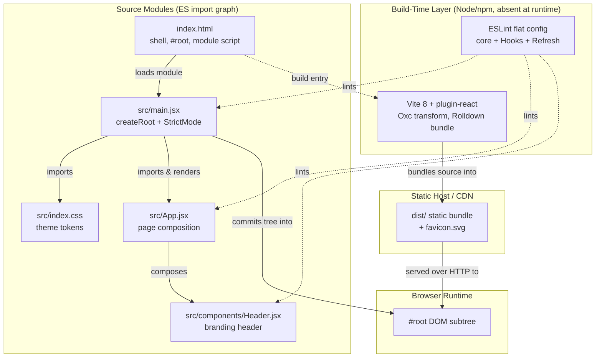
```mermaid
flowchart TD
    subgraph BuildTime["Build-Time Layer (Node/npm, absent at runtime)"]
        ViteTool["Vite 8 + plugin-react<br/>Oxc transform, Rolldown bundle"]
        ESLintTool["ESLint flat config<br/>core + Hooks + Refresh"]
    end

    subgraph Source["Source Modules (ES import graph)"]
        IndexHTML["index.html<br/>shell, #root, module script"]
        MainJS["src/main.jsx<br/>createRoot + StrictMode"]
        AppJS["src/App.jsx<br/>page composition"]
        HeaderJS["src/components/Header.jsx<br/>branding header"]
        IndexCSS["src/index.css<br/>theme tokens"]
    end

    subgraph Hosting["Static Host / CDN"]
        Dist["dist/ static bundle<br/>+ favicon.svg"]
    end

    subgraph RuntimeLayer["Browser Runtime"]
        RootDOM["#root DOM subtree"]
    end

    IndexHTML -->|loads module| MainJS
    MainJS -->|imports| IndexCSS
    MainJS -->|imports & renders| AppJS
    AppJS -->|composes| HeaderJS
    ESLintTool -.->|lints| MainJS
    ESLintTool -.->|lints| AppJS
    ESLintTool -.->|lints| HeaderJS
    IndexHTML -.->|build entry| ViteTool
    ViteTool -->|bundles source into| Dist
    Dist -->|served over HTTP to| RootDOM
    MainJS -->|commits tree into| RootDOM
```

### 5.2.7 State-Transition Diagram — React Render Root

The render root advances one way from creation to a terminal idle state. This diagram details the **render phase**, making explicit the development-only `StrictMode` double-invocation that **4.3.1** only notes in passing; in production the render function runs once.

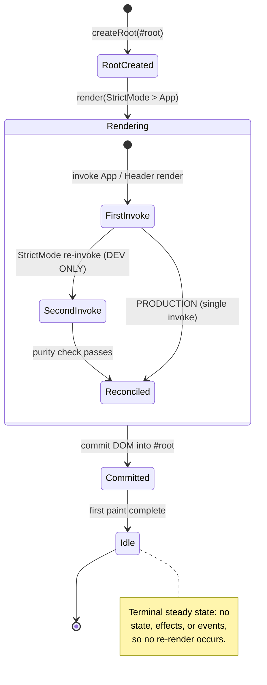
```mermaid
stateDiagram-v2
    [*] --> RootCreated: createRoot(#root)
    RootCreated --> Rendering: render(StrictMode > App)
    state Rendering {
        [*] --> FirstInvoke: invoke App / Header render
        FirstInvoke --> SecondInvoke: StrictMode re-invoke (DEV ONLY)
        SecondInvoke --> Reconciled: purity check passes
        FirstInvoke --> Reconciled: PRODUCTION (single invoke)
    }
    Rendering --> Committed: commit DOM into #root
    Committed --> Idle: first paint complete
    Idle --> [*]
    note right of Idle
        Terminal steady state: no
        state, effects, or events,
        so no re-render occurs.
    end note
```

### 5.2.8 Sequence Diagram — Cold-Load Bootstrap & Render

This sequence focuses on **in-browser module execution and React's internal render/commit**, complementing the network-level static-asset sequence already given in **4.1.2**.

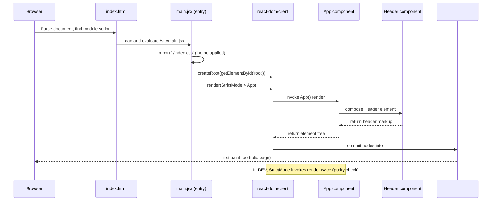
```mermaid
sequenceDiagram
    participant Browser
    participant HTML as index.html
    participant Main as main.jsx (entry)
    participant ReactDOM as react-dom/client
    participant App as App component
    participant Header as Header component
    participant DOM as #root DOM
    Browser->>HTML: Parse document, find module script
    HTML->>Main: Load and evaluate /src/main.jsx
    Main->>Main: import './index.css' (theme applied)
    Main->>ReactDOM: createRoot(getElementById('root'))
    Main->>ReactDOM: render(StrictMode > App)
    ReactDOM->>App: invoke App() render
    App->>Header: compose Header element
    Header-->>App: return header markup
    App-->>ReactDOM: return element tree
    ReactDOM->>DOM: commit nodes into #root
    DOM-->>Browser: first paint (portfolio page)
    Note over ReactDOM,App: In DEV, StrictMode invokes render twice (purity check)
```


## 5.3 Technical Decisions

This sub-section records the architecturally significant decisions evidenced by the repository and the rationale and tradeoffs behind them. A recurring theme is that several decisions are deliberate *omissions* (no backend, router, state library, database, authentication, or caching layer); these are first-class architectural choices justified by the system's minimal, single-page scope, and are documented as such. Decisions are summarized in tables and prose and then captured as Architecture Decision Records (the ADR pattern) accompanied by a decision-tree diagram.

### 5.3.1 Architecture Style Decisions & Tradeoffs

The headline decision is to build a **client-side static SPA** rather than a server-rendered or full-stack application. The supporting decisions follow from that choice and from a consistent preference for a minimal dependency surface.

| Decision Area | Choice Made (Evidence) | Rationale & Tradeoff |
| --- | --- | --- |
| Rendering model | Client-side rendering; no SSR/SSG framework (`vite.config.js` has no SSR config; deps are only `react`/`react-dom`) | Fixed content with no data makes CSR the simplest model. Tradeoff: JavaScript must execute before first paint and there is no server-side SEO/HTML pre-render — negligible for a one-page portfolio |
| Build toolchain | Vite 8 (Rolldown) + `@vitejs/plugin-react` (Oxc) | Fast native-ESM dev server, HMR, and near-zero configuration. The SWC-based plugin alternative is documented but not chosen (`README.md`) |
| Implementation language | Plain JavaScript + JSX, not TypeScript (no `tsconfig`; sources are `.jsx`) | Keeps the scaffold minimal; `README.md` explicitly recommends TypeScript for production apps, so this is a conscious deferral. Tradeoff: no static type safety |
| Styling approach | Plain CSS with custom-property tokens; no CSS-in-JS or utility framework (`src/index.css`) | Lightweight, framework-free, theme-aware styling. Tradeoff: no component-scoped styles or compile-time style checking |
| React Compiler | Not enabled (`README.md`) | Avoids the documented dev/build performance cost; the app is small enough not to need auto-memoization |

### 5.3.2 Communication Pattern Choices

The system uses only the communication mechanisms required by a static SPA, and no others:

- **HTTP(S) request/response** — the browser fetches the static bundle and `favicon.svg` from the host/CDN. This is the sole runtime, cross-boundary communication.
- **Static ES module import graph** — modules are linked at build time through `import` statements (`main.jsx` → `index.css`/`App.jsx`, `App.jsx` → `Header.jsx`), resolved and bundled by Rolldown rather than fetched individually at runtime.
- **Component composition** — parent-to-child communication occurs through JSX composition. The props channel that React provides is available but **unused** because no component accepts arguments.
- **Dev-only HMR over WebSocket** — the Vite dev server pushes module updates to the browser during `npm run dev`; this channel does not exist in the production bundle.

There is **no request/response API, publish/subscribe bus, message queue, RPC, or GraphQL layer**, because there is no backend to communicate with (consistent with **4.1 System Workflows**). The tradeoff is maximal simplicity now versus the future need to introduce a client–server pattern (e.g., `fetch`/REST) if dynamic data is ever added.

### 5.3.3 Data Storage Solution Rationale

The decision is to use **no datastore and no client-side storage**; page content is embedded directly in source (`src/App.jsx`, `src/components/Header.jsx`) and compiled into the bundle. This is justified because the application has no dynamic, user-specific, or persisted data — there is nothing to store. As detailed in **3.5 Databases & Storage**, no database driver, ORM, cache client, or browser-storage API appears anywhere in the dependency graph or source. The tradeoff is entirely favorable for the current scope: **zero data-at-rest attack surface and no PII/privacy obligations**, at the cost of no personalization or persistence — capabilities the product does not require today.

### 5.3.4 Caching Strategy Justification

The decision is to implement **no application-level caching** and to rely instead on **platform HTTP caching enabled by the bundler's content-hashed filenames**. Vite's production build emits assets with content hashes in their names, which makes each asset immutable for a given content version and therefore safe to cache for long periods, with automatic cache-busting when content changes (the static-hosting cache behavior described in **4.3 State Management and Transitions**). No in-memory cache, memoization store, Service Worker, or Cache API exists in the source. The rationale is that a static, deterministic page has nothing to memoize at runtime; the tradeoff is simplicity and standards-based caching versus the absence of offline support (there is no Service Worker or PWA manifest).

### 5.3.5 Security Mechanism Selection

The decision is that the application implements **no bespoke security mechanisms** because it presents no attack surface that would require them, and instead derives its security posture from its construction and toolchain:

- **No authentication/authorization** — there is no login, session, token, identity provider, or protected resource (no auth code anywhere in source). Authn/authz are therefore **not applicable** to the current implementation.
- **No untrusted input or injection sinks** — there are no forms, inputs, query parameters, network responses, or `dangerouslySetInnerHTML` usage; all rendered text is static literals. React's default JSX text-escaping protects even this static content from injection.
- **No secrets** — no `.env`, API keys, credentials, or tokens exist in the repository.
- **Supply-chain hygiene** — `package-lock.json` pins the exact dependency graph for reproducible installs, and ESLint provides a static-analysis gate over all sources.

The rationale is that minimizing the surface is the strongest control available to a static, input-free, network-free site. The tradeoff and explicit assumption: transport security (HTTPS) and any HTTP security headers (e.g., a Content-Security-Policy) are **host/CDN responsibilities configured outside this repository**, and any future dynamic feature (user input, an API, authentication) would require introducing real controls — validation, authn/authz, and a CSP — that do not exist today.

### 5.3.6 Architecture-Selection Decision Tree

The tree below shows how the system's requirements drive the chosen architecture. Every "Yes" branch points to a future-phase change that is currently out of scope (**1.3 Scope**); the actual implementation follows the "No" path at every node to arrive at the client-side static SPA.

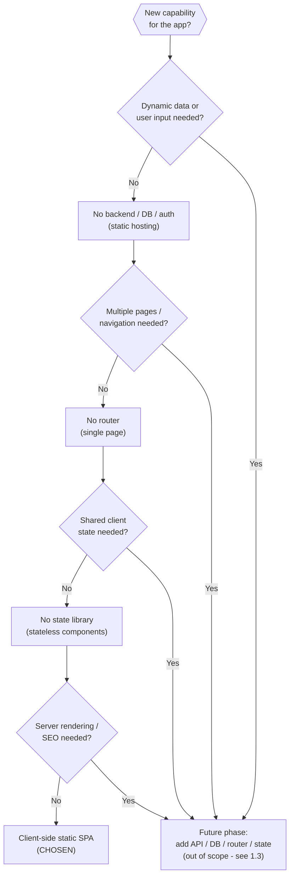
```mermaid
flowchart TD
    Start{{"New capability<br/>for the app?"}}
    Q1{"Dynamic data or<br/>user input needed?"}
    Q2{"Multiple pages /<br/>navigation needed?"}
    Q3{"Shared client<br/>state needed?"}
    Q4{"Server rendering /<br/>SEO needed?"}
    NoBackend["No backend / DB / auth<br/>(static hosting)"]
    NoRouter["No router<br/>(single page)"]
    NoState["No state library<br/>(stateless components)"]
    CSR["Client-side static SPA<br/>(CHOSEN)"]
    Future["Future phase:<br/>add API / DB / router / state<br/>(out of scope - see 1.3)"]

    Start --> Q1
    Q1 -->|No| NoBackend
    Q1 -->|Yes| Future
    NoBackend --> Q2
    Q2 -->|No| NoRouter
    Q2 -->|Yes| Future
    NoRouter --> Q3
    Q3 -->|No| NoState
    Q3 -->|Yes| Future
    NoState --> Q4
    Q4 -->|No| CSR
    Q4 -->|Yes| Future
```

### 5.3.7 Architecture Decision Records (ADRs)

The following ADRs capture the significant decisions in a consistent form. All are **Accepted**, reflecting the state actually implemented in the single-commit repository.

| ADR | Decision | Status | Primary Consequence |
| --- | --- | --- | --- |
| ADR-001 | Build a client-side static SPA; no backend or SSR/SSG | Accepted | Cheap CDN hosting and minimal ops; client must run JS to render |
| ADR-002 | Use Vite 8 + `@vitejs/plugin-react` (Oxc) as the toolchain | Accepted | Fast dev loop/HMR with near-zero config; bound to the Vite/Rolldown ecosystem |
| ADR-003 | Author in plain JavaScript/JSX; defer TypeScript | Accepted | Lower setup overhead; no static type safety (revisit for production) |
| ADR-004 | Style with plain CSS custom-property tokens; no CSS-in-JS/utility framework | Accepted | Lightweight theming; styles are global, not component-scoped |
| ADR-005 | Omit router, state-management, and data-fetching libraries | Accepted | Smallest dependency surface; these must be added if dynamic features arrive |
| ADR-006 | Enforce quality via ESLint flat config; do not enable the React Compiler | Accepted | Consistent linting gate; no auto-memoization (acceptable at this size) |

**Context and consequences (selected).**

- **ADR-001 (static SPA).** *Context:* the product is a single, fixed portfolio page with no data. *Consequences:* the operational surface (servers, databases, sessions, auth) is eliminated, deployment is a manual upload of `dist/` to a static host/CDN, and scalability is achieved by edge replication of immutable files rather than by scaling compute.
- **ADR-002 (Vite + Oxc).** *Context:* a modern, low-config frontend build with HMR was desired. *Consequences:* JSX is transformed by Oxc and the bundle produced by Rolldown with content-hashed filenames; the SWC plugin and the React Compiler are intentionally not used (`README.md`).
- **ADR-005 (omit router/state/data libs).** *Context:* there is one page, no navigation, and no shared or dynamic state. *Consequences:* the runtime dependency set stays at just `react` and `react-dom`; introducing navigation, shared state, or remote data later would mean adding the corresponding libraries and the communication/state patterns they imply (noted as out of scope in **1.3 Scope**).


## 5.4 Cross-Cutting Concerns

This sub-section addresses the standard cross-cutting concerns. For a static, input-free, network-free SPA most of them resolve to *not implemented* or *not applicable*, and that is reported plainly with evidence rather than papered over with assumed practices. The small amount that **is** present — tooling exit codes, browser-console error surfacing, content-hashed caching, and a reproducible build — is documented precisely. The posture is summarized first, then detailed per concern.

| Concern | Status in Repository | Mechanism / Evidence |
| --- | --- | --- |
| Monitoring & observability | Not implemented | No analytics, RUM, or monitoring service (**3.4 Third-Party Services**); only build/lint exit codes and browser devtools |
| Logging & tracing | Console/terminal only | No logging framework or telemetry; distributed tracing not applicable (single client, no services) |
| Error handling | Tooling + runtime, manual recovery | Non-zero exits on lint/build; runtime errors to console (+ Vite dev overlay); no Error Boundary/retry (**4.4**) |
| Authentication & authorization | Not applicable | No login, session, token, or protected resource anywhere in source (**5.3.5**, **2.2**) |
| Performance requirements & SLAs | None codified | No metrics, budgets, or quantitative KPIs defined (**1.2.3**); inherent properties only |
| Disaster recovery | No formal plan | Source under Git; `dist/` reproducible from source via `vite build`; recovery is manual |

### 5.4.1 Monitoring & Observability

The application implements **no monitoring or observability**. There is no Real User Monitoring, web-analytics tag, performance-metric collection, health check, uptime probe, or error-reporting integration anywhere in the source or dependency graph (consistent with the "no third-party services" finding in **3.4 Third-Party Services**). The only observable signals available today are:

- **Build/lint exit status** — `vite build` and `eslint .` return zero on success and non-zero on failure, the binary engineering signals identified in **1.2.3**.
- **Browser developer tools** — at runtime, an operator can inspect the rendered DOM, network requests, and console in the browser's devtools.

Any production telemetry (RUM, error aggregation, alerting) would be a future-phase addition requiring a third-party service that is not present.

### 5.4.2 Logging & Tracing

There is **no application logging framework and no distributed tracing**. The source contains no logger, no structured-log emitter, and no trace-context propagation — which is expected, since logging frameworks and tracing presuppose long-running services or network calls that this client-only app does not have. The practical "logging" surface is therefore:

- **Developer terminal** — Vite and ESLint print diagnostics (and stack traces on build failure) to stdout/stderr during `npm run` commands.
- **Browser console** — uncaught runtime exceptions are written to the browser console, and during `npm run dev` they additionally appear in Vite's on-screen error overlay.

**Distributed tracing is not applicable**: the system is a single client-side bundle with no services, no inter-service calls, and no request lifecycle to correlate.

### 5.4.3 Error Handling Patterns

The repository implements **no application-level error handling** — there is no `try`/`catch`, no React **Error Boundary**, no retry/backoff, and no fallback UI (verified across `src/`, consistent with **4.4 Error Handling and Recovery Flows**). Error handling is consequently confined to two layers and **recovery is always manual**:

- **Build/lint layer (gates the artifact):** an ESLint violation or a `vite build` failure produces a **non-zero process exit**, surfaced in the developer terminal; a broken build emits no `dist/`, so it cannot be deployed.
- **Browser-runtime layer (no safety net):** a missing `#root` makes `createRoot(null)` throw (blank page + console error); an unresolved import prevents the tree from mounting; and because there is no Error Boundary, a component that throws during render causes React to unmount the entire tree and log the error to the console. (`StrictMode` is a development correctness aid, **not** a runtime error handler.)

The diagram below frames errors by **architectural layer and observer surface** — which boundary contains each error class and where it becomes visible — complementing the stage-based failure tree in **4.4.1**. All paths converge on manual recovery.

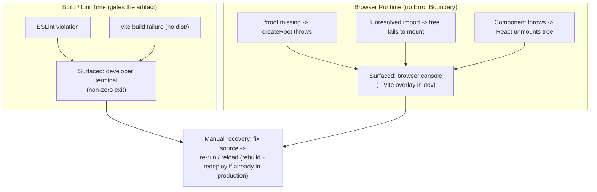
```mermaid
flowchart TD
    subgraph BuildTimeErr["Build / Lint Time (gates the artifact)"]
        LintErr["ESLint violation"]
        BuildErr["vite build failure (no dist/)"]
        TermSurface["Surfaced: developer terminal<br/>(non-zero exit)"]
    end

    subgraph RuntimeErr["Browser Runtime (no Error Boundary)"]
        RootErr["#root missing -> createRoot throws"]
        ImportErr["Unresolved import -> tree fails to mount"]
        RenderErr["Component throws -> React unmounts tree"]
        ConsoleSurface["Surfaced: browser console<br/>(+ Vite overlay in dev)"]
    end

    Recover["Manual recovery: fix source -><br/>re-run / reload (rebuild +<br/>redeploy if already in production)"]

    LintErr --> TermSurface
    BuildErr --> TermSurface
    RootErr --> ConsoleSurface
    ImportErr --> ConsoleSurface
    RenderErr --> ConsoleSurface
    TermSurface --> Recover
    ConsoleSurface --> Recover
```

### 5.4.4 Authentication & Authorization

**No authentication or authorization framework exists, and none is applicable.** The application has no login flow, session, token, cookie, identity provider, role model, or protected resource — there is nothing to authenticate to and nothing to authorize against (corroborated by **5.3.5 Security Mechanism Selection** and the functional requirements in **2.2**). Every visitor receives the identical, fully public static page. Introducing authn/authz would require adding a backend or identity service and the associated session/token handling, all of which are out of scope (**1.3 Scope**).

### 5.4.5 Performance Requirements & SLAs

The repository codifies **no Service Level Agreements, performance budgets, or quantitative KPIs** — there are no metrics, analytics, or performance targets defined anywhere in the source (established in **1.2.3**). No numeric latency, availability, or throughput targets are invented here. The performance characteristics that *do* follow inherently from the architecture, stated qualitatively, are:

- **Minimal runtime work** — the rendered tree is two components with no state, effects, timers, or event handlers, so after first paint there is **no re-render cycle** and effectively no ongoing CPU usage (**4.3 State Management and Transitions**).
- **Small transfer surface** — only `react`/`react-dom` ship at runtime; the bundle is minified by Rolldown and emitted with content-hashed filenames.
- **Efficient repeat loads** — content-hashed assets are highly cacheable by the browser/CDN, so returning visitors typically load from cache (a property of the static-hosting model, per **5.3.4**).

Establishing concrete SLAs or performance budgets (e.g., Core Web Vitals thresholds) would be a future-phase activity, as none exist today.

### 5.4.6 Disaster Recovery Procedures

There is **no formal disaster-recovery plan, backup schedule, or defined RTO/RPO** in the repository. Recovery is feasible and simple, however, because of the architecture's properties:

- **Source of truth** — the application source is under Git version control (a single-commit history per **1.2 System Overview**); recovering the source means restoring the repository.
- **Reproducible artifact** — the deployable `dist/` is **fully reproducible from source** by running `npm install` (against the pinned `package-lock.json`) and `vite build`; the build output is git-ignored precisely because it is regenerable.
- **Manual redeploy** — because deployment is a manual upload of `dist/` to a static host/CDN (**4.1 System Workflows**), recovering a broken or lost production site means rebuilding and re-uploading. There is no stateful data tier to back up or restore, which removes the hardest part of most DR plans.

Formal backup, failover, and multi-region procedures would be host/CDN-level concerns to be defined alongside any future move beyond a single manually deployed static site.


## 5.5 References

The following repository artifacts and specification sections were examined directly as the evidence base for Section 5. No external web sources were used; every claim is grounded in files observed in the repository.

**Files examined**

- `package.json` - Declared runtime/dev dependencies and versions, the `dev`/`build`/`preview`/`lint` scripts, ESM (`"type": "module"`), and the private `my-react-app` identity.
- `package-lock.json` - Pinned resolved dependency graph (lockfile v3) confirming reproducible/deterministic installs.
- `vite.config.js` - Vite configuration registering only `@vitejs/plugin-react` (no SSR, proxy, alias, or environment config).
- `eslint.config.js` - Flat ESLint config (`globalIgnores(['dist'])`, `files: ['**/*.{js,jsx}']`, core + React Hooks + React Refresh rule sets, browser globals).
- `index.html` - The HTML shell: document metadata, `#root` mount point, module entry `<script src="/src/main.jsx">`, and `favicon.svg` link.
- `README.md` - Template documentation; established that the React Compiler is intentionally not enabled, that the plugin uses Oxc (SWC alternative not chosen), and that TypeScript is recommended for production.
- `.gitignore` - Confirmed the build output `dist/` is git-ignored as a regenerable artifact.
- `src/main.jsx` - Runtime bootstrap: `createRoot(...).render(<StrictMode><App/></StrictMode>)` and the global CSS import.
- `src/App.jsx` - Root composition (Header + "About Me" content); confirmed it does **not** import `src/App.css` and uses no state/props/handlers.
- `src/components/Header.jsx` - The static, propless branding header component.
- `src/index.css` - Global theme tokens, `prefers-color-scheme` dark mode, the `max-width: 1024px` breakpoint, and the centered `#root` layout (the only applied stylesheet).
- `src/App.css` - The unreferenced (dead) stylesheet, confirming it is not imported anywhere.

**Folders examined**

- `src/` - Application source (entry, root component, styling, components, assets).
- `src/components/` - Reusable components (currently only `Header.jsx`).
- `src/assets/` - In-tree images (`hero.png`, `react.svg`, `vite.svg`) confirmed unreferenced by any module.
- `public/` - Browser-served static assets (`favicon.svg`, linked by the shell; `icons.svg`, unused).

**Cross-referenced specification sections**

- `1.2 System Overview` (incl. `1.2.3 Success Criteria`) - System framing, component inventory, and the absence of codified SLAs/KPIs.
- `1.3 Scope` - In-scope vs. out-of-scope features and integrations.
- `2.1 Feature Catalog` - Authoritative feature identifiers F-001 … F-006.
- `2.2 Functional Requirements` - Confirmation of "None defined" for business rules/validation and the absence of an auth surface.
- `3.2 Frameworks & Libraries` - Resolved dependency versions, peer compatibility, and the Node `^20.19.0 || >=22.12.0` floor.
- `3.4 Third-Party Services` - Confirmation that no analytics/monitoring/third-party services are configured.
- `3.5 Databases & Storage` - Confirmation of no database, cache, or client-side storage.
- `3.6 Development & Deployment` - Build system details and the static-hosting/manual-deploy model.
- `4.1 System Workflows` - Visitor/developer journeys, the Oxc + Lightning CSS + Rolldown build chain, and the runtime static-asset sequence.
- `4.3 State Management and Transitions` - Page-load lifecycle, StrictMode dev double-invocation, and the no-persistence/no-cache findings.
- `4.4 Error Handling and Recovery Flows` - Failure modes, the absence of an Error Boundary/retry, and manual recovery.


# 6. SYSTEM COMPONENTS DESIGN

## 6.1 Core Services Architecture

### 6.1.1 Applicability Assessment

This section is conditional by design: a Core Services Architecture is documented only when a system is composed of multiple cooperating services — a microservices deployment or an otherwise distributed runtime. This sub-section records the applicability determination for `my-react-app` against that condition with direct repository evidence; the sub-sections that follow (6.1.2–6.1.4) then walk through each requested concern and explain its status.

**Determination: Core Services Architecture is not applicable for this system.**

`my-react-app` is a single, self-contained, **static client-side React single-page application (SPA)** — the architectural style established in **5.1 High-Level Architecture**. It compiles ahead of time into one immutable static bundle that executes entirely within a visitor's browser. There is no server-side application tier, no second deployable process, and no set of cooperating services to coordinate. Consequently the disciplines a Core Services Architecture exists to describe — service decomposition, inter-service communication, service discovery, load balancing, circuit breaking, auto-scaling, and cross-service failover — have no subject matter in this repository.

The determination rests on the following directly observed facts:

- **A single deployable unit.** `package.json` declares exactly two runtime dependencies (`react`, `react-dom`) and four developer scripts (`dev`, `build`, `preview`, `lint`); none starts a long-running server, worker, or background process. The only build output is the static `dist/` bundle (**3.6 Development & Deployment**).
- **No server-side or backend code.** The repository contains a single HTML shell (`index.html`) and three JavaScript modules (`src/main.jsx`, `src/App.jsx`, `src/components/Header.jsx`); there is no HTTP server, API handler, router, or data layer (**5.1.1**, **5.1.4**).
- **No service-oriented dependencies.** Neither `package.json` nor the resolved `package-lock.json` graph contains a web-server framework (Express/Fastify/Nest), an RPC stack (gRPC), a message-broker client (AMQP/Kafka/NATS), a datastore client, a service-discovery client (Consul/Eureka), a circuit-breaker library (e.g., opossum/cockatiel), or an HTTP client (axios) — none of the building blocks of a distributed service.
- **No orchestration or infrastructure manifests.** There is no `Dockerfile`, `docker-compose`, Kubernetes manifest, `Procfile`, `serverless` definition, Terraform, or CI/CD pipeline anywhere in the tree (**3.6.3**, **3.6.4**).
- **No runtime inter-process communication.** The source contains no network calls (`fetch`/`XMLHttpRequest`/WebSocket), web or service workers, and no message-passing primitives; the application performs a single one-way load-and-render pass and then reaches a terminal steady state (**5.1.3**, **4.3 State Management and Transitions**).

Table 6.1.1-1 evaluates the system against the criteria that would make a Core Services Architecture applicable.

**Table 6.1.1-1 — Distributed-Architecture Applicability Evaluation**

| Distributed-System Criterion | Present in `my-react-app`? | Evidence |
| --- | --- | --- |
| Multiple independently deployable services | No | Single static `dist/` bundle; `package.json` scripts start no server (3.6) |
| Server-side / backend runtime tier | No | No server code; only `index.html` + three JSX modules; runtime deps are `react`/`react-dom` only (5.1.1) |
| Inter-service communication (REST/RPC/messaging) | No | No `fetch`/WebSocket/gRPC/broker clients in source or dependency graph (5.1.4) |
| Service discovery / registry | No | No Consul/Eureka/DNS-SD client or registry configuration present |
| Load balancer / API gateway | No | No gateway, proxy, or LB config; `vite.config.js` defines no proxy or middleware |
| Container / orchestration manifests | No | No Dockerfile, compose, Kubernetes, Procfile, or IaC (3.6.3) |

The diagram below depicts the system's complete topology. It reduces to three boundaries crossed by simple, one-directional interfaces — a build-time toolchain that produces a single artifact, a static host that serves it, and one browser runtime that renders it — with no service mesh and no inter-service traffic.

**Diagram 6.1.1-1 — Complete Service Topology of `my-react-app`**


```mermaid
flowchart LR
    subgraph BuildTime["Build-Time Tier - developer / build machine, not shipped"]
        Src["Source modules:<br/>index.html, JSX, index.css"]
        Toolchain["Vite 8 + plugin-react + ESLint<br/>single build process"]
        Bundle["dist/ static bundle:<br/>one immutable artifact"]
    end

    subgraph Hosting["Hosting Tier - static host / CDN, not configured in repo"]
        Host["Static file server / CDN<br/>serves HTML, JS, CSS, favicon"]
    end

    subgraph Runtime["Browser Runtime Tier - single client-side unit"]
        ReactApp["react-dom mounts App then Header<br/>into #root : one thread"]
    end

    NoSvc["Absent by design:<br/>no APIs, message queues, gRPC,<br/>service discovery, or load balancer"]

    Src --> Toolchain
    Toolchain --> Bundle
    Bundle -->|manual upload| Host
    Host -->|HTTPS GET static assets| ReactApp
    ReactApp -.->|contains no| NoSvc
```

The remaining sub-sections document each concern the section prompt enumerates — service components (6.1.2), scalability (6.1.3), and resilience (6.1.4) — grounding the not-applicable status in this same evidence while noting the small set of behaviors that *do* meaningfully apply, such as host/CDN-level distribution of static files and reproducible-from-source recovery.

### 6.1.2 Service Components Analysis

Because the system comprises no services (6.1.1), the six service-component concerns enumerated by this section have no service-level subject matter. They are nonetheless addressed individually below, each mapped to the closest in-process or platform reality that exists in the repository, with evidence. The only genuine decomposition present is (a) the in-process **React component tree** — `App` composing `Header` — and (b) the architectural split between the **build-time toolchain** and the **browser runtime** described in **5.1.1**; neither is a network-addressable service.

**Table 6.1.2-1 — Service-Component Concerns vs. Repository Reality**

| Service-Component Concern | Status | Evidence / In-Repository Reality |
| --- | --- | --- |
| Service boundaries & responsibilities | Not applicable | No services; only the in-process React component tree (`App` -> `Header`) and the build-time/runtime split (5.1.1, 5.1.2) |
| Inter-service communication patterns | Not applicable | No service-to-service calls; the only data paths are the build-time ES module import graph and a runtime HTTP(S) GET of static assets (5.1.3) |
| Service discovery mechanisms | Not applicable | Module/asset references resolved to content-hashed paths at build time; no registry or dynamic endpoint resolution |
| Load balancing strategy | Not applicable (app); host-layer concern | App defines no balancer; distributing identical static files across CDN edges is a host concern, not in repo (see 6.1.3) |
| Circuit breaker patterns | Not applicable | No remote dependencies to protect; no circuit-breaker library (opossum/cockatiel) in the dependency graph |
| Retry & fallback mechanisms | Not applicable | No network calls to retry; no React Error Boundary or fallback UI (5.4.3); a failed build/lint is re-run manually |

The detail behind each row:

- **Service boundaries and responsibilities.** The repository contains no service boundaries. The closest analogue is the *module/component boundary*: responsibilities are split across the HTML shell (`index.html`), the bootstrap (`src/main.jsx`), the page-composition root (`src/App.jsx`), the presentational `Header` (`src/components/Header.jsx`), and global styling (`src/index.css`) — all catalogued as in-process components in **5.1.2 Core Components**. These execute in one browser thread and share a single address space; they are not independently deployable or network-addressable.
- **Inter-service communication patterns.** There is no inter-service communication. Components interact only through ordinary in-process composition — `App` renders `<Header />` directly, and here even props are absent (the components are static and parameterless). The only cross-boundary data movement is (1) the static **ES module import graph** resolved by the bundler at build time and (2) a one-way **HTTP(S) GET** of static assets from the host to the browser at load time (**5.1.3**, **5.1.4**). No request/response, publish/subscribe, or streaming protocol connects independent services.
- **Service discovery mechanisms.** None exist and none are needed. Module and asset references are resolved statically: imports are wired by the Rolldown bundler at build time, and asset URLs are emitted as content-hashed paths into `index.html`. There is no registry, DNS-based discovery, or runtime endpoint resolution because there is no second endpoint to discover.
- **Load balancing strategy.** The application defines no load balancing — there is no gateway, reverse proxy, or balancer configuration, and `vite.config.js` declares no proxy. Because the deployable is a set of identical, stateless static files, any horizontal distribution (for example, serving the same files from multiple CDN edge nodes) is a property of the chosen host/CDN rather than of the application, and no such host is configured in the repository (examined further in **6.1.3**).
- **Circuit breaker patterns.** Not applicable. Circuit breakers guard calls to remote dependencies that may fail or slow down; this application makes no such calls, and no circuit-breaker library (e.g., opossum, cockatiel) appears in `package.json` or `package-lock.json`. There is nothing to trip.
- **Retry and fallback mechanisms.** Not applicable at runtime. With no network calls there is nothing to retry, and the source contains no React **Error Boundary**, `try`/`catch`, or fallback UI (**5.4.3 Error Handling Patterns**). The only "retry" in the system is a developer manually re-running a failed `eslint .` or `vite build` after fixing the source — a build-time, human-driven action rather than an automated service pattern.

### 6.1.3 Scalability Design

Scalability for a distributed system concerns how cooperating services add capacity under load. `my-react-app` has no services and no server tier, so the application defines no runtime scaling mechanism of its own. What "scaling" means here is reframed honestly in two parts: (1) the real, in-repository techniques that keep the artifact small and efficient, and (2) the host/CDN-level distribution of that artifact, which is deployment-target-dependent and not configured in the repository. Each prompt item is addressed against that frame.

- **Horizontal and vertical scaling approach.** The repository configures neither. There is no server process to replicate (horizontal) or to grant more CPU/memory (vertical) — `package.json` starts no runtime service. Two facts shape what scaling can mean: first, *client-side execution distributes naturally* — each visitor's browser renders an independent copy of the bundle using that visitor's own device resources, so per-user runtime cost never aggregates on a shared server (the render is two static components with no post-paint work, per **5.4.5**); second, *the artifact is trivially horizontally distributable* — because `dist/` is a set of identical, stateless static files, "scaling out" means replicating those files across additional static-host/CDN nodes, a host-layer operation external to the application. No host, replica count, or CDN is configured in the repository (**3.6.4**). Vertical scaling of a runtime tier is therefore not applicable, and horizontal scaling is delegated entirely to the (unspecified) deployment target.
- **Auto-scaling triggers and rules.** None are defined. There is no autoscaler, scaling policy, replica target, or metric-based trigger (CPU / requests-per-second / queue-depth) anywhere in the source or configuration — consistent with the absence of any orchestration manifest (**3.6.3**). Auto-scaling, if ever desired, would be configured on a host/CDN platform and is out of scope for the repository (**1.3 Scope**).
- **Resource allocation strategy.** No resource-allocation configuration exists (no container CPU/memory limits, no Node memory flags, no concurrency settings). Resources are consumed in two disjoint phases: at **build time** the Node toolchain runs on a developer/build machine; at **runtime** the only resources used are the visitor's browser CPU, memory, and GPU, and these are minimal because the rendered tree is static and produces no re-render cycle after first paint (**5.4.5**, **4.3**).
- **Performance optimization techniques.** These genuinely exist and are a property of the build toolchain rather than of any service tier. The optimizations observed are: a **minimal transfer surface** (only `react` and `react-dom` ship at runtime — no router, state library, CSS framework, or analytics payload, per **3.2** and **5.4.5**); a **minified, tree-shaken bundle** (the Rolldown bundler underlying Vite 8 bundles and minifies the module graph and Lightning CSS optimizes the stylesheet, per **3.6.2**); **content-hashed filenames** (build output carries content hashes, giving automatic cache-busting and highly cacheable assets for repeat loads at the browser/CDN layer, per **5.1.3** and **5.4.5**); and a **single synchronous render** (`react-dom` performs one reconciliation-and-commit pass with no effects, timers, or handlers, so there is no ongoing CPU cost, per **5.1.3**).
- **Capacity planning guidelines.** No capacity targets, traffic projections, or performance budgets are codified anywhere in the repository (**5.4.5**, **1.2.3**); none are invented here. For a static artifact, "capacity" is the bandwidth and storage of the chosen host/CDN, which scales with that platform rather than with application code. The artifact's own footprint is small and fixed per build (HTML shell + hashed JS/CSS + favicon), and because returning visitors are typically served cached, content-hashed assets, origin load grows sub-linearly with traffic at the host level.

**Table 6.1.3-1 — Scalability Concerns vs. Repository Reality**

| Scalability Concern | Status | Evidence / Mechanism |
| --- | --- | --- |
| Horizontal scaling | Host/CDN-layer only; not in repo | Identical stateless static files replicable across edges; no host/replica config (3.6.4) |
| Vertical scaling | Not applicable | No server tier to resize; each client renders on the visitor's own device |
| Auto-scaling triggers & rules | None | No autoscaler/policy/metric trigger; no orchestration manifest (3.6.3) |
| Resource allocation | None configured | No container limits or Node flags; runtime cost is the visitor's browser only |
| Performance optimization | Present (build-time) | Minified/tree-shaken Rolldown bundle, Lightning CSS, content hashing, minimal deps (3.6.2, 5.4.5) |
| Capacity planning | None codified | No budgets/projections (5.4.5); capacity is host bandwidth/storage |

The diagram below separates the in-repository application scope — a single stateless artifact with no scaling logic — from the deployment-target-dependent host/CDN layer where any horizontal distribution would occur.

**Diagram 6.1.3-1 — Scalability Architecture (Application Scope vs. Host/CDN Layer)**

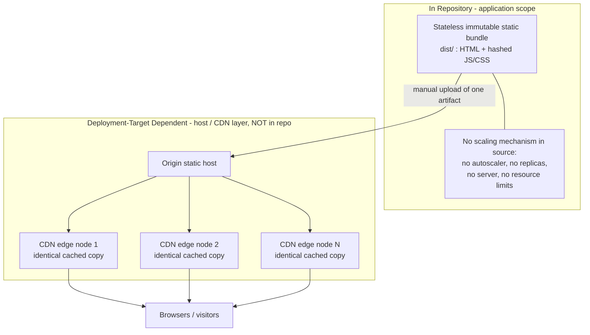
```mermaid
flowchart TD
    subgraph InRepo["In Repository - application scope"]
        Artifact["Stateless immutable static bundle<br/>dist/ : HTML + hashed JS/CSS"]
        NoScale["No scaling mechanism in source:<br/>no autoscaler, no replicas,<br/>no server, no resource limits"]
        Artifact --- NoScale
    end

    subgraph HostLayer["Deployment-Target Dependent - host / CDN layer, NOT in repo"]
        Origin["Origin static host"]
        Edge1["CDN edge node 1<br/>identical cached copy"]
        Edge2["CDN edge node 2<br/>identical cached copy"]
        EdgeN["CDN edge node N<br/>identical cached copy"]
        Origin --> Edge1
        Origin --> Edge2
        Origin --> EdgeN
    end

    Visitors["Browsers / visitors"]

    Artifact -->|manual upload of one artifact| Origin
    Edge1 --> Visitors
    Edge2 --> Visitors
    EdgeN --> Visitors
```

In short, the application contributes statelessness and a small, cache-friendly footprint that make it *easy* to scale at the hosting layer, but it neither performs nor configures any scaling itself.

### 6.1.4 Resilience Patterns

Resilience patterns describe how a system tolerates and recovers from faults. As with the prior concerns, `my-react-app` implements no application-level resilience patterns — there is no React Error Boundary, `try`/`catch`, retry/backoff, circuit breaker, or fallback UI in the source (**5.4.3**) — because a single static client-side unit has no failure-prone remote dependencies to guard. What the system does have is a favorable *resilience posture* that follows from its architecture: statelessness, a fully reproducible artifact, and immutable content-hashed assets. Each prompt item is addressed below; the disaster-recovery discussion complements **5.4.6** rather than repeating it.

- **Fault tolerance mechanisms.** None are implemented at the application layer. The system is a single fault domain: with no Error Boundary above the root, a component that throws during render causes React to unmount the entire tree and log to the console (**5.4.3**), and a missing `#root` makes `createRoot` throw. The one structural safeguard is at build time — a failed `vite build` emits no `dist/`, so a broken artifact cannot be deployed (a fail-closed property, **5.4.3**). Fault tolerance therefore comes not from redundancy but from the unit being small, stateless, and trivially reconstructable.
- **Disaster recovery procedures.** Consistent with **5.4.6 Disaster Recovery Procedures**, the repository defines no formal DR plan, backup schedule, or RTO/RPO. Recovery is simple because the source is the single source of truth under Git and the deployable `dist/` is **fully reproducible** by running `npm install` (against the pinned `package-lock.json`) and `vite build`; restoring a lost or broken site is a manual rebuild-and-re-upload. There is no stateful data tier to back up or restore — the hardest part of most DR plans is therefore absent.
- **Data redundancy approach.** Not applicable. The application has no data tier and no persistence — no database, in-memory store, Service Worker, Cache API, or browser storage (**3.5**, **5.1.3**) — so there is no application data to replicate or keep redundant. The only durable redundancy that exists is the Git-versioned source plus the regenerable build output; replication of the static files themselves (across CDN edges or host replicas) is a host-layer property, not configured in the repository (**3.6.4**).
- **Failover configurations.** None exist in the repository. There is no standby instance, health check, health-probe-driven failover, or multi-region configuration — and no orchestration manifest in which to define them (**3.6.3**). Any failover would be a property of the chosen static host/CDN and is explicitly a host-level concern per **5.4.6**.
- **Service degradation policies.** There are no services to degrade and no graceful-degradation, feature-flag, or load-shedding logic in the source. One honest consequence of the static-SPA model is the lack of a no-JavaScript fallback: `index.html` ships only the empty `<div id="root">` mount point and the module script, with no server-rendered content or `<noscript>` fallback, so if the bundle fails to load or execute the visitor sees a blank page rather than degraded content. This is a known trade-off of client-side rendering and is documented here rather than mitigated, since adding SSR or a fallback is out of scope (**1.3 Scope**).

**Table 6.1.4-1 — Resilience Concerns vs. Repository Reality**

| Resilience Concern | Status | Evidence / Inherent Property |
| --- | --- | --- |
| Fault tolerance | No app-level mechanism | No Error Boundary/try-catch/retry (5.4.3); single fault domain; failed build emits no `dist/` (fail-closed) |
| Disaster recovery | No formal plan; reproducible | Source in Git; `dist/` rebuildable via `npm install` + `vite build`; manual redeploy; no stateful tier (5.4.6) |
| Data redundancy | Not applicable | No data tier/persistence to replicate (3.5, 5.1.3); only Git source + regenerable build |
| Failover | None in repo | No standby/health-check/multi-region; no orchestration manifest (3.6.3); host-level concern (5.4.6) |
| Service degradation | None | No graceful-degradation/feature flags; no `<noscript>`/SSR fallback -> blank page if the bundle fails |

The diagram below visualizes this posture: a single fault domain with no app-level resilience patterns, and a manual recovery loop that leans on the reproducible-from-source artifact — complementing the prose DR procedure in **5.4.6** and the stage-based failure tree in **4.4.1**.

**Diagram 6.1.4-1 — Resilience Posture and Manual Recovery Loop**

```mermaid
flowchart TD
    subgraph FaultDomain["Single Fault Domain - one client-side static unit"]
        AppUnit["Static SPA in browser:<br/>App + Header, no shared/server state"]
        NoPattern["No app-level resilience patterns:<br/>no Error Boundary, no retry/backoff,<br/>no failover, no graceful degradation"]
    end

    Failure{{"Failure event:<br/>build break or runtime exception?"}}

    subgraph Recovery["Recovery Path - manual, from source of truth"]
        Git["Git source<br/>single source of truth"]
        Rebuild["npm install + vite build<br/>reproducible artifact"]
        Redeploy["Re-upload dist/<br/>content-hashed atomic replace"]
        Git --> Rebuild --> Redeploy
    end

    AppUnit --> Failure
    NoPattern -.-> Failure
    Failure -->|manual intervention| Git
    Redeploy --> AppUnit
```

In summary, resilience here is achieved by *elimination of failure modes* (no services, no state, no data tier) rather than by redundancy or failover patterns: the application cannot lose data it never holds, and any deployed instance can be rebuilt bit-for-bit from source and re-published.

### 6.1.5 References

**Repository artifacts examined as primary evidence**

- `package.json` - Established the single-unit nature: exactly two runtime dependencies (`react`, `react-dom`) and four developer scripts (`dev`/`build`/`preview`/`lint`) with no server, worker, or background process; no service-oriented dependencies.
- `package-lock.json` - Confirmed the resolved dependency graph contains no web-server framework, RPC stack, message-broker client, datastore client, service-discovery client, or circuit-breaker library.
- `vite.config.js` - Confirmed no proxy, middleware, server-side rendering, or multi-target build (a trivial `defineConfig({ plugins: [react()] })`).
- `index.html` - Single HTML shell with the `<div id="root">` mount point and the ES-module entry script; no `<noscript>` or server-rendered fallback content.
- `eslint.config.js` - Flat ESLint configuration acting as the build-time quality gate over `**/*.{js,jsx}`.
- `README.md` - Identified the project as a minimal React + Vite starter template.
- `src/main.jsx` - Runtime bootstrap (`createRoot(...).render(<StrictMode><App/></StrictMode>)`); single browser-thread entry point.
- `src/App.jsx` - Page-composition root that renders `Header` plus static content; no props/state/network.
- `src/components/Header.jsx` - Static, parameterless presentational component; the only reusable component.
- `src/index.css` - Global styling/theme tokens (the only applied stylesheet).
- `src/` - Source tree confirming the entire application is one HTML shell plus three JSX modules and styling — no server, router, or data layer.
- `public/favicon.svg` - The static favicon asset served at runtime and linked from `index.html`.
- Repository file tree (full filesystem scan) - Confirmed the absence of any service/orchestration/infrastructure manifest: no `Dockerfile`, `docker-compose`, Kubernetes/Helm manifest, `Procfile`, `serverless` definition, Terraform/IaC, `.github/` CI directory, or any `*.yml`/`*.yaml`.

**Cross-referenced Technical Specification sections**

- `1.2.3 Success Criteria` / `1.3 Scope` - No quantitative KPIs/SLAs defined; backend/API/DB/auth and related capabilities are explicitly out of scope.
- `3.2 Frameworks & Libraries` - Resolved versions and the minimal runtime dependency surface (React 19, React DOM only).
- `3.5 Databases & Storage` - Confirmed no database, persistence, caching, or client storage.
- `3.6 Development & Deployment` (incl. `3.6.2`, `3.6.3`, `3.6.4`) - Vite 8 build pipeline (Rolldown/Lightning CSS/Oxc), and the absence of containerization, IaC, and CI/CD; static `dist/` hosting model with manual deployment.
- `4.3 State Management and Transitions` - One-way load-and-render flow reaching a terminal steady state (no re-render).
- `4.4 Error Handling and Recovery Flows` (incl. `4.4.1`) - Stage-based failure modes and manual recovery, complemented by the resilience diagram here.
- `5.1 High-Level Architecture` (incl. `5.1.1`, `5.1.2`, `5.1.3`, `5.1.4`) - Architectural style (static client-side SPA), core in-process components, data flows, and the platform-level-only integration points.
- `5.4 Cross-Cutting Concerns` (incl. `5.4.3`, `5.4.5`, `5.4.6`) - Error-handling patterns (no Error Boundary/retry), absence of codified SLAs, and disaster-recovery posture (reproducible-from-source, manual, no stateful tier).

**Web sources**

- None. Every determination in this section was grounded in direct repository evidence and existing Technical Specification sections; no external lookups were required.

## 6.2 Database Design

### 6.2.1 Applicability Assessment

Database Design is documented only for systems that read from or write to a persistent datastore — a relational or NoSQL database, an embedded store, a cache server, or browser-side persistence. This sub-section records the applicability determination for `my-react-app` against that condition, grounded entirely in direct repository evidence; the sub-sections that follow (6.2.2–6.2.5) then walk through each concern the section prompt enumerates — schema design, data management, compliance, and performance optimization — and explain why each has no subject matter here.

**Determination: Database Design is not applicable to this system.**

`my-react-app` is a single, self-contained, **static client-side React single-page application (SPA)** whose entire content is hardcoded in source and compiled into an immutable bundle at build time. It holds no application state, persists nothing, and never reads or writes any datastore. Consequently the disciplines a Database Design section exists to describe — schemas, entities, indexes, partitioning, replication, migrations, retention, and query/connection tuning — have no subject matter in this repository. This is consistent with **3.5 Databases & Storage** ("no database, no caching layer, and no data-persistence mechanism") and **6.1 Core Services Architecture** (which records no data tier).

The determination rests on the following directly observed facts:

- **No datastore dependency in the dependency graph.** `package.json` declares exactly two runtime dependencies — `react ^19.2.7` and `react-dom ^19.2.7` — and no developer dependency is a datastore client. A targeted scan of the source and resolved `package-lock.json` found no database driver, ORM/ODM, or query builder of any kind (no `mongodb`/`mongoose`, `pg`, `mysql`/`mysql2`, `sqlite3`/`better-sqlite3`, `prisma`, `sequelize`, `typeorm`, `knex`, `redis`/`ioredis`, or a DynamoDB/Firestore/Supabase client). The proposed default-stack database (MongoDB) is **not** present.
- **No server-side or data-access tier.** The repository contains a single HTML shell (`index.html`) and three JavaScript modules (`src/main.jsx`, `src/App.jsx`, `src/components/Header.jsx`); there is no API handler, repository/DAO layer, query layer, or backend process in which a database would be accessed.
- **No client-side persistence.** An exhaustive grep of the source found no use of `localStorage`, `sessionStorage`, `IndexedDB`, WebSQL, `document.cookie`, the Cache API, or a Service Worker. The application keeps no React state either — there are no `useState`/`useReducer`/`useContext` hooks anywhere in `src/`.
- **No data-movement layer.** The source contains no `fetch`, `XMLHttpRequest`, WebSocket, `axios`, or GraphQL client; the application performs a single one-way load-and-render pass and stores nothing.
- **No schema, migration, or connection artifacts.** There are no `*.sql` files, no `migrations/`, `prisma/`, `db/`, or `server/` directories, no ORM/ODM configuration, no `.env` file, and no connection string anywhere in the tree. `vite.config.js` registers only `@vitejs/plugin-react` (no proxy, middleware, or backend).
- **Static, source-embedded content only.** The sole "data" in the system is the static text compiled into the bundle — the header string `"My Portfolio Website"` (`src/components/Header.jsx`) and the `"About Me"` / `"I am learning React."` content (`src/App.jsx`).

Table 6.2.1-1 evaluates the system against the conditions that would make a Database Design section applicable.

**Table 6.2.1-1 — Database / Persistence Applicability Evaluation**

| Persistence Criterion | Present in `my-react-app`? | Evidence |
| --- | --- | --- |
| Server-side database (SQL or NoSQL) | No | No DB driver/ORM in `package.json` or `package-lock.json`; no backend tier (3.5) |
| Embedded / file-based datastore | No | No `sqlite`/`*.db`/`*.sql` artifacts; no `migrations/` or `prisma/` directory |
| Cache server (e.g., Redis) | No | No cache client dependency; no cache configuration (3.5) |
| Browser client storage | No | No `localStorage`/`sessionStorage`/`IndexedDB`/`cookie`/Cache API/Service Worker in `src/` |
| Data-access / query layer | No | No repository/DAO, ORM models, or query code; only `index.html` + three JSX modules |
| Schema / migration / connection config | No | No schema files, ORM config, `.env`, or connection string; `vite.config.js` is trivial |

The diagram below depicts the system's complete "data" picture: static content is embedded into the bundle at build time and rendered once in the browser, with no persistence tier on either side of that flow.

**Diagram 6.2.1-1 — Conceptual Data Architecture (Absent Persistence Tier)**

```mermaid
flowchart LR
    subgraph BuildTime["Build-Time - developer / build machine"]
        Content["Static content hardcoded in JSX:<br/>Header.jsx, App.jsx"]
        Build["Vite build<br/>compiles content into the JS bundle"]
    end

    subgraph Runtime["Browser Runtime - single client-side unit"]
        Render["react-dom renders static DOM<br/>into #root : no state, no I/O"]
    end

    Absent["Absent by design:<br/>no database, no ORM/ODM,<br/>no cache, no client storage"]

    Content --> Build
    Build -->|immutable static bundle| Render
    Render -.->|performs no reads or writes against| Absent
```

Because the determination is "not applicable," the remaining sub-sections do not invent a schema, datastore, or data-management process. Instead, each addresses the concern the prompt enumerates, states its not-applicable status, and grounds that status in the same evidence — while noting the few build/hosting realities (such as static-asset handling and source-as-system-of-record) that are the closest analogues to the requested concepts.

### 6.2.2 Schema Design

Schema design concerns how persisted entities are modeled, related, keyed, indexed, partitioned, replicated, and backed up. Because `my-react-app` has no datastore (6.2.1), there are **no entities, tables, collections, keys, indexes, or constraints to design**. Each schema concern the prompt enumerates is addressed below against the repository's actual reality, with evidence. The only genuine "structure" present is the in-process **React component tree** (`App` composing `Header`, per **1.2.2** and **6.1.2**) and the static text literals those components render — neither of which is a persisted data structure.

**Table 6.2.2-1 — Schema-Design Concerns vs. Repository Reality**

| Schema Concern | Status | Evidence / Closest Analogue |
| --- | --- | --- |
| Entity relationships | Not applicable | No entities; only the in-process component tree (`App` -> `Header`) |
| Data models & structures | Not applicable | No data model; content is static string literals in JSX (`App.jsx`, `Header.jsx`) |
| Indexing strategy | Not applicable | No queryable store to index |
| Partitioning approach | Not applicable | No dataset to partition, shard, or range-split |
| Replication configuration | Not applicable | No datastore to replicate; only host/CDN static-file copies (host-layer) |
| Backup architecture | Not applicable (data) | No data to back up; Git source + reproducible `dist/` build is the system of record |

The detail behind each row:

- **Entity relationships.** There are no entities and therefore no relationships (no 1:1, 1:N, or M:N associations). The nearest analogue is the *composition* relationship in the UI: `src/App.jsx` renders `<Header />` directly, a parent-child component link resolved in-process at render time, not a foreign-key relationship between persisted records.
- **Data models and structures.** No data model exists. What would be "data" is a small set of hardcoded string literals compiled into the bundle — `"My Portfolio Website"` in `src/components/Header.jsx` and `"About Me"` / `"I am learning React."` in `src/App.jsx`. These are presentation content, not normalized records, documents, or rows; there is no in-memory data structure either (no application state, arrays, or maps holding domain data).
- **Indexing strategy.** Not applicable. Indexes accelerate lookups over a stored dataset; with no datastore there is nothing to index. No index definitions (B-tree, hash, composite, full-text, geospatial) exist anywhere in the repository.
- **Partitioning approach.** Not applicable. Partitioning, sharding, and range/hash splitting distribute a large dataset across storage units. There is no dataset, so no partition key, shard map, or table partition is defined.
- **Replication configuration.** Not applicable at the data layer — there is no primary/replica topology, replica set, read replica, or hot standby because there is no datastore. The only unit that could ever be "replicated" is the immutable static bundle, and that would be a host/CDN-layer copy of files (not application data and not configured in the repository, per **3.6.4** and **6.1.3**). This is depicted in Diagram 6.2.2-2.
- **Backup architecture.** Not applicable for *data*, because there is no persisted data to back up. The effective backup posture for the artifact is described in **6.1.4 Resilience Patterns** and **5.4.6**: the **Git-versioned source is the single system of record**, and the deployable `dist/` bundle is **fully reproducible** via `npm install` (against the pinned `package-lock.json`) + `vite build`. No database dumps, snapshots, point-in-time recovery, or backup schedules exist or are needed.

Because there are no entities, **no Entity-Relationship Diagram (ERD) can be drawn** — an ERD requires at least one entity plus relationships, primary/foreign keys, and constraints, none of which exist. Diagram 6.2.2-1 documents this directly: it contrasts the actual in-bundle content (two static literals) with the relational/document schema constructs that are absent.

**Diagram 6.2.2-1 — "Schema" Reality: Static Content vs. Absent Relational/Document Schema**

```mermaid
flowchart TD
    subgraph Reality["Actual In-Bundle Content - not a schema"]
        S1["Header literal:<br/>My Portfolio Website"]
        S2["Content literals:<br/>About Me / I am learning React."]
        S1 --- S2
    end

    subgraph Schema["Relational / Document Schema - Not Applicable"]
        NoEntity["No entities, tables,<br/>or collections"]
        NoRel["No relationships<br/>1:1, 1:N, M:N"]
        NoKey["No primary/foreign keys,<br/>constraints, or indexes"]
        NoEntity -.-> NoRel
        NoRel -.-> NoKey
    end
```

Every index and constraint that a relational or document schema would normally enumerate is therefore empty. Table 6.2.2-2 documents the complete inventory for the record.

**Table 6.2.2-2 — Indexes and Constraints Inventory**

| Database Object | Status | Reason |
| --- | --- | --- |
| Tables / collections | None | No datastore exists (6.2.1) |
| Primary keys | None | No tables/collections to key |
| Foreign keys / relationships | None | No entities to relate |
| Unique / check / not-null constraints | None | No schema to constrain |
| Indexes (B-tree, hash, composite, full-text) | None | No queryable store to index |

The replication architecture requested by the prompt is likewise inapplicable at the data layer. Diagram 6.2.2-2 records that there is no primary/replica data topology, and frames the only real-world distribution that could apply — host/CDN copies of the static bundle — as a deployment-target concern external to the repository.

**Diagram 6.2.2-2 — Replication Architecture (No Data Replication; Host/CDN Static-File Copies Only)**

```mermaid
flowchart TD
    subgraph DataTier["Database Replication - Not Applicable"]
        NoPrimary["No primary datastore exists"]
        NoReplica["No read replica, replica set,<br/>or hot standby"]
        NoPrimary -.->|no replication stream| NoReplica
    end

    subgraph HostLayer["Closest Analogue: Host / CDN Static-File Copies - not configured in repo"]
        Origin["Origin static host<br/>serves immutable dist/ bundle"]
        Edge1["CDN edge: identical cached copy 1"]
        Edge2["CDN edge: identical cached copy N"]
        Origin --> Edge1
        Origin --> Edge2
    end

    Source["Git-versioned source<br/>= single system of record"]
    Source --> Origin
```

In summary, schema design has no subject matter: the application persists nothing, so there is no schema to model, no index or constraint to define, no partition to plan, and no data-replication topology to configure. The only durable, recoverable assets are the source code and the reproducible build artifact.

### 6.2.3 Data Management

Data management concerns how persisted data is migrated, versioned, archived, stored, retrieved, and cached over its lifecycle. Because `my-react-app` persists no data (6.2.1), there is **no data lifecycle to manage**. Each concern the prompt enumerates is addressed below against the repository's reality; the only data-like movement in the system is the one-way flow of static, source-embedded content from build to browser, which Diagram 6.2.3-1 captures.

**Table 6.2.3-1 — Data-Management Concerns vs. Repository Reality**

| Data-Management Concern | Status | Evidence / Closest Analogue |
| --- | --- | --- |
| Migration procedures | Not applicable | No schema/data migration tooling (no Prisma/Knex/Flyway/Liquibase/Alembic); source evolves via Git |
| Versioning strategy | Not applicable (data) | No data/schema versioning; Git commits + build content-hashing version the artifact |
| Archival policies | Not applicable | No data to archive or tier; Git history is the only archive |
| Storage & retrieval mechanisms | Read-only static fetch | No CRUD/query; browser HTTP(S) GET of static files + source-embedded literals |
| Caching policies | Not applicable (app) | No app cache/Redis/Service Worker; only HTTP/CDN caching of hashed static assets (host-layer) |

The detail behind each row:

- **Migration procedures.** There are no database migrations because there is no database. No migration framework or artifact exists in the dependency graph or tree — no `prisma/migrations`, Knex/Sequelize migration files, Flyway/Liquibase changelogs, or Alembic scripts. The only analogue to "migration" is ordinary **source evolution under Git** and dependency-version bumps in `package.json`; neither transforms persisted data.
- **Versioning strategy.** No data or schema versioning exists (no schema-version table, no document `_v` field, no event-log version). What is versioned is (a) the **source**, by Git commit history (the repository currently has a single commit, per **1.2.1**), and (b) the **build output**, through Vite's **content-hashed filenames**, which change when content changes and thereby provide automatic cache-busting for static assets (**6.1.3**, **5.4.5**). The package itself is marked `version: "0.0.0"` in `package.json`.
- **Archival policies.** Not applicable. There is no warm/cold tiering, no time-to-live (TTL) expiry, no move-to-cold-storage job, and no data-aging policy, because there is no accumulating dataset. The only durable archive is the Git-versioned source history.
- **Data storage and retrieval mechanisms.** The system performs **no create/read/update/delete and no queries**. The only "retrieval" is the browser issuing one-way **HTTP(S) GET** requests for the static bundle (HTML, hashed JS/CSS, favicon) and the runtime reading the content literals already compiled into that bundle. There is no write path, no transaction, no connection to any store, and the rendered DOM reaches a terminal steady state with no read-back (**4.3 State Management and Transitions**, **5.1.3**).
- **Caching policies.** No application-level caching exists — there is no Redis or in-memory cache, no React Query/SWR data cache, no Service Worker, and no Cache API usage (confirmed by source scan and **3.5**). The only caching that applies is standard **HTTP/browser/CDN caching of static assets**, which the build *enables* via content-hashed filenames (immutable, long-lived cacheable assets) but does **not configure** in the repository; cache headers and edge behavior are properties of the chosen static host/CDN (**6.1.3**, **3.6.4**). Caching is examined again from the performance angle in **6.2.4** below — note: see 6.2.5.

The diagram below traces the complete, read-only data flow: static literals are compiled into an immutable bundle at build time, served to the browser over HTTP(S), and rendered once into the DOM, with no write-back and no persistence on either side.

**Diagram 6.2.3-1 — Data Flow (Static Content Lifecycle, One-Way / Read-Only)**

```mermaid
flowchart LR
    subgraph BuildFlow["Build-Time Data Flow"]
        Literals["Static content literals<br/>App.jsx, Header.jsx"]
        ViteBuild["Vite build:<br/>bundle + content-hash filenames"]
        Dist["dist/ immutable bundle<br/>HTML + hashed JS/CSS"]
        Literals --> ViteBuild --> Dist
    end

    subgraph RuntimeFlow["Runtime Data Flow - read-only, one-way"]
        Host["Static host / CDN"]
        Browser["Browser: HTTP(S) GET assets"]
        DOM["react-dom renders static DOM into #root"]
        Host --> Browser --> DOM
    end

    NoWrite["No datastore, no cache,<br/>no client storage"]

    Dist -->|deploy / upload| Host
    DOM -.->|no write-back, no persistence| NoWrite
```

In summary, data management has no subject matter: there are no migrations to run, no data to version or archive, no store to read from or write to, and no application cache to govern — only the build-time embedding of static content and its read-only delivery to the browser.

### 6.2.4 Compliance Considerations

Database-level compliance concerns — data retention, backup/fault tolerance, privacy, audit, and access control — all presuppose stored data to govern. Because `my-react-app` collects, stores, and processes **no data** (6.2.1, **3.5**), these concerns have no data-layer subject matter. Each is addressed below, with the honest note that the absence of a data tier removes the entire class of data-at-rest compliance risk.

**Table 6.2.4-1 — Compliance Concerns vs. Repository Reality**

| Compliance Concern | Status | Evidence / Closest Analogue |
| --- | --- | --- |
| Data retention rules | Not applicable | No data collected or stored; no PII; nothing to retain or expire (3.5) |
| Backup & fault tolerance | No data backup; reproducible | No data tier; Git source + reproducible `dist/`; single fault domain (6.1.4, 5.4.6) |
| Privacy controls | Not applicable | No PII, cookies, analytics, or trackers; collects nothing from visitors |
| Audit mechanisms | No DB audit; Git history | No audit/access log or change-data-capture; source changes tracked by Git commits |
| Access controls | Not applicable (app) | No DB roles/grants/RLS; no app authentication; deployed files are public-read static |

The detail behind each row:

- **Data retention rules.** No retention policy is needed because nothing is retained. The application stores no records, sessions, logs, or user-generated content, and holds no personally identifiable information (PII). There is no TTL, no purge schedule, and no data-subject lifecycle (create/expire/erase) to enforce, consistent with **3.5**'s finding of "no persisted user data, no PII."
- **Backup and fault tolerance policies.** There is no data to back up, so no database dump, snapshot, point-in-time-recovery window, or RPO/RTO target is defined. Fault tolerance is addressed structurally in **6.1.4 Resilience Patterns**: the system is a single fault domain with no application-level redundancy, but its recoverability is high because the **Git-versioned source is the system of record** and the `dist/` artifact is **fully reproducible** from it. The hardest part of most backup/DR plans — protecting stateful data — is absent here.
- **Privacy controls.** Not applicable. The application does not collect, transmit, or process any visitor data: there are no forms, no analytics or telemetry, no advertising or tracking scripts, and no cookies (no `document.cookie` usage and no consent-management code in the source). Because nothing personal is gathered, obligations that attach to processing personal data (for example, consent capture, data-subject access, or breach notification of stored PII) are not triggered by this codebase. `index.html` loads only the application's own module script — no third-party data processors.
- **Audit mechanisms.** There is no database, so there is no audit table, access log, query log, or change-data-capture (CDC) stream. No application-level audit logging exists in the source either. The only change-history mechanism present is **Git commit history**, which audits modifications to the *source* (who changed what, when) rather than runtime data access — there is no runtime data access to audit.
- **Access controls.** Not applicable at the data layer: there are no database users, roles, `GRANT`s, row-level security (RLS) policies, or connection credentials, because there is no datastore. There is also no application authentication or authorization (no login, no session, no role gating) — the rendered page is fully public, static content. The meaningful access controls that do exist are external to the application: **source-repository permissions** (Git hosting access) govern who can change the code, and the **static host/CDN** governs public read access to the deployed files; neither is configured within the repository (**1.3 Scope**, **3.6.4**).

In summary, the compliance posture is defined by *absence of data*: with nothing stored and nothing collected, there is no data-retention obligation, no data-at-rest backup requirement, no privacy/PII exposure, no data-access audit trail, and no database access-control surface. Any of these would need to be introduced alongside a future data tier.

### 6.2.5 Performance Optimization

Database performance optimization — query tuning, caching, connection pooling, read/write splitting, and batch processing — applies to systems that execute queries against a datastore over managed connections. `my-react-app` issues no queries and opens no connections (6.2.1), so none of these levers has a data-layer subject matter. Each is addressed below; where a genuine performance technique exists, it belongs to the **build/transfer layer** (documented in **6.1.3 Scalability Design** and **5.4.5**), not to any database.

**Table 6.2.5-1 — Performance-Optimization Concerns vs. Repository Reality**

| Performance Concern | Status | Evidence / Closest Analogue |
| --- | --- | --- |
| Query optimization patterns | Not applicable | No queries; no SQL/NoSQL store, no query planner, no N+1 risk |
| Caching strategy | Not applicable (app) | No DB/query cache or Redis; only HTTP/CDN caching of content-hashed static assets (host-layer) |
| Connection pooling | Not applicable | No DB connections; no pool size/idle-timeout configuration |
| Read/write splitting | Not applicable | No reads or writes; no primary-for-writes / replica-for-reads topology |
| Batch processing approach | Not applicable | No batch/ETL/background jobs; only the build's one-time module processing |

The detail behind each row:

- **Query optimization patterns.** Not applicable. There are no queries to optimize — no SQL `SELECT`/`JOIN`, no aggregation pipeline, no execution plan, no index hint, and no N+1 access pattern — because there is no datastore. The application's only "read" is the static-asset GET described in **6.2.3**.
- **Caching strategy.** No application or database caching exists: there is no query/result cache, no Redis or in-memory cache, no React Query/SWR layer, and no Service Worker/Cache API (confirmed by source scan and **3.5**). The only caching that applies is **HTTP/browser/CDN caching of static assets**, which the Vite build *enables* through **content-hashed filenames** (immutable, long-lived cacheable artifacts that cache-bust automatically on change) but does **not configure** in the repository — cache-control headers and edge TTLs are host/CDN properties (**6.1.3**, **5.4.5**, **3.6.4**). This is the same caching reality noted from the data-management angle in **6.2.3**.
- **Connection pooling.** Not applicable. Connection pools manage reusable, rate-limited connections to a database; this application opens none. There is no pool library, no `min`/`max` pool size, no acquire/idle timeout, and no connection string anywhere in the repository.
- **Read/write splitting.** Not applicable. Routing reads to replicas and writes to a primary requires a replicated datastore and a read/write workload, both of which are absent (see the replication discussion in **6.2.2**). The application performs neither reads nor writes against any store.
- **Batch processing approach.** Not applicable at runtime — there is no bulk insert/update, no ETL pipeline, no message-queue consumer, and no scheduled/background job (no cron, worker, or job runner in `package.json` scripts or the source). The closest analogue is a **build-time** one: `vite build` processes the entire module graph in a single pass to emit the bundle, which is a compile step, not a data-batch operation.

**Genuine performance characteristics (build/transfer layer, not database).** For completeness, the optimizations that *do* exist in this repository are documented in **6.1.3** and **5.4.5** and are unrelated to data: a **minimal runtime payload** (only `react` and `react-dom` ship), a **minified, tree-shaken bundle** produced by Vite 8's Rolldown bundler with Lightning CSS, **content-hashed filenames** for highly cacheable repeat loads, and a **single synchronous render** with no post-paint work (no effects, timers, re-renders, or network round-trips). These keep the client experience fast without any database tuning, because there is no database in the request path.

In summary, performance optimization has no data-layer subject matter: there are no queries to tune, no cache or connection pool to size, no read/write split to route, and no batch job to schedule. Performance here is a property of a small, cache-friendly static artifact rendered once in the browser.

### 6.2.6 References

**Repository artifacts examined as primary evidence**

- `package.json` - Established the runtime dependency graph (exactly `react` and `react-dom`) and developer scripts; confirmed no database driver, ORM/ODM, query builder, caching client, or HTTP client, and `version: "0.0.0"`.
- `package-lock.json` - Confirmed the fully resolved dependency graph contains no datastore client (no `mongodb`/`mongoose`, `pg`, `mysql`, `sqlite`, `redis`, `prisma`, `sequelize`, `typeorm`, `knex`, or cloud-DB SDK).
- `src/App.jsx` - Confirmed the page is static content literals ("About Me", "I am learning React.") with no state, props, queries, or persistence.
- `src/components/Header.jsx` - Confirmed a static header literal ("My Portfolio Website") with no data access.
- `src/main.jsx` - Confirmed the runtime bootstrap (`createRoot(...).render(<StrictMode><App/></StrictMode>)`) holds no state and performs no I/O or persistence.
- `vite.config.js` - Confirmed a trivial `defineConfig({ plugins: [react()] })` with no proxy, middleware, backend, or datastore integration.
- `index.html` - Confirmed a bare HTML shell that loads only the application's own module script — no analytics, trackers, cookies, or third-party data processors.
- `.gitignore` - Confirmed the build output (`dist/`) is generated and git-ignored; standard Vite/Node ignores only.
- `src/` - Source tree confirming the entire application is one HTML shell plus three JSX modules and styling — no data-access, repository/DAO, ORM-model, or query layer.
- `public/` - Static assets (favicon and icon sprite) served directly to the browser; the closest thing to "storage" is file-based static delivery, not a datastore.
- Repository-wide source scan - An exhaustive grep across all source for storage/database/persistence/network keywords (`localStorage`, `sessionStorage`, `IndexedDB`, `sqlite`, `postgres`, `mysql`, `mongo`, `redis`, `prisma`, `sequelize`, `typeorm`, `knex`, `mongoose`, `cookie`, `fetch(`, `axios`, `XMLHttpRequest`, `graphql`, `database`, `persist`, `cache`, `migration`) returned zero matches, and a directory sweep found no `migrations/`, `prisma/`, `db/`, `server/`, `.env`, or `*.sql` artifacts.

**Cross-referenced Technical Specification sections**

- `1.2 System Overview` (incl. `1.2.1`, `1.2.2`) - Personal portfolio website, greenfield (single commit), with no backend/API/database/authentication/third-party integrations; the in-process component tree (`App` -> `Header`).
- `3.5 Databases & Storage` - Confirmed no database, no caching layer, no data-persistence mechanism, and no persisted user data/PII; the proposed default-stack MongoDB is absent.
- `3.6 Development & Deployment` (incl. `3.6.4`) - Static `dist/` hosting model with manual deployment; no host/CDN configured in the repository.
- `4.3 State Management and Transitions` - One-way load-and-render flow reaching a terminal steady state with no read-back.
- `5.1 High-Level Architecture` (incl. `5.1.3`) - Static client-side SPA architecture and read-only static-asset data flows.
- `5.4 Cross-Cutting Concerns` (incl. `5.4.5`, `5.4.6`) - Absence of codified SLAs, the build/transfer performance characteristics, and the reproducible-from-source disaster-recovery posture.
- `6.1 Core Services Architecture` (incl. `6.1.2`, `6.1.3`, `6.1.4`) - The component-tree decomposition, scalability via build/transfer optimizations and host/CDN distribution, and resilience as a single fault domain recoverable from source.

**Web sources**

- None. Every determination in this section was grounded in direct repository evidence and existing Technical Specification sections; no external lookups were required.

## 6.3 Integration Architecture

### 6.3.1 Applicability Assessment

**Integration Architecture is not applicable for this system.** `my-react-app` is a purely static, client-side React 19 single-page application (SPA) that Vite compiles into a self-contained `dist/` bundle of HTML, JavaScript, and CSS. It exposes no API, consumes no API, performs no message processing, and binds to no external runtime service. The repository contains no integration code of any kind — no HTTP client, no API SDK, no message-broker client, no authentication/identity integration, and no API gateway or proxy configuration. Consequently, the API Design, Message Processing, and External Systems concerns enumerated for this section have no in-repository implementation to document; each is addressed below as *not applicable*, with the supporting evidence and the typical-versus-actual contrast made explicit.

#### Evidence Basis

The determination rests on the following repository evidence:

- **Runtime dependency closure is limited to the rendering library.** `package.json` declares only `react ^19.2.7` and `react-dom ^19.2.7` as runtime dependencies — there is no HTTP client (no `axios` or `fetch` wrapper), no REST/GraphQL/WebSocket client, no message-queue or broker SDK, no authentication library, and no data-fetching or state-management library that would mediate an integration.
- **No outbound or inbound network calls exist in application code.** A repository-wide search of `src/` for `fetch`, `XMLHttpRequest`, `WebSocket`, `axios`, `graphql`, `webhook`, and `oauth` returns no matches. The three application modules — `src/main.jsx`, `src/App.jsx`, and `src/components/Header.jsx` — render static markup only and perform no I/O.
- **No server, API, or backend surface is present.** The repository contains no `server/`, `api/`, `backend/`, or serverless `functions/` directory, no route or controller definitions, and no OpenAPI/Swagger or GraphQL schema artifacts.
- **No external endpoint or credential configuration exists.** There are no `.env` files, no `import.meta.env` or `process.env` references in application code, and no API keys, OAuth secrets, or service credentials anywhere in the tree.
- **No external scripts or CDNs are wired into the document shell.** `index.html` loads only the local `/src/main.jsx` entry module and a local `/favicon.svg`; it embeds no third-party `<script>` tags, analytics snippets, or font/CDN links.
- **No gateway, proxy, or message infrastructure is configured.** `vite.config.js` registers only the `@vitejs/plugin-react` plugin via `defineConfig({ plugins: [react()] })`; it defines no `server.proxy`, no middleware, and no SSR/edge function, and the repository contains no message broker, queue, or event-bus configuration.

This determination is corroborated by adjacent sections of this specification: Section 5.1.4 (External Integration Points) states that at the application level the system has no backend, REST/GraphQL API, database, identity provider, message queue/event bus, payment processor, or analytics/monitoring service; Section 1.3 (Scope) places backend/server/APIs, authentication, dynamic data fetching, and third-party analytics or messaging services explicitly out of scope; and Section 3.4 (Third-Party Services) records that the project integrates no third-party runtime services of any kind. Sections 6.1 (Core Services Architecture) and 6.2 (Database Design) reach the parallel conclusion that those concerns are likewise not applicable, consistent with the single-tier static delivery model documented here.

#### Distinguishing Application Integration from Platform Touchpoints

The only external touchpoints in the project are **not application integrations**. They are build/development-time supply-chain interactions and platform-level delivery interactions inherent to any static web deliverable. These are intrinsic to producing and serving a browser-executed bundle rather than discretionary integrations the application performs at runtime; they are documented honestly in Section 6.3.4 (External Systems) but do not constitute an integration architecture in the conventional sense (no service contracts, no API surface, no protocol negotiation beyond plain HTTP asset retrieval, and no credentials).

*Table 6.3.1-1 — Integration-Architecture Applicability Evaluation*

| Integration Concern | Repository Evidence | Applicable? |
|---|---|---|
| Exposed API (REST/GraphQL/RPC) | No server tier, route, or controller; no schema artifact in tree | No |
| Consumed external API | No HTTP/GraphQL client; no `fetch`/`axios` in `src/` | No |
| Authentication / authorization | No auth library, token handling, or identity-provider config | No |
| Message processing (queue/stream/event bus/batch) | No broker SDK or message infrastructure present | No |
| Third-party runtime service | Runtime deps limited to `react`/`react-dom`; no SDKs or API keys | No |
| API gateway / reverse proxy | No gateway config; `vite.config.js` defines no `server.proxy` | No |
| Build/dev-time supply chain (npm registry) | `package-lock.json` resolves packages from the npm registry | Yes — build/dev only |
| Static asset delivery (browser to host/CDN) | `dist/` bundle served over HTTPS to the browser | Platform touchpoint only |

The topology below renders this evaluation: a clear system boundary in which the application integration surface is empty, surrounded only by the build/dev-time supply chain and the runtime static-delivery touchpoints.

*Diagram 6.3.1-1 — Integration Topology: Application Integrations Absent, Platform Touchpoints Only*

```mermaid
flowchart LR
    subgraph BuildTime["Build / Dev Time - not shipped to users"]
        Registry["npm public registry<br/>supplies react, react-dom + tooling"]
        Toolchain["Node + Vite 8 toolchain<br/>compiles source to static dist/ bundle"]
        Registry -->|npm install over HTTPS| Toolchain
    end

    subgraph Runtime["Runtime - visitor browser"]
        Host["Static host / CDN<br/>serves dist/ assets"]
        SPA["Static React SPA<br/>App + Header rendered into #root"]
        Host -->|HTTPS GET static assets| SPA
    end

    subgraph NoIntegration["Application Integration Surface - Absent by Design"]
        NoAPI["No REST / GraphQL / RPC API<br/>exposed or consumed"]
        NoMsg["No message queue,<br/>event bus, or stream"]
        No3P["No third-party service,<br/>auth provider, or analytics"]
        NoGw["No API gateway<br/>or reverse proxy"]
    end

    Toolchain -->|manual upload of one artifact| Host
    SPA -.->|performs no| NoAPI
    SPA -.->|connects to no| No3P
```

Because the application integration surface is empty, the remainder of this section documents each prescribed concern as *not applicable*, contrasts the conventional pattern against the static-SPA reality of this repository, and reserves Section 6.3.4 for an honest accounting of the build- and runtime-platform touchpoints that do exist.

### 6.3.2 API Design

**API design is not applicable for this system.** `my-react-app` neither exposes nor consumes an API. There is no server tier to host endpoints, no route or controller definition, no schema artifact (OpenAPI/Swagger or GraphQL SDL), and no client library in `package.json` capable of calling a remote API. The only HTTP interaction associated with the system is the browser's one-way retrieval of the static files referenced from `index.html` — asset transport, not an application API contract. Each prescribed API-design concern is therefore evaluated below against the repository reality.

*Table 6.3.2-1 — API Design Concerns vs. Repository Reality*

| API Design Concern | Conventional Role | Status in `my-react-app` |
|---|---|---|
| Protocol specifications | Define REST/GraphQL/RPC request and response semantics | No application protocol; only HTTPS static-asset transport |
| Authentication methods | Establish caller identity (tokens, sessions, keys) | None; no auth library, token handling, or cookies |
| Authorization framework | Enforce roles/scopes/permissions per request | None; UI is fully public and identical for every visitor |
| Rate limiting strategy | Throttle callers to protect endpoints | None in repo; no endpoint exists to protect |
| Versioning approach | Evolve contracts via `/v1`, headers, or schema version | No API to version; only build-time asset cache-busting |
| Documentation standards | Publish a machine/human API reference | No API doc artifact; `README.md` + ESLint govern the code |

#### Protocol Specifications

The repository defines no application-layer protocol. There is no REST resource model, no GraphQL schema, no gRPC/RPC service definition, and no WebSocket subprotocol in any source file. The sole wire protocol involved is HTTP/HTTPS, used by the visitor's browser to fetch the static document and its referenced module and asset files (and, during development only, by the Vite dev server). This transport carries `GET` requests for static bytes with standard MIME types; the application designs no request bodies, defines no custom status-code semantics, and performs no content negotiation. The interaction is unidirectional retrieval rather than a request/response API contract.

#### Authentication Methods

No authentication is implemented. `package.json` includes no identity, OAuth/OIDC, or JWT library; the three source modules construct no `Authorization` header, set no cookies, and read no token from storage. The application bootstrap (`src/main.jsx`) and view components (`src/App.jsx`, `src/components/Header.jsx`) render static markup with no notion of a logged-in user. Whether the delivered static assets are gated (for example, by an upstream host) is outside the repository and not configured here.

#### Authorization Framework

There is no authorization framework. The repository contains no roles, scopes, permissions, route guards, RBAC/ABAC policy, or feature flags. `src/App.jsx` renders a fixed composition — the `Header` component followed by a static "About Me" heading and paragraph — that is identical for every visitor, so there is no conditional, identity-dependent access path to govern.

#### Rate Limiting Strategy

No rate limiting exists in the repository. Because the application issues no API calls, there is nothing to throttle on the client side; because it exposes no endpoint, there is nothing to protect on a server side. Any request throttling, burst control, or denial-of-service protection applied to static-asset delivery would be a property of the chosen static host/CDN, which lies outside this repository and is not configured in any tracked file (see Section 6.3.4).

#### Versioning Approach

There is no API versioning, since there is no API: no `/v1`-style path prefixes, no version request headers, and no schema version negotiation appear anywhere in the tree. The only versioning-adjacent mechanism in the delivery model is build-time cache-busting — `vite build` emits content-hashed asset filenames so that updated bundles invalidate browser and CDN caches (consistent with Sections 5.1.4 and 3.6). Source/release versioning is handled by Git history and the package manifest, whose `version` field is the scaffold placeholder `0.0.0`; neither constitutes an external API contract.

#### Documentation Standards

The repository contains no API documentation artifacts — no OpenAPI/Swagger document, no GraphQL SDL, no API reference, and no Postman/HTTP collection — because there is no API to describe. Project documentation is limited to `README.md`, which describes the React + Vite starter template, and inline JSX in the source modules. Code consistency is governed by `eslint.config.js` (a flat ESLint configuration composing recommended rules with React Hooks and React Refresh plugins), which is a static-analysis contract rather than an API documentation standard.

#### The Only HTTP Surface: Static-Asset Retrieval

The single HTTP "surface" in the system is the browser's retrieval of the files the document shell references. The table below models that retrieval in API-specification form for completeness; it is anonymous, read-only, and defined by the static host rather than by application code.

*Table 6.3.2-2 — Static-Asset Retrieval Surface (the only HTTP interaction)*

| Representative Request | Method | Response Content | Authentication |
|---|---|---|---|
| `GET /` | GET | `index.html` document shell | None |
| `GET /src/main.jsx` (dev) / `/assets/index-[hash].js` (build) | GET | JavaScript entry module / bundle | None |
| `GET /assets/index-[hash].css` (build) | GET | Bundled stylesheet | None |
| `GET /favicon.svg` | GET | SVG favicon from `public/` | None |

Exact hashed filenames under `/assets/` are produced by `vite build`; the development server instead serves unbundled module paths such as `/src/main.jsx` exactly as written in `index.html`. No response carries an application-defined status contract — these are standard static-file responses emitted by the host.

The diagram below contrasts the conventional API architecture this section would otherwise document against the actual static-asset request/response surface present in `my-react-app`.

*Diagram 6.3.2-1 — API Architecture: Conventional Tier (Absent) vs. Actual Static-Asset Surface*

```mermaid
flowchart TB
    subgraph Conventional["Conventional API Architecture - NOT present in this repo"]
        direction LR
        CClient["Client app"]
        CGateway["API gateway<br/>auth, rate limiting, versioning"]
        CSvc["Backend services<br/>REST / GraphQL endpoints"]
        CDB["Database"]
        CClient -->|authenticated requests| CGateway
        CGateway -->|routed calls| CSvc
        CSvc -->|queries| CDB
    end

    subgraph Actual["Actual Surface in my-react-app"]
        direction LR
        Browser["Visitor browser"]
        CDN["Static host / CDN"]
        Assets["Hashed JS / CSS / HTML<br/>from dist/ - no server logic"]
        Browser -->|HTTPS GET only| CDN
        CDN -->|returns static bytes| Assets
    end
```

In summary, every API-design concern resolves to "not applicable": the system is a static client-side bundle whose only network behavior is the anonymous, read-only retrieval of its own assets.

### 6.3.3 Message Processing

**Message processing is not applicable for this system.** `my-react-app` performs no asynchronous message handling: there is no event bus, no message queue or broker, no stream consumer, and no batch job in the repository. `package.json` declares no messaging client among its runtime dependencies (`react` and `react-dom` only), and the three source modules contain no producer, consumer, subscriber, or event-handler code. The system's only data movement is the one-way retrieval and rendering of its own static assets, after which it reaches a quiescent steady state with no ongoing message loop. Each prescribed message-processing concern is evaluated below.

*Table 6.3.3-1 — Message-Processing Concerns vs. Repository Reality*

| Message-Processing Concern | Conventional Role | Status in `my-react-app` |
|---|---|---|
| Event processing patterns | Pub/sub, event sourcing, handler dispatch | None in app; only dev-time HMR WebSocket (not shipped) |
| Message queue architecture | Buffer/route messages between services | None; no broker or queue SDK present |
| Stream processing design | Continuous ingestion of unbounded data | None; no SSE/WebSocket consumer or stream library |
| Batch processing flows | Scheduled bulk data jobs | None at runtime; `vite build` is a one-shot compile |
| Error handling strategy | DLQ, redelivery, consumer retry/backoff | Not applicable; no messages to fail (see Section 4.4) |

#### Event Processing Patterns

There is no application-level event processing. The repository contains no publish/subscribe mechanism, event bus, event emitter, or observable store, and no flux/redux-style dispatcher. Consistent with Section 4.1.1, the view components declare no props, state, or event handlers: `src/App.jsx` and `src/components/Header.jsx` render static markup, and the source wires no DOM event listeners (`onClick`/`onChange`/`addEventListener`). The only event-style channel anywhere in the project is the development-time Hot Module Replacement (HMR) push that the Vite dev server delivers over a WebSocket; per Sections 4.1.2 and 5.1.4 this exists solely under `npm run dev` and is absent from the production bundle, so it is a tooling convenience rather than an application messaging pattern.

#### Message Queue Architecture

No message queue or broker architecture exists. `package.json` includes no AMQP/RabbitMQ, Kafka, Amazon SQS, Redis, or NATS client, and the source defines no producers, consumers, topics, exchanges, or queues. There is no message-oriented middleware, no delivery-guarantee configuration, and no inter-service buffering, because the system is a single static bundle with no service tier to exchange messages with (consistent with the "not applicable" conclusion of Section 6.1).

#### Stream Processing Design

No stream processing is implemented. The repository contains no streaming consumer or producer, no Server-Sent Events (`EventSource`) usage, no WebSocket client in `src/`, and no reactive-streams library (for example, RxJS) in `package.json`. There is no continuous, unbounded data ingestion and no windowed or incremental computation; the rendered content is fixed at build time.

#### Batch Processing Flows

There are no runtime batch-processing flows. The repository defines no scheduler, cron entry, job runner, or background worker. The closest batch-style operation is the one-shot, non-interactive production build (`vite build`), which transforms and bundles all sources in a single pass at build time, as described in Sections 4.1.2 and 3.6.2. That step is a developer-time compilation that processes source files into the `dist/` artifact; it executes no recurring job and operates on no business data, so it is not a runtime batch pipeline.

#### Error Handling Strategy

Message-oriented error handling — dead-letter queues, redelivery, poison-message quarantine, and consumer retry/backoff — is **not applicable**, because there are no messages, queues, or streams that could fail. For completeness, Section 4.4 documents that the repository implements no application-level error handling of any kind: there is no `try`/`catch`, no React Error Boundary, no retry/backoff logic, and no fallback UI, logging, or telemetry. Runtime failures (for example, a missing `#root` mount node or an unresolved module import) surface to the browser console — and, in development, to the Vite error overlay — and recovery is manual. This posture is appropriate for a static, input-free, network-free SPA.

#### Message-Flow View

Because no message infrastructure is present, the only "flow" is the unidirectional delivery of static bytes followed by a single render to a quiescent state. The diagram makes both the present one-way path and the deliberately absent messaging infrastructure explicit.

*Diagram 6.3.3-1 — Message Flow: One-Way Asset Delivery, No Messaging Infrastructure*

```mermaid
flowchart LR
    Host["Static host / CDN"] -->|"one-way static bytes"| Browser["Browser runtime"]
    Browser -->|"executes bundle"| Render["React render<br/>App + Header into #root"]
    Render -->|"no further messages"| Idle(["Idle steady state<br/>no event loop, no polling"])

    subgraph Absent["Message Infrastructure - Absent by Design"]
        Q["No queue / broker<br/>Kafka, SQS, AMQP, Redis"]
        E["No event bus<br/>or pub/sub topic"]
        S["No stream / SSE<br/>or WebSocket consumer"]
        Bt["No batch job<br/>scheduler or worker"]
    end

    Render -.->|"publishes to no"| E
    Browser -.->|"subscribes to no"| S
```

#### Key Flow: Bootstrap-and-Render Sequence

The one flow worth tracing is the application's single, one-shot bootstrap-and-render. Whereas Section 4.1.2 sequences the network retrieval of static assets, the sequence below focuses on the in-application call chain after the entry module executes — from `createRoot` through the `App` and `Header` components to the committed DOM — terminating in a steady state with no subsequent messages, effects, or timers.

*Diagram 6.3.3-2 — Sequence: In-Application Bootstrap and Render to Quiescent State*

```mermaid
sequenceDiagram
    participant Browser
    participant Entry as main.jsx entry
    participant ReactDOM as React DOM runtime
    participant App as App component
    participant Header as Header component
    Browser->>Entry: Execute module, import index.css
    Entry->>ReactDOM: createRoot on #root, render StrictMode App
    ReactDOM->>App: Render App
    App->>Header: Render Header child
    Header-->>App: Static header markup
    App-->>ReactDOM: Element tree - header + About Me
    ReactDOM-->>Browser: Commit DOM into #root
    Note over Browser,Header: One-shot render - no state, effects, timers, or message loop
```

In summary, every message-processing concern resolves to "not applicable": the system neither produces nor consumes messages and settles into an idle, event-free state once its initial render completes.

### 6.3.4 External Systems

**Integration with external systems is not applicable at the application level.** `my-react-app` connects to no external system at runtime: it calls no third-party service, bridges no legacy system, sits behind no API gateway it configures, and is bound by no external service contract. The external touchpoints that do exist are confined to the build/development lifecycle (the npm registry and the Node/Vite toolchain) and to the inherent platform-level delivery of any static website (the browser and a static host/CDN). This subsection evaluates each prescribed concern and then documents every real external dependency honestly.

#### Third-Party Integration Patterns

There are no third-party runtime integration patterns. As established in Section 3.4, the project integrates no third-party runtime services of any kind — no analytics, monitoring, payment, CMS, feature-flag, or identity providers — and `package.json` contains no corresponding SDK, while the tree contains no API keys, OAuth secrets, or service credentials. The only third party the project depends on is the **npm public registry**, used at build/development time to resolve open-source packages: `package-lock.json` (lockfile version 3) records each dependency as resolved from `https://registry.npmjs.org/` with a `sha512` integrity hash. This is a supply-chain dependency consumed by the toolchain before the artifact ships, not a runtime integration the application performs.

#### Legacy System Interfaces

There are no legacy system interfaces. The repository contains no adapters, connectors, or anti-corruption layers; no SOAP/XML-RPC, FTP/SFTP, file-drop, EDI, or mainframe bridges; and no database links. The project is a greenfield Vite scaffold with a single initial commit, and its three source modules render static UI only — there is no legacy interoperability code to document.

#### API Gateway Configuration

No API gateway is configured. The repository defines no gateway, reverse proxy, backend-for-frontend, or edge function. `vite.config.js` registers only `@vitejs/plugin-react` via `defineConfig({ plugins: [react()] })`; it sets no `server.proxy`, path rewrites, or request middleware. In production the bundle is served as plain static files directly by a host/CDN, and any edge or caching behavior of that host is provider-side configuration that is not represented in any tracked file in this repository.

#### External Service Contracts

There are no external service contracts. The repository contains no SLA definitions, no OpenAPI/contract documents, no message schemas, and no credential or secret configuration that would establish a contract with an external service. The only runtime "contract" is implicit and minimal — a static host returns the bundle's files over HTTP(S) and the browser executes them. Consistent with Section 5.1.4, neither the browser/web platform nor the static host/CDN carries any SLA defined by this repository; the project targets evergreen browsers and assumes ordinary static-file hosting.

#### External Dependencies (Actual)

For completeness, the table documents every external system the project actually touches across its lifecycle. None is an application-level integration; all are either build/development-time supply-chain dependencies or platform-level delivery touchpoints, corroborated by Sections 3.4, 3.6, and 5.1.4.

*Table 6.3.4-1 — External Dependency Inventory*

| External System | Lifecycle Phase | Interaction | Governance / Notes |
|---|---|---|---|
| npm public registry (`registry.npmjs.org`) | Build / Dev | Resolve and download open-source packages with `sha512` integrity | `package-lock.json`; no runtime use |
| Node.js / npm toolchain | Build / Dev | Runs Vite and ESLint; Vite 8 requires Node `^20.19.0 \|\| >=22.12.0` | Per Sections 5.1.4 / 3.6; no `engines` field in `package.json` |
| Vite dev server (HMR) | Development only | Pushes module updates to the local browser over WebSocket | Absent from the production bundle |
| Browser / Web platform | Runtime | Executes the JS bundle and renders the DOM | Evergreen browsers; no SLA defined in repo |
| Static host / CDN | Runtime | Serves `dist/` over HTTP(S) with content-hashed filenames | Manual upload, no CI/CD, no SLA in repo (3.6.4) |

The diagram traces these touchpoints across the project lifecycle — supply chain to build to manual deploy to runtime delivery — alongside the development-only HMR channel that never ships to production.

*Diagram 6.3.4-1 — External-System Lifecycle: Build-Time Supply Chain, Manual Deploy, Runtime Delivery*

```mermaid
flowchart LR
    subgraph BuildDev["Build / Dev Time"]
        Dev["Developer"]
        NPM["npm public registry<br/>registry.npmjs.org"]
        Build["Vite 8 build<br/>emits dist/ bundle"]
        Dev -->|"npm install"| NPM
        NPM -->|"resolved + integrity-checked packages"| Build
        Dev -->|"npm run build"| Build
    end

    subgraph DevOnly["Development Only"]
        HMR["Vite dev server<br/>HMR over WebSocket"]
        DevB["Developer browser"]
        HMR -->|"module update push"| DevB
    end

    subgraph RuntimeProd["Runtime - Production"]
        HostCDN["Static host / CDN<br/>no SLA defined in repo"]
        Visitor["Visitor browser<br/>web platform"]
        HostCDN -->|"HTTPS GET assets"| Visitor
    end

    Dev -.->|"npm run dev"| HMR
    Build ==>|"manual upload, no CI/CD"| HostCDN
```

In summary, the system has no application-level external integrations; its external footprint is limited to a build-time package supply chain and the standard platform delivery of a static bundle, neither of which is governed by an external service contract or SLA within this repository.

### 6.3.5 References

#### Repository Artifacts Examined

- `package.json` - Established the runtime dependency closure (`react ^19.2.7`, `react-dom ^19.2.7` only), the four npm scripts, and the private `0.0.0` manifest; confirmed the absence of any HTTP client, API/GraphQL/WebSocket client, message-broker SDK, or authentication library.
- `package-lock.json` - Confirmed lockfile version 3 with all packages resolved from `https://registry.npmjs.org/` under `sha512` integrity, evidencing the build-time package supply chain.
- `vite.config.js` - Confirmed the build configuration registers only `@vitejs/plugin-react` and defines no `server.proxy`, middleware, or SSR/edge function.
- `eslint.config.js` - Established the flat ESLint configuration as the code-quality contract (not an API documentation standard).
- `index.html` - Established the document shell: a `#root` mount node, the `/src/main.jsx` entry module, and a `/favicon.svg` link, with no third-party scripts, analytics, or CDN references.
- `src/main.jsx` - Confirmed the React bootstrap (`createRoot(...).render(<StrictMode><App /></StrictMode>)`) performs no network I/O.
- `src/App.jsx` - Confirmed the static "About Me" view renders the `Header` component with no props, state, event handlers, or network calls.
- `src/components/Header.jsx` - Confirmed a static header with no integration logic.
- `README.md` - Established that project documentation is a React + Vite starter guide, with no API documentation artifact.
- `src/` - Application source tree; confirmed it contains no server, API, client, or messaging code.
- `public/` - Directly served static assets (a favicon SVG and an icon sprite sheet); confirmed it contains no integration code.

#### Cross-Referenced Specification Sections

- 1.3 Scope - Backend/server/APIs, authentication, dynamic data fetching, and third-party analytics/messaging services placed explicitly out of scope.
- 3.4 Third-Party Services - No third-party runtime services; only the npm registry (build/dev) and the browser/web platform (runtime) as touchpoints.
- 3.6 Development & Deployment - Toolchain, one-shot build, content-hashed assets, and the manual static-deployment model.
- 4.1 System Workflows (4.1.2 Integration Workflows) - Platform-level integration surface and the static-asset retrieval sequence.
- 4.4 Error Handling and Recovery Flows - No application-level error handling; failures surface to console/overlay with manual recovery.
- 5.1 High-Level Architecture (5.1.4 External Integration Points) - No application-level external integrations; browser, static host/CDN, toolchain, and dev-only HMR as platform touchpoints.
- 6.1 Core Services Architecture - Parallel "not applicable" determination for the single-tier static delivery model.
- 6.2 Database Design - Parallel "not applicable" determination for persistence.

#### Web Sources

- None. Every determination in this section is grounded in repository evidence and corroborated by the cross-referenced specification sections above.

## 6.4 Security Architecture

### 6.4.1 Applicability Assessment and Security Posture

**Determination: Detailed Security Architecture is not applicable for this system.**

`my-react-app` is a purely static, client-side React 19 + Vite 8 single-page application (a personal portfolio website) that ships a pre-built, read-only bundle to the browser. The repository contains no authentication, authorization, backend service, database, network communication, user input, client-side storage, secrets, or third-party integration. Because the application exposes no attack surface that would require bespoke security controls, a detailed security architecture — covering an authentication framework, an authorization system, and application-managed data protection — does not apply. The system's security posture is instead derived from its minimal construction, the browser's same-origin sandbox, the React rendering model, and supply-chain hygiene in the build toolchain.

This determination is grounded in direct repository evidence:

- A repository-wide scan for security-relevant patterns — authentication and session keywords (`password`, `login`, `auth`, `token`, `jwt`, `oauth`, `session`), network clients (`fetch(`, `axios`, `XMLHttpRequest`), client storage (`localStorage`, `sessionStorage`, `document.cookie`), cryptography and secrets (`crypto`, `encrypt`, `bcrypt`, `hash`, `secret`, `api_key`, `credential`), access-control terms (`permission`, `role`, `rbac`), form handlers (`<form`, `onSubmit`), and environment access (`process.env`, `import.meta.env`) — across all `*.js`, `*.jsx`, `*.ts`, `*.tsx`, `*.json`, `*.html`, and `*.css` files returned **zero matches**.
- A scan for client-side injection sinks (`dangerouslySetInnerHTML`, `innerHTML`, `eval(`, `document.write`, `new Function`, `insertAdjacentHTML`) across `src/` and `index.html` returned **zero matches**.
- A scan for committed secret material (`.env*`, `*.pem`, `*.key`, `*secret*`, `*.crt`) returned **no files**.
- The complete tracked file inventory comprises 17 files (`.gitignore`, `README.md`, `eslint.config.js`, `index.html`, `package-lock.json`, `package.json`, `public/favicon.svg`, `public/icons.svg`, `src/App.css`, `src/App.jsx`, `src/assets/hero.png`, `src/assets/react.svg`, `src/assets/vite.svg`, `src/components/Header.jsx`, `src/index.css`, `src/main.jsx`, `vite.config.js`); none implement any security-relevant behavior.
- The rendered output is a single static page composed of a `Header` ("My Portfolio Website") plus an `About Me` heading and the literal paragraph "I am learning React." defined in `src/App.jsx` and `src/components/Header.jsx`.

This conclusion is consistent with the sibling architecture sections, which independently determined that Core Services Architecture (§6.1), Database Design (§6.2), and Integration Architecture (§6.3) are likewise not applicable, and with §5.4.4 ("No authentication or authorization framework exists, and none is applicable") and §5.3.5 (the application implements no bespoke security mechanisms because it presents no attack surface that would require them).

#### 6.4.1.1 Applicability Evaluation

The table below evaluates each standard security domain against the precondition that would make it relevant and the verified status of that precondition in the repository. Every precondition is absent, which is why the corresponding detailed architecture does not apply.

| Security Domain | Precondition for Relevance | Status in `my-react-app` |
|-----------------|----------------------------|--------------------------|
| Identity & Authentication | Protected resources requiring a verified identity | Absent — no login, no protected resource, fully public page |
| Authorization & Access Control | Differentiated access (roles, permissions, owners) | Absent — every visitor receives an identical static page |
| Session & Token Handling | Stateful sessions or credential/API tokens in the app | Absent — no session, cookie, or token code |
| Data-at-Rest Protection | Persisted or stored data (DB, storage, cookies) | Absent — no database, no `localStorage`/`sessionStorage`/cookies |
| Application-Managed Transport | Outbound network calls made by the application | Absent — no `fetch`/`axios`/`XMLHttpRequest` |
| Input Validation & Sanitization | User input, forms, query parameters, or API responses | Absent — no forms, inputs, or untrusted data |
| Secrets & Key Management | Secrets, API keys, or certificates in the codebase | Absent — no `.env`/key/certificate in tracked source |

#### 6.4.1.2 Standard Security Practices Adopted

Although a detailed security architecture is not applicable, the system follows the standard security practices below by virtue of its construction and toolchain. These are the controls that substitute for a bespoke security architecture.

| Standard Practice | How It Is Applied | Evidence |
|-------------------|-------------------|----------|
| Attack-surface minimization | No input, network, storage, or auth code exists to attack | Security-pattern grep returned zero matches across `src/` |
| Output encoding (XSS protection) | React JSX auto-escapes all rendered text by default | `src/App.jsx`, `src/components/Header.jsx` render only static literals |
| No injection sinks | No `dangerouslySetInnerHTML`, `eval`, or raw DOM HTML writes | Sink grep returned zero matches across `src/` + `index.html` |
| Supply-chain hygiene | Exact dependency graph pinned with SHA-512 integrity; minimal deps; static-analysis gate | `package-lock.json`, `package.json`, `eslint.config.js` |
| No committed secrets | No credentials, keys, or certificates in tracked source | Secret/env file scan found none; `.gitignore` excludes `*.local` |
| Same-origin asset loading | Only same-origin local module script is loaded | `index.html` loads `/src/main.jsx`; no third-party scripts |
| Transport security & headers (delegated) | HTTPS and HTTP security headers (e.g., CSP) are host/CDN responsibilities | Cross-referenced from §5.3.5 |
| Immutable content-hashed assets | Build emits content-hashed filenames for integrity and cache-busting | Cross-referenced from §5.3.4 |
| Reproducible-from-source build | `npm install` + `vite build` deterministically rebuild the bundle | Cross-referenced from §5.4.6, §6.1 |

#### 6.4.1.3 Security Zone and Trust Boundary Model

Even without application-level security controls, the system spans four implicit trust zones along its source-to-browser pipeline. The diagram below documents these zones, the trust level of each, and the one-directional flow of artifacts between them. Notably, there is **no return data path**: the browser neither submits input nor calls back to any service, so no untrusted data ever re-enters the trusted zones.

```mermaid
flowchart LR
    REGISTRY["npm Registry<br/>registry.npmjs.org"]

    subgraph DEV["Zone 1 - Developer and Source Control (Trusted)"]
        SRC["Source Files<br/>src/, public/, index.html"]
        GITMETA["Local Git Metadata<br/>.git/ (not shipped)"]
        SRC --> GITMETA
    end

    subgraph BUILD["Zone 2 - Build Environment (Trusted)"]
        NPMI["npm install<br/>package-lock.json sha512"]
        VITEB["vite build<br/>ESLint static-analysis gate"]
        DISTB["dist/ bundle<br/>content-hashed assets"]
        NPMI --> VITEB --> DISTB
    end

    subgraph HOST["Zone 3 - Static Host / CDN (Host-Managed)"]
        STATICSRV["Static File Server<br/>HTTPS + security headers"]
    end

    subgraph PUBLIC["Zone 4 - Public Internet / Browser (Untrusted)"]
        BROWSER["Visitor Browser<br/>renders read-only SPA"]
    end

    SRC --> NPMI
    REGISTRY --> NPMI
    DISTB --> STATICSRV
    STATICSRV -->|"HTTPS one-way delivery"| BROWSER
```

**Zone responsibilities:**

- **Zone 1 — Developer / Source Control (Trusted):** Holds the authored source under version control. The only sensitive item in this zone is local Git metadata (`.git/`), which is never part of the shipped artifact (it is excluded from `src/`, `public/`, and `dist/`) — see §6.4.4 for the corresponding credential-hygiene note.
- **Zone 2 — Build Environment (Trusted):** Resolves dependencies from the npm registry with SHA-512 integrity verification, runs the ESLint static-analysis gate, and emits the immutable content-hashed `dist/` bundle.
- **Zone 3 — Static Host / CDN (Host-Managed):** Serves the static bundle. Transport encryption (HTTPS) and HTTP security headers (e.g., Content-Security-Policy) are configured here, **outside** this repository, per the explicit tradeoff documented in §5.3.5.
- **Zone 4 — Public Internet / Browser (Untrusted):** Executes the bundle inside the browser's same-origin sandbox to render a read-only page. Because the page accepts no input and makes no network calls, this untrusted zone cannot feed data back across any boundary.

### 6.4.2 Authentication Framework

**An authentication framework is not applicable for this system.** There is no identity to establish, no credential to verify, and no protected resource to gate. Every visitor receives the identical, fully public static page, and the application contains no login flow, identity provider integration, session, or token. A repository-wide scan for authentication keywords (`password`, `login`, `signin`, `auth`, `jwt`, `oauth`, `session`, `credential`) returned zero matches, and no `<form>` element or `onSubmit` handler exists to collect credentials.

The following table addresses each authentication concern enumerated for this system, the conventional implementation it would require, and the verified repository reality.

| Authentication Concern | Conventional Implementation | Repository Reality |
|------------------------|-----------------------------|--------------------|
| Identity management | User store / directory / external IdP | No identity store, directory, or IdP; visitors are anonymous |
| Multi-factor authentication | TOTP, WebAuthn, SMS/email OTP as a second factor | No primary factor exists, so no second factor applies |
| Session management | Server sessions or signed session cookies | No sessions and no cookies; `document.cookie` is never used |
| Token handling | Issuing/validating JWT, OAuth, or bearer tokens | No token issuance, storage, or validation code exists |
| Password policies | Complexity, rotation, hashing (bcrypt/argon2) | No passwords are collected, transmitted, or stored |

**Per-concern notes:**

- **Identity management:** The application renders the same content in `src/App.jsx` and `src/components/Header.jsx` for all visitors. There is no concept of a registered or named user, and §5.4.4 independently confirms that no identity model exists.
- **Multi-factor authentication:** MFA augments a primary authentication factor; because there is no primary authentication step, MFA has nothing to extend and is therefore moot.
- **Session management:** The page is stateless and session-less. No server exists to maintain sessions, and the client uses no `localStorage`, `sessionStorage`, or cookies (verified by zero-match storage grep), so there is no session state to create, persist, or expire.
- **Token handling:** No bearer token, JWT, OAuth grant, or API key is issued, stored, or validated anywhere in the codebase.
- **Password policies:** Since no credentials are ever entered (no input fields exist), there is no password lifecycle to govern with complexity, rotation, or hashing rules.

#### 6.4.2.1 Authentication Flow (No-Auth Delivery Model)

The diagram below documents the actual end-to-end flow for any request to the site. Because no authentication layer exists, the implicit authentication decision always resolves to "no gate," and the visitor remains anonymous through to rendering. This is the complete authentication flow for the system as built.

```mermaid
flowchart TD
    VISITOR["Anonymous Visitor"] --> REQ["HTTP GET / static asset request"]
    REQ --> HOST["Static Host / CDN"]
    HOST --> DECISION{"Authentication<br/>layer present?"}
    DECISION -->|"No - no identity, no credentials, no IdP"| SERVE["Serve pre-built dist/ bundle as-is"]
    SERVE --> RENDER["Browser renders public page<br/>Header + About Me"]
    RENDER --> DONE["Identical content for every visitor<br/>session-less and always anonymous"]
```

**Standard practice in lieu of an authentication framework:** the system relies on the public-by-design delivery of static assets and the browser's same-origin sandbox. Should a future feature ever require authenticated access, it would necessitate a backend or identity service that does not exist today, as noted in §1.3 (Scope) and §5.3.5.

### 6.4.3 Authorization System

**An authorization system is not applicable for this system.** Authorization presupposes differentiated access — some principals being permitted and others denied — but every asset served by `my-react-app` is public-read by design and identical for all visitors. There are no roles, no permissions, no protected resources, and no enforcement layer. A repository-wide scan for access-control keywords (`permission`, `role`, `rbac`) returned zero matches, and §5.4.4 independently confirms that no authorization framework exists or is applicable.

The following table addresses each authorization concern enumerated for this system.

| Authorization Concern | Conventional Implementation | Repository Reality |
|-----------------------|-----------------------------|--------------------|
| Role-based access control | Role definitions mapped to principals | No roles exist; all access is anonymous and equal |
| Permission management | Grant/revoke of fine-grained permissions | No permission model, grants, or revocations |
| Resource authorization | Per-resource ownership/ACL checks | Single set of public static assets; no ACLs |
| Policy enforcement points | Middleware, route guards, server filters | No backend, middleware, guard, or filter exists |
| Audit logging | Access/decision logs for review | No application audit log; Git history is the only change record |

**Per-concern notes:**

- **Role-based access control:** No role enumeration, role assignment, or role-checking logic exists anywhere in `src/`. The rendered page is constant for every visitor.
- **Permission management:** There are no permissions to grant or revoke because there are no actions or resources to protect — the application is read-only content with no mutating operations.
- **Resource authorization:** The deliverable is a flat set of public assets (`index.html`, the bundled JavaScript/CSS, and SVG/PNG images). None are owned by or restricted to any principal, so no access-control list or ownership check applies.
- **Policy enforcement points:** A PEP requires an enforcing component — a server, middleware, route guard, or API filter. The application has none of these (it is a static SPA with no backend per §6.1 and §6.3), so there is no place to enforce a policy.
- **Audit logging:** The application emits no access or authorization-decision logs; consistent with §5.4.1 and §5.4.2 (no monitoring, logging framework, or telemetry is implemented), the only audit trail is the Git commit history of the source, as noted in §6.2.4.

#### 6.4.3.1 Authorization Flow (Public-Read Model)

The diagram below documents the access-decision flow. Because no policy enforcement point exists and there is no private resource to deny, every request resolves to an unconditional public-read grant; no deny path is ever exercised.

```mermaid
flowchart TD
    REQ["Request for any asset<br/>index.html, JS, CSS, SVG, PNG"] --> PEP{"Policy Enforcement<br/>Point present?"}
    PEP -->|"No - no roles, no permissions, no guards"| PUBLIC["All assets are public-read by design"]
    PUBLIC --> GRANT["Unconditional GRANT"]
    GRANT --> DELIVER["Deliver static content"]
    PEP -.->|"No private resource exists to deny"| NODENY["No DENY path"]
```

**Standard practice in lieu of an authorization system:** access control is effectively delegated to the static host/CDN, which serves the public bundle to all clients. Introducing differentiated access in the future would require a backend, an identity model, and explicit enforcement points — none of which are present today (§1.3, §5.3.5).

### 6.4.4 Data Protection

**Application-managed data protection is not applicable for this system.** The application neither collects, processes, transmits, nor stores any data: there is no user input, no network call, no client-side storage, and no backend or database. Consequently there is no sensitive data to encrypt, no keys to manage, and no fields to mask. A repository-wide scan for cryptography and secret keywords (`crypto`, `encrypt`, `decrypt`, `bcrypt`, `hash`, `secret`, `api_key`, `credential`) returned zero matches, and a scan for committed secret material (`.env*`, `*.pem`, `*.key`, `*secret*`, `*.crt`) returned no files. The system's data-protection posture is therefore minimal-surface plus host-delegated transport security.

The table below addresses the encryption, key-management, and data-masking concerns enumerated for this system.

| Data Protection Concern | Conventional Implementation | Repository Reality |
|-------------------------|-----------------------------|--------------------|
| Encryption standards (at rest) | AES-256 (or similar) for persisted data | No data is persisted; nothing to encrypt at rest |
| Encryption standards (in transit) | TLS terminated/managed by the application | Delegated to host/CDN HTTPS, outside the repo (§5.3.5) |
| Key management | KMS/HSM, key rotation, secret vaults | No keys, secrets, or certificates in tracked source |
| Data masking rules | Mask/redact PII in logs and UI | No PII and no logs exist, so nothing to mask |

#### 6.4.4.1 Secure Communication

The application makes no outbound network calls (no `fetch`, `axios`, or `XMLHttpRequest`), and the only `<script src>` in `index.html` references the same-origin local module `/src/main.jsx`. The `http://` strings found in the SVG assets (`react.svg`, `vite.svg`, `favicon.svg`, `icons.svg`) are XML namespace identifiers (`www.w3.org/2000/svg`, `www.w3.org/1999/xlink`), not fetched resources, so no mixed-content risk exists. The only genuine communication paths are build-time dependency resolution and host-delivered asset transport.

| Communication Path | Mechanism | Security Posture |
|--------------------|-----------|------------------|
| Build-time dependency fetch | npm install from registry | SHA-512 integrity enforced via `package-lock.json` |
| Asset delivery to browser | HTTPS from static host/CDN | Encryption configured at host/CDN (delegated, §5.3.5) |
| Page-initiated network calls | None | No `fetch`/`axios`/`XMLHttpRequest` in source |
| Third-party / cross-origin scripts | None | Only same-origin `/src/main.jsx` is loaded |

The diagram below shows the two real communication channels and their integrity/transport controls: build-time supply-chain verification and runtime secure delivery.

```mermaid
flowchart LR
    subgraph SUPPLY["Build-Time Supply-Chain Integrity"]
        REG["npm Registry<br/>registry.npmjs.org"]
        LOCK["package-lock.json<br/>sha512 integrity, lockfileVersion 3"]
        VERIFY{"Integrity hash<br/>matches?"}
        DEPS["Verified dependency graph<br/>react, react-dom + tooling"]
        ABORT["Install aborts"]
        REG --> LOCK --> VERIFY
        VERIFY -->|"Yes"| DEPS
        VERIFY -->|"No"| ABORT
    end

    subgraph DELIVERY["Runtime Secure Delivery (Host-Managed)"]
        DIST["dist/ content-hashed bundle"]
        TLS["HTTPS / TLS<br/>configured at host/CDN"]
        BROWSER["Browser same-origin sandbox<br/>no outbound calls, no storage"]
        DIST --> TLS --> BROWSER
    end

    DEPS --> DIST
```

#### 6.4.4.2 Compliance Controls

Because no personal or sensitive data is collected, stored, or processed, the data-privacy and consent regimes that would otherwise require controls are not triggered. This corroborates §6.2.4, which confirms there is no PII, no cookies, and no analytics or trackers.

| Compliance Dimension | Applicability | Basis |
|----------------------|---------------|-------|
| Data privacy (GDPR/CCPA) | Not triggered | No PII is collected, stored, or processed (§6.2.4) |
| Cookie consent (ePrivacy) | Not triggered | No cookies are set; `document.cookie` is never used |
| Tracking/analytics disclosure | Not triggered | No analytics or third-party trackers (§5.4.1) |
| Payment data (PCI DSS) | Not applicable | No payment, financial, or transactional data |

#### 6.4.4.3 Credential Hygiene (Local VCS Metadata)

One credential-hygiene observation is recorded for completeness: the local Git configuration (`.git/config`) contains a remote URL that embeds a credential token. This material is **local version-control metadata only** — it is not part of the tracked, committed, or shipped source (it does not appear in `src/`, `public/`, or the built `dist/` bundle), and it is therefore never served to any visitor. This is consistent with the verified finding that no secrets exist in tracked source. As a standard practice, such tokens should remain confined to the local environment and should not be embedded in remote URLs that could be shared; the token value is intentionally not reproduced here.

### 6.4.5 Security Control Matrix and Compliance Requirements

This sub-section consolidates the system's security posture into a single control matrix, maps it to relevant compliance regimes, and records the controls that would become required if the system's scope ever expanded. Statuses use four dispositions: **Not Applicable** (no precondition exists), **Implemented** (provided by construction, framework, or toolchain), **Delegated** (the responsibility of the static host/CDN, outside this repository), and **Not Implemented** (a control that is absent and currently unnecessary).

#### 6.4.5.1 Consolidated Security Control Matrix

| Control Domain | Control | Status | Evidence |
|----------------|---------|--------|----------|
| Authentication | Identity verification | Not Applicable | Zero-match auth grep; §5.4.4 |
| Authorization | Access control / RBAC | Not Applicable | Zero-match `role`/`permission` grep; §5.4.4 |
| Session & Token | Session and token handling | Not Applicable | No sessions, cookies, or tokens in source |
| Input Validation | Untrusted input handling | Not Applicable | No forms, inputs, or network responses |
| Output Encoding | XSS protection via JSX auto-escaping | Implemented | `src/App.jsx`, `src/components/Header.jsx` |
| Injection Defense | No dangerous DOM/eval sinks | Implemented | Zero-match sink grep over `src/` + `index.html` |
| Secrets Management | No committed secrets | Implemented | Secret-file scan found none; `.gitignore` |
| Supply Chain | Pinned dependencies + integrity | Implemented | `package-lock.json` (sha512); `eslint.config.js` |
| Asset Integrity | Content-hashed immutable assets | Implemented | Cross-referenced from §5.3.4 |
| Transport Security | HTTPS / TLS | Delegated | Host/CDN responsibility (§5.3.5) |
| HTTP Security Headers | CSP and related headers | Delegated | Host/CDN responsibility (§5.3.5) |
| Audit & Monitoring | Access/decision logging | Not Implemented | No telemetry; Git history only (§5.4.1, §6.2.4) |

#### 6.4.5.2 Compliance Requirements

The system's lack of data collection and processing means the privacy and consent regimes below are not triggered. The OWASP and transport entries record where standard web-application risks either do not apply or are mitigated by construction or delegation.

| Standard / Regime | Relevance to System | Disposition and Basis |
|-------------------|---------------------|-----------------------|
| GDPR / CCPA (data privacy) | No personal data is processed | Not triggered (§6.2.4) |
| ePrivacy (cookie consent) | No cookies or trackers are set | Not triggered (§6.2.4, §5.4.1) |
| PCI DSS (payment data) | No payment or financial data | Not applicable |
| OWASP Top 10 (injection) | Static-rendered text only | Mitigated by JSX escaping and no sinks |
| OWASP Top 10 (misconfiguration/transport) | Public asset delivery | Delegated to host/CDN (§5.3.5) |
| Supply-chain integrity | Build-time dependency graph | Met via lockfile SHA-512 + ESLint gate |

#### 6.4.5.3 Controls Required If Scope Expands

The controls below are intentionally absent today because their preconditions do not exist. This table records the specific trigger that would make each control mandatory, so that any future feature is implemented with the appropriate safeguards (consistent with the forward-looking guidance in §5.3.5).

| Future Capability (Trigger) | Security Control That Would Become Required |
|-----------------------------|---------------------------------------------|
| Adding user input or forms | Input validation, sanitization, and output encoding review |
| Adding a backend or API | Authentication, authorization, and application transport security |
| Storing user or personal data | Data-at-rest encryption, key management, and privacy/PII compliance |
| Introducing cookies or sessions | Session management, secure/HttpOnly cookies, and consent handling |
| Embedding third-party scripts | Content-Security-Policy, Subresource Integrity, and supply-chain review |
| Handling secrets or API keys | Secret vault / KMS, with no secrets committed to source |

### 6.4.6 References

**Repository artifacts examined:**

- `package.json` - Confirmed the dependency set (React 19 + React DOM at runtime; Vite/ESLint tooling) with no authentication, cryptography, or security libraries.
- `package-lock.json` - Established supply-chain integrity controls (pinned graph, SHA-512 `integrity`, lockfileVersion 3).
- `vite.config.js` - Confirmed a trivial React-plugin build with no proxy, middleware, or server.
- `eslint.config.js` - Established the static-analysis gate (flat config; `js.configs.recommended` + React Hooks/Refresh).
- `index.html` - Confirmed the only script is the same-origin local module `/src/main.jsx` with no third-party scripts.
- `src/main.jsx` - Established the bootstrap (`createRoot(...).render`) with no routing, state, auth, or storage.
- `src/App.jsx` - Confirmed static rendered content ("About Me", "I am learning React.") with no inputs, hooks, or network calls.
- `src/components/Header.jsx` - Confirmed a static header ("My Portfolio Website") with no dynamic behavior.
- `.gitignore` - Confirmed exclusion of logs, `node_modules`, `dist`, and `*.local`; no secrets tracked.
- `README.md` - Confirmed the standard React + Vite starter context (TypeScript not used; React Compiler not enabled).
- `src/App.css`, `src/index.css` - Confirmed styling only; no security-relevant logic.
- `public/favicon.svg`, `public/icons.svg`, `src/assets/react.svg`, `src/assets/vite.svg`, `src/assets/hero.png` - Confirmed static image assets; `http://` strings are XML namespace identifiers, not fetched resources.
- `.git/config` (local VCS metadata) - Source of the credential-hygiene note in §6.4.4.3; not part of tracked or shipped source; token value intentionally not reproduced.

**Folders examined:**

- `src/` - Application source root (bootstrap, page, component, styles, assets).
- `src/components/` - Contained the single static `Header` component.
- `src/assets/` - Contained unused/static image assets.
- `public/` - Contained static SVG assets served as-is.

**Cross-referenced Technical Specification sections:**

- §1.3 Scope - Boundary that backend/identity capabilities are out of scope.
- §5.3.4 Technical Decisions - Content-hashed immutable assets (integrity, cache-busting).
- §5.3.5 Technical Decisions (Security Mechanism Selection) - No bespoke security mechanisms; transport security and HTTP headers delegated to host/CDN.
- §5.4.1 Cross-Cutting Concerns (Monitoring) - No monitoring/analytics/trackers implemented.
- §5.4.2 Cross-Cutting Concerns (Logging & Tracing) - No logging framework or telemetry.
- §5.4.4 Cross-Cutting Concerns (Authentication & Authorization) - No authentication or authorization framework exists or is applicable.
- §5.4.6 Cross-Cutting Concerns (Disaster Recovery) - Source under Git; `dist/` reproducible via `npm install` + `vite build`.
- §6.1 Core Services Architecture - Not applicable; static single-bundle delivery.
- §6.2 Database Design (incl. §6.2.4) - Not applicable; no PII, cookies, or trackers; Git history is the only change record.
- §6.3 Integration Architecture - Not applicable; npm registry is build-time supply chain only.

**Web sources:** None. All findings were derived from direct repository inspection and cross-referenced Technical Specification sections.

## 6.5 Monitoring and Observability

### 6.5.1 Monitoring and Observability Applicability Assessment

This section is conditional by design: a detailed monitoring and observability architecture — metrics pipelines, log aggregation, distributed tracing, alert managers, and dashboards — is documented only when a system has a runtime tier whose health, performance, and behavior must be observed continuously in production. This sub-section records the applicability determination for `my-react-app` against that condition with direct repository evidence, then explains the basic monitoring practices that are followed instead. Sub-sections 6.5.2–6.5.4 walk through each concern the section prompt enumerates and ground its status in the same evidence.

**Determination: Detailed Monitoring Architecture is not applicable for this system.**

`my-react-app` is a single, self-contained, **static client-side React single-page application (SPA)** — the architectural style established in **5.1 High-Level Architecture** and reaffirmed in **6.1 Core Services Architecture**. It compiles ahead of time into one immutable static bundle (`dist/`) that executes entirely within a visitor's browser. There is no server-side application tier, no long-running process, no background worker, no datastore, and no external service integration to instrument. Consequently the disciplines a monitoring architecture exists to describe — metrics collection, log aggregation, distributed tracing, alert management, dashboarding, SLA monitoring, and on-call incident response — have no runtime subject matter in this repository. This is consistent with the cross-cutting posture already recorded in **5.4.1 Monitoring & Observability** ("the application implements no monitoring or observability") and the "no third-party services" finding in **3.4 Third-Party Services**.

The determination rests on the following directly observed facts:

- **No monitoring, analytics, or telemetry dependency.** `package.json` declares exactly two runtime dependencies (`react`, `react-dom`); neither it nor the resolved `package-lock.json` graph contains an APM/RUM agent, error-reporting SDK (e.g., Sentry, Bugsnag, Rollbar), analytics tag (e.g., Google Analytics, PostHog), session-replay tool (e.g., LogRocket), tracing library (e.g., OpenTelemetry), metrics client (e.g., Prometheus, StatsD), or logging framework (e.g., Winston, Pino).
- **No instrumentation in source.** A repository-wide search of all source and configuration files for monitoring, logging, metrics, tracing, analytics, health-check, and error-tracking signals returned **zero matches** — there is not even a `console.log`/`console.error` statement in `src/main.jsx`, `src/App.jsx`, or `src/components/Header.jsx`.
- **No third-party telemetry scripts.** `index.html` is a static shell that loads only the local ES-module entry (`/src/main.jsx`) and links a same-origin favicon; it injects no third-party `<script>` tags, beacons, or pixels (**3.4.1**).
- **No server tier or health endpoint to probe.** The repository contains a single HTML shell plus three JavaScript modules; there is no HTTP server, API handler, `/health` or `/readiness` endpoint, or uptime probe target (**6.1.1**, **5.4.1**).
- **No monitoring or deployment infrastructure.** There is no `Dockerfile`, `docker-compose`, Kubernetes/Helm manifest, Terraform/IaC, `Procfile`, `serverless` definition, `.github/` CI pipeline, or any `*.yml`/`*.yaml`, and no Prometheus, Grafana, OpenTelemetry Collector, or alerting configuration anywhere in the tree (**3.6.3**, **3.6.4**). The only directories present are `src/` and `public/`.
- **No codified SLAs, KPIs, or performance budgets.** No latency, availability, throughput, or Core Web Vitals targets are defined anywhere in the source or configuration (**5.4.5**, **1.2.3**).

Table 6.5.1-1 evaluates the system against the monitoring and observability capability areas the section prompt enumerates.

**Table 6.5.1-1 — Monitoring & Observability Applicability Evaluation**

| Capability Area (Prompt Group) | Status in `my-react-app` | Evidence |
| --- | --- | --- |
| Metrics collection (Infrastructure) | Not applicable / not implemented | No metrics client or APM in `package.json`/`package-lock.json`; no server tier to emit metrics (6.1.1) |
| Log aggregation (Infrastructure) | Not applicable / not implemented | No logging framework; no log emitter in source; nothing aggregates logs (5.4.2) |
| Distributed tracing (Infrastructure) | Not applicable | Single client bundle, no services or network calls to correlate (5.4.2, 6.1.1) |
| Alert management (Infrastructure) | Not implemented | No alert manager, rules, or paging integration; only manual build/lint exit codes (4.4.2) |
| Dashboard design (Infrastructure) | Not implemented | No dashboard tool; operator surfaces are the terminal and browser DevTools (5.4.1) |
| Health checks (Observability) | Not applicable (runtime) | No server/endpoint to probe; build/lint success is the only "health" gate (5.4.1) |
| Performance metrics (Observability) | Not collected | No RUM/web-vitals instrumentation; only inherent qualitative properties (5.4.5) |
| Business metrics (Observability) | Not applicable | No analytics/event tracking; the page renders static content only (3.4.1) |
| SLA monitoring (Observability) | Not applicable | No SLAs/SLOs/KPIs codified to monitor (5.4.5, 1.2.3) |
| Capacity tracking (Observability) | Not applicable (app) | No server/quota to track; capacity is a host/CDN concern (6.1.3) |
| Incident response (Response) | Not applicable (formal) | No on-call/alerting/escalation; manual fix-and-redeploy workflow (4.4.2) |

**Basic monitoring practices followed instead.** Although there is no production monitoring architecture, the repository's tooling provides a small, real set of observability signals that constitute the project's "basic monitoring." These are documented precisely (rather than papered over with assumed practices) and detailed throughout 6.5.2–6.5.4:

- **Static-analysis quality gate.** `eslint .` (the `lint` npm script, configured by `eslint.config.js`) performs static analysis over `**/*.{js,jsx}` and returns a non-zero exit code on any violation — a pre-runtime signal that catches defects before they ship (**3.6.1**).
- **Build-time verification.** `vite build` (the `build` script) returns non-zero and emits no `dist/` on failure, a fail-closed gate ensuring a broken artifact cannot be deployed (**3.6.2**, **4.4.1**).
- **Development feedback loop.** `vite` (the `dev` script) runs the Vite dev server with Hot Module Replacement and React Fast Refresh (via `eslint-plugin-react-refresh` / `@vitejs/plugin-react`), surfacing compile/runtime errors immediately in an on-screen overlay during development (**3.6.1**).
- **Runtime correctness aids and error surfacing.** `src/main.jsx` wraps the tree in React `StrictMode`, which surfaces correctness warnings in development; uncaught runtime exceptions are written to the **browser developer console** (**5.4.3**).
- **Manual smoke verification.** `vite preview` (the `preview` script) serves the built `dist/` locally so an operator can manually verify the production output before deployment (**3.6.2**).

The diagram below depicts the system's complete observable-signal topology. It reduces to two signal surfaces — the developer terminal (build/lint time) and the browser console/overlay (runtime) — both observed manually by a human, with no telemetry pipeline, collector, or dashboard between signal and observer.

**Diagram 6.5.1-1 — Observable-Signal Topology (Monitoring Architecture)**

```mermaid
flowchart TD
    subgraph BuildSignals["Build / Lint-Time Signals - developer or build machine"]
        Lint["eslint . :<br/>violations + exit code"]
        Build["vite build :<br/>errors + exit code, no dist/ on failure"]
        Term["Developer terminal<br/>stdout / stderr, non-zero exit"]
        Lint --> Term
        Build --> Term
    end

    subgraph RuntimeSignals["Browser Runtime Signals - visitor device"]
        Except["Uncaught exception / createRoot throw /<br/>unresolved import"]
        Console["Browser console<br/>+ Vite error overlay (dev only)"]
        Except --> Console
    end

    Observer["Human observer (developer)<br/>manual inspection - no automated pipeline"]
    Absent["Absent by design:<br/>no metrics collector, no log aggregator,<br/>no tracer, no alert manager, no dashboard"]

    Term --> Observer
    Console --> Observer
    Observer -.->|no telemetry export to| Absent
```

In short, observability here is achieved by *signal minimization* rather than instrumentation: the system surfaces a small number of binary, manually observed engineering signals, and any production-grade telemetry (RUM, error aggregation, metrics, tracing, alerting, dashboards) would be a future-phase addition requiring third-party services and/or a runtime tier that do not exist today (**1.3 Scope**).

### 6.5.2 Monitoring Infrastructure

Monitoring infrastructure for a production system normally comprises a metrics pipeline, a log-aggregation backend, a distributed-tracing system, an alert manager, and dashboards. `my-react-app` implements **none of these** because it has no runtime tier to instrument (6.5.1). The five infrastructure concerns are nonetheless addressed individually below, each mapped to the closest signal that genuinely exists in the repository, with evidence.

**Table 6.5.2-1 — Monitoring-Infrastructure Concerns vs. Repository Reality**

| Infrastructure Capability | Status | Evidence / In-Repository Reality |
| --- | --- | --- |
| Metrics collection | Not implemented | No metrics client/APM in `package.json`/`package-lock.json`; the only quantitative-style signals are binary build/lint exit codes (5.4.1) |
| Log aggregation | Not implemented | No logging framework or emitter (not even `console.*`); "logs" are ephemeral terminal stdout/stderr and the browser console (5.4.2) |
| Distributed tracing | Not applicable | Single client-side bundle with no services, network calls, or request lifecycle to correlate (5.4.2, 6.1.1) |
| Alert management | Not implemented | No alert manager, alerting rules, threshold engine, or paging integration; failures are manually observed non-zero exits / console errors (4.4.2) |
| Dashboard design | Not implemented | No dashboard tooling (e.g., Grafana/Kibana); the only operator-facing surfaces are the developer terminal and browser DevTools (5.4.1) |

The detail behind each row:

- **Metrics collection.** There is no metrics instrumentation. No counter, gauge, histogram, or timing is emitted anywhere in `src/`, and no metrics client (Prometheus, StatsD) or APM/RUM agent appears in the dependency graph (**3.4.1**). The closest the repository has to "metrics" are the **binary engineering signals** identified in **1.2.3** — the pass/fail exit codes of `eslint .` and `vite build` — which are point-in-time, developer-time signals rather than collected time-series data.
- **Log aggregation.** There is no application logging framework and nothing aggregates logs. The source emits no structured logs and contains no logger; consistent with **5.4.2 Logging & Tracing**, the practical "logging" surface is the **developer terminal** (Vite/ESLint diagnostics and stack traces printed to stdout/stderr during `npm run` commands) and the **browser console** (uncaught runtime exceptions). Note that `.gitignore` excludes `*.log` files as a template hygiene convention, but the application produces no log files.
- **Distributed tracing.** Not applicable. Distributed tracing correlates a request as it traverses multiple services; this system is a single client-side bundle with no services, no inter-service calls, and no request lifecycle (**6.1.1**), so there are no spans to propagate or trace context to inject.
- **Alert management.** No alert manager, alerting rule, threshold-evaluation engine, or notification/paging integration exists. The only "alerting" is a human noticing a **non-zero process exit** in the terminal or an **error in the browser console** (**4.4.2**). The alert threshold matrix below formalizes these binary signals; it is not backed by any automated evaluator.
- **Dashboard design.** No dashboard tool or visualization layer is configured. The operator-facing "dashboard" is simply the two surfaces an engineer already uses: the **developer terminal** (build/lint status and error output) and the **browser DevTools** (Console, Network, and Elements panels). Diagram 6.5.2-1 depicts this minimal operator surface layout.

#### 6.5.2.1 Signal (Metric) Definitions

Because no time-series metrics are collected, the "metrics" available to this system are the discrete signals enumerated in Table 6.5.2-2. Each is observed manually at its surface; none is sampled, stored, or charted.

**Table 6.5.2-2 — Available Signal (Metric) Definitions**

| Signal | Source | Signal Type | Observation Surface |
| --- | --- | --- | --- |
| Lint status | `eslint .` (`lint` script) | Binary — exit code (0 pass / non-zero fail) | Developer terminal |
| Build status | `vite build` (`build` script) | Binary — exit code; emits no `dist/` on failure | Developer terminal |
| Dev compile / HMR status | `vite` dev server (`dev` script) | Qualitative — compile error / fast-refresh state | Vite overlay + terminal |
| Runtime exception | Browser / React runtime | Qualitative — uncaught error + stack trace | Browser console (+ dev overlay) |

#### 6.5.2.2 Alert Threshold Matrix

The matrix below documents the only conditions that constitute a "failure" worth a human's attention. Each threshold is binary and **manually observed** — there is no automated alerting engine, no notification channel, and no on-call routing behind it (alert routing and escalation are addressed in 6.5.4).

**Table 6.5.2-3 — Alert Threshold Matrix (manually observed)**

| Signal | Healthy Threshold | Alert Condition | Surface (manual) |
| --- | --- | --- | --- |
| Lint exit code | `0` (no violations) | Non-zero (≥1 violation) | Developer terminal |
| Build exit code | `0` (clean `dist/` emitted) | Non-zero (build aborts, no `dist/`) | Developer terminal |
| Dev compile / HMR | Module compiles, HMR applies | Compile error or failed fast-refresh | Vite overlay + terminal |
| Uncaught runtime errors | `0` uncaught exceptions | ≥1 uncaught (React unmounts tree) | Browser console (+ dev overlay) |

#### 6.5.2.3 Dashboard Layout

No monitoring dashboard exists. The diagram below documents the equivalent **operator diagnostic surfaces** — the panes a developer actually inspects — rather than a charting dashboard, which is not present in the repository.

**Diagram 6.5.2-1 — Operator Diagnostic Surface Layout (no monitoring dashboard exists)**

```mermaid
flowchart TB
    Operator(["Developer / Operator<br/>manual inspection"])

    subgraph BuildPane["Build and Lint Pane - developer terminal"]
        T1["vite build:<br/>status + error trace"]
        T2["eslint . :<br/>status + diagnostics"]
    end

    subgraph RuntimePane["Runtime Pane - browser DevTools"]
        D1["Console:<br/>errors / warnings"]
        D2["Network:<br/>static asset GET requests"]
        D3["Elements:<br/>rendered DOM under #root"]
    end

    Operator --> T1
    Operator --> T2
    Operator --> D1
    Operator --> D2
    Operator --> D3
```

In summary, the monitoring "infrastructure" of this system is the developer's own toolchain output: binary build/lint signals in the terminal and runtime errors in the browser console, both observed manually. A production-grade pipeline (metrics collector, log aggregator, tracer, alert manager, dashboards) would be a future-phase addition requiring a runtime tier and third-party services that are out of scope today (**1.3 Scope**, **3.4 Third-Party Services**).

### 6.5.3 Observability Patterns

Observability patterns describe how a running system exposes its health, performance, business behavior, service levels, and capacity. As with the infrastructure concerns, `my-react-app` implements essentially none of these as runtime patterns, because it is a static client-side bundle with no server tier, no instrumentation, and no codified objectives (6.5.1). Each prompt item is addressed below against the verified repository state, and the SLA requirements are documented explicitly in 6.5.3.1.

**Table 6.5.3-1 — Observability Patterns vs. Repository Reality**

| Observability Pattern | Status | Evidence / In-Repository Reality |
| --- | --- | --- |
| Health checks | Not applicable (runtime); build-time gate exists | No server/endpoint to probe; "health" is a clean `vite build` + `eslint .`, optionally smoke-verified via `vite preview` (5.4.1, 4.4.1) |
| Performance metrics | Not collected | No RUM/web-vitals/performance instrumentation; only inherent qualitative properties (5.4.5); ad-hoc browser tooling is external to the repo |
| Business metrics | Not applicable | No analytics or event tracking; the page renders static presentational content with no measurable business events (3.4.1) |
| SLA monitoring | Not applicable | No SLAs/SLOs/KPIs/error budgets are codified, so there is nothing to monitor (5.4.5, 1.2.3) |
| Capacity tracking | Not applicable (app) | No server, quota, or capacity counter; capacity is host/CDN bandwidth and storage, not configured in repo (6.1.3) |

The detail behind each row:

- **Health checks.** There is no runtime health check because there is no server, process, or endpoint to probe — no `/health`, `/readiness`, or liveness route exists (**5.4.1**, **6.1.1**). The only "health" determination in the system is a **build-time gate**: a clean `eslint .` and a successful `vite build` (which is fail-closed — a broken build emits no `dist/`, per **4.4.1**). An operator may additionally run `vite preview` to manually smoke-test the built bundle in a browser before deployment (**3.6.2**). Once deployed, availability of the static files is a property of the chosen host/CDN, not of the application.
- **Performance metrics.** No performance metrics are collected or instrumented: there is no Real User Monitoring, `web-vitals` reporter, `PerformanceObserver` usage, or timing emitter anywhere in `src/` (**5.4.5**). The performance characteristics that *do* follow inherently from the architecture are stated qualitatively in **5.4.5 Performance Requirements & SLAs** — minimal post-paint runtime work (a two-component static tree with no re-render cycle), a small transfer surface (only `react`/`react-dom` ship), and highly cacheable content-hashed assets. Ad-hoc measurement is possible with browser-native tooling (DevTools Performance panel, Lighthouse), but these are external utilities run on demand, not instrumentation configured in the repository.
- **Business metrics.** Not applicable. There is no analytics tag, event tracking, funnel, or conversion instrumentation (**3.4.1**), and the rendered application is static presentational content — a `Header` ("My Portfolio Website") plus an "About Me" section (`src/App.jsx`, `src/components/Header.jsx`) — with no user interactions, forms, or transactions that would constitute measurable business events.
- **SLA monitoring.** Not applicable. Because no Service Level Agreements, Service Level Objectives, error budgets, or quantitative KPIs are defined anywhere in the repository (**5.4.5**, **1.2.3**), there are no service-level targets to monitor against. No numeric latency, availability, or throughput target is invented here; the SLA posture is documented in 6.5.3.1.
- **Capacity tracking.** Not applicable at the application layer. There is no server process, connection pool, queue, or resource quota to track, and no capacity budget, traffic projection, or autoscaling trigger is codified (**6.1.3**). For a static artifact, "capacity" is the bandwidth and storage of the chosen host/CDN, which scales with that platform rather than with application code; the artifact's own footprint is small and fixed per build.

#### 6.5.3.1 SLA Requirements

This sub-section documents the system's service-level requirements explicitly. The finding is that **no production SLAs, SLOs, or error budgets are codified in the repository** — consistent with **5.4.5 Performance Requirements & SLAs** and the absence of quantitative KPIs noted in **1.2.3 Success Criteria**. Table 6.5.3-2 records each conventional SLA category, its defined target, and the basis for that status. No numeric targets are fabricated; the only enforced, in-repository threshold is the binary build/lint quality gate, which is an engineering gate rather than a production service level.

**Table 6.5.3-2 — SLA / SLO Requirements**

| SLA / SLO Category | Defined Target | Basis in Repository |
| --- | --- | --- |
| Availability / uptime | None defined | No uptime SLO; availability of static files is a host/CDN property, not configured in repo (6.1.4) |
| Latency / Core Web Vitals | None defined | No web-vitals thresholds, performance budgets, or RUM to measure against (5.4.5) |
| Throughput / capacity | None defined | No capacity targets or traffic projections; bandwidth is a host/CDN concern (6.1.3) |
| Error rate / error budget | None defined | No error tracking or alerting; no error-rate objective (4.4.2) |
| Build / lint quality gate | `0` exit (binary pass) | The only enforced threshold: a clean `eslint .` and `vite build` (engineering gate, not a production SLA) (1.2.3, 3.6) |

Establishing concrete SLAs, SLOs, or performance budgets (for example, Core Web Vitals thresholds or an availability target) would be a future-phase activity, undertaken alongside any move to a monitored hosting platform and the dynamic features listed as out-of-scope in **1.3 Scope**.

### 6.5.4 Incident Response

Incident response normally describes how production alerts are routed, escalated, and resolved, and how the organization learns from incidents. `my-react-app` has **no production runtime, no alerting, and no on-call function**, so there is no formal incident-response process. What exists instead is a lightweight, manual developer workflow: failures surface as non-zero exit codes in the terminal or errors in the browser console, are observed by the developer, and are fixed at the source — consistent with the "recovery is always manual" finding in **4.4 Error Handling and Recovery Flows**. Each prompt item is addressed below.

**Table 6.5.4-1 — Incident-Response Concerns vs. Repository Reality**

| Incident-Response Concern | Status | Real Substitute / Evidence |
| --- | --- | --- |
| Alert routing | Not implemented | No alert channels; signals "route" implicitly to the developer via terminal exit codes and the browser console (4.4.2) |
| Escalation procedures | Not applicable | No tiers, on-call rotation, or paging; a single developer/maintainer observes and fixes (4.4.2) |
| Runbooks | Lightweight, manual | The recovery runbook is "fix source → re-run script; rebuild + re-upload `dist/` for a deployed site" (4.4.2, 3.6.4) |
| Post-mortem processes | Not formalized | No incident tracker or post-mortem template; the change/decision record is Git history (6.1.4) |
| Improvement tracking | Not formalized | No issue templates or `.github/` workflow; improvements are tracked through ordinary Git version control (3.6.4) |

The detail behind each row:

- **Alert routing.** There is no automated alerting and therefore no routing engine, notification channel, or destination configuration. Signals reach a human through the same two surfaces used for all observability in this system: a **non-zero process exit** in the developer terminal (for `eslint .` / `vite build`) and an **error in the browser console** plus the Vite dev overlay (for runtime exceptions) — see **4.4.2**. The implicit "route" is direct from signal surface to the developer who is running the command or viewing the page.
- **Escalation procedures.** Not applicable. There are no escalation tiers, no on-call rotation, and no paging integration (e.g., PagerDuty/Opsgenie) anywhere in the repository. Because the project is a single, self-contained static app maintained through ordinary development, a failure is handled directly by the developer/maintainer with no hand-off path to escalate.
- **Runbooks.** The repository has no dedicated runbook document, but the operational recovery procedure is small and fully determined by the build/deploy model; it is captured concretely in Table 6.5.4-2 and mirrors the "actual runbook" prose in **4.4.2**. Every path ends in a manual fix at the source followed by re-running a script or (for a deployed site) rebuilding and re-uploading `dist/`.
- **Post-mortem processes.** There is no formalized post-mortem or blameless-review process and no incident-tracking system configured in the repository. The durable record of what changed and why is the **Git commit history** — the single source of truth from which the deployable artifact is reproducible (**6.1.4 Resilience Patterns**, **5.4.6**).
- **Improvement tracking.** No structured improvement-tracking mechanism is configured in-repo: there is no `.github/` directory, no issue or pull-request templates, and no project-board automation (**3.6.4**). Improvements and fixes are tracked through ordinary **Git version control**; any future adoption of issue tracking, CI checks, or a formal review process would be an addition that does not exist today.

The diagram below depicts the complete alert/feedback flow: a signal event is detected manually at one of two surfaces, "routes" to the single developer, and is resolved by editing the source and re-running the toolchain — with a rebuild-and-re-upload step if the fault has already reached a deployed site.

**Diagram 6.5.4-1 — Alert Flow (Manual Feedback and Routing Loop)**

```mermaid
flowchart TD
    Trigger{{"Signal event:<br/>non-zero exit or runtime exception?"}}

    subgraph Detect["Detection - manual, no automated alerting"]
        DT["Developer observes terminal<br/>exit code / stack trace"]
        DC["Developer observes browser console<br/>+ Vite dev overlay"]
    end

    Route["Routing target:<br/>single developer / maintainer<br/>no on-call, no pager, no channel"]
    Fix["Remediation:<br/>edit source, re-run eslint . / vite build"]
    Redeploy["If already in production:<br/>rebuild + manual re-upload of dist/"]
    Resolved([Resolved])

    Trigger -->|build / lint time| DT
    Trigger -->|browser runtime| DC
    DT --> Route
    DC --> Route
    Route --> Fix
    Fix -->|deployed site| Redeploy
    Fix -->|local only| Resolved
    Redeploy --> Resolved
```

#### 6.5.4.1 Recovery Runbook

Table 6.5.4-2 documents the concrete recovery actions per failure scenario. These are the only operational procedures the current implementation requires; they are derived directly from the failure-mode analysis in **4.4.1** and the manual static-hosting deployment model in **3.6.4**.

**Table 6.5.4-2 — Recovery Runbook by Failure Scenario**

| Failure Scenario | Detection Surface | Recovery Action |
| --- | --- | --- |
| Lint failure | Terminal (non-zero exit) | Fix the flagged source; re-run `npm run lint` |
| Build failure | Terminal (non-zero exit, no `dist/`) | Fix the source; re-run `npm run build` |
| Runtime error (development) | Vite overlay + browser console | Fix the offending module; HMR auto-applies the fix, or reload |
| Runtime error (deployed site) | Browser console | Fix the source, `npm run build`, and re-upload `dist/` to the host/CDN |

In summary, incident response here is a single manual loop rather than a formal process: the toolchain and browser surface a small set of binary signals, the developer observes and fixes them at the source, and a reproducible-from-source rebuild restores any deployed site. Formal alert routing, escalation, post-mortems, and improvement tracking would be future-phase additions introduced alongside production monitoring and a managed hosting target (**1.3 Scope**).

### 6.5.5 References

**Repository artifacts examined as primary evidence**

- `package.json` - Confirmed the only runtime dependencies are `react` and `react-dom` and the four npm scripts (`dev`/`build`/`preview`/`lint`); established the absence of any monitoring, telemetry, logging, analytics, tracing, or error-reporting dependency.
- `package-lock.json` - Confirmed the resolved dependency graph contains no APM/RUM agent, metrics client, tracing library, logging framework, or error-reporting SDK.
- `vite.config.js` - Confirmed a trivial `defineConfig({ plugins: [react()] })` with no proxy, server, middleware, or instrumentation hooks.
- `eslint.config.js` - Established the flat ESLint configuration that acts as the static-analysis quality gate over `**/*.{js,jsx}` (the build-time signal source).
- `index.html` - Confirmed a static shell that loads only the local ES-module entry and a same-origin favicon; injects no third-party telemetry `<script>` tags, beacons, or pixels.
- `.gitignore` - Confirmed `*.log` files are ignored as template hygiene; the application itself produces no log files.
- `README.md` - Identified the project as a minimal React + Vite starter template.
- `src/main.jsx` - Runtime bootstrap (`createRoot(...).render(<StrictMode><App/></StrictMode>)`); confirmed no logging/telemetry and the use of `StrictMode` as a development-time correctness aid.
- `src/App.jsx` - Static page composition (`Header` + "About Me" content); confirmed no instrumentation, events, or business-metric surface.
- `src/components/Header.jsx` - Static, parameterless presentational component; no instrumentation.
- `public/favicon.svg` - The same-origin favicon referenced from `index.html` (the only externally fetched asset besides the bundle).
- `src/` - Source tree confirming there is no logger, metrics emitter, health endpoint, or tracing context anywhere in the application.
- `public/` - Static asset directory; contains no telemetry or monitoring configuration.
- Repository file tree (full filesystem scan) - Confirmed the absence of any monitoring or deployment infrastructure: no `Dockerfile`, `docker-compose`, Kubernetes/Helm manifest, Terraform/IaC, `Procfile`, `serverless` definition, `.github/` CI directory, any `*.yml`/`*.yaml`, or any Prometheus/Grafana/OpenTelemetry/Sentry configuration. The only directories present are `src/` and `public/`.

**Cross-referenced Technical Specification sections**

- `1.2.3 Success Criteria` - No quantitative KPIs or SLAs defined; the only success signals are the binary pass/fail of build and lint.
- `1.3 Scope` - Monitoring, analytics, backend, and dynamic/interactive features are explicitly out of scope.
- `3.4 Third-Party Services` (incl. `3.4.1`) - No monitoring/analytics/error-tracking service or SDK; no third-party scripts in `index.html`.
- `3.6 Development & Deployment` (incl. `3.6.1`, `3.6.2`, `3.6.3`, `3.6.4`) - Vite 8 build toolchain and ESLint as the sole automated quality gate; no containerization, IaC, or CI/CD; manual static-host/CDN deployment of `dist/`.
- `4.4 Error Handling and Recovery Flows` (incl. `4.4.1`, `4.4.2`) - Stage-based failure modes, console/terminal-only error notification, and the manual recovery runbook.
- `5.1 High-Level Architecture` - Architectural style: a single static client-side SPA with no server tier.
- `5.4 Cross-Cutting Concerns` (incl. `5.4.1`, `5.4.2`, `5.4.3`, `5.4.5`, `5.4.6`) - Authoritative posture that monitoring/observability and logging/tracing are not implemented, error-handling patterns, the absence of codified SLAs, and the disaster-recovery posture.
- `6.1 Core Services Architecture` (incl. `6.1.1`, `6.1.3`, `6.1.4`) - The applicability-assessment model, the single-static-unit topology, and the capacity/resilience posture (no health probe, no failover).

**Web sources**

- None. Every determination in this section was grounded in direct repository evidence and existing Technical Specification sections; no external lookups were required.

## 6.6 Testing Strategy

### 6.6.1 Testing Strategy Applicability Assessment

This section is conditional by design: a comprehensive testing strategy — layered unit, integration, and end-to-end suites; a test-automation pipeline; and codified quality gates — is documented in full only when a system's size, runtime complexity, or risk profile warrants it. This sub-section records the applicability determination for `my-react-app` against direct repository evidence, then points to the basic unit-testing approach documented in its place (§6.6.2) and the quality-verification practices that genuinely run today.

**Determination: Detailed Testing Strategy is not applicable for this system.**

`my-react-app` is a single, self-contained, static client-side **React 19 + Vite 8 single-page application** (a personal portfolio website) — the architectural style established in §5.1 and reaffirmed in §6.1. It ships no test framework, no test files, no test-runner script, and no continuous-integration pipeline. Its entire application surface is three small, deterministic, presentational React modules that accept no props, hold no state, perform no I/O, and render a fixed page. Consequently the disciplines a full testing strategy exists to manage — integration contracts across services, API and database test harnesses, end-to-end browser journeys, performance/load testing, and flaky-test triage in CI — have essentially no subject matter in this repository. This is consistent with §1.3.2, which lists "Automated testing and CI/CD pipelines" as explicitly out-of-scope, and with §2.4.5, which records that with no automated tests, regressions are caught only by `eslint` and manual verification.

The determination rests on the following directly observed facts:

- **No test framework or runner.** `package.json` declares no `test` script (only `dev`, `build`, `lint`, `preview`), and neither it nor the resolved `package-lock.json` graph contains a unit-test runner (Vitest, Jest, Mocha, Jasmine, AVA), a component-testing library (`@testing-library/*`), an end-to-end framework (Cypress, Playwright, WebdriverIO), or a coverage tool (`c8`, `nyc`/Istanbul, `@vitest/coverage-v8`). A targeted scan of `package-lock.json` for each of these signatures returned **zero matches**.
- **No test files.** A repository-wide search for test/spec modules (`*.test.{js,jsx}`, `*.spec.{js,jsx}`, a `__tests__/` directory) returned **zero results**; the complete 17-file tracked inventory contains source, styling, static assets, and tooling configuration only.
- **No test configuration.** `vite.config.js` is `defineConfig({ plugins: [react()] })` with no Vitest `test` block, and there is no `vitest.config.*`, `jest.config.*`, `playwright.config.*`, or `cypress.config.*` anywhere in the tree.
- **No CI/CD or automation surface.** There is no `.github/` directory, no `*.yml`/`*.yaml` workflow, and no other pipeline definition that could trigger automated tests (§3.6.4).
- **Trivially testable but untested surface.** The rendered output is a static tree — a `Header` ("My Portfolio Website") plus an "About Me" heading and the literal paragraph "I am learning React." — defined in `src/App.jsx` and `src/components/Header.jsx` and bootstrapped by `src/main.jsx`. No component has branches, state, effects, props, or asynchronous behavior (§2.4.1).
- **No codified quality targets.** No coverage threshold, test-success-rate requirement, or performance budget is defined anywhere in the source or configuration (§2.4.2, §6.5.3.1).

#### 6.6.1.1 Applicability Evaluation

Table 6.6.1-1 evaluates the system against each testing capability the section prompt enumerates, recording its status and the supporting evidence.

**Table 6.6.1-1 — Testing Strategy Applicability Evaluation**

| Testing Capability (Prompt Group) | Status in `my-react-app` | Evidence |
| --- | --- | --- |
| Unit testing | Not implemented (but trivially feasible) | No runner/test files; deterministic static components in `src/` (§2.4.1) |
| Integration testing | Not applicable | No services, modules-with-side-effects, or inter-component contracts to integrate (§6.1) |
| API testing | Not applicable | No API client or endpoints; no `fetch`/`axios`/`XMLHttpRequest` (§6.4.1) |
| Database integration testing | Not applicable | No database, ORM, or persistence layer (§6.2) |
| End-to-end (E2E) testing | Not applicable / minimal | Single static page; no user flows, forms, or navigation (§1.3.2) |
| UI automation | Not applicable / minimal | No interactive elements, event handlers, or routes to drive (§2.4.1) |
| Performance testing | Not applicable (no codified targets) | No performance budgets; trivial static render cost (§2.4.2) |
| Cross-browser testing | Delegated / manual | Modern-CSS support is a manual concern; no browser matrix configured (§2.4.1) |
| Security testing | Minimal-surface + delegated | No input/network/storage; supply-chain + host/CDN controls (§6.4) |
| Test automation (CI/CD) | Not implemented | No `.github/`, no pipeline definition (§3.6.4) |
| Coverage / quality gates | Not defined | No coverage threshold or quality gate codified (§6.5.3.1) |

#### 6.6.1.2 Quality-Verification Practices Followed Instead

Although there is no automated test suite, the toolchain provides a small, real set of quality-verification mechanisms that constitute the project's de-facto "testing." These are documented precisely (rather than papered over with assumed practices) and inform §6.6.4.

**Table 6.6.1-2 — Quality-Verification Mechanisms (de-facto testing)**

| Mechanism | What It Verifies | Evidence |
| --- | --- | --- |
| ESLint static analysis (`eslint .`) | Code correctness/style, React Hooks rules, Fast-Refresh constraints; non-zero exit on any violation | `package.json` `lint`; `eslint.config.js` (§3.6.1) |
| Build verification (`vite build`, fail-closed) | The app compiles and bundles; a broken build emits no `dist/` and exits non-zero | `package.json` `build` (§3.6.2, §4.4.1) |
| React `StrictMode` | Surfaces development-time correctness warnings around the rendered tree | `src/main.jsx` (§5.4.3) |
| Manual smoke check (`vite preview`) | The built bundle renders correctly in a real browser before deployment | `package.json` `preview` (§3.6.2) |
| Editor type stubs (`@types/react`) | IntelliSense/hover types only — **no** compile-time type checking | `package.json` (§3.6.1) |

#### 6.6.1.3 Test Strategy Matrix

The matrix below consolidates each test level into its applicability, the tooling that would be adopted if testing were introduced (the recommended baseline detailed in §6.6.2–§6.6.4), and its current state in the repository. It is the single reference for the per-level treatment that follows.

**Table 6.6.1-3 — Test Strategy Matrix**

| Test Level | Applicability | Recommended Tooling (if adopted) | Current State |
| --- | --- | --- | --- |
| Unit | Feasible and recommended | Vitest + React Testing Library + jsdom | Absent |
| Component / UI render | Feasible and recommended | React Testing Library (role/text queries) | Absent |
| Integration | Not applicable | — (no services to integrate) | Absent |
| End-to-end | Optional smoke only | Playwright (one happy-path scenario) | Absent |
| Performance | Ad-hoc / manual | Lighthouse / DevTools (on demand) | Not codified |
| Security / supply-chain | Recommended | `npm audit` + ESLint | Lockfile present; audit not wired |
| Static analysis | In use | ESLint flat config | Present (sole automated gate) |

The diagram below depicts the system's actual quality-verification flow today — the solid path of lint → build → manual preview → deploy — and shows where an automated unit-test stage would be inserted (the dashed branch), which **does not exist in the repository**.

**Diagram 6.6.1-1 — Test Execution Flow (current verification path + recommended test stage)**

```mermaid
flowchart TD
    Dev["Developer edits source<br/>src/*.jsx, *.css"]
    Lint["npm run lint<br/>eslint . static analysis"]
    LintGate{"Lint clean?"}
    Build["npm run build<br/>vite build"]
    BuildGate{"Build succeeds?<br/>dist/ emitted"}
    Preview["npm run preview<br/>manual smoke check"]
    Deploy["Upload dist/ to<br/>static host / CDN"]
    Fix["Fix source"]

    Dev --> Lint --> LintGate
    LintGate -->|"No (non-zero exit)"| Fix
    LintGate -->|Yes| Build
    Build --> BuildGate
    BuildGate -->|"No (no dist/)"| Fix
    BuildGate -->|Yes| Preview
    Preview --> Deploy
    Fix --> Dev

    subgraph RecommendedStage["Recommended automated test stage - NOT present today"]
        UnitRun["vitest run<br/>unit tests in jsdom"]
        TestGate{"Tests pass?"}
    end

    LintGate -.->|"recommended insertion"| UnitRun
    UnitRun -.-> TestGate
    TestGate -.->|Yes| Build
    TestGate -.->|No| Fix
```

In short, testing assurance here is achieved by *surface minimization plus static analysis* rather than by an automated test suite: the system exposes a tiny, deterministic, side-effect-free surface and gates changes through ESLint and a fail-closed build, with manual browser verification before deployment. The sub-sections that follow document the basic unit-testing approach that would apply (§6.6.2) and explain why the integration, end-to-end, automation, and metrics disciplines are not applicable in their current form (§6.6.3, §6.6.4).

### 6.6.2 Unit Testing Approach

Per the applicability determination in §6.6.1, **no unit tests exist in the repository today.** This sub-section documents the *basic unit-testing approach that would be adopted* — the recommended baseline — and is written to be directly actionable while being explicit about what is currently absent. The baseline is deliberately aligned with the existing technology choices (React 19, Vite 8, ESLint flat config) so that it reuses the toolchain already present rather than introducing a parallel one. Adopting it requires adding a small set of dev dependencies and a `test` script that do not exist in `package.json` today.

#### 6.6.2.1 Recommended Frameworks and Tools

The natural unit-testing stack for this project is **Vitest** (test runner and assertion API), **React Testing Library** (component rendering and user-centric queries), and **jsdom** (a headless DOM environment), with **@vitest/coverage-v8** for coverage. Vitest is preferred over Jest specifically because it is Vite-native: it reuses the same `vite.config.js` and the Rust-based transform pipeline already documented in §3.6.2 (the Oxc-based `@vitejs/plugin-react` JSX transform, Rolldown, and Lightning CSS), so JSX and CSS imports resolve identically in tests and in the production build with **no separate Babel/transform configuration**.

**Table 6.6.2-1 — Recommended Unit-Testing Toolchain (not present today)**

| Tool | Role | Rationale |
| --- | --- | --- |
| Vitest | Test runner + assertion API | Vite-native; reuses `vite.config.js` and the §3.6.2 transform pipeline; ESM-first, matching `"type": "module"` |
| React Testing Library | Render components + query by role/text | User-centric queries that work with React 19's `createRoot` model (§3.2) |
| jsdom | Virtual DOM environment | Lets `render()` mount into a DOM so tests run headless in Node — no real browser needed |
| @testing-library/jest-dom | DOM assertion matchers | Expressive matchers such as `toBeInTheDocument()` / `toHaveTextContent()` |
| @vitest/coverage-v8 | Coverage reporting | V8-native coverage with no extra instrumentation pass |

Adoption would add these as `devDependencies` (pinned via `package-lock.json` SHA-512 integrity, consistent with the supply-chain hygiene in §6.4), register the jsdom environment in a `test` block of `vite.config.js` (or a `vitest.config.js`), and add scripts such as `"test": "vitest"` and `"coverage": "vitest run --coverage"`.

#### 6.6.2.2 Test Organization Structure

Given the small, flat source tree (`src/main.jsx`, `src/App.jsx`, `src/components/Header.jsx`), the recommended layout is **co-location**: each component's test sits beside it as `<Module>.test.jsx`.

| Source Module | Co-located Test File | Primary Assertions |
| --- | --- | --- |
| `src/components/Header.jsx` | `src/components/Header.test.jsx` | Renders an `<h1>` with text "My Portfolio Website" |
| `src/App.jsx` | `src/App.test.jsx` | Composes `Header` + an "About Me" heading + "I am learning React." |
| `src/main.jsx` | (typically not unit-tested) | Bootstrap-only; exercised by build + manual smoke (§6.6.1.2) |

Co-location keeps tests adjacent to the code they cover and means the existing ESLint flat config — whose `files` glob is `**/*.{js,jsx}` — already lints test files automatically; the only addition needed is registering the test runner's globals in `eslint.config.js`. A separate `__tests__/` directory is an equally valid alternative but offers little benefit at this scale.

#### 6.6.2.3 Mocking Strategy

**No mocking is required for the current surface.** The components have no external dependencies to isolate: there is no network client, no `localStorage`/`sessionStorage`/cookies, no timers, no React Context, no props, and no module with side effects (verified by the zero-match scans recorded in §6.4.1). Each component is a pure function of no inputs, so a render-and-assert test exercises it completely without test doubles.

Vitest's built-in facilities (`vi.fn()`, `vi.mock()`, `vi.useFakeTimers()`) remain available for future code. The recommended policy is to mock only at genuine boundaries when they are introduced — e.g., stub a `fetch`/HTTP client if data fetching is added, or stub a static asset import (such as `src/assets/hero.png`) so a non-code import does not break a unit test. None of these boundaries exist today.

#### 6.6.2.4 Code Coverage

Coverage would be collected with the V8 provider (`vitest run --coverage`). Because the three modules contain **no conditional branches**, near-complete line, statement, and branch coverage of `App.jsx` and `Header.jsx` is achievable with two small tests, and `main.jsx` (DOM bootstrap) is best validated by the build and the manual smoke check rather than by a unit test.

A pragmatic initial gate — for example **80% lines/statements**, raised over time — is a reasonable starting point if a threshold is introduced. It must be stated plainly, however, that **no coverage threshold is codified in the repository today** (consistent with the "no quantitative targets" finding in §2.4.2 and §6.5.3.1); the figure above is a recommendation, not an existing requirement.

#### 6.6.2.5 Test Naming Conventions

The recommended conventions keep tests discoverable and self-describing:

- **File name:** mirror the module under test — `Header.jsx` -> `Header.test.jsx`.
- **Suite/case names:** group with `describe('<ComponentName>', ...)` and phrase cases as observable behavior, e.g., `it('renders the site title', ...)` or `test('shows the About Me content', ...)`.
- **Assertions:** prefer accessible, user-facing queries (`getByRole`, `getByText`) over implementation details (class names, DOM structure), so tests survive refactors.

#### 6.6.2.6 Test Data Management

For the current static components there is effectively **no test data to manage**: assertions are made against the hardcoded literals the components render — "My Portfolio Website" (`Header.jsx`) and "About Me" / "I am learning React." (`App.jsx`). There are no fixtures, factories, seed scripts, or databases, and none are needed (§6.2 confirms there is no persistence layer).

When components that accept props or render lists are added later, the recommended approach is **inline fixtures and small factory helpers** defined within or beside the test file (plain JavaScript objects), keeping inputs explicit and local. External fixture files or database seeding remain unnecessary unless a backend is introduced — which §1.3.2 places out of scope.

#### 6.6.2.7 Example Test Patterns

The two patterns below are written against the actual components and illustrate the full render-and-assert idiom recommended above. They are illustrative; neither file exists in the repository today.

A unit test for the static header (`src/components/Header.test.jsx`):

```jsx
import { render, screen } from '@testing-library/react'
import Header from './Header'

test('renders the site title', () => {
  render(<Header />)
  expect(screen.getByRole('heading', { level: 1 })).toHaveTextContent('My Portfolio Website')
})
```

A composition test for the page root (`src/App.test.jsx`):

```jsx
import { render, screen } from '@testing-library/react'
import App from './App'

test('composes the header and the About Me content', () => {
  render(<App />)
  expect(screen.getByRole('heading', { name: 'My Portfolio Website' })).toBeInTheDocument()
  expect(screen.getByText('I am learning React.')).toBeInTheDocument()
})
```

The diagram below shows how data flows through such a unit test: a component (with optional props/fixtures — none needed for the current static modules) is rendered into the jsdom virtual DOM, queried via accessible selectors, asserted against, and reported with coverage.

**Diagram 6.6.2-1 — Unit Test Data Flow (recommended baseline)**

```mermaid
flowchart LR
    subgraph Inputs["Test Inputs"]
        Fixture["Component under test<br/>+ optional props/fixtures<br/>(none needed for static modules)"]
    end

    subgraph Runner["Vitest Runner - Node + jsdom"]
        Render["render(Component)<br/>@testing-library/react"]
        VDOM["jsdom virtual DOM<br/>(mount container)"]
        Query["screen.getByRole / getByText"]
    end

    subgraph Output["Assertions and Results"]
        Assert["expect(...).toBeInTheDocument()"]
        Verdict{"Pass or Fail?"}
        Report["Reporter output<br/>+ v8 coverage"]
    end

    Fixture --> Render --> VDOM --> Query --> Assert --> Verdict --> Report
```

In summary, the recommended unit-testing baseline is a thin, Vite-native layer (Vitest + React Testing Library + jsdom) that would test the current components with two render-and-assert cases, require no mocking, manage no external test data, and reach high coverage trivially — but it is a forward-looking recommendation, not a capability present in the repository today.

### 6.6.3 Integration, End-to-End, and Specialized Testing Considerations

The integration, end-to-end, performance, cross-browser, and security testing disciplines presuppose runtime complexity that `my-react-app` does not have — multiple services, an API, a database, interactive user journeys, codified performance budgets, or a dynamic attack surface. Each is addressed below against the verified repository state, with the minimal recommended approach where one is meaningful. Most reduce to "not applicable," and the few that are meaningful (a single E2E smoke check, supply-chain auditing) are documented as recommended additions that do not exist today.

#### 6.6.3.1 Integration Testing

**Integration testing is not applicable in its conventional form.** There are no services to integrate, no API to contract-test, no database to seed, and no external runtime dependency to stub: the application is a single static client bundle (§6.1, §6.3) that makes no `fetch`/`axios`/`XMLHttpRequest` calls (§6.4.1) and persists nothing (§6.2). The only "integration" present is **React component composition** — `src/App.jsx` composes `src/components/Header.jsx`, and `src/main.jsx` mounts `App` into `#root` — and that is exercised end-to-end by the composition render test already described in §6.6.2 (rendering `<App />` with React Testing Library mounts the full component tree). No separate integration harness is warranted.

**Table 6.6.3-1 — Integration-Testing Concerns vs. Repository Reality**

| Integration Concern | Status | In-Repository Reality |
| --- | --- | --- |
| Service integration | Not applicable | No backend services; single client bundle (§6.1, §6.3) |
| API testing | Not applicable | No API client or endpoints; no `fetch`/`axios` (§6.4.1) |
| Database integration | Not applicable | No database, ORM, or persistence layer (§6.2) |
| External service mocking | Not applicable | No runtime external services; npm registry is build-time only (§6.3) |
| Component composition | Covered by render test | `App` composes `Header`; exercised by `App.test.jsx` via RTL (§6.6.2) |
| Test environment | Single Node process | Hermetic jsdom; no staging or test database needed (§6.6.3.6) |

#### 6.6.3.2 End-to-End Testing

**End-to-end testing is optional and minimal.** The application is a single static page with no routing, forms, inputs, or event handlers (§1.3.2, §2.4.1), so there are no multi-step user journeys to automate. At most, one **happy-path smoke scenario** adds value: load the built page in a real browser and assert that the header ("My Portfolio Website") and the "About Me" content ("I am learning React.") are visible. If adopted, **Playwright** is the recommended tool — it can launch the `vite preview` server, drive a headless browser, and run the same assertion across engines.

| E2E / UI Concern | Status | Recommended Approach (if adopted) |
| --- | --- | --- |
| E2E scenarios | Optional smoke only | Playwright loads the page; asserts header + "About Me" visible |
| UI automation | Minimal | No interactive flows; a single happy-path is sufficient |
| Test data setup/teardown | None needed | Static page; no backend state to seed or clean up |

Because the smoke scenario overlaps heavily with the unit/composition tests (§6.6.2) and the manual `vite preview` check (§6.6.1.2), E2E is genuinely optional for the current surface and would primarily guard against build/serving regressions rather than application logic.

#### 6.6.3.3 Performance Testing

**No performance testing is configured and no thresholds are codified** (§2.4.2, §6.5.3.1). The runtime cost is inherently trivial — a static tree of a few DOM nodes with no state and therefore no re-render cycle (§2.4.2) — and there is no server to load-test (§6.1). Ad-hoc measurement remains possible with browser-native tooling (Lighthouse, the DevTools Performance panel) run on demand, but these are external utilities, not instrumentation or test thresholds defined in the repository. Load/stress testing is not applicable because there is no backend request path.

#### 6.6.3.4 Cross-Browser Testing

**Cross-browser testing is currently a manual concern with no automated matrix.** The presentation layer relies on modern CSS — custom properties, `prefers-color-scheme`, `svh` units, and native CSS nesting (§2.4.1) — which constrains support to recent browsers. There is no Browserslist target, no polyfill, and no automated cross-browser configuration in the repository. The recommended practice is manual verification in current evergreen browsers; if automated E2E is later adopted, Playwright's multi-engine support (Chromium, Firefox, WebKit) can execute the smoke scenario across browser families.

#### 6.6.3.5 Security Testing

Security testing is scoped by the system's **minimal attack surface** documented in §6.4: no user input, no network calls, no client-side storage, no authentication, and no injection sinks (`dangerouslySetInnerHTML`/`eval` scans returned zero matches), with React's JSX auto-escaping protecting rendered text. Consequently dynamic security testing has little to probe, and the meaningful security-testing activities are supply-chain and static-analysis oriented.

**Table 6.6.3-2 — Security-Testing Requirements**

| Security Test Type | Applicability | Mechanism / Basis |
| --- | --- | --- |
| Static analysis (SAST-lite) | In use | ESLint flat config over `**/*.{js,jsx}` (§3.6.1) |
| Dependency / supply-chain audit | Recommended | `npm audit` against the SHA-512-pinned `package-lock.json` (§6.4) |
| XSS / injection testing | Negligible surface | JSX auto-escaping; no `dangerouslySetInnerHTML`/`eval` sinks (§6.4) |
| DAST / penetration testing | Not warranted | No dynamic surface, input, auth, or API to probe (§6.4.1) |
| Transport / header validation | Delegated | HTTPS + CSP verified at the host/CDN, outside the repo (§6.4) |
| Secret scanning | Recommended | No secrets in tracked source; `.gitignore` excludes `*.local` (§6.4) |

The single most valuable security-testing addition is wiring **`npm audit`** (and optionally automated dependency updates) so the pinned dependency graph is continuously checked for known advisories; transport encryption and HTTP security headers remain a host/CDN responsibility per §6.4.

#### 6.6.3.6 Test Environment Management

The test environments implied by the recommended baseline are **lightweight and hermetic**, requiring no provisioned infrastructure:

- **Unit-test environment:** a single Node.js process running Vitest with the **jsdom** environment and React Testing Library — fully in-memory, with no network, no browser binary, and no database. This is the only environment unit tests need, and it is reproducible from `package.json` + `package-lock.json`.
- **Optional E2E environment:** Playwright plus its managed headless browser binaries, driving the `vite preview` server that serves the production `dist/` bundle (production parity).
- **No staging/test data tier:** because there is no backend, API, or database, there is no test database, no seed/migration step, and no environment-variable matrix to manage (§6.2, §1.3.2).
- **CI parity:** any future CI runner replicates the same Node environment (`^20.19.0 || >=22.12.0`, per §3.6.1) and installs the integrity-pinned dependency graph, so local and CI test runs are identical.

The diagram below depicts this test-environment topology: an in-memory unit-test environment and an optional E2E environment on the developer/CI machine, fed by integrity-verified dependency installs, with transport security delegated to the host/CDN (out of test scope).

**Diagram 6.6.3-1 — Test Environment Architecture (recommended baseline)**

```mermaid
flowchart TB
    Registry["npm Registry<br/>SHA-512-pinned devDependency install"]

    subgraph Machine["Developer / CI Machine - Node.js + npm"]
        subgraph UnitEnv["Unit Test Environment - hermetic, in-memory"]
            Vitest["Vitest runner"]
            RTL["React Testing Library"]
            JsDom["jsdom virtual DOM"]
            Vitest --> RTL
            Vitest --> JsDom
        end

        subgraph E2EEnv["Optional E2E Environment - recommended, not present"]
            PwBrowser["Playwright headless browser<br/>Chromium / Firefox / WebKit"]
            Preview["vite preview server<br/>serves built dist/"]
            PwBrowser --> Preview
        end
    end

    Host["Static Host / CDN<br/>HTTPS + security headers (delegated)"]

    Registry -.->|"install test deps"| Vitest
    Preview -.->|"production-parity target"| Host
```

In summary, beyond the optional E2E smoke check and the recommended `npm audit` supply-chain step, the integration, performance, cross-browser, and dynamic-security disciplines have no applicable subject matter in this static, backend-less, input-less application; the unit-testing baseline in §6.6.2 plus the existing ESLint/build gates cover the system's real verification needs.

### 6.6.4 Test Automation and Quality Metrics

This sub-section documents test automation and quality metrics against the verified repository state: **no test automation pipeline and no codified quality thresholds exist today** (§3.6.4, §6.5.3.1). What does exist is a pair of manually run, fail-closed engineering gates — `eslint .` and `vite build` — which are the system's only enforced quality controls. Each automation and metrics concern is mapped below to its current state and the recommended baseline that would accompany the unit-testing layer of §6.6.2.

#### 6.6.4.1 Test Automation

There is no continuous-integration or deployment pipeline in the repository: no `.github/` directory, no `*.yml`/`*.yaml` workflow, and no other pipeline definition (§3.6.4). Builds, lint runs, and (once added) tests are executed manually via the npm scripts. The recommended baseline is a single CI workflow — **GitHub Actions** is the natural choice, noted as the absent default in §3.6.4 — triggered on push and pull request, that runs `npm ci`, then `npm run lint`, then `npm test` (after the §6.6.2 baseline is adopted), then `npm run build`, failing the job (and blocking merge) on any non-zero exit.

**Table 6.6.4-1 — Test-Automation Concerns vs. Repository Reality**

| Automation Concern | Current State | Recommended Baseline |
| --- | --- | --- |
| CI/CD integration | None — no `.github/`, no pipeline (§3.6.4) | GitHub Actions workflow running lint -> test -> build |
| Automated test triggers | None — scripts run manually | Trigger on `push` and `pull_request` |
| Parallel test execution | Not applicable (manual) | Vitest parallel worker threads (default) |
| Test reporting | Terminal stdout/stderr only | Vitest default reporter + JUnit XML + lcov coverage |
| Failed test handling | Manual fix-and-rerun loop (§6.5.4) | Non-zero exit fails the job / blocks merge (fail-closed) |
| Flaky test management | Not applicable (deterministic surface) | Retries/quarantine only if non-determinism is introduced |

Per-concern notes:

- **Parallel execution.** Vitest runs test files concurrently in worker threads by default. At the current scale (two recommended test files) parallelism is immaterial, but it is available without configuration as the suite grows.
- **Test reporting.** Today the only "report" is the terminal output of a script. The recommended baseline emits the Vitest default reporter locally and a machine-readable **JUnit XML** report plus an **lcov** coverage report in CI, so results surface in the CI UI.
- **Failed test handling.** A failing test would exit non-zero — the same fail-closed semantics as the existing `vite build` gate (§4.4.1) — and in CI would block the merge. Locally, handling is the manual fix-and-rerun loop documented for this project in §6.5.4.
- **Flaky test management.** The current and recommended surface is fully deterministic — no async, timers, randomness, network, or shared state (§6.4.1) — so flakiness risk is essentially nil. Standard mitigations (limited retries, quarantine tags, fixed seeds, fake timers) would become relevant only if non-deterministic behavior were later introduced.

#### 6.6.4.2 Quality Metrics and Quality Gates

No coverage target, test-success-rate requirement, or performance threshold is codified anywhere in the repository (§2.4.2, §6.5.3.1). The **only enforced quality gates today are binary and manual**: a clean `eslint .` (exit 0) and a successful `vite build` (which is fail-closed — a broken build emits no `dist/`). These are engineering gates rather than product SLAs, consistent with the build/lint quality-gate finding in §6.5.3.1.

**Table 6.6.4-2 — Quality Metrics and Gates vs. Repository Reality**

| Metric / Gate | Current State | Recommended Target |
| --- | --- | --- |
| Code coverage | Not measured | ~80% lines/statements initial, raised over time (§6.6.2.4) |
| Test success rate | No suite to measure | 100% pass required to merge |
| Performance thresholds | None codified (§2.4.2) | None until performance budgets are defined |
| Enforced quality gates | `eslint .` + `vite build` clean (binary) | Add test-pass gate + coverage gate to CI |
| Documentation requirements | No test docs in `README.md` | Document `npm test`; treat tests as living docs |

Per-concern notes:

- **Code coverage targets / test success rate.** These are recommendations, not existing requirements; no threshold or success-rate rule is present in the repository today. A 100%-pass-to-merge rule and an initial ~80% line/statement coverage target (§6.6.2.4) are pragmatic starting points if the baseline is adopted.
- **Performance test thresholds.** None are defined and none are invented here; performance budgets would be established only alongside any future move to a monitored hosting platform (§6.5.3.1).
- **Quality gates.** The two existing gates (lint, build) would be joined by a test-pass gate and, optionally, a coverage gate once a suite exists; until then, lint + build remain the authoritative gates.
- **Documentation requirements.** `README.md` currently documents only the React + Vite starter context and ESLint/TypeScript expansion guidance — there is **no testing documentation**. The recommended practice is to document the `npm test`/coverage commands in `README.md` and to treat the render-and-assert tests of §6.6.2 as executable, living documentation of each component's expected output.

#### 6.6.4.3 Resource Requirements for Test Execution

The recommended baseline is intentionally lightweight: unit tests run entirely in a single Node process with an in-memory DOM, needing no browser, database, or provisioned infrastructure. Only the optional E2E layer adds material resource cost (browser binaries).

**Table 6.6.4-3 — Test-Execution Resource Requirements**

| Test Type | Compute / Environment | Notes |
| --- | --- | --- |
| Unit (Vitest + jsdom) | Single Node.js process, in-memory | Sub-second at current scale; no browser, network, or DB |
| Coverage (v8 provider) | Same Node process | Negligible overhead; no separate instrumentation pass |
| E2E (optional, Playwright) | Node + headless browser binaries | Adds a sizable browser download; CI system dependencies |
| CI runner | Linux runner, Node `^20.19.0 \|\| >=22.12.0` | `npm ci` install of the integrity-pinned graph; no special hardware (§3.6.1) |

In summary, test automation and quality metrics are **absent today** and would be introduced as a thin layer: one CI workflow chaining the existing lint and build gates with a new test-and-coverage gate, all runnable on a commodity Node runner with no dedicated test infrastructure. The current authoritative quality controls remain the manual, fail-closed `eslint .` and `vite build` gates.

### 6.6.5 References

**Repository artifacts examined as primary evidence**

- `package.json` - Established that the npm scripts are only `dev`/`build`/`lint`/`preview` (no `test` script), that runtime dependencies are only `react`/`react-dom`, and that devDependencies contain no test runner, component-testing library, E2E framework, or coverage tool.
- `package-lock.json` - Confirmed via targeted scan that the resolved dependency graph contains no Vitest, Jest, Mocha, Jasmine, AVA, Cypress, Playwright, `@testing-library/*`, Karma, `c8`, `nyc`/Istanbul, or `@vitest/coverage-v8`; basis for the supply-chain (SHA-512 integrity) testing note.
- `vite.config.js` - Confirmed `defineConfig({ plugins: [react()] })` with no Vitest `test` block; basis for the "no test configuration" finding and the Vite-native Vitest rationale.
- `eslint.config.js` - Established the flat ESLint config (`globalIgnores(['dist'])`, `files: **/*.{js,jsx}`, recommended + React Hooks + React Refresh) as the sole automated quality gate that already covers test files.
- `index.html` - Confirmed the static shell (`#root`, module entry `/src/main.jsx`) that the build/preview gate and any E2E smoke check would serve.
- `README.md` - Identified the minimal React + Vite starter context and confirmed the absence of any testing documentation.
- `.gitignore` - Confirmed `*.local`, `dist`, and `node_modules` exclusions referenced in the secret-scanning and build-gate notes.
- `src/main.jsx` - Bootstrap (`createRoot(...).render(<StrictMode><App/></StrictMode>)`); basis for the `StrictMode` quality aid and the "bootstrap not unit-tested" note.
- `src/App.jsx` - Static page composition (`Header` + "About Me" + "I am learning React."); used as the composition example test target.
- `src/components/Header.jsx` - Static, parameterless `<header><h1>My Portfolio Website</h1></header>`; used as the unit example test target.
- `src/index.css` - Source of the modern-CSS features (custom properties, `prefers-color-scheme`, `svh`, native nesting) underpinning the cross-browser testing discussion.
- `src/assets/hero.png` - Example of a non-code static asset import cited in the mocking-strategy note.

**Folders examined**

- `src/` - Application source root (bootstrap, page, component, styling); confirmed no test/spec files present.
- `src/components/` - Contained the single static `Header` component; confirmed no co-located tests.
- `src/assets/` - Contained static image assets (no test relevance beyond the asset-import mock note).
- `public/` - Contained served SVG assets; confirmed no test configuration or fixtures.

**Cross-referenced Technical Specification sections**

- §1.3 Scope (incl. §1.3.2) - "Automated testing and CI/CD pipelines" explicitly out-of-scope.
- §2.4 Implementation Considerations (incl. §2.4.1, §2.4.2, §2.4.5) - Static deterministic components; no codified performance targets; "with no automated tests, regressions are caught only by `eslint` and manual verification."
- §3.2 Frameworks & Libraries - React 19 component model that the recommended React Testing Library baseline targets.
- §3.6 Development & Deployment (incl. §3.6.1, §3.6.2, §3.6.4) - No test framework; ESLint as sole automated gate; the Vite 8 build/transform pipeline; Node toolchain floor; no CI/CD.
- §4.4 Error Handling and Recovery Flows (incl. §4.4.1) - The fail-closed build gate semantics mirrored by failed-test handling.
- §5.1 High-Level Architecture - The static client-side SPA architectural style.
- §5.4 Cross-Cutting Concerns (incl. §5.4.3) - `StrictMode` as a development-time correctness aid.
- §6.1 Core Services Architecture - No services to integration-test.
- §6.2 Database Design - No database or persistence to test or seed.
- §6.3 Integration Architecture - No runtime integrations; npm registry is build-time supply chain only.
- §6.4 Security Architecture (incl. §6.4.1) - Minimal attack surface, JSX auto-escaping, no injection sinks, supply-chain hygiene, and host/CDN-delegated transport/headers underpinning the security-testing scope.
- §6.5 Monitoring and Observability (incl. §6.5.3.1, §6.5.4) - No codified SLAs/quality targets; the manual fix-and-rerun loop reused for failed-test handling.

**Web sources**

- None. Every determination in this section was grounded in direct repository inspection and existing Technical Specification sections; no external lookups were required.

# 7. User Interface Design

## 7.1 User Interface Overview

A user interface is required and present. The `my-react-app` repository is a **client-side-rendered (CSR) single-page application (SPA)** — a personal portfolio website — whose user interface is produced entirely in the browser by React. The browser loads a minimal static HTML shell (`index.html`), which boots the React runtime (`src/main.jsx`) and renders a small component tree into a single DOM mount element. There is no backend, no server-side rendering beyond the static shell, and no separate mobile, desktop, or terminal client; the web UI documented here is the system's only user-facing surface. This is consistent with **1.2 System Overview**, **5.1 High-Level Architecture**, and the component profiles in **5.2 Component Details**.

### 7.1.1 Nature and Scope of the User Interface

- **Platform and rendering model:** A web UI rendered client-side by **React 19** via the concurrent `createRoot` API. `src/main.jsx` mounts `<App/>` into the `<div id="root">` element declared in `index.html`; React then produces and commits the DOM in the browser.
- **Composition:** The visible interface is composed of two React function components — a reusable `Header` (`src/components/Header.jsx`) and the page-composition root `App` (`src/App.jsx`) — styled by a single global stylesheet (`src/index.css`).
- **Visible content:** A branding header reading **"My Portfolio Website"**, an **"About Me"** heading, and a single paragraph reading **"I am learning React."** This is the complete rendered surface of the application.
- **Static and presentational:** The UI has **no client-side routing, no application state, no data fetching, and no interactive controls** — there are no forms, inputs, buttons, hyperlinks, or event handlers anywhere in `src/` or `index.html`. Its only dynamic behavior is environmental: automatic light/dark theming and a responsive typographic breakpoint (detailed in **7.7 User Interactions** and **7.8 Visual Design Considerations**).
- **Out of UI scope:** No authentication screens, dashboards, modals, navigation menus, or multi-page flows exist, consistent with the exclusions in **1.3 Scope**.

### 7.1.2 User-Interface Surface Inventory

The user-facing surface decomposes into the following building blocks, each grounded in an actual repository file and mapped to a catalogued feature (see **2.1 Feature Catalog**):

| UI Building Block | Source File | Feature | Role |
|---|---|---|---|
| HTML shell and mount point | `index.html` | F-002 | Document metadata, `#root` mount, favicon link, ES-module script |
| Runtime bootstrap | `src/main.jsx` | F-001 | Creates the React root and renders `<App/>` under `StrictMode` |
| Page composition (the screen) | `src/App.jsx` | F-004 | Renders the header plus the "About Me" content block |
| Branding header component | `src/components/Header.jsx` | F-003 | Semantic `<header>` containing the `<h1>` site title |
| Global theme and layout | `src/index.css` | F-005 | Design tokens, light/dark theming, responsive layout |
| Favicon (browser chrome) | `public/favicon.svg` | F-002 | SVG tab/bookmark icon linked from `index.html` |

Because the application is a single static screen, this inventory is exhaustive: there are no additional views, routes, or lazily loaded UI modules in the repository.

## 7.2 Core UI Technologies

The user interface is built on a deliberately small, modern, runtime-light stack: only **React** and **React DOM** ship to the browser, while **Vite** and its React plugin provide the build and development experience, and **plain CSS** provides all styling. The versions below are declared in `package.json` and pinned in `package-lock.json` (cross-referenced in **3.2 Frameworks & Libraries** and **3.3 Open Source Dependencies**).

| Technology | Version | Role in the UI |
|---|---|---|
| React | 19.2.7 (`^19.2.7`) | Component model, JSX rendering, `StrictMode` |
| React DOM | 19.2.7 (`^19.2.7`) | Browser rendering via the concurrent `createRoot` client API |
| @vitejs/plugin-react | 6.0.3 (`^6.0.2`) | JSX transform (Oxc) and React Fast Refresh (HMR) |
| Vite | 8.1.0 (`^8.1.0`) | Dev server, production build, and local preview |
| Lightning CSS | 1.32.0 (via Vite 8) | Transforms and minifies `src/index.css` at build time |
| Plain CSS custom properties | Language feature | Theming, design tokens, layout, responsiveness |

### 7.2.1 Rendering Framework — React 19 and React DOM

The UI uses **React function components authored in JSX**. `src/main.jsx` mounts the tree with the React 19 concurrent client API (`react-dom/client`) and wraps it in `StrictMode`:

```jsx
createRoot(document.getElementById('root')).render(
  <StrictMode><App /></StrictMode>,
)
```

The two UI components are plain, parameterless functions with a default export and no hooks, props, state, refs, or effects — `App` (`src/App.jsx`) composes the page and `Header` (`src/components/Header.jsx`) renders the title block, as profiled in **5.2.3 Application & Header Components**.

### 7.2.2 Build and Development Tooling

`vite.config.js` registers a single plugin. Vite 8 (Rolldown-based) bundles the application, while `@vitejs/plugin-react` performs the JSX transform through Oxc and enables React Fast Refresh for hot module replacement during development:

```js
export default defineConfig({ plugins: [react()] })
```

The UI is exercised through the `package.json` scripts `dev` (HMR development server), `build` (production bundle emitted to `dist/`), and `preview` (serve the built artifact locally). These workflows are documented in **3.6 Development & Deployment** and **4.1 System Workflows**.

### 7.2.3 Styling Technology

All styling is **plain, modern CSS** in `src/index.css`; there is no CSS framework (no Tailwind or Bootstrap), no CSS-in-JS runtime, and no design-system/component library. The stylesheet relies on `:root` **custom properties** (design tokens), native **CSS nesting**, `color-scheme: light dark`, a `@media (prefers-color-scheme: dark)` override, `svh` viewport units, and a `@media (max-width: 1024px)` responsive breakpoint. Vite processes the stylesheet with Lightning CSS at build time (see **5.2.4 Global Styling & Theme** and **7.8 Visual Design Considerations**).

### 7.2.4 Intentionally Absent UI Technologies

Consistent with a single-screen static portfolio, the following common front-end technologies are **not present** in the dependency graph or source (verified in `package.json` and across `src/`). Documenting their absence clarifies the deliberate boundaries of the current UI:

- **No client-side router** (no `react-router`) — the UI is a single screen served at the site root `/`.
- **No state-management library** (no Redux, Zustand, or MobX) and no React Context or hook usage anywhere in `src/`.
- **No form or data-fetching/query library** (no React Hook Form, no TanStack Query, no Axios or `fetch` usage).
- **No TypeScript** — sources are `.jsx`; `@types/react` and `@types/react-dom` are present only as editor/lint type stubs, with no `typescript` package and no `tsconfig`.
- **No UI/icon component library** — `public/icons.svg` is an unreferenced static sprite sheet (discussed as a maintenance note in **7.8**).

## 7.3 UI Use Cases

The interactive surface of this UI is intentionally minimal, so its use cases are few and entirely read-only. The primary actor is an anonymous **site Visitor** who loads the page in a web browser; a secondary actor, the **Developer**, interacts with the project only through build-time tooling rather than the running UI. Because the application has no authentication, accounts, user input, or backend, there are no role-specific, transactional, or data-entry use cases.

### 7.3.1 Actors

- **Visitor (primary):** Any anonymous user who navigates a browser to the deployed site. Every visitor receives the identical, fully public, static page — there is no personalization, session, or login, consistent with **6.4 Security Architecture**.
- **Developer (build-time only):** Runs the `dev`, `build`, `preview`, and `lint` npm scripts to develop and produce the UI. These are workflows over the toolchain, not interactions with the rendered UI, and are documented in **4.1 System Workflows** and **3.6 Development & Deployment**.

### 7.3.2 Use-Case Catalog

| Use Case | Actor | Trigger | Outcome |
|---|---|---|---|
| UC-1 View portfolio page | Visitor | Opens the site URL (`/`) | Browser loads `index.html`, boots React, and renders the header and "About Me" content |
| UC-2 View in preferred color scheme | Visitor | OS/browser light or dark preference | `prefers-color-scheme` selects the light or dark token palette automatically |
| UC-3 View across device sizes | Visitor | Viewport width above or below 1024px | Responsive typography and spacing adapt for legibility |
| UC-4 Develop and build the UI | Developer | Runs `npm run dev` / `build` / `preview` / `lint` | HMR dev server, production `dist/` bundle, local preview, or lint report (build-time only) |

UC-1 through UC-3 are runtime visitor use cases; UC-4 is a build-time developer workflow included for completeness. No other use cases — such as search, submit, authenticate, navigate, or configure — exist, because the corresponding UI affordances are absent from `src/` and `index.html`.

## 7.4 UI and Backend Interaction Boundaries

This UI has **no backend**, so there is no application-level UI-to-server interaction to specify: the React application makes no API calls and performs no data fetching of any kind. A repository-wide search of `src/` and `index.html` finds no `fetch`, `XMLHttpRequest`, `axios`, `WebSocket`, or `EventSource` usage; all displayed content is hardcoded string literals compiled into the bundle. Accordingly, **6.3 Integration Architecture** concludes that integration architecture "is not applicable," and **5.1.4 External Integration Points** records that the system has no application-level external integrations. The only boundaries the UI crosses are platform-level delivery and rendering boundaries.

### 7.4.1 Interaction Boundaries

| Boundary | Phase | Direction and Protocol | Notes |
|---|---|---|---|
| Static Host / CDN -> Browser | Runtime | HTTP(S) GET of static assets (HTML, JS, CSS, favicon) | One-way asset delivery; no API, no dynamic responses |
| Browser DOM <-> React | Runtime | `createRoot(#root).render(...)` mount interface | React commits the component tree into `#root`; client-only |
| Vite Dev Server -> Browser | Dev only | HMR module updates over WebSocket | Present only during `npm run dev`; absent from the production bundle |

### 7.4.2 Data Path

The end-to-end interaction is a static fetch-and-render with no server round-trips after the initial asset download:

```text
Browser  --HTTP(S) GET-->  Static Host/CDN   (index.html, JS/CSS bundle, favicon.svg)
Browser  --executes-->     main.jsx  ->  createRoot(#root).render(<App/>)  ->  static DOM
```

Because there is no backend contract, there are no request/response payloads, status codes, authentication headers, or API versioning concerns to document at the UI boundary. Any future dynamic data would require introducing a backend and a data-fetching layer that do not exist today, both listed as out-of-scope in **1.3 Scope**.

## 7.5 UI Schemas

Because the application has no data layer, forms, or API, there are no data-exchange or validation schemas. The relevant "schemas" for this UI are structural contracts: the component interface, the rendered DOM structure, and the CSS design-token vocabulary. Each is defined directly in source and reproduced below.

### 7.5.1 Component Contract Schema

Both components expose the same minimal contract — a default export, no props, and no state — so JSX composition is the only interface:

| Component | Source | Props | Renders |
|---|---|---|---|
| `App` | `src/App.jsx` | None | Wrapper `<div>` composing `<Header/>`, `<h2>About Me</h2>`, `<p>` |
| `Header` | `src/components/Header.jsx` | None | `<header>` containing `<h1>My Portfolio Website</h1>` |

Both are default exports consumed by composition: `main.jsx` renders `App`, and `App` imports and renders `Header`. There is no props schema, `propTypes`, or TypeScript interface to specify (see **5.2.3 Application & Header Components**).

### 7.5.2 Rendered DOM Schema

The component tree produces a single, deterministic, semantic HTML structure. The diagram below shows the UI component hierarchy and the visible elements it renders — a presentation-layer view that complements the build/import-graph diagram in **5.2.6**:

```mermaid
flowchart TD
    Shell["index.html<br/>div#root mount point"]
    Boot["main.jsx<br/>createRoot + StrictMode"]
    CSS["index.css<br/>global theme tokens + layout"]
    App["App.jsx<br/>page composition wrapper div"]
    Header["components/Header.jsx<br/>semantic header landmark"]
    H1["h1: My Portfolio Website"]
    H2["h2: About Me"]
    Para["p: I am learning React."]

    Shell --> Boot
    Boot -. imports/applies .-> CSS
    Boot --> App
    App --> Header
    App --> H2
    App --> Para
    Header --> H1
```

The DOM committed into `#root` is:

```html
<div id="root">
  <div>
    <header><h1>My Portfolio Website</h1></header>
    <h2>About Me</h2>
    <p>I am learning React.</p>
  </div>
</div>
```

### 7.5.3 Design-Token Schema

`src/index.css` defines a `:root` custom-property vocabulary that all components inherit. This token schema is the closest artifact to a formal "schema" in the UI; each color token carries a light value and a `prefers-color-scheme: dark` override:

| Token | Purpose | Light value | Dark value |
|---|---|---|---|
| `--text` | Body text color | `#6b6375` | `#9ca3af` |
| `--text-h` | Heading text color | `#08060d` | `#f3f4f6` |
| `--bg` | Page background | `#fff` | `#16171d` |
| `--border` | Border / divider color | `#e5e4e7` | `#2e303a` |
| `--accent` | Accent color | `#aa3bff` | `#c084fc` |
| `--code-bg` | Inline-code background | `#f4f3ec` | `#1f2028` |

Additional tokens define font stacks (`--sans`, `--heading`, `--mono`), accent surfaces (`--accent-bg`, `--accent-border`), a social surface (`--social-bg`), and a layered box-`--shadow`. Their full visual treatment is covered in **7.8 Visual Design Considerations**.

### 7.5.4 Data Schema

There is **no data schema**. The UI maintains no client state, persists nothing (no `localStorage`, `sessionStorage`, cookies, or IndexedDB), submits no forms, and exchanges no API payloads. All content is static text embedded in `src/App.jsx` and `src/components/Header.jsx`. This is consistent with **6.2 Database Design** ("not applicable") and **3.5 Databases & Storage**.

## 7.6 Screens

The application is a **single-screen SPA**: there is exactly one screen, served at the site root, with no client-side routes or alternate views. The screen is the rendered composition of `App` and `Header`, styled by `index.css`. Locating the actual UI screen in the repository: it is defined by `src/App.jsx` (page composition) and `src/components/Header.jsx` (header), then mounted via `index.html` and `src/main.jsx`.

### 7.6.1 Screen Inventory

| Screen | Route / URL | Defining Source | Visible Content |
|---|---|---|---|
| Portfolio / About Me page | `/` (single route, no router) | `src/App.jsx`, `src/components/Header.jsx` | Header title, "About Me" heading, intro paragraph |

There are no secondary screens, modals, drawers, error pages, or empty/loading states: the render is synchronous and immediate, with no asynchronous or conditional UI.

### 7.6.2 Screen Layout

The screen renders inside the centered `#root` container (`width: 1126px; max-width: 100%`, full-height flex column, centered text, inline borders) defined in `src/index.css`. The wireframe below depicts the light-theme layout:

```text
+======================= Browser Tab =======================+
| [favicon.svg]  my-react-app                               |
+===========================================================+

        +------------------------------------------+   <-- #root
        |  centered column (max-width 1126px),     |
        |  vertical inline borders, full height    |
        |                                          |
        |          My Portfolio Website    (h1)    |
        |                                          |
        |               About Me           (h2)    |
        |          I am learning React.    (p)     |
        |                                          |
        +------------------------------------------+
```

### 7.6.3 Browser-Chrome Elements

Two browser-chrome elements are configured in `index.html`: the document **title** `my-react-app` (shown on the browser tab) and the **favicon** `public/favicon.svg` (a layered purple SVG mark, `48 x 46` viewBox). No Open Graph, `theme-color`, or other meta tags are present beyond `charset` and the responsive `viewport`.

## 7.7 User Interactions

The screen exposes **no interactive controls**. There are no buttons, hyperlinks, form fields, menus, or registered event handlers anywhere in the UI — a search of `src/` and `index.html` for `onClick`, `onChange`, `onSubmit`, `addEventListener`, `<button>`, `<a>`, `<form>`, and `<input>` returns no application-defined matches. User interaction is therefore limited to passive, environment-driven adaptation and the browser's built-in affordances.

### 7.7.1 Interaction Matrix

| Interaction | Mechanism | Trigger | Result |
|---|---|---|---|
| Color-scheme adaptation | `@media (prefers-color-scheme: dark)` in `index.css` | OS/browser theme setting | Token palette switches between light and dark |
| Responsive reflow | `@media (max-width: 1024px)` in `index.css` | Viewport width change | Base font 18px -> 16px; `h1` 56px -> 36px; `h2` 24px -> 20px |
| Native browser affordances | Browser, not the application | Scroll, zoom, select text, find-in-page | Standard read-only interactions |

### 7.7.2 Absence of Application-Handled Events

No click, input, submit, keyboard, focus, or pointer events are handled by the application; the components are pure, deterministic render functions (**5.2.3**). The only non-rendering runtime behavior is React's `StrictMode` development-only double-invocation of render for purity checking, which is not user-facing and does not occur in production (**5.2.7**). Consequently there is no client-side validation, no optimistic UI, and no error or loading interaction state to specify (cross-referenced in **4.4 Error Handling and Recovery Flows**).

## 7.8 Visual Design Considerations

The visual design is defined entirely in `src/index.css` (111 lines), the only stylesheet imported at runtime. It establishes a token-driven, automatically themed, responsive presentation with a restrained typographic palette.

### 7.8.1 Color and Theming

The palette is expressed as `:root` custom properties with a full dark-mode override under `@media (prefers-color-scheme: dark)`, and `color-scheme: light dark` lets the browser theme native UI such as scrollbars. The signature accent is **purple** — `#aa3bff` in light mode and `#c084fc` in dark mode (full token values appear in **7.5.3**). Theming is automatic and OS-driven; there is no in-app theme toggle.

### 7.8.2 Typography

Type uses a **system font stack** (`system-ui, 'Segoe UI', Roboto, sans-serif`) with a monospace stack for inline code, so no web fonts are fetched over the network. The base size is `18px` with `145%` line height and `0.18px` letter spacing, dropping to `16px` below the breakpoint. Headings use weight 500 and the heading color token; the responsive scale is:

| Element | Desktop | Narrow (≤1024px) | Notes |
|---|---|---|---|
| `h1` | 56px | 36px | Letter-spacing -1.68px; the site title |
| `h2` | 24px | 20px | Section heading ("About Me") |
| Base / `p` | 18px | 16px | Body text; `font-synthesis: none` |

Rendering is tuned with `text-rendering: optimizeLegibility` and antialiased font smoothing.

### 7.8.3 Layout and Responsiveness

The application shell `#root` is a centered, full-height flex column: `width: 1126px; max-width: 100%; margin: 0 auto; text-align: center; min-height: 100svh`, with `border-inline: 1px solid var(--border)` framing the column. The layout is fluid down to small screens through the single `@media (max-width: 1024px)` breakpoint, which reduces the base font and heading sizes. The `svh` (small viewport height) unit ensures the column fills the visible height on mobile browsers.

### 7.8.4 Branding and Iconography

Branding is minimal: the favicon `public/favicon.svg` is a layered abstract purple mark (`48 x 46`, built with blur/glow SVG filters) linked from `index.html`, and the on-page brand is the `<h1>` text "My Portfolio Website". A second asset, `public/icons.svg`, is a six-symbol social/brand icon sprite (`bluesky-icon`, `discord-icon`, `documentation-icon`, `github-icon`, `social-icon`, `x-icon`) that is **not referenced** by any screen and therefore contributes nothing to the rendered UI.

### 7.8.5 Accessibility Considerations

The markup is semantically sound for its size: a `<header>` landmark, a single top-level `<h1>`, a sectioning `<h2>`, and a `<p>` produce a clean document outline. The `lang="en"` attribute and responsive `viewport` are set in `index.html`. Color contrast is high in both themes (near-black `#08060d` headings on a white background in light mode; near-white `#f3f4f6` on `#16171d` in dark mode). Because there are no interactive elements, focus order, keyboard traps, and widget ARIA are not applicable; no automated accessibility testing is configured (consistent with **6.6 Testing Strategy**).

### 7.8.6 Design Debt and Maintenance Notes

The repository carries inert, template-derived design assets that do not affect the rendered UI but are worth noting for maintainers:

- **`src/App.css` (184 lines) is not imported anywhere** and styles elements that do not exist in the current JSX (`.counter`, `.hero`, `#next-steps`, `#docs`, `#center`, `#spacer`, `.ticks`); it is dead code (**5.2.4**).
- **`public/icons.svg`** and the **`src/assets/` images** (`react.svg`, `vite.svg`, `hero.png`) are unreferenced leftover template assets.

Removing these would reduce confusion without changing the visual output.

## 7.9 References

The following repository artifacts and prior specification sections were cited as evidence for this section. No web sources were consulted.

**Repository files**

- `index.html` - HTML shell: `#root` mount point, ES-module script (`/src/main.jsx`), favicon link, `<title>my-react-app</title>`, `lang="en"`, responsive viewport meta
- `src/main.jsx` - Runtime bootstrap: `createRoot(#root).render(<StrictMode><App/></StrictMode>)` and global stylesheet import
- `src/App.jsx` - Page composition (the screen): wrapper `<div>` with `<Header/>`, `<h2>About Me</h2>`, and `<p>I am learning React.</p>`; no props/state; does not import `App.css`
- `src/components/Header.jsx` - Branding header component: static `<header><h1>My Portfolio Website</h1></header>`, default export, no props
- `src/index.css` - Active global styling: `:root` design tokens, light/dark theming, `#root` layout, typography scale, and the 1024px responsive breakpoint
- `src/App.css` - Orphaned/unused template stylesheet (184 lines); not imported anywhere (dead code)
- `vite.config.js` - Vite build/dev configuration registering `@vitejs/plugin-react`
- `package.json` - UI dependency declarations (React, React DOM, Vite, plugin-react) and the `dev`/`build`/`preview`/`lint` scripts
- `package-lock.json` - Resolved/pinned versions (React 19.2.7, React DOM 19.2.7, Vite 8.1.0, @vitejs/plugin-react 6.0.3, Lightning CSS 1.32.0)
- `public/favicon.svg` - Layered purple SVG favicon (`48 x 46`), referenced by `index.html`
- `public/icons.svg` - Unreferenced six-symbol icon sprite sheet (`bluesky-icon`, `discord-icon`, `documentation-icon`, `github-icon`, `social-icon`, `x-icon`)

**Repository folders**

- `src/` - Application source: components, entry module, and stylesheets
- `src/components/` - Component directory (currently contains only `Header.jsx`)
- `src/assets/` - Unreferenced template image assets (`react.svg`, `vite.svg`, `hero.png`)
- `public/` - Directly served static SVG assets (`favicon.svg`, `icons.svg`)

**Cross-referenced specification sections**

- **1.2 System Overview** and **1.3 Scope** - System nature (portfolio SPA) and UI scope boundaries
- **2.1 Feature Catalog** - Feature IDs F-001 through F-006 mapped to UI building blocks
- **3.2 Frameworks & Libraries**, **3.3 Open Source Dependencies**, and **3.5 Databases & Storage** - UI technology versions and the absence of client storage
- **3.6 Development & Deployment** - Vite toolchain, npm scripts, and static hosting model
- **4.1 System Workflows** and **4.4 Error Handling and Recovery Flows** - Developer workflows and the absence of error/loading UI states
- **5.1 High-Level Architecture** (5.1.4 External Integration Points) - No application-level external integrations
- **5.2 Component Details** (5.2.3, 5.2.4, 5.2.6, 5.2.7) - Component profiles and existing diagrams used for de-confliction
- **6.2 Database Design**, **6.3 Integration Architecture**, and **6.4 Security Architecture** - "Not applicable" determinations for data, integration, and security
- **6.6 Testing Strategy** - No automated UI or accessibility testing configured

**Web sources**

- None. All findings are grounded in the repository and prior specification sections.

# 8. Infrastructure

## 8.1 Deployment Environment

Section 8 documents the infrastructure of `my-react-app`. Its governing determination — recorded in 8.1.1 — is that the system is a standalone, client-side application with **no deployment infrastructure committed to the repository**, so a detailed infrastructure architecture is not applicable. The remaining sub-sections therefore document the minimal build and distribution requirements the system genuinely has, address each infrastructure area the section prompt enumerates against verified repository evidence, and explicitly mark the areas that are absent (cloud services, containerization, orchestration, automated CI/CD, infrastructure monitoring) with the rationale for each. Every figure is grounded either in a directly inspected repository file or in a build executed against the repository; **cost and sizing figures are labeled as planning guidance** because no hosting platform is provisioned in source. Terminology is kept consistent with **3.6 Development & Deployment**, **5.1 High-Level Architecture**, **5.4 Cross-Cutting Concerns**, **6.4 Security Architecture**, and **6.5 Monitoring and Observability**.

### 8.1.1 Infrastructure Applicability Assessment

**Determination: Detailed Infrastructure Architecture is not applicable for this system.**

`my-react-app` is a purely static, client-side React 19 + Vite 8 single-page application (a personal portfolio website) that compiles ahead of time into an immutable static bundle and executes entirely inside the visitor's browser. It has no server tier, no datastore, no background process, and no external service to host or operate. Consequently, the disciplines a detailed infrastructure architecture exists to describe — provisioned compute, cloud services, containers, orchestration clusters, automated deployment pipelines, and infrastructure monitoring — have **no subject matter in this repository**. What the system actually requires is a small, well-defined set of build and distribution steps: install the pinned dependencies, run `vite build`, and publish the resulting static files to any static web host. This conclusion is consistent with the sibling determinations that Core Services Architecture (**6.1**), Database Design (**6.2**), Integration Architecture (**6.3**), detailed Security Architecture (**6.4**), and detailed Monitoring Architecture (**6.5**) are likewise not applicable.

The determination rests on the following directly observed facts:

- **No infrastructure-as-code, container, or deployment manifests exist.** A full filesystem scan of the 17 tracked files found no `Dockerfile`/`docker-compose`, no Kubernetes/Helm manifest, no Terraform/CloudFormation/Pulumi/Ansible, no `Procfile`/`serverless` definition, no `.github/` CI directory, no `.gitlab-ci.yml`/`Jenkinsfile`, no `vercel.json`/`netlify.toml`, no `nginx` config, no shell scripts, no `Makefile`, and no `.env` files. The only directories present are `src/` and `public/` (consistent with **3.6.3**, **3.6.4**, **6.5.1**).
- **The deployable artifact is a static bundle, not a running service.** A production build (`npm run build`, Vite v8.1.0) executed against the repository emitted a self-contained `dist/` directory of HTML, JavaScript, CSS, and SVG totalling ≈224 KB — there is no executable server image or process to deploy.
- **The only provisioned compute is the build/dev toolchain, and it is ephemeral.** The Node.js/npm + Vite toolchain runs only on a developer or build machine and is entirely absent from what ships to the browser (the build-time/runtime separation established in **5.1.1**).
- **The "environments" are toolchain modes, not provisioned hosts.** Development, preview, and production are the three modes of the same Vite toolchain over the same source (see 8.1.3); no dev/staging/prod servers are provisioned in source.

Table 8.1.1-1 evaluates the system against each infrastructure capability area the section prompt anticipates and records the verified status of each.

**Table 8.1.1-1 — Infrastructure Capability Applicability Evaluation**

| Infrastructure Capability | Status in `my-react-app` | Evidence |
| --- | --- | --- |
| Provisioned compute / servers | Not applicable | No server or runtime tier; the app runs in the browser (**5.1.1**) |
| Cloud services | Not used | No cloud SDK, manifest, or account configuration in source (**3.4**) |
| Containerization | Not used | No `Dockerfile`/`docker-compose` anywhere in the tree (**3.6.3**) |
| Orchestration | Not applicable | No services or replicas to orchestrate; one static bundle (**6.1**) |
| Infrastructure-as-Code | Not used | No Terraform/CloudFormation/Pulumi/Ansible files present |
| Automated CI/CD | Not implemented | No `.github/`, `.gitlab-ci.yml`, or any pipeline definition (**3.6.4**) |
| Infrastructure monitoring | Not implemented | No metrics/APM/uptime tooling in the dependency graph (**6.5**) |
| Build toolchain (the one real "infra") | Present — developer/CI-local, ephemeral | npm + Vite 8; `npm run build` → `dist/` (**3.6.2**) |

The infrastructure footprint of the system as built is therefore the three-tier, one-directional topology in Diagram 8.1.1-1: an ephemeral build tier produces an artifact, a host-managed delivery tier serves it, and the visitor's browser renders it — with no application or data tier anywhere.

**Diagram 8.1.1-1 — Infrastructure Architecture (as-built topology)**

```mermaid
flowchart LR
    subgraph BUILDTIER["Build-Time Tier - developer / build machine (ephemeral)"]
        SRC["Git source<br/>17 tracked files"]
        NODE["Node.js >=20.19 / >=22.12<br/>npm + Vite 8 toolchain"]
        ART["dist/ artifact<br/>~224 KB static bundle"]
        SRC --> NODE --> ART
    end

    subgraph HOSTTIER["Runtime Hosting Tier - static host / CDN (not provisioned in repo)"]
        EDGE["Static file server / CDN edge<br/>HTTPS + content-hashed assets"]
    end

    subgraph CLIENTTIER["Client Tier - visitor devices (untrusted)"]
        BROWSER["Evergreen browser<br/>mounts #root, renders SPA"]
    end

    ABSENT["No server / application / database tier<br/>absent by design"]

    ART -->|"manual upload"| EDGE
    EDGE -->|"HTTPS GET, one-way"| BROWSER
    BROWSER -.->|"no API / backend calls"| ABSENT
```

The minimal build-and-distribution requirements detailed in 8.1.2–8.1.3 and **8.5** are the complete infrastructure footprint of the system as built; sub-sections **8.2**–**8.4** record why cloud services, containerization, and orchestration are each absent, and **8.6** records why infrastructure monitoring is not implemented.

### 8.1.2 Target Environment Assessment

Because no environment is provisioned in source, this assessment documents (a) the only environment that genuinely exists — the build/dev toolchain — and (b) the host-agnostic requirements that any chosen runtime hosting target must satisfy. No requirement below is invented; absent requirements are stated as such.

**Environment type.** The system is **host-agnostic** and is not bound to an on-premises, cloud, hybrid, or multi-cloud target in source. The build runs on any machine with a compatible Node.js runtime, and the runtime hosting target is an undecided, provider-agnostic static file host.

**Table 8.1.2-1 — Target Environment Types**

| Dimension | Assessment (evidence) |
| --- | --- |
| Build environment | Any developer laptop, on-prem server, or cloud CI runner with Node.js `^20.19.0 \|\| >=22.12.0`; not bound to any provider (**3.2**) |
| Runtime hosting environment | Host-agnostic static file hosting / CDN; no provider selected or configured in source |
| Application runtime | The visitor's browser (client-side rendering); no server-side runtime exists (**5.1.1**) |
| On-prem vs cloud vs hybrid | Open deployment-time choice; the static-bundle model runs identically on any of them |

**Geographic distribution.** No geographic distribution requirement is codified. There is no multi-region configuration, no geo-routing, and no locale/i18n logic anywhere in source; the single page renders identical content for every visitor regardless of region. If the static bundle is published to a CDN, edge replication and geographic proximity are provided by that platform — a host-level capability, not anything defined in this repository (**5.1.4**).

**Resource requirements.** The figures below are **measured** from a real `npm ci` + `npm run build` run against the repository (build completed in ≈110 ms, 17 modules transformed). The runtime hosting and client columns describe what the static artifact requires of any host and browser.

**Table 8.1.2-2 — Resource Requirements (compute / memory / storage / network)**

| Resource | Build / CI Machine | Static Host / CDN | Client Browser |
| --- | --- | --- | --- |
| Compute | 1–2 vCPU (build ≈110 ms) | None — static file serving only | One render pass, no re-render loop (**5.4.5**) |
| Memory | ~1–2 GB (Node + Vite/Rolldown) | Negligible | Small JS heap (two-component tree) |
| Storage | ~120 MB (`node_modules` ≈114 MB + `dist/` ≈224 KB) | < 1 MB (the `dist/` bundle) | Browser HTTP cache (content-hashed) |
| Network | One-time dependency fetch on `npm ci` | ~60–75 KB gzip served per cold load | ~60–75 KB gzip first load; ≈0 on cached repeat |

**Resource sizing guidelines (planning guidance).** No sizing is mandated in source; the following are conservative planning figures for the measured artifact.

**Table 8.1.2-3 — Resource Sizing Guidance**

| Workload | Minimum (guidance) | Comfortable (guidance) |
| --- | --- | --- |
| Build / CI runner | 1 vCPU, 1 GB RAM, ~300 MB disk | 2 vCPU, 4 GB RAM, ~1 GB disk |
| Static host storage | < 1 MB (current bundle) | A few MB headroom for asset growth |
| Per-visitor bandwidth | ~60–75 KB gzip (cold load) | ≈0 KB on cached repeat loads |

**External infrastructure dependencies.** The system depends on the following external infrastructure components, none of which are bundled into the shipped artifact.

**Table 8.1.2-4 — External Infrastructure Dependencies**

| Dependency | Phase | Role / Notes |
| --- | --- | --- |
| Node.js + npm | Build / dev | JavaScript runtime + package manager; Node floor `^20.19.0 \|\| >=22.12.0` (**3.2**) |
| npm registry | Build | Source of the 137-package dependency graph; SHA-512 integrity via `package-lock.json` (**6.4**) |
| Static host / CDN | Runtime | Serves `dist/` over HTTPS; provider-agnostic; **not provisioned in repo** (**5.1.4**) |
| Browser / Web platform | Runtime | Executes the ES-module bundle; evergreen target, no polyfills/transpile target configured (**5.1.1**) |

**Compliance and regulatory requirements.** No compliance or regulatory obligation is triggered, because the application collects, stores, and processes no data. This corroborates the compliance findings in **6.4.4.2** and **6.4.5.2**.

**Table 8.1.2-5 — Compliance & Regulatory Posture**

| Regime | Applicability | Basis |
| --- | --- | --- |
| GDPR / CCPA (data privacy) | Not triggered | No PII is collected, stored, or processed (**6.4.4.2**) |
| ePrivacy (cookie consent) | Not triggered | No cookies set; `document.cookie` never used (**6.4.4.2**) |
| PCI DSS (payment data) | Not applicable | No payment, financial, or transactional data (**6.4.4.2**) |
| Data residency / sovereignty | None codified | No data stored anywhere; static content is identical globally |

### 8.1.3 Environment Management

Environment management for this system is intentionally minimal: there is no provisioned infrastructure to manage, so the practices below govern the build configuration, the promotion of the build between toolchain modes, and recovery of the source and artifact.

**Infrastructure as Code (IaC).** There is **no IaC** in the repository — no Terraform, CloudFormation, Pulumi, Ansible, or any provisioning script. The repository's "as code" reproducibility is confined to *build* configuration rather than *infrastructure*: `package-lock.json` pins the exact dependency graph (lockfileVersion 3, SHA-512 integrity) for deterministic installs, while `vite.config.js` (a trivial `defineConfig({ plugins: [react()] })`) and `eslint.config.js` are the build/lint configuration-as-code. There is no provisioned infrastructure to encode (**3.6.3**).

**Configuration management strategy.** Runtime configuration is **absent by design**. The application consumes no environment variables (no `process.env`/`import.meta.env` usage anywhere in source, per **6.4.1**), reads no runtime configuration file, and exposes no feature flags or secrets. Build-time configuration is limited to the two trivial config files above. Source-control hygiene is handled by `.gitignore`, which excludes `node_modules`, `dist`, `dist-ssr`, `*.local`, log files, and editor directories — so build/dependency artifacts and local environment noise never enter version control.

**Environment promotion strategy.** There are **no provisioned dev/staging/prod environments**. The only "environments" are three modes of the same Vite toolchain operating over the same source, followed by the published static site. Promotion between them is manual and developer-driven (no automated gate); the corresponding pipeline and flow diagram are detailed in **8.5.2**.

**Table 8.1.3-1 — Environment Promotion Stages**

| Stage | Mechanism | Purpose |
| --- | --- | --- |
| Development | `npm run dev` (Vite dev server + HMR) | Local authoring with Hot Module Replacement / Fast Refresh |
| Build | `npm run build` (`vite build`) | Produce the optimized `dist/` artifact |
| Preview (local staging) | `npm run preview` | Serve the built `dist/` locally to smoke-test production output |
| Production | Manual upload of `dist/` to a static host/CDN | Publish the live site (no dedicated staging server exists) |

**Backup and disaster recovery.** There is **no formal disaster-recovery plan, backup schedule, or defined RTO/RPO** in the repository, consistent with **5.4.6**. Recovery is nonetheless simple because of the architecture's properties: the source is the single source of truth and the artifact is fully reproducible from it, and there is no stateful data tier — which removes the hardest part of most DR plans.

**Table 8.1.3-2 — Backup & Disaster-Recovery Posture**

| DR Concern | Status | Mechanism |
| --- | --- | --- |
| Source backup | Git + remote origin | Git history (single commit) pushed to the GitHub origin remote |
| Artifact recovery | Fully reproducible | `npm ci` (pinned lock) + `vite build` regenerates an identical `dist/` |
| RTO / RPO | None defined | Rebuild-from-source takes minutes; no data loss possible (no data tier) |
| Stateful data recovery | Not applicable | No database, storage, or session state to back up or restore |

Formal backup, failover, and multi-region procedures would be host/CDN-level concerns defined alongside any future move beyond a single, manually deployed static site (**5.4.6**, **1.3 Scope**).

## 8.2 Cloud Services

**The system does not use cloud services, and none are configured in the repository.** A repository-wide inspection found no cloud-provider SDK or client library in `package.json`/`package-lock.json` (the only runtime dependencies are `react` and `react-dom`), no provider account or credential configuration, no cloud manifest (e.g., `serverless.yml`, `app.yaml`, SAM/CDK templates), and no managed-service bindings. The build runs locally on any Node.js machine, and the runtime is the visitor's browser; neither requires a cloud account. Cloud services are therefore skipped, with the rationale and the host-delegated delivery model documented below for completeness.

**Why no cloud services are used.** The product is a static, client-side SPA whose entire deliverable is a set of pre-built files (**5.1.1**). It has no server, function, queue, database, or managed service that would consume cloud compute or storage. The one infrastructure capability it ultimately needs at deploy time — serving static files over HTTPS — is intentionally **left to a deploy-time choice** rather than encoded in source, and can be satisfied equally by a cloud object-store/CDN, a managed static-hosting platform, an on-prem web server, or a developer's `vite preview` (**3.6.4**, **8.1.2**).

**Table 8.2-1 — Cloud Service Concerns vs. Repository Reality**

| Cloud Concern | Status | Basis |
| --- | --- | --- |
| Provider selection & justification | None selected | No provider SDK, account, or manifest in source; host is provider-agnostic |
| Core services & versions | None | No compute/storage/database/queue/identity service is referenced (**3.4**) |
| High-availability design | Delegated | Availability of the static bundle is a host/CDN property, not configured in repo |
| Cost optimization strategy | Not applicable in repo | No cloud resources are provisioned to optimize; see cost guidance below |
| Security & compliance | Delegated | HTTPS/TLS and HTTP security headers are host/CDN responsibilities (**6.4.4**) |

### 8.2.1 Host-Delegated Delivery and Network Architecture

If and when the artifact is published, the static `dist/` bundle is uploaded to a static file host or CDN, which serves it to browsers over HTTPS. The only network path that exists is this one-directional asset-delivery path: the browser issues HTTPS `GET` requests for `index.html`, the content-hashed `/assets/*` files, and `/favicon.svg`, and the host returns cacheable static responses. There is **no application-level return path** — the page submits no input and calls no API (**5.1.4**, **6.4.4.1**). Whatever cloud or non-cloud platform is chosen provides the network topology below; none of it is defined in the repository.

**Diagram 8.2.1-1 — Network Architecture (static-asset delivery path)**

```mermaid
flowchart LR
    subgraph CLIENT["Client Network (untrusted)"]
        UA["Browser user agent<br/>HTTPS client"]
    end

    subgraph DELIVERY["Delivery Network - static host / CDN (host-managed, not in repo)"]
        EDGE["CDN edge / static file server<br/>TLS termination + HTTP cache"]
        ORIGIN["Origin storage<br/>dist/ static files"]
        EDGE --> ORIGIN
    end

    UA -->|"HTTPS GET index.html, /assets/*, favicon"| EDGE
    EDGE -->|"200 OK cacheable, content-hashed asset"| UA
```

### 8.2.2 Cost Estimates (Illustrative Planning Guidance)

No hosting is provisioned in the repository, so the codebase **incurs no cloud cost today**. The figures below are order-of-magnitude planning guidance only, derived from the measured artifact (≈224 KB on disk; ≈60–75 KB gzip transferred per cold load) and the static-hosting model; they are not commitments and no vendor or price is specified in source.

**Table 8.2.2-1 — Indicative Hosting Cost Tiers (guidance only)**

| Hosting Option (illustrative) | Typical Use | Indicative Cost |
| --- | --- | --- |
| Free / hobby static tier | Personal, low-traffic static site | $0 within free-tier limits |
| Pay-as-you-go static host / CDN | Moderate, bursty traffic | Low; driven by bandwidth (~60–75 KB/cold load) + request count |
| Self-managed static server (VPS / on-prem) | Full control over the host | Cost of the smallest VM/instance + storage + egress |

**Cost optimization levers (inherent, not configured).** The architecture already minimizes cost regardless of host: a tiny artifact keeps storage trivial, **content-hashed filenames** make assets immutable and highly cacheable so repeat visits transfer ≈0 bytes (**5.4.5**), and the absence of any server tier means **no idle compute cost**. The chief deploy-time optimization is enabling long-lived caching/compression at the host — a host setting, not a code change.

### 8.2.3 Security and Compliance Considerations

Consistent with **6.4 Security Architecture**, the security responsibilities that a cloud/hosting layer would own are **delegated to the chosen host/CDN and lie outside this repository**: transport encryption (HTTPS/TLS) and HTTP security headers such as Content-Security-Policy are configured at the host (**6.4.4.1**, **6.4.5.1**). What the repository *does* contribute to the security posture is build-time supply-chain integrity — the dependency graph is pinned with SHA-512 integrity in `package-lock.json` (**6.4.4.1**) — and a minimal attack surface (no input, network, storage, or secrets in source). The compliance regimes (GDPR/CCPA/ePrivacy/PCI) are not triggered, as established in **8.1.2** and **6.4.5.2**. Introducing any genuine cloud service (a backend API, managed database, identity provider, or serverless function) would be a future-phase change requiring the corresponding security controls enumerated in **6.4.5.3**, none of which exist today (**1.3 Scope**).

## 8.3 Containerization

**The system does not use containers, and none are configured in the repository.** There is no `Dockerfile`, no `docker-compose.yml`/`compose.yaml`, no `.dockerignore`, no OCI image manifest, and no container-registry reference anywhere in the tree (confirmed by the full filesystem scan in **8.1.1** and corroborated by **3.6.3** and **6.5.1**). Containerization is therefore skipped, with the rationale and the distribution model used instead documented below.

**Why no containers are used.** A container packages a runnable process and its operating-system dependencies into a portable image. This system has **no runnable server process to package** — its deliverable is a set of static files (HTML/JS/CSS/SVG) produced by `vite build` and served directly by a static host (**5.1.1**, **8.1.1**). The portable, immutable, version-pinned unit that a container would otherwise provide is already supplied here by two repository artifacts: `package-lock.json` (a deterministic, SHA-512-pinned dependency graph for reproducible builds) and the content-hashed `dist/` bundle (an immutable, self-contained deliverable). A container image would add operational weight (a base image to patch, a registry to manage) without serving any runtime that exists.

**Table 8.3-1 — Containerization Concerns vs. Repository Reality**

| Containerization Concern | Status | Basis |
| --- | --- | --- |
| Container platform selection | None | No `Dockerfile`/compose file; no runtime process to containerize |
| Base image strategy | Not applicable | No image is built; no OS layer to select or patch |
| Image versioning approach | Not applicable | Versioning is via Git + content-hashed `dist/` assets, not image tags |
| Build optimization techniques | Not applicable to images | Build optimization happens in Vite/Rolldown (minify, hashing), not Docker layers (**3.6.2**) |
| Security scanning requirements | Not applicable | No image to scan; supply-chain integrity is enforced via `package-lock.json` SHA-512 (**6.4.4.1**) |

**Distribution model used instead.** The unit of distribution is the **static `dist/` artifact**, not a container image. It is generated by `npm run build`, is fully reproducible from the pinned lockfile, and is published by copying the files to a static host/CDN (**8.1.3**, **8.5**). Should containerization ever be desired, the only meaningful use would be to wrap a generic static web server (for example, a minimal web-server image serving the `dist/` directory) for environments that mandate container delivery; this is **optional, additive, and absent today**, and would introduce a base image, an image-versioning scheme, and image security scanning that the current static-hosting model does not require.

## 8.4 Orchestration

**The system does not require orchestration, and none is configured in the repository.** There is no Kubernetes manifest, Helm chart, Docker Swarm, Nomad, ECS task definition, or any service-orchestration configuration anywhere in the tree (confirmed by the full filesystem scan in **8.1.1**). Orchestration is therefore skipped, with the rationale documented below.

**Why orchestration is not required.** Orchestration platforms exist to schedule, scale, network, and maintain the health of **multiple long-running service instances**. This system has none of those preconditions: it is a single static bundle with no services, no replicas, no inter-service networking, no service discovery, and no processes to keep alive (**5.1.1**, **6.1**). There is nothing to schedule onto a cluster and nothing whose lifecycle must be coordinated. Scalability and availability of the served static files are properties of the chosen host/CDN — which scales static delivery transparently at the edge — rather than concerns the application orchestrates (**6.5.3**).

**Table 8.4-1 — Orchestration Concerns vs. Repository Reality**

| Orchestration Concern | Status | Basis |
| --- | --- | --- |
| Orchestration platform selection | None | No services or containers exist to orchestrate |
| Cluster architecture | Not applicable | No nodes, pods, or scheduling units; one static artifact |
| Service deployment strategy | Not applicable | "Deployment" is a file upload of `dist/`, not a service rollout (**8.5.2**) |
| Auto-scaling configuration | Delegated | Static delivery scales at the host/CDN edge, not in repo (**6.5.3**) |
| Resource allocation policies | Not applicable | No CPU/memory requests/limits; no runtime process to allocate to |

Introducing orchestration would only become relevant if the system grew a backend or a fleet of services — a future-phase change that does not exist today (**1.3 Scope**). The static-hosting model deliberately trades orchestration capability for operational simplicity: there is no cluster to provision, scale, secure, or maintain.

## 8.5 CI/CD Pipeline

There is **no automated continuous-integration or continuous-deployment pipeline** in the repository — no `.github/` directory (so no GitHub Actions, the default-stack CI choice), no `.gitlab-ci.yml`, no `Jenkinsfile`, and no other pipeline definition anywhere in the tree (**3.6.4**, **6.5.1**). What exists is a fully **manual, developer-driven build-and-publish workflow** built on the four npm scripts in `package.json`, with ESLint and a fail-closed build as its quality gates. This sub-section documents that workflow precisely as the system's build and deployment pipeline, rather than describing an automated pipeline that is not present.

### 8.5.1 Build Pipeline

The build pipeline is the npm-script-driven Vite toolchain, executed on demand. Its stages — install, lint, build — and their gates are documented below and depicted end-to-end in Diagram 8.5.1-1.

**Source control triggers.** No source-control event triggers a build. Commits and branch updates on the two branches present (`main` and the current `new-features-01`) react to nothing automated; there is no push/PR-triggered CI, no scheduled build, and no webhook integration. The sole invocation mechanism is a developer running an npm script locally.

**Table 8.5.1-1 — Source Control Triggers**

| Trigger Type | Status | Detail |
| --- | --- | --- |
| Push / pull-request CI | None | No `.github/workflows`, `.gitlab-ci.yml`, or webhook pipeline (**3.6.4**) |
| Scheduled / cron builds | None | No scheduled pipeline definition exists |
| Manual invocation | The only mechanism | `npm run lint` / `npm run build` run by a developer |

**Build environment requirements.** The pipeline requires a Node.js toolchain and the pinned Vite/ESLint stack. A real build executed against the repository ran on Node v22.23.1 / npm 11.1.0 and completed `vite build` in ≈110 ms (17 modules transformed).

**Table 8.5.1-2 — Build Environment Requirements**

| Component | Version | Role |
| --- | --- | --- |
| Node.js + npm | Node `^20.19.0 \|\| >=22.12.0` | Runtime + package manager for all scripts (**3.2**) |
| Vite | `8.1.0` | Dev server, production build, preview |
| @vitejs/plugin-react | `6.0.3` | JSX transform (Oxc) + React Fast Refresh |
| Rolldown / Lightning CSS | `1.1.3` / `1.32.0` | Bundler and CSS transform under Vite 8 (**3.6.2**) |
| ESLint | `10.5.0` | Static-analysis quality gate |

**Dependency management.** Dependencies are installed with npm against `package-lock.json` (lockfileVersion 3). The lockfile pins the exact resolved graph — `npm ci` reproducibly installed **137 packages** (≈114 MB `node_modules`) — and enforces **SHA-512 integrity** on every package, giving deterministic, tamper-evident installs (**6.4.4.1**). Only `react` and `react-dom` are runtime dependencies; everything else is build/dev tooling.

**Artifact generation and storage.** `vite build` emits the deployable artifact into `dist/`. Assets are **content-hashed** for cache-busting, and the artifact is **not stored in version control or an artifact registry** — `dist/` (and `dist-ssr`) are git-ignored precisely because the artifact is regenerable from source on demand.

**Table 8.5.1-3 — Build Artifact (`dist/`, measured)**

| Property | Value / Behavior |
| --- | --- |
| Output location | `dist/` (git-ignored; regenerated per build) |
| Primary assets | `index.html` 0.46 kB; `assets/index-[hash].js` 190.65 kB (60 kB gzip); `assets/index-[hash].css` 1.78 kB |
| Static passthrough | `public/` assets copied verbatim (`favicon.svg`, `icons.svg`) |
| Total size / naming | ≈224 KB on disk; content-hashed filenames (automatic cache-busting) |

**Quality gates.** Two gates guard the artifact; both are binary and surfaced as process exit codes in the developer terminal (**6.5.2**). There is no test gate — the project has no test framework or test files — and no compile-time type-check gate (the project is JS/JSX; the `@types/*` packages provide editor IntelliSense only).

**Table 8.5.1-4 — Build Quality Gates**

| Gate | Mechanism | Failure Behavior |
| --- | --- | --- |
| Lint | `eslint .` (flat config: core + React Hooks + React Refresh) | Non-zero exit on any violation (**3.6.1**) |
| Build | `vite build` | Fail-closed — emits no `dist/` on error (**4.4.1**) |
| Automated tests | None | No test framework/files present (**3.6.1**) |
| Type checking | None (compile-time) | JS/JSX only; `@types/*` for IntelliSense only |

**Diagram 8.5.1-1 — Deployment Workflow (build through publish)**

```mermaid
flowchart TD
    DEV["Developer edits source<br/>+ git commit"] --> INSTALL["npm ci<br/>pinned lockfile, SHA-512"]
    INSTALL --> LINT["npm run lint<br/>eslint ."]
    LINT --> LGATE{"Lint clean?<br/>exit 0"}
    LGATE -->|"No - non-zero"| FIX["Fix source"]
    FIX --> LINT
    LGATE -->|"Yes"| BUILD["npm run build<br/>vite build"]
    BUILD --> BGATE{"Build succeeds?<br/>dist/ emitted"}
    BGATE -->|"No - fail-closed, no dist/"| FIX
    BGATE -->|"Yes"| ART["dist/ artifact<br/>content-hashed, ~224 KB"]
    ART --> UPLOAD["Manual upload to<br/>static host / CDN"]
    UPLOAD --> LIVE["Live site served over HTTPS"]
```

### 8.5.2 Deployment Pipeline

Deployment is a **manual publish of the static artifact**; there is no automated deployment pipeline, no orchestrator, and no traffic-management layer (**8.4**). The concerns the section prompt enumerates are addressed against that reality below.

**Deployment strategy.** The deployment "strategy" is a manual full-replacement upload of `dist/` to a static host/CDN. The progressive-delivery strategies the prompt lists are **not applicable** because each presupposes a runtime tier with multiple instances and a traffic router, which this static-file model does not have.

**Table 8.5.2-1 — Deployment Strategy Evaluation**

| Strategy | Applicable? | Basis |
| --- | --- | --- |
| Manual full-replace upload | Yes — the model in use | Copy `dist/` to the host; content-hashed assets aid cache correctness |
| Blue-green | No | Requires two live environments + traffic switch; no runtime tier exists |
| Canary | No | Requires progressive traffic shifting; no orchestrator/load balancer in repo |
| Rolling | No | Requires multiple instances to roll over; single static artifact (**8.4**) |

**Environment promotion workflow.** Promotion runs through the toolchain modes established in **8.1.3** — local development, build, local preview (the staging equivalent), and the manually published production site — with each transition a manual developer action. Diagram 8.5.2-1 shows the flow, including the optional direct path from build to publish when a preview smoke check is skipped.

**Diagram 8.5.2-1 — Environment Promotion Flow**

```mermaid
flowchart LR
    subgraph LOCAL["Local Development"]
        DEVMODE["npm run dev<br/>Vite dev server + HMR"]
    end

    subgraph BUILDSTAGE["Build"]
        BUILDCMD["npm run build<br/>produces dist/"]
    end

    subgraph STAGING["Local Staging / Preview"]
        PREVIEW["npm run preview<br/>serve built dist/"]
    end

    subgraph PROD["Production"]
        PUBLISH["Manual upload of dist/<br/>to static host / CDN"]
    end

    DEVMODE -->|"manual"| BUILDCMD
    BUILDCMD -->|"manual"| PREVIEW
    PREVIEW -->|"manual smoke check OK"| PUBLISH
    BUILDCMD -.->|"optional direct publish"| PUBLISH
```

**Rollback procedures.** Because the artifact is fully reproducible from source, rollback is straightforward and manual: check out a prior Git commit, reinstall against its lockfile, rebuild, and re-upload — or re-upload a retained previous `dist/`. There is no automated rollback and no data rollback to consider (no database or migrations).

**Table 8.5.2-2 — Rollback Procedure**

| Aspect | Approach |
| --- | --- |
| Mechanism | `git checkout <prior-commit>` → `npm ci` → `vite build` → re-upload `dist/` (or re-upload a retained prior `dist/`) |
| Automation | None — manual operator action |
| Data rollback | Not applicable — no database, migrations, or persisted state |
| Recovery speed | Minutes; deterministic rebuild-from-source (**5.4.6**) |

**Post-deployment validation.** Validation is manual. Before publishing, an operator can run `vite preview` to smoke-test the built `dist/` in a browser; after publishing, validation is loading the live URL and checking the rendered page and the browser console for errors. There is **no automated health check or post-deploy probe**, because the static site exposes no health endpoint to poll (**6.5.3**).

**Release management.** The release record is **Git history** (currently a single commit, `initial react project`); the source is the reproducible-from-source source of truth (**5.4.6**). There is no release-tagging, changelog, or version-bump automation, and the package version is the scaffold default (`0.0.0` in `package.json`). Release decisions are manual: a developer decides the artifact is ready (lint clean, build succeeds, preview verified) and uploads it.

**Table 8.5.2-3 — Release Management**

| Concern | Status |
| --- | --- |
| Versioning | `package.json` version `0.0.0`; no automated version bump or release tags |
| Release record | Git commit history (the single source of truth) |
| Changelog / notes | None maintained in the repository |
| Approval gates | None automated; manual developer go/no-go after lint + build + preview |

Establishing an automated CI/CD pipeline (e.g., GitHub Actions running `npm ci` → `eslint .` → `vite build` → publish on push, with environment secrets and a deploy target) would be a future-phase addition; it does not exist today and would require the hosting target and secret management that are absent (**3.6.4**, **6.4.4.1**, **1.3 Scope**).

## 8.6 Infrastructure Monitoring

**No infrastructure monitoring is implemented in the repository.** Because there is no provisioned infrastructure — no servers, containers, cluster, cloud resources, or runtime service tier (**8.1**–**8.4**) — there is no infrastructure subject to monitor, and the dependency graph contains no metrics client, APM/RUM agent, log shipper, or alerting integration (**6.5.1**). This sub-section addresses each monitoring concern the prompt enumerates against that verified reality and identifies the small set of real signals that substitute. The application-level observability posture is documented authoritatively in **6.5 Monitoring and Observability**; this sub-section is its infrastructure-tier counterpart and reaches the same conclusion for the same reason.

**Table 8.6-1 — Infrastructure Monitoring Concerns vs. Repository Reality**

| Monitoring Concern | Status | Basis |
| --- | --- | --- |
| Resource monitoring | Not implemented | No server/process/agent to monitor; the build is ephemeral, run on a dev/CI host (**6.5.2**) |
| Performance metrics collection | Not implemented | No RUM, `web-vitals`, or synthetic monitoring configured in source (**6.5.3**) |
| Cost monitoring & optimization | Not applicable in repo | No provisioned spend to track; cost levers are inherent, not metered (**8.2.2**) |
| Security monitoring | Not implemented | No SIEM/IDS/audit log; only build-time integrity + ESLint; transport delegated (**6.4**) |
| Compliance auditing | Not applicable | No regime triggered; no audit log; Git history is the change record (**8.1.2**, **6.4.5.2**) |

The detail behind each row:

- **Resource monitoring.** There is no compute/memory/storage/network monitoring because there is no long-running infrastructure to instrument. The only compute the project uses is the **ephemeral build/dev toolchain** on a developer or CI machine; any CPU/memory metrics there belong to that machine's operating system or CI provider and are external to the repository. Once published, resource usage of the static files is a host/CDN concern, not the application's.
- **Performance metrics collection.** No performance telemetry is collected: there is no Real User Monitoring, `web-vitals` reporter, `PerformanceObserver`, or synthetic uptime probe anywhere in source (**6.5.3**). The inherent performance properties (minimal post-paint work, a ≈60–75 KB gzip cold transfer, highly cacheable content-hashed assets) are documented qualitatively in **5.4.5**; ad-hoc measurement is possible with browser-native tools (DevTools, Lighthouse), which are external utilities run on demand, not instrumentation.
- **Cost monitoring and optimization.** There is no provisioned cloud spend to monitor (**8.2**). The cost-optimization levers are **inherent to the architecture rather than metered**: a tiny artifact, no idle compute, and immutable cacheable assets minimize storage and bandwidth regardless of host (**8.2.2**). If a paid host/CDN is later chosen, that platform's own billing dashboards would be the place to monitor and optimize spend — a host capability, not configured here.
- **Security monitoring.** No runtime security monitoring (SIEM, intrusion detection, access/audit logging, or anomaly alerting) exists. The only security-relevant automated signals are **build-time**: supply-chain integrity enforced by `package-lock.json` SHA-512 verification on install, and the ESLint static-analysis gate (**6.4.4.1**, **8.5.1**). Transport security (HTTPS) and HTTP security headers are delegated to the host/CDN (**6.4.4.1**), and their monitoring would likewise be a host responsibility.
- **Compliance auditing.** No compliance regime is triggered (no PII, cookies, analytics, or payment data — **8.1.2**, **6.4.5.2**), so there is no compliance posture to audit and no audit-logging requirement. The durable record of what changed and why is the **Git commit history** (**6.5.4**), which serves as the only change/audit trail.

**Substitute signals and future direction.** In place of an infrastructure monitoring stack, the project's real, manually observed signals are the **binary build/lint exit codes** in the developer terminal and **runtime errors in the browser console** (the complete signal topology is detailed in **6.5.2**). A deployed static site would additionally benefit from whatever **platform-level dashboards** the chosen host/CDN provides (request counts, bandwidth, cache-hit ratio, edge error rates) — these are host capabilities observed outside this repository, not instrumentation defined within it. A production-grade infrastructure monitoring pipeline (metrics collector, log aggregator, alerting, dashboards) would be a future-phase addition introduced alongside a managed hosting target and a runtime tier that do not exist today (**6.5.1**, **1.3 Scope**).

## 8.7 References

**Repository artifacts examined as primary evidence**

- `package.json` - Established the two runtime dependencies (`react`, `react-dom`), the four npm scripts (`dev`/`build`/`preview`/`lint`), `"type": "module"`, and the scaffold version `0.0.0`; basis for the build pipeline and release-management findings.
- `package-lock.json` - Confirmed lockfileVersion 3 with SHA-512 integrity and a deterministic 137-package graph; basis for dependency-management and supply-chain integrity claims.
- `vite.config.js` - Confirmed a trivial `defineConfig({ plugins: [react()] })` with no proxy, server, environment, or build customization; basis for the no-IaC / no-runtime-config findings.
- `eslint.config.js` - Established the flat ESLint configuration that serves as the sole automated quality gate and `globalIgnores(['dist'])`.
- `index.html` - Confirmed the static shell, the `#root` mount point, the same-origin `/src/main.jsx` module load, and the `/favicon.svg` link; basis for the static-delivery model.
- `src/main.jsx` - Confirmed client-side rendering via `createRoot(...).render(...)`; no server runtime.
- `src/App.jsx`, `src/components/Header.jsx` - Confirmed the static page composition (no input, network, or data tier to host or monitor).
- `.gitignore` - Confirmed exclusion of `node_modules`, `dist`, `dist-ssr`, `*.local`, logs, and editor directories; basis for the artifact-not-stored-in-VCS and config-hygiene findings.
- `README.md` - Identified the project as a minimal React + Vite starter (TypeScript not used; React Compiler not enabled).
- `public/favicon.svg`, `public/icons.svg` - The `public/` static assets copied verbatim into `dist/` during the build.
- Full repository file tree (filesystem scan) - Confirmed the absence of all deployment infrastructure: no `Dockerfile`/`docker-compose`, Kubernetes/Helm, Terraform/CloudFormation/Pulumi/Ansible, `Procfile`/`serverless`, `.github/` CI, `.gitlab-ci.yml`/`Jenkinsfile`, `vercel.json`/`netlify.toml`, `nginx` config, shell scripts, `Makefile`, or `.env` files; only `src/` and `public/` directories exist.

**Folders examined**

- `src/` - Application source root; confirmed no server, IaC, or monitoring code anywhere.
- `public/` - Static assets served as-is; no infrastructure configuration.
- `dist/` (generated build artifact, measured) - Produced by an actual `npm run build` against the repository: measured ≈224 KB total (`index.html` 0.46 kB, content-hashed `assets/index-[hash].js` 190.65 kB / 60 kB gzip, `assets/index-[hash].css` 1.78 kB, plus the copied SVGs); git-ignored and regenerated on demand. Basis for all artifact-size, cost, and sizing figures.

**Build verification performed**

- `npm ci` + `npm run build` (Node v22.23.1 / npm 11.1.0) - Reproducibly installed 137 packages (≈114 MB `node_modules`) and built in ≈110 ms (Vite v8.1.0, 17 modules transformed), confirming deterministic installs, fail-closed build behavior, content-hashed output, and the measured resource/cost figures. The repository was restored to its original state afterward (generated `dist/` and `node_modules/` removed).

**Cross-referenced Technical Specification sections**

- `1.3 Scope` - Backend, dynamic features, and managed hosting are out of scope; future-phase boundary for any infrastructure expansion.
- `3.2 Frameworks & Libraries` - Resolved versions (React/React DOM 19.2.7, Vite 8.1.0, plugin-react 6.0.3, ESLint 10.5.0) and the Node `^20.19.0 || >=22.12.0` floor.
- `3.4 Third-Party Services` - No third-party or cloud services are integrated.
- `3.6 Development & Deployment` (incl. `3.6.1`, `3.6.2`, `3.6.3`, `3.6.4`) - Vite 8 build toolchain and internals (Rolldown 1.1.3, Lightning CSS 1.32.0), ESLint as sole quality gate, no containerization/IaC/CI-CD, and manual static-host/CDN deployment of `dist/`.
- `4.4 Error Handling and Recovery Flows` (incl. `4.4.1`) - Fail-closed build (no `dist/` on failure) and manual recovery.
- `5.1 High-Level Architecture` (incl. `5.1.1`, `5.1.4`) - Static client-side SPA; build-time vs. browser-runtime separation; platform-level integration points (Static Host/CDN, Browser, Node/npm).
- `5.4 Cross-Cutting Concerns` (incl. `5.4.5`, `5.4.6`) - No codified SLAs/KPIs; inherent performance properties; disaster-recovery posture (reproducible-from-source, manual redeploy, no data tier).
- `6.1 Core Services Architecture` - Not applicable; single static-unit topology with no services to scale or orchestrate.
- `6.4 Security Architecture` (incl. `6.4.4`, `6.4.4.1`, `6.4.4.2`, `6.4.5.1`, `6.4.5.2`, `6.4.5.3`) - Transport security and HTTP headers delegated to host/CDN; supply-chain integrity via lockfile SHA-512; compliance regimes not triggered; controls required if scope expands.
- `6.5 Monitoring and Observability` (incl. `6.5.1`, `6.5.2`, `6.5.3`, `6.5.4`) - Authoritative observability posture: no monitoring stack; binary build/lint and browser-console signals; manual recovery loop; Git history as change record.

**Web sources**

- None. Every determination in this section was grounded in direct repository inspection (including an executed build) and cross-referenced Technical Specification sections; no external lookups were required.

# 9. Appendices

## 9.1 Additional Technical Information

This appendix records residual, artifact-level technical detail about `my-react-app` that is factual and verifiable from the repository but is not consolidated as a single reference elsewhere in this document. It deliberately does **not** repeat the substantive reference material already established by earlier sections; the most heavily used reference tables live in the sections summarized in Table 9.1-1, and this appendix cross-references them rather than reproducing them.

**Table 9.1-1 — Where the Primary Reference Material Lives**

| Reference Topic | Authoritative Section |
| --- | --- |
| Programming languages, frameworks & versions | 3.1 Programming Languages, 3.2 Frameworks & Libraries |
| Full dependency graph, version pinning & license distribution | 3.3 Open Source Dependencies |
| Development tools, npm scripts & build pipeline | 3.6 Development & Deployment |
| Architecture, component model & data flow | 5.1 High-Level Architecture, 5.2 Component Details |
| Security posture & control matrix | 6.4 Security Architecture |
| Build metrics, sizing & infrastructure applicability | 8.1 Deployment Environment |

The subsections below add four things not captured as standalone artifacts elsewhere: a consolidated per-file inventory with disposition (9.1.1), a deep-dive on the orphaned/dead-code artifacts and the asset-emission rules that explain them (9.1.2), the browser/web-platform capabilities the shipped bundle relies on (9.1.3), and the version-control coordinates of the repository (9.1.4).

### 9.1.1 Consolidated Repository Artifact Inventory

The repository tracks exactly **17 files** under version control (the `node_modules/`, `dist/`, and `dist-ssr/` directories are build/dependency products excluded by `.gitignore`, and `.git/` is local metadata). Section 6.4.1 enumerates these 17 paths as a flat list for its security scan; Table 9.1.1-1 adds the per-artifact role and an **active vs. orphaned** disposition, which no single section presents together. "Orphaned" denotes an artifact that is tracked but never referenced by the application's import graph or HTML.

**Table 9.1.1-1 — Tracked Artifact Inventory and Disposition**

| Artifact | Role | Disposition |
| --- | --- | --- |
| `package.json` | npm manifest (deps, scripts, `type: module`) | Active |
| `package-lock.json` | Pinned dependency lockfile (lockfileVersion 3) | Active |
| `vite.config.js` | Vite build config (`defineConfig({ plugins: [react()] })`) | Active |
| `eslint.config.js` | ESLint flat config (lint gate) | Active |
| `.gitignore` | Source-control exclusions | Active |
| `README.md` | Vite + React starter readme | Active (informational) |
| `index.html` | HTML document shell; mounts `#root`, loads `/src/main.jsx` | Active |
| `src/main.jsx` | Bootstrap (`createRoot(...).render`), imports `index.css` | Active |
| `src/App.jsx` | Page composition (Header + "About Me") | Active |
| `src/components/Header.jsx` | Static `Header` component | Active |
| `src/index.css` | Global theming / responsive layout (imported) | Active |
| `public/favicon.svg` | Favicon referenced by `index.html` | Active |
| `src/App.css` | Leftover Vite-template styles | Orphaned (not imported) |
| `public/icons.svg` | Social-icon SVG sprite | Orphaned (unreferenced; still shipped — see 9.1.2) |
| `src/assets/hero.png` | Template raster image | Orphaned (unreferenced) |
| `src/assets/react.svg` | React logo mark | Orphaned (unreferenced) |
| `src/assets/vite.svg` | Vite logo mark | Orphaned (unreferenced) |

Of the 17 tracked files, 12 are actively wired into the build or runtime, while 5 (`src/App.css` and the four image assets) are residual scaffolding from the Vite starter template that the application never consumes.

### 9.1.2 Orphaned and Dead-Code Artifacts

Whether an orphaned artifact still reaches the production bundle depends on **where** it lives, because Vite applies two different rules: files placed in `public/` are copied to `dist/` verbatim regardless of whether anything references them, whereas files under `src/` (including CSS and image assets) are only emitted when they are imported into the module graph. Diagram 9.1.2-1 captures this decision, and Table 9.1.2-1 applies it to each orphaned artifact.

**Diagram 9.1.2-1 — Asset Emission Decision (why some orphans ship and others do not)**

```mermaid
flowchart TD
    A["Repository artifact"] --> B{"Where does it live?"}
    B -->|"public/"| C["Copied verbatim into dist/"]
    B -->|"src/"| D{"Imported by a module?"}
    D -->|"Yes"| E["Bundled and emitted to dist/"]
    D -->|"No"| F["Dropped - never enters dist/"]
    C --> G["favicon.svg (referenced) and icons.svg (unreferenced, still shipped)"]
    E --> H["main.jsx, App.jsx, Header.jsx, index.css"]
    F --> I["App.css, hero.png, react.svg, vite.svg"]
```

**Table 9.1.2-1 — Orphaned Artifact Reference & Emission Status**

| Artifact | Referenced by the app? | Emitted to `dist/`? |
| --- | --- | --- |
| `public/favicon.svg` | Yes — `index.html` `<link rel="icon">` | Yes (verbatim copy) |
| `public/icons.svg` | No | Yes — `public/` copied verbatim |
| `src/App.css` | No — not imported anywhere | No |
| `src/assets/hero.png` | No | No |
| `src/assets/react.svg` | No | No |
| `src/assets/vite.svg` | No | No |

The net effect is that `public/icons.svg` is the one orphan that still costs payload weight on the live site (it is copied into `dist/` even though no markup or module uses it), whereas `src/App.css` and the three `src/assets/` images add only repository weight, not bundle weight.

**`src/App.css` (dead stylesheet).** This 184-line file contains leftover Vite-template selectors — `.counter`, `.hero`, `#center`, `#next-steps`, `#docs`, `#spacer`, and `.ticks` — none of which correspond to any element rendered by `App.jsx` or `Header.jsx`. Because `src/main.jsx` imports only `./index.css`, `App.css` is never part of the build and is fully superseded by the active stylesheet `src/index.css`.

**`public/icons.svg` (unused SVG sprite).** The file is an SVG sprite sheet defining six `<symbol>` elements intended for social links, none of which are ever instantiated with a `<use>` reference anywhere in the application. Table 9.1.2-2 lists the symbol IDs it defines.

**Table 9.1.2-2 — `public/icons.svg` Sprite Symbols (all unused)**

| Symbol ID | Icon (per ID name) |
| --- | --- |
| `bluesky-icon` | Bluesky |
| `discord-icon` | Discord |
| `documentation-icon` | Documentation / docs |
| `github-icon` | GitHub |
| `social-icon` | Generic social |
| `x-icon` | X (Twitter) |

**Orphaned image assets.** The three unreferenced raster/vector images under `src/assets/` are `hero.png` (a 343 × 361 px, ~13 KB raster image), `react.svg` (an Iconify-style React logo mark), and `vite.svg` (a 77 × 47 viewBox Vite logo). The single image the application actually uses, `public/favicon.svg`, is a small 48 × 46 viewBox mark drawn with one accent-colored (`#863bff`) path.

### 9.1.3 Web Platform and Browser Capabilities Relied Upon

Because the toolchain configures no transpilation target or Browserslist and ships modern, unpolyfilled output, the production bundle depends on the evergreen-browser web-platform features in Table 9.1.3-1. This consolidates feature reliance that is otherwise implied piecemeal across the source files; it is the runtime contract a hosting browser must satisfy.

**Table 9.1.3-1 — Browser/Platform Features the Shipped Bundle Requires**

| Platform Capability | Where It Is Exercised |
| --- | --- |
| Native ES modules (`<script type="module">`) | `index.html` loads `/src/main.jsx` as a module |
| `ReactDOM.createRoot` / DOM mounting | `src/main.jsx` mounts the tree on `#root` |
| CSS custom properties (variables) | `src/index.css` design tokens (`--text`, `--bg`, `--accent`, …) |
| Native CSS nesting | `src/index.css` nested rule blocks |
| `color-scheme` + `prefers-color-scheme` media query | `src/index.css` light/dark theming |
| `svh` (small viewport height) unit | `src/index.css` `#root { min-height: 100svh }` |
| `max-width` media query | `src/index.css` responsive breakpoint at 1024px |
| Inline SVG favicon | `index.html` `/favicon.svg` |

No legacy fallbacks, polyfills, or differential bundles are produced; a browser lacking native ES modules, CSS nesting, or the `svh` unit would not render the page as designed.

### 9.1.4 Version Control Coordinates

The repository is greenfield: its entire history is a **single commit** (`96b7f76`, message "initial react project"), present on two local branches, **`main`** and **`new-features-01`**. Consistent with the findings in 6.2.4 and 6.4.3 that no application audit log or telemetry exists, this Git history is the only change record for the system. The repository pushes to a GitHub origin remote; the credential-hygiene note regarding the locally stored remote URL is documented in 6.4.4.3 and that token value is intentionally not reproduced anywhere in this specification. As noted in 3.6.4 and 8.1.3, `.gitignore` keeps `node_modules`, `dist`, `dist-ssr`, `*.local`, log files, and editor directories out of version control, which is why the tracked set is the 17 files inventoried in 9.1.1.

## 9.2 Glossary

The following terms are used throughout this Technical Specification and are defined here as they apply specifically to `my-react-app`. Definitions describe each term as the document actually uses it; expanded forms of abbreviations are listed separately in 9.3 Acronyms.

| Term | Definition (as used in this document) |
| --- | --- |
| Caret range (`^`) | A semantic-version constraint in `package.json` (e.g., `^19.2.7`) that permits compatible minor/patch upgrades; the exact resolved versions are pinned separately in `package-lock.json`. |
| Client-side rendering (CSR) | The model in which the browser downloads a JavaScript bundle and builds the page's DOM at runtime with no server-rendered HTML; the rendering model of this single-page application. |
| Content-hashed asset | A built file whose name embeds a hash of its contents (e.g., `index-NpMHYgEJ.js`), enabling long-lived caching and automatic cache-busting when contents change. |
| Copyleft | A license class requiring derivative or redistributed works to remain under the same license; relevant here only as the file-level MPL-2.0 of a build tool (`lightningcss`), which imposes no obligation on the application's own source. |
| `createRoot` | The React 18+ DOM API used in `src/main.jsx` to create a root and render the component tree onto the `#root` element. |
| CSS custom properties | Native CSS variables (`--name: value`) used in `src/index.css` to define the application's design tokens. |
| Design tokens | Named, reusable style values (colors, fonts, shadows) defined as CSS custom properties in `src/index.css` and consumed throughout the stylesheet. |
| Evergreen browser | A modern, auto-updating browser; the implicit runtime target, since the build configures no legacy transpilation or polyfills. |
| Fast Refresh | React's development-time hot-reloading mechanism (provided by `@vitejs/plugin-react`, guarded by `eslint-plugin-react-refresh`) that preserves component state across edits. |
| Flat config | ESLint's modern single-array configuration format used in `eslint.config.js`, replacing the legacy `.eslintrc` cascade. |
| Greenfield | A project with no prior history or legacy constraints; this repository is greenfield, comprising a single initial commit. |
| Hot Module Replacement (HMR) | The Vite dev-server capability that swaps updated modules into a running page without a full reload. |
| JSX transform | The compile step that converts JSX syntax into JavaScript calls; performed here by the Oxc-based `@vitejs/plugin-react`. |
| Lightning CSS | The Rust-based CSS transformer/minifier bundled with Vite 8 for CSS processing (MPL-2.0 licensed). |
| Lockfile (`package-lock.json`) | The file recording the exact resolved version and SHA-512 integrity hash of every package for deterministic installs; here at `lockfileVersion: 3`. |
| Native CSS nesting | The modern CSS feature allowing nested selector blocks, used directly in `src/index.css` without a preprocessor. |
| Output encoding (auto-escaping) | React's default escaping of interpolated text when rendering JSX, which neutralizes cross-site scripting from rendered content. |
| Oxc | The Rust-based JavaScript tooling project whose transformer powers the `@vitejs/plugin-react` JSX transform. |
| Permissive license | An open-source license (e.g., MIT, BSD, ISC, Apache-2.0) allowing reuse with minimal obligations; every resolved dependency carries one. |
| `public/` directory | A Vite convention folder whose contents are copied into `dist/` verbatim (unprocessed and unhashed), regardless of whether any code references them. |
| React component | A reusable unit of UI returning JSX; the application defines two — `App` and `Header`. |
| React StrictMode | A development-only wrapper activating extra checks and warnings (including intentional double-invocation of certain functions); wraps `<App />` in `src/main.jsx`. |
| Rolldown | The Rust-based module bundler used internally by Vite 8, replacing the classic Rollup/esbuild pairing. |
| Same-origin sandbox | The browser security boundary within which the page executes; the app makes no cross-origin calls and loads no third-party scripts. |
| Single-page application (SPA) | A web app that loads one HTML document and renders its content client-side via JavaScript; the architecture of `my-react-app`. |
| Static bundle / static site | The pre-built, server-less set of HTML/JS/CSS/asset files (`dist/`) served as-is by any static host or CDN. |
| Supply-chain hygiene | Practices keeping third-party code auditable and reproducible: a minimal dependency set, an exact lockfile, SHA-512 integrity, and a lint gate. |
| `svh` unit | The CSS "small viewport height" unit (`1svh` = 1% of the small viewport height), used for `#root { min-height: 100svh }` in `src/index.css`. |
| Transitive dependency | A package installed not because the project declares it directly, but because a declared dependency requires it. |
| Trust boundary / security zone | A delineation between regions of differing trust (developer, build, host, browser) across which artifacts flow one-directionally; modeled in 6.4.1.3. |

## 9.3 Acronyms

This subsection expands every acronym and initialism used across this Technical Specification. Entries are grouped by domain for readability and ordered alphabetically within each group. Note that several security, compliance, and operations acronyms (for example, MFA, RBAC, GDPR, RTO/RPO, SLA/SLO) appear in the document specifically to record capabilities that are **not applicable** or **not implemented** for this static client-side application, as established in 6.4 and 8.1.

**Web, Markup & Language**

| Acronym | Expanded Form |
| --- | --- |
| API | Application Programming Interface |
| CSS | Cascading Style Sheets |
| DOM | Document Object Model |
| ES | ECMAScript (the standardized specification JavaScript implements) |
| ESM | ECMAScript Modules |
| HTML | HyperText Markup Language |
| HTTP | HyperText Transfer Protocol |
| HTTPS | HyperText Transfer Protocol Secure |
| JS | JavaScript |
| JSON | JavaScript Object Notation |
| JSX | JavaScript XML (React's syntax extension) |
| PNG | Portable Network Graphics |
| SPA | Single-Page Application |
| SSR | Server-Side Rendering |
| SVG | Scalable Vector Graphics |
| TS | TypeScript |
| UI | User Interface |
| URL | Uniform Resource Locator |
| XML | Extensible Markup Language |

**Build, Tooling & Operations**

| Acronym | Expanded Form |
| --- | --- |
| APM | Application Performance Monitoring |
| CDN | Content Delivery Network |
| CI/CD | Continuous Integration / Continuous Delivery (or Deployment) |
| DR | Disaster Recovery |
| HMR | Hot Module Replacement |
| IaC | Infrastructure as Code |
| KPI | Key Performance Indicator |
| OS | Operating System |
| RPO | Recovery Point Objective |
| RTO | Recovery Time Objective |
| RUM | Real User Monitoring |
| SDK | Software Development Kit |
| SLA | Service Level Agreement |
| SLO | Service Level Objective |
| VCS | Version Control System |

**Security**

| Acronym | Expanded Form |
| --- | --- |
| ACL | Access Control List |
| AES | Advanced Encryption Standard |
| CSP | Content Security Policy |
| HSM | Hardware Security Module |
| IdP | Identity Provider |
| JWT | JSON Web Token |
| KMS | Key Management Service |
| MFA | Multi-Factor Authentication |
| OAuth | Open Authorization |
| OTP | One-Time Password |
| OWASP | Open Worldwide Application Security Project |
| PEP | Policy Enforcement Point |
| PII | Personally Identifiable Information |
| RBAC | Role-Based Access Control |
| SHA | Secure Hash Algorithm |
| TLS | Transport Layer Security |
| TOTP | Time-based One-Time Password |
| XSS | Cross-Site Scripting |

**Compliance & Privacy**

| Acronym | Expanded Form |
| --- | --- |
| CCPA | California Consumer Privacy Act |
| GDPR | General Data Protection Regulation |
| PCI DSS | Payment Card Industry Data Security Standard |

**Open-Source License Identifiers**

| Acronym | Expanded Form |
| --- | --- |
| 0BSD | Zero-Clause BSD License |
| BSD | Berkeley Software Distribution (license family) |
| CC-BY | Creative Commons Attribution |
| ISC | Internet Systems Consortium (license) |
| MIT | Massachusetts Institute of Technology (license) |
| MPL | Mozilla Public License |

**Units of Measure**

| Acronym | Expanded Form |
| --- | --- |
| GB | Gigabyte |
| KB | Kilobyte |
| MB | Megabyte |
| ms | Millisecond |
| RAM | Random-Access Memory |
| vCPU | Virtual Central Processing Unit |

## 9.4 References

This section documents the additional technical information, glossary, and acronyms in 9.1–9.3. The evidence below was gathered by direct inspection of the repository and by cross-referencing the prior Technical Specification sections that establish the authoritative reference tables.

**Repository artifacts examined:**

- `package.json` — Manifest facts (name `my-react-app`, `type: module`, npm scripts, declared dependencies) underpinning the artifact inventory (9.1.1) and tooling terminology.
- `package-lock.json` — `lockfileVersion: 3` with SHA-512 integrity pinning, referenced in 9.1.1 and the lockfile/supply-chain glossary entries (9.2).
- `vite.config.js` — Confirmed the trivial `defineConfig({ plugins: [react()] })` build configuration (9.1.1).
- `eslint.config.js` — Established the ESLint flat-config lint gate (9.1.1, glossary "Flat config").
- `.gitignore` — Exclusion set (`node_modules`, `dist`, `dist-ssr`, `*.local`, logs, editor dirs) behind the 17-file tracked count (9.1.1, 9.1.4).
- `README.md` — Vite + React starter context; basis for "TypeScript not used" (9.1.1).
- `index.html` — Document shell: module `<script>`, favicon `<link>`, and `#root` mount point (9.1.1–9.1.3).
- `src/main.jsx` — Bootstrap with `createRoot(...).render` and the sole `./index.css` import that determines CSS emission (9.1.1–9.1.3).
- `src/App.jsx` — Page composition; confirms `App.css` is not imported and the rendered text content (9.1.1, 9.1.2).
- `src/components/Header.jsx` — The single static `Header` component (9.1.1).
- `src/index.css` — Active stylesheet: design tokens, native nesting, `color-scheme`/`prefers-color-scheme`, `svh` unit, responsive media query (9.1.1, 9.1.3, glossary).
- `src/App.css` — 184-line orphaned template stylesheet and its dead selectors (9.1.1, 9.1.2).
- `public/favicon.svg` — Referenced, shipped 48 × 46 accent-colored mark (9.1.1, 9.1.2).
- `public/icons.svg` — Unreferenced-but-shipped SVG sprite; source of the six `<symbol>` IDs (9.1.2).
- `src/assets/hero.png` — Orphaned 343 × 361 px (~13 KB) raster image (9.1.1, 9.1.2).
- `src/assets/react.svg` — Orphaned React logo mark (9.1.1, 9.1.2).
- `src/assets/vite.svg` — Orphaned 77 × 47 viewBox Vite logo (9.1.1, 9.1.2).
- Local Git metadata (`.git/`) — Single commit `96b7f76` ("initial react project") and branches `main` / `new-features-01` (9.1.4). The embedded remote credential is addressed in 6.4.4.3, and its value is intentionally not reproduced here.

**Folders examined:**

- `` (repository root) — Top-level structure and the complete tracked-file set.
- `src/` — Application source root (bootstrap, page, component, styles, assets).
- `src/components/` — Contained the single `Header` component.
- `src/assets/` — Contained the three orphaned image assets.
- `public/` — Contained the static assets copied verbatim into `dist/`.

**Cross-referenced Technical Specification sections:**

- 3.1 Programming Languages and 3.2 Frameworks & Libraries — Pointed to as the authoritative language/framework reference (Table 9.1-1).
- 3.3 Open Source Dependencies — Dependency graph, license posture, lockfile and MPL/permissive-license terms reused in 9.1–9.3; cited to avoid re-tabulating the dependency and license data.
- 3.6 Development & Deployment — Build pipeline, npm scripts, `.gitignore` contents, and CI/CD absence referenced in 9.1.2 and 9.1.4.
- 5.1 High-Level Architecture and 5.2 Component Details — Pointed to as the authoritative architecture/component reference (Table 9.1-1).
- 6.2 Database Design (6.2.4) — Git history as the only change record (9.1.4).
- 6.4 Security Architecture — The flat 17-file inventory (6.4.1) that 9.1.1 restructures, the trust-zone model (6.4.1.3) referenced in the glossary, the public-read access model (6.4.3), and the credential-hygiene note (6.4.4.3).
- 8.1 Deployment Environment — Build metrics, sizing guidance, infrastructure-applicability matrix, `.gitignore`, and environment-promotion model cross-referenced from 9.1.

**Web sources:** None. All findings in 9.1–9.3 were derived from direct repository inspection and from the cross-referenced Technical Specification sections listed above.

