# Technical Specification

# 1. Introduction

## 1.1 Executive Summary

`my-react-app` is a **client-side, single-page portfolio web application** built with React 19 and Vite 8 and declared as a private package at version `0.0.0` (`package.json`). It presents one professional — identified across the content layer as "John Doe," a **Software QA Engineer & React Developer** (`src/data/siteMeta.js`, `index.html`) — to an audience of recruiters, prospective clients, and software companies (`blitzy/documentation/Project Guide.md`). The build is deliberately **frontend-only**: there is no backend, database, or authentication; all logic runs in the browser and the deployable artifact is the static bundle produced by `vite build` (`vite.config.js`, `package.json`).

The site renders as one continuous, scrollable page — a sticky navigation bar above **eight anchored content sections** (Hero, About, Skills, Projects, Experience, Services, Resume, and Contact) plus a footer (`src/pages/Home`, `src/sections/`, `src/components/layout/`). Client-side routing exposes the portfolio at the `/` path and a catch-all 404 page for any other path (`src/App.jsx`). Layered over that content is a custom CSS-variable design-token system, a manual light/dark theme, restrained Framer Motion animations, responsive breakpoints, accessibility semantics, and a static SEO document head (`src/styles/variables.css`, `src/hooks/useTheme.jsx`, `index.html`).

**Core business problem.** The project addresses a professional's need for a **credible, self-owned online presence** that consolidates their identity, skills, project portfolio, work history, and service offerings into a single shareable destination, and that gives visitors a direct way to make contact or retrieve a résumé. The codebase began as a bare Vite + React scaffold whose only visible output was a static "About Me" placeholder (git commit `96b7f76`, "initial react project"); that starting point could not serve as a usable portfolio, so the work captured here transforms it into a complete, content-rich, interactive portfolio (`blitzy/documentation/Project Guide.md`, git history). Because the professional is specifically a QA Engineer, the site itself is engineered as a demonstration of quality — accessibility, performance discipline, and a zero-warning lint contract (`README.md`, `blitzy/documentation/Project Guide.md`).

**Key stakeholders and users.** The stakeholder model below is inferred from the repository's content and structure.

| Stakeholder / User | Role and Interest |
| --- | --- |
| Portfolio owner (the professional) | Owns and personalizes all display content in `src/data/*`; runs the `dev`, `build`, `lint`, and `preview` scripts (`package.json`). The primary beneficiary of the site's lead-generation intent. |
| Recruiters & hiring managers | Evaluate the owner's skills, experience timeline, and projects and retrieve the résumé via the Hero and Resume actions (`src/sections/Hero`, `src/sections/Resume`). |
| Prospective clients & software companies | Assess the advertised services and initiate contact through the Contact form (`src/sections/Contact`, `blitzy/documentation/Project Guide.md`). |
| General site visitors | Browse the responsive, accessible, themeable page on any device (`src/styles/global.css`, `src/hooks/useTheme.jsx`). |
| Developers & maintainers | Extend the layered codebase, relying on the ESLint "no warnings" contract and the design-token system (`eslint.config.js`, `src/styles/variables.css`). |

**Expected business impact and value proposition.** The value the repository delivers is a production-quality portfolio front end whose drivers are each grounded in artifacts present in the code.

| Value Driver | How the Repository Delivers It | Evidence |
| --- | --- | --- |
| Professional personal brand & discoverability | Eight-section narrative, a branded "JD" favicon and social share card, and a complete static SEO head (title, description, Open Graph, Twitter, canonical, robots) | `index.html`, `public/favicon.svg`, `public/og-image.png` |
| Lead generation & contact | Validated contact form with success/error states, `mailto:`/`tel:` links, social links, and résumé download/view actions | `src/sections/Contact`, `src/hooks/useContactForm.js`, `src/data/siteMeta.js` |
| Credibility through engineering quality | Accessibility (semantic landmarks, focus management), performance (route-level code-splitting, memoization), reported 0 ESLint errors/warnings and 0 npm-audit vulnerabilities | `blitzy/documentation/Project Guide.md`, `src/App.jsx`, `eslint.config.js` |
| Low-friction customization | All display content is data-driven and isolated in ten content modules, so the portfolio can be re-skinned without editing component code | `src/data/`, `README.md` |

Per the project's own status guide, every code deliverable is complete and validated, and the outstanding work is path-to-production only — replacing placeholder content, images, and the résumé stub, and configuring hosting — reported at **86.2% complete (168 of 195 scoped hours)** under that guide's methodology (`blitzy/documentation/Project Guide.md`). The remaining subsections of this Introduction detail the system's context, high-level capabilities, success criteria, and the precise boundaries of what is and is not in scope.

## 1.2 System Overview

This section places `my-react-app` in context, describes its high-level capabilities and components, and defines the criteria by which the current implementation can be judged. All statements are grounded in artifacts observed directly in the repository.

### 1.2.1 Project Context

**Business context and market positioning.** `my-react-app` is a **personal portfolio website** — an individual professional-presence product, not a commercial, multi-tenant, or enterprise application. Its positioning is fixed by its content layer, which describes a single professional (`siteMeta.name` "John Doe") whose role is "Software QA Engineer & React Developer" with a QA/accessibility-oriented tagline (`src/data/siteMeta.js`), and by its manifest identity (`name: "my-react-app"`, private, `version: "0.0.0"` in `package.json`). The site simultaneously serves as its own proof of competence: it is a React application that showcases React and QA skills, so the artifact and the message reinforce each other. The displayed identity, contact details, project URLs, and résumé are intentionally **placeholder values** (for example the RFC-2606 reserved domain `johndoe.example.com`) awaiting real content (`src/data/siteMeta.js`, `README.md`, `blitzy/documentation/Project Guide.md`).

**Prior-system status and current limitations.** This effort is a **transformation of a greenfield scaffold**, not a replacement of an external legacy system. The repository's own history shows it starting from a bare Vite + React scaffold (commit `96b7f76`, "initial react project") that rendered a single static "About Me" page, which the current portfolio supersedes. The predecessor's principal limitations — documented in the earlier baseline specification (`blitzy/documentation/Technical Specifications.md`) — and their current resolution are summarized below.

| Prior Scaffold Limitation | Resolution in the Current Implementation |
| --- | --- |
| A single static page with no routing or navigation | Client-side routing (`/` + 404) and a sticky, scroll-spy navbar over eight sections (`src/App.jsx`, `src/components/layout/Navbar`) |
| No state, interactivity, hooks, or dynamic data | Seven custom hooks power theming, a contact-form state machine, scroll-spy, and animation (`src/hooks/`) |
| Automatic `prefers-color-scheme` theming only | A manual light/dark toggle persisted to `localStorage`, seeded once from the OS preference (`src/hooks/useTheme.jsx`) |
| No SEO metadata beyond basic tags | A full static SEO head plus `robots.txt`, `sitemap.xml`, and a social share image (`index.html`, `public/`) |

The limitations that remain are those of a not-yet-launched site rather than code defects: displayed content, images, and the `resume.pdf` file are placeholders; contact-form delivery and the Google Maps embed are not wired to real providers; and no hosting is configured (`blitzy/documentation/Project Guide.md`).

**Integration with the existing enterprise landscape.** The application has **no backend, API, database, authentication, or server-side runtime integration**; it is a self-contained client-side front end whose deployable output is static assets. Its only integration points are foundational platform touchpoints, listed below.

| Integration Point | Nature | Evidence |
| --- | --- | --- |
| Browser / web platform | Executes the bundled JavaScript and loads the favicon, social image, and crawler assets | `index.html`, `public/` |
| Node.js / npm toolchain | Runs Vite and ESLint at development, build, and lint time; requires Node 22+ | `package.json`, `README.md` |
| Google Fonts (CDN) | Loads the Inter and Poppins font families via `preconnect` + `display=swap` | `index.html` |
| Google Maps (placeholder) | Contact section embeds a generic `<iframe>` map pending a real embed/key | `src/sections/Contact` |

### 1.2.2 High-Level Description

**Primary system capabilities.** The capabilities present in the current implementation span presentation, interaction, and discoverability.

| Capability | Description | Primary Source |
| --- | --- | --- |
| Client-side routing | `/` renders the portfolio and `*` renders a 404 page; both are lazy-loaded chunks with a full-screen `<Loader>` Suspense fallback | `src/App.jsx` |
| Single-page section composition | A `Home` page assembles the eight sections in fixed order inside a `Layout` shell (Navbar + `<main>` + Footer) | `src/pages/Home`, `src/components/layout/Layout` |
| Sticky navigation with scroll-spy | Glassmorphism navbar with smooth in-page scrolling, `IntersectionObserver` active-link highlighting, and a mobile hamburger menu below 1024px | `src/components/layout/Navbar`, `src/hooks/useActiveSection.js` |
| Manual light/dark theming | Theme toggle persisted to `localStorage`, seeded once from the OS `prefers-color-scheme`, applied via a `data-theme` attribute on `<html>` | `src/hooks/useTheme.jsx`, `src/styles/variables.css` |
| Motion & micro-interactions | Hero typewriter, scroll-reveal, animated skill progress bars, hover effects, and a back-to-top control, all gated by `prefers-reduced-motion` | `src/hooks/useTypewriter.js`, `src/components/ui/Reveal`, `src/hooks/usePrefersReducedMotion.js` |
| Accessible project modal | Project cards open a `role="dialog"` modal with focus trap, Escape-to-close, and focus restoration | `src/sections/Projects`, `src/components/ui/Modal` |
| Validated contact form | Per-field client-side validation with success/error states; submission is simulated client-side only (no message is transmitted) | `src/sections/Contact`, `src/hooks/useContactForm.js`, `src/utils/validators.js` |
| Data-driven content | All display copy and lists are sourced from ten content modules exposed through a barrel | `src/data/` |
| SEO & crawler assets | Static document head plus `robots.txt`, `sitemap.xml`, and a social share image | `index.html`, `public/robots.txt`, `public/sitemap.xml` |

**Major system components.** The system decomposes into a layered set of cooperating parts.

| Component / Layer | Responsibility | Source |
| --- | --- | --- |
| HTML shell & SEO head | Document metadata, `#root` mount, SEO/Open Graph tags, font preconnects, module entry | `index.html` |
| Runtime bootstrap | Creates the React root and renders `StrictMode → ThemeProvider → App`; imports global CSS | `src/main.jsx` |
| Router | Builds the browser router and route table; code-splits pages behind Suspense | `src/App.jsx` |
| Route pages | `Home` (composes all sections) and `NotFound` (404) | `src/pages/` |
| Layout chrome | Sticky Navbar, page `<main>` frame, Footer, and Logo | `src/components/layout/` |
| Portfolio sections | The eight anchored content sections | `src/sections/` |
| Reusable UI primitives | 13 presentational/behavioral building blocks (Button, Card, Modal, ProgressBar, ThemeToggle, …) | `src/components/ui/` |
| Custom hooks | 7 hooks for theme, scroll-spy, typewriter, media queries, reduced motion, scroll-to-top, and the contact form | `src/hooks/` |
| Content / data layer | 10 modules of identity, navigation, and section content | `src/data/` |
| Utilities | Constants, smooth-scroll helpers, form validators, and animation variants | `src/utils/` |
| Design system & global styles | The CSS-variable token catalog plus the global reset, typography, and motion rules | `src/styles/` |
| Build & lint tooling | Vite bundling/serving with the React plugin and the `@`→`/src` alias; flat ESLint config | `vite.config.js`, `eslint.config.js`, `package.json` |

**Core technical approach.** The system is a **client-side React single-page application built and served by Vite**, authored in modern JavaScript/JSX as ES modules (`"type": "module"` in `package.json`). React 19 renders a component tree — composed exclusively of function components and Hooks — via `react-dom`'s `createRoot` inside `StrictMode` (`src/main.jsx`). Application-wide theme state is provided by a React Context (`ThemeProvider`) wrapping the router, so the theme is available to every route-driven page (`src/main.jsx`, `src/hooks/useTheme.jsx`). Routing uses React Router v8's data-router pairing — `createBrowserRouter` from `react-router` with `RouterProvider` from `react-router/dom` — with each page code-split by `React.lazy` + dynamic `import()` (`src/App.jsx`). Animation is delegated to Framer Motion, iconography to React Icons, and styling to CSS Modules backed by a single CSS-variable design-token layer rather than any third-party UI kit (`package.json`, `src/styles/variables.css`). The following diagram depicts the build pipeline, provider/router composition, and the shared module layers.

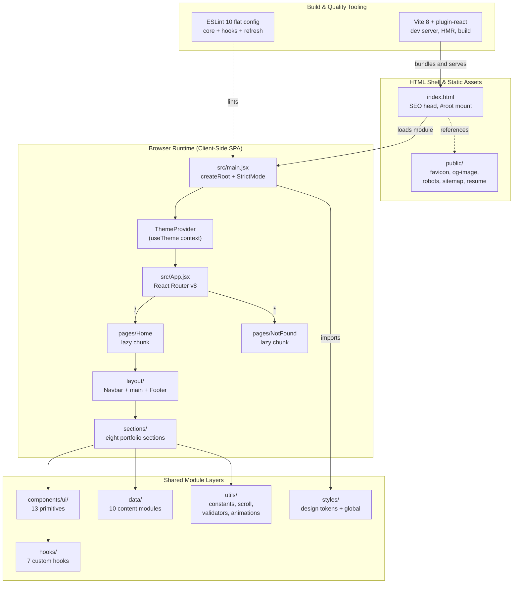
```mermaid
flowchart TD
    subgraph Tooling["Build & Quality Tooling"]
        Vite["Vite 8 + plugin-react<br/>dev server, HMR, build"]
        ESLint["ESLint 10 flat config<br/>core + hooks + refresh"]
    end

    subgraph Shell["HTML Shell & Static Assets"]
        HTML["index.html<br/>SEO head, #root mount"]
        Public["public/<br/>favicon, og-image,<br/>robots, sitemap, resume"]
    end

    subgraph Runtime["Browser Runtime (Client-Side SPA)"]
        Main["src/main.jsx<br/>createRoot + StrictMode"]
        Theme["ThemeProvider<br/>(useTheme context)"]
        AppNode["src/App.jsx<br/>React Router v8"]
        Home["pages/Home<br/>lazy chunk"]
        NotFound["pages/NotFound<br/>lazy chunk"]
        LayoutNode["layout/<br/>Navbar + main + Footer"]
        Sections["sections/<br/>eight portfolio sections"]
    end

    subgraph Shared["Shared Module Layers"]
        UI["components/ui/<br/>13 primitives"]
        Hooks["hooks/<br/>7 custom hooks"]
        Data["data/<br/>10 content modules"]
        Utils["utils/<br/>constants, scroll,<br/>validators, animations"]
        Styles["styles/<br/>design tokens + global"]
    end

    Vite -->|bundles and serves| HTML
    HTML -->|loads module| Main
    Main --> Theme
    Main -->|imports| Styles
    Theme --> AppNode
    AppNode -->|"/"| Home
    AppNode -->|"*"| NotFound
    Home --> LayoutNode
    LayoutNode --> Sections
    Sections --> UI
    Sections --> Data
    Sections --> Utils
    UI --> Hooks
    HTML -.->|references| Public
    ESLint -.->|lints| Main
```

### 1.2.3 Success Criteria

The repository does **not** codify business-level Service Level Agreements, OKRs, or quantitative product KPIs — there is no analytics, monitoring, or performance-budget instrumentation anywhere in the source. Accordingly, the criteria below are **engineering success criteria** derived from the toolchain the repository provides (`package.json`) together with the validation results the project's own status guide records (`blitzy/documentation/Project Guide.md`).

**Measurable objectives.** Each objective is verifiable through a command or observable artifact, and each has a recorded result in the project's validation logs.

| Objective | Verification / Command | Reported Result |
| --- | --- | --- |
| Production build succeeds | `npm run build` (`vite build`) emits code-split chunks to `dist/` | 446 modules, exit 0 (Project Guide §3) |
| Source passes static analysis | `npm run lint` (`eslint .`, max-warnings 0) | 0 errors / 0 warnings across 87 files (Project Guide §3) |
| Dependencies are clean | `npm audit` over the locked tree | 0 vulnerabilities (`README.md`, Project Guide §3) |
| Runtime console is clean | Load the dev (`:5173`) and preview (`:4173`) builds | 0 console errors / 0 warnings (Project Guide §4) |
| Core feature flows operate | Manual checks of navigation, theme, contact form, modal, back-to-top, mobile menu, active link, and 404 | 8 of 8 flows pass (Project Guide §3–§4) |

**Critical success factors.** The factors most important to keeping the implementation healthy are: a valid Vite + React plugin configuration so JSX transforms and HMR function (`vite.config.js`); correct provider/router composition in which `main.jsx` mounts `StrictMode → ThemeProvider → App` and `App` owns the router (`src/main.jsx`, `src/App.jsx`); adherence to the ESLint "no warnings" contract (`eslint.config.js`); design-token integrity, with all module styles referencing `variables.css` tokens rather than hardcoded values (`src/styles/variables.css`); and preserved accessibility and reduced-motion behavior (focus trap/restore, `aria` attributes, `prefers-reduced-motion` guards) across the interactive components.

**Key performance indicators (engineering signals).** In the absence of codified business KPIs, the meaningful, evidence-backed indicators for this codebase are binary/qualitative engineering signals: build exit status (success/failure), lint result (target of zero errors and zero warnings), dependency-audit vulnerability count (target zero), runtime console cleanliness, and the pass/fail status of the documented feature flows. The status guide also treats bundle size as a performance signal, reporting the index chunk at roughly 91 kB gzipped (`blitzy/documentation/Project Guide.md`). Any quantitative availability, adoption, or real-user performance KPIs would require instrumentation introduced in a future phase, as none exists in the current repository.

## 1.3 Scope

This section defines the boundaries of the current implementation. In-scope items are those actually present and operational in the repository; out-of-scope items are those absent from the codebase, including capabilities the project's own documentation explicitly defers or excludes.

### 1.3.1 In-Scope

**Core features and functionalities.** The must-have capabilities delivered by the current implementation are the following.

| Must-Have Capability | In-Scope Detail | Source |
| --- | --- | --- |
| Portfolio content presentation | Eight data-driven sections (Hero, About, Skills, Projects, Experience, Services, Resume, Contact) plus a footer | `src/sections/`, `src/data/` |
| Routing & error page | A `/` portfolio route and a `*` catch-all 404 route, both lazy-loaded | `src/App.jsx`, `src/pages/NotFound` |
| Theming | Manual light/dark toggle with `localStorage` persistence and a one-time OS seed | `src/hooks/useTheme.jsx`, `src/components/ui/ThemeToggle` |
| Navigation | Sticky navbar with smooth scroll, active-section highlighting, and a mobile menu | `src/components/layout/Navbar`, `src/hooks/useActiveSection.js` |
| Contact | Client-side validated form, contact details (`mailto:`/`tel:`), and social links | `src/sections/Contact`, `src/utils/validators.js` |
| Résumé actions | Download and view of `/resume.pdf` from the Hero and Resume sections | `src/sections/Resume`, `src/data/siteMeta.js` |
| Accessibility & motion | Semantic landmarks, keyboard/focus support, and reduced-motion guards | `src/styles/global.css`, `src/hooks/usePrefersReducedMotion.js` |
| SEO & discoverability | Static document head plus `robots.txt`, `sitemap.xml`, and a social share image | `index.html`, `public/` |

**Primary user workflows.** Three workflows are supported. The *visitor / recruiter* workflow consists of loading the page, navigating between sections via the navbar or by scrolling, toggling the theme, opening a project's accessible details modal, and viewing or downloading the résumé. The *contact* workflow consists of completing the Contact form, receiving per-field validation feedback, and submitting to see a client-side success state (no message is transmitted). The *owner / developer* workflow consists of editing content in `src/data/*`, running `npm run dev` for hot-reload development, `npm run lint` to enforce the zero-warning contract, and `npm run build` followed by `npm run preview` to produce and inspect the production bundle (`package.json`).

**Essential integrations.** In scope are only foundational platform integrations: the **browser / web platform** that executes the bundle and loads static assets; the **Node.js/npm toolchain** that runs Vite and ESLint; the **Google Fonts** CDN that supplies the Inter and Poppins typefaces; and a **placeholder Google Maps `<iframe>`** in the Contact section (`index.html`, `src/sections/Contact`). No application-level backend integration is in scope.

**Key technical requirements.** The declared technology baseline and environment requirements are captured in the manifest and README.

| Requirement | Detail |
| --- | --- |
| Browser runtime | A modern, ES-module-capable browser to run the client bundle (`index.html`, `vite.config.js` `esnext` target) |
| Build/lint environment | Node.js 22+ and npm (Node 22+ is required by React Router v8) (`README.md`) |
| Declared runtime stack | `react`/`react-dom` `^19.2.7`, `react-router` `^8.1.0`, `framer-motion` `^12.42.2`, `react-icons` `^5.6.0`, `vite` `^8.1.0` (`package.json`) |
| Quality & reproducibility | ESLint flat config with zero errors/warnings, and exact dependency pinning for reproducible `npm ci` installs (`eslint.config.js`, `package-lock.json`) |

**Implementation boundaries.** The dimensions below delimit the current system.

| Boundary Dimension | Coverage in the Current Implementation |
| --- | --- |
| System boundary | Strictly client-side; all logic runs in the browser and the deployable output is a set of static assets produced by `vite build`. No server-side component exists. |
| User groups covered | Anonymous public visitors and the single site owner/developer. No accounts, roles, or permission tiers are defined. |
| Geographic / market coverage | Content is authored in English (`<html lang="en">`, `og:locale en_US` in `index.html`); no internationalization or geographic targeting is configured, and the hosting region/market is unspecified. |
| Data domains included | Presentational content only — identity, navigation, skills, projects, experience, services, and social links held as static module data in `src/data/`. The only persisted state is the `localStorage` theme preference; there is no user data or business-domain model. |

### 1.3.2 Out-of-Scope

**Explicitly excluded features and capabilities.** The following are not implemented in the repository and are therefore outside the scope of the current system.

| Excluded Area | Basis for Exclusion |
| --- | --- |
| Backend, server, REST/GraphQL APIs, databases, authentication, and user accounts | No server-side code or HTTP client anywhere; the build is frontend-only (`blitzy/documentation/Project Guide.md` §1.1, §5) |
| Real contact-form delivery | `useContactForm` simulates submission entirely client-side; no email or serverless provider is wired (`src/hooks/useContactForm.js`, `blitzy/documentation/Project Guide.md` §4) |
| Automated test suite and CI/CD as product features | No test runner in `package.json`; explicitly excluded per the project's scope basis (`blitzy/documentation/Project Guide.md` §2.3, §3) |
| TypeScript migration, internationalization (i18n), and server-side rendering (SSR) | Source is JavaScript/JSX only; these are listed scope exclusions (`blitzy/documentation/Project Guide.md` §2.3) |
| Analytics, monitoring, and error tracking | No telemetry or instrumentation is present; accepted as out of scope (`blitzy/documentation/Project Guide.md` §6) |
| Hosting, deployment, and containerization configuration | No host configuration, pipeline, Dockerfile, or environment files exist in the repository (`blitzy/documentation/Project Guide.md` §2.2) |

**Future-phase considerations.** The project's status guide enumerates deferred, path-to-production work rather than committed deliverables: populating `src/data/*` with real content, swapping the `public/resume.pdf` stub and the profile/project image placeholders for real media, configuring hosting with an SPA catch-all rewrite so deep links and the 404 route resolve, wiring a real Google Maps embed, and optionally adding contact-form delivery — followed by a final cross-browser/device and accessibility audit with stakeholder sign-off (`blitzy/documentation/Project Guide.md` §1.6, §2.2). None of these are scheduled or configured in the present codebase.

**Integration points not covered.** No email-delivery or serverless function, no Google Maps Platform API key (the map is a generic placeholder embed), no analytics or messaging service, no content management system, and no identity provider are wired into the application (`blitzy/documentation/Project Guide.md` §1.5, `src/sections/Contact`).

**Unsupported use cases.** The current implementation does not support authenticated or personalized experiences, server-side data capture or persistence, multi-user or administrative workflows, content management through a UI, or real transactional email/contact delivery. Such scenarios are beyond what the existing static, client-side front end can serve and would require new components, dependencies, and backend infrastructure introduced in a later phase.

## 1.4 References

The following repository artifacts were inspected as the evidentiary basis for this Introduction.

**Files**

- `package.json` - Project identity (`my-react-app`, private, `version 0.0.0`), `type: module`, the `dev`/`build`/`lint`/`preview` scripts, and the declared dependency baseline (React 19, Vite 8, React Router 8, Framer Motion, React Icons, ESLint 10).
- `package-lock.json` - Exact resolved dependency graph confirming reproducible `npm ci` installs.
- `vite.config.js` - Build/dev toolchain configuration: `@vitejs/plugin-react`, the `@`→`/src` alias, an `esnext` build target, and `dist` output.
- `eslint.config.js` - The flat ESLint configuration (core + React Hooks + React Refresh) that underpins the zero-warning quality contract.
- `index.html` - The HTML shell, `#root` mount, the single static SEO/Open Graph/Twitter document head, `theme-color`, canonical URL, Google Fonts preconnect, and the `/src/main.jsx` module entry.
- `README.md` - The feature catalog, tech-stack roles, declared-versus-installed version tables, the Node.js 22+ prerequisite, and the data-driven customization/placeholder guidance.
- `src/main.jsx` - The runtime bootstrap: `createRoot` + `StrictMode` → `ThemeProvider` → `App`, plus the global CSS import.
- `src/App.jsx` - The React Router v8 router (`createBrowserRouter` + `RouterProvider`), the `/` and `*` (404) routes, and `React.lazy` code-splitting with a `<Suspense>`/`<Loader>` fallback.
- `src/data/siteMeta.js` - The site-wide identity source of truth (name, role, tagline, email, phone, location, résumé href) and its placeholder nature.
- `src/data/projects.js` - The six showcased projects (mixed React-development and QA/testing work) with placeholder GitHub/demo URLs.
- `src/hooks/useTheme.jsx` - Theme context with `localStorage` persistence, OS seeding, and the `data-theme` attribute.
- `src/hooks/useActiveSection.js` - The `IntersectionObserver` scroll-spy that drives active-navigation highlighting.
- `src/hooks/useTypewriter.js` - The Hero cycling-text animation hook.
- `src/hooks/usePrefersReducedMotion.js` - The centralized reduced-motion signal.
- `src/hooks/useContactForm.js` - The contact-form state machine and its client-only simulated submission.
- `src/utils/validators.js` - The pure client-side contact-form field validators.
- `src/styles/variables.css` - The CSS-variable design-token catalog (light and dark themes).
- `src/styles/global.css` - The token-driven global reset, typography, layout, focus, and reduced-motion rules.
- `blitzy/documentation/Project Guide.md` - The current-state status and quality guide: completion methodology (86.2%), quality gates, feature-flow validation, scope exclusions, risks, and remaining path-to-production tasks.
- `blitzy/documentation/Technical Specifications.md` - The earlier baseline specification, used to establish the prior scaffold's limitations that the current portfolio supersedes.

**Folders**

- `src/` - The complete client-side application source tree.
- `src/pages/` - The route pages: `Home` (composes the eight sections inside `Layout`) and `NotFound` (404).
- `src/sections/` - The eight portfolio section folders (Hero, About, Skills, Projects, Experience, Services, Resume, Contact).
- `src/components/ui/` - The 13 reusable UI primitive folders (Button, Card, Modal, ProgressBar, ThemeToggle, Reveal, Loader, and more).
- `src/components/layout/` - The page-chrome components: Navbar, Footer, Layout, and Logo.
- `src/hooks/` - The seven custom React hooks.
- `src/data/` - The ten content/configuration modules exposed through an index barrel.
- `src/utils/` - The five utility modules (constants, scroll, validators, animations, and the index barrel).
- `src/styles/` - The global design-token and stylesheet layer.
- `src/assets/` - The profile and project placeholder images.
- `public/` - The root-served static assets: `favicon.svg`, `og-image.png`, `robots.txt`, `sitemap.xml`, `resume.pdf` (a stub), and `llms.txt`.

**Version control**

- Git history (branch `new-features-01`, HEAD `4ef1ca8`) - Commit `96b7f76` ("initial react project") establishing the greenfield origin, and the subsequent build-and-QA history that transformed the scaffold into the current portfolio; also confirmed that this checkout contains only the React/Vite SPA.

# 2. Product Requirements

## 2.1 Feature Catalog

This section decomposes `my-react-app` — the client-side React 19 + Vite 8 portfolio single-page application described in Section 1 — into discrete, testable features. Because the system is a **frontend-only** SPA with no backend, database, authentication, or telemetry (Section 1.3), every feature below is a browser-side capability, and every requirement is verifiable through direct observation of the running application or its build/lint output rather than against server SLAs (Section 1.2.3). All features are derived strictly from artifacts observed in the repository.

The feature inventory is organized into five categories that mirror the layered architecture (`src/App.jsx`, `src/components/`, `src/sections/`, `src/hooks/`, `src/data/`, `src/utils/`, `src/styles/`).

**Status convention.** All catalogued features carry **Status = Completed**: each is implemented, passes the ESLint zero-warning contract, and is included in the successful production build reported in Section 1.2.3 (`blitzy/documentation/Project Guide.md`). Remaining work is path-to-production only — replacing placeholder content, wiring real contact-form delivery / Google Maps, and configuring hosting — which is tracked as a constraint in Section 2.4 and formally excluded in Section 1.3.2.

### 2.1.1 Feature Inventory Overview

| ID | Feature Name | Category | Priority |
| --- | --- | --- | --- |
| F-001 | Client-Side Routing & Lazy Page Loading | Application Shell & Navigation | High |
| F-002 | Single-Page Layout & Section Composition | Application Shell & Navigation | Critical |
| F-003 | Sticky Navigation & Scroll-Spy | Application Shell & Navigation | High |
| F-004 | Light/Dark Theme System | Presentation, Theming & Motion | Medium |
| F-005 | Animation & Reduced-Motion System | Presentation, Theming & Motion | Medium |
| F-006 | Responsive Design-Token Styling System | Presentation, Theming & Motion | Critical |
| F-007 | Hero Section | Portfolio Content Sections | Critical |
| F-008 | About Section | Portfolio Content Sections | High |
| F-009 | Skills Showcase | Portfolio Content Sections | High |
| F-010 | Projects Showcase & Accessible Modal | Portfolio Content Sections | Critical |
| F-011 | Experience Timeline | Portfolio Content Sections | High |
| F-012 | Services Overview | Portfolio Content Sections | Medium |
| F-013 | Résumé Access (Download & View) | Portfolio Content Sections | High |
| F-014 | Validated Contact Form | Contact & Lead Generation | Critical |
| F-015 | Contact Details & Social Links | Contact & Lead Generation | High |
| F-016 | Data-Driven Content Layer | Content & Discoverability Foundation | Critical |
| F-017 | SEO & Crawler Discoverability | Content & Discoverability Foundation | High |
| F-018 | Accessibility & Semantic Structure | Content & Discoverability Foundation | High |

### 2.1.2 Application Shell & Navigation Features

#### 2.1.2.1 F-001 — Client-Side Routing & Lazy Page Loading

| Field | Value | Field | Value |
| --- | --- | --- | --- |
| Feature ID | F-001 | Priority | High |
| Feature Category | Application Shell & Navigation | Status | Completed |
| Feature Name | Client-Side Routing & Lazy Page Loading | | |

| Aspect | Detail |
| --- | --- |
| Overview | Maps the `/` path to the full portfolio `Home` page and any unmatched path (`*`) to a `NotFound` 404 page using React Router v8's data router; each page is code-split with `React.lazy` + dynamic `import()` and wrapped in `<Suspense>` with an eagerly imported full-screen `<Loader>` fallback (`src/App.jsx`). |
| Business Value | Provides instant, no-reload navigation plus a graceful catch-all error page, and keeps the initial download small by fetching each route chunk on demand — reinforcing the "performant" quality message of the portfolio. |
| User Benefits | Fast initial render, a branded loading affordance during chunk fetches, and a friendly recovery path (a "Back to Home" action) instead of a raw browser error for unknown URLs. |
| Technical Context | `createBrowserRouter` is imported from `react-router` and `RouterProvider` from `react-router/dom`; the router is built once at module scope from a static route table (no route loaders, no `HydrateFallback`). `Loader` is imported eagerly because it *is* the Suspense fallback. |

| Dependency Type | Detail |
| --- | --- |
| Prerequisite Features | F-002 (the `Home` page it renders), F-006 (tokens used by `Loader` and pages) |
| System Dependencies | `src/main.jsx` render root; `src/pages/Home`, `src/pages/NotFound`; `src/components/ui/Loader` |
| External Dependencies | `react-router` ^8.1.0 (incl. `react-router/dom`); `react`/`react-dom` ^19.2.7 (`lazy`, `Suspense`) |
| Integration Requirements | Production hosting must provide an SPA catch-all rewrite to `index.html` so deep links and the 404 route resolve (deferred per Section 1.3.2) |

#### 2.1.2.2 F-002 — Single-Page Layout & Section Composition

| Field | Value | Field | Value |
| --- | --- | --- | --- |
| Feature ID | F-002 | Priority | Critical |
| Feature Category | Application Shell & Navigation | Status | Completed |
| Feature Name | Single-Page Layout & Section Composition | | |

| Aspect | Detail |
| --- | --- |
| Overview | The `Home` page composes the eight portfolio sections in a fixed order — Hero, About, Skills, Projects, Experience, Services, Resume, Contact — inside a `Layout` shell that frames them with the `Navbar`, a `<main id="main-content">` landmark, and the `Footer` (`src/pages/Home/Home.jsx`, `src/components/layout/Layout`). |
| Business Value | Consolidates the professional's identity, skills, work, and contact channels into one continuous, shareable scrollable destination — the core value proposition of the site (Section 1.1). |
| User Benefits | Consistent page chrome, a predictable top-to-bottom reading order, and a single URL that contains the entire portfolio narrative. |
| Technical Context | `Home` is a prop-less component that imports `Layout` and the eight section components and renders them in a fixed sequence; it holds no state or logic. `Layout` supplies the shared header/main/footer frame and the floating back-to-top control. |

| Dependency Type | Detail |
| --- | --- |
| Prerequisite Features | F-003 (Navbar), F-007–F-015 (the eight sections), F-006 (styling) |
| System Dependencies | `src/components/layout/Layout`, `Navbar`, `Footer`; all eight `src/sections/*` |
| External Dependencies | `react`/`react-dom` ^19.2.7 |
| Integration Requirements | Section anchor `id`s must match the `navLinks` catalog (F-016) for navigation/scroll-spy to resolve |

#### 2.1.2.3 F-003 — Sticky Navigation & Scroll-Spy

| Field | Value | Field | Value |
| --- | --- | --- | --- |
| Feature ID | F-003 | Priority | High |
| Feature Category | Application Shell & Navigation | Status | Completed |
| Feature Name | Sticky Navigation & Scroll-Spy | | |

| Aspect | Detail |
| --- | --- |
| Overview | A sticky, glassmorphism navigation bar with the site logo, desktop section links, a theme toggle, and a mobile hamburger menu (below 1024px). It performs smooth in-page scrolling offset by the navbar height and highlights the section currently in view via an `IntersectionObserver` scroll-spy (`src/components/layout/Navbar`, `src/hooks/useActiveSection.js`, `src/utils/scroll.js`). |
| Business Value | Lets visitors reach any part of the portfolio in one action and always know where they are, reducing friction for recruiters scanning specific content. |
| User Benefits | One-click/tap jumps to sections, an active-link orientation cue (`aria-current="page"`), and a mobile menu that closes on Escape and restores focus to the hamburger button. |
| Technical Context | `SCROLL_THRESHOLD = 8`px toggles the "scrolled" style; the mobile media query is `(max-width: 1023.98px)` (the JS complement of `BREAKPOINTS.lg`); nav clicks call `preventDefault` then `scrollToId` and close the menu; `useActiveSection` observes all `navLinks` ids with the shared `SECTION_OBSERVER` (a `-45% 0px -45% 0px` center band). |

| Dependency Type | Detail |
| --- | --- |
| Prerequisite Features | F-016 (`navLinks` data), F-002 (sections rendered with ids), F-004 (`ThemeToggle`), F-005 (reduced-motion scroll), F-006 |
| System Dependencies | `useActiveSection`, `useMediaQuery`, `usePrefersReducedMotion`, `src/utils/scroll.js`; `Logo`, `ThemeToggle`, `Container` |
| External Dependencies | `framer-motion` (mobile-menu `AnimatePresence`); `react-icons` (`FaBars`/`FaTimes`) |
| Integration Requirements | Browser `IntersectionObserver`, `matchMedia`, and `window.scrollTo` APIs |

### 2.1.3 Presentation, Theming & Motion Features

#### 2.1.3.1 F-004 — Light/Dark Theme System

| Field | Value | Field | Value |
| --- | --- | --- | --- |
| Feature ID | F-004 | Priority | Medium |
| Feature Category | Presentation, Theming & Motion | Status | Completed |
| Feature Name | Light/Dark Theme System | | |

| Aspect | Detail |
| --- | --- |
| Overview | A manual light/dark theme toggle whose choice is persisted to `localStorage` and, on first visit only, seeded from the operating system's `prefers-color-scheme`. The active theme is mirrored onto a `data-theme` attribute on `<html>` and consumed by the token layer (`src/hooks/useTheme.jsx`, `src/components/ui/ThemeToggle`, `src/styles/variables.css`). |
| Business Value | Delivers a modern, personalized experience and demonstrates front-end polish without any third-party theming library. |
| User Benefits | A one-click theme choice that is remembered across reloads and return visits, while still honoring the OS preference on first load. |
| Technical Context | `getInitialTheme()` precedence: a stored valid `'light'`/`'dark'` wins, else `matchMedia('(prefers-color-scheme: dark)')`; a `useEffect` writes both the `data-theme` attribute and the `'theme'` `localStorage` key; `setTheme` ignores invalid values, `toggleTheme` flips; `useTheme()` throws if used outside `ThemeProvider`. |

| Dependency Type | Detail |
| --- | --- |
| Prerequisite Features | F-006 (the `[data-theme="dark"]` token overrides in `variables.css`) |
| System Dependencies | `ThemeProvider` mounted at the render root (`src/main.jsx`); `ThemeToggle` in the `Navbar` |
| External Dependencies | `react` ^19.2.7 (`createContext`, `useState`, `useEffect`, `useMemo`, `useCallback`) |
| Integration Requirements | Browser `localStorage` and `matchMedia` APIs |

#### 2.1.3.2 F-005 — Animation & Reduced-Motion System

| Field | Value | Field | Value |
| --- | --- | --- | --- |
| Feature ID | F-005 | Priority | Medium |
| Feature Category | Presentation, Theming & Motion | Status | Completed |
| Feature Name | Animation & Reduced-Motion System | | |

| Aspect | Detail |
| --- | --- |
| Overview | A restrained Framer Motion animation system built on a shared `Reveal` wrapper and a central variant library (`fadeInUp`, `fadeIn`, `scaleIn`, `staggerContainer`, `viewportOnce`), plus a floating `BackToTop` control — every animation is gated by the user's `prefers-reduced-motion` preference (`src/components/ui/Reveal`, `BackToTop`, `src/utils/animations.js`, `src/hooks/usePrefersReducedMotion.js`). |
| Business Value | Adds a premium, dynamic feel that differentiates the portfolio while preserving accessibility — an explicit quality signal for a QA-focused professional. |
| User Benefits | Subtle scroll-reveal entrances and a back-to-top shortcut; users who request reduced motion receive static, non-animated rendering instead. |
| Technical Context | `Reveal` selects a variant and applies `whileInView="visible"` with the shared `viewportOnce` config (`{ once: true, amount: 0.2 }`); when reduced motion is set it returns a plain element with no motion props. `BackToTop` uses `AnimatePresence` and appears once scroll passes `BACK_TO_TOP_THRESHOLD` (400px). The `ease` `[0.4, 0, 0.2, 1]` mirrors the `--ease` token. |

| Dependency Type | Detail |
| --- | --- |
| Prerequisite Features | F-006 (`--ease` token parity), F-018 (reduced-motion is an accessibility guarantee) |
| System Dependencies | `usePrefersReducedMotion`, `useScrollToTop`, `src/utils/animations.js`, `src/utils/scroll.js` |
| External Dependencies | `framer-motion` ^12.42.2; `react-icons` (`FaArrowUp`) |
| Integration Requirements | Browser `matchMedia('(prefers-reduced-motion: reduce)')` and `IntersectionObserver` (via `whileInView`) |

#### 2.1.3.3 F-006 — Responsive Design-Token Styling System

| Field | Value | Field | Value |
| --- | --- | --- | --- |
| Feature ID | F-006 | Priority | Critical |
| Feature Category | Presentation, Theming & Motion | Status | Completed |
| Feature Name | Responsive Design-Token Styling System | | |

| Aspect | Detail |
| --- | --- |
| Overview | A custom CSS-variable design-token catalog (`src/styles/variables.css`) plus a token-driven global reset/typography/focus/motion layer (`src/styles/global.css`) and per-component CSS Modules. Light values live on `:root`; dark values override on `[data-theme="dark"]`. No third-party UI kit is used. |
| Business Value | Guarantees a consistent, maintainable visual identity that can be re-skinned centrally, and underpins both theming (F-004) and accessibility (F-018). |
| User Benefits | A cohesive, responsive look across breakpoints, readable typography, visible keyboard focus, and contrast-aware color choices in both themes. |
| Technical Context | The catalog defines colors, a 4px spacing scale, radii, shadows, the Inter/Poppins font families, fluid `clamp()` type sizes, z-indexes, `--nav-height`, `--ease`, and blur; `global.css` imports it and adds `:focus-visible` outlines, `scroll-margin-top` on `section[id]`, and a `prefers-reduced-motion` block that disables smooth scroll and near-zeroes animation durations. |

| Dependency Type | Detail |
| --- | --- |
| Prerequisite Features | None — this is a foundation feature |
| System Dependencies | Consumed by every `src/sections/*` and `src/components/**` CSS Module; imported once via `src/main.jsx` |
| External Dependencies | Google Fonts (Inter, Poppins) loaded via `index.html` preconnect; Vite CSS Modules pipeline |
| Integration Requirements | `NAV_HEIGHT` (72) in `src/utils/constants.js` must equal the `--nav-height` token for scroll offsets to align |

### 2.1.4 Portfolio Content Section Features

#### 2.1.4.1 F-007 — Hero Section

| Field | Value | Field | Value |
| --- | --- | --- | --- |
| Feature ID | F-007 | Priority | Critical |
| Feature Category | Portfolio Content Sections | Status | Completed |
| Feature Name | Hero Section | | |

| Aspect | Detail |
| --- | --- |
| Overview | The landing section (`id="home"`) presenting a greeting, the page's single `<h1>` (the owner's name), an animated typewriter cycling four roles, an intro description, a profile image, two call-to-action buttons (Download Resume, Hire Me), and a social-link row (`src/sections/Hero`, `src/hooks/useTypewriter.js`, `src/data/hero.js`). |
| Business Value | Forms the critical first impression and funnels visitors toward the two primary conversions — downloading the résumé and initiating contact (Section 1.1). |
| User Benefits | Immediate clarity on who the professional is and what they do, with prominent shortcuts to the résumé and the contact section. |
| Technical Context | `useTypewriter(roles, { reduced })` types/deletes/pauses to cycle the four `hero.roles`; under reduced motion it renders the first role statically. CTAs are a primary "Download Resume" (`/resume.pdf`, `download`) and an outline "Hire Me" (`#contact`). |

| Dependency Type | Detail |
| --- | --- |
| Prerequisite Features | F-016 (`hero`/`siteMeta` data), F-005 (reduced-motion for the typewriter), F-015 (social row), F-006 |
| System Dependencies | `Button`, `SocialLinks`, `Container`; `useTypewriter`, `usePrefersReducedMotion` |
| External Dependencies | `framer-motion`; `react-icons`; Vite-resolved `@/assets/images/profile.svg` |
| Integration Requirements | `public/resume.pdf` asset and the `#contact` in-page anchor (F-014) must exist |

#### 2.1.4.2 F-008 — About Section

| Field | Value | Field | Value |
| --- | --- | --- | --- |
| Feature ID | F-008 | Priority | High |
| Feature Category | Portfolio Content Sections | Status | Completed |
| Feature Name | About Section | | |

| Aspect | Detail |
| --- | --- |
| Overview | The `id="about"` section presenting a professional summary and career objective, education and experience cards with period badges, an achievement list, and four statistic cards (`src/sections/About`, `src/data/about.js`). |
| Business Value | Establishes credibility with a concise narrative and quantified track record (e.g., years of experience, projects, defects, technologies). |
| User Benefits | A quick, scannable overview of the professional's background and accomplishments. |
| Technical Context | `about.stats` map to `StatCard` values via an ordered module-level icon array; education/experience entries render as glass `Card`s with `Badge` periods; achievements render as a check-icon list; content enters via shared `Reveal`. |

| Dependency Type | Detail |
| --- | --- |
| Prerequisite Features | F-016 (`about` data), F-005 (`Reveal`), F-006 |
| System Dependencies | `SectionTitle`, `Container`, `Card`, `StatCard`, `Reveal`, `Badge` |
| External Dependencies | `react-icons` (Font Awesome icons) |
| Integration Requirements | None beyond the shared data/UI layers |

#### 2.1.4.3 F-009 — Skills Showcase

| Field | Value | Field | Value |
| --- | --- | --- | --- |
| Feature ID | F-009 | Priority | High |
| Feature Category | Portfolio Content Sections | Status | Completed |
| Feature Name | Skills Showcase | | |

| Aspect | Detail |
| --- | --- |
| Overview | The `id="skills"` section grouping skills into four categories — Frontend, Backend Basics, Testing, and Automation Basics — each rendering named skills with an animated proficiency progress bar (`src/sections/Skills`, `src/data/skills.js`, `src/components/ui/ProgressBar`). |
| Business Value | Presents an at-a-glance competency matrix that lets recruiters gauge fit quickly. |
| User Benefits | Visual proficiency levels (0–100) per skill, with a reduced-motion-friendly rendering. |
| Technical Context | `ProgressBar` clamps values to 0–100, exposes `role="progressbar"` with `aria-valuenow/valuemin/valuemax`, and animates the fill via a compositor-friendly `scaleX` transform on `whileInView` (0.8s); reduced-motion/non-animated renders paint the final width directly. |

| Dependency Type | Detail |
| --- | --- |
| Prerequisite Features | F-016 (`skills` data), F-005 (motion), F-006 |
| System Dependencies | `ProgressBar`, `SectionTitle`, `Container`, `Card`, `Reveal` |
| External Dependencies | `framer-motion` (`ProgressBar` fill) |
| Integration Requirements | None beyond the shared data/UI layers |

#### 2.1.4.4 F-010 — Projects Showcase & Accessible Modal

| Field | Value | Field | Value |
| --- | --- | --- | --- |
| Feature ID | F-010 | Priority | Critical |
| Feature Category | Portfolio Content Sections | Status | Completed |
| Feature Name | Projects Showcase & Accessible Modal | | |

| Aspect | Detail |
| --- | --- |
| Overview | The `id="projects"` section rendering a responsive grid of project cards (image, description, tech badges, GitHub/Live-Demo links, feature list); clicking a card opens an accessible details modal (`role="dialog"`) (`src/sections/Projects` with `ProjectCard`/`ProjectModal`, `src/components/ui/Modal`, `src/data/projects.js`). |
| Business Value | The portfolio centerpiece that showcases the depth and breadth of the professional's work (six mixed React-development and QA/testing projects). |
| User Benefits | Browse projects at a glance, then open a focus-trapped modal for details that is dismissible via Escape or scrim click, with full keyboard support. |
| Technical Context | `Projects` owns the only local state — `selected` (null = closed); `ProjectModal` receives `isOpen={selected !== null}`. `Modal` renders through `createPortal` to `document.body` with `aria-modal="true"`, `aria-labelledby`, a Tab/Shift+Tab focus trap with wraparound, body scroll-lock, focus restoration on close, and reduced-motion-aware transitions. |

| Dependency Type | Detail |
| --- | --- |
| Prerequisite Features | F-016 (`projects` data), F-005 (modal motion), F-006, F-018 (dialog a11y) |
| System Dependencies | `Modal`, `ProjectCard`, `ProjectModal`, `Card`, `Badge`, `Button`, `SectionTitle`, `Container`, `Reveal` |
| External Dependencies | `framer-motion`; `react-dom` (`createPortal`); `react-icons` |
| Integration Requirements | External GitHub/demo URLs (currently placeholders) opened as safe external links; project thumbnail SVGs under `src/assets/images/projects/` |

#### 2.1.4.5 F-011 — Experience Timeline

| Field | Value | Field | Value |
| --- | --- | --- | --- |
| Feature ID | F-011 | Priority | High |
| Feature Category | Portfolio Content Sections | Status | Completed |
| Feature Name | Experience Timeline | | |

| Aspect | Detail |
| --- | --- |
| Overview | The `id="experience"` section rendering a chronological timeline of typed entries — `Education`, `Experience`, `Journey`, and `Certification` — each with a title, organization, period, and description (`src/sections/Experience`, `src/data/experience.js`). |
| Business Value | Communicates career progression, the React learning journey, and certifications in a single narrative device. |
| User Benefits | A scannable, visually structured history that groups different kinds of milestones. |
| Technical Context | Each record follows the documented `ExperienceItem` contract (`type` ∈ {Education, Experience, Journey, Certification} with `title`/`org`/`period`/`description`); a `TimelineItem` subcomponent renders entries, with entrance animation delegated to shared `Reveal`. |

| Dependency Type | Detail |
| --- | --- |
| Prerequisite Features | F-016 (`experience` data), F-005 (`Reveal`), F-006 |
| System Dependencies | `SectionTitle`, `Container`, `Reveal`, `Badge`/`Card` |
| External Dependencies | `react-icons` |
| Integration Requirements | None beyond the shared data/UI layers |

#### 2.1.4.6 F-012 — Services Overview

| Field | Value | Field | Value |
| --- | --- | --- | --- |
| Feature ID | F-012 | Priority | Medium |
| Feature Category | Portfolio Content Sections | Status | Completed |
| Feature Name | Services Overview | | |

| Aspect | Detail |
| --- | --- |
| Overview | The `id="services"` section rendering a grid of six service offerings, each with an icon, title, and description: Website Development, React Development, Frontend Development, QA Testing, API Testing, and Automation Support (`src/sections/Services`, `src/data/services.js`). |
| Business Value | Advertises the professional's offerings to prospective clients and companies, supporting the site's lead-generation intent (Section 1.1). |
| User Benefits | A clear, iconographic summary of what the professional can deliver. |
| Technical Context | `services.js` entries are `{ icon (from react-icons/fa), title, description }`; the `Services` section applies Framer Motion directly (rather than the shared `Reveal`) for its entrance animation, rendering each entry through a service card. |

| Dependency Type | Detail |
| --- | --- |
| Prerequisite Features | F-016 (`services` data), F-005 (motion), F-006 |
| System Dependencies | `SectionTitle`, `Container`, `Card` |
| External Dependencies | `framer-motion`; `react-icons` (Font Awesome) |
| Integration Requirements | None beyond the shared data/UI layers |

#### 2.1.4.7 F-013 — Résumé Access (Download & View)

| Field | Value | Field | Value |
| --- | --- | --- | --- |
| Feature ID | F-013 | Priority | High |
| Feature Category | Portfolio Content Sections | Status | Completed |
| Feature Name | Résumé Access (Download & View) | | |

| Aspect | Detail |
| --- | --- |
| Overview | The `id="resume"` section presenting an availability message and two actions — Download Resume and View Resume (opens in a new tab) — both targeting `siteMeta.resumeUrl` (`/resume.pdf`); the download is also surfaced as the Hero's primary CTA (`src/sections/Resume`, `src/data/siteMeta.js`). |
| Business Value | Provides the primary recruiter-conversion action: retrieving the résumé. |
| User Benefits | One click to download or preview the résumé, from either the Hero or the Resume section. |
| Technical Context | Two shared `Button`s render as anchors: Download uses the bare `download` attribute + `primary` variant + `FaDownload`; View uses the `outline` variant + `FaEye` + `target="_blank"` with `rel="noopener noreferrer"`. The résumé URL is a plain public path, not a bundler import, so it stays valid before the asset is finalized. |

| Dependency Type | Detail |
| --- | --- |
| Prerequisite Features | F-016 (`siteMeta`), F-006 |
| System Dependencies | `Button`, `Card`, `SectionTitle`, `Container`, `Reveal` |
| External Dependencies | `react-icons` (`FaDownload`, `FaEye`) |
| Integration Requirements | `public/resume.pdf` must be present (currently a placeholder stub per Section 1.3.2) |

### 2.1.5 Contact & Lead-Generation Features

#### 2.1.5.1 F-014 — Validated Contact Form

| Field | Value | Field | Value |
| --- | --- | --- | --- |
| Feature ID | F-014 | Priority | Critical |
| Feature Category | Contact & Lead Generation | Status | Completed |
| Feature Name | Validated Contact Form | | |

| Aspect | Detail |
| --- | --- |
| Overview | The controlled contact form inside `id="contact"` with Name, Email, Subject, and Message fields, per-field client-side validation, touched-gated error display, success/error banners, and a simulated (client-only) submission (`src/sections/Contact` → `ContactForm`, `src/hooks/useContactForm.js`, `src/utils/validators.js`). |
| Business Value | The primary lead-capture channel through which prospective clients and recruiters initiate contact. |
| User Benefits | Immediate inline validation feedback, a submit button disabled while the form is invalid or submitting, and clear success/error status messaging. |
| Technical Context | `useContactForm` is a state machine with `status` ∈ {idle, submitting, success, error}; `validateContactForm` runs the four field validators; `handleChange`/`handleBlur`/`handleSubmit` manage values/touched; on submit it marks all fields touched, blocks when invalid, then awaits a 1200ms timer-backed simulated submission and resets on success. The form uses `noValidate` with `role="status"`/`role="alert"` banners and `aria-invalid`/`aria-describedby`. |

| Dependency Type | Detail |
| --- | --- |
| Prerequisite Features | F-006; F-018 (form field accessibility) |
| System Dependencies | `useContactForm`, `src/utils/validators.js`, `Button`, `Card`, `Reveal`, `Container`, `SectionTitle` |
| External Dependencies | `react` ^19.2.7 (`useState`, `useMemo`) |
| Integration Requirements | No message-delivery backend is wired — submission is simulated only (explicitly out of scope per Section 1.3.2) |

#### 2.1.5.2 F-015 — Contact Details & Social Links

| Field | Value | Field | Value |
| --- | --- | --- | --- |
| Feature ID | F-015 | Priority | High |
| Feature Category | Contact & Lead Generation | Status | Completed |
| Feature Name | Contact Details & Social Links | | |

| Aspect | Detail |
| --- | --- |
| Overview | The `ContactInfo` panel rendering email (`mailto:`), phone (`tel:`), location, availability, a social-link row, and a lazy-loaded Google Maps `<iframe>` placeholder; the reusable `SocialLinks` primitive renders icon-only links from the `socials` data (`src/sections/Contact` → `ContactInfo`, `src/components/ui/SocialLinks`, `src/data/socials.js`, `src/data/siteMeta.js`). |
| Business Value | Offers multiple direct contact channels and improves the discoverability of the professional's external profiles. |
| User Benefits | Tap-to-email and tap-to-call actions, quick access to GitHub/LinkedIn/X, and a location map. |
| Technical Context | A sanitized `tel:` URL is derived from `siteMeta.phone` at module init; `SocialLinks` applies each entry's `label` as an `aria-label` and opens external links with `target="_blank" rel="noopener noreferrer"`; the `Email` social entry (`mailto:`) must stay identical to `siteMeta.email`. The map is a generic placeholder embed. |

| Dependency Type | Detail |
| --- | --- |
| Prerequisite Features | F-016 (`siteMeta`/`socials`), F-006 |
| System Dependencies | `SocialLinks`, contact-info subcomponent styles |
| External Dependencies | `react-icons/fa6` (`FaGithub`, `FaLinkedin`, `FaXTwitter`, `FaEnvelope`); Google Maps embed (placeholder) |
| Integration Requirements | Real Google Maps embed/API key and real social/profile URLs are deferred (Section 1.3.2) |

### 2.1.6 Content & Discoverability Foundation Features

#### 2.1.6.1 F-016 — Data-Driven Content Layer

| Field | Value | Field | Value |
| --- | --- | --- | --- |
| Feature ID | F-016 | Priority | Critical |
| Feature Category | Content & Discoverability Foundation | Status | Completed |
| Feature Name | Data-Driven Content Layer | | |

| Aspect | Detail |
| --- | --- |
| Overview | All display copy and lists are sourced from ten ES-module content files exposed through a barrel — `navLinks`, `hero`, `about`, `skills`, `projects`, `experience`, `services`, `socials`, and `siteMeta` (re-exported by `index.js`) (`src/data/`). |
| Business Value | Lets the entire portfolio be re-skinned or re-branded by editing data files only, with no component changes, and provides a single source of truth for identity/contact details. |
| User Benefits | Indirect — ensures a consistent identity, navigation set, and contact details across every section and the page chrome. |
| Technical Context | Every module uses named exports only (no default exports); `index.js` re-exports the nine content values; `siteMeta` is the identity source of truth whose values mirror `index.html`; `hero`/`projects` statically import image assets resolved by Vite. All values are static placeholders pending real content. |

| Dependency Type | Detail |
| --- | --- |
| Prerequisite Features | None — this is a foundation feature |
| System Dependencies | Consumed by all `src/sections/*` and `src/components/layout/*` |
| External Dependencies | `react-icons` (icon component references in `socials`/`services`); Vite asset resolution for images |
| Integration Requirements | Consistency contract with `index.html` (title/author/description) and `public/resume.pdf` |

#### 2.1.6.2 F-017 — SEO & Crawler Discoverability

| Field | Value | Field | Value |
| --- | --- | --- | --- |
| Feature ID | F-017 | Priority | High |
| Feature Category | Content & Discoverability Foundation | Status | Completed |
| Feature Name | SEO & Crawler Discoverability | | |

| Aspect | Detail |
| --- | --- |
| Overview | A complete static SEO document head — title, description, author, keywords, `robots`, `theme-color`, canonical, Open Graph, and Twitter tags — plus root-served `robots.txt`, `sitemap.xml`, `favicon.svg`, and an `og-image.png` social share card (`index.html`, `public/`). |
| Business Value | Improves search and social-share discoverability of the professional's brand, extending the portfolio's reach. |
| User Benefits | Rich link previews when the site is shared, and indexable content for search engines. |
| Technical Context | `index.html` is the single static SEO source (no `react-helmet`), mirroring `siteMeta`; `robots.txt` allows all crawlers and advertises the sitemap; `sitemap.xml` lists the single canonical URL (`changefreq monthly`, `priority 1.0`); `og-image.png` is a 1200×630 branded card. The canonical host is an RFC-2606 placeholder pending a real domain. |

| Dependency Type | Detail |
| --- | --- |
| Prerequisite Features | F-016 (identity values are mirrored into the head) |
| System Dependencies | `index.html`; `public/robots.txt`, `public/sitemap.xml`, `public/og-image.png`, `public/favicon.svg` |
| External Dependencies | Search-engine and social-platform crawlers |
| Integration Requirements | A real production domain and hosting are required for canonical/sitemap URLs to resolve (deferred per Section 1.3.2) |

#### 2.1.6.3 F-018 — Accessibility & Semantic Structure

| Field | Value | Field | Value |
| --- | --- | --- | --- |
| Feature ID | F-018 | Priority | High |
| Feature Category | Content & Discoverability Foundation | Status | Completed |
| Feature Name | Accessibility & Semantic Structure | | |

| Aspect | Detail |
| --- | --- |
| Overview | Cross-cutting accessibility guarantees: semantic landmarks (each section is a `<section>` with a stable `id` and `aria-labelledby`; a single `<h1>` in the Hero; a `<main id="main-content">`), keyboard/focus support (visible focus outlines, modal focus trap/restore, navbar Escape + focus restore), icon accessibility, and reduced-motion compliance (`src/styles/global.css`, the section components, the UI primitives, `src/hooks/usePrefersReducedMotion.js`). |
| Business Value | Accessibility is the QA-focused persona's core credibility message; it also broadens the audience that can use the site. |
| User Benefits | Usable with a keyboard and assistive technology, with motion that respects the user's OS preferences. |
| Technical Context | `:focus-visible` renders an accent outline; a `prefers-reduced-motion` block disables smooth scroll and near-zeroes animation durations; the `Logo` provides a ≥44px tap target (WCAG 2.5.5); the active nav link exposes `aria-current="page"`; ARIA roles are used across `dialog`, `status`, `alert`, and `progressbar` patterns. |

| Dependency Type | Detail |
| --- | --- |
| Prerequisite Features | F-006 (focus/motion tokens and global rules) |
| System Dependencies | Cross-cutting across F-003, F-005, F-009, F-010, F-014, and every section |
| External Dependencies | Browser accessibility APIs and `matchMedia` |
| Integration Requirements | A final cross-browser/device and accessibility audit is a deferred path-to-production task (Section 1.3.2) |

## 2.2 Functional Requirements

This section specifies the testable requirements for each catalogued feature. Every requirement carries a stable identifier of the form `F-XXX-RQ-YYY`. For each feature, three artifacts are provided: a **Requirement Details** table (with priority on the Must-Have/Should-Have/Could-Have scale and a High/Medium/Low complexity rating), an itemized set of **Acceptance Criteria**, a **Technical Specifications** table (Input Parameters, Output/Response, Performance Criteria, Data Requirements), and a **Validation Rules** table (Business Rules, Data Validation, Security Requirements, Compliance Requirements).

Because the system is client-side only with no backend (Section 1.3), "Output/Response" denotes rendered DOM/UI state or browser navigation, "Performance Criteria" denotes client-side execution characteristics observed in the source, and "Security/Compliance" is scoped to browser-side concerns (safe external links, accessibility, and the ESLint quality contract). The end-to-end runtime behavior underlying these requirements is depicted in Section 4. Process Flowchart.

### 2.2.1 Application Shell & Navigation

#### 2.2.1.1 F-001 — Client-Side Routing & Lazy Page Loading

| Requirement ID | Description | Priority | Complexity |
| --- | --- | --- | --- |
| F-001-RQ-001 | Render the `Home` portfolio at path `/` | Must-Have | Low |
| F-001-RQ-002 | Render the `NotFound` 404 page for any unmatched path (`*`) | Must-Have | Low |
| F-001-RQ-003 | Code-split each route and show a full-screen loader during chunk fetch | Should-Have | Medium |

**Acceptance Criteria**
- **F-001-RQ-001**: Navigating to `/` mounts the eight-section `Home` page inside the `Layout` shell.
- **F-001-RQ-002**: Navigating to an arbitrary unknown path renders `NotFound`, which offers a "Back to Home" control that routes to `/`.
- **F-001-RQ-003**: The production build emits a separate async chunk per page, and `<Loader fullscreen />` displays while a lazy chunk is loading.

| Specification | Detail |
| --- | --- |
| Input Parameters | Browser URL path (`/` or any other value matched by `*`) |
| Output/Response | The matched page component rendered inside its `<Suspense>` boundary |
| Performance Criteria | Route-level `React.lazy` code-splitting; one chunk fetched per route on first match; index chunk ≈91 kB gzipped (Section 1.2.3) |
| Data Requirements | None — a static route table with no route loaders |

| Category | Rule |
| --- | --- |
| Business Rules | Exactly two routes exist: the portfolio (`/`) and a catch-all 404 (`*`) |
| Data Validation | Not applicable — no user input at the routing layer |
| Security Requirements | Client-only navigation; unknown paths fail safe to the 404 page; no server-side route handling |
| Compliance Requirements | `src/App.jsx` exports only its default component (satisfies `react-refresh/only-export-components`) |

#### 2.2.1.2 F-002 — Single-Page Layout & Section Composition

| Requirement ID | Description | Priority | Complexity |
| --- | --- | --- | --- |
| F-002-RQ-001 | Compose the eight sections in fixed order inside `Layout` | Must-Have | Low |
| F-002-RQ-002 | Frame content with the Navbar, a `<main id="main-content">`, and the Footer | Must-Have | Low |

**Acceptance Criteria**
- **F-002-RQ-001**: `Home` renders Hero → About → Skills → Projects → Experience → Services → Resume → Contact in that exact order.
- **F-002-RQ-002**: A persistent navbar and footer wrap the `<main>` landmark on every render of the `Home` page.

| Specification | Detail |
| --- | --- |
| Input Parameters | None — `Home` and `Layout` are prop-less compositions |
| Output/Response | Composed DOM tree: header + `<main>` (eight sections) + footer + back-to-top control |
| Performance Criteria | Purely static composition; no runtime data fetching or state |
| Data Requirements | Section anchor `id`s emitted by each section component |

| Category | Rule |
| --- | --- |
| Business Rules | The fixed vertical section order matches the `navLinks` order (Section 2.1) |
| Data Validation | Not applicable |
| Security Requirements | Not applicable — static presentation only |
| Compliance Requirements | Exactly one `<main>` landmark; semantic sectioning (see F-018) |

#### 2.2.1.3 F-003 — Sticky Navigation & Scroll-Spy

| Requirement ID | Description | Priority | Complexity |
| --- | --- | --- | --- |
| F-003-RQ-001 | Render a sticky navbar with logo, section links, and theme toggle | Must-Have | Low |
| F-003-RQ-002 | Smooth-scroll to a section on link click, offset by the navbar height | Must-Have | Medium |
| F-003-RQ-003 | Highlight the section link currently in view (scroll-spy) | Should-Have | Medium |
| F-003-RQ-004 | Provide a mobile menu below 1024px that closes on Escape and restores focus | Must-Have | Medium |

**Acceptance Criteria**
- **F-003-RQ-001**: The navbar remains fixed at the top and gains a "scrolled" style once vertical scroll exceeds 8px (`SCROLL_THRESHOLD`).
- **F-003-RQ-002**: Clicking a nav link scrolls the target section into view beneath the navbar (offset = `NAV_HEIGHT` = 72px); under reduced motion the scroll is an instant jump.
- **F-003-RQ-003**: The link for the section crossing the viewport center receives the active class and `aria-current="page"`.
- **F-003-RQ-004**: Below 1024px a hamburger button toggles a menu (with `aria-expanded` and `aria-controls="mobile-menu"`); pressing Escape closes it and returns focus to the hamburger button.

| Specification | Detail |
| --- | --- |
| Input Parameters | Nav-link clicks; window scroll position; viewport width; Escape keypress |
| Output/Response | Scroll-position change; active-link styling; mobile-menu open/close |
| Performance Criteria | Passive scroll listener; a single `IntersectionObserver` (`SECTION_OBSERVER`, a `-45%` center band); 0.25s `AnimatePresence` menu transition |
| Data Requirements | `navLinks` (`{ id, label }`) from `@/data` |

| Category | Rule |
| --- | --- |
| Business Rules | Observed section `id`s originate from `navLinks` (single source of truth) and match the rendered section `id`s |
| Data Validation | `document.getElementById` results are filtered for `null` to guard against a mount race |
| Security Requirements | In-page anchor scrolling only; no external navigation from the navbar |
| Compliance Requirements | `aria-current`, `aria-expanded`, `aria-controls`, and Escape + focus restoration (keyboard accessibility) |

### 2.2.2 Presentation, Theming & Motion

#### 2.2.2.1 F-004 — Light/Dark Theme System

| Requirement ID | Description | Priority | Complexity |
| --- | --- | --- | --- |
| F-004-RQ-001 | Toggle between light and dark themes | Must-Have | Low |
| F-004-RQ-002 | Persist the choice to `localStorage` and restore it on load | Must-Have | Medium |
| F-004-RQ-003 | Seed the initial theme from the OS preference when no value is stored | Should-Have | Low |
| F-004-RQ-004 | Apply the active theme via a `data-theme` attribute on `<html>` | Must-Have | Low |

**Acceptance Criteria**
- **F-004-RQ-001**: Activating the `ThemeToggle` flips the theme and updates all token-driven colors.
- **F-004-RQ-002**: Reloading the page preserves the last chosen theme (`localStorage` key `theme`).
- **F-004-RQ-003**: On a first visit with no stored value, the OS `prefers-color-scheme` seeds the theme.
- **F-004-RQ-004**: `document.documentElement` carries `data-theme="light"` or `data-theme="dark"`.

| Specification | Detail |
| --- | --- |
| Input Parameters | Toggle activation; the stored `theme` value; `matchMedia('(prefers-color-scheme: dark)')` |
| Output/Response | Updated `data-theme` attribute; persisted `theme` value; context `{ theme, toggleTheme, setTheme }` |
| Performance Criteria | Lazy state initializer reads storage/`matchMedia` once on mount; memoized context value avoids needless re-renders |
| Data Requirements | A single `localStorage` key `theme` holding `'light'` or `'dark'` |

| Category | Rule |
| --- | --- |
| Business Rules | An explicit user choice always wins over the OS seed on subsequent loads |
| Data Validation | `setTheme` accepts only `'light'`/`'dark'` (invalid values ignored); the stored value is validated in `getInitialTheme` |
| Security Requirements | Only a non-sensitive theme preference is persisted client-side; no PII |
| Compliance Requirements | `useTheme()` throws if used outside a `ThemeProvider` (developer-contract guard) |

#### 2.2.2.2 F-005 — Animation & Reduced-Motion System

| Requirement ID | Description | Priority | Complexity |
| --- | --- | --- | --- |
| F-005-RQ-001 | Reveal content on scroll into view using shared variants | Should-Have | Medium |
| F-005-RQ-002 | Suppress or simplify all motion under `prefers-reduced-motion` | Must-Have | Medium |
| F-005-RQ-003 | Show a back-to-top control after 400px of scroll and return to top on click | Should-Have | Low |

**Acceptance Criteria**
- **F-005-RQ-001**: Content blocks animate in once when roughly 20% enters the viewport (`viewportOnce` = `{ once: true, amount: 0.2 }`).
- **F-005-RQ-002**: With reduced motion enabled, `Reveal` renders plain elements, and the `Modal`, `ProgressBar`, and `BackToTop` omit transitions; in-page scroll becomes an instant jump.
- **F-005-RQ-003**: `BackToTop` becomes visible when `window.scrollY > 400` and scrolls to the top on click.

| Specification | Detail |
| --- | --- |
| Input Parameters | Scroll position; viewport intersection; `prefers-reduced-motion` |
| Output/Response | Motion transitions (or static render); page scroll to top |
| Performance Criteria | Compositor-friendly transforms (opacity/translate/scale); animate-once; passive scroll listener |
| Data Requirements | Variant objects `fadeInUp`/`fadeIn`/`scaleIn`/`staggerContainer`, `viewportOnce`, and `ease` = `[0.4, 0, 0.2, 1]` |

| Category | Rule |
| --- | --- |
| Business Rules | Motion is decorative only and never blocks or hides content |
| Data Validation | Not applicable |
| Security Requirements | Not applicable |
| Compliance Requirements | Honors `prefers-reduced-motion` (aligned with WCAG 2.3.3 Animation from Interactions) |

#### 2.2.2.3 F-006 — Responsive Design-Token Styling System

| Requirement ID | Description | Priority | Complexity |
| --- | --- | --- | --- |
| F-006-RQ-001 | Provide a central design-token catalog consumed by all component styles | Must-Have | Medium |
| F-006-RQ-002 | Provide light and dark token sets via `:root` and `[data-theme="dark"]` | Must-Have | Low |
| F-006-RQ-003 | Provide the global reset, typography, focus, and reduced-motion rules | Must-Have | Low |

**Acceptance Criteria**
- **F-006-RQ-001**: Component CSS Modules reference tokens (colors, spacing, radii, etc.) rather than hardcoded values.
- **F-006-RQ-002**: Changing `data-theme` swaps the semantic/glass colors and `color-scheme`.
- **F-006-RQ-003**: `:focus-visible` renders an accent outline; the reduced-motion block disables smooth scroll and near-zeroes animation durations.

| Specification | Detail |
| --- | --- |
| Input Parameters | The `data-theme` attribute (light default on `:root`; dark override) |
| Output/Response | Resolved CSS custom properties applied application-wide |
| Performance Criteria | Pure CSS variables; no runtime JavaScript for theming beyond setting `data-theme` |
| Data Requirements | Token catalog: colors, a 4px spacing scale, radii, shadows, Inter/Poppins fonts, fluid `clamp()` type, z-indexes, `--nav-height`, `--ease`, blur |

| Category | Rule |
| --- | --- |
| Business Rules | A single visual source of truth; no third-party UI kit is permitted |
| Data Validation | Not applicable |
| Security Requirements | Not applicable |
| Compliance Requirements | Contrast-aware colors, visible focus, and reduced motion; `--nav-height` must equal the `NAV_HEIGHT` constant (72) |

### 2.2.3 Portfolio Content Sections

#### 2.2.3.1 F-007 — Hero Section

| Requirement ID | Description | Priority | Complexity |
| --- | --- | --- | --- |
| F-007-RQ-001 | Render the greeting, the page's single `<h1>` name, description, and profile image | Must-Have | Low |
| F-007-RQ-002 | Cycle the roles with a typewriter effect (reduced-motion aware) | Should-Have | Medium |
| F-007-RQ-003 | Provide "Download Resume" and "Hire Me" call-to-action buttons | Must-Have | Low |

**Acceptance Criteria**
- **F-007-RQ-001**: The Hero renders `hero.greeting`, `hero.name` as the page's only `<h1>`, the description, and the profile image with descriptive alt text.
- **F-007-RQ-002**: The four `hero.roles` cycle via type/delete/pause; under reduced motion the first role is shown statically.
- **F-007-RQ-003**: The primary CTA downloads `/resume.pdf`; the outline CTA scrolls to `#contact`.

| Specification | Detail |
| --- | --- |
| Input Parameters | `hero` content object; `prefers-reduced-motion` |
| Output/Response | Rendered hero; animated role text; navigation to the résumé/contact targets |
| Performance Criteria | One timeout per typewriter transition, cleared on unmount (no leaks) |
| Data Requirements | `hero` = `{ greeting, name, roles[4], description, image, imageAlt, ctas[2] }` |

| Category | Rule |
| --- | --- |
| Business Rules | Exactly one `<h1>` on the page, owned by the Hero |
| Data Validation | An empty roles list schedules no timers |
| Security Requirements | The résumé link points to a same-origin public asset |
| Compliance Requirements | Descriptive `img` alt text; typewriter motion gated by reduced-motion |

#### 2.2.3.2 F-008 — About Section

| Requirement ID | Description | Priority | Complexity |
| --- | --- | --- | --- |
| F-008-RQ-001 | Render the summary, objective, education/experience, and achievements | Must-Have | Low |
| F-008-RQ-002 | Render four statistic cards | Should-Have | Low |

**Acceptance Criteria**
- **F-008-RQ-001**: The About section renders `about.summary`/`about.objective`, education and experience cards with period badges, and the achievements list.
- **F-008-RQ-002**: The four `about.stats` render as `StatCard`s (value + suffix + label).

| Specification | Detail |
| --- | --- |
| Input Parameters | `about` content object |
| Output/Response | Rendered About section (`id="about"`) |
| Performance Criteria | Static, `Reveal`-animated presentation |
| Data Requirements | `about` = `{ summary, objective, education[], experience[], achievements[], stats[4] }` |

| Category | Rule |
| --- | --- |
| Business Rules | Content is placeholder pending a real biography |
| Data Validation | Not applicable — static data |
| Security Requirements | Not applicable |
| Compliance Requirements | Section labelled via `aria-labelledby="about-title"` |

#### 2.2.3.3 F-009 — Skills Showcase

| Requirement ID | Description | Priority | Complexity |
| --- | --- | --- | --- |
| F-009-RQ-001 | Group skills into four categories | Must-Have | Low |
| F-009-RQ-002 | Render each skill's proficiency as an accessible progress bar | Should-Have | Medium |

**Acceptance Criteria**
- **F-009-RQ-001**: Frontend, Backend Basics, Testing, and Automation Basics render with their respective skills.
- **F-009-RQ-002**: Each skill shows a progress bar clamped to 0–100 with `role="progressbar"` and `aria-valuenow`; it animates when scrolled into view unless reduced motion is set.

| Specification | Detail |
| --- | --- |
| Input Parameters | `skills` data; `prefers-reduced-motion` |
| Output/Response | Category groups with per-skill progress bars |
| Performance Criteria | `scaleX` transform fill (0.8s) avoids layout reflow; static fill under reduced/non-animated |
| Data Requirements | `skills[4]` categories, each with items `{ name, level (0–100) }` |

| Category | Rule |
| --- | --- |
| Business Rules | Proficiency values are self-reported placeholder figures |
| Data Validation | `clampPercent` bounds values to 0–100 (`NaN` → 0) |
| Security Requirements | Not applicable |
| Compliance Requirements | `progressbar` ARIA value semantics (`aria-valuenow/valuemin/valuemax`) |

#### 2.2.3.4 F-010 — Projects Showcase & Accessible Modal

| Requirement ID | Description | Priority | Complexity |
| --- | --- | --- | --- |
| F-010-RQ-001 | Render a responsive grid of project cards | Must-Have | Low |
| F-010-RQ-002 | Open an accessible modal with project details on card activation | Must-Have | High |
| F-010-RQ-003 | Trap focus, lock scroll, close on Escape/scrim, and restore focus | Must-Have | High |
| F-010-RQ-004 | Provide GitHub and Live-Demo links per project | Should-Have | Low |

**Acceptance Criteria**
- **F-010-RQ-001**: Six project cards render with image, description, tech badges, and a feature list.
- **F-010-RQ-002**: Activating a card opens a `role="dialog"`, `aria-modal="true"` modal labelled by the project title.
- **F-010-RQ-003**: Tab/Shift+Tab cycle within the panel; body scroll is locked; Escape or scrim click closes the modal; focus returns to the triggering element.
- **F-010-RQ-004**: Each card exposes GitHub and Live-Demo links opened as safe external links.

| Specification | Detail |
| --- | --- |
| Input Parameters | `projects` data; card click; keyboard (Tab/Shift+Tab/Escape); scrim click |
| Output/Response | `selected`-project state; a portal-rendered modal in `document.body` |
| Performance Criteria | Modal mounted via `createPortal`; entrance/exit motion gated by reduced-motion |
| Data Requirements | `projects[6]` = `{ id, title, image, description, tech[], github, demo, features[] }` |

| Category | Rule |
| --- | --- |
| Business Rules | At most one modal is open at a time (a single `selected` value) |
| Data Validation | `isOpen` is derived from `selected !== null` |
| Security Requirements | External links use `rel="noopener noreferrer"`; GitHub/demo URLs are placeholders |
| Compliance Requirements | Dialog focus trap, `aria-modal`, `aria-labelledby`, Escape-to-close, focus restoration (WCAG dialog pattern) |

#### 2.2.3.5 F-011 — Experience Timeline

| Requirement ID | Description | Priority | Complexity |
| --- | --- | --- | --- |
| F-011-RQ-001 | Render the typed timeline entries in order | Must-Have | Low |

**Acceptance Criteria**
- **F-011-RQ-001**: Each entry renders with its title, organization, period, and description, distinguished by type (Education, Experience, Journey, or Certification).

| Specification | Detail |
| --- | --- |
| Input Parameters | `experience` data |
| Output/Response | Rendered timeline (`id="experience"`) |
| Performance Criteria | Static, `Reveal`-animated presentation |
| Data Requirements | `experience[]` items = `{ type, title, org, period, description }` |

| Category | Rule |
| --- | --- |
| Business Rules | `type` must be one of Education/Experience/Journey/Certification (documented `ExperienceItem` contract) |
| Data Validation | Not applicable — static data |
| Security Requirements | Not applicable |
| Compliance Requirements | Section labelled via `aria-labelledby` |

#### 2.2.3.6 F-012 — Services Overview

| Requirement ID | Description | Priority | Complexity |
| --- | --- | --- | --- |
| F-012-RQ-001 | Render six service offerings, each with an icon, title, and description | Must-Have | Low |

**Acceptance Criteria**
- **F-012-RQ-001**: Website Development, React Development, Frontend Development, QA Testing, API Testing, and Automation Support render as cards with their icons.

| Specification | Detail |
| --- | --- |
| Input Parameters | `services` data |
| Output/Response | Rendered services grid (`id="services"`) |
| Performance Criteria | Framer Motion entrance animation applied directly by the section |
| Data Requirements | `services[6]` = `{ icon, title, description }` |

| Category | Rule |
| --- | --- |
| Business Rules | Offerings reflect the dual QA-Engineer / React-Developer persona |
| Data Validation | Not applicable |
| Security Requirements | Not applicable |
| Compliance Requirements | Decorative icons are `aria-hidden` |

#### 2.2.3.7 F-013 — Résumé Access (Download & View)

| Requirement ID | Description | Priority | Complexity |
| --- | --- | --- | --- |
| F-013-RQ-001 | Provide a "Download Resume" action | Must-Have | Low |
| F-013-RQ-002 | Provide a "View Resume" action that opens in a new tab | Should-Have | Low |

**Acceptance Criteria**
- **F-013-RQ-001**: The Download button (an anchor with the `download` attribute) targets `siteMeta.resumeUrl`.
- **F-013-RQ-002**: The View button opens the same URL in a new tab with `rel="noopener noreferrer"`.

| Specification | Detail |
| --- | --- |
| Input Parameters | `siteMeta.resumeUrl`; `siteMeta.availability` |
| Output/Response | Two anchor actions plus the availability text |
| Performance Criteria | Static; no JavaScript beyond native anchor semantics |
| Data Requirements | `siteMeta.resumeUrl` = `/resume.pdf`; `siteMeta.availability` |

| Category | Rule |
| --- | --- |
| Business Rules | The same résumé URL backs both the Hero CTA and the Resume section |
| Data Validation | Not applicable |
| Security Requirements | The new-tab link uses `rel="noopener noreferrer"` |
| Compliance Requirements | Actions render as semantic anchors; icons are `aria-hidden` |

### 2.2.4 Contact & Lead Generation

#### 2.2.4.1 F-014 — Validated Contact Form

| Requirement ID | Description | Priority | Complexity |
| --- | --- | --- | --- |
| F-014-RQ-001 | Provide controlled Name, Email, Subject, and Message fields | Must-Have | Medium |
| F-014-RQ-002 | Validate each field with inline, touched-gated error messages | Must-Have | Medium |
| F-014-RQ-003 | Block submission while the form is invalid or submitting | Must-Have | Medium |
| F-014-RQ-004 | Show success/error status and reset the form on success | Should-Have | Medium |

**Acceptance Criteria**
- **F-014-RQ-001**: Each field is controlled; typing updates state and clears any prior success/error status back to idle.
- **F-014-RQ-002**: Errors appear only after a field is blurred or a submit is attempted (touched-gated), with messages matching the validators.
- **F-014-RQ-003**: The submit button is disabled while the form is invalid or while `status === 'submitting'`.
- **F-014-RQ-004**: On a simulated success (after ~1200ms) a `role="status"` banner appears and the fields reset; a failure shows a `role="alert"` banner.

| Specification | Detail |
| --- | --- |
| Input Parameters | Field values `{ name, email, subject, message }`; blur events; submit event |
| Output/Response | Per-field validation errors, status transitions, and success/error banners |
| Performance Criteria | A 1200ms timer-backed simulated asynchronous submission |
| Data Requirements | `INITIAL_VALUES` (empty strings); a `status` enum `{ idle, submitting, success, error }` |

| Category | Rule |
| --- | --- |
| Business Rules | All four fields must be present and valid before submission is allowed |
| Data Validation | `name` ≥ 2 chars; `email` matches the email regex; `subject` ≥ 3 chars; `message` ≥ 10 chars; all values trimmed |
| Security Requirements | Client-only; no message is transmitted and no PII is persisted or sent |
| Compliance Requirements | `noValidate` form, `aria-invalid`, `aria-describedby`, and `role="status"`/`role="alert"` banners |

#### 2.2.4.2 F-015 — Contact Details & Social Links

| Requirement ID | Description | Priority | Complexity |
| --- | --- | --- | --- |
| F-015-RQ-001 | Render email, phone, location, and availability with `mailto:`/`tel:` links | Must-Have | Low |
| F-015-RQ-002 | Render social links as accessible icon-only links | Must-Have | Low |
| F-015-RQ-003 | Embed a location map | Could-Have | Low |

**Acceptance Criteria**
- **F-015-RQ-001**: The email renders as a `mailto:` link, the phone as a sanitized `tel:` link, and the location/availability as text.
- **F-015-RQ-002**: Each social link renders its icon with an `aria-label`; external links open in a new tab with a safe `rel`.
- **F-015-RQ-003**: A lazy-loaded, titled Google Maps `<iframe>` renders (a placeholder embed).

| Specification | Detail |
| --- | --- |
| Input Parameters | `siteMeta` (email/phone/location/availability); `socials[]` |
| Output/Response | Contact-detail links, a social-link row, and the map iframe |
| Performance Criteria | The map `<iframe>` uses `loading="lazy"` |
| Data Requirements | `siteMeta`; `socials[4]` = `{ label, href, icon }` |

| Category | Rule |
| --- | --- |
| Business Rules | The `Email` social entry must equal `siteMeta.email` |
| Data Validation | The `tel:` URL is sanitized from `siteMeta.phone` |
| Security Requirements | External links use `rel="noopener noreferrer"`; the map is a generic placeholder embed |
| Compliance Requirements | Icon-only links carry accessible names (`aria-label`); the iframe is titled |

### 2.2.5 Content & Discoverability Foundation

#### 2.2.5.1 F-016 — Data-Driven Content Layer

| Requirement ID | Description | Priority | Complexity |
| --- | --- | --- | --- |
| F-016-RQ-001 | Expose all content via named exports through a single barrel | Must-Have | Low |
| F-016-RQ-002 | Provide `siteMeta` as the identity/contact source of truth | Must-Have | Low |

**Acceptance Criteria**
- **F-016-RQ-001**: `@/data` re-exports `navLinks`, `hero`, `about`, `skills`, `projects`, `experience`, `services`, `socials`, and `siteMeta`.
- **F-016-RQ-002**: Identity and contact values are sourced from `siteMeta` and mirror `index.html`.

| Specification | Detail |
| --- | --- |
| Input Parameters | None — static ES modules |
| Output/Response | Named content exports consumed by sections and layout |
| Performance Criteria | Static imports; tree-shakable named exports (no default exports) |
| Data Requirements | Ten modules: nine content modules plus the `index.js` barrel |

| Category | Rule |
| --- | --- |
| Business Rules | Content values are placeholders pending real, user-supplied data |
| Data Validation | Not applicable — static, author-controlled data |
| Security Requirements | No secrets or credentials are stored in the data layer |
| Compliance Requirements | Consistency contract with `index.html` (title/author/description) and `public/resume.pdf` |

#### 2.2.5.2 F-017 — SEO & Crawler Discoverability

| Requirement ID | Description | Priority | Complexity |
| --- | --- | --- | --- |
| F-017-RQ-001 | Provide a complete static SEO / Open Graph / Twitter document head | Must-Have | Low |
| F-017-RQ-002 | Serve `robots.txt` and `sitemap.xml` at the site root | Must-Have | Low |
| F-017-RQ-003 | Provide a favicon and a social share image | Should-Have | Low |

**Acceptance Criteria**
- **F-017-RQ-001**: `index.html` includes title, description, author, keywords, `robots`, `theme-color`, canonical, Open Graph, and Twitter tags.
- **F-017-RQ-002**: `/robots.txt` allows all crawlers and advertises the sitemap; `/sitemap.xml` lists the single canonical URL.
- **F-017-RQ-003**: `favicon.svg` and a 1200×630 `og-image.png` are present in `public/`.

| Specification | Detail |
| --- | --- |
| Input Parameters | None — static markup and static assets |
| Output/Response | The served document head plus the root-served crawler assets |
| Performance Criteria | A single static head (no runtime head-management library) |
| Data Requirements | Metadata mirroring `siteMeta`; a placeholder canonical host |

| Category | Rule |
| --- | --- |
| Business Rules | `index.html` is the single SEO source of truth (no `react-helmet`) |
| Data Validation | Not applicable |
| Security Requirements | `robots` set to `index, follow` for a public site |
| Compliance Requirements | Canonical/OG/Twitter tag correctness; a real domain is required for full resolution |

#### 2.2.5.3 F-018 — Accessibility & Semantic Structure

| Requirement ID | Description | Priority | Complexity |
| --- | --- | --- | --- |
| F-018-RQ-001 | Use semantic landmarks and a single `<h1>` | Must-Have | Medium |
| F-018-RQ-002 | Provide keyboard operability and visible focus | Must-Have | Medium |
| F-018-RQ-003 | Honor `prefers-reduced-motion` globally | Must-Have | Low |

**Acceptance Criteria**
- **F-018-RQ-001**: Each section is a `<section>` with an `id` and `aria-labelledby`; only the Hero has an `<h1>`; a `<main id="main-content">` exists.
- **F-018-RQ-002**: Interactive elements are keyboard-operable; `:focus-visible` shows an accent outline; the modal and navbar manage focus.
- **F-018-RQ-003**: With reduced motion set, smooth scroll and animations are disabled or near-zeroed.

| Specification | Detail |
| --- | --- |
| Input Parameters | Keyboard events; `prefers-reduced-motion` |
| Output/Response | Focus outlines, focus management, and static (non-animated) rendering |
| Performance Criteria | Not applicable |
| Data Requirements | Not applicable |

| Category | Rule |
| --- | --- |
| Business Rules | Accessibility is the QA persona's core credibility message |
| Data Validation | Not applicable |
| Security Requirements | Not applicable |
| Compliance Requirements | WCAG-aligned: landmarks, a single `<h1>`, keyboard operability, visible focus, reduced motion, and a ≥44px logo tap target (WCAG 2.5.5); a final audit is deferred (Section 1.3.2) |

## 2.3 Feature Relationships

This section documents only the relationships that are directly evident in the source: the prerequisite dependencies established in Section 2.1, the integration touchpoints observed in the code, and the shared components and services that multiple features reuse. Broader architectural context appears in Section 5. System Architecture and Section 6. SYSTEM COMPONENTS DESIGN.

### 2.3.1 Feature Dependency Map

The diagram below maps prerequisite dependencies among the eighteen features. An arrow `A --> B` reads "**A requires B**." Two foundation features — **F-006 (Design-Token Styling)** and **F-016 (Data-Driven Content)** — are consumed so pervasively that, to keep the map legible, per-section token edges are omitted and stated as a global rule beneath the diagram; the explicit data (`F-016`) edges from each content feature are retained because each section reads its own data slice.

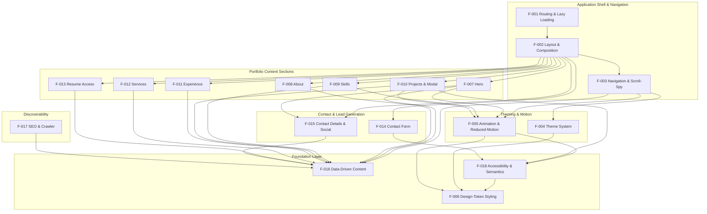
```mermaid
flowchart TD
    subgraph Foundation["Foundation Layer"]
        F006["F-006 Design-Token Styling"]
        F016["F-016 Data-Driven Content"]
        F018["F-018 Accessibility & Semantics"]
    end

    subgraph ThemeMotion["Theming & Motion"]
        F004["F-004 Theme System"]
        F005["F-005 Animation & Reduced-Motion"]
    end

    subgraph Shell["Application Shell & Navigation"]
        F001["F-001 Routing & Lazy Loading"]
        F002["F-002 Layout & Composition"]
        F003["F-003 Navigation & Scroll-Spy"]
    end

    subgraph ContentSections["Portfolio Content Sections"]
        F007["F-007 Hero"]
        F008["F-008 About"]
        F009["F-009 Skills"]
        F010["F-010 Projects & Modal"]
        F011["F-011 Experience"]
        F012["F-012 Services"]
        F013["F-013 Resume Access"]
    end

    subgraph ContactGroup["Contact & Lead Generation"]
        F014["F-014 Contact Form"]
        F015["F-015 Contact Details & Social"]
    end

    subgraph Discovery["Discoverability"]
        F017["F-017 SEO & Crawler"]
    end

    F018 --> F006
    F004 --> F006
    F005 --> F006
    F005 --> F018
    F001 --> F002
    F002 --> F003
    F003 --> F016
    F003 --> F004
    F003 --> F005
    F002 --> F007
    F002 --> F008
    F002 --> F009
    F002 --> F010
    F002 --> F011
    F002 --> F012
    F002 --> F013
    F002 --> F014
    F002 --> F015
    F007 --> F016
    F007 --> F005
    F007 --> F015
    F008 --> F016
    F009 --> F016
    F009 --> F005
    F010 --> F016
    F010 --> F005
    F010 --> F018
    F011 --> F016
    F012 --> F016
    F013 --> F016
    F014 --> F018
    F015 --> F016
    F017 --> F016
```

**Global rule (not drawn):** every shell, section, and contact feature (F-001 through F-015) consumes the **F-006** design-token layer for styling, and all interactive features additionally rely on **F-018** accessibility rules and the **F-005** reduced-motion signal where they animate. **F-006** and **F-016** have no prerequisites — they are the base of the graph.

### 2.3.2 Integration Points

The application's only integrations are foundational browser-platform touchpoints, static assets, and two placeholder external embeds (consistent with Section 1.2.1 and Section 1.3). No application backend, API, or database is integrated.

| Integration Point | Type | Consuming Feature(s) |
| --- | --- | --- |
| `localStorage` | Browser Web Storage API | F-004 (persist the `theme` key) |
| `matchMedia` | Browser media-query API | F-003 (mobile breakpoint), F-004 (OS color scheme), F-005 & F-018 (reduced motion) |
| `IntersectionObserver` | Browser observation API | F-003 (scroll-spy), F-005/F-008/F-009/F-010/F-011 (`whileInView` reveals) |
| `window.scrollTo` / scroll events | Browser scrolling API | F-003 (smooth in-page scroll, scrolled state), F-005 (back-to-top) |
| `createPortal` | `react-dom` | F-010 (modal rendered into `document.body`) |
| Google Fonts CDN | External font CDN | F-006 (Inter and Poppins via `index.html` preconnect) |
| Google Maps `<iframe>` | External embed (placeholder) | F-015 (location map) |
| `public/resume.pdf` | Root-served static asset | F-007 (Hero CTA), F-013 (download/view) |
| `favicon.svg`, `og-image.png`, `robots.txt`, `sitemap.xml` | Root-served static assets | F-017 (SEO/crawler/social) |
| Vite asset pipeline | Build-time module/URL resolution | F-016 (`hero`/`projects` image imports) |

### 2.3.3 Shared Components

The reusable UI primitives in `src/components/ui/` are the physical integration points shared across features. The table lists each primitive and the features that consume it.

| Shared Component | Consuming Feature(s) |
| --- | --- |
| `Container` | F-002/F-003 and every content section (layout width/gutters) |
| `SectionTitle` | F-008, F-009, F-010, F-011, F-012, F-013, F-014 (and the 404 page) |
| `Button` (polymorphic `as`) | F-007, F-010, F-013, F-014 (and the 404 page) |
| `Card` | F-008, F-009, F-010, F-011, F-012, F-013, F-014 |
| `Badge` | F-008, F-010, F-011 |
| `Reveal` | F-008, F-009, F-010, F-011, F-013, F-014 (the shared vehicle for F-005) |
| `Modal` | F-010 |
| `ProgressBar` | F-009 |
| `ThemeToggle` | F-003 (surfaces F-004) |
| `SocialLinks` | F-007, F-015, and the Footer |
| `StatCard` | F-008 |
| `Loader` | F-001 (eager Suspense fallback) |
| `BackToTop` | F-002/F-005 (mounted in `Layout`) |
| `Logo` | F-003 and the Footer (driven by `siteMeta`) |

### 2.3.4 Common Services

Cross-cutting behavior is centralized in the hook, utility, data, and style layers, so features integrate through stable named imports rather than duplicated logic.

| Common Service | Source | Purpose / Consuming Feature(s) |
| --- | --- | --- |
| `ThemeProvider` / `useTheme` | `src/hooks/useTheme.jsx` | App-wide theme context (F-004); mounted at the render root, consumed by `ThemeToggle` |
| `usePrefersReducedMotion` | `src/hooks/usePrefersReducedMotion.js` | The single reduced-motion signal (F-005/F-018); used by `Reveal`, `Modal`, `ProgressBar`, `BackToTop`, `Navbar`, and `Hero` |
| `useMediaQuery` | `src/hooks/useMediaQuery.js` | Responsive primitive (F-003 mobile query); foundation of `usePrefersReducedMotion` |
| `useActiveSection` | `src/hooks/useActiveSection.js` | Scroll-spy active-link state (F-003) |
| `useTypewriter` | `src/hooks/useTypewriter.js` | Hero role cycling (F-007) |
| `useScrollToTop` | `src/hooks/useScrollToTop.js` | Back-to-top visibility and action (F-005) |
| `useContactForm` | `src/hooks/useContactForm.js` | Contact-form state machine (F-014) |
| Smooth-scroll helpers | `src/utils/scroll.js` | `scrollToId`/`scrollToTop`, reduced-motion aware (F-003/F-005) |
| Validators | `src/utils/validators.js` | Pure contact-field validation (F-014) |
| Constants | `src/utils/constants.js` | `BREAKPOINTS`, `NAV_HEIGHT`, `BACK_TO_TOP_THRESHOLD`, `SECTION_OBSERVER` (F-003/F-005/F-006) |
| Animation variants | `src/utils/animations.js` | Shared Framer Motion variants and `viewportOnce` (F-005) |
| Content data barrel | `src/data/` | All display content and identity (F-016) — consumed by every section and the layout |
| Design tokens & global CSS | `src/styles/variables.css`, `src/styles/global.css` | All visual styling, focus, and reduced-motion rules (F-006) |

## 2.4 Implementation Considerations

This section captures the technical constraints, performance and scalability characteristics, security implications, and maintenance requirements that shape the features. Because most non-functional properties are cross-cutting in this client-only SPA, they are stated once as system-wide considerations and then specialized per feature. These considerations are grounded in the toolchain and source observed in the repository, not in assumed SLAs or KPIs (the repository codifies none — Section 1.2.3).

### 2.4.1 System-Wide Considerations

- **Client-only constraint.** There is no backend, database, authentication, or server runtime; all logic executes in the browser and the deployable artifact is the static `vite build` output. The only persisted state is the `theme` value in `localStorage`; all other state is ephemeral per page load.
- **Bundle discipline (performance).** Pages are code-split at the route level (`React.lazy` + `Suspense`); styling uses a custom design-token layer with no third-party UI kit; icons are tree-shakable (`react-icons`); and SEO uses a single static `<head>` rather than a runtime head-management library. Section 1.2.3 reports the index chunk at ≈91 kB gzipped and a build of 446 modules.
- **Rendering performance.** The tree is composed exclusively of function components and Hooks; the theme context value and the contact-form errors are memoized (`useMemo`/`useCallback`); scroll listeners are `passive`; animations use compositor-friendly transforms and fire once via `whileInView`; and the maps `<iframe>` is lazy-loaded.
- **Accessibility & reduced motion.** Semantic landmarks, keyboard operability, visible focus, and a global `prefers-reduced-motion` guard are treated as non-negotiable, cross-cutting requirements (F-018).
- **Design-token integrity.** All component styles reference `variables.css` tokens; the `NAV_HEIGHT` constant (72) must remain equal to the `--nav-height` token for scroll offsets to align.
- **Quality contract.** The ESLint flat config enforces zero errors and zero warnings; `npm audit` reports zero vulnerabilities; Node.js 22+ is required for the build/lint toolchain (a React Router v8 prerequisite).
- **Scalability model.** Content scales by editing `src/data/*` without touching components; the feature-oriented folder structure keeps each section and primitive self-contained (a folder with a `.jsx`, a CSS Module, and an `index.js` barrel).
- **Maintenance posture.** The source is JavaScript/JSX only (no TypeScript migration), modules are JSDoc-documented, and there is no automated test suite (explicitly out of scope per Section 1.3.2). Numerous content values, images, the résumé, project/demo URLs, and the map are placeholders awaiting real data.

### 2.4.2 Feature-Level Technical Constraints, Performance & Scalability

| Feature | Technical Constraints | Performance & Scalability |
| --- | --- | --- |
| F-001 Routing | React Router v8 (Node 22+ build); static route table built once (no loaders); deep links need a host SPA rewrite | Route-level code-splitting with an eager `Loader`; add routes by extending the table with a new lazy page |
| F-002 Layout | Prop-less composition; fixed section order tied to `navLinks` | Static, no runtime data; add/remove a section by editing `Home` and `navLinks` together |
| F-003 Navigation | Observed `id`s must match rendered section `id`s; mobile query is the complement of the CSS `lg` breakpoint; offset tied to `NAV_HEIGHT` | Passive scroll listener + a single `IntersectionObserver`; nav items are data-driven from `navLinks` |
| F-004 Theme | Client-only (assumes `window`/`document`); applied via `data-theme` on `<html>` | Lazy state initializer reads storage/`matchMedia` once; memoized context; new themes extend the token sets |
| F-005 Animation | All motion gated by reduced-motion; `ease` must match the `--ease` token | Compositor transforms, animate-once; variants added centrally in `animations.js` |
| F-006 Design Tokens | No third-party UI kit; light/dark parity; `--nav-height` = `NAV_HEIGHT` | Pure CSS variables (no runtime JS); re-skin centrally by editing `variables.css` |
| F-007 Hero | Owns the page's single `<h1>`; typewriter needs a stable words reference; depends on the résumé asset and `#contact` anchor | One timeout per typewriter step, cleared on unmount; content scales via `hero.js` |
| F-008 About, F-011 Experience, F-012 Services | Static, data-driven presentation; content is placeholder | `Reveal`/Framer Motion entrance, otherwise static; extend by editing the respective data arrays |
| F-009 Skills | Proficiency values in 0–100 | `scaleX` fill avoids reflow; categories/skills scale via `skills.js` |
| F-010 Projects & Modal | One modal open at a time; focus-trap correctness; external URLs are placeholders | Modal mounted via `createPortal`, motion gated; add a project via a data entry + a thumbnail SVG |
| F-013 Résumé | Résumé URL is a plain public path (currently a stub); shared with the Hero CTA | Static anchors; swap `public/resume.pdf` to update |
| F-014 Contact Form | No delivery backend (submission simulated); validation is client-only | 1200ms simulated timer; memoized errors; adding a field requires a validator + descriptor update |
| F-015 Contact Details & Social | `Email` social entry must equal `siteMeta.email`; map and social URLs are placeholders | Lazy `<iframe>`; social entries scale via `socials.js` |
| F-016 Data Layer | Named exports only; consistency contract with `index.html` | Static, tree-shakable; single source of truth for re-skinning |
| F-017 SEO | Single static head (no `react-helmet`); canonical host is a placeholder; needs a real domain | No runtime head library; the SPA has one canonical URL, so head edits are manual |
| F-018 Accessibility | Single `<h1>`; semantic landmarks; focus management; a final audit is deferred | Not performance-bound; enforced by conventions across all features |

### 2.4.3 Feature-Level Security & Maintenance

| Feature | Security Implications | Maintenance Requirements |
| --- | --- | --- |
| F-001 Routing | Unknown paths fail safe to the 404 page; requires a hosting catch-all rewrite in production | Keep the route table and page barrels in sync |
| F-002 Layout | None — static presentation | Update `Home` + `navLinks` when adding/removing a section |
| F-003 Navigation | In-page anchor navigation only; no external targets | `navLinks` is the single source for anchors, the observer, and the menu |
| F-004 Theme | Only a non-sensitive theme preference is persisted; no PII | Central hook; changes propagate app-wide |
| F-005 Animation / F-006 Tokens | None | Central variants/tokens; edits propagate to all consumers |
| F-007 Hero | Résumé link is same-origin | Edit `hero.js`; ensure the résumé asset exists |
| F-008 About, F-011 Experience, F-012 Services | None — static content | Edit the respective `src/data/*` modules |
| F-009 Skills | None | Edit `skills.js`; values auto-clamp to 0–100 |
| F-010 Projects & Modal | External GitHub/demo links use `rel="noopener noreferrer"`; URLs are placeholders | Focus-trap behavior must be preserved when the modal changes; add projects via data |
| F-013 Résumé | View action opens a new tab with `rel="noopener noreferrer"` | Replace the `public/resume.pdf` stub |
| F-014 Contact Form | No message is transmitted and no PII is stored; wiring real delivery would require input sanitization and anti-abuse controls | Keep validators and field descriptors aligned; integrate a delivery provider in a future phase |
| F-015 Contact Details & Social | External links use `rel="noopener noreferrer"`; `mailto:`/`tel:` expose placeholder contact details; the map iframe is a third-party embed | Replace placeholder social/profile URLs and the map embed; keep the `Email` entry equal to `siteMeta.email` |
| F-016 Data Layer | No secrets or credentials stored in data | Replace placeholder content with real, user-supplied values |
| F-017 SEO | `robots` is intentionally `index, follow` for a public site | Update the canonical/sitemap host to the real production domain |
| F-018 Accessibility | Focus management prevents keyboard traps | Uphold conventions (single `<h1>`, ARIA, reduced motion); complete the deferred audit |

### 2.4.4 Assumptions, Constraints & Requirement Versioning

**Assumptions.** A modern, ES-module-capable browser executes the client bundle; Node.js 22+ and npm are available for build/lint; the displayed content values are placeholders to be replaced before launch; and production hosting will provide an SPA catch-all rewrite so deep links and the 404 route resolve.

**Constraints.** The system is frontend-only (no backend, database, authentication, or server runtime); content is English-only (no internationalization); the source is JavaScript/JSX (no TypeScript, no server-side rendering); there is no analytics, monitoring, or error tracking; there is no automated test suite; and real contact-form delivery and a real Google Maps embed are deferred. Each of these boundaries is formally established in Section 1.3.2.

**Requirement versioning.** The requirements in this section constitute the baseline that corresponds to the current implemented state on branch `new-features-01` (the completed code deliverables described in Section 1). Because the features are already implemented and validated, requirements are recorded as an as-built baseline; future changes (for example, wiring real contact delivery under F-014 or a real map under F-015) would be tracked as new or superseding requirement revisions in subsequent versions of this document.

## 2.5 Traceability Matrix

This section provides bidirectional traceability: from each feature to the source artifacts that implement it and the related specification chapters, and from each requirement group to the method by which it is verified. The verification results referenced here are those recorded in Section 1.2.3 and the project's status guide (`blitzy/documentation/Project Guide.md`): a successful production build (446 modules, exit 0), an ESLint pass with zero errors/warnings, zero `npm audit` vulnerabilities, and 8 of 8 documented feature flows passing.

### 2.5.1 Feature-to-Source Traceability

| Feature ID | Primary Source Artifact(s) | Related Specification Sections |
| --- | --- | --- |
| F-001 | `src/App.jsx`; `src/pages/Home`, `src/pages/NotFound`; `src/components/ui/Loader` | §1.2.2; §5 System Architecture |
| F-002 | `src/pages/Home/Home.jsx`; `src/components/layout/Layout` | §1.2.2; §7 User Interface Design |
| F-003 | `src/components/layout/Navbar`; `src/hooks/useActiveSection.js`; `src/utils/scroll.js` | §4 Process Flowchart; §7 User Interface Design |
| F-004 | `src/hooks/useTheme.jsx`; `src/components/ui/ThemeToggle`; `src/styles/variables.css` | §1.2.2; §6 SYSTEM COMPONENTS DESIGN |
| F-005 | `src/components/ui/Reveal`, `BackToTop`; `src/utils/animations.js`; `src/hooks/usePrefersReducedMotion.js`, `useScrollToTop.js` | §3 Technology Stack; §7 User Interface Design |
| F-006 | `src/styles/variables.css`, `global.css`; `src/utils/constants.js` | §7 User Interface Design |
| F-007 | `src/sections/Hero`; `src/hooks/useTypewriter.js`; `src/data/hero.js` | §7 User Interface Design |
| F-008 | `src/sections/About`; `src/data/about.js` | §7 User Interface Design |
| F-009 | `src/sections/Skills`; `src/components/ui/ProgressBar`; `src/data/skills.js` | §7 User Interface Design |
| F-010 | `src/sections/Projects` (`ProjectCard`/`ProjectModal`); `src/components/ui/Modal`; `src/data/projects.js` | §4 Process Flowchart; §7 User Interface Design |
| F-011 | `src/sections/Experience`; `src/data/experience.js` | §7 User Interface Design |
| F-012 | `src/sections/Services`; `src/data/services.js` | §7 User Interface Design |
| F-013 | `src/sections/Resume`; `src/data/siteMeta.js`; `public/resume.pdf` | §7 User Interface Design |
| F-014 | `src/sections/Contact` (`ContactForm`); `src/hooks/useContactForm.js`; `src/utils/validators.js` | §4 Process Flowchart; §6 SYSTEM COMPONENTS DESIGN |
| F-015 | `src/sections/Contact` (`ContactInfo`); `src/components/ui/SocialLinks`; `src/data/socials.js`, `siteMeta.js` | §7 User Interface Design |
| F-016 | `src/data/*` (the `index.js` barrel and nine content modules) | §1.2.2; §6 SYSTEM COMPONENTS DESIGN |
| F-017 | `index.html`; `public/robots.txt`, `sitemap.xml`, `og-image.png`, `favicon.svg` | §1.3.1; §8 Infrastructure |
| F-018 | `src/styles/global.css`; the section components; `src/hooks/usePrefersReducedMotion.js` | §7 User Interface Design |

### 2.5.2 Requirement Verification Matrix

**Verification method legend:** **BUILD** = production build success (`npm run build`); **LINT** = ESLint zero-warning pass (`npm run lint`); **FLOW** = manual feature-flow validation recorded in the Project Guide; **INSPECT** = source/code inspection.

| Requirement ID Range | Feature | Verification Method(s) |
| --- | --- | --- |
| F-001-RQ-001 … RQ-003 | F-001 | BUILD (per-route chunks), FLOW (navigation + 404) |
| F-002-RQ-001 … RQ-002 | F-002 | INSPECT (fixed composition), FLOW |
| F-003-RQ-001 … RQ-004 | F-003 | FLOW (active link, mobile menu, Escape/focus), INSPECT |
| F-004-RQ-001 … RQ-004 | F-004 | FLOW (toggle + persistence), INSPECT |
| F-005-RQ-001 … RQ-003 | F-005 | FLOW (back-to-top), INSPECT (reduced-motion guards) |
| F-006-RQ-001 … RQ-003 | F-006 | INSPECT (token usage, focus/motion rules), LINT |
| F-007-RQ-001 … RQ-003 | F-007 | FLOW, INSPECT (single `<h1>`, typewriter, CTAs) |
| F-008-RQ-001 … RQ-002 | F-008 | INSPECT, FLOW |
| F-009-RQ-001 … RQ-002 | F-009 | INSPECT (`progressbar` ARIA, clamp), FLOW |
| F-010-RQ-001 … RQ-004 | F-010 | FLOW (open/close/focus trap/Escape), INSPECT |
| F-011-RQ-001 | F-011 | INSPECT |
| F-012-RQ-001 | F-012 | INSPECT |
| F-013-RQ-001 … RQ-002 | F-013 | FLOW (download/view), INSPECT (safe `rel`) |
| F-014-RQ-001 … RQ-004 | F-014 | FLOW (validation, disabled submit, success/error), INSPECT |
| F-015-RQ-001 … RQ-003 | F-015 | INSPECT (`mailto:`/`tel:`, `rel`, lazy iframe), FLOW |
| F-016-RQ-001 … RQ-002 | F-016 | INSPECT (barrel exports), BUILD |
| F-017-RQ-001 … RQ-003 | F-017 | INSPECT (head + crawler assets), BUILD (public copy) |
| F-018-RQ-001 … RQ-003 | F-018 | INSPECT (landmarks, ARIA, single `<h1>`), FLOW |

### 2.5.3 Feature-to-Priority-and-Category Rollup

The rollup below cross-references each feature to its category and priority for planning traceability; full metadata is in Section 2.1.1.

| Category | Critical | High / Medium |
| --- | --- | --- |
| Application Shell & Navigation | F-002 | F-001, F-003 (High) |
| Presentation, Theming & Motion | F-006 | F-004, F-005 (Medium) |
| Portfolio Content Sections | F-007, F-010 | F-008, F-009, F-011, F-013 (High); F-012 (Medium) |
| Contact & Lead Generation | F-014 | F-015 (High) |
| Content & Discoverability Foundation | F-016 | F-017, F-018 (High) |

## 2.6 References

The following repository artifacts were inspected as the evidentiary basis for the features, requirements, relationships, and traceability documented in this section.

**Application Bootstrap & Routing**

- `src/main.jsx` - Established the render root, `StrictMode`, and the `ThemeProvider` wrapping the app (F-004, F-002).
- `src/App.jsx` - Established React Router v8 data-router setup (`createBrowserRouter`/`RouterProvider`), lazy-loaded `Home`/`NotFound` routes, and the eager `Loader` fallback (F-001).
- `src/pages/Home/Home.jsx` - Established the fixed section composition order (Hero → About → Skills → Projects → Experience → Services → Resume → Contact) within `Layout` (F-002).
- `src/pages/NotFound/` - Established the wildcard 404 route target (F-001).

**Layout & UI Component Library**

- `src/components/layout/` - Contained `Navbar` (sticky nav, scroll-spy consumer, mobile menu, Escape/focus handling), `Footer`, `Layout` (skip link + landmark shell), and `Logo` (F-002, F-003, F-018).
- `src/components/ui/` - Contained the 13 shared primitives cited as shared components: `Container`, `SectionTitle`, `Button` (polymorphic `as`, variants/sizes), `Card`, `Badge`, `Reveal`, `Modal` (portal dialog, focus trap, scroll lock), `ProgressBar` (clamp + `progressbar` ARIA), `ThemeToggle`, `SocialLinks`, `StatCard`, `Loader`, and `BackToTop` (F-005, F-009, F-010, F-015, and shared-component analysis in 2.3.3).

**Portfolio Sections**

- `src/sections/` - Contained the eight content sections cited as features: `Hero`, `About`, `Skills`, `Projects` (`ProjectCard`/`ProjectModal`), `Experience`, `Services`, `Resume` (Download/View actions), and `Contact` (`ContactForm`/`ContactInfo`) (F-007 through F-015).

**Hooks (Common Services)**

- `src/hooks/useTheme.jsx` - Established theme state, `localStorage` persistence under `theme`, `matchMedia` default, `data-theme` mirroring, and the out-of-provider guard (F-004).
- `src/hooks/useActiveSection.js` - Established the IntersectionObserver scroll-spy that drives the active nav link (F-003).
- `src/hooks/useScrollToTop.js` - Established the 400px threshold passive scroll listener for BackToTop (F-005).
- `src/hooks/usePrefersReducedMotion.js` - Established the reduced-motion media-query hook consumed by the animation and modal systems (F-005, F-018).
- `src/hooks/useMediaQuery.js` - Established the responsive breakpoint hook consumed by the Navbar mobile query (F-003, F-006).
- `src/hooks/useTypewriter.js` - Established the Hero rotating-role typewriter behavior (F-007).
- `src/hooks/useContactForm.js` - Established the contact-form state machine (field state, blur/submit validation, disabled-submit, success/error handling) (F-014).

**Data Modules**

- `src/data/index.js` - Established the barrel re-exporting nine named content modules with no default exports (F-016).
- `src/data/siteMeta.js`, `navLinks.js`, `hero.js`, `about.js`, `skills.js`, `projects.js`, `experience.js`, `services.js`, `socials.js` - Established the content driving every section, nav order, résumé URL, and social links (F-007 through F-016).

**Utilities & Styles**

- `src/utils/constants.js` - Established `BREAKPOINTS`, `NAV_HEIGHT` (72), `BACK_TO_TOP_THRESHOLD` (400), and `SECTION_OBSERVER` config (F-003, F-005, F-006).
- `src/utils/validators.js` - Established the pure field validators, `EMAIL_REGEX`, and `validateContactForm` aggregation with exact error messages and trimming (F-014).
- `src/utils/scroll.js` - Established `scrollToId` offsetting by `NAV_HEIGHT` with reduced-motion-aware behavior (F-003).
- `src/utils/animations.js` - Established the shared Framer Motion variants and `viewportOnce` config (F-005).
- `src/utils/index.js` - Established the utility barrel (F-006).
- `src/styles/variables.css` - Established the design-token layer (light/dark theme tokens, `--nav-height`) (F-004, F-006).
- `src/styles/global.css` - Established global resets, focus-visible styling, the reduced-motion global rule, and landmark/skip-link styling (F-006, F-018).

**Configuration, SEO & Static Assets**

- `index.html` - Established the static SEO head (title, meta description, Open Graph/Twitter tags, theme-color, font preconnect) and `#root` mount point (F-017).
- `public/robots.txt`, `public/sitemap.xml` - Established crawler directives and the single canonical URL (F-017).
- `public/og-image.png`, `public/favicon.svg` - Established the 1200×630 social preview image and site icon (F-017).
- `public/resume.pdf` - Established the résumé asset target referenced by `siteMeta.resumeUrl` (F-013).
- `package.json` - Established dependencies/versions (React 19, React Router v8, Vite 8, Framer Motion, react-icons), scripts, and the Node 22+ requirement (system dependencies for all features).
- `vite.config.js`, `eslint.config.js` - Established the Vite build pipeline and the zero-warning ESLint contract (2.4 Implementation Considerations).
- `README.md` - Established the documented tech stack, Node 22+ prerequisite, and project scripts.

**Cross-Referenced Specification Sections**

- Section 1.2 System Overview and Section 1.3 Scope - Provided the authoritative capability map, success criteria, and in-/out-of-scope boundaries used to derive and bound the feature set.
- Sections 3–8 (Technology Stack; Process Flowchart; System Architecture; System Components Design; User Interface Design; Infrastructure) - Referenced as forward links for stack details, runtime flows, architecture, component design, UI specifications, and deployment.

# 3. Technology Stack

## 3.1 Programming Languages

This section inventories the programming languages used to build `my-react-app`, organized by the layer in which each executes. Because the application is a **client-side single-page application with no server-side runtime** (Sections 1.2 and 2.4), there is a single execution tier — the browser — supported by a Node.js-hosted build and lint toolchain. Every statement below is grounded in the repository manifests and source tree.

**Languages in use.** The source tree contains no TypeScript, no server-side language, and no template language; every authored file is a standard web-platform artifact. The `"type": "module"` declaration in `package.json` makes every `.js` file an ES module, so a single module system spans source and configuration.

| Language | Standard / Target | Footprint (source files) | Primary Role & Location |
| --- | --- | --- | --- |
| JavaScript (ES Modules) | ECMAScript; Vite build `target: 'esnext'` | 50 `.js` files | Application logic and configuration: 6 of the 7 custom hooks, the 5 `utils` modules, the 10 `src/data` content modules, the per-component `index.js` barrels, plus the `vite.config.js` and `eslint.config.js` tooling configs |
| JSX | React 19 automatic JSX runtime (via `@vitejs/plugin-react`) | 37 `.jsx` files | React component markup: `main.jsx`, `App.jsx`, the `useTheme` provider, 13 UI primitives, 4 layout components, the 8 portfolio sections (and their subcomponents), and the 2 route pages |
| HTML5 | HTML5 | 1 `.html` file | `index.html` — the SPA document shell: the SEO / Open Graph / Twitter head, Google Fonts `<link>`s, the `#root` mount node, and the `/src/main.jsx` module entry |
| CSS3 | CSS3 with CSS Modules + custom properties | 32 `*.module.css` + 2 global `.css` | Component-scoped styles (`*.module.css`) plus the `variables.css` design-token catalog and the `global.css` reset/typography layer under `src/styles/` |

Ancillary formats support the toolchain rather than application behavior: **JSON** defines the npm manifest and lockfile (`package.json`, `package-lock.json`), and **Markdown** carries repository documentation (`README.md`).

### 3.1.1 Language Selection Rationale

- **JavaScript + JSX** are the native authoring languages of React. Authoring as ES modules aligns with Vite's native-ESM dev server, on-demand transforms, and tree-shaking, which keeps the toolchain minimal and the shipped bundle small — an explicit engineering goal recorded in Sections 1.2.3 and 2.4.1.
- **HTML5** is used for a single static document shell that carries the entire SEO/social head, deliberately avoiding a runtime head-management library (the "small-bundle" rule noted in `index.html`).
- **CSS3 with custom properties** powers a single-source design-token system and the light/dark theme, which is applied by toggling a `data-theme` attribute on `<html>`; this removes any need for a third-party CSS framework (`src/styles/variables.css`, `src/styles/global.css`).
- **No TypeScript, by design.** `@types/react` (19.2.17) and `@types/react-dom` (19.2.3) are present only as devDependencies for editor IntelliSense and JSDoc hints; there is no `tsconfig.json` and zero `.ts`/`.tsx` files, so no type-checking/compile step exists. This matches the "JavaScript/JSX only (no TypeScript migration)" constraint recorded in Section 2.4.

### 3.1.2 Constraints & Interdependencies

- **Browser runtime.** The bundle targets modern, ES-module-capable browsers. The `build.target: 'esnext'` setting in `vite.config.js` means the emitted output uses modern syntax with no down-level transpilation configured.
- **Toolchain runtime.** Node.js ≥ 22.22.0 and npm are required for the `dev`/`build`/`lint` workflows — the floor is imposed by React Router v8's declared engine (see Sections 3.2.4 and 3.6).
- **JSX transform dependency.** JSX is compiled by `@vitejs/plugin-react` (Babel, `@babel/core` 7.29.7) at dev/build time; without the plugin the `.jsx` sources would not execute.
- **Lint scope.** The ESLint flat config lints only `**/*.{js,jsx}` with browser globals and the JSX parser feature enabled, and globally ignores `dist/` (`eslint.config.js`).
- **Type tooling without a compiler.** Because typing is provided only through editor tooling and JSDoc, there is no compiler-enforced type safety; correctness is guarded instead by ESLint (including `eslint-plugin-react-hooks`) and the documented zero-warnings contract.

## 3.2 Frameworks & Libraries

This section documents the frameworks and libraries that the application depends on at runtime, together with the build framework that compiles and serves it. Two version columns are shown throughout: the **declared** caret (`^`) range from `package.json` and the **installed** version resolved in `package-lock.json` (the source of truth for a reproducible `npm ci`). Every package below is MIT-licensed, and the project's `README.md` records that `npm audit` reports zero vulnerabilities across the locked tree.

### 3.2.1 Core Application Frameworks

| Framework | Declared / Installed | Role in the System | Primary Integration Point |
| --- | --- | --- | --- |
| React (`react` + `react-dom`) | `^19.2.7` / `19.2.7` | The UI rendering library; the entire tree is function components + Hooks | `createRoot(...).render(<StrictMode>…)` in `src/main.jsx`; scheduling via internal `scheduler` 0.27.0 |
| React Router (`react-router`) | `^8.1.0` / `8.1.0` | Client-side routing: `/` → `Home`, `*` → `NotFound` | `createBrowserRouter` (from `react-router`) + `RouterProvider` (from `react-router/dom`) in `src/App.jsx` |

**React 19.2.7** is the foundation of the system: `src/main.jsx` creates a single concurrent root with `createRoot` inside `<StrictMode>`, and application-wide theme state is supplied by a React Context provider (`ThemeProvider`) that wraps the router so the theme is available to every route-driven page. The choice is self-reinforcing for this product — a portfolio that showcases React expertise is itself built in React — and function-component-plus-Hooks composition is enforced by `eslint-plugin-react-hooks`.

**React Router 8.1.0** provides the data-router pairing `createBrowserRouter` + `RouterProvider` (the DOM-aware provider imported from the `react-router/dom` entry). A static two-route table is built once at module scope, and each page element is code-split with `React.lazy` + dynamic `import()` behind a `<Suspense>` fallback, so routing directly enables the bundle-discipline strategy described in Section 2.4. React Router v8 is also the component that sets the toolchain's Node.js floor (`engines.node >= 22.22.0`).

### 3.2.2 Supporting UI & Animation Libraries

| Library | Declared / Installed | Role | Representative Usage |
| --- | --- | --- | --- |
| Framer Motion (`framer-motion`) | `^12.42.2` / `12.42.2` | Declarative animation: entrance & scroll-reveal, hover micro-interactions, `AnimatePresence` exits | `Reveal`, `ProgressBar`, `Modal`, `Hero`, `Services`, `BackToTop`, and the Navbar mobile menu |
| React Icons (`react-icons`) | `^5.6.0` / `5.7.0` | Tree-shakable SVG icon sets (Font Awesome `fa`/`fa6`) | `SocialLinks`, `Services`, `Skills`, `Button`, and the Contact section |

**Framer Motion 12.42.2** (with internal packages `motion-dom` 12.42.2 and `motion-utils` 12.39.0) supplies all motion. Animations use compositor-friendly transforms, fire once via `whileInView`, and are centrally gated by a `prefers-reduced-motion` guard, keeping motion accessible. **React Icons 5.7.0** provides per-icon imports that tree-shake, so the build ships only the SVGs actually referenced rather than an entire icon font — reinforcing the small-bundle goal.

**Intentional non-dependencies.** Styling deliberately uses **no third-party UI kit or CSS framework** (no Tailwind, Bootstrap, Material UI, or CSS-in-JS runtime) and **no form or state-management library**; component styles are CSS Modules driven by the `variables.css` design tokens (Sections 3.1 and 2.4). The "Tailwind CSS," "Bootstrap," "Selenium," "Cypress," and "SQL" strings that appear in the repository are portfolio *content* in `src/data/skills.js`, not installed dependencies.

### 3.2.3 Build & Development Framework

| Tool | Declared / Installed | Role |
| --- | --- | --- |
| Vite (`vite`) | `^8.1.0` / `8.1.0` | Dev server with HMR, production bundler, the `@` → `/src` alias, and the `esnext` build target |
| `@vitejs/plugin-react` | `^6.0.2` / `6.0.3` | React integration: the JSX transform and Fast Refresh, powered by Babel (`@babel/core` 7.29.7) |

**Vite 8.1.0** is the single build framework, configured minimally in `vite.config.js` (React plugin, `@`→`/src` alias, `build.target: 'esnext'`, `outDir: 'dist'`). Under the hood Vite 8 bundles with **Rolldown** (1.1.3) and transforms/minifies CSS with **Lightning CSS** (1.32.0); the operational build/serve workflow and its outputs are detailed in Section 3.6, and the full transitive inventory in Section 3.3.

### 3.2.4 Compatibility & Integration Requirements

The library set is internally consistent because every runtime package targets the same React major version, so there are no conflicting peer requirements.

| Package | Declared Peer Dependencies | Declared Node Engine |
| --- | --- | --- |
| `react-router` 8.1.0 | `react`, `react-dom` | `>=22.22.0` |
| `framer-motion` 12.42.2 | `react`, `react-dom` (optional `@emotion/is-prop-valid`, not installed) | (none) |
| `react-icons` 5.7.0 | `react` | (none) |
| `react-dom` 19.2.7 | `react` | (none) |
| `@vitejs/plugin-react` 6.0.3 | `vite` (satisfied by 8.1.0) | `^20.19.0 \|\| >=22.12.0` |

- **React alignment.** `react-dom`, `react-router`, `react-icons`, and `framer-motion` all peer-depend on `react`, and all resolve against the installed `react` 19.2.7, so the tree is peer-consistent.
- **Node.js floor.** The most restrictive engine is React Router's `>=22.22.0`; Vite and `@vitejs/plugin-react` require `^20.19.0 || >=22.12.0` and ESLint requires `^20.19.0 || ^22.13.0 || >=24`. The effective minimum is therefore **Node.js 22.22.0** (the root `package.json` declares no `engines` field, so this derives from the dependencies themselves and matches the `README.md` "Node.js 22+" prerequisite).
- **Reproducibility & security.** Installing with `npm ci` pins the exact lockfile versions; `react-icons` (`5.7.0`) and `@vitejs/plugin-react` (`6.0.3`) resolve to newer compatible caret releases than their declared bases. All principal packages are MIT-licensed with zero reported vulnerabilities (`README.md`).

The diagram below shows the runtime dependency/peer relationships among the installed packages (an arrow `A --> B` reads "A requires B").

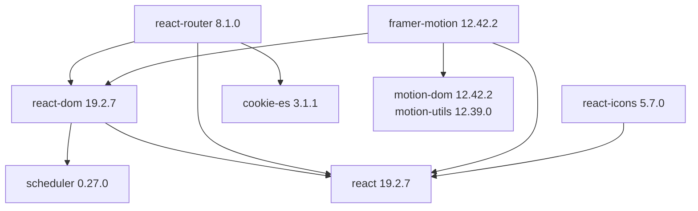
```mermaid
flowchart TD
    ReactCore["react 19.2.7"]
    ReactDom["react-dom 19.2.7"]
    Router["react-router 8.1.0"]
    Motion["framer-motion 12.42.2"]
    Icons["react-icons 5.7.0"]
    Sched["scheduler 0.27.0"]
    Cookie["cookie-es 3.1.1"]
    MDom["motion-dom 12.42.2<br/>motion-utils 12.39.0"]

    ReactDom --> ReactCore
    ReactDom --> Sched
    Router --> ReactCore
    Router --> ReactDom
    Router --> Cookie
    Motion --> ReactCore
    Motion --> ReactDom
    Motion --> MDom
    Icons --> ReactCore
```

## 3.3 Open Source Dependencies

Every dependency in `my-react-app` is an open-source npm package. This section enumerates the direct dependencies with their declared and installed versions and licenses, then summarizes the transitive and platform-specific packages that the lockfile pins. All version and license facts are read directly from `package.json` and `package-lock.json`.

### 3.3.1 Registry, Manifest & Lockfile

- **Registry.** All packages resolve to the public npm registry (`registry.npmjs.org`), per the resolved tarball URLs recorded in `package-lock.json`.
- **Manifest.** `package.json` declares **5 runtime dependencies** and **9 devDependencies**; the project is `private: true`, version `0.0.0`.
- **Lockfile.** `package-lock.json` uses `lockfileVersion: 3` and pins **172** installed `node_modules` packages (the full resolved graph). Of these, **162 are development-only** and **10 are production (non-dev)**, so the runtime footprint that ships to browsers is a small subset of the installed tree. **32** packages are optional (platform-specific), and **`fsevents` is the only package with an install script**.
- **License.** Every principal package (direct and the major transitive build-chain packages) is **MIT-licensed**.
- **Reproducibility & audit.** The `README.md` directs installs via `npm ci` (exact lockfile versions) and records that `npm audit` reports **0 vulnerabilities**.

### 3.3.2 Direct Dependencies

**Runtime dependencies** (`dependencies` — code that ships to the browser):

| Package | Declared | Installed | License | Purpose |
| --- | --- | --- | --- | --- |
| `react` | `^19.2.7` | `19.2.7` | MIT | Core UI library (components + Hooks) |
| `react-dom` | `^19.2.7` | `19.2.7` | MIT | DOM renderer (`createRoot`) |
| `react-router` | `^8.1.0` | `8.1.0` | MIT | Client-side routing |
| `framer-motion` | `^12.42.2` | `12.42.2` | MIT | Animation and transitions |
| `react-icons` | `^5.6.0` | `5.7.0` | MIT | Tree-shakable SVG icon sets |

**Development dependencies** (`devDependencies` — build, lint, and editor tooling only):

| Package | Declared | Installed | License | Purpose |
| --- | --- | --- | --- | --- |
| `vite` | `^8.1.0` | `8.1.0` | MIT | Dev server, bundler, preview |
| `@vitejs/plugin-react` | `^6.0.2` | `6.0.3` | MIT | JSX transform + Fast Refresh |
| `eslint` | `^10.5.0` | `10.5.0` | MIT | Linter (flat config) |
| `@eslint/js` | `^10.0.1` | `10.0.1` | MIT | ESLint recommended core rules |
| `eslint-plugin-react-hooks` | `^7.1.1` | `7.1.1` | MIT | Rules of Hooks enforcement |
| `eslint-plugin-react-refresh` | `^0.5.3` | `0.5.3` | MIT | Fast Refresh safety lint rule |
| `globals` | `^17.6.0` | `17.7.0` | MIT | Browser global identifiers for ESLint |
| `@types/react` | `^19.2.17` | `19.2.17` | MIT | React type definitions (editor/JSDoc) |
| `@types/react-dom` | `^19.2.3` | `19.2.3` | MIT | React DOM type definitions (editor/JSDoc) |

### 3.3.3 Transitive & Platform-Specific Dependencies

The direct packages pull in a locked transitive graph. The most significant transitive packages — the ones that define how the project builds and runs — are listed below.

| Package | Installed | Pulled in by | Role |
| --- | --- | --- | --- |
| `rolldown` | `1.1.3` | `vite` | Rust-based bundler used by Vite 8 (no `esbuild` present) |
| `lightningcss` | `1.32.0` | `vite` | Rust-based CSS transform and minification |
| `postcss` | `8.5.15` | `vite` | CSS processing pipeline |
| `browserslist` | `4.28.4` | build chain | Resolves target browsers |
| `caniuse-lite` | `1.0.30001799` | `browserslist` | Browser-compatibility dataset |
| `@babel/core` / `@babel/parser` | `7.29.7` | `@vitejs/plugin-react` | JSX transform + Fast Refresh |
| `scheduler` | `0.27.0` | `react-dom` | React's cooperative scheduler |
| `motion-dom` / `motion-utils` | `12.42.2` / `12.39.0` | `framer-motion` | Framer Motion internals |
| `cookie-es` | `3.1.1` | `react-router` | Cookie parsing used by the router |

**Optional platform-native packages.** Of the 172 locked packages, 32 are optional and platform-gated: the per-platform `@rolldown/binding-*` native bindings (for `darwin`, `linux`, `android`, `freebsd`, `openharmony`, and others), the `lightningcss` native bindings, and a WebAssembly fallback runtime (`@emnapi/*`, `@napi-rs/wasm-runtime`). npm installs only the bindings matching the host OS/architecture. `fsevents` (`2.3.3`) is a Darwin-only file-watching dependency and is the single package that runs an install script.

**Security posture.** Because only 10 of the 172 installed packages are production dependencies, the runtime dependency surface is intentionally small; the remainder are build/lint/editor tooling that never ships to the browser. Combined with the pinned lockfile, the `npm ci` install path, and the zero-vulnerability `npm audit` result, the dependency posture favors reproducibility and a minimal attack surface (see also Sections 3.2.4 and 3.6).

## 3.4 Third-Party Services

As a client-only SPA with no backend, `my-react-app` integrates with very few external services, and none for authentication, data, or telemetry. A repository-wide search confirms there is **no `fetch`/`axios`/`XMLHttpRequest`/WebSocket usage anywhere in `src/`** and **no environment-variable access** (`import.meta.env`/`process.env`), so the application makes no programmatic API calls and embeds no API keys. The external touchpoints that do exist are the browser-platform integrations described below.

### 3.4.1 External Runtime Resources & Embeds

| Touchpoint | Type | Location | Nature |
| --- | --- | --- | --- |
| Google Fonts | Font CDN (runtime) | `index.html` | Loads the **Inter** and **Poppins** families via a `<link>` stylesheet, with `preconnect` to `fonts.googleapis.com`/`fonts.gstatic.com` and `display=swap` |
| Google Maps | Embedded map (`<iframe>`) | `src/sections/Contact/ContactInfo.jsx` | A keyless `output=embed` map iframe for a sample location (San Francisco), lazy-loaded |
| Email (`mailto:`) / phone (`tel:`) | Client protocol handlers | `src/sections/Contact/ContactInfo.jsx`, `src/data/socials.js` | Open the visitor's mail/phone client using the placeholder `siteMeta` contact details |
| Social & project links | Outbound hyperlinks | `src/data/socials.js`, `src/data/projects.js` | GitHub / LinkedIn / X plus per-project repository and demo URLs (placeholders) |

**Google Fonts** is the only genuine third-party resource requested at page load. The two families map to the `--font-sans` (Inter) and `--font-heading` (Poppins) design tokens in `src/styles/variables.css`; `display=swap` paints text immediately with the fallback stack so the page degrades gracefully (no blocking) if the stylesheet is unavailable. An `index.html` comment records the deliberate policy to add no framework or CDN **scripts** — only this font stylesheet is external.

**Google Maps** is embedded as a lazy-loaded `<iframe>` in the Contact section using a public keyless embed URL; it is a placeholder pending a real embed (Section 2.4, F-015). **Outbound links** (social profiles, project repositories, and live demos) are placeholder URLs opened in a new tab with `rel="noopener noreferrer"`.

### 3.4.2 Source Hosting & Version Control

The repository's Git origin is hosted on **GitHub** (`github.com/Sandeep01Kumar/my-react-app`), and Git is the version-control system for the project. This is a development-time hosting integration only; as noted in Section 3.6, **no GitHub Actions or other CI/CD automation is configured** in the repository. (The `github.com/johndoe/*` URLs in `src/data/projects.js` are unrelated placeholder content.)

### 3.4.3 Absent Service Categories & Security Considerations

Several service categories that the default technology stack anticipates are **not applicable** to this system because it has no server side; their absence is confirmed by the source and manifests:

| Category | Status | Evidence |
| --- | --- | --- |
| Authentication / identity (e.g., Auth0, OAuth) | None — no accounts or login exist | No auth SDKs in `package.json`; no `fetch`/token logic in `src/` |
| Monitoring / analytics / error tracking | None | No `gtag`/Google Tag Manager/Sentry/RUM code; Section 1.2.3 records no instrumentation |
| Cloud services (AWS/GCP/Azure) | None integrated | No cloud SDKs or config; the deployable artifact is static files (Section 3.6) |
| Email delivery for the contact form | None (submission simulated client-side) | `src/hooks/useContactForm.js` states a delivery integration (e.g., `@emailjs/browser`) is explicitly out of scope |
| Payments / databases-as-a-service | None | No such dependencies or client code exist |

**Security implications.** With no backend, no secrets, and no environment variables, there are no server credentials or API keys to protect in this codebase. The remaining considerations are third-party-request and outbound-link related: the Google Fonts and Google Maps requests expose the visitor's IP to Google (a privacy consideration for a public site), and all external navigations use `rel="noopener noreferrer"` to prevent reverse tabnabbing (Section 2.4). No Content-Security-Policy is declared in `index.html`, which is a potential hardening opportunity if a strict CSP is desired for the font and map origins. The simulated contact form transmits and stores nothing, so no personal data leaves the browser; wiring a real delivery provider later would introduce the usual input-sanitization and anti-abuse requirements (Section 2.4, F-014).

## 3.5 Databases & Storage

`my-react-app` has **no database and no server-side persistence of any kind**. It stores exactly one piece of cross-session state in the browser (the theme preference) and treats all display content as build-time data compiled into the bundle. The mechanisms that constitute "storage" for this system are summarized below.

| Mechanism | Technology | Scope / Location | Data Stored |
| --- | --- | --- | --- |
| Theme preference | Web Storage `localStorage` (key `theme`) | Browser, per-origin, persistent | `'light'` / `'dark'` string (non-PII) |
| Content data | ES-module constants (`src/data/*`) bundled at build | In-bundle (build-time) | Portfolio copy and lists (placeholder) |
| Static files | Filesystem assets in `public/` → copied to `dist/` | Served by the static host | `favicon.svg`, `og-image.png`, `resume.pdf`, `robots.txt`, `sitemap.xml`, `llms.txt` |
| Ephemeral UI state | React state / Context (in-memory) | Runtime, per session | Form values, menu/modal/active-section state |

### 3.5.1 Databases and Server-Side Persistence (Not Applicable)

There is **no primary or secondary database, no ORM, and no database driver or client** anywhere in the dependency tree or source. This is a direct consequence of the client-only architecture established in Sections 1.2 and 2.4: there is no backend process to host or connect to a datastore. Consequently, categories such as relational databases, document stores, key-value stores, object storage services, and data-warehouse integrations are all not applicable to the current system.

### 3.5.2 Client-Side & Build-Time Data Persistence

- **Theme preference (the only persisted user state).** `src/hooks/useTheme.jsx` reads and writes a single `localStorage` key, `theme`. On first visit the value is seeded from the OS `prefers-color-scheme` media query; thereafter the user's explicit choice persists across sessions and is applied by setting a `data-theme` attribute on `<html>`. The stored value is a non-sensitive `'light'`/`'dark'` string, so no personal data is retained (Section 2.4, F-004). The application sets **no cookies** and uses **no `sessionStorage` or IndexedDB**.
- **Content as code (the data-persistence strategy).** The application's content lives in ten ES modules under `src/data/` (exposed through an `index.js` barrel of named exports) and is compiled into the JavaScript bundle at build time. There is no runtime data fetch; the "database" for the portfolio is effectively the versioned source itself. Content therefore scales by editing `src/data/*` and rebuilding — the scalability model recorded in Section 2.4 — with no schema or migration concerns.
- **Static assets.** Files in `public/` are copied verbatim into `dist/` by `vite build` and served as-is by the host. These include the favicon, the 1200×630 Open Graph social image, the placeholder `resume.pdf`, and the crawler files `robots.txt` and `sitemap.xml`.
- **Ephemeral runtime state.** All interactive state (contact-form fields, mobile-menu and modal open/closed flags, the active navigation section) is held in in-memory React state or Context and is reset on page reload; none of it is persisted.

### 3.5.3 Caching Strategy

Caching is limited to the standard web-platform and build-tool mechanisms; there is no application-level cache library (no React Query / SWR) and **no service worker or offline/PWA cache** (there is no `sw.js` or web-app manifest in the repository).

- **Content-hashed build output.** `vite build` emits assets with content-hashed filenames under `dist/assets/` (for example `index-D-TxNnYL.js`, `Home-wStV3uBw.js`, `NotFound-DogcXHjw.js`, and the shared `SectionTitle-Jam3IwAy.js` chunk). Hashed filenames enable long-lived HTTP caching with automatic cache-busting whenever a chunk's contents change, while the entry `index.html` remains unhashed so a host can serve it with a short TTL and pick up new chunk hashes on each deploy.
- **Browser HTTP cache.** Static assets copied from `public/` and the hashed chunks are cached by the browser according to the response headers the chosen static host provides (the repository does not pin those headers).
- **Font caching.** Google Fonts are cached by the browser; `display=swap` avoids a blocking fetch (Section 3.4).

## 3.6 Development & Deployment

This section covers the tooling used to develop the application, the build system that produces the deployable artifact, and the deployment model that artifact implies. All commands and settings are read from `package.json`, `vite.config.js`, `eslint.config.js`, and `.gitignore`.

### 3.6.1 Development Environment & Tooling

| Tool / Setting | Value | Purpose |
| --- | --- | --- |
| Runtime | Node.js ≥ 22.22.0 + npm | Required for all scripts (React Router v8 engine floor; `README.md`) |
| Package manager | npm with `package-lock.json` (`npm ci`) | Deterministic, reproducible installs |
| Dev server | `npm run dev` → `vite` | Native-ESM dev server with HMR / React Fast Refresh |
| Preview | `npm run preview` → `vite preview` | Serves the production build locally for a final check |
| Linter | `npm run lint` → `eslint .` | Static analysis under the flat config |
| Path alias | `@` → `/src` (`vite.config.js`) | Clean, root-relative imports across the source tree |

The **ESLint flat config** (`eslint.config.js`) composes three rule sets — `@eslint/js` recommended, `eslint-plugin-react-hooks` (`flat.recommended`), and `eslint-plugin-react-refresh` (`vite` preset) — over `**/*.{js,jsx}` with browser globals and the JSX parser feature, and globally ignores `dist/`. The lint script is literally `eslint .`; the "zero errors and zero warnings" quality bar is a documented contract in `README.md` and Section 2.4 rather than a CLI flag. Editor ergonomics are supported by the `@types/react`/`@types/react-dom` type packages and JSDoc annotations throughout the source. Version control is Git, with the origin hosted on GitHub (Section 3.4).

### 3.6.2 Build System

The build system is **Vite 8**, driven by npm scripts and configured minimally in `vite.config.js` (`plugins: [react()]`, `resolve.alias` `@`→`/src`, `build.target: 'esnext'`, `build.outDir: 'dist'`).

- **Pipeline.** `@vitejs/plugin-react` performs the JSX transform and Fast Refresh via Babel (`@babel/core` 7.29.7); Vite 8 bundles with **Rolldown** (1.1.3) and transforms/minifies CSS with **Lightning CSS** (1.32.0), with `postcss` (8.5.15) in the CSS pipeline (Section 3.3).
- **Code splitting.** `src/App.jsx` lazy-loads each page (`React.lazy` + dynamic `import()`), so the build emits one async chunk per route in addition to the main entry chunk.
- **Output.** `npm run build` writes a static bundle to `dist/`: content-hashed JS/CSS chunks under `dist/assets/` (e.g., `index-*`, `Home-*`, `NotFound-*`, and the shared `SectionTitle-*`), the processed `index.html`, and the verbatim `public/` assets. Section 1.2.3 records a representative build of **446 modules** with an index chunk of **≈91 kB gzipped**.
- **Ignored paths.** `.gitignore` excludes `node_modules`, `dist`, logs, `*.local`, and the `blitzy/` agent-artifacts folder.

### 3.6.3 Containerization, IaC & CI/CD (Not Configured)

The repository contains **no containerization, no infrastructure-as-code, and no continuous-integration/deployment automation**. This is confirmed by the absence of the corresponding files and directories:

| Capability | Status | Checked artifacts (absent) |
| --- | --- | --- |
| Containerization | Not present | `Dockerfile`, `docker-compose.yml`, `.dockerignore` |
| Infrastructure as Code | Not present | `terraform/`, `infra/`, `k8s/`, `helm/` |
| CI/CD pipeline | Not present | `.github/` (Actions), `.gitlab-ci`, `.circleci/` |
| Automated tests | Not present | `jest`/`vitest`/`playwright`/`cypress` configs |

Quality gates (`npm run build`, `npm run lint`, `npm audit`) are therefore executed **manually** via the npm scripts rather than by an automated pipeline. This diverges intentionally from the default technology stack's Docker/Terraform/GitHub Actions expectation: none of those tools are present in this frontend-only project.

### 3.6.4 Deployment Model

Because the build output is a **fully static bundle**, the application can be deployed to any static web host or CDN. Two integration requirements follow from the architecture:

1. **SPA catch-all rewrite.** Routing is client-side and includes a catch-all `*` route (the 404 page), so the host must rewrite unknown paths to `index.html` for deep links and the 404 route to resolve correctly (Section 2.4 assumptions).
2. **Canonical host.** The SEO assets (`index.html` canonical tag, `public/sitemap.xml`) reference the RFC-2606 placeholder domain `johndoe.example.com` and must be updated to the real production domain at deploy time.

No specific host is configured in the repository (there is no `netlify.toml`, `vercel.json`, or equivalent), so the deployment target is deliberately open — Section 1.2 notes that hosting is not yet configured. The end-to-end path from source to a running page is shown below.

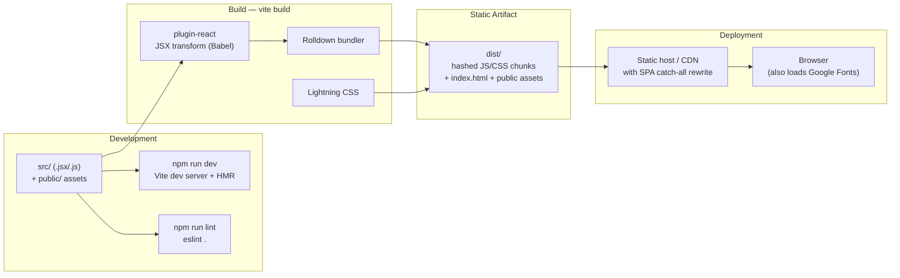
```mermaid
flowchart LR
    subgraph Dev["Development"]
        Src["src/ (.jsx/.js)<br/>+ public/ assets"]
        DevServer["npm run dev<br/>Vite dev server + HMR"]
        Lint["npm run lint<br/>eslint ."]
    end
    subgraph Build["Build — vite build"]
        Babel["plugin-react<br/>JSX transform (Babel)"]
        Rolldown["Rolldown bundler"]
        LightCSS["Lightning CSS"]
    end
    subgraph Artifact["Static Artifact"]
        Dist["dist/<br/>hashed JS/CSS chunks<br/>+ index.html + public assets"]
    end
    subgraph Deploy["Deployment"]
        Host["Static host / CDN<br/>with SPA catch-all rewrite"]
        Browser["Browser<br/>(also loads Google Fonts)"]
    end

    Src --> DevServer
    Src --> Lint
    Src --> Babel
    Babel --> Rolldown
    Rolldown --> Dist
    LightCSS --> Dist
    Dist --> Host
    Host --> Browser
```

## 3.7 References

The following repository artifacts and specification sections were examined as evidence for Section 3. No external web sources were used; all version, license, and configuration facts derive from the repository itself.

**Manifests & configuration files**

- `package.json` — declared npm scripts, 5 runtime + 9 dev dependencies with caret ranges, `type: module`, private/`0.0.0` identity, and the absence of an `engines` field.
- `package-lock.json` — `lockfileVersion: 3`, exact installed versions and MIT licenses, the 172-package graph (162 dev / 10 prod / 32 optional), the transitive build-chain, per-package `engines`, and `fsevents` as the sole install-script package.
- `vite.config.js` — React plugin, `@`→`/src` alias, `build.target: 'esnext'`, `build.outDir: 'dist'`.
- `eslint.config.js` — flat config composing `@eslint/js`, `eslint-plugin-react-hooks`, and `eslint-plugin-react-refresh`; `**/*.{js,jsx}` scope; browser globals; `dist/` ignore.
- `index.html` — SPA document shell, static SEO/Open Graph/Twitter head, Google Fonts `<link>`s (Inter + Poppins), `#root` mount, and `/src/main.jsx` entry.
- `README.md` — declared-vs-installed version table, Node.js 22+ prerequisite, `npm ci` guidance, `npm audit` 0-vulnerabilities result, and the npm script descriptions.
- `.gitignore` — ignored paths (`node_modules`, `dist`, logs, `*.local`, and the `blitzy/` agent-artifacts folder).

**Application source files**

- `src/main.jsx` — `createRoot` + `StrictMode` → `ThemeProvider` → `App` bootstrap.
- `src/App.jsx` — React Router v8 data router (`createBrowserRouter` + `RouterProvider` from `react-router/dom`), the `/` and `*` route table, and `React.lazy` route code-splitting.
- `src/hooks/useTheme.jsx` — the sole persisted state: `localStorage` key `theme`, seeded from `prefers-color-scheme`, applied via `data-theme`.
- `src/hooks/useContactForm.js` — the client-only, intentionally back-endless simulated form submission.
- `src/sections/Contact/ContactInfo.jsx` — the Google Maps `<iframe>` embed and `mailto:`/`tel:` links.
- `src/data/skills.js` — confirmed that "Tailwind CSS", "Bootstrap", "Selenium", "Cypress", and "SQL" are portfolio *content*, not installed dependencies.
- `src/data/socials.js`, `src/data/projects.js` — placeholder outbound social, repository, and demo URLs.
- `src/styles/variables.css` — the CSS-variable design-token catalog and the Inter/Poppins font tokens.
- `src/styles/global.css` — the token-driven reset, typography, and `prefers-reduced-motion` handling.

**Directories**

- `src/` — the application source tree (census: 37 `.jsx`, 50 `.js`, 32 `*.module.css`, 2 global `.css`; 0 TypeScript files).
- `src/hooks/` — 7 custom hooks (6 `.js` plus `useTheme.jsx`).
- `src/data/` — 10 content modules exposed through an `index.js` barrel.
- `src/components/` — 13 UI primitives (`ui/`) and 4 layout components (`layout/`).
- `src/sections/` — the 8 portfolio sections and their subcomponents.
- `src/pages/` — the `Home` and `NotFound` route pages.
- `src/utils/` — the 5 utility modules (constants, scroll, validators, animations, barrel).
- `public/` — static assets served as-is (`favicon.svg`, `og-image.png`, `resume.pdf`, `robots.txt`, `sitemap.xml`, `llms.txt`).
- `dist/` and `dist/assets/` — the `vite build` output, confirming content-hashed, route-split chunks.

**Cross-referenced specification sections**

- 1.2 System Overview — architecture context, integration touchpoints, and the build/lint/audit success signals (446 modules, index chunk ≈91 kB gzipped).
- 2.4 Implementation Considerations — the client-only constraint, JavaScript/JSX-only (no TypeScript) and no-automated-tests constraints, the Node 22+ requirement, and the `rel="noopener noreferrer"` and caching notes.

# 4. Process Flowchart

## 4.1 System Workflows

This section documents the end-to-end runtime workflows of `my-react-app`, the client-side React 19 + Vite 8 portfolio single-page application described in Section 1 and decomposed into features in Section 2. As Section 2.2 states, this Process Flowchart section is the authoritative depiction of the **end-to-end runtime behavior** underlying the functional requirements catalogued there; every workflow below is cross-referenced to its feature identifier (`F-0XX`) and, where relevant, its requirement identifier (`F-0XX-RQ-0YY`).

Because the system is **frontend-only** — it has no backend, application API, database, authentication service, message queue, or server-side batch runtime (Sections 1.2.1 and 2.3.2) — every workflow executes entirely inside the browser tab. "System interactions" are therefore interactions between React components, custom hooks, and browser platform APIs (`localStorage`, `matchMedia`, `IntersectionObserver`, `window.scrollTo`, the History API via React Router, and `createPortal`). All diagrams in Section 4 use Mermaid.js.

### 4.1.1 Actors, System Boundaries, and Scope Constraints

**Actors and participating systems.** The application has a single human actor and a small set of platform participants, all resident in the browser.

| Actor / System | Type | Role in Workflows |
| --- | --- | --- |
| Visitor / Recruiter | Human actor | The sole human actor; drives every workflow via pointer, keyboard, or touch (navigation, theme toggle, form entry, modal, résumé actions) |
| Browser platform | Runtime environment | Executes the bundled JavaScript; provides `localStorage`, `matchMedia`, `IntersectionObserver`, `window.scrollTo`, scroll/resize events, and `document.body` as the modal portal host |
| React 19 runtime | Application runtime | Renders the component tree, manages Context/state, and hosts the React Router v8 data router (`src/main.jsx`, `src/App.jsx`) |
| Static asset host / `public/` | Static delivery | Serves `index.html` and root assets (`resume.pdf`, `og-image.png`, `favicon.svg`, `robots.txt`, `sitemap.xml`) |
| External CDNs / embeds | Third-party (declarative) | Google Fonts CDN (Inter, Poppins) and a placeholder Google Maps `<iframe>`; external hyperlinks to GitHub/demo/social plus `mailto:`/`tel:` targets |

**System boundary.** The application boundary is the browser tab. There is no server-side component within scope; the deployable output is static assets. The only documented hosting integration requirement (deferred per Section 1.3.2 and feature `F-001`) is that a production host must provide an SPA catch-all rewrite to `index.html` so that deep links and the `*` route resolve to the client router.

**Scope constraints (workflows deliberately absent).** To keep the flowcharts honest, the following process categories from the generic prompt are **not present** in this repository and are called out here rather than fabricated:

- No server/API request-response workflows, no database transactions, and no authentication/authorization flows (there is no backend, per Section 2.3.2).
- No message-queue, event-bus, or server-side batch/cron processing. The only "batch" is the build-time Vite pipeline (Section 4.1.4).
- No analytics, telemetry, monitoring, or SLA/KPI instrumentation exists anywhere in the source (Section 1.2.3); consequently the "Timing/SLA" material in Section 4.6 reports only the concrete timing constants observed in code and explicitly notes the absence of formal SLAs.
- The contact-form "submission" is a client-side simulation (no network delivery); the Google Maps embed and external project/social URLs are placeholders (`F-014`, `F-015`).

**Notation legend.** Across Section 4, Mermaid flowcharts use a consistent vocabulary: stadium nodes `([ ... ])` mark start/end points and user touchpoints; rectangles mark process steps; diamonds `{ ... }` mark decision points; hexagons `{{ ... }}` mark event/wait states; and `subgraph` blocks act as swim lanes for distinct actors or subsystems. Error and recovery paths are labeled on their edges.

### 4.1.2 High-Level System Workflow

The following diagram is the master workflow: it traces a visit from URL entry, through the HTML shell and React bootstrap, into route resolution and lazy page loading, and finally into the interactive steady state where feature workflows (Section 4.2) are dispatched in response to user input. Swim lanes separate the human actor, the static HTML shell, and the React runtime.

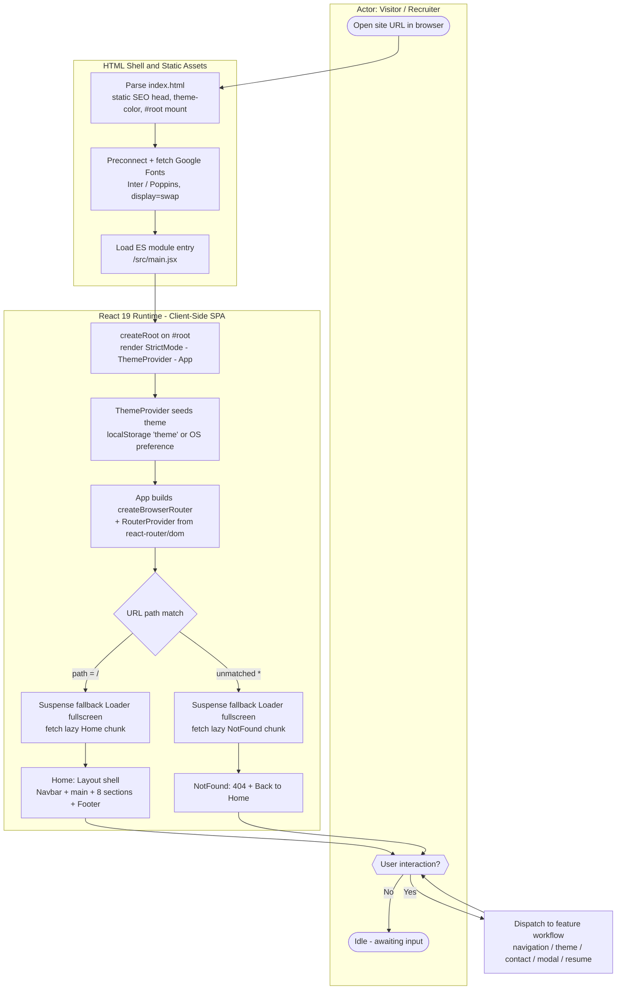
```mermaid
flowchart TD
    subgraph UserLane["Actor: Visitor / Recruiter"]
        U1(["Open site URL in browser"])
        U2{{"User interaction?"}}
        UEnd(["Idle - awaiting input"])
    end

    subgraph ShellLane["HTML Shell and Static Assets"]
        H1["Parse index.html<br/>static SEO head, theme-color, #root mount"]
        H2["Preconnect + fetch Google Fonts<br/>Inter / Poppins, display=swap"]
        H3["Load ES module entry<br/>/src/main.jsx"]
    end

    subgraph RuntimeLane["React 19 Runtime - Client-Side SPA"]
        R1["createRoot on #root<br/>render StrictMode - ThemeProvider - App"]
        R2["ThemeProvider seeds theme<br/>localStorage 'theme' or OS preference"]
        R3["App builds createBrowserRouter<br/>+ RouterProvider from react-router/dom"]
        R4{"URL path match"}
        R5["Suspense fallback Loader fullscreen<br/>fetch lazy Home chunk"]
        R6["Suspense fallback Loader fullscreen<br/>fetch lazy NotFound chunk"]
        R7["Home: Layout shell<br/>Navbar + main + 8 sections + Footer"]
        R8["NotFound: 404 + Back to Home"]
    end

    U1 --> H1 --> H2 --> H3 --> R1 --> R2 --> R3 --> R4
    R4 -->|"path = /"| R5 --> R7 --> U2
    R4 -->|"unmatched *"| R6 --> R8 --> U2
    U2 -->|"Yes"| INT["Dispatch to feature workflow<br/>navigation / theme / contact / modal / resume"]
    U2 -->|"No"| UEnd
    INT --> U2
```

Key characteristics: the router is built once at module scope from a static route table (no route loaders, no `HydrateFallback`), so it initializes synchronously and the very first paint that requires the `Home` chunk is covered by the full-screen `Loader` (`F-001-RQ-003`). The `ThemeProvider` wraps the router so the `data-theme` attribute is established on the document element app-wide before any section paints (`F-004-RQ-004`).

### 4.1.3 Core Process Inventory

The interactive steady state is not a single process but a set of independent, event-driven workflows. The table below inventories every core process, its trigger, its principal modules, and its feature/requirement traceability. Detailed flowcharts follow in Section 4.2; state, error, and validation aspects are elaborated in Sections 4.4–4.6.

| # | Process | Trigger | Principal Modules | Traceability |
| --- | --- | --- | --- | --- |
| 1 | Application bootstrap & theme seeding | Page load | `src/main.jsx`, `src/hooks/useTheme.jsx` | F-001, F-004 |
| 2 | Route resolution & lazy page loading | Initial load / navigation | `src/App.jsx`, `src/components/ui/Loader` | F-001 |
| 3 | Single-page composition & data-driven rendering | `Home` mount | `src/pages/Home`, `src/sections/*`, `src/data/` | F-002, F-016 |
| 4 | Sticky nav, in-page smooth scroll & scroll-spy | Nav-link click / scroll | `src/components/layout/Navbar`, `src/hooks/useActiveSection.js`, `src/utils/scroll.js` | F-003 |
| 5 | Mobile menu open/close | Hamburger / Escape / resize | `src/components/layout/Navbar` | F-003-RQ-004 |
| 6 | Theme toggle & persistence | `ThemeToggle` activation | `src/hooks/useTheme.jsx`, `src/components/ui/ThemeToggle` | F-004 |
| 7 | Scroll-reveal & back-to-top | Viewport intersection / scroll | `src/components/ui/Reveal`, `src/components/ui/BackToTop`, `src/hooks/useScrollToTop.js` | F-005 |
| 8 | Hero typewriter & call-to-action | Mount / CTA click | `src/sections/Hero`, `src/hooks/useTypewriter.js` | F-007 |
| 9 | Project browse & accessible modal | Card "Details" / Escape / scrim | `src/sections/Projects`, `src/components/ui/Modal` | F-010 |
| 10 | Contact form validation & submission | Input / blur / submit | `src/hooks/useContactForm.js`, `src/utils/validators.js` | F-014 |
| 11 | Résumé download / view | Button (anchor) click | `src/sections/Resume`, `src/data/siteMeta.js` | F-013 |
| 12 | External contact / social navigation | Link click | `src/sections/Contact/ContactInfo.jsx`, `src/components/ui/SocialLinks` | F-015 |

### 4.1.4 Integration Workflows

Consistent with Section 2.3.2, the application's only integrations are browser-platform touchpoints, static assets, and two placeholder external embeds. This subsection maps each of the prompt's integration-workflow categories to what actually exists.

#### 4.1.4.1 Data Flow Between Systems

There is no inter-system data exchange over a network at runtime. "Data flow" is the compile-time and render-time binding of static content into the component tree. All display copy and lists live in ten ES modules under `src/data/` (`navLinks`, `hero`, `about`, `skills`, `projects`, `experience`, `services`, `socials`, `siteMeta`) exposed through the `src/data/index.js` barrel with named exports only (`F-016`). Sections and layout chrome import their own data slice directly; there is no reducer, store, or fetch layer. Image references in `hero`/`projects` are resolved by the Vite asset pipeline at build time, whereas `siteMeta.resumeUrl` (`/resume.pdf`) is a plain public-folder runtime path rather than a bundler import, so it stays valid before the asset is finalized.

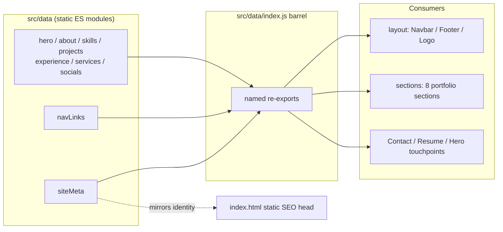
```mermaid
flowchart LR
    subgraph DataLayer["src/data (static ES modules)"]
        D1["siteMeta"]
        D2["navLinks"]
        D3["hero / about / skills / projects<br/>experience / services / socials"]
    end
    subgraph Barrel["src/data/index.js barrel"]
        B1["named re-exports"]
    end
    subgraph Consumers["Consumers"]
        C1["layout: Navbar / Footer / Logo"]
        C2["sections: 8 portfolio sections"]
        C3["Contact / Resume / Hero touchpoints"]
    end
    D1 --> B1
    D2 --> B1
    D3 --> B1
    B1 --> C1
    B1 --> C2
    B1 --> C3
    D1 -. "mirrors identity" .-> HTML["index.html static SEO head"]
```

#### 4.1.4.2 API Interactions

No application or third-party network API is called from code — there is no `fetch`, `XMLHttpRequest`, or SDK client anywhere in `src/`. The "interfaces" the app integrates with are browser platform APIs and declarative external resources:

- **Browser APIs:** `localStorage` (theme persistence, `F-004`), `matchMedia` (mobile breakpoint, OS color scheme, reduced motion — `F-003`/`F-004`/`F-005`/`F-018`), `IntersectionObserver` (scroll-spy and `whileInView` reveals — `F-003`/`F-005`), `window.scrollTo` and scroll events (`F-003`/`F-005`), and `react-dom` `createPortal` (modal into `document.body`, `F-010`).
- **Declarative external resources:** Google Fonts stylesheet loaded via `index.html` preconnect + `display=swap` (`F-006`); a lazy-loaded Google Maps `<iframe>` placeholder (`F-015`); and external navigations opened as safe links (`target="_blank"` with `rel="noopener noreferrer"`) for project GitHub/demo, social profiles, `mailto:`, and `tel:` targets.

#### 4.1.4.3 Event Processing Flows

At runtime the application is a set of event-driven handlers that translate DOM/browser events into React state updates, which trigger re-renders and idempotent side effects. The diagram summarizes the event-to-state pipeline that underpins every interactive feature.

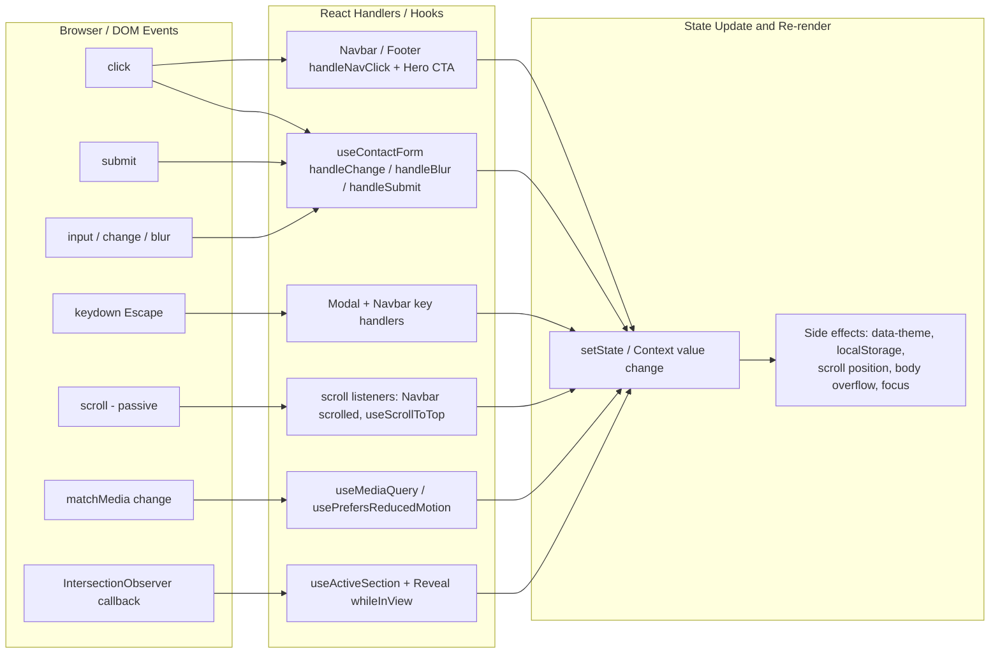
```mermaid
flowchart LR
    subgraph Events["Browser / DOM Events"]
        E1["click"]
        E2["submit"]
        E3["input / change / blur"]
        E4["keydown Escape"]
        E5["scroll - passive"]
        E6["matchMedia change"]
        E7["IntersectionObserver callback"]
    end
    subgraph Handlers["React Handlers / Hooks"]
        HN["Navbar / Footer handleNavClick + Hero CTA"]
        HF["useContactForm handleChange / handleBlur / handleSubmit"]
        HM["Modal + Navbar key handlers"]
        HS["scroll listeners: Navbar scrolled, useScrollToTop"]
        HQ["useMediaQuery / usePrefersReducedMotion"]
        HA["useActiveSection + Reveal whileInView"]
    end
    subgraph Update["State Update and Re-render"]
        S1["setState / Context value change"]
        S2["Side effects: data-theme, localStorage,<br/>scroll position, body overflow, focus"]
    end
    E1 --> HN
    E1 --> HF
    E2 --> HF
    E3 --> HF
    E4 --> HM
    E5 --> HS
    E6 --> HQ
    E7 --> HA
    HN --> S1
    HF --> S1
    HM --> S1
    HS --> S1
    HQ --> S1
    HA --> S1
    S1 --> S2
```

#### 4.1.4.4 Batch Processing Sequences

No runtime batch processing exists. The only batch-style sequence in the project is the **build-time toolchain**: `npm run build` invokes `vite build`, which transforms the module graph and emits code-split chunks to `dist/` (Section 1.2.3 records a successful build of 446 modules with per-route chunks). `npm run lint` (`eslint .` with a zero-warning contract) is the complementary static-analysis batch. These are developer/CI operations, not user-facing runtime workflows, and are documented in Section 3.6 (Development & Deployment).

## 4.2 Core Business Process Flows

This section provides a detailed Mermaid flowchart for each core, user-facing workflow identified in Section 4.1.3. Every flow shows its start/end points, process steps, decision diamonds, subsystem boundaries (swim lanes where multiple actors participate), user touchpoints, and — where present in code — error states, recovery paths, and timing constants. Validation rules, state transitions, and error handling are cross-referenced to Sections 4.4–4.6.

### 4.2.1 Application Bootstrap & Initialization

On page load, `src/main.jsx` creates the React root and renders the fixed provider chain `StrictMode → ThemeProvider → App`. The `ThemeProvider` resolves the initial theme once via a lazy `useState` initializer before the router mounts, guaranteeing the `data-theme` attribute is set on the document element before any section paints (`F-001`, `F-004-RQ-003/RQ-004`).

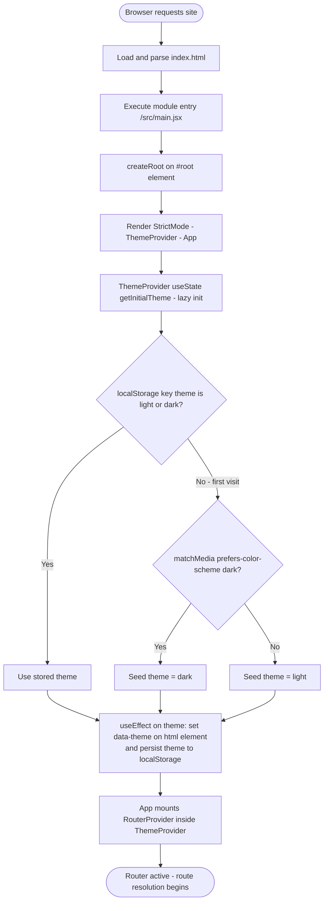
```mermaid
flowchart TD
    A(["Browser requests site"]) --> B["Load and parse index.html"]
    B --> C["Execute module entry /src/main.jsx"]
    C --> D["createRoot on #root element"]
    D --> E["Render StrictMode - ThemeProvider - App"]
    E --> F["ThemeProvider useState getInitialTheme - lazy init"]
    F --> G{"localStorage key theme is light or dark?"}
    G -->|"Yes"| H["Use stored theme"]
    G -->|"No - first visit"| I{"matchMedia prefers-color-scheme dark?"}
    I -->|"Yes"| J["Seed theme = dark"]
    I -->|"No"| K["Seed theme = light"]
    H --> L["useEffect on theme: set data-theme on html element<br/>and persist theme to localStorage"]
    J --> L
    K --> L
    L --> M["App mounts RouterProvider inside ThemeProvider"]
    M --> N(["Router active - route resolution begins"])
```

Under React `StrictMode` the theme effect is intentionally idempotent (it writes the same attribute and `localStorage` value), so the development double-invoke is harmless. There is no pre-hydration inline theme script in `index.html`; the `data-theme` attribute is applied by the mount-time effect.

### 4.2.2 Client-Side Route Resolution & Lazy Page Loading

`src/App.jsx` uses React Router v8's data-router pairing (`createBrowserRouter` + `RouterProvider` from `react-router/dom`). The route table is static with exactly two entries — `/` (Home) and `*` (NotFound) — each code-split with `React.lazy` and wrapped in a `<Suspense>` whose fallback is the eagerly imported full-screen `<Loader>` (`F-001-RQ-001/002/003`). The NotFound page provides the sole recovery path: a "Back to Home" `Link` to `/`.

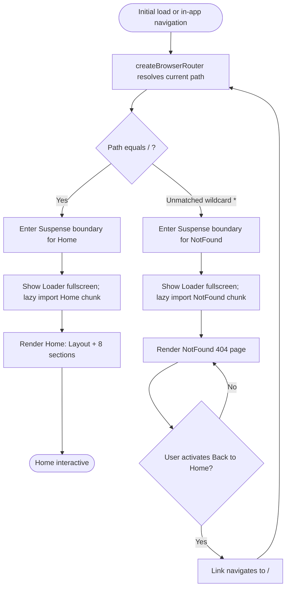
```mermaid
flowchart TD
    A(["Initial load or in-app navigation"]) --> B["createBrowserRouter resolves current path"]
    B --> C{"Path equals / ?"}
    C -->|"Yes"| D["Enter Suspense boundary for Home"]
    C -->|"Unmatched wildcard *"| E["Enter Suspense boundary for NotFound"]
    D --> F["Show Loader fullscreen; lazy import Home chunk"]
    E --> G["Show Loader fullscreen; lazy import NotFound chunk"]
    F --> H["Render Home: Layout + 8 sections"]
    G --> I["Render NotFound 404 page"]
    H --> J(["Home interactive"])
    I --> K{"User activates Back to Home?"}
    K -->|"Yes"| L["Link navigates to /"]
    L --> B
    K -->|"No"| I
```

Because the route table has no route loaders and no `HydrateFallback`, the router initializes synchronously; the only asynchronous step is fetching the per-route chunk, during which the `Loader` is shown. The failure behavior of a rejected chunk fetch (there is no error boundary) is documented in Section 4.5.2.

### 4.2.3 In-Page Section Navigation & Scroll-Spy

Clicking a `Navbar` link, the `Logo`, or a `Footer` quick link invokes `handleNavClick`, which cancels the default anchor jump and calls `scrollToId` (`src/utils/scroll.js`). That helper scrolls the target section to the top offset by `NAV_HEIGHT` (72px) and honors reduced motion by switching between `smooth` and `auto` (instant). Independently, `useActiveSection` runs an `IntersectionObserver` (center band, `rootMargin: -45% 0px -45% 0px`) that sets the active link and its `aria-current="page"` (`F-003-RQ-002/RQ-003`). Swim lanes below separate the actor, the nav components, the scroll utility, and the scroll-spy observer.

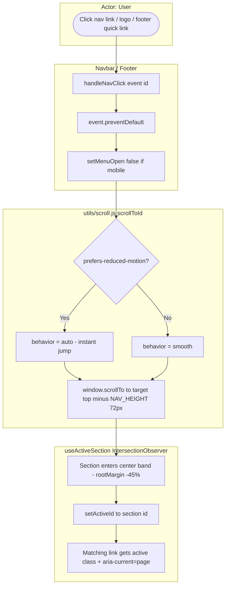
```mermaid
flowchart TD
    subgraph User["Actor: User"]
        A(["Click nav link / logo / footer quick link"])
    end
    subgraph NavLane["Navbar / Footer"]
        B["handleNavClick event id"]
        C["event.preventDefault"]
        D["setMenuOpen false if mobile"]
    end
    subgraph ScrollLane["utils/scroll.js scrollToId"]
        E{"prefers-reduced-motion?"}
        F["behavior = auto - instant jump"]
        G["behavior = smooth"]
        H["window.scrollTo to target top minus NAV_HEIGHT 72px"]
    end
    subgraph SpyLane["useActiveSection IntersectionObserver"]
        I["Section enters center band - rootMargin -45%"]
        J["setActiveId to section id"]
        K["Matching link gets active class + aria-current=page"]
    end
    A --> B --> C --> D --> E
    E -->|"Yes"| F --> H
    E -->|"No"| G --> H
    H --> I --> J --> K
```

A passive `scroll` listener in the `Navbar` toggles a "scrolled" style once `window.scrollY` exceeds `SCROLL_THRESHOLD` (8px). Section anchor ids originate solely from `src/data/navLinks.js`, keeping the nav links, the observed ids, and the rendered `<section id>` elements in sync.

### 4.2.4 Mobile Menu Disclosure

Below 1024px (`useMediaQuery('(max-width: 1023.98px)')`, the exact JS complement of the CSS `min-width: 1024px` rule), the desktop link row collapses into a hamburger disclosure. Visibility is derived as `mobileMenuOpen = isMobile && menuOpen`, so the menu can never linger on desktop after a resize. Pressing Escape closes the menu and returns focus to the hamburger button (`F-003-RQ-004`).

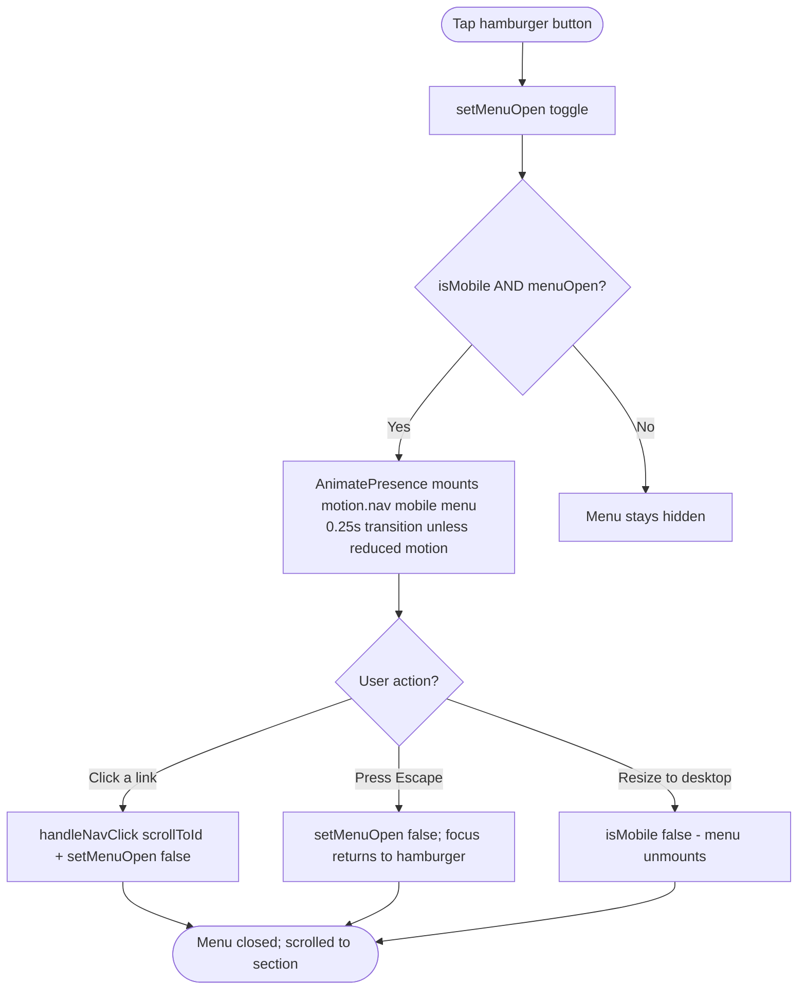
```mermaid
flowchart TD
    A(["Tap hamburger button"]) --> B["setMenuOpen toggle"]
    B --> C{"isMobile AND menuOpen?"}
    C -->|"Yes"| D["AnimatePresence mounts motion.nav mobile menu<br/>0.25s transition unless reduced motion"]
    C -->|"No"| E["Menu stays hidden"]
    D --> F{"User action?"}
    F -->|"Click a link"| G["handleNavClick scrollToId + setMenuOpen false"]
    F -->|"Press Escape"| H["setMenuOpen false; focus returns to hamburger"]
    F -->|"Resize to desktop"| I["isMobile false - menu unmounts"]
    G --> J(["Menu closed; scrolled to section"])
    H --> J
    I --> J
```

### 4.2.5 Theme Selection & Persistence

Activating the `ThemeToggle` calls `toggleTheme` from the `useTheme` context, flipping the theme. The single theme effect then mirrors the value onto `data-theme` on the document element and persists it under the `localStorage` key `theme`; the CSS token layer (`[data-theme="dark"]` in `variables.css`) re-resolves and the UI recolors app-wide (`F-004-RQ-001/002/004`).

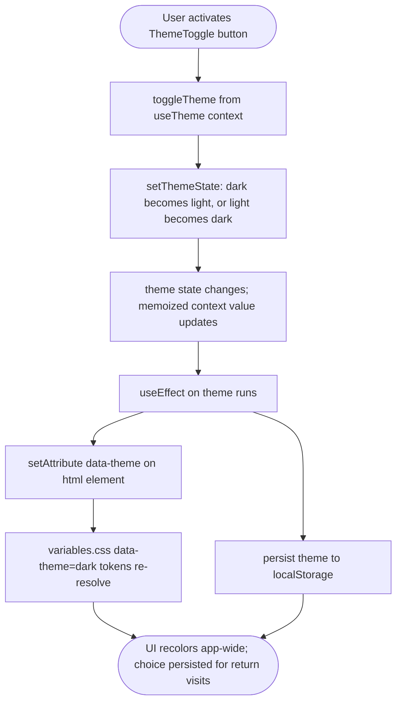
```mermaid
flowchart TD
    A(["User activates ThemeToggle button"]) --> B["toggleTheme from useTheme context"]
    B --> C["setThemeState: dark becomes light, or light becomes dark"]
    C --> D["theme state changes; memoized context value updates"]
    D --> E["useEffect on theme runs"]
    E --> F["setAttribute data-theme on html element"]
    E --> G["persist theme to localStorage"]
    F --> H["variables.css data-theme=dark tokens re-resolve"]
    H --> I(["UI recolors app-wide; choice persisted for return visits"])
    G --> I
```

An explicit user choice always wins on subsequent loads because the OS preference is only consulted by `getInitialTheme` when no valid stored value exists (Section 4.2.1).

### 4.2.6 Validated Contact Form Submission

The Contact form is a controlled, touched-gated state machine (`src/hooks/useContactForm.js`) backed by pure validators (`src/utils/validators.js`). Errors are derived from values with `useMemo` (never stored), surfaced only after a field is blurred or a submit is attempted. On submit, all fields are marked touched; an invalid form sets `status = 'error'` and blocks; a valid form runs a 1200 ms simulated asynchronous submit and resolves to `success` (resetting the fields) or `error` (`F-014-RQ-001/002/003/004`). Swim lanes separate the user, the presentational view, the hook state machine, and the validators.

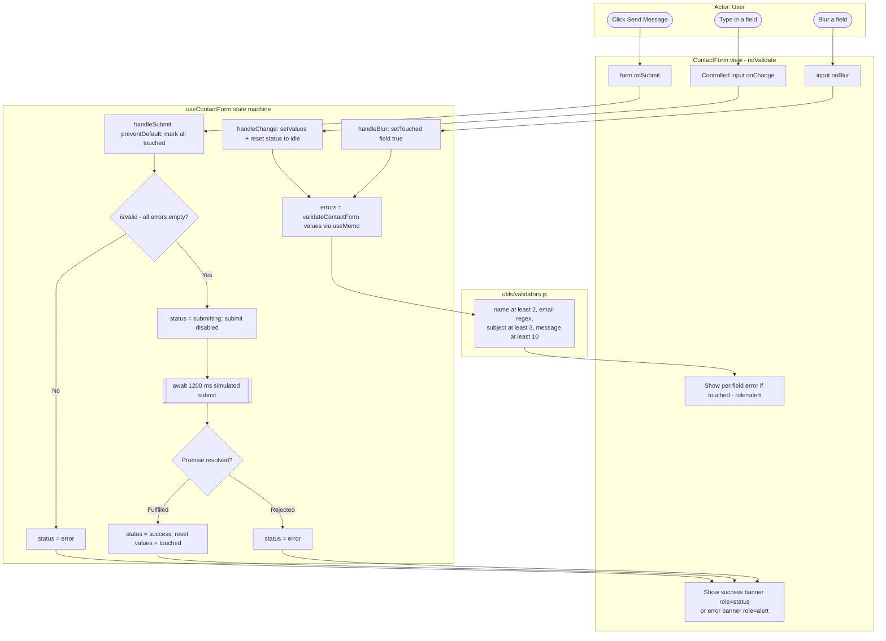
```mermaid
flowchart TD
    subgraph U["Actor: User"]
        A(["Type in a field"])
        A2(["Blur a field"])
        A3(["Click Send Message"])
    end
    subgraph View["ContactForm view - noValidate"]
        B["Controlled input onChange"]
        B2["input onBlur"]
        B3["form onSubmit"]
        V["Show per-field error if touched - role=alert"]
        VB["Show success banner role=status<br/>or error banner role=alert"]
    end
    subgraph Hook["useContactForm state machine"]
        C["handleChange: setValues + reset status to idle"]
        C2["handleBlur: setTouched field true"]
        C3["handleSubmit: preventDefault; mark all touched"]
        D["errors = validateContactForm values via useMemo"]
        E{"isValid - all errors empty?"}
        F["status = error"]
        G["status = submitting; submit disabled"]
        H[["await 1200 ms simulated submit"]]
        I{"Promise resolved?"}
        J["status = success; reset values + touched"]
        K["status = error"]
    end
    subgraph Val["utils/validators.js"]
        DV["name at least 2, email regex,<br/>subject at least 3, message at least 10"]
    end
    A --> B --> C --> D
    A2 --> B2 --> C2 --> D
    D --> DV --> V
    A3 --> B3 --> C3 --> E
    E -->|"No"| F --> VB
    E -->|"Yes"| G --> H --> I
    I -->|"Fulfilled"| J --> VB
    I -->|"Rejected"| K --> VB
```

The submit control is disabled whenever the form is invalid or `status === 'submitting'`, and typing in any field clears a prior success/error banner back to `idle`. No message is transmitted — delivery is out of scope (Section 1.3.2). The detailed validation rules appear in Section 4.6.1 and the full status state machine in Section 4.4.2.

### 4.2.7 Project Browsing & Accessible Modal

The `Projects` section owns a single `selected` state (null = closed); a card's "Details" button sets it, and the `ProjectModal` is open when `selected !== null` (`F-010-RQ-002`). The shared `Modal` primitive renders through `createPortal` into `document.body`, saves the previously focused element, locks body scroll, moves focus into the dialog, and installs a Tab/Shift+Tab focus trap plus Escape/scrim/close dismissal; its cleanup restores scroll and focus (`F-010-RQ-003`).

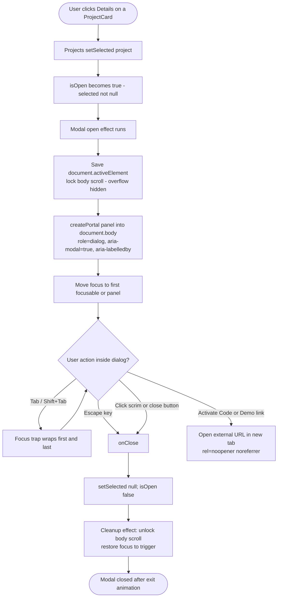
```mermaid
flowchart TD
    A(["User clicks Details on a ProjectCard"]) --> B["Projects setSelected project"]
    B --> C["isOpen becomes true - selected not null"]
    C --> D["Modal open effect runs"]
    D --> E["Save document.activeElement<br/>lock body scroll - overflow hidden"]
    E --> F["createPortal panel into document.body<br/>role=dialog, aria-modal=true, aria-labelledby"]
    F --> G["Move focus to first focusable or panel"]
    G --> H{"User action inside dialog?"}
    H -->|"Tab / Shift+Tab"| I["Focus trap wraps first and last"]
    I --> H
    H -->|"Escape key"| J["onClose"]
    H -->|"Click scrim or close button"| J
    H -->|"Activate Code or Demo link"| X["Open external URL in new tab<br/>rel=noopener noreferrer"]
    J --> K["setSelected null; isOpen false"]
    K --> L["Cleanup effect: unlock body scroll<br/>restore focus to trigger"]
    L --> M(["Modal closed after exit animation"])
```

The `ProjectModal` is kept mounted (never early-returned) so its `AnimatePresence` exit animation can play with the last-selected content still visible; the body is guarded so no fields are read while `project` is null.

### 4.2.8 Résumé Access & Hero Call-to-Action

Both the Hero and the Resume section drive the primary recruiter conversions. Download and View are semantic anchors targeting `siteMeta.resumeUrl` (`/resume.pdf`, served from `public/`); the Hero's outline "Hire Me" CTA is an in-page anchor that `handleCtaClick` intercepts to smooth-scroll to `#contact` (`F-007-RQ-003`, `F-013-RQ-001/RQ-002`).

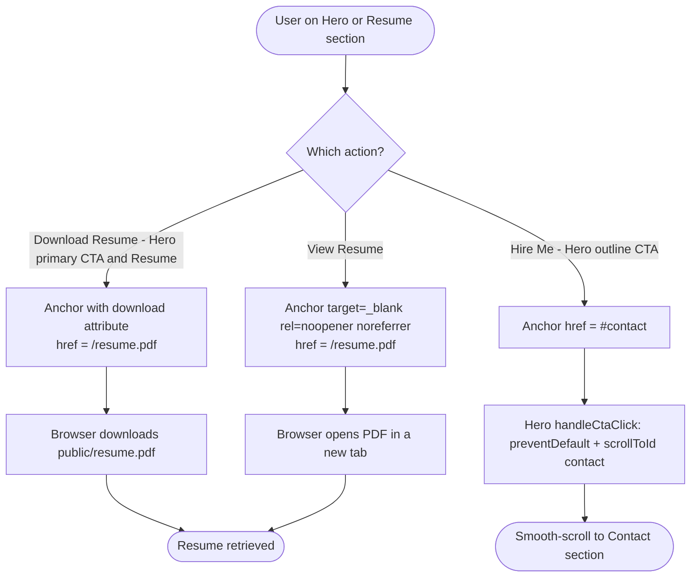
```mermaid
flowchart TD
    A(["User on Hero or Resume section"]) --> B{"Which action?"}
    B -->|"Download Resume - Hero primary CTA and Resume"| C["Anchor with download attribute<br/>href = /resume.pdf"]
    B -->|"View Resume"| D["Anchor target=_blank rel=noopener noreferrer<br/>href = /resume.pdf"]
    B -->|"Hire Me - Hero outline CTA"| E["Anchor href = #contact"]
    C --> F["Browser downloads public/resume.pdf"]
    D --> G["Browser opens PDF in a new tab"]
    E --> H["Hero handleCtaClick: preventDefault + scrollToId contact"]
    H --> I(["Smooth-scroll to Contact section"])
    F --> J(["Resume retrieved"])
    G --> J
```

The Hero CTA handler only intercepts hash targets; a non-hash href (such as the résumé download) is allowed to proceed with default browser navigation.

## 4.3 Integration and Event Workflows

This subsection reframes the core processes of Section 4.2 as **integration sequences** — showing the ordered exchange of messages between UI components, custom hooks, and the browser platform over time. Because the application is a **frontend-only single-page application with no backend, API, database, message queue, or third-party runtime service** (established in Sections 4.1.1 and 4.1.4), every "integration" here is an *in-browser* integration between application code and a browser-provided capability (the DOM, `localStorage`, `matchMedia`, `IntersectionObserver`, `history`, and the module loader). No sequence in this application crosses a network boundary at runtime except the browser's own fetch of code-split JavaScript chunks and static assets served from the same origin. Feature traceability follows the catalog IDs used throughout Section 4 (`F-001` Routing/Lazy-Loading, `F-004` Theming, `F-010` Projects/Modal, `F-014` Contact Form).

### 4.3.1 Application Load and First-Render Sequence

This sequence documents the integration between the static HTML document, the module entry point, the theme provider, and the router as the application boots and renders its first interactive frame (`F-001`, `F-004`; source: `index.html`, `src/main.jsx`, `src/App.jsx`, `src/hooks/useTheme.jsx`). The `Loader` is imported eagerly so it is always available to display while the lazily-imported `Home` chunk is fetched.

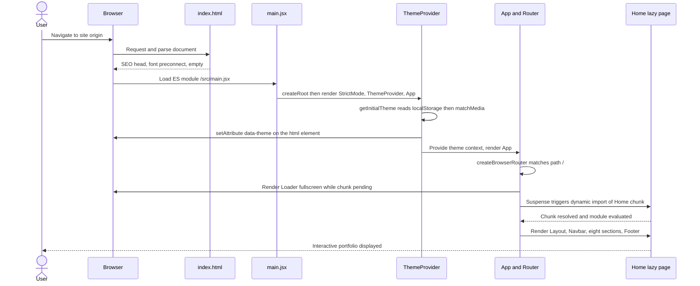
```mermaid
sequenceDiagram
    actor User
    participant Browser
    participant HTML as index.html
    participant Main as main.jsx
    participant Theme as ThemeProvider
    participant App as App and Router
    participant Home as Home lazy page
    User->>Browser: Navigate to site origin
    Browser->>HTML: Request and parse document
    HTML-->>Browser: SEO head, font preconnect, empty #root
    Browser->>Main: Load ES module /src/main.jsx
    Main->>Theme: createRoot then render StrictMode, ThemeProvider, App
    Theme->>Theme: getInitialTheme reads localStorage then matchMedia
    Theme->>Browser: setAttribute data-theme on the html element
    Theme->>App: Provide theme context, render App
    App->>App: createBrowserRouter matches path /
    App->>Browser: Render Loader fullscreen while chunk pending
    App->>Home: Suspense triggers dynamic import of Home chunk
    Home-->>App: Chunk resolved and module evaluated
    App->>Home: Render Layout, Navbar, eight sections, Footer
    Home-->>User: Interactive portfolio displayed
```

The theme attribute is applied by a React effect **after** mount (there is no inline pre-hydration theme script in `index.html`), which is why the `data-theme` write appears in the sequence only after `ThemeProvider` has resolved the initial value. Route matching is synchronous — `createBrowserRouter` has no route `loader` functions and no `HydrateFallback` — so the only asynchronous gap in first render is the dynamic `import()` of the page chunk, bridged visually by the `Loader` fallback.

### 4.3.2 Theme Toggle Integration Sequence

The theme feature integrates a UI control, React Context, a synchronizing effect, the document root element, and the `localStorage` persistence layer (`F-004`; source: `src/hooks/useTheme.jsx`, `src/components/ui/ThemeToggle/`, `src/styles/variables.css`). The visual recolor is achieved entirely through CSS custom-property cascade: flipping the `data-theme` attribute causes the `[data-theme="dark"]` override block in `variables.css` to re-resolve every token.

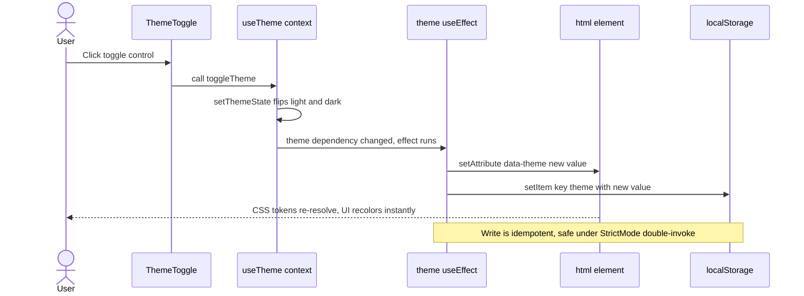
```mermaid
sequenceDiagram
    actor User
    participant Toggle as ThemeToggle
    participant Ctx as useTheme context
    participant Effect as theme useEffect
    participant DOM as html element
    participant LS as localStorage
    User->>Toggle: Click toggle control
    Toggle->>Ctx: call toggleTheme
    Ctx->>Ctx: setThemeState flips light and dark
    Ctx->>Effect: theme dependency changed, effect runs
    Effect->>DOM: setAttribute data-theme new value
    Effect->>LS: setItem key theme with new value
    DOM-->>User: CSS tokens re-resolve, UI recolors instantly
    Note over Effect,LS: Write is idempotent, safe under StrictMode double-invoke
```

### 4.3.3 Contact Form Submission Sequence

The contact form integrates the presentational component, the `useContactForm` state hook, the pure `validators` module, and a **simulated** asynchronous submission timer (`F-014`; source: `src/sections/Contact/ContactForm.jsx`, `src/hooks/useContactForm.js`, `src/utils/validators.js`). There is no network request and no external form service; the `setTimeout(1200 ms)` promise stands in for a backend round-trip that does not exist in this repository. The full status state machine is documented in Section 4.4.2 and the field rules in Section 4.6.1.

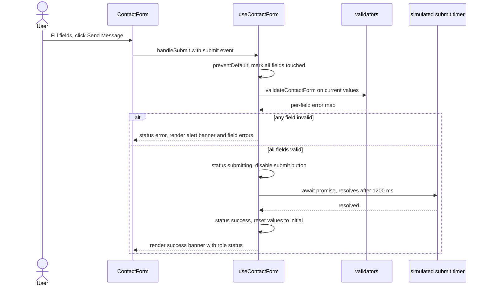
```mermaid
sequenceDiagram
    actor User
    participant Form as ContactForm
    participant Hook as useContactForm
    participant Val as validators
    participant Timer as simulated submit timer
    User->>Form: Fill fields, click Send Message
    Form->>Hook: handleSubmit with submit event
    Hook->>Hook: preventDefault, mark all fields touched
    Hook->>Val: validateContactForm on current values
    Val-->>Hook: per-field error map
    alt any field invalid
        Hook-->>Form: status error, render alert banner and field errors
    else all fields valid
        Hook->>Hook: status submitting, disable submit button
        Hook->>Timer: await promise, resolves after 1200 ms
        Timer-->>Hook: resolved
        Hook->>Hook: status success, reset values to initial
        Hook-->>Form: render success banner with role status
    end
```

### 4.3.4 Project Modal Open and Close Sequence

The project modal integrates a project card, the `Projects` section's selection state, the `Modal` primitive, and the `document.body` scroll-lock / focus-management side effects (`F-010`; source: `src/sections/Projects/Projects.jsx`, `src/components/ui/Modal/Modal.jsx`). The `Modal` renders through `createPortal` into `document.body` and performs a focus-trap around its dialog panel; on close it reverses every side effect (restores scroll and returns focus to the previously-active element).

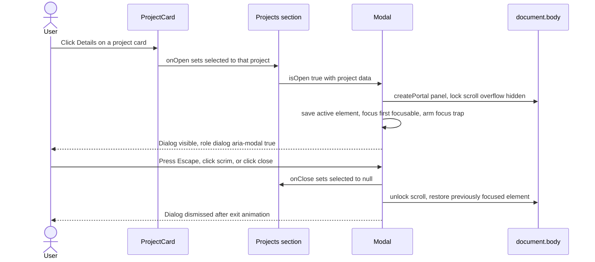
```mermaid
sequenceDiagram
    actor User
    participant Card as ProjectCard
    participant Projects as Projects section
    participant Modal
    participant Body as document.body
    User->>Card: Click Details on a project card
    Card->>Projects: onOpen sets selected to that project
    Projects->>Modal: isOpen true with project data
    Modal->>Body: createPortal panel, lock scroll overflow hidden
    Modal->>Modal: save active element, focus first focusable, arm focus trap
    Modal-->>User: Dialog visible, role dialog aria-modal true
    User->>Modal: Press Escape, click scrim, or click close
    Modal->>Projects: onClose sets selected to null
    Modal->>Body: unlock scroll, restore previously focused element
    Modal-->>User: Dialog dismissed after exit animation
```

### 4.3.5 Event Processing Integration

Beyond the discrete sequences above, the application continuously integrates with three **browser event sources** while idle. These are subscription-based integrations (register on mount, unsubscribe on unmount) rather than request/response exchanges:

| Event source | Consumer | Integration behavior | Feature |
|---|---|---|---|
| `IntersectionObserver` (viewport) | `useActiveSection` | Observes each section element; updates the active nav id as sections cross the `-45%` center band; disconnects on cleanup | `F-003` |
| `scroll` event (window) | `Navbar`, `useScrollToTop` | Sets the condensed navbar style past an 8px threshold; toggles the Back-to-Top control past a 400px threshold | `F-003` |
| `matchMedia` change | `useMediaQuery`, `usePrefersReducedMotion` | React 19 `useSyncExternalStore` subscribes to breakpoint and reduced-motion changes; re-renders dependent components on change | `F-005` |
| `keydown` (Escape / Tab) | `Modal`, `Navbar` | Escape closes the dialog or mobile menu; Tab / Shift+Tab is intercepted for the modal focus trap | `F-010`, `F-003` |

Each subscription is registered inside a `useEffect` and torn down in that effect's cleanup function, so no listener outlives the component that owns it — the integration lifecycle is bounded by component mount/unmount.


## 4.4 State Management and Transitions

The application uses **React's built-in state model exclusively** — there is no Redux, Zustand, MobX, or other external state library, and no server-synchronized cache (source: absence in `package.json`; confirmed across `src/`). State is organized into exactly two tiers:

- **One shared context** — theme (`light`/`dark`), provided by `ThemeProvider` in `src/hooks/useTheme.jsx` and consumed anywhere via `useTheme()`.
- **Local component state** — everything else is co-located with the component that owns it via `useState`/`useMemo`/`useRef`: the active section id (`useActiveSection`), the mobile menu open flag (`Navbar`), the selected project (`Projects`), the Back-to-Top visibility (`useScrollToTop`), and the contact form's values/touched/status (`useContactForm`).

The only state that **persists across sessions** is the theme preference (written to `localStorage`). All other state is ephemeral and resets on reload. The subsections below give the transition diagrams for each stateful concern.

### 4.4.1 Theme State Transitions

Theme is a two-value state (`light` / `dark`) seeded once on mount by `getInitialTheme()` and thereafter driven by user action (`F-004`; source: `src/hooks/useTheme.jsx`). Seeding precedence is: a valid stored value wins; otherwise the OS `prefers-color-scheme` media query seeds the first-run value. A `useEffect` keyed on `theme` synchronizes both the DOM (`data-theme` attribute) and persistence (`localStorage`) on every transition; `setTheme` ignores any value that is not `'light'` or `'dark'`.

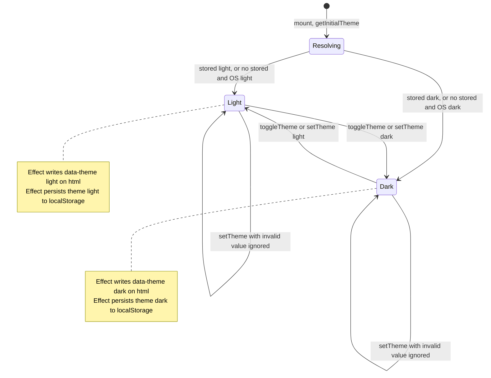
```mermaid
stateDiagram-v2
    [*] --> Resolving: mount, getInitialTheme
    Resolving --> Light: stored light, or no stored and OS light
    Resolving --> Dark: stored dark, or no stored and OS dark
    Light --> Dark: toggleTheme or setTheme dark
    Dark --> Light: toggleTheme or setTheme light
    Light --> Light: setTheme with invalid value ignored
    Dark --> Dark: setTheme with invalid value ignored
    note right of Light
        Effect writes data-theme light on html
        Effect persists theme light to localStorage
    end note
    note right of Dark
        Effect writes data-theme dark on html
        Effect persists theme dark to localStorage
    end note
```

### 4.4.2 Contact Form Status State Machine

The contact form's submission lifecycle is modeled by a four-value status enum — `'idle'`, `'submitting'`, `'success'`, `'error'` — held in `useContactForm.js` (`F-014`; source: `src/hooks/useContactForm.js`, `src/utils/validators.js`). This is the state machine forward-referenced from Section 4.2.6. Field-level validity (`isValid`) is derived continuously via `useMemo` over `validateContactForm(values)` and is *separate* from this status; the status enum tracks only the banner/submission phase. The defining transitions:

- **Submit while invalid** → `error` (a `role="alert"` banner appears; per-field messages become visible because `handleSubmit` marks all fields touched).
- **Submit while valid** → `submitting` (submit button disabled), then after the simulated 1200 ms promise resolves → `success` (values reset to initial, `role="status"` banner) or, if the promise rejects, the `catch` branch → `error`.
- **Any field edit** (`handleChange`) resets the banner back to `idle`, so both `success` and `error` are transient and cleared the moment the user resumes typing.

```mermaid
stateDiagram-v2
    [*] --> idle
    idle --> idle: edit field, validate touched-gated
    idle --> submitting: submit while valid
    idle --> error: submit while invalid
    submitting --> success: promise resolves after 1200 ms
    submitting --> error: promise rejects, catch branch
    error --> idle: user edits any field
    success --> idle: user edits any field
    note right of submitting
        Submit button disabled while submitting
        No network call, timer is simulated
    end note
    note right of success
        Values reset to INITIAL_VALUES
        Banner has role status
    end note
```

### 4.4.3 Modal and Mobile Menu Open/Close States

Two disclosure surfaces share the same open/closed shape but are governed by different state expressions. The **project modal** is open exactly when `Projects.selected !== null` — a single selection slot enforces the business rule that at most one modal is open at a time (`F-010`; source: `src/sections/Projects/Projects.jsx`, `src/components/ui/Modal/Modal.jsx`). The **mobile menu** is open only when the derived condition `mobileMenuOpen = isMobile && menuOpen` holds, so a viewport resize to desktop deterministically forces it closed regardless of the `menuOpen` flag (`F-003`; source: `src/components/layout/Navbar/Navbar.jsx`).

```mermaid
stateDiagram-v2
    state "Project Modal, Projects.selected" as PM {
        [*] --> Closed
        Closed --> Open: Details click sets selected
        Open --> Closed: Escape, scrim, or close sets null
        note right of Open
            createPortal to body
            scroll locked, focus trapped
        end note
    }
    state "Mobile Menu, mobileMenuOpen" as MM {
        [*] --> Hidden
        Hidden --> Shown: hamburger toggle when mobile
        Shown --> Hidden: nav link, Escape, or resize to desktop
        note right of Shown
            AnimatePresence 0.25s
            Escape returns focus to hamburger
        end note
    }
```

### 4.4.4 Data Persistence, Caching, and Transaction Boundaries

**Persistence points.** The single durable write in the application is the theme preference under the `localStorage` key `theme`, performed by the `useTheme` effect on every theme change (source: `src/hooks/useTheme.jsx`). The contact form performs **no persistence** — on `success` its values are discarded (reset to `INITIAL_VALUES`) and nothing is stored or transmitted. All page content originates from static ES modules under `src/data/` that are bundled at build time and are effectively read-only constants at runtime.

**Caching.** There is no application-level data cache. The observable caching behaviors are platform-level: (1) the browser caches the lazily-imported page chunks after their first `import()` so a return visit to a route does not re-fetch, and (2) React memoization (`useMemo` in `useContactForm`, and `React.memo`/derived values across components) avoids recomputing derived state. Fonts are requested with `display=swap` (declared in `index.html`) so text renders immediately with a fallback while the web font loads.

**Transaction boundaries.** With no database or backend there are no ACID transactions. The closest analogues are *atomic side-effect groups* that must complete together to keep the UI consistent:

| Boundary | Grouped side effects | Consistency guarantee |
|---|---|---|
| Theme change | `data-theme` attribute write + `localStorage` write | Both occur in one `useEffect`; the write is idempotent, so React 19 StrictMode's double-invocation cannot corrupt state (`F-004`) |
| Modal open | Save active element + lock body scroll + arm focus trap + focus panel | Registered together on open; the cleanup function reverses all four on close, preventing a stuck scroll-lock (`F-010`) |
| Form success | Set status `success` + reset all field values + clear touched | Applied together so the form cannot show a success banner over stale field values (`F-014`) |

Because React state updates are batched and re-render is synchronous within an event, each of these groups presents an all-or-nothing visual result to the user; there is no partial-commit window observable in the rendered UI.


## 4.5 Error Handling and Recovery

Error handling in this application is **client-side and defensive by design**. Because there is no backend, there are no server errors, HTTP status codes, timeouts, or retry-with-backoff loops to manage. Instead, the codebase favors *fail-safe defaults* and *defensive guards* that keep the UI usable when an input is missing, a value is invalid, or a user navigates somewhere undefined. The subsections below catalog the error conditions that exist, then diagram the two most significant recovery paths, and finally enumerate the defensive guards distributed through the code.

### 4.5.1 Error Handling Overview

| Error condition | Where detected | Handling / recovery | Feature |
|---|---|---|---|
| Unmatched URL path | `App.jsx` catch-all route `*` | Render `NotFound` (404) with a Back-to-Home link; user recovers by clicking through to `/` | `F-001` |
| Lazy page chunk fails to load | `Suspense` boundary (no error boundary) | Rejected `import()` propagates uncaught; recovery is a manual reload (see 4.5.2) | `F-001` |
| Invalid / incomplete contact input | `validators.js` via `useContactForm` | Block submit, set status `error`, show field messages + alert banner (see 4.5.3) | `F-014` |
| Simulated submit rejection | `try/catch` in `handleSubmit` | `catch` sets status `error`; user retries after editing | `F-014` |
| `useTheme()` used outside provider | `useTheme` hook guard | Throws a descriptive `Error` to fail fast in development | `F-004` |
| Missing section element for scroll | `useActiveSection`, `scroll.js` | `getElementById` results are null-filtered; `scrollToId` no-ops if the target is absent | `F-003` |
| Null project passed to modal | `Modal` / `ProjectModal` | Content is guarded (`{project && ...}`) so an exit animation cannot dereference null | `F-010` |
| Malformed progress value | `ProgressBar` `clampPercent` | `Math.min(100, Math.max(0, number))` with `NaN → 0`; always a valid 0–100 width | `F-009` |
| Untrusted external navigation | `SocialLinks`, `Resume` view | External links use `target="_blank" rel="noopener noreferrer"` to prevent reverse-tabnabbing | `F-013`, `F-015`, `F-018` |

### 4.5.2 Unmatched Route and Rejected Lazy-Chunk Fetch

This subsection documents the two navigation-time failure modes forward-referenced from Section 4.2.2. They are deliberately contrasted because one has a designed recovery path and the other does not.

The **unmatched-route** path is a first-class, recoverable flow: `createBrowserRouter` includes a catch-all `path: "*"` route that renders the `NotFound` page, which presents a clear affordance back to the home route. The **rejected-chunk** path is the application's one genuinely unhandled error: `React.lazy` has no built-in error handling, and **there is no error boundary anywhere in `App.jsx` or above it**, so if the browser fails to fetch a code-split page chunk (for example, a transient network drop or a stale hashed filename after a redeploy), the rejected dynamic `import()` propagates as an uncaught error rather than rendering a friendly fallback. The only recovery is a manual page reload, which re-attempts the fetch.

```mermaid
flowchart TD
    A(["Navigation to a route"]) --> B{"Path matches a<br/>defined route?"}
    B -->|"No, unmatched path"| C["Catch-all star route<br/>renders NotFound 404"]
    C --> D["Back to Home link shown"]
    D --> E(["Recovered: user returns to /"])
    B -->|"Yes, matched"| F["Suspense boundary:<br/>dynamic import of page chunk"]
    F --> G{"Chunk fetch<br/>succeeds?"}
    G -->|"Yes"| H(["Page renders normally"])
    G -->|"No, fetch rejected"| I["React.lazy rejects<br/>no error boundary present"]
    I --> J["Uncaught error propagates<br/>Loader fallback stays or blanks"]
    J --> K(["Recovery: manual reload re-fetches chunk"])
```

Documenting this gap accurately (rather than implying a resilience feature that does not exist) is important: adding an error boundary around the `Suspense`/`RouterProvider` would be the standard remediation, but no such component is present in the current codebase.

### 4.5.3 Contact Validation and Submission Errors

The contact form is the only place in the application that processes user-supplied input, so it carries the richest error-handling logic (`F-014`; source: `src/hooks/useContactForm.js`, `src/sections/Contact/ContactForm.jsx`). Errors surface in two layers: *validation errors* (synchronous, per field, gated by whether the field has been touched) and a *submission error* (the `catch` branch of the simulated async submit). Recovery in both cases is user-driven: editing any field resets the banner to `idle` (per Section 4.4.2), and the submit button is re-enabled once the form is valid again.

```mermaid
flowchart TD
    A(["User clicks Send Message"]) --> B["Mark all fields touched"]
    B --> C{"isValid over all<br/>four fields?"}
    C -->|"No"| D["status = error<br/>alert banner: fix highlighted fields"]
    D --> E["Per-field messages shown<br/>aria-invalid and role alert"]
    E --> F(["User edits a field"])
    F --> G["Banner resets to idle,<br/>field re-validated"]
    G --> A
    C -->|"Yes"| H["status = submitting<br/>submit disabled"]
    H --> I{"Simulated submit<br/>resolves?"}
    I -->|"Fulfilled"| J(["status = success<br/>reset values, role status banner"])
    I -->|"Rejected"| K["status = error<br/>catch branch"]
    K --> F
```

### 4.5.4 Defensive Guards and Fallbacks

Beyond the diagrammed flows, the codebase applies numerous small guards so that missing or degraded inputs never crash the render. These are the application's substitute for retry/fallback infrastructure:

- **Provider guard.** `useTheme()` throws an explicit error when called outside `ThemeProvider`, converting a subtle context bug into an immediate, descriptive failure during development (`src/hooks/useTheme.jsx`).
- **Null-safe DOM lookups.** `useActiveSection` filters out any `getElementById` result that is `null` before observing, and `scroll.js` `scrollToId` returns without acting if the target element is absent — a mistyped or removed anchor degrades to a no-op instead of a thrown error (`src/hooks/useActiveSection.js`, `src/utils/scroll.js`).
- **Motion fallback.** `Reveal` and the animated components check `usePrefersReducedMotion`; when reduced motion is requested they render static markup with no transition, so the "animation subsystem" always has a safe degraded mode (`src/components/ui/Reveal/`, `src/utils/animations.js`) (`F-005`).
- **Value clamping.** `ProgressBar.clampPercent` bounds any numeric or non-numeric input to the valid `0–100` range, guaranteeing a renderable bar width (`src/components/ui/ProgressBar/ProgressBar.jsx`) (`F-009`).
- **Null-content guard.** `ProjectModal` keeps the modal mounted for its exit animation but guards its body with `{project && ...}`, preventing a dereference of the cleared selection during the closing frame (`src/sections/Projects/`) (`F-010`).
- **Asset degradation.** Web fonts load with `display=swap` (fallback text shown immediately), images specify `alt` text and `loading="lazy"`, and the résumé and profile assets are same-origin static files — so a slow or failed asset never blocks interactivity (`index.html`, `src/data/`).
- **Safe external links.** Every link that opens a new tab uses `rel="noopener noreferrer"`, closing the reverse-tabnabbing vector as a standing security default (`src/components/ui/SocialLinks/`, `src/sections/Resume/`) (`F-018`).

There are no automated retry loops, circuit breakers, or error-notification/telemetry flows in the repository — consistent with Section 1.2.3's finding that the project ships **no analytics or monitoring instrumentation**. Error notification to the user is limited to the in-page banners and the 404 page described above.


## 4.6 Validation Rules, Authorization, and Compliance

This subsection consolidates the rules that gate the workflows of Sections 4.2–4.5: the data-validation rules enforced at each step, the authorization posture of the application, the regulatory/accessibility checkpoints it satisfies, and the timing constants that govern interaction behavior. It fulfills the validation-rules reference from Section 4.2.6 and the timing/SLA reference from Section 4.1.1.

### 4.6.1 Business and Data Validation Rules

**Contact form field validation** is the only user-input validation surface in the application. All four rules trim whitespace before checking, run synchronously via the pure `validateContactForm` function, and surface their exact message string only after a field is touched or a submit is attempted (`F-014`; source: `src/utils/validators.js`, `src/hooks/useContactForm.js`). The email check uses the regex `/^[^\s@]+@[^\s@]+\.[^\s@]+$/`.

| Field | Rule | Exact error message(s) | Requirement |
|---|---|---|---|
| `name` | Required; trimmed length ≥ 2 | "Please enter your name." / "Name must be at least 2 characters." | F-014-RQ-002 |
| `email` | Required; must match email regex | "Please enter your email address." / "Please enter a valid email address." | F-014-RQ-002 |
| `subject` | Required; trimmed length ≥ 3 | "Please enter a subject." / "Subject must be at least 3 characters." | F-014-RQ-002 |
| `message` | Required; trimmed length ≥ 10 | "Please enter a message." / "Message must be at least 10 characters." | F-014-RQ-002 |

The composite rule `isValid` (all four error strings empty) gates the submit button (`disabled={!isValid || isSubmitting}`) and the submit handler's branch selection (Section 4.5.3).

**Structural / data-integrity rules** enforced elsewhere in the codebase act as business rules on the content and interaction model:

| Rule | Enforcement point | Feature |
|---|---|---|
| Exactly two routes exist: `/` (Home) and `*` (NotFound) | `src/App.jsx` route table | F-001 |
| Section render order is fixed and matches the nav link order | `src/pages/Home`, nav-link constants | F-002, F-003 |
| Exactly one `<h1>` on the page, owned by the Hero (`hero.name`) | `src/sections/Hero/`, `src/data/hero.js` | F-007, F-018 |
| At most one project modal open at a time (single `selected` slot) | `src/sections/Projects/Projects.jsx` | F-010 |
| Theme value must be `'light'` or `'dark'`; other values ignored | `setTheme` guard in `src/hooks/useTheme.jsx` | F-004 |
| Progress percentage clamped to 0–100 (`NaN → 0`) | `clampPercent` in `ProgressBar.jsx` | F-009 |
| Experience `type` restricted to `Education / Experience / Journey / Certification` | `src/data/experience.js` type contract | F-011 |
| `tel:` href sanitized to `+` and digits only | `ContactInfo` phone link | F-015 |
| Social `Email` entry must equal `siteMeta.email` (`mailto:john.doe@example.com`) | `src/data/socials.js` | F-015 |

### 4.6.2 Authorization Checkpoints

**There are no authorization checkpoints in this application.** It is a public, read-only marketing/portfolio site with no authentication, no user accounts, no roles or permissions, no protected routes, and no session or token management (confirmed by the absence of any auth library, login UI, or guarded route in `src/` and `package.json`). Every route and every section is unconditionally accessible to every visitor.

The only access-control-adjacent behaviors are trust/safety defaults rather than authorization gates: external links open with `rel="noopener noreferrer"` (preventing the opened page from gaining `window.opener` access), and the résumé and all assets are served same-origin as static files. No workflow in Section 4 performs a permission check before proceeding.

### 4.6.3 Regulatory Compliance and Accessibility Checkpoints

**Data-protection / privacy posture.** Because the application collects, stores, and transmits **no personal data** — the contact form's "submission" is a simulated timer that discards its values and makes no network call (Sections 4.2.6, 4.4.4), and there is no analytics, cookie, or tracking instrumentation (Section 1.2.3) — there is no GDPR/CCPA data-processing surface, no consent banner, and no PII handling to govern in the current codebase. The only client-stored value is the non-personal `theme` preference in `localStorage`.

**Accessibility (WCAG-aligned) checkpoints** are, by contrast, pervasive and constitute the application's primary compliance concern (`F-018`, cross-cutting; sources cited inline). Each represents a gate that the corresponding workflow must satisfy:

- **Landmark & heading structure** — a single `<h1>` (Hero), sequential headings, and a `<main id="main">` landmark wrapping the page content (`src/components/layout/Layout.jsx`).
- **Keyboard operability & focus management** — the modal traps focus (Tab/Shift+Tab), restores focus to the previously-active element on close, and closes on Escape; the mobile menu returns focus to the hamburger on Escape (`Modal.jsx`, `Navbar.jsx`).
- **ARIA state exposure** — active nav link marked `aria-current="page"`; dialog uses `role="dialog"` + `aria-modal="true"` + `aria-labelledby`; form success uses `role="status"`, errors use `role="alert"` with `aria-invalid`/`aria-describedby`; progress uses `role="progressbar"` with `aria-valuenow` (`Navbar.jsx`, `Modal.jsx`, `ContactForm.jsx`, `ProgressBar.jsx`).
- **Reduced-motion compliance** — `usePrefersReducedMotion` gates all animation; a global reduced-motion CSS block and `scroll-margin-top` offsets support accessible in-page navigation (`src/utils/animations.js`, `src/styles/global.css`).
- **Target size & safe links** — the logo/interactive controls meet a ≥ 44px tap target and external links carry `rel="noopener noreferrer"`.

**Engineering-quality gate.** The repository enforces a **zero-warning ESLint contract** as a standing quality checkpoint (Section 1.2.3 records a `0 errors / 0 warnings` lint result and `0` npm-audit vulnerabilities). There is no formal regulatory certification (SOC 2, HIPAA, PCI, etc.) applicable to or claimed by this static frontend.

### 4.6.4 Timing Constants and SLA Considerations

**No formal SLAs, SLOs, OKRs, or KPIs are defined anywhere in the repository.** Section 1.2.3 explicitly establishes that the project ships **no analytics or monitoring instrumentation** and defines success only through *engineering signals* — a clean production build (exit 0, ~446 modules, index chunk ≈ 91 kB gzipped), a `0/0` lint result, `0` audit vulnerabilities, a clean runtime console, and 8/8 manually-verified interaction flows. Consequently, the timing values referenced across Section 4 are **UX animation and interaction constants**, not availability or latency guarantees, and no runtime measures them against a target.

The complete set of observed timing constants (the only timing evidence in the codebase):

| Constant | Value | Source | Purpose |
|---|---|---|---|
| Simulated contact submit delay | 1200 ms | `useContactForm.js` | Stand-in for an async submit round-trip (no backend) |
| Mobile menu / Back-to-Top transition | 0.25 s | `Navbar.jsx`, `BackToTop.jsx` | AnimatePresence enter/exit |
| Scroll-reveal duration | 0.5 s (fadeInUp, fadeIn), 0.4 s (scaleIn) | `animations.js` | Section/element reveal on scroll |
| Progress bar fill | 0.8 s | `ProgressBar.jsx` | Skill-bar width animation |
| Reveal viewport trigger | once, `amount 0.2` | `animations.js` | Fire reveal at 20% visibility, once |
| Navbar condensed threshold | 8 px scroll | `Navbar.jsx` (`SCROLL_THRESHOLD`) | Switch to compact navbar |
| In-page scroll offset | 72 px | `constants.js` (`NAV_HEIGHT`) | Offset anchor scroll below fixed navbar |
| Back-to-Top visibility threshold | 400 px scroll | `constants.js` (`BACK_TO_TOP_THRESHOLD`) | Reveal Back-to-Top control |
| Scroll-spy activation band | `rootMargin -45% 0px -45% 0px` | `constants.js` (`SECTION_OBSERVER`) | Center-band section detection |
| Hero background blob loops | 14 s / 16 s, repeat infinite | `Hero.jsx` | Ambient looping motion (reduced-motion gated) |
| Global easing curve | `cubic-bezier(0.4, 0, 0.2, 1)` | `animations.js`, `--ease` token | Consistent motion easing |

The 1200 ms contact delay is the single most consequential timing value for the end-to-end user journey, because it is the only interval during which a workflow presents a busy/disabled state (`submitting`) to the user; all other constants govern presentation smoothness rather than task completion time.


## 4.7 References

The following repository files, folders, and cross-referenced specification sections were inspected as the evidentiary basis for the workflows, diagrams, state machines, validation rules, and timing constants documented throughout Section 4.

**Application Entry and Configuration**
- `index.html` - Static SEO head, `#root` mount point, font preconnect with `display=swap`, module script tag; confirmed the absence of any inline pre-hydration theme script.
- `src/main.jsx` - `createRoot` bootstrap wrapping `StrictMode` → `ThemeProvider` → `App`; global stylesheet import.
- `src/App.jsx` - `createBrowserRouter` route table (`/` and `*`), `React.lazy` page imports, `Suspense`/`Loader` fallback, and the confirmed absence of any error boundary.
- `package.json` - Confirmed the absence of any external state-management, authentication, or backend/networking dependencies.

**Routing and Pages**
- `src/pages/Home/Home.jsx` - Fixed section composition and render order.
- `src/pages/NotFound/NotFound.jsx` - 404 catch-all page and its Back-to-Home recovery affordance.

**Theme and Styling**
- `src/hooks/useTheme.jsx` - Theme state machine, `getInitialTheme` precedence, synchronizing effect (`data-theme` + `localStorage` key `theme`), and the `useTheme()` out-of-provider guard.
- `src/styles/variables.css` - Design-token `:root` set and `[data-theme="dark"]` override block that drives the theme recolor.
- `src/styles/global.css` - `scroll-behavior: smooth`, `scroll-margin-top` anchor offset, and the reduced-motion CSS block.

**Layout and Navigation**
- `src/components/layout/Layout/Layout.jsx` - `<main id="main">` landmark structure (observed id documented as `main`).
- `src/components/layout/Navbar/Navbar.jsx` - 8px scrolled threshold, derived `mobileMenuOpen`, Escape handling with focus return, and `aria-current` active link.
- `src/components/layout/Footer/Footer.jsx` - Footer quick links and the Back-to-Top host.
- `src/hooks/useActiveSection.js` - `IntersectionObserver` scroll-spy with null-filtered element lookups.
- `src/utils/scroll.js` - `scrollToId`/`scrollToTop` offset math and no-op guard for missing targets.
- `src/utils/constants.js` - `NAV_HEIGHT` (72), `SCROLL_THRESHOLD` (8), `BACK_TO_TOP_THRESHOLD` (400), and `SECTION_OBSERVER` (`rootMargin -45%`).
- `src/data/navLinks.js` - Canonical nav link order and section ids.

**Sections**
- `src/sections/Hero/Hero.jsx` - Single `<h1>`, typewriter, looping background blobs (14s/16s), and the `#`-anchor CTA intercept.
- `src/sections/Contact/ContactForm.jsx` - Field markup, `aria-invalid`/`aria-describedby`, `role="alert"`/`role="status"` banners, and submit-button disabling.
- `src/sections/Contact/ContactInfo.jsx` - `mailto:`/`tel:` links (sanitized phone), location, and lazy-loaded map iframe.
- `src/sections/Projects/Projects.jsx` - Single `selected` slot enforcing at-most-one-open-modal.
- `src/sections/Projects/ProjectModal.jsx` - Null-guarded modal body kept mounted for exit animation.
- `src/sections/Resume/Resume.jsx` - Download (`download` attribute) and View (`target="_blank" rel="noopener noreferrer"`) résumé links.

**UI Primitives**
- `src/components/ui/Modal/Modal.jsx` - `createPortal` to `document.body`, scroll lock, focus trap and restore, Escape close.
- `src/components/ui/ProgressBar/ProgressBar.jsx` - `clampPercent` (0–100, `NaN → 0`), 0.8s fill, `role="progressbar"`/`aria-valuenow`.
- `src/components/ui/Reveal/Reveal.jsx` - Reduced-motion static-render fallback.
- `src/components/ui/SocialLinks/SocialLinks.jsx` - Safe external links with `rel="noopener noreferrer"`.
- `src/components/ui/ThemeToggle/ThemeToggle.jsx` - Theme toggle control invoking `toggleTheme`.
- `src/components/ui/Loader/Loader.jsx` - Eagerly-imported `Suspense` fallback (`fullscreen`).
- `src/components/ui/BackToTop/BackToTop.jsx` - 0.25s transition and scroll-threshold visibility.

**Hooks and Utilities**
- `src/hooks/useContactForm.js` - Status enum (`idle`/`submitting`/`success`/`error`), `useMemo` validation, touched-gating, and the simulated 1200 ms submit.
- `src/hooks/useScrollToTop.js` - 400px scroll-threshold visibility state.
- `src/hooks/useMediaQuery.js` - React 19 `useSyncExternalStore` breakpoint subscription.
- `src/hooks/usePrefersReducedMotion.js` - Reduced-motion media-query subscription gating all animation.
- `src/utils/validators.js` - Per-field rules, exact error message strings, and the email regex.
- `src/utils/animations.js` - Reveal durations (0.5s/0.4s), `viewportOnce` (`amount 0.2`), and the shared easing curve.

**Data Modules**
- `src/data/siteMeta.js` - Identity/contact placeholders and `resumeUrl` (`/resume.pdf`).
- `src/data/hero.js` - `name` (the single `<h1>`), roles, and the two CTAs.
- `src/data/projects.js` - Six project records rendered into cards/modals.
- `src/data/socials.js` - Social links and the Email-equals-`siteMeta.email` parity rule.
- `src/data/experience.js` - Timeline `type` enum contract (`Education`/`Experience`/`Journey`/`Certification`).

**Cross-Referenced Technical Specification Sections**
- Section 1.2 System Overview - Established (in 1.2.3) the absence of codified SLAs/OKRs/KPIs and of analytics/monitoring instrumentation, and the engineering-signal success criteria.
- Section 2.1 Feature Catalog - Source of feature identifiers `F-001` through `F-018` used for traceability.
- Section 2.2 Functional Requirements - Source of requirement identifiers (`F-XXX-RQ-YYY`) and the designation of Section 4 as the authoritative depiction of end-to-end runtime behavior.
- Section 2.3 Feature Relationships - Feature dependency and integration framing corroborating the workflow relationships diagrammed here.


# 5. System Architecture

## 5.1 High-Level Architecture

This section describes the overall architecture of `my-react-app`, the components that compose it, how data moves through the system, and the small set of external systems it touches. Every statement is grounded in artifacts observed directly in the repository. Detailed per-feature runtime behavior is documented in Section 4 (Process Flowchart); this section provides the structural and design-level view.

### 5.1.1 System Overview

**Architectural style and rationale.** `my-react-app` is a **client-side-rendered (CSR) single-page application (SPA)** built with React 19 and bundled by Vite 8. There is no server-side runtime, backend, API tier, or database; the deployable artifact is a set of static HTML/CSS/JavaScript files emitted to `dist/` by `vite build` (`package.json`, `vite.config.js`). This style is appropriate for the product — a personal portfolio whose content is known at build time and requires no server logic — and is self-reinforcing: a portfolio that showcases React and QA competence is itself a small, well-structured React application. The absence of a backend is a deliberate architectural boundary rather than an omission (cross-reference Section 1.2, which records "no backend, API, database, authentication, or server-side runtime integration").

Internally the codebase follows a **layered, feature-oriented component architecture** rooted at `src/`. Responsibilities are separated into distinct layers that depend downward but never upward:

- **Application shell** — `src/main.jsx` (bootstrap) and `src/App.jsx` (router).
- **Route pages** — `src/pages/` (`Home`, `NotFound`).
- **Layout chrome** — `src/components/layout/` (`Layout`, `Navbar`, `Footer`, `Logo`).
- **Feature sections** — `src/sections/` (eight portfolio sections).
- **Reusable UI primitives** — `src/components/ui/` (13 presentational/behavioral building blocks).
- **Behavior layer (custom hooks)** — `src/hooks/` (7 hooks).
- **Content layer** — `src/data/` (10 static content modules exposed through a barrel).
- **Utilities** — `src/utils/` (constants, validators, scroll helpers, animation variants).
- **Design system** — `src/styles/` (`variables.css` token catalog + `global.css`).

**Key architectural principles and patterns.** The following patterns are consistently applied and verifiable across the source tree:

- **Function-components-and-Hooks only.** The entire tree is composed of function components; class components are absent. Correct Hook usage is enforced by `eslint-plugin-react-hooks` (`eslint.config.js`).
- **Unidirectional data flow.** Content flows one way — static `src/data/` modules are imported by sections/components and rendered; user events flow up through handlers into state, and re-render flows down.
- **Container/presentational separation.** Stateful "container" components own state and orchestration (e.g., `sections/Projects/Projects.jsx` owns the selected-project slot), while co-located subcomponents (`ProjectCard`, `ProjectModal`, `ContactForm`) stay declarative.
- **Behavior extracted into custom hooks.** Cross-cutting logic (theming, scroll-spy, media queries, reduced-motion, typewriter, back-to-top, contact-form state) lives in `src/hooks/`, keeping components thin.
- **Single global provider (React Context).** Only theme is global state, supplied by `ThemeProvider` in `src/hooks/useTheme.jsx`; all other state is local and co-located.
- **Design tokens as a single source of truth.** All visual values are CSS custom properties in `src/styles/variables.css`, consumed by scoped **CSS Modules** — there is no third-party UI kit.
- **Route-level code splitting.** Pages are loaded via `React.lazy` + dynamic `import()` behind `<Suspense>` (`src/App.jsx`).
- **Barrel exports.** Each folder exposes a stable public surface via `index.js` (e.g., `src/data/index.js`, `src/utils/index.js`, per-component barrels).
- **Accessibility and reduced-motion as first-class, cross-cutting concerns.** ARIA semantics, focus management, and a global `prefers-reduced-motion` gate are woven throughout.

**System boundaries and major interfaces.** The runtime system boundary is a **single browser tab**. Within that boundary the SPA interacts only with the browser's Web Platform APIs (`localStorage`, `matchMedia`, `IntersectionObserver`, the History API used by React Router, and `document`/`window`). Beyond the boundary, the application depends on a deliberately minimal set of client-side external interfaces: the **Google Fonts** CDN (font stylesheet + files), a **Google Maps** embed `<iframe>` in the Contact section (a placeholder), same-origin **static assets** (`resume.pdf`, `og-image.png`, images), and outbound hyperlinks to external sites (GitHub, LinkedIn, project demos — placeholder URLs). The **Vite + npm** toolchain is a build-time boundary only, not a runtime dependency. The diagram below depicts these boundaries and interfaces.

```mermaid
flowchart TD
    User(["Site Visitor<br/>(browser)"])

    subgraph Client["Runtime System Boundary — Browser Tab"]
        SPA["my-react-app SPA<br/>React 19 CSR bundle"]
        LS[("localStorage<br/>key: theme")]
        WebAPIs["Web Platform APIs<br/>matchMedia, IntersectionObserver,<br/>History, DOM"]
        SPA --> LS
        SPA --> WebAPIs
    end

    subgraph External["External Systems (Client-Side, Runtime)"]
        Fonts["Google Fonts CDN<br/>Inter + Poppins"]
        Maps["Google Maps<br/>embed iframe (placeholder)"]
        Assets["Same-origin static assets<br/>resume.pdf, og-image, images"]
        Links["External sites<br/>GitHub, LinkedIn, demos"]
    end

    subgraph Build["Build &amp; Delivery (Offline / Build-Time)"]
        Vite["Vite 8 build<br/>emits static dist/"]
        Host["Static host / CDN<br/>(not configured in repo)"]
    end

    User --> SPA
    SPA -.->|"HTTPS GET stylesheet + woff2"| Fonts
    SPA -.->|"HTTPS embed"| Maps
    SPA -.->|"HTTPS GET"| Assets
    SPA -.->|"target=_blank rel=noopener"| Links
    Vite --> Host
    Host -.->|"serves static bundle"| SPA
```

### 5.1.2 Core Components

The table below inventories the major architectural components. To honor the four-column table constraint, the prompt's "Key Dependencies" and "Integration Points" are combined into a single column; each entry lists both the modules a component depends on and the points at which it integrates with the rest of the system.

| Component / Layer | Primary Responsibility | Key Dependencies & Integration Points | Critical Considerations |
| --- | --- | --- | --- |
| HTML shell + bootstrap (`index.html`, `src/main.jsx`) | Provide the document, `#root` mount, static SEO head; create the React root and compose top-level providers | Loads `/src/main.jsx`; imports `styles/global.css`; renders `StrictMode → ThemeProvider → App` | Theme provider must wrap the router so `data-theme` applies app-wide; StrictMode double-invokes effects in dev (effects must be idempotent) |
| Router (`src/App.jsx`) | Map URLs to pages and code-split each page | `createBrowserRouter` (`react-router`) + `RouterProvider` (`react-router/dom`); `React.lazy` pages; eager `Loader` fallback | No error boundary around `Suspense`; a rejected chunk fetch is unhandled (see 5.4) |
| Route pages (`src/pages/`) | `Home` composes the eight sections in `Layout`; `NotFound` is the 404 recovery page | Import `Layout`, all `sections/*`; `NotFound` uses `Link`, `Container`, `SectionTitle`, `Button` | Fixed section order defines page narrative; `NotFound` provides the "Back to Home" recovery affordance |
| Layout chrome (`src/components/layout/`) | Sticky `Navbar`, page `<main>` frame, `Footer`, brand `Logo` | `useActiveSection`, `useMediaQuery`, `scrollToId`, `navLinks`, `siteMeta`, Framer Motion, React Icons | Navbar owns scroll-spy, mobile menu, and Escape/focus handling; anchor ids must match `navLinks` |
| Feature sections (`src/sections/`) | Eight anchored content sections (Hero, About, Skills, Projects, Experience, Services, Resume, Contact) | Consume `src/data/`, UI primitives, `Reveal`; Projects/Contact own local state | Each `<section id>` is a scroll-spy/anchor contract; only Projects and Contact are stateful |
| UI primitive library (`src/components/ui/`) | 13 reusable building blocks (Button, Card, Modal, ProgressBar, Loader, Reveal, ThemeToggle, …) | CSS Modules + design tokens; Framer Motion (motion primitives); `react-dom` portal (Modal) | Presentational/behavioral reuse point; `Modal` manages focus trap, scroll-lock, portal |
| Custom hooks (`src/hooks/`) | Encapsulate theme, scroll-spy, media queries, reduced-motion, typewriter, scroll-to-top, contact form | React state APIs, `useSyncExternalStore`, `matchMedia`, `IntersectionObserver`; `validators`, `constants` | The app's behavior layer; all are client-only (no SSR guards); `useTheme` is the single global store |
| Content / data layer (`src/data/`) | Supply all display copy and lists as static ES modules | Barrel `index.js` re-exports 9 values; imports project image assets | Placeholder identity/content; content is read-only at runtime and decoupled from presentation |
| Utilities (`src/utils/`) | Constants, form validators, smooth-scroll helpers, animation variant data | Barrel `index.js`; `constants` is zero-dependency; `scroll` reads `matchMedia` | Pure/framework-agnostic; `NAV_HEIGHT` must equal the `--nav-height` token |
| Design system (`src/styles/`) | CSS-variable token catalog + global reset/base/accessibility rules | `variables.css` imported by `global.css`; consumed by every `*.module.css` | Enforces zero-hardcoded-values; `[data-theme="dark"]` overrides; global reduced-motion guard |
| Build & lint tooling (`vite.config.js`, `eslint.config.js`) | Bundle/serve with the React plugin and `@`→`/src` alias; static analysis | Vite 8 + `@vitejs/plugin-react`; flat ESLint (core + hooks + refresh) | Build-time only; `esnext` target; "no warnings" is a documented contract, not a CLI flag |

### 5.1.3 Data Flow Description

**Build-time flow.** At build time, Vite (with `@vitejs/plugin-react`) transforms JSX, resolves the `@`→`/src` alias, and bundles source plus the static `src/data/` modules and imported assets into hashed, code-split chunks under `dist/` (`vite.config.js`; the checked-out `dist/` shows separate `index-*`, `Home-*`, `NotFound-*`, and `SectionTitle-*` chunks). Content is therefore "compiled in": the data modules become effectively read-only constants at runtime.

**Load-time flow.** The browser loads `index.html`, which pulls in `/src/main.jsx`. `main.jsx` calls `createRoot(#root).render(...)` and composes `StrictMode → ThemeProvider → App`. `ThemeProvider` runs its lazy initializer (`getInitialTheme`) — reading `localStorage['theme']`, falling back to the OS `prefers-color-scheme` — and an effect writes the resolved value to the `data-theme` attribute on `<html>` and back to `localStorage`. `App` renders `<RouterProvider>`, which matches the current URL against a static two-route table; the matched page is a `React.lazy` chunk fetched on demand, with `<Loader fullscreen />` shown as the `Suspense` fallback until the chunk resolves. For `/`, the `Home` page renders `Layout` (Navbar + `<main>` + Footer) wrapping the eight sections in fixed order.

**Content flow (one-directional).** Sections and components import named values from the `@/data` barrel (e.g., `navLinks`, `hero`, `projects`, `siteMeta`) and render them. `navLinks` is the single source of truth for section anchors and is consumed simultaneously by `Navbar`, `Footer`, and `useActiveSection`, keeping links, scroll targets, and the observed elements in sync.

**Interaction flows.** User events drive local or context state, which re-renders the affected subtree:

- **Theme toggle** — `ThemeToggle` calls `toggleTheme()`; `useTheme`'s effect updates the `data-theme` attribute and `localStorage`; CSS variables recascade and the whole UI re-themes without a reload.
- **Scroll-driven navigation** — a shared `IntersectionObserver` (`useActiveSection`, `rootMargin: -45% 0px -45% 0px`) reports the centered section id; `Navbar` highlights the matching link (`aria-current="page"`). A separate passive scroll listener (`useScrollToTop`, threshold `400px`) toggles `BackToTop` visibility. Nav/footer clicks call `scrollToId`, which computes `getBoundingClientRect().top + scrollY − NAV_HEIGHT` and smooth-scrolls (or jumps, under reduced motion).
- **Contact form** — controlled inputs feed `useContactForm`; per-field `errors` and `isValid` are **derived** via `useMemo` over `validateContactForm(values)`; submitting a valid form advances a status state machine (`idle → submitting → success/error`) around a simulated 1200 ms promise (no network call).
- **Project modal** — clicking a card's "Details" sets `Projects.selected`; the `Modal` primitive portals into `document.body`, traps focus, locks body scroll, and restores focus on close.

**Data transformation points.** The system's transformations are small, local, and pure: validators convert raw field strings into user-facing error messages (or `''` for valid); `ProgressBar.clampPercent` maps any numeric/`NaN` input to a `0–100` width; `useTypewriter` transforms a `words` array into an animated display string; and `scrollToId` transforms an element id into an offset scroll position.

**Key data stores and caches.** The only durable store is `localStorage` under the `theme` key (`useTheme`). There is **no application-level data cache** and no server-synchronized state. Observable caching is platform-level: the browser caches lazily-imported page chunks after first `import()`, React memoization (`useMemo`/`useCallback`) avoids recomputing derived state, and web fonts load with `display=swap` so text paints immediately with a fallback.

### 5.1.4 External Integration Points

The application integrates with a deliberately minimal set of external systems, all client-side. The repository codifies **no Service Level Agreements**; the "SLA / Notes" column therefore records the observed contract and degradation behavior rather than a formal SLA. To respect the four-column limit, "Data Exchange Pattern" and "Protocol / Format" are combined.

| External System | Integration Type | Data Exchange & Protocol / Format | SLA / Notes |
| --- | --- | --- | --- |
| Google Fonts (`fonts.googleapis.com`, `fonts.gstatic.com`) | CDN stylesheet + font files, declared in `index.html` | One-way `HTTPS GET`; CSS + `woff2`; `preconnect` + `display=swap` | No SLA; non-blocking — text renders in the fallback stack if the request is blocked (no FOIT) |
| Google Maps (`maps.google.com`) | Embedded `<iframe>` in `sections/Contact/ContactInfo.jsx` | One-way `HTTPS` HTML embed (`output=embed`); `loading="lazy"` | No SLA/API key; placeholder location (San Francisco); lazy-loaded so it never blocks the page |
| Browser Web Platform APIs | In-process client runtime APIs | Synchronous JS calls — `localStorage`, `matchMedia`, `IntersectionObserver`, History, DOM | No network; client-only; hooks assume a browser (SSR out of scope) |
| Same-origin static assets (`public/`, bundled assets) | Static file fetch (`resume.pdf`, `og-image.png`, favicon, images) | `HTTPS GET`; PDF / PNG / SVG | Served from the deployment origin; `resume.pdf` and images are placeholders |
| Outbound external links (GitHub, LinkedIn, X, project demos) | User-initiated navigation via anchors | `HTTPS` navigation; `target="_blank"` + `rel="noopener noreferrer"` | Placeholder URLs in `src/data/`; `rel` closes the reverse-tabnabbing vector |
| npm registry + Node/Vite toolchain | Build-time dependency resolution and bundling (not a runtime integration) | `npm ci` tarball install; ES module bundling | Build/CI concern only; requires Node ≥ 22.22.0 (React Router v8 engine floor) |

There are intentionally **no** runtime API calls (`fetch`/`axios`/WebSocket are absent from `src/`), no authentication provider, no analytics/monitoring SDKs, no payment or cloud integrations, and no environment variables (`import.meta.env`/`VITE_*` are unused). The contact form's submission is simulated client-side; an email-delivery integration is explicitly out of scope (Section 1.3 / `useContactForm.js`).

## 5.2 Component Details

This section details each major component group — its purpose and responsibilities, the technologies it uses, its key interfaces, any data-persistence needs, and its scaling characteristics. Because the system is a client-side SPA with no backend, "scaling" refers to how a component copes with more content, more sections, or larger viewports rather than horizontal server scaling. The detailed per-feature state machines and error flows are in Sections 4.4 and 4.5; the diagrams here emphasize the architectural collaboration between components.

### 5.2.1 Application Shell: Bootstrap, Theming, and Routing

**Purpose and responsibilities.** The shell initializes React, establishes app-wide theme context, and resolves URLs to code-split pages. It is intentionally thin: `src/main.jsx` only creates the root and composes providers, `src/App.jsx` only owns routing, and `src/hooks/useTheme.jsx` owns the single global store.

- **Bootstrap (`src/main.jsx`).** Calls `createRoot(document.getElementById('root')).render(...)` and renders `StrictMode → ThemeProvider → App`, importing `./styles/global.css` once. `ThemeProvider` is deliberately outermost so `data-theme` is set on `<html>` before any section renders, and the router therefore lives inside theme context.
- **Theming (`ThemeProvider` / `useTheme`).** A module-private `ThemeContext` (default `null`) plus a `ThemeProvider` and a `useTheme()` consumer. The provider seeds the initial theme with a lazy initializer, mirrors the active theme to the `data-theme` attribute and to `localStorage` in a single `useEffect`, and exposes stable `toggleTheme`/`setTheme` callbacks; `useTheme()` throws a descriptive error if used outside the provider.
- **Routing (`src/App.jsx`).** Builds one browser router at module scope with `createBrowserRouter` (from `react-router`) and renders it with `RouterProvider` (from `react-router/dom`, React Router v8's DOM-aware entry). The static route table maps `/` → lazy `Home` and `*` → lazy `NotFound`, each wrapped in `<Suspense fallback={<Loader fullscreen />}>`.

**Technologies and frameworks.** React 19 (`createRoot`, `StrictMode`, Context, Hooks, `lazy`/`Suspense`) and React Router 8.1.0. No other libraries participate in the shell.

**Key interfaces and APIs.**

| Interface | Shape | Consumers |
| --- | --- | --- |
| Theme context value | `{ theme: 'light' \| 'dark', toggleTheme(), setTheme(next) }` | `ThemeToggle`, any descendant via `useTheme()` |
| Route table | `[{ path: '/', element }, { path: '*', element }]` | `RouterProvider` |
| Suspense fallback | eager `<Loader fullscreen />` | initial load + every lazy-chunk transition |

**Data persistence.** The theme choice is written to `localStorage['theme']` on every change; nothing else in the shell persists. **Scaling.** New routes are added by extending the static route table; each page is code-split, so adding pages does not grow the initial bundle. Theme reads are O(1) and the memoized context value prevents needless consumer re-renders.

### 5.2.2 Layout and Navigation Components

**Purpose and responsibilities.** `src/components/layout/` provides the page chrome shared by every route.

| Component | Primary Responsibility | Key Technologies / Notes |
| --- | --- | --- |
| `Layout` | Structural shell: `Navbar` + `<main id="main">{children}</main>` + `Footer` | Pure composition; `<main>` is the primary landmark (no skip-link exists) |
| `Navbar` | Sticky header, desktop links, scroll-spy highlight, mobile hamburger menu, theme toggle | Framer Motion (`AnimatePresence`), React Icons (`FaBars`/`FaTimes`), `useActiveSection`, `useMediaQuery`, `usePrefersReducedMotion`, `scrollToId` |
| `Footer` | Brand blurb, quick links, contact details, copyright, hosts `BackToTop` | `navLinks`/`siteMeta`/`socials`, `scrollToId`, `Container`, `SocialLinks` |
| `Logo` | Brand mark (initials + name), polymorphic (`as`) | Token-styled; meets the 44 px tap-target token |

**Key interfaces and behavior.** `Navbar` is the most behavioral: it derives `mobileMenuOpen = isMobile && menuOpen` (so a resize to desktop deterministically closes the menu), collapses to the hamburger below `1024px` via `useMediaQuery('(max-width: 1023.98px)')` (the exact complement of the CSS `min-width: 1024px` rule), toggles a `scrolled` style past an `8px` threshold, closes the menu on `Escape` and returns focus to the hamburger, and exposes ARIA state (`aria-current="page"`, `aria-expanded`, `aria-controls="mobile-menu"`). Nav clicks call `scrollToId(id)` and close the menu.

**Data persistence.** None. **Scaling.** All navigation is driven by the `navLinks` data array, so adding a section requires only a new `navLinks` entry plus the section itself — `Navbar`, `Footer`, and `useActiveSection` pick it up automatically.

### 5.2.3 Portfolio Section Components

**Purpose and responsibilities.** `src/sections/` holds the eight anchored content sections composed by `pages/Home` in fixed order. Each renders a semantic `<section id="…">` labelled by its heading, consumes static data, and reuses shared primitives.

| Section (`id`) | Content Source | Notable Behavior / Sub-components |
| --- | --- | --- |
| Hero (`home`) | `hero`, `socials` | Owns the sole `<h1>`; `useTypewriter` role cycling; animated background blobs; CTA buttons |
| About (`about`) | `about` | Summary, education, experience, achievements, `StatCard`s |
| Skills (`skills`) | `skills` | Category groups with `SkillCard` + animated `ProgressBar` |
| Projects (`projects`) | `projects` | **Stateful**: `selected` slot drives `ProjectCard` grid + `ProjectModal` |
| Experience (`experience`) | `experience` | Timeline of `TimelineItem`s (Education/Experience/Journey/Certification) |
| Services (`services`) | `services` | `ServiceCard` grid with React Icons |
| Resume (`resume`) | `siteMeta` | Download (`download` attr) + View (`target=_blank`) résumé actions |
| Contact (`contact`) | `siteMeta`, `socials` | **Stateful**: `ContactForm` (via `useContactForm`) + `ContactInfo` (details + Google Maps iframe) |

**Technologies.** JSX + CSS Modules; most sections delegate scroll-reveal animation to the shared `Reveal` primitive, while `Hero` and `Services` use Framer Motion directly. Only **Projects** and **Contact** hold local state; the rest are stateless, data-driven presentations.

**Data persistence.** None (content is compiled-in, read-only). **Scaling.** Sections are additive and independent; the fixed order in `pages/Home` plus the `navLinks` contract is the only coordination point. Grids (`Projects`, `Services`, `Skills`) are CSS-driven and reflow responsively as content grows.

### 5.2.4 Reusable UI Primitive Library

**Purpose and responsibilities.** `src/components/ui/` supplies 13 presentational/behavioral primitives that enforce visual and interaction consistency and prevent duplication.

| Primitive | Responsibility | Key Technologies / Notes |
| --- | --- | --- |
| `Button` | Polymorphic CTA (`as`), variants/sizes, icon, loading | Dependency-free (CSS Module only); native `type`/`disabled` only when `<button>` |
| `Card` | Surface container (solid/glass) | Token-driven; used by forms, info panels |
| `Modal` | Accessible dialog | `createPortal` to `body`, focus trap, scroll-lock, `AnimatePresence`, React Icons |
| `ProgressBar` | Skill proficiency bar | `clampPercent` (0–100, `NaN→0`); compositor-only `scaleX` animation; `role="progressbar"` |
| `Reveal` | Scroll-reveal wrapper | `motion[as]` + variant data; renders plain tag under reduced motion |
| `Loader` | Loading affordance | `role="status"`, `aria-live="polite"`; the eager Suspense fallback |
| `ThemeToggle` | Light/dark switch | Consumes `useTheme` |
| `BackToTop` | Floating scroll-to-top | `useScrollToTop`; `AnimatePresence`; reduced-motion aware |
| `SocialLinks` | Social icon links | External links use `target=_blank rel="noopener noreferrer"` |
| `Badge` | Tag/chip | Token-styled variants |
| `Container` | Max-width content wrapper | Width from `--container-max` token |
| `SectionTitle` | Eyebrow + heading + subtitle | Provides section `<h2>` accessible name |
| `StatCard` | Statistic tile | Used by About |

**Technologies.** React function components, CSS Modules + design tokens, Framer Motion (only where motion is needed), React Icons, and `react-dom`'s `createPortal` (Modal only). **Key interface note:** `Modal`'s contract `{ isOpen, onClose, title, children }` is the API every dialog consumer follows.

**Data persistence.** None. **Scaling.** Primitives are prop-driven and composable; new variants map 1:1 to CSS-Module classes, and the polymorphic `Button` adapts to `<button>`, `<a>`, or a router `Link` without new components.

### 5.2.5 Custom Hooks (Behavior Layer)

**Purpose and responsibilities.** `src/hooks/` centralizes reactive behavior so components stay declarative. All hooks are client-only (no SSR guards, by design).

| Hook | Responsibility | Key API / Return |
| --- | --- | --- |
| `useTheme` | Global theme store + mutators | `{ theme, toggleTheme, setTheme }`; throws if used outside `ThemeProvider` |
| `useContactForm` | Contact-form state machine + validation | `{ values, errors, status, isValid, handleChange, handleBlur, handleSubmit }` |
| `useActiveSection` | Scroll-spy active section id | returns `activeId` (seeded to `navLinks[0].id`) via `IntersectionObserver` |
| `useScrollToTop` | Back-to-top visibility + action | `{ isVisible, scrollToTop }` (threshold `BACK_TO_TOP_THRESHOLD`) |
| `useMediaQuery` | Reactive media-query match | `boolean`, built on `useSyncExternalStore` + `matchMedia` |
| `usePrefersReducedMotion` | Reduced-motion preference | `boolean` (wraps `useMediaQuery`) |
| `useTypewriter` | Cycling typewriter string | current display `string`; reduced-motion aware |

**Technologies.** React state APIs (`useState`, `useEffect`, `useMemo`, `useCallback`, `useRef`, `useId`) and the React 19 `useSyncExternalStore` primitive for tearing-free external subscriptions. `useContactForm` delegates to the pure `validateContactForm` utility and derives `errors`/`isValid` rather than storing them.

**Data persistence.** Only `useTheme` persists (to `localStorage`); all other hook state is ephemeral and resets on reload. **Scaling.** Hooks are composable and reused across many components (`useMediaQuery` underpins `usePrefersReducedMotion` and the Navbar breakpoint); a single shared `IntersectionObserver` in `useActiveSection` scales to any number of sections without per-element listeners.

### 5.2.6 Content, Utility, and Styling Layers

**Content layer (`src/data/`).** Ten ES modules of static content (`navLinks`, `hero`, `about`, `skills`, `projects`, `experience`, `services`, `socials`, `siteMeta`) exposed through the `index.js` barrel. This decouples copy from presentation so the portfolio can be re-skinned by editing data alone. Values are intentional placeholders; `navLinks` and `siteMeta` are cross-cutting single-source-of-truth modules.

**Utility layer (`src/utils/`).** Four leaf modules behind a barrel: `constants` (zero-dependency: `BREAKPOINTS`, `NAV_HEIGHT = 72`, `BACK_TO_TOP_THRESHOLD = 400`, `SECTION_OBSERVER`), `validators` (pure per-field validators + `validateContactForm`, contract: `''` means valid), `scroll` (`scrollToId`/`scrollToTop`, reduced-motion-aware), and `animations` (Framer Motion variant *data* with no imports, separating animation data from motion components). `NAV_HEIGHT` intentionally mirrors the `--nav-height` CSS token.

**Styling layer (`src/styles/`).** `variables.css` is the design-token catalog (colors, 4 px spacing scale, radii, shadows, Inter/Poppins typography, motion easing `cubic-bezier(0.4, 0, 0.2, 1)`, z-index layering, `--tap-target-min: 44px`, and a `[data-theme="dark"]` override block). `global.css` imports it, applies a modern reset and token-based base typography, de-constrains `#root` to a full-width flex column, sets sticky-nav anchor offsets (`scroll-margin-top`), provides `:focus-visible` rings, and neutralizes animation/scroll under `prefers-reduced-motion`.

**Data persistence.** None (styling and content are static). **Scaling.** Content grows by editing data modules; the token catalog means a theme or brand change propagates from a single source; CSS Modules keep styles scoped so section count can grow without global collisions.

### 5.2.7 Component Interaction Diagram

The following diagram shows the composition/render tree (solid arrows) and cross-layer dependencies (dotted) among the major components.

```mermaid
flowchart TD
    Shell["index.html + #root"] --> Main["main.jsx (createRoot)"]
    Main --> Strict["StrictMode"]
    Strict --> TP["ThemeProvider (useTheme context)"]
    TP --> App["App.jsx (RouterProvider)"]
    App -->|"path /"| HomeP["pages/Home"]
    App -->|"path *"| NF["pages/NotFound"]
    App --> Loader["ui/Loader (Suspense fallback)"]

    HomeP --> Layout["layout/Layout"]
    Layout --> Navbar["layout/Navbar"]
    Layout --> MainEl["main landmark"]
    Layout --> Footer["layout/Footer"]
    MainEl --> Sections["sections/* (eight sections)"]

    Navbar --> UI["components/ui/* (13 primitives)"]
    Footer --> UI
    Sections --> UI
    Sections --> Data["data/* (content)"]
    Sections --> Hooks["hooks/*"]
    Navbar --> Hooks
    UI --> Hooks

    Hooks --> Utils["utils/*"]
    Sections --> Utils
    UI --> Utils

    TP -.->|reads / writes| Storage[("localStorage: theme")]
    UI -.->|CSS Modules| Styles["styles/ (design tokens)"]
    Sections -.->|CSS Modules| Styles
    Navbar -.->|CSS Modules| Styles
```

### 5.2.8 State Transition Diagrams

The two diagrams below capture the state at the *architecture* level: the application render lifecycle and the `Modal` primitive's internal lifecycle with its coordinated side effects. The detailed feature-level state machines (theme, contact-form status, mobile-menu) are documented in Section 4.4.

**Application render lifecycle.**

```mermaid
stateDiagram-v2
    [*] --> Bootstrapping: createRoot().render()
    Bootstrapping --> ThemeResolved: getInitialTheme seeds theme
    ThemeResolved --> RouteMatching: RouterProvider matches URL
    RouteMatching --> ChunkLoading: React.lazy import() begins
    ChunkLoading --> Rendered: chunk resolves, page mounts
    ChunkLoading --> LoadError: import() rejected, no error boundary
    Rendered --> Interactive: effects run, observers and listeners armed
    LoadError --> [*]: manual reload re-attempts fetch
    Interactive --> [*]
    note right of ChunkLoading
        Suspense shows Loader fullscreen
        while the chunk is in flight
    end note
```

**`Modal` primitive lifecycle (side-effect coordination).**

```mermaid
stateDiagram-v2
    [*] --> Closed
    Closed --> Opening: isOpen becomes true
    Opening --> Open: lock body scroll, arm focus trap, focus panel
    Open --> Open: Tab / Shift+Tab wrap within panel
    Open --> Closing: Escape, scrim click, or close button
    Closing --> Closed: cleanup restores scroll and focus
    note right of Open
        role=dialog, aria-modal=true
        rendered via createPortal to document.body
    end note
```

### 5.2.9 Sequence Diagrams for Key Flows

**Application bootstrap and first paint.** Shows how the shell, provider, router, lazy page, and loader collaborate on initial load.

```mermaid
sequenceDiagram
    participant B as Browser
    participant M as main.jsx
    participant TP as ThemeProvider
    participant A as App / RouterProvider
    participant R as React Router
    participant L as Loader
    participant H as pages/Home (lazy)

    B->>M: load /src/main.jsx
    M->>TP: render StrictMode > ThemeProvider
    TP->>TP: getInitialTheme (localStorage / matchMedia)
    TP->>B: set data-theme on html
    TP->>A: render App
    A->>R: RouterProvider(router)
    R->>R: match URL "/"
    R->>L: show Loader fullscreen (Suspense fallback)
    R->>H: import() Home chunk
    H-->>R: chunk resolved
    R->>B: mount Home (Layout + eight sections)
```

**In-page navigation with scroll-spy.** Shows the Navbar, scroll utility, DOM, and the `useActiveSection` observer collaborating.

```mermaid
sequenceDiagram
    participant U as User
    participant N as Navbar
    participant S as scroll.js
    participant W as window / DOM
    participant IO as IntersectionObserver
    participant AS as useActiveSection

    U->>N: click nav link (#about)
    N->>S: scrollToId('about')
    S->>W: window.scrollTo(top - NAV_HEIGHT)
    W-->>IO: 'about' crosses center band
    IO->>AS: isIntersecting -> setActiveId('about')
    AS-->>N: activeId = 'about'
    N->>N: highlight link (aria-current=page)
```

**Project details modal open and close.** Shows the section state, the modal wrapper, the shared primitive, and the DOM portal.

```mermaid
sequenceDiagram
    participant U as User
    participant PC as ProjectCard
    participant P as Projects (state)
    participant PM as ProjectModal
    participant MD as Modal primitive
    participant DOM as document.body

    U->>PC: click "Details"
    PC->>P: onOpen() -> setSelected(project)
    P->>PM: project=selected, isOpen=true
    PM->>MD: render Modal(isOpen, title, children)
    MD->>DOM: createPortal(overlay + panel)
    MD->>MD: save focus, lock scroll, trap focus
    U->>MD: Escape / scrim / close button
    MD->>P: onClose() -> setSelected(null)
    MD->>DOM: cleanup: restore scroll and focus
```

## 5.3 Technical Decisions

This section records the architecturally significant decisions observed in the codebase, their rationale, and their tradeoffs. Every decision below is grounded in repository evidence (source files, `vite.config.js`, `dist/` output, and package manifests) rather than assumption. The consistent themes are *client-side simplicity*, *dependency minimalism*, and *accessibility-first defaults*.

### 5.3.1 Architecture Style Decisions and Tradeoffs

The system is a **client-side-rendered (CSR) single-page application** organized as a **layered, feature-oriented** codebase. `index.html` ships a static SEO head and a single `<div id="root">`/module script; there is no server runtime, no SSR/SSG, and the `data-theme` attribute is applied by a React effect after first paint — confirming that all rendering happens in the browser.

| Decision | Rationale | Tradeoff Accepted |
| --- | --- | --- |
| CSR SPA (no SSR/SSG) | Portfolio content is static and small; a client-only app removes server/hosting complexity and deploys as static files | First meaningful paint waits on the JS bundle; SEO relies on a static `index.html` head rather than server-rendered markup |
| Layered, feature-oriented structure (`pages` → `sections` → `components/ui` + `hooks` + `data` + `utils` + `styles`) | Clear separation of concerns; content is decoupled from presentation; primitives are reused across sections | More directories/indirection than a single-file app; requires discipline to keep layers unidirectional |
| Route-level code splitting via `React.lazy` + `Suspense` | Keeps the initial bundle lean; the `/` and `*` pages load as separate hashed chunks (`Home-*.js`, `NotFound-*.js`) | Adds a loading state (the eager `Loader`) and a rejected-chunk failure mode with no error boundary (see Section 4.5) |
| Single fixed-order page (`pages/Home`) with in-page anchors | Matches a one-page portfolio UX; navigation is scroll-based rather than multi-route | All primary content lives on one route; deep-linking within the page depends on anchor `id`s |

### 5.3.2 Communication and Composition Pattern Choices

Component communication follows idiomatic React patterns with no message bus, event emitter, or external state container. The application deliberately omits a global state library and a form library (confirmed as intentional non-dependencies in the technology stack).

| Pattern | Where Used | Rationale |
| --- | --- | --- |
| React Context (one provider) | Theme (`ThemeProvider`/`useTheme`) | The only truly app-global, cross-cutting state; a single memoized context avoids prop-drilling `theme` everywhere |
| Props-down / callbacks-up | `Projects` ↔ `ProjectCard`/`ProjectModal` (`onOpen`/`onClose`), `ContactForm` (`onChange`/`onBlur`/`onSubmit`) | Keeps ownership explicit and local; parents hold state, children stay presentational |
| Custom hooks for browser signals | `useMediaQuery`, `usePrefersReducedMotion`, `useActiveSection`, `useScrollToTop` | Encapsulates subscriptions (`matchMedia`, `IntersectionObserver`, scroll) so components stay declarative |
| Shared observer, not per-element listeners | `useActiveSection` uses one `IntersectionObserver` for scroll-spy | Scales to any number of sections with a single subscription; avoids N scroll handlers |

### 5.3.3 Data Storage and Persistence Rationale

There is **no database, API, or server-side persistence** — a direct consequence of the CSR-only decision. Content lives as static ES modules under `src/data/` (surfaced through an `index.js` barrel), which are compiled into the bundle at build time. The rationale is that portfolio content changes infrequently and benefits from version control, type-free simplicity, and zero runtime fetch latency; the tradeoff is that content edits require a rebuild/redeploy rather than a CMS update. The **only** runtime persistence is the theme preference written to `localStorage['theme']` by `ThemeProvider`; all other state (form values, active section, modal selection, menu open) is intentionally ephemeral and resets on reload.

### 5.3.4 Caching Strategy Justification

The app relies on **browser and CDN caching of static assets** rather than any application-level cache. Key mechanisms observed:

- **Content-hashed build output.** `vite.config.js` sets `build.outDir: 'dist'` and `target: 'esnext'`; the `dist/assets/` output uses content-hashed filenames (e.g., `index-D-TxNnYL.js`, `Home-CqILiNP8.css`). This enables aggressive long-lived HTTP caching with automatic cache-busting on content change.
- **Route-chunk caching.** Because pages are code-split, each chunk is cached independently; revisiting `/` reuses the cached `Home` chunk.
- **Font loading strategy.** `index.html` uses `preconnect` to the Google Fonts origins and requests Inter/Poppins with `display=swap`, so text renders immediately with a fallback and swaps when the webfont is cached/available.
- **Theme value cache.** `localStorage['theme']` acts as a persistence cache so the chosen theme is restored on the next visit.

There is **no service worker, PWA manifest, or offline cache** in the codebase; caching is entirely delegated to the browser HTTP cache and the static host/CDN.

### 5.3.5 Security Mechanism Selection

Because there is no backend, authentication, user data, or secrets, the security surface is limited to client-side hygiene, and the decisions reflect that reduced surface.

| Concern | Decision / Mechanism | Evidence |
| --- | --- | --- |
| Authentication / authorization | None by design (no protected resources) | No auth code, tokens, or sessions anywhere in `src` |
| External-link tab-nabbing | All external/new-tab links use `rel="noopener noreferrer"` with `target="_blank"` | 9 `noopener` and 7 `_blank` occurrences across `src` (social links, project links, résumé view) |
| Secrets / configuration leakage | No environment variables or embedded secrets | No `import.meta.env`, `process.env`, or `VITE_` usage; email/analytics integrations are out of scope |
| Injection / XSS | JSX text interpolation only; no raw HTML injection or dynamic evaluation | No `dangerouslySetInnerHTML` and no `eval(` in `src` |

Client-side form validation (`validators.js`) is a **UX affordance, not a security control** — the contact form submission is simulated locally (no network egress), so there is no server-side trust boundary to protect.

### 5.3.6 Decision Tree Diagrams

The following decision trees reconstruct the reasoning the codebase consistently applies to (a) *where to place state* and (b) *whether to adopt a dependency*.

**State placement decision tree.**

```mermaid
flowchart TD
    Start{{New state or behavior}} --> Q1{Needed by many unrelated components?}
    Q1 -->|Yes| Q2{App-global and changes rarely?}
    Q2 -->|Yes| Ctx["React Context (theme)"]
    Q2 -->|No| Lift["Lift to nearest common parent, pass props"]
    Q1 -->|No| Q3{Cross-cutting browser signal?}
    Q3 -->|Yes| Hook["Custom hook (useMediaQuery, useActiveSection)"]
    Q3 -->|No| Local["Local component state (useState)"]
    Ctx --> P{Must survive reload?}
    P -->|Yes| LS[("localStorage")]
    P -->|No| Mem["In-memory only"]
```

**Dependency adoption decision tree.**

```mermaid
flowchart TD
    Need{{Capability required}} --> Plat{In the browser or React platform?}
    Plat -->|Yes| UsePlat["Use platform API (matchMedia, IntersectionObserver, createPortal)"]
    Plat -->|No| Small{Small, single-purpose, low churn?}
    Small -->|Yes| Build["Build in-house (useTypewriter, Modal focus trap)"]
    Small -->|No| Core{Core to UX and well-maintained?}
    Core -->|Yes| Adopt["Adopt dependency (React Router, Framer Motion, React Icons)"]
    Core -->|No| Avoid["Avoid (no UI kit, no state or form library)"]
```

### 5.3.7 Architecture Decision Records (ADRs)

The records below summarize the key decisions in a consistent lightweight format. All are **Accepted** and reflect the current `HEAD` of the repository.

- **ADR-001 — Client-side-rendered SPA.**
  - *Context:* A small, static personal portfolio with no dynamic server data.
  - *Decision:* Render entirely in the browser from a static `index.html`; no SSR/SSG and no server runtime.
  - *Consequences:* Trivial static-host deployment and no backend to secure; SEO depends on the static head, and first paint is bundle-dependent.

- **ADR-002 — React Router v8 data router with route-level code splitting.**
  - *Context:* Need a canonical route for `/` plus a catch-all `404`, while keeping the initial payload small.
  - *Decision:* Create one `createBrowserRouter` at module scope and render it via `RouterProvider` (`react-router/dom`); load each page with `React.lazy` behind a `Suspense` `Loader`.
  - *Consequences:* Lean initial bundle and clean 404 handling; introduces a loading state and an unhandled rejected-chunk path (no error boundary).

- **ADR-003 — Single Context for theme; local state for everything else; no global store.**
  - *Context:* Only the theme is genuinely app-global; other state is view-local.
  - *Decision:* Use one memoized `ThemeContext` persisted to `localStorage`; keep form, modal, menu, and scroll state local; add no Redux/Zustand/form library.
  - *Consequences:* Minimal dependency footprint and simple mental model; cross-view coordination (if ever needed) would require introducing a new mechanism.

- **ADR-004 — Dependency minimalism (build small primitives in-house).**
  - *Context:* Many small behaviors (typewriter, modal focus trap, media-query subscription) are available via the platform or are small enough to own.
  - *Decision:* Prefer platform APIs and hand-built utilities; adopt third-party libraries only for high-value, well-maintained concerns (routing, animation, icons).
  - *Consequences:* Smaller bundle and fewer supply-chain risks (npm audit reports zero vulnerabilities); more first-party code to maintain and test.

- **ADR-005 — Design tokens in CSS with a mirrored JS constant.**
  - *Context:* Layout math (sticky-nav offset) must agree between CSS and JS scroll logic.
  - *Decision:* Centralize tokens in `variables.css` and mirror the navigation height as `NAV_HEIGHT = 72` in `utils/constants.js` to match `--nav-height`.
  - *Consequences:* One source of truth for theming and consistent scroll offsets; the CSS/JS mirror must be kept in sync manually.

- **ADR-006 — Motion via Framer Motion, universally gated on reduced-motion.**
  - *Context:* Rich scroll/reveal/modal animation must not harm accessibility.
  - *Decision:* Use Framer Motion for animation but gate every animated component on `usePrefersReducedMotion`, and also neutralize durations globally in `global.css` under `prefers-reduced-motion`.
  - *Consequences:* Polished motion with a compliant, static fallback; animation code carries a reduced-motion branch by convention.

- **ADR-007 — Contact form simulated client-side (no backend/email integration).**
  - *Context:* No server exists to receive submissions, and email delivery is explicitly out of scope.
  - *Decision:* Validate on the client and simulate submission with a timed promise (~1200 ms) that transitions the form to a success state without any network call.
  - *Consequences:* Complete, demonstrable UX with zero backend; submissions are not delivered anywhere and validation is not a security boundary.

- **ADR-008 — `@` path alias to `src`.**
  - *Context:* Deep relative imports become brittle across the layered tree.
  - *Decision:* Configure `resolve.alias` in `vite.config.js` so `@` resolves to `./src`.
  - *Consequences:* Stable, readable imports (`@/components/...`); the alias must be understood by any tooling that resolves modules.

## 5.4 Cross-Cutting Concerns

Cross-cutting concerns are addressed at the architecture level below. Because the system is a client-only SPA with no backend, several enterprise concerns (server monitoring, distributed tracing, authorization) are intentionally out of scope; those are documented honestly as *not present by design* rather than fabricated. The concerns that the codebase invests in heavily — accessibility, reduced-motion, and defensive client-side error handling — are detailed with supporting evidence.

### 5.4.1 Monitoring and Observability Approach

There is **no runtime telemetry, analytics, error-reporting, or performance-monitoring integration** in the codebase (no analytics scripts, no `import.meta.env`/`VITE_` keys, no third-party SDKs). Observability is therefore shifted "left" to development and build time:

| Layer | Mechanism | Purpose |
| --- | --- | --- |
| Development | `StrictMode` wrapping the app | Surfaces unsafe lifecycles, double-invokes effects to reveal impurity |
| Development | Browser DevTools + React DevTools | Manual inspection of render tree, state, and network |
| Build / CI | Lint, `npm audit`, production build | Static quality gates (see Section 1.2: zero lint errors/warnings, zero audit vulnerabilities, successful build) |

The rationale is proportionality: a static portfolio has no server to watch and no runtime KPIs to collect, so investing in build-time correctness yields more value than runtime instrumentation. Adding analytics later would be a localized change to `index.html` or the shell.

### 5.4.2 Logging and Tracing Strategy

Consistent with the observability posture, there is **no application logging framework and no distributed tracing** — appropriate for a single-process, client-only application with no inter-service calls to correlate. Diagnostic output relies on the browser console and DevTools during development. This is a deliberate simplicity decision, not an oversight: there are no cross-service boundaries to trace, and no persistent log sink exists client-side.

### 5.4.3 Error Handling Patterns

Error handling is **client-side and defensive by convention**; the detailed per-scenario recovery flows are documented in Section 4.5, and this section summarizes the architecture-level pattern. The application favors *guarding at the boundary* (null-safe DOM lookups, validated inputs, clamped values) over centralized exception handling.

| Defensive Pattern | Location | Behavior |
| --- | --- | --- |
| Provider misuse guard | `useTheme` | Throws a descriptive error if used outside `ThemeProvider` (fails fast in dev) |
| Null-safe DOM access | `useActiveSection`, `scroll.js` | Filters `getElementById` misses so a missing anchor never throws |
| Reduced-motion fallback | `Reveal`, `Modal`, `ProgressBar`, `Hero` | Renders a static element instead of a motion component |
| Value sanitization | `ProgressBar.clampPercent` | Bounds proficiency to 0–100 and coerces `NaN` to 0 |
| Null-content guard | `ProjectModal` | Renders body only when a project is selected (`project && …`) |
| Unmatched route recovery | `App` catch-all `*` | Renders `NotFound` instead of crashing |

The single genuinely **unhandled** failure mode is a *rejected lazy-chunk import* (e.g., a network drop during a code-split fetch): there is **no React error boundary and no router `errorElement`**, so a failed chunk leaves the `Suspense` fallback with no automatic recovery — the user must reload. This gap is documented transparently (and in Section 4.5) rather than masked.

**Error-handling flow (architecture level).**

```mermaid
flowchart TD
    subgraph Startup["Load and Route Resolution"]
        direction TB
        RouteReq{{Route requested}} --> Match{URL matches route table?}
        Match -->|"/ or known"| LoadChunk["React.lazy import() chunk"]
        Match -->|unmatched| NF["Render NotFound (recovered)"]
        LoadChunk --> ChunkOK{Chunk loaded?}
        ChunkOK -->|Yes| Render["Render page"]
        ChunkOK -->|No| Unhandled["No error boundary; Suspense stalls, manual reload"]
    end
    subgraph Runtime["Runtime Defensive Guards"]
        direction TB
        Guard{{Runtime operation}} --> Theme["useTheme provider guard"]
        Guard --> DomLookup["Null-safe getElementById"]
        Guard --> Motion["Reduced-motion static fallback"]
        Guard --> Clamp["clampPercent, NaN to 0"]
        Guard --> NullContent["ProjectModal null guard"]
        Guard --> Links["Safe external links"]
    end
    Render --> Guard
```

### 5.4.4 Authentication and Authorization Framework

There is **no authentication or authorization** in the system, and none is required: every resource is public static content, there are no user accounts, no protected routes, and no privileged operations. The contact form performs no server call, so there is no credentialed request path. This is a deliberate architectural boundary (confirmed across Sections 1.2 and 4.6) rather than an unimplemented feature.

### 5.4.5 Accessibility and Reduced-Motion Framework

Accessibility is the most prominent cross-cutting concern in the codebase and is implemented as a first-class, repository-wide convention rather than a per-component afterthought.

- **Semantic landmarks and headings.** A single `<main id="main">` landmark, one `<h1>` (in `Hero`), and section `<h2>` accessible names via `SectionTitle`. (There is no skip-link; the `<main>` landmark is the primary bypass mechanism.)
- **ARIA state and live regions.** Navigation exposes `aria-current="page"`, `aria-expanded`, and `aria-controls`; the modal uses `role="dialog"`, `aria-modal="true"`, and a `useId`-generated `aria-labelledby`; forms use `aria-invalid`/`aria-describedby` with `role="alert"` error text; status feedback uses `role="status"`/`aria-live` and `aria-busy` on the submit button; the progress bar uses `role="progressbar"` with `aria-valuenow/min/max`.
- **Keyboard operability.** The `Modal` implements a full focus trap (Tab/Shift+Tab wrap), Escape-to-close, focus save/restore; `Navbar` closes the mobile menu on Escape and returns focus to the hamburger.
- **Visible focus.** `global.css` provides `:focus-visible` outlines; `variables.css` defines a `--tap-target-min: 44px` token aligning with WCAG 2.5.5.
- **Reduced motion.** Honored pervasively (17 references across `src`): every animated component branches on `usePrefersReducedMotion`, and `global.css` additionally neutralizes animation/transition durations and scroll behavior under `prefers-reduced-motion`.

### 5.4.6 Performance Considerations and SLAs

**There are no formal SLAs, uptime targets, or latency budgets** codified in the repository — appropriate for a statically hosted portfolio. Performance is pursued through observed engineering techniques rather than contractual thresholds:

- **Bundle discipline.** Route-level `React.lazy` code splitting produces independently cacheable, content-hashed chunks (`Home-*`, `NotFound-*`, `SectionTitle-*`, `index-*` in `dist/assets`). As documented in Section 1.2, the primary index chunk is roughly 91 kB gzipped and the production build completes successfully.
- **Compositor-friendly animation.** `ProgressBar` animates `scaleX` (a compositor-only transform) rather than `width` to avoid forced reflow; motion is otherwise delegated to Framer Motion transforms/opacity.
- **Efficient subscriptions.** Scroll-spy uses a single shared `IntersectionObserver`; media queries use `useSyncExternalStore` over `matchMedia`; the back-to-top scroll listener is `passive`.
- **Resource loading.** The Google Maps embed uses `loading="lazy"`; the hero image uses `loading="eager"` (above-the-fold); fonts use `preconnect` + `display=swap`.

These are best-effort optimizations; the "success criteria" are engineering-oriented (clean build, lean bundle, no reflow-heavy animation) rather than measured runtime SLAs.

### 5.4.7 Disaster Recovery and Resilience

Disaster recovery is inherently simple because the application is **stateless on the server side and holds no user data**. The relevant procedures are:

- **Redeploy from source.** The entire application is reproducible from the version-controlled source via a Vite build (`dist/`); recovery is a rebuild-and-redeploy to any static host or CDN. There is no database backup/restore because there is no database.
- **Safe rollback.** Content-hashed asset filenames mean a prior deployment can be restored without cache-poisoning concerns.
- **No client data loss surface.** The only client persistence is the theme preference in `localStorage`, whose loss is cosmetic (it simply re-derives from the OS preference on next load).
- **Runtime resilience gap.** A failed lazy-chunk fetch has no automatic recovery (no error boundary); the operational mitigation is a page reload, which re-requests the chunk. This is the single known resilience limitation and is documented for transparency.

## 5.5 References

The following repository files and folders were inspected as direct evidence for this section, followed by the internal Technical Specification sections cross-referenced for terminology alignment and to avoid duplication.

**Application shell, bootstrap, and configuration**

- `index.html` - Static SEO head, single `#root` mount, module script, font preconnect; confirmed CSR (no SSR, no pre-hydration theme script)
- `src/main.jsx` - Provider composition (`StrictMode → ThemeProvider → App`), `createRoot`, global CSS import
- `src/App.jsx` - Router bootstrap (`createBrowserRouter` + `RouterProvider`), static route table, `React.lazy` + `Suspense` code splitting
- `vite.config.js` - React plugin, `@`→`src` alias, `build.target: 'esnext'`, `outDir: 'dist'`
- `dist/assets/` - Content-hashed production chunks (`Home-*`, `NotFound-*`, `SectionTitle-*`, `index-*`) evidencing code splitting and cache-busting
- `public/` - Static served assets (`favicon.svg`, `robots.txt`, `sitemap.xml`, `resume.pdf`, `og-image.png`)

**Behavior layer (custom hooks)**

- `src/hooks/useTheme.jsx` - Theme context/provider, `localStorage` persistence, provider-misuse guard
- `src/hooks/useContactForm.js` - Contact-form state machine, derived validation, simulated submission
- `src/hooks/useActiveSection.js` - Scroll-spy via a single shared `IntersectionObserver`
- `src/hooks/useScrollToTop.js` - Back-to-top visibility/action with passive listener
- `src/hooks/useMediaQuery.js` - `useSyncExternalStore` over `matchMedia`
- `src/hooks/usePrefersReducedMotion.js` - Reduced-motion preference wrapper
- `src/hooks/useTypewriter.js` - Dependency-free typewriter state machine, reduced-motion aware

**Utility and content layers**

- `src/utils/constants.js` - `BREAKPOINTS`, `NAV_HEIGHT`, `BACK_TO_TOP_THRESHOLD`, `SECTION_OBSERVER`
- `src/utils/validators.js` - Pure field validators + `validateContactForm`
- `src/utils/scroll.js` - `scrollToId`/`scrollToTop`, reduced-motion aware
- `src/utils/animations.js` - Framer Motion variant data (no imports)
- `src/data/` - Static content modules (`navLinks`, `siteMeta`, `projects`, `hero`, `about`, `skills`, `experience`, `services`, `socials`) via `index.js` barrel

**Layout and navigation components**

- `src/components/layout/Layout/Layout.jsx` - Structural shell with `<main id="main">` landmark
- `src/components/layout/Navbar/Navbar.jsx` - Scroll-spy header, mobile menu, Escape/focus handling, ARIA state
- `src/components/layout/Footer/Footer.jsx` - Quick links, contact details, hosts `BackToTop`

**Reusable UI primitives**

- `src/components/ui/` - 13-primitive library (`Button`, `Card`, `Modal`, `ProgressBar`, `Reveal`, `Loader`, `ThemeToggle`, `BackToTop`, `SocialLinks`, `Badge`, `Container`, `SectionTitle`, `StatCard`)
- `src/components/ui/Modal/Modal.jsx` - `createPortal`, focus trap, scroll lock, `useId` labelling, dialog ARIA
- `src/components/ui/Button/Button.jsx` - Polymorphic (`as`) dependency-free CTA
- `src/components/ui/ProgressBar/ProgressBar.jsx` - `clampPercent`, compositor-only `scaleX`, `role="progressbar"`
- `src/components/ui/Reveal/Reveal.jsx` - Motion/plain-element reduced-motion branch
- `src/components/ui/Loader/Loader.jsx` - Eager Suspense fallback, `role="status"`

**Pages and portfolio sections**

- `src/pages/Home/Home.jsx` - Fixed-order composition of `Layout` + eight sections
- `src/sections/Projects/Projects.jsx` - `selected` state driving card grid + modal
- `src/sections/Projects/ProjectModal.jsx` - Modal wrapper with null-content guard and safe external links
- `src/sections/Contact/ContactForm.jsx` - Controlled form, ARIA validation, submit/loading states
- `src/sections/Contact/ContactInfo.jsx` - Contact details, lazy-loaded Google Maps embed
- `src/sections/Hero/Hero.jsx` - Sole `<h1>`, typewriter roles, gated background animation

**Styling / design-token layer**

- `src/styles/variables.css` - Design-token catalog, `--nav-height`, `--tap-target-min: 44px`, dark-theme overrides
- `src/styles/global.css` - Reset, base typography, `#root` de-constraint, `:focus-visible`, global reduced-motion neutralization

**Cross-referenced Technical Specification sections**

- Section 1.2 System Overview - Confirmed no backend/API/DB/auth; build/lint/audit quality gates and bundle size
- Section 3.2 Frameworks & Libraries - Version-exact stack (React 19, React Router 8, Framer Motion 12, React Icons 5, Vite 8) and intentional non-dependencies
- Section 4.4 State Management and Transitions - Detailed per-feature state machines (theme, contact form, modal, menu); referenced to avoid duplication
- Section 4.5 Error Handling and Recovery - Detailed defensive flows and the rejected-chunk gap; referenced for architecture-level summary
- Section 4.6 Validation Rules, Authorization, and Compliance - Confirmed absence of authentication/authorization

# 6. SYSTEM COMPONENTS DESIGN

## 6.1 Core Services Architecture

### 6.1.1 Applicability Assessment

**Core Services Architecture is not applicable for this system.**

`my-react-app` is a single-process, **client-side-rendered (CSR) React 19 single-page application (SPA)** compiled by Vite 8 into a static bundle and executed inside a single browser tab. It has no microservices, no distributed architecture, and no distinct runtime service components. As established in Section 5.1 (High-Level Architecture) and Section 1.2 (System Overview), there is "no backend, API, database, authentication, or server-side runtime integration" — the deployable artifact is a set of static HTML/CSS/JavaScript files emitted to `dist/` by `vite build` (`package.json`, `vite.config.js`).

The concepts this section would otherwise document — service boundaries between deployable units, inter-service communication, service discovery, load balancing across service instances, circuit breakers, and inter-service retry/fallback — all presuppose **multiple independently-deployable processes that communicate over a network**. This system is a single bundle running in the browser, so those primitives have no referent here. The determination is a deliberate architectural boundary rather than an omission: the product is a personal portfolio whose content is known at build time and requires no server logic.

The table below records the directly-observed evidence behind this determination. Every core-services prerequisite is absent from the repository.

| Core-Services Prerequisite | Present in Repository? | Evidence |
| --- | --- | --- |
| Independently-deployable services / multiple processes | No | Single Vite bundle; one entry point `src/main.jsx`; one router `src/App.jsx`; deployable artifact is static `dist/` (Section 3.6) |
| Server-side runtime / backend / API tier | No | No server code anywhere; `grep` of `src/` finds no `fetch`/`axios`/`WebSocket`/`GraphQL`; runtime boundary is a single browser tab (Section 5.1) |
| Inter-service / network communication | No | No runtime API calls; the Contact form (`src/hooks/useContactForm.js`) performs a simulated client-side submit with intentionally no backend call |
| Service framework / orchestration runtime | No | Runtime dependencies are only `react`, `react-dom`, `react-router`, `framer-motion`, `react-icons` (`package.json`); no `express`/`fastify`/`nestjs`/`grpc` |
| Service-discovery / load-balancer / circuit-breaker libraries | No | Lockfile-wide search returns zero matches (no `consul`/`eureka`/`opossum`/`hystrix`/`p-retry`/`cockatiel`) |
| Containerization / IaC / CI-CD / message broker | No | Section 3.6.3 confirms no `Dockerfile`, `docker-compose`, `terraform/`, `k8s/`, or `.github/` are present |

Because the determination is "not applicable," the remaining sub-sections do not fabricate a service topology. Instead, they take each area required by the Core Services Architecture prompt in turn, state plainly why it does not apply to a single-process SPA, and — where the codebase implements a client-side analog of the concern (module composition in place of service interaction, static/CDN distribution in place of horizontal service scaling, defensive client-side guards in place of inter-service resilience) — document that analog with direct evidence. The three required diagrams (service interaction, scalability architecture, resilience patterns) are rendered against the system's **actual** client-side architecture and labeled accordingly. Deeper treatments already exist elsewhere in this specification and are cross-referenced rather than duplicated: component structure in Section 5.1/5.2, error handling in Section 5.4.3 and Section 4.5, performance in Section 5.4.6, and disaster recovery in Section 5.4.7.

### 6.1.2 Service Components

This system has **no services** in the distributed-systems sense. The nearest structural analog to a "service topology" is the application's **in-process module and layer graph** — a set of compile-time boundaries that Vite links into one JavaScript bundle and that communicate exclusively through in-memory function calls, never over a network. This structure is documented in full in Section 5.1.1 (layered, feature-oriented component architecture) and Section 5.2 (Component Details); it is summarized here only to answer each Service Components question honestly.

The required **service interaction diagram** is therefore rendered as the client-side module-composition graph. Every edge is an in-process relationship (a static `import`, a rendered child, a Context read, or a hook call) — there are no request/response hops between the boxes.

**Diagram 6.1-1: Client-Side Module Composition (Single-Process Analog of Service Interaction).**

```mermaid
flowchart TD
    Browser(["Browser Tab — single JS runtime"])

    subgraph Bundle["Static Bundle (dist/) — one process, in-memory calls only"]
        direction TB
        Boot["Bootstrap · src/main.jsx<br/>createRoot then StrictMode"]
        Theme{{"ThemeProvider React Context<br/>src/hooks/useTheme.jsx<br/>only app-wide state"}}
        Router["Router · src/App.jsx<br/>createBrowserRouter + RouterProvider"]
        Home["Home page — lazy chunk<br/>src/pages/Home"]
        NF["NotFound page — lazy chunk<br/>src/pages/NotFound"]
        Layout["Layout · Navbar / main / Footer<br/>src/components/layout"]
        Sections["8 Feature Sections<br/>src/sections (Hero…Contact)"]
        UI["UI primitives<br/>src/components/ui"]
        Hooks["Custom hooks<br/>src/hooks"]
        Data[("Static content modules<br/>src/data — barrel")]
        Utils["Utilities<br/>src/utils"]

        Boot --> Theme
        Theme --> Router
        Router -->|"React.lazy import()"| Home
        Router -->|"catch-all *"| NF
        Home --> Layout
        Layout --> Sections
        Sections -->|"compose / props"| UI
        Sections -->|"hook calls"| Hooks
        Sections -->|"import"| Data
        UI --> Hooks
        Hooks -->|"import"| Utils
        UI --> Utils
    end

    Browser --> Boot
```

#### 6.1.2.1 Module Boundaries and Responsibilities

In place of service boundaries, the codebase enforces **layer boundaries** that depend downward but never upward (Section 5.1.1). These are organizational and compile-time boundaries within a single deployable unit — not process or network boundaries. The primary boundaries and their responsibilities are summarized below.

| Layer / Module | Primary Responsibility | Location |
| --- | --- | --- |
| Application shell | Bootstrap the React root and compose top-level providers; own client-side routing | `src/main.jsx`, `src/App.jsx` |
| Route pages | `Home` composes the eight sections; `NotFound` is the 404 recovery page | `src/pages/` |
| Layout chrome | Sticky `Navbar`, `<main>` frame, `Footer`, brand `Logo` | `src/components/layout/` |
| Feature sections | Eight anchored content sections (Hero…Contact) | `src/sections/` |
| UI primitive library | 13 reusable presentational/behavioral building blocks | `src/components/ui/` |
| Behavior layer (hooks) | Theme, scroll-spy, media queries, reduced-motion, typewriter, back-to-top, contact form | `src/hooks/` |
| Content layer | Static display content as ES modules behind a barrel | `src/data/` |
| Utilities & design system | Constants, validators, scroll helpers, animation variants; CSS design tokens | `src/utils/`, `src/styles/` |

#### 6.1.2.2 Intra-Application Communication Patterns

Because there is only one process, "inter-service communication" reduces to **in-process JavaScript composition**. No wire protocol (HTTP, gRPC, AMQP, WebSocket) is used at runtime; the only runtime network traffic is the browser fetching static assets and the deliberately-minimal client-side external references catalogued in Section 5.1.4 (Google Fonts, a Google Maps embed, outbound links). The communication mechanisms actually used are:

| Mechanism | Purpose | Representative Use |
| --- | --- | --- |
| Static ES module `import` (barrels) | Build-time wiring of the module graph | Sections import content from the `@/data` barrel; hooks/UI import `@/utils` |
| React props (parent → child) | One-directional data/handler passing down the tree | `Projects` passes a selected project into `ProjectModal` |
| React Context | The single app-wide store (theme only) | `ThemeProvider` (`src/hooks/useTheme.jsx`) supplies `theme`/`toggleTheme` app-wide |
| Custom hook calls | Encapsulated behavior invoked in-render | `Navbar` calls `useActiveSection`; components call `usePrefersReducedMotion` |

Content flow is unidirectional (Section 5.1.3): static data flows down into components for rendering, while user events flow up through handlers into local or context state, triggering a re-render back down.

#### 6.1.2.3 Service Discovery, Load Balancing, and Circuit Breakers (Not Applicable)

None of these distributed-systems mechanisms exist in the repository, and none is required for a single static bundle. The table records why each is not applicable and the nearest in-repo reality.

| Concern | Why Not Applicable | Nearest In-Repo Reality |
| --- | --- | --- |
| Service discovery | No services/endpoints to locate at runtime | The module graph is resolved statically by Vite at build time; routes are a fixed two-entry table in `src/App.jsx` |
| Load balancing | No service instances or server processes to distribute traffic across | Any horizontal replication is a static-host/CDN concern outside the app and is not configured in the repo (Sections 3.6.4, 6.1.3) |
| Circuit breaker | No downstream service calls that could fail and need tripping | No runtime API calls exist to guard; the Contact submit is a local simulation (`src/hooks/useContactForm.js`) |

#### 6.1.2.4 Retry and Fallback Mechanisms

There are **no inter-service retry or fallback mechanisms** because there are no service calls. The system does, however, implement client-side **fallbacks** for the two asynchronous operations it performs — lazy route-chunk loading and the simulated form submit — plus graceful UI fallbacks:

- **Loading fallback.** Each lazy route is wrapped in `<Suspense fallback={<Loader fullscreen />}>` (`src/App.jsx`), so the eager `Loader` primitive (`src/components/ui/Loader`) covers the initial load and every code-split chunk fetch.
- **Route fallback.** The catch-all `*` route renders `NotFound` (`src/pages/NotFound`) instead of crashing on an unknown path — a recovery affordance with a "Back to Home" link.
- **Presentation fallback.** Animated components render a static element when `usePrefersReducedMotion()` is true (`Reveal`, `Modal`, `ProgressBar`, `Hero`), and web fonts use `display=swap` so text paints in a fallback stack rather than blocking.

The one known gap — a **rejected lazy-chunk `import()`** with no automatic retry (there is no React error boundary or router `errorElement`) — is documented transparently in Section 5.4.3 and revisited under resilience in Section 6.1.4. The operational mitigation is a page reload, which re-requests the chunk.

### 6.1.3 Scalability Design

Because the deployable artifact is an **immutable set of static files** (`dist/`) with no server-side runtime and no shared server state, runtime scalability is fundamentally different from a service-based system. There is no application process to scale up or out; scaling is entirely a property of the **delivery tier** (a static host or CDN) replicating the same immutable artifact to more edges, while each visitor's browser independently executes its own copy. This makes the workload "embarrassingly parallel" at the delivery layer and stateless by construction.

A terminology note prevents conflation: where Section 5.1 and the `README.md` describe a "scalable, feature-oriented layout," they mean **code-organization scalability** (maintainability as features grow), which is distinct from the **runtime scaling** this section addresses.

The required **scalability architecture diagram** depicts the build-once/serve-many model.

**Diagram 6.1-2: Scalability Model — Immutable Static Artifact Distribution.**

```mermaid
flowchart LR
    subgraph BuildTime["Build Time — once per release"]
        direction TB
        Src["src/ + public/"]
        ViteBuild["vite build<br/>code-split, content-hashed"]
        Src --> ViteBuild
    end

    Artifact[("Immutable static artifact · dist/<br/>index + Home + NotFound<br/>+ shared SectionTitle chunks")]

    subgraph Delivery["Delivery Tier — static host / CDN (NOT configured in repo)"]
        direction TB
        Edge1["Edge / replica 1"]
        Edge2["Edge / replica 2"]
        EdgeN["Edge / replica N"]
    end

    subgraph Clients["Client Tier — independent browser runtimes"]
        direction TB
        B1["Browser 1"]
        B2["Browser 2"]
        BN["Browser N"]
    end

    ViteBuild --> Artifact
    Artifact -->|"deploy / replicate"| Edge1
    Artifact -->|"deploy / replicate"| Edge2
    Artifact -->|"deploy / replicate"| EdgeN
    Edge1 -->|"HTTPS GET static files"| B1
    Edge2 --> B2
    EdgeN --> BN
```

#### 6.1.3.1 Horizontal and Vertical Scaling Approach

**Horizontal scaling** applies only at the delivery tier: because the artifact is immutable and content-hashed (`dist/assets/` contains `index-*`, `Home-*`, `NotFound-*`, and a shared `SectionTitle-*` chunk), it can be copied to any number of static-host nodes or CDN edges with no coordination, session affinity, or shared state. The repository itself configures no host (Section 3.6.4 confirms there is no `netlify.toml`/`vercel.json` and the target is deliberately open), so the horizontal-scaling mechanism is provided by whatever static host/CDN is chosen at deploy time — it is not codified here.

**Vertical scaling** is not applicable in the server sense: there is no server process whose CPU/memory could be increased. The only runtime "compute" is the visitor's own browser, so the effective vertical resource is the end-user device, which the application does not (and cannot) provision. The design instead minimizes what that device must do (see 6.1.3.3).

#### 6.1.3.2 Auto-Scaling, Resource Allocation, and Capacity Planning

These operational concerns are either host-level or reduce to build-time bundle discipline; none is configured in the repository, and the codebase codifies **no formal SLAs, uptime targets, or latency budgets** (Section 5.4.6). The table records the applicability of each and where it is (or would be) addressed.

| Scalability Concern | Applicability to This System | Where Addressed |
| --- | --- | --- |
| Auto-scaling triggers/rules | Not applicable — no server tier or runtime metrics in the repo | Would be a static-host/CDN policy; none is defined here |
| Resource allocation strategy | Build-time only — keep the shipped bundle small | Route-level code splitting + content-hashed chunks (Section 3.6.2) |
| Capacity planning guidelines | Not applicable — no server capacity to plan | Bundle-size discipline; CDN bandwidth is a host concern (Section 3.6.4) |

#### 6.1.3.3 Performance Optimization Techniques

The performance concerns the codebase actually invests in are documented authoritatively in Section 5.4.6; they are best-effort engineering techniques rather than measured SLAs. The techniques verified in the source are:

| Technique | Mechanism | Evidence / Cross-Reference |
| --- | --- | --- |
| Route-level code splitting | `React.lazy` + dynamic `import()`, one async chunk per route | `src/App.jsx`; `dist/assets/` chunks; Section 5.4.6 |
| Compositor-friendly animation | `ProgressBar` animates `scaleX` (transform), avoiding reflow from `width` | `src/components/ui/ProgressBar`; Section 5.4.6 |
| Efficient subscriptions | Single shared `IntersectionObserver`; `useSyncExternalStore` over `matchMedia`; passive scroll listener | `useActiveSection`, `useMediaQuery`, `useScrollToTop`; Section 5.4.6 |
| Derived-state memoization | `useMemo`/`useCallback` avoid recomputation (`React.memo` is not used) | `useContactForm`, `useTheme`; Section 5.4.6 |
| Resource loading hints | Lazy Google Maps `<iframe>`, eager above-the-fold hero image, font `preconnect` + `display=swap` | `index.html`, `sections/Contact/ContactInfo.jsx`; Section 5.4.6 |
| Tree-shakable assets | Per-icon `react-icons` imports; `esnext` build target | `package.json`, `vite.config.js` |

As recorded in Sections 1.2 and 5.4.6, a representative production build transforms 446 modules and the primary index chunk is roughly 91 kB gzipped, and the build completes successfully — the engineering-oriented success signals used in lieu of runtime scaling metrics.

### 6.1.4 Resilience Patterns

Resilience in this system is inherently simple: it is **stateless on the server side, holds no user data, and makes no runtime service calls**, so the failure surface is small and there is nothing to fail over between at the application tier. The resilience the codebase does implement is **client-side and defensive** (guarding at the boundary) plus a straightforward **rebuild-and-redeploy** disaster-recovery model. These are documented authoritatively in Section 5.4.3 (Error Handling Patterns), Section 5.4.7 (Disaster Recovery and Resilience), and Section 4.5 (Error Handling and Recovery); this sub-section organizes them into resilience patterns and answers each area the prompt requires.

The required **resilience pattern implementations diagram** groups the mechanisms into four patterns.

```mermaid
flowchart TD
    subgraph P1["Pattern 1 — Load and Route Resilience"]
        direction TB
        Req{{"Route requested"}}
        Known["Lazy import() behind<br/>Suspense + Loader fallback"]
        Unknown["NotFound recovery page (*)"]
        ChunkOK{"Chunk loaded?"}
        Rendered["Page rendered"]
        Gap["Unhandled gap: no error<br/>boundary / errorElement"]
        Reload["Manual reload<br/>re-requests chunk"]
        Req -->|"match /"| Known
        Req -->|"no match *"| Unknown
        Known --> ChunkOK
        ChunkOK -->|yes| Rendered
        ChunkOK -->|no| Gap
        Gap --> Reload
        Reload -.->|"recover"| Req
    end

    subgraph P2["Pattern 2 — Runtime Fault-Tolerance Guards"]
        direction TB
        Provider["useTheme provider guard"]
        DomSafe["Null-safe getElementById"]
        Clamp["clampPercent · NaN to 0"]
        NullGuard["ProjectModal null guard"]
        FormVal["Contact-form validation"]
    end

    subgraph P3["Pattern 3 — Graceful Degradation"]
        direction TB
        RM["Reduced-motion to static UI"]
        Font["Font display=swap fallback text"]
        MapLazy["Lazy Maps iframe (non-blocking)"]
    end

    subgraph P4["Pattern 4 — Disaster Recovery (deployment tier)"]
        direction TB
        Redeploy["Rebuild + redeploy from Git source"]
        Rollback["Content-hashed safe rollback"]
        NoData["No server data to restore"]
    end
```

**Diagram 6.1-3: Client-Side Resilience Pattern Implementations.**

#### 6.1.4.1 Fault Tolerance Mechanisms

Fault tolerance is achieved by defensive guards distributed across the codebase rather than a centralized exception-handling service. The most significant guards (verified in source and catalogued in Section 5.4.3) are:

| Guard / Pattern | Location | Behavior |
| --- | --- | --- |
| Provider-misuse guard | `src/hooks/useTheme.jsx` | Throws `useTheme must be used within a ThemeProvider` — fails fast in development |
| Null-safe DOM access | `useActiveSection`, `src/utils/scroll.js` | Filters `getElementById` misses so a missing anchor never throws |
| Value sanitization | `ProgressBar` (`clampPercent`) | Bounds proficiency to `Math.min(100, Math.max(0, n))` and coerces `NaN` to `0` |
| Null-content guard | `ProjectModal` | Renders the body only when a project is selected (`{project && …}`) |
| Unmatched-route recovery | `src/App.jsx` catch-all `*` | Renders `NotFound` instead of crashing on an unknown path |

The single genuinely **unhandled** failure mode is a rejected lazy-chunk `import()` (e.g., a network drop during a code-split fetch): as confirmed in `src/App.jsx`, there is **no React error boundary and no router `errorElement`**, so a failed chunk leaves the `Suspense` fallback stalled with no automatic recovery. This gap is documented transparently (Sections 5.4.3 and 5.4.7); the operational mitigation is a page reload.

#### 6.1.4.2 Disaster Recovery and Data Redundancy

Disaster recovery reduces to reproducing the static artifact, and **data redundancy is not applicable** because there is no application database or server-persisted state. The relevant procedures are drawn directly from Section 5.4.7.

| Aspect | Approach | Cross-Reference |
| --- | --- | --- |
| Disaster recovery | Recovery is a `vite build` rebuild-and-redeploy of the version-controlled source to any static host/CDN; there is no database backup/restore | Section 5.4.7, Section 3.6.4 |
| Safe rollback | Content-hashed asset filenames let a prior deployment be restored without cache-poisoning concerns | Section 5.4.7 |
| Application data redundancy | Not applicable — no server data tier; source redundancy is provided by Git version control | Section 5.1 (no database) |
| Client persistence loss | The only client state is the `theme` key in `localStorage`; its loss is cosmetic (re-derives from the OS `prefers-color-scheme`) | Section 5.4.7 |

Any multi-copy redundancy of the delivered assets is a property of the chosen static host/CDN (edge replication), which is not configured in the repository (Section 3.6.4).

#### 6.1.4.3 Failover Configurations and Service Degradation Policies

**Failover configurations are not applicable** at the application tier: there is a single immutable artifact and no primary/secondary service instances, database replicas, or health-checked endpoints to fail between. Cross-region or multi-origin failover, if desired, is a delivery-tier (host/CDN) capability that the repository does not define (Section 3.6.4).

**Service degradation is implemented as graceful UI degradation** — the application remains usable when optional capabilities are unavailable or suppressed. There are no runtime feature flags or kill switches in the codebase; degradation is built into the rendering path:

| Concern | Status | Detail |
| --- | --- | --- |
| Failover between instances | Not applicable | Single static artifact; no app-tier instances/replicas to fail over (host/CDN concern) |
| Motion degradation | Implemented | `usePrefersReducedMotion` renders static elements; `global.css` neutralizes animation/transition/scroll under `prefers-reduced-motion` |
| Font degradation | Implemented | `display=swap` in `index.html` paints text in the fallback stack if web fonts are blocked (no FOIT) |
| Non-critical embed degradation | Implemented | The Google Maps `<iframe>` (`ContactInfo.jsx`) uses `loading="lazy"` so it never blocks the page and its absence does not break Contact |

Loading states (`Loader` behind `Suspense`) and the `NotFound` recovery page complete the degradation posture, ensuring the user always sees a coherent interface — a spinner during chunk fetches or a recovery page for unknown routes — rather than a blank or broken screen.

### 6.1.5 References

The following repository artifacts and specification sections were examined as direct evidence for this section.

**Repository files:**

- `package.json` - Established the exactly five frontend runtime dependencies (`react`, `react-dom`, `react-router`, `framer-motion`, `react-icons`) and the build/lint scripts; confirmed no service/backend framework.
- `package-lock.json` - Lockfile-wide confirmation that no service-discovery, load-balancer, circuit-breaker, retry, message-queue, or backend libraries are present anywhere in the dependency tree.
- `vite.config.js` - Established the Vite build configuration (`esnext` target, `dist` output, `@`→`/src` alias) with no dev proxy or SSR.
- `src/main.jsx` - Established the single bootstrap entry (`StrictMode → ThemeProvider → App`).
- `src/App.jsx` - Established the client-side router (`createBrowserRouter` + `RouterProvider`), route-level `React.lazy` + `Suspense` code splitting, the catch-all `*` → `NotFound` route, and the absence of any `errorElement`/error boundary.
- `src/hooks/useContactForm.js` - Established that the Contact form performs a simulated client-side submit with intentionally no backend call.
- `src/hooks/useTheme.jsx` - Established the single app-wide Context store and the provider-misuse fault-tolerance guard.
- `src/hooks/useActiveSection.js`, `src/hooks/useMediaQuery.js`, `src/hooks/useScrollToTop.js`, `src/hooks/usePrefersReducedMotion.js` - Established efficient subscription patterns (shared `IntersectionObserver`, `useSyncExternalStore`, passive listener) and the reduced-motion degradation gate.
- `src/utils/constants.js`, `src/utils/scroll.js` - Established framework-agnostic constants and null-safe scroll helpers (no network use).
- `src/components/ui/Loader/Loader.jsx` - Established the `Suspense` loading fallback.
- `src/components/ui/ProgressBar/ProgressBar.jsx` - Established `clampPercent` value sanitization (NaN→0) and compositor-friendly `scaleX` animation.
- `src/pages/NotFound/NotFound.jsx` - Established the 404 route-recovery page.
- `src/sections/Projects/ProjectModal.jsx` - Established the null-content guard (`{project && …}`).
- `src/sections/Contact/ContactInfo.jsx` - Established the lazy, non-blocking Google Maps `<iframe>` embed.
- `README.md` - Established the project overview, tech-stack roles, performance features, and Node ≥ 22 prerequisite.
- `dist/assets/` - Verified the actual content-hashed, route-split build output (`index-*`, `Home-*`, `NotFound-*`, shared `SectionTitle-*` chunks).

**Repository folders:**

- `src/` - The layered SPA source root inspected for the module/layer boundaries.
- `src/components/` (`layout/`, `ui/`) - The layout chrome and 13 reusable UI primitives.
- `src/sections/` - The eight feature sections composing the Home page.
- `src/pages/` - The `Home` and `NotFound` route pages.
- `src/hooks/` - The custom-hook behavior layer.
- `src/data/` - The static content modules (barrel exports).
- `src/utils/`, `src/styles/` - Utilities and the CSS design-token system.

**Cross-referenced specification sections:**

- Section 1.2 System Overview - Authoritative statement of "no backend, API, database, authentication, or server-side runtime integration."
- Section 3.6 Development & Deployment - Build system, static-bundle deployment model, and confirmed absence of containerization/IaC/CI-CD (3.6.3, 3.6.4).
- Section 4.5 Error Handling and Recovery - Detailed per-scenario recovery flows.
- Section 5.1 High-Level Architecture - CSR SPA style, layered feature-oriented composition, and client-side-only external integration points.
- Section 5.2 Component Details - Per-component responsibilities and interfaces.
- Section 5.4 Cross-Cutting Concerns - Error handling patterns (5.4.3), performance considerations and the no-formal-SLA posture (5.4.6), and disaster recovery/resilience (5.4.7).

## 6.2 Database Design

### 6.2.1 Applicability Assessment

**Database Design is not applicable to this system.**

`my-react-app` is a client-side-rendered React 19 single-page application compiled by Vite 8 into an immutable set of static files (`dist/`) that execute entirely inside the visitor's browser tab. It has **no backend, no server-side runtime, and no database, ORM/ODM, or database driver of any kind** anywhere in its dependency tree or source. This is the same architectural boundary established authoritatively in Section 1.2 ("no backend, API, database, authentication, or server-side runtime integration"), Section 3.5 ("no database and no server-side persistence of any kind"), and the sibling determination in Section 6.1 (Core Services Architecture is not applicable).

Every concept this section would normally document — relational or document schemas, entity relationships enforced by referential integrity, indexes, partitions, primary/replica topologies, migrations, query planning, connection pools, and read/write splitting — presupposes a **database engine and a server process that connects to it**. This system has neither. The determination is a deliberate product decision (a personal portfolio whose content is fixed at build time), not an omission.

The table below records the directly observed evidence. Every database-design prerequisite is absent from the repository.

| Database-Design Prerequisite | Present in Repository? | Evidence |
| --- | --- | --- |
| Relational / NoSQL database engine | No | Deployable artifact is the static `dist/` bundle; no database service or config anywhere (Sections 3.5, 6.1) |
| Database driver / client / connection string | No | `package.json` runtime dependencies are only `react`, `react-dom`, `react-router`, `framer-motion`, `react-icons` |
| ORM / ODM / query builder / migration tool | No | No `prisma`/`sequelize`/`typeorm`/`knex`/`mongoose`/`drizzle` in the source or lockfile |
| Server-side runtime hosting a datastore | No | No server code; a `grep` of `src/` finds no `fetch`/`axios`/`XMLHttpRequest`/`GraphQL` calls |
| Schema / migration / seed / model files | No | `find` locates no `migrations`/`models`/`entities`/`db`/`database` directories anywhere |
| Server-persisted application data | No | The Contact form submit is a simulated client-side delay with intentionally no backend call (`src/hooks/useContactForm.js`) |

Only two client-side mechanisms are the closest analog to "persistence," and **neither is a database**:

- **A single browser `localStorage` key (`theme`)** — the only state that survives a page reload, holding a non-PII `'light'`/`'dark'` string (`src/hooks/useTheme.jsx`).
- **Build-time "content-as-code"** — all displayed copy and lists are plain ES-module constants under `src/data/`, compiled into the JavaScript bundle by `vite build`; there is no runtime data fetch (`src/data/`, `src/data/index.js`).

All other application state is **ephemeral, in-memory React state / Context** that resets on page reload.

Because the determination is "not applicable," the remaining sub-sections do not fabricate a schema. Following the pattern of Section 6.1, each takes an area required by the Database Design prompt in turn (Schema Design, Data Management, Compliance Considerations, Performance Optimization), states plainly why it does not apply to a static client-side SPA, and — where the codebase implements a client-side analog — documents that analog with direct evidence. The three required diagrams (schema/ERD, data flow, and replication architecture) are rendered against the system's **actual** client-side data model and labeled accordingly. The storage inventory and caching strategy are treated authoritatively in Section 3.5 and are cross-referenced rather than duplicated.

### 6.2.2 Schema Design

There is **no database schema** in this system — no tables, collections, keyspaces, or documents, and therefore no engine-enforced entity relationships, indexes, partitions, or replicas. This sub-section documents the two things that do exist and act as the nearest analogs to a schema: the single persisted browser key, and the shape of the build-time static content. Both are labeled explicitly so they are never mistaken for a persisted database.

#### 6.2.2.1 Entity Relationships and Data Models

**The only persisted store.** Exactly one datum survives a page reload. It lives in the browser's per-origin `localStorage` and is written/read by `src/hooks/useTheme.jsx`.

| Persisted Store | Key | Value Domain |
| --- | --- | --- |
| Browser `localStorage` (per-origin, persistent) | `theme` | `'light'` \| `'dark'` — a non-PII string |

This "store" has one key, a constrained string value, and no relationships — it is the entire persistent-state surface of the application.

**The build-time content model (content-as-code).** All displayed data is authored as plain ES-module constants under `src/data/` and exposed through the `src/data/index.js` barrel. These modules are compiled into the JavaScript bundle by `vite build`; at runtime a component simply imports a constant, so there is no query, no connection, and no fetch. The structures are plain JavaScript objects and arrays — **not relational tables**. There are no primary keys, foreign keys, or referential-integrity rules; the only cross-references are two by-convention unique string identifiers (`navLinks[].id`, which maps 1:1 to section DOM anchors, and `projects[].id`, which maps to a per-project asset filename), and the relationships are pure *containment* (nested arrays inside objects).

The following **Entity-Relationship Diagram (Diagram 6.2-1)** renders the conceptual shape of that in-bundle content. It is a logical model of build-time constants for documentation purposes — **not a persisted database schema**; the `||--o{` relationships denote array containment, not enforced foreign keys.

```mermaid
erDiagram
    SITE_META {
        string name
        string role
        string email
        string resumeUrl
    }
    HERO ||--o{ HERO_CTA : "ctas"
    HERO {
        string greeting
        string name
        array roles
        url image
    }
    HERO_CTA {
        string label
        string href
        boolean download
    }
    NAV_LINK {
        string id
        string label
    }
    SOCIAL {
        string label
        string href
        component icon
    }
    SKILL_GROUP ||--o{ SKILL : "skills"
    SKILL_GROUP {
        string category
    }
    SKILL {
        string name
        number level
    }
    SERVICE {
        component icon
        string title
        string description
    }
    ABOUT ||--o{ ABOUT_EDUCATION : "education"
    ABOUT ||--o{ ABOUT_WORK : "experience"
    ABOUT ||--o{ ABOUT_STAT : "stats"
    ABOUT {
        string summary
        string objective
        array achievements
    }
    ABOUT_EDUCATION {
        string degree
        string institution
        string period
    }
    ABOUT_WORK {
        string role
        string company
        string period
    }
    ABOUT_STAT {
        number value
        string suffix
        string label
    }
    EXPERIENCE_ITEM {
        string type
        string title
        string org
        string period
    }
    PROJECT ||--o{ PROJECT_TECH : "tech"
    PROJECT ||--o{ PROJECT_FEATURE : "features"
    PROJECT {
        string id
        string title
        string github
        string demo
    }
    PROJECT_TECH {
        string name
    }
    PROJECT_FEATURE {
        string text
    }
```

The nine content modules and their structures are summarized below.

| Content Module (`src/data/`) | Structure | Key Fields |
| --- | --- | --- |
| `siteMeta` | Single object | `name`, `role`, `email`, `phone`, `location`, `resumeUrl` |
| `hero` | Object with `ctas[]` | `greeting`, `name`, `roles[]`, `image`, `ctas[]{label,href,download}` |
| `navLinks` | Array of objects | `id` (unique, 1:1 with section anchors), `label` |
| `socials` | Array of objects | `label`, `href`, `icon` |
| `skills` | Array of groups | `category` → `skills[]{name, level (0–100)}` |
| `services` | Array of objects | `icon`, `title`, `description` |
| `about` | Object with nested arrays | `summary`, `objective`, `education[]`, `experience[]`, `achievements[]`, `stats[]` |
| `experience` | Array of objects | `type`, `title`, `org`, `period`, `description` |
| `projects` | Array of objects | `id` (unique), `title`, `image`, `tech[]`, `github`, `demo`, `features[]` |

#### 6.2.2.2 Indexes and Constraints

There are **no database indexes and no database constraints**, because there is no database. For completeness, the table documents each database construct against the system's reality and the nearest code-level invariant that stands in for it. None of these analogs is enforced by a storage engine — they are ordinary application-code conventions and runtime validation.

| Database Construct | Status in This System | Nearest Code-Level Analog |
| --- | --- | --- |
| Indexes (B-tree / hash / composite) | None | Small in-memory content arrays are accessed directly by position / `.map()` / `.find()`; DOM lookups use `getElementById` |
| Primary keys | None | `projects[].id` and `navLinks[].id` are unique string identifiers by convention, not engine-enforced |
| Foreign keys / referential integrity | None | `navLinks[].id` ↔ section DOM `id` is a 1:1 UI convention verified in `src/data/navLinks.js` |
| Unique / NOT NULL / domain constraints | None | The `theme` value is constrained to `'light'`/`'dark'` on both read and write in `src/hooks/useTheme.jsx` |
| CHECK constraints | None | Contact-form field rules in `src/utils/validators.js` govern *ephemeral input*, never stored data |

The contact-form validation rules (the only field-level "constraints" in the codebase) apply to transient form input that is validated purely for UX and is never persisted or transmitted; they are catalogued in Section 4.6 / Section 2.2 and summarized here only to be explicit that they are not storage constraints: `name` (required, ≥ 2 chars), `email` (required, matches a shape regex), `subject` (required, ≥ 3 chars), and `message` (required, ≥ 10 chars).

#### 6.2.2.3 Partitioning, Replication, and Backup

All three are **not applicable** as database concerns (there is no dataset to partition, no primary/replica topology, and no server-persisted data to back up). Each maps only to a delivery-tier or version-control analog, none of which is a database mechanism.

| Database Concept | Applicability | Client-Side Reality |
| --- | --- | --- |
| Partitioning / sharding | Not applicable — no dataset | Route-level `React.lazy` code-splitting partitions the *bundle* (Home / NotFound chunks), not data (Sections 3.6, 6.1.3) |
| Replication configuration | Not applicable — no primary/replica | The identical immutable `dist/` artifact is replicated to CDN edges; each browser's `localStorage` is private and never synced |
| Backup architecture | Not applicable — no data to back up | Git version control is the source-of-truth "backup"; `vite build` deterministically reproduces the artifact; content-hashed assets enable safe rollback (Section 6.1.4.2) |

The nearest analog to "replication" is the build-once/serve-many distribution of the static artifact, depicted in **Diagram 6.2-2**. Note the two independent characteristics that distinguish it from database replication: (1) what is replicated is an immutable file set, not a mutating dataset, so there is no primary, no write path to a replica, and no consistency/lag concern; and (2) the only per-user "state" (`localStorage theme`) lives in each browser in isolation and is never replicated between clients. The delivery tier is not configured in the repository (Section 3.6.4); this diagram depicts the model, and the scalability treatment is detailed in Section 6.1.3.

```mermaid
flowchart TD
    Git["Git repository<br/>content-as-code in src/data/"]
    Build["vite build<br/>(build-time snapshot)"]
    Artifact[("Immutable static artifact · dist/<br/>content-hashed chunks — no database")]

    subgraph Edges["Static host / CDN edges (delivery tier — NOT configured in repo)"]
        direction LR
        E1["Edge replica 1"]
        E2["Edge replica 2"]
        EN["Edge replica N"]
    end

    subgraph Clients["Independent browser runtimes — no cross-browser sync"]
        direction LR
        C1["Browser A<br/>private localStorage 'theme'"]
        C2["Browser B<br/>private localStorage 'theme'"]
    end

    Git --> Build
    Build --> Artifact
    Artifact -->|"replicate identical copies"| E1
    Artifact -->|"replicate identical copies"| E2
    Artifact -->|"replicate identical copies"| EN
    E1 -->|"HTTPS GET static files"| C1
    E2 -->|"HTTPS GET static files"| C2
```

### 6.2.3 Data Management

Because there is no database, "data management" here means managing **build-time content and one browser key**, not administering a datastore. The mechanisms are documented below and are consistent with the storage inventory in Section 3.5.2.

#### 6.2.3.1 Data Storage and Retrieval Mechanisms

Content is stored **as code**: the modules under `src/data/` are compiled directly into the JavaScript bundle by `vite build`, and static media in `src/assets/` and `public/` are emitted to `dist/`. At runtime there is no query engine and no network round-trip — a component "retrieves" content simply by importing a constant (a synchronous, in-memory reference), the theme is read once from `localStorage` on mount, and all other data is transient React state. The mechanisms are:

| Data Category | Storage Mechanism | Retrieval Mechanism |
| --- | --- | --- |
| Display content | ES-module constants compiled into the bundle (`src/data/`) | Synchronous `import` reference — no query, no fetch |
| Static assets (images, résumé) | Hashed files from `src/assets/`; verbatim files from `public/` | Referenced by build-resolved URL / static path |
| Theme preference | Browser `localStorage` key `theme` | `getInitialTheme()` reads once on mount (`src/hooks/useTheme.jsx`) |
| Ephemeral UI / form state | In-memory React state / Context | Read during render; reset on page reload |

**Diagram 6.2-3** traces the end-to-end data flow: content flows one way from build-time modules into the compiled bundle and down into components for rendering, while user events flow up into transient state, and the single persisted key is read on mount and written on change.

```mermaid
flowchart LR
    subgraph BuildTime["Build Time (once per release)"]
        direction TB
        DataMods["src/data/*.js<br/>static content modules"]
        AssetImports["src/assets/* imports<br/>(resolved to URLs)"]
        ViteBuild["vite build"]
        DataMods --> ViteBuild
        AssetImports --> ViteBuild
    end

    Bundle[("Static JS bundle · dist/<br/>content compiled in")]

    subgraph Runtime["Browser Runtime (per session)"]
        direction TB
        User(["User interaction"])
        Components["React components<br/>sections / UI"]
        AppState["In-memory state / Context<br/>form · menu · active section · theme"]
        DOMOut["Rendered DOM"]
        LS[("localStorage<br/>key: theme")]

        Components -->|"render imported constants"| DOMOut
        User -->|"events"| AppState
        AppState -->|"re-render"| Components
        AppState -->|"theme change · useEffect"| LS
        LS -->|"getInitialTheme() on mount"| AppState
    end

    ViteBuild --> Bundle
    Bundle -->|"HTTPS load + parse"| Components
```

#### 6.2.3.2 Migration, Versioning, and Archival

Because there is no schema and no accumulating dataset, the classic data-management lifecycle collapses to editing source and rebuilding.

| Data-Management Concern | Applicability | Mechanism |
| --- | --- | --- |
| Migration procedures | Not applicable — no schema/dataset | Edit `src/data/*`, run `vite build`, redeploy; the `theme` key is re-seeded on read, never migrated |
| Versioning strategy | Source + artifact versioning | Git version control of content-as-code; content-hashed chunk filenames version the artifacts (Section 3.5.3) |
| Archival policies | Not applicable — no accumulating data | Prior content states are retained only as Git history; there are no runtime records, logs, or time-series |

A noteworthy consequence is that the one persisted key needs **no migration mechanism**: `getInitialTheme()` validates the stored value on every read and transparently re-seeds from the OS `prefers-color-scheme` if it is absent, invalid, or a legacy value — so evolution of that key is handled by forward-compatible validation rather than a migration script (`src/hooks/useTheme.jsx`).

#### 6.2.3.3 Caching Policies

Caching is limited to standard web-platform and build-tool mechanisms; there is **no application-level data cache and no service worker / PWA cache**. This is documented authoritatively in Section 3.5.3 and summarized here.

| Cache Layer | What / Scope | Policy |
| --- | --- | --- |
| Content-hashed build chunks | `dist/assets/*` JS/CSS | Long-lived immutable caching; the hash changes bust the cache on content change (Section 3.5.3) |
| Entry document | `index.html` (unhashed) | Short TTL so new chunk hashes are picked up on each deploy (Section 3.5.3) |
| Static assets & fonts | `public/` files, Google Fonts | Browser HTTP cache per host headers (not pinned in repo); fonts use `display=swap` |
| Application data cache | None | No React Query / SWR and no service worker exist — there is no runtime data to cache (Section 3.5.3) |

### 6.2.4 Compliance Considerations

The compliance surface for data is intentionally minimal: the application **processes no personal data on any server, stores no personal data in the browser, and transmits nothing**. The single persisted datum is a non-PII theme preference. The table maps each required compliance area to its status and basis.

| Compliance Area | Applicability | Basis |
| --- | --- | --- |
| Data retention rules | Minimal — one non-PII key | `localStorage` `theme` persists until the user clears site data; no server data (Section 3.5.2) |
| Privacy controls | No PII processed | Contact form is never transmitted; no cookies, tracking, or analytics (Sections 1.2, 3.5) |
| Audit mechanisms | Not applicable | No server, no data mutations, and no logging/audit framework in the source (Section 5.4) |
| Access controls | Not applicable | No authentication/authorization, database, or server; `localStorage` is same-origin browser-scoped |
| Backup & fault tolerance | Source-based | Rebuild/redeploy from Git; content-hashed rollback; no data tier to fail (Section 6.1.4.2) |

#### 6.2.4.1 Data Retention and Privacy Controls

**No personal data is collected, stored, or transmitted.** The Contact form gathers `name`, `email`, `subject`, and `message` into transient React state only to validate them and show a success banner; the submit is a simulated client-side delay with intentionally no backend call, so no message ever leaves the browser, and the fields are reset on success or discarded on reload (`src/hooks/useContactForm.js`). There is therefore no data-controller/processor relationship and nothing to retain, export, or erase for form input.

The **only** cross-session data is the `theme` key in `localStorage` — a non-PII `'light'`/`'dark'` string retained in the user's own browser until they clear site data. The application sets **no cookies** and uses **no `sessionStorage` or IndexedDB** (Section 3.5.2), and it ships **no analytics, telemetry, or tracking** of any kind (Sections 1.2, 5.4). The externally sourced content noted in Sections 1.2 and 5.1 — Google Fonts loaded from a CDN and a placeholder Google Maps `<iframe>` embed in `src/sections/Contact/ContactInfo.jsx` — causes the browser to contact those third parties when rendering, which is a third-party-embed consideration rather than application data storage; the Maps embed is lazy-loaded and non-blocking.

#### 6.2.4.2 Backup, Fault Tolerance, Audit, and Access Controls

**Backup and fault tolerance** reduce to reproducing the static artifact: there is no application database to back up, so disaster recovery is a `vite build` rebuild-and-redeploy of the version-controlled source to any static host, and content-hashed filenames make prior deployments safe to roll back to (Sections 6.1.4.2, 5.4.7). Loss of the single client-side `theme` key is purely cosmetic — it re-derives from the OS `prefers-color-scheme`. Any multi-copy redundancy of the delivered files is a property of the chosen static host/CDN and is not configured in the repository (Section 3.6.4).

**Audit mechanisms are not applicable.** There are no server-side data mutations to record, no user accounts, and no logging or audit-trail framework anywhere in the source (Section 5.4). **Access controls are likewise not applicable**: the application has no authentication or authorization, no roles, and no protected resources, because there is no backend and no sensitive data — the static assets are public by design. The one client store is isolated by the browser's same-origin policy (readable and writable only by pages served from the same origin) and holds no sensitive value.

### 6.2.5 Performance Optimization

Every classic database performance optimization presupposes a database engine, queries, and connections — **none of which exist in this system** — so each is not applicable. The table records the status and the client-side reality; the authoritative treatment of the application's actual performance techniques (bundle discipline, memoization, efficient subscriptions) lives in Sections 5.4.6 and 6.1.3.3 and is cross-referenced rather than duplicated.

| Database Performance Pattern | Applicability | Client-Side Reality |
| --- | --- | --- |
| Query optimization patterns | Not applicable — no queries | Content resolved at build time; O(1) in-memory constant access; derived-state memoization via `useMemo`/`useCallback` (Sections 5.4.6, 6.1.3.3) |
| Caching strategy | Web-platform only | Content-hashed chunks + browser HTTP cache + font `display=swap` (Sections 3.5.3, 6.2.3.3) |
| Connection pooling | Not applicable — no connections | No database or runtime data connections exist to pool |
| Read/write splitting | Not applicable — no primary/replica | The `theme` key is read once on mount and written on change (`src/hooks/useTheme.jsx`) |
| Batch processing approach | Not applicable — no runtime batch/ETL | The only batch-style step is `vite build`, a build-time transform — not runtime data processing |

- **Query optimization.** There is no query planner and nothing to index. The functional equivalent — keeping content access fast — is achieved structurally: all content is resolved at build time, so a runtime "lookup" is a direct reference to a small in-memory array or object, and derived values are memoized (for example, `useContactForm` derives its errors and validity with `useMemo`, and `useTheme` memoizes its Context value) to avoid recomputation (Section 5.4.6).
- **Caching strategy.** Fully covered by Section 6.2.3.3 and Section 3.5.3: immutable content-hashed chunks for long-lived caching, a short-TTL entry document, the browser HTTP cache, and `display=swap` fonts. No application-level data cache is required because there is no runtime data.
- **Connection pooling.** There are no persistent connections of any kind (no database, no API, no socket), so there is nothing to pool. The only network activity is the browser's one-time retrieval of static assets over HTTPS.
- **Read/write splitting.** This pattern presumes a write primary and separate read replicas. The single `localStorage` key is read exactly once on mount (`getInitialTheme`) and written on each theme change (a `useEffect` in `ThemeProvider`) — a trivially small, single-reader/single-writer interaction with no scaling dimension.
- **Batch processing.** There are no runtime data pipelines, scheduled jobs, or ETL. The one batch-style operation is the production build itself: `vite build` transforms the module graph (reported at 446 modules in Section 1.2.3) into code-split, content-hashed chunks. That is a build-time concern documented in Sections 3.6 and 6.1.3, not a runtime data process.

### 6.2.6 References

The following repository artifacts and specification sections were examined as direct evidence for the "not applicable" determination and the client-side analogs documented above.

**Repository files:**

- `package.json` - Established the five frontend runtime dependencies and the absence of any database driver, ORM/ODM, migration tool, or backend framework.
- `package-lock.json` - Lockfile-wide confirmation that no database, ORM, or persistence libraries exist anywhere in the dependency tree.
- `vite.config.js` - Established the static build configuration (`esnext` target, `dist` output) with no SSR or dev proxy.
- `.gitignore` - Confirmed `dist/` and `node_modules/` are generated and that `blitzy/` holds agent artifacts, not application code.
- `src/hooks/useTheme.jsx` - Established the single persisted store (the `localStorage` `theme` key), its read-on-mount / write-on-change lifecycle, the `'light'`/`'dark'` value constraint, and the forward-compatible re-seeding that replaces migration.
- `src/hooks/useContactForm.js` - Established that the Contact form uses ephemeral React state and a simulated submit with intentionally no backend call — no data is persisted or transmitted.
- `src/data/index.js` - Established the barrel of named content exports (content-as-code).
- `src/data/siteMeta.js`, `hero.js`, `navLinks.js`, `socials.js`, `skills.js`, `services.js`, `about.js`, `experience.js`, `projects.js` - Established the shapes of the in-bundle content model rendered as the conceptual ERD, including the by-convention unique identifiers (`navLinks[].id`, `projects[].id`).
- `src/utils/validators.js` - Established the contact-form field rules documented as non-storage input constraints.
- `src/sections/Contact/ContactInfo.jsx` - Established the placeholder, lazy-loaded third-party Google Maps `<iframe>` embed noted under privacy controls.

**Repository folders:**

- `src/data/` - The static content modules that constitute the build-time "content-as-code" data layer.
- `src/hooks/` - The behavior layer containing the only persistence (`useTheme.jsx`) and the ephemeral contact-form state machine.
- `src/assets/`, `public/` - Source-adjacent media and verbatim static files emitted to `dist/`.
- `dist/assets/` - The content-hashed build artifact referenced by the caching and replication analogs.

**Cross-referenced specification sections:**

- Section 1.2 System Overview - Authoritative statement of "no backend, API, database, authentication, or server-side runtime integration," and the 446-module build figure.
- Section 2.2 Functional Requirements / Section 4.6 Validation Rules, Authorization, and Compliance - Detailed treatment of the contact-form validation rules.
- Section 3.5 Databases & Storage - Authoritative storage inventory (3.5.2) and caching strategy (3.5.3): no database, only the `localStorage` theme key, content-as-code, and web-platform caching.
- Section 3.6 Development & Deployment - Static-bundle build/deployment model and the confirmation that no host/CDN is configured in the repository.
- Section 5.1 High-Level Architecture - Client-side-only external integration points (Google Fonts, Google Maps embed).
- Section 5.4 Cross-Cutting Concerns - Absence of logging/telemetry/analytics (audit), performance techniques (5.4.6), and disaster recovery (5.4.7).
- Section 6.1 Core Services Architecture - The sibling "not applicable" determination, the static-artifact scalability model (6.1.3), and the source-based disaster-recovery / no-data-redundancy posture (6.1.4.2).

## 6.3 Integration Architecture

### 6.3.1 Integration Architecture Applicability

**Integration Architecture is not applicable for this system.**

`my-react-app` is a frontend-only, client-side-rendered (CSR) **React 19 single-page application (SPA)** compiled by Vite 8 into a static bundle and executed inside a single browser tab. It has **no backend, no server-side runtime, no API tier, no database, and no message broker**, so the request/response contracts, service authentication, authorization frameworks, message queues, and external service integrations that an Integration Architecture normally documents have no referent here. A repository-wide search confirms there is **no `fetch`, `axios`, `XMLHttpRequest`, `WebSocket`, `EventSource`, or `navigator.sendBeacon` usage anywhere in `src/`**, and **no environment-variable access** (`import.meta.env` / `process.env`): the application issues no programmatic API calls and embeds no endpoints, keys, or secrets. This determination is consistent with Section 5.1 (High-Level Architecture), the sibling Section 6.1 (Core Services Architecture), and Section 3.4 (Third-Party Services), which independently establish that the system has "no backend, API, database, authentication, or server-side runtime integration."

The determination is a deliberate architectural boundary rather than an omission: the product is a personal portfolio whose content is known at build time (`src/data/`) and requires no server logic. The table below records the directly observed evidence — every conventional integration prerequisite is absent from the repository.

| Integration Prerequisite | Present in Repository? | Evidence |
| --- | --- | --- |
| Consumed / exposed HTTP, REST, GraphQL, or gRPC API | No | No `fetch`/`axios`/`XMLHttpRequest` in `src/`; runtime deps are only `react`, `react-dom`, `react-router`, `framer-motion`, `react-icons` (`package.json`) |
| Backend / server-side runtime | No | Deployable artifact is static files emitted to `dist/` by `vite build` (`vite.config.js`); no server code exists (Section 6.1) |
| Database / persistent data store | No | No DB client/driver in `package.json`; the only client persistence is the `theme` key in `localStorage` (`src/hooks/useTheme.jsx`) |
| Message broker / queue / event bus | No | No Kafka/RabbitMQ/SQS/Redis/AMQP client anywhere in `package.json` or `package-lock.json` |
| Real-time transport (WebSocket / Server-Sent Events) | No | No `WebSocket`/`EventSource` usage anywhere in `src/` |
| API gateway / reverse-proxy / redirect config | No | No `netlify.toml`, `vercel.json`, `_headers`, `_redirects`, or `Dockerfile` present in the repository |
| Authentication / identity provider | No | No auth SDKs; no login, accounts, or token logic (Section 3.4.3) |
| Environment-based service configuration | No | No `import.meta.env` / `process.env` reads in `src/`; no `.env` files consumed |

The system is not, however, entirely detached from the network. It has a small number of **passive, browser-level external touchpoints** — a web-font stylesheet, an embedded map, and outbound hyperlinks — that are progressive enhancements rather than application integrations: none carries a request/response contract, authentication handshake, or data exchange initiated by application code. Because the section prompt requires that all external dependencies be documented, the remaining sub-sections do **not** fabricate an integration topology. Instead, each area the Integration Architecture prompt enumerates (API Design in 6.3.2, Message Processing in 6.3.3, External Systems in 6.3.4) is addressed in turn: the sub-section states plainly why the conventional concern does not apply and — where the codebase implements a genuine browser-level analog — documents that analog with direct evidence and labels it accordingly. The required diagrams are rendered against the system's **actual** client-side reality rather than an invented service mesh.

#### 6.3.1.1 External Touchpoint Topology

The diagram below is the section's **integration flow diagram**, rendered against what the system actually contacts at runtime. The solid edge is the same-origin static delivery that the application requires to run; the dashed edges are the optional, browser-level touchpoints that degrade gracefully when unavailable (detailed in Section 6.3.4). No edge represents an application-initiated API call or a message exchange.

```mermaid
flowchart LR
    SPA["my-react-app SPA<br/>React 19 bundle · one browser tab"]

    subgraph SameOrigin["Same-Origin Static Delivery (required)"]
        direction TB
        Assets["Static assets<br/>index.html · JS/CSS chunks<br/>resume.pdf · og-image.png · favicon.svg"]
    end

    subgraph ThirdParty["Third-Party Browser-Level Resources (optional · non-blocking)"]
        direction TB
        Fonts["Google Fonts<br/>fonts.googleapis.com + fonts.gstatic.com"]
        Maps["Google Maps embed<br/>maps.google.com · keyless iframe"]
    end

    subgraph Outbound["Outbound Navigation Targets (user-initiated)"]
        direction TB
        Social["GitHub / LinkedIn / X<br/>placeholder profile URLs"]
        Handlers["mailto: / tel: protocol handlers"]
    end

    SPA -->|"HTTPS GET · same origin"| Assets
    SPA -.->|"link stylesheet + preconnect"| Fonts
    SPA -.->|"lazy iframe embed"| Maps
    SPA -.->|"anchor target=_blank rel=noopener"| Social
    SPA -.->|"protocol handler"| Handlers
```

**Diagram 6.3-1: External Touchpoint Topology (Integration Flow).** The single-process SPA fetches its own static assets from one origin and, as progressive enhancements, references a Google Fonts stylesheet and a lazily embedded Google Maps iframe; user-initiated anchors navigate outward to social/project destinations and open `mailto:`/`tel:` handlers. There is no bidirectional data exchange, no polling, and no persistent connection.

### 6.3.2 API Design

**API Design is not applicable for this system: the application neither exposes nor consumes an API.** There is no server to publish endpoints and no client-side code that calls one. This sub-section addresses each API-design concern the prompt enumerates — protocol specifications, authentication methods, authorization framework, rate limiting strategy, versioning approach, and documentation standards — states why each does not apply to a static SPA, and documents the nearest client-side reality where one exists.

#### 6.3.2.1 API Surface Determination

The application's runtime network activity is limited to the browser fetching **static files** and, as a progressive enhancement, a third-party font stylesheet. No JavaScript in `src/` opens a socket, issues an XHR/`fetch`, or negotiates a protocol with a service. The closest structural analogs to an "API contract" are therefore internal or platform-level, not application APIs:

- **Static asset retrieval** — the browser performs same-origin HTTPS `GET` requests for `index.html`, the content-hashed JS/CSS chunks in `dist/assets/`, and public files such as `/resume.pdf` (`src/data/siteMeta.js` exposes `resumeUrl: '/resume.pdf'`). This is ordinary web-server file serving, not an application API.
- **Client-side route table** — `src/App.jsx` defines a fixed two-entry route table with `createBrowserRouter` (`/` → `Home`, `*` → `NotFound`). This is an in-browser navigation contract resolved by React Router v8 entirely on the client; it crosses no network boundary and returns no data payload.
- **Browser-issued font request** — the `<link rel="stylesheet">` in `index.html` causes the browser (not application code) to `GET` a Google Fonts CSS2 resource. It is a cross-origin asset request with no request body, no auth, and no application-controlled contract (detailed in Section 6.3.4).

#### 6.3.2.2 API Design Concerns Matrix

Each concern below is answered against the system's actual client-side architecture. No entry describes a service API because none exists.

| API-Design Concern | Applicability to This System | Nearest Client-Side Reality / Evidence |
| --- | --- | --- |
| Protocol specifications | Not applicable — no application protocol is spoken | Only browser-level **HTTPS `GET`** for static assets and the font stylesheet; no HTTP verbs beyond `GET`, no REST/GraphQL/gRPC/WebSocket in `src/` |
| Authentication methods | Not applicable — nothing to authenticate | No accounts, login, tokens, or auth SDKs; all content is public and static (Section 3.4.3) |
| Authorization framework | Not applicable — no protected resources | Every route/section is publicly rendered; no roles, scopes, or guards exist in the codebase |
| Rate limiting strategy | Not applicable — no server endpoint to throttle | Any request throttling belongs to the chosen static host/CDN or to Google's font/map origins; none is configured in the repository |
| Versioning approach | Not applicable to APIs; build-time asset versioning only | Content-hashed filenames (`dist/assets/index-*.js`, `Home-*`, `NotFound-*`, `SectionTitle-*`) provide cache-busting; the router library is pinned at `react-router@^8.1.0` (`package.json`) |
| Documentation standards | Not applicable — no API to document (no OpenAPI/Swagger/GraphQL schema) | Source is documented with **JSDoc** (e.g., `src/hooks/useContactForm.js`, `src/utils/validators.js`); the app itself is described by `README.md` and `public/llms.txt` |

#### 6.3.2.3 Client-Side Request Topology

Because there is no API architecture to diagram, the **API-architecture diagram** below depicts the system's real request topology: same-origin static `GET`s plus the single browser-issued cross-origin font request. Application code participates in none of these as an API client — they are asset loads.

```mermaid
flowchart TD
    Browser["Browser (client runtime)"]

    subgraph OriginReqs["Same-Origin HTTP GET · static files (no API)"]
        direction TB
        Doc["GET / → index.html (SPA shell)"]
        JS["GET /assets/index-*.js<br/>+ lazy Home-* / NotFound-* chunks"]
        CSS["GET /assets/*.css"]
        Pub["GET /resume.pdf · /og-image.png · /favicon.svg"]
    end

    subgraph CrossOrigin["Cross-Origin GET · browser-issued, not app code"]
        direction TB
        FontCSS["GET fonts.googleapis.com/css2 (stylesheet)"]
        FontFiles["GET fonts.gstatic.com (woff2 font files)"]
    end

    NoAPI{{"No REST / GraphQL / gRPC / WebSocket<br/>endpoint is called by application code"}}

    Browser --> Doc
    Doc --> JS
    Doc --> CSS
    Doc --> Pub
    Doc -->|"link rel=stylesheet"| FontCSS
    FontCSS --> FontFiles
    Browser -.-> NoAPI
```

**Diagram 6.3-2: Client-Side Request Topology (API-Architecture View).** All boxes are asset retrievals. The bundle is delivered from one origin; the only cross-origin traffic is the browser resolving the Google Fonts stylesheet and its font files. No application-authored API request exists in the system.

### 6.3.3 Message Processing

**Message Processing is not applicable for this system: there is no message-oriented middleware, event bus, stream, or batch pipeline.** The repository contains no queue/broker client (no Kafka, RabbitMQ, SQS, Redis, or AMQP dependency in `package.json`/`package-lock.json`) and performs no server-side or asynchronous message handling. The only "processing" the system performs at runtime is **in-browser event handling** — a subscription model in which hooks register listeners on browser event sources and update React state. This sub-section addresses each message-processing concern the prompt enumerates and documents that browser-event analog with direct evidence.

#### 6.3.3.1 Message-Processing Concerns Matrix

| Message-Processing Concern | Applicability to This System | Client-Side Reality / Evidence |
| --- | --- | --- |
| Event processing patterns | Applies only as **in-browser event handling** | Hooks subscribe to `IntersectionObserver`, `scroll`, `matchMedia`, and `keydown` and update state; documented in 6.3.3.2 (also Section 4.3.5) |
| Message queue architecture | Not applicable — no broker or queue | No messaging client in the dependency tree; no producer/consumer code anywhere in `src/` |
| Stream processing design | Not applicable — no data stream pipeline | Continuous observers/listeners fire callbacks in-process; there is no ingestion, windowing, or downstream stream sink |
| Batch processing flows | Not applicable at runtime | The only batch-like step is the offline `vite build` (`package.json`) that emits static chunks; no scheduled or runtime batch job exists |
| Error handling strategy | Client-side only | Form uses an `idle → submitting → success → error` status machine; broader recovery covered in Sections 4.5, 5.4.3, and 6.1.4 (see 6.3.3.3) |

#### 6.3.3.2 Browser Event Processing (In-Browser Analog)

The application continuously integrates with browser event sources while idle. These are **subscription-based** integrations (register on mount inside a `useEffect`, unsubscribe on unmount via the effect cleanup) rather than request/response or queued-message exchanges — no listener outlives the component that owns it. The event sources and their consumers, verified in source and cross-referenced with Section 4.3.5, are:

| Event Source | Consumer(s) | Processing Behavior |
| --- | --- | --- |
| `IntersectionObserver` (viewport) | `useActiveSection` | Observes each section; sets the active nav id as sections cross the `-45%` center band; disconnects on cleanup |
| `scroll` event (window, passive) | `Navbar`, `useScrollToTop` | Condenses the navbar past an 8px threshold; toggles the Back-to-Top control past a 400px threshold |
| `matchMedia` change | `useMediaQuery`, `usePrefersReducedMotion` | React 19 `useSyncExternalStore` re-renders dependent components on breakpoint / reduced-motion changes |
| `keydown` (Escape / Tab) | `Modal`, `Navbar` | Escape closes the dialog or mobile menu; Tab / Shift+Tab is intercepted for the modal focus trap |

The **message-flow diagram** below shows this event → hook → state → render loop. Every arrow is an in-process function call or React state transition; nothing is enqueued, brokered, or transmitted.

```mermaid
flowchart LR
    subgraph Sources["Browser Event Sources (no queue / broker)"]
        direction TB
        IO["IntersectionObserver<br/>section viewport crossing"]
        Scroll["scroll event (window · passive)"]
        MM["matchMedia change<br/>breakpoint / reduced-motion"]
        Key["keydown (Escape / Tab)"]
    end

    subgraph Consumers["React Hooks / Components"]
        direction TB
        UAS["useActiveSection"]
        Nav["Navbar + useScrollToTop"]
        UMQ["useMediaQuery / usePrefersReducedMotion"]
        Modal["Modal / Navbar menu"]
    end

    State["Local / Context state update"]
    Render["React re-render (UI update)"]

    IO --> UAS
    Scroll --> Nav
    MM --> UMQ
    Key --> Modal
    UAS --> State
    Nav --> State
    UMQ --> State
    Modal --> State
    State --> Render
```

**Diagram 6.3-3: In-Browser Event Processing (Message-Flow View).** Browser event sources feed React hooks, which update local or context state and trigger a re-render. This is the system's only continuous "processing" and is entirely client-side.

#### 6.3.3.3 Client-Side Submission Flow and Error Handling

The single submission-like flow in the system is the **Contact form**, and it deliberately performs **no message dispatch**. As documented in `src/hooks/useContactForm.js`, an invalid submit is blocked and a valid submit awaits a simulated `setTimeout(1200 ms)` promise that resolves into the success state — the code comment records that an email-delivery integration is an explicitly out-of-scope future enhancement. Validation is delegated to the pure `validateContactForm` helper (`src/utils/validators.js`). The sequence diagram below is the key-flow view; the `Timer` participant stands in for a backend round-trip that does not exist.

```mermaid
sequenceDiagram
    actor User
    participant Form as ContactForm
    participant Hook as useContactForm
    participant Val as validators (pure)
    participant Timer as setTimeout(1200ms)
    User->>Form: Fill fields + click Send Message
    Form->>Hook: handleSubmit(event)
    Hook->>Hook: preventDefault + mark all fields touched
    Hook->>Val: validateContactForm(values)
    Val-->>Hook: per-field error map
    alt any field invalid
        Hook-->>Form: status = error (banner + field errors)
    else all fields valid
        Hook->>Hook: status = submitting (disable button)
        Hook->>Timer: await simulated delay
        Timer-->>Hook: resolved (no network I/O)
        Hook->>Hook: status = success + reset values
        Hook-->>Form: success banner (role=status)
    end
    Note over Hook,Timer: No backend or broker — data never leaves the browser
```

**Diagram 6.3-4: Contact-Form Simulated Submission (Key-Flow Sequence).** The flow's "error handling" is entirely local: invalid input transitions the status machine to `error` and surfaces per-field messages, while a (hypothetical) rejected promise would transition to `error` via the `try/catch` in `handleSubmit`. Because nothing is transmitted, there are no delivery failures, retries, dead-letter queues, or idempotency concerns to manage. Application-wide error handling and recovery (route fallback to `NotFound`, `Suspense`/`Loader` during lazy-chunk loads, and defensive runtime guards) are documented authoritatively in Section 4.5, Section 5.4.3, and Section 6.1.4.

### 6.3.4 External Systems and Browser-Level Dependencies

The system integrates with **no external application systems**. Its only external dependencies are **passive, browser-level resources** (a web-font stylesheet and an embedded map) and **user-initiated outbound navigation** (social/project links and `mailto:`/`tel:` handlers). Mapping these to the four External-Systems concerns the prompt enumerates: third-party integration patterns are limited to progressive-enhancement asset embeds (6.3.4.2); there are no legacy system interfaces; there is no API gateway configuration; and there are no formal external service contracts (6.3.4.4). All external dependencies are catalogued below so nothing is left undocumented.

#### 6.3.4.1 External Dependency Catalog

| External Dependency | Type & Location | Integration Mechanism | Degradation / Failure Behavior |
| --- | --- | --- | --- |
| Google Fonts (Inter, Poppins) | Web-font CDN; `index.html` | `<link rel="stylesheet">` + `preconnect` to `fonts.googleapis.com` / `fonts.gstatic.com` | `display=swap` paints the fallback stack immediately; page fully functional if the stylesheet is blocked |
| Google Maps embed | Embedded map; `src/sections/Contact/ContactInfo.jsx` | Keyless `output=embed` `<iframe loading="lazy">` for San Francisco | Non-blocking (lazy); its absence does not break the Contact section |
| Social profile links | Outbound hyperlinks; `src/data/socials.js` | `<a target="_blank" rel="noopener noreferrer">` rendered by `SocialLinks` | Placeholder URLs (`github.com/johndoe`, etc.); a dead link simply fails to navigate |
| Project Code / Demo links | Outbound hyperlinks; `src/data/projects.js` | `<a target="_blank" rel="noopener noreferrer">` in `ProjectCard` / `ProjectModal` | Mostly placeholder (`*.example.com`) URLs; no application impact |
| Email / phone handlers | Client protocol handlers; `ContactInfo.jsx`, `socials.js` | `mailto:` / `tel:` anchors (same tab, no `target`) | Delegated to the visitor's OS mail/phone client (`siteMeta.email`, `siteMeta.phone`) |
| Résumé document | **Same-origin** static asset; `public/resume.pdf` | `<a href="/resume.pdf" download>` and open-in-new-tab (`src/sections/Resume/Resume.jsx`, `siteMeta.resumeUrl`) | Served from the app's own origin; returns 404 only if the asset is absent |

As recorded in Section 3.4.3, the Google Fonts and Google Maps requests expose the visitor's IP address to Google (a privacy consideration for a public site), and no Content-Security-Policy is declared in `index.html` — a potential hardening opportunity for the font and map origins.

#### 6.3.4.2 Third-Party Integration Patterns

Only two genuine third-party resources are requested, and both follow a single **progressive-enhancement** pattern: they are declarative, keyless, and non-blocking, so the application degrades gracefully to a fully usable state when either is unavailable.

- **Google Fonts (declarative stylesheet).** `index.html` warms the connection with `preconnect` and loads the Inter and Poppins families via a `<link rel="stylesheet">` with `display=swap`. The family names must match the `--font-sans` / `--font-heading` tokens in `src/styles/variables.css`. An explicit `index.html` comment records the deliberate policy that **no framework or CDN scripts** may be added — the font stylesheet is the only external resource requested at page load, and the application bundle is served exclusively from npm-built, same-origin files.
- **Google Maps (embedded iframe).** The Contact section embeds a keyless public `output=embed` map in a `loading="lazy"` `<iframe>`, so the browser fetches it only when the Contact section approaches the viewport. There is no Maps JavaScript SDK, no API key, and no callback into application code.

The **integration sequence** for page load shows how these third-party requests interleave with same-origin asset delivery:

```mermaid
sequenceDiagram
    actor User
    participant Browser
    participant Host as Static Host (same origin)
    participant GF as Google Fonts (googleapis / gstatic)
    participant GM as Google Maps (maps.google.com)
    User->>Browser: Navigate to site
    Browser->>Host: GET / (index.html)
    Host-->>Browser: HTML + preconnect hints + font stylesheet link
    Browser->>GF: GET css2 stylesheet (Inter, Poppins)
    GF-->>Browser: font-face CSS (display=swap)
    Browser->>GF: GET woff2 font files
    Note over Browser,GF: If blocked, text paints in the fallback stack (no FOIT)
    Browser->>Host: GET /assets/*.js and *.css (app bundle)
    Note over Browser,GM: Map iframe fetched lazily only when Contact nears the viewport
    Browser->>GM: GET keyless map embed (loading=lazy)
```

**Diagram 6.3-5: Page-Load External Resource Sequence.** The app bundle and all critical content come from the same origin; the two third-party requests (fonts, map) are optional enhancements that never block first render.

#### 6.3.4.3 Outbound Links and Protocol Handlers

Outbound navigation is not a system integration — no data is exchanged — but it is the primary way the portfolio connects a visitor to external destinations, so its handling is documented here. The `SocialLinks` primitive (`src/components/ui/SocialLinks/SocialLinks.jsx`) is the single enforcement point for safe external links: any `http(s)` link opens in a new tab with `target="_blank"` and `rel="noopener noreferrer"` (preventing reverse tabnabbing), whereas `mailto:` / `tel:` links stay in the same tab with no `target`/`rel`. The same `target="_blank" rel="noopener noreferrer"` convention is applied to the project **Code** and **Demo** anchors in `ProjectCard.jsx` and `ProjectModal.jsx`. The external profile and project URLs are intentional placeholders (`github.com/johndoe`, `*.example.com`) pending user-supplied content.

#### 6.3.4.4 Legacy Interfaces, API Gateway, and Service Contracts

| Concern | Applicability to This System | Evidence |
| --- | --- | --- |
| Legacy system interfaces | Not applicable — no legacy or upstream systems | Greenfield SPA; no adapters, connectors, or protocol bridges anywhere in `src/` |
| API gateway configuration | Not applicable — no gateway/proxy in the repository | No `netlify.toml`, `vercel.json`, `_headers`, `_redirects`, or `Dockerfile`; the static host/CDN is deliberately left unconfigured (Section 6.1.3) |
| External service contracts | Not applicable — no negotiated/versioned contracts | The only implicit "contracts" are one-way asset-request URL shapes: the Google Fonts CSS2 query and the Maps `output=embed` query; neither has an SLA, schema, or auth handshake |

There are no service-level agreements, API schemas, or contract tests in the codebase because there are no services to contract with. Any hardening of the two third-party origins (for example, a strict Content-Security-Policy) or any future backend integration (such as the out-of-scope contact-form email delivery noted in `src/hooks/useContactForm.js`) would introduce the first real external service contract and belongs to a later phase, not the current system.

### 6.3.5 References

The following repository artifacts and specification sections were examined as direct evidence for this section. No external web sources were required — every dependency version and integration fact was verifiable from the repository manifests and source.

**Repository files:**

- `package.json` - Established the exactly five frontend runtime dependencies (`react`, `react-dom`, `react-router`, `framer-motion`, `react-icons`) and build scripts; confirmed no HTTP client, message broker, or backend framework.
- `package-lock.json` - Lockfile-wide confirmation that no messaging/queue/broker or backend integration libraries exist anywhere in the dependency tree.
- `vite.config.js` - Established the static build (`esnext` target, `dist` output, `@`→`/src` alias) with no dev proxy or SSR.
- `index.html` - Established the Google Fonts `preconnect` + `<link>` stylesheet (Inter/Poppins, `display=swap`), the explicit "no framework/CDN scripts" policy, the absence of a Content-Security-Policy, and the same-origin `/src/main.jsx` module entry.
- `src/App.jsx` - Established the client-side route table (`createBrowserRouter` + `RouterProvider`) and the absence of any API call.
- `src/main.jsx` - Established the bootstrap composition (no network activity).
- `src/hooks/useContactForm.js` - Established the simulated client-side submit (`setTimeout(1200 ms)`), the `idle → submitting → success → error` status machine, and the explicitly out-of-scope email-delivery integration.
- `src/sections/Contact/ContactForm.jsx` - Established the form UI wiring and success/error banners driven by the hook.
- `src/utils/validators.js` - Established the pure, framework-agnostic contact-form validation.
- `src/hooks/useTheme.jsx` - Established the only client persistence (the `theme` key in `localStorage`).
- `src/sections/Contact/ContactInfo.jsx` - Established the keyless, lazy Google Maps `<iframe>` embed and the `mailto:`/`tel:` protocol handlers.
- `src/components/ui/SocialLinks/SocialLinks.jsx` - Established the single enforcement point for safe external links (`target="_blank" rel="noopener noreferrer"` for `http(s)`; same-tab for `mailto:`/`tel:`).
- `src/data/socials.js` - Established the outbound social links and `mailto:` target (placeholder URLs).
- `src/data/projects.js` - Established the per-project Code/Demo outbound links (placeholder URLs).
- `src/data/siteMeta.js` - Established the contact email/phone and the same-origin `resumeUrl` (`/resume.pdf`).
- `src/sections/Projects/ProjectCard.jsx`, `src/sections/Projects/ProjectModal.jsx` - Established the external Code/Demo anchors with safe-link attributes.
- `src/sections/Resume/Resume.jsx` - Established the résumé download/open actions against the same-origin `/resume.pdf` asset.
- `src/styles/variables.css` - Established the `--font-sans`/`--font-heading` tokens that the Google Fonts families must match.
- `public/llms.txt` - Corroborated the "no backend API; contact form validated entirely client-side" characterization used for documentation standards.
- `README.md` - Established the project overview, static-build model, and placeholder project/demo URLs.
- `dist/assets/` - Verified the content-hashed static build output (`index-*`, `Home-*`, `NotFound-*`, `SectionTitle-*`) underpinning the cache-busting "versioning" analog.

**Repository folders:**

- `src/` - The SPA source root, confirmed to contain no network I/O (`fetch`/`axios`/`WebSocket`/`EventSource`).
- `src/sections/Contact/` - The Contact section (form, info, and map embed).
- `src/hooks/` - The behavior layer (event subscriptions and the contact-form state machine).
- `src/data/` - The static content modules resolved at build time (no runtime data fetching).
- `public/` - The same-origin static assets (`robots.txt`, `sitemap.xml`, `llms.txt`, `og-image.png`, `favicon.svg`, `resume.pdf`).
- `dist/assets/` - The content-hashed, route-split production artifact.

**Cross-referenced specification sections:**

- Section 3.4 Third-Party Services - External touchpoints (Google Fonts, Google Maps), absent service categories, and the privacy/CSP considerations.
- Section 4.3 Integration and Event Workflows - In-browser integration sequences and the browser event-processing table (4.3.5).
- Section 4.5 Error Handling and Recovery - Per-scenario client-side recovery flows.
- Section 5.1 High-Level Architecture - CSR SPA with no backend, API, database, or server-side runtime integration.
- Section 5.4 Cross-Cutting Concerns - Error-handling patterns (5.4.3).
- Section 6.1 Core Services Architecture - The sibling "not applicable" determination, the static-delivery scalability model (6.1.3), and client-side resilience patterns (6.1.4).

## 6.4 Security Architecture

### 6.4.1 Security Architecture Applicability

**Detailed Security Architecture is not applicable for this system.**

`my-react-app` is a frontend-only, client-side-rendered (CSR) **React 19 single-page application (SPA)** compiled by Vite 8 into a static bundle (`dist/`) and executed entirely inside a single browser tab. It has **no backend, no server-side runtime, no API tier, no database, no user accounts, and no session state**. Consequently, the three pillars this section would normally document — an **authentication framework**, an **authorization system**, and a **data-protection / cryptography subsystem** — have no referent here: there are no identities to authenticate, no privileged resources to authorize, and no confidential data collected, stored, or transmitted by application code. This determination is consistent with, and reinforced by, the independent findings in Section 6.1 (Core Services Architecture — "not applicable"), Section 6.3 (Integration Architecture — "not applicable"), Section 5.4.4 (which records "no authentication or authorization"), and Section 4.6.2 (which records "no authorization checkpoints").

The determination is a deliberate architectural boundary, not an omission. The product is a public, read-only personal portfolio whose content is known at build time (`src/data/`) and served as static files. A repository-wide investigation confirms that **every conventional security-architecture prerequisite is absent** from the codebase.

| Security-Architecture Prerequisite | Present in Repository? | Evidence |
| --- | --- | --- |
| Authentication system / identity provider / login | No | No auth SDK, login UI, or account model in `src/` or `package.json`; runtime dependencies are only `react`, `react-dom`, `react-router`, `framer-motion`, `react-icons` |
| Authorization / RBAC / permissions / protected routes | No | Both routes (`/` and `*`) render unconditionally (`src/App.jsx`); no roles, scopes, or route guards exist (Section 4.6.2) |
| Session / token management (cookies, JWT, OAuth) | No | No cookies, `sessionStorage`, or token logic; a `grep` of `src/` for `auth`/`jwt`/`oauth`/`session`/`token` finds only CSS *design tokens* |
| Cryptography / key management | No | No `crypto`/`SubtleCrypto`/`bcrypt`/`argon2` usage anywhere in `src/`; no keys, certificates, or secrets in the tree |
| Server-side runtime / API / database | No | Deployable artifact is static `dist/` from `vite build`; no `fetch`/`XMLHttpRequest`/`WebSocket` authored in `src/` |
| Secrets / credentials / environment configuration | No | No `.env`/`.pem`/`.key` files; no `import.meta.env` / `process.env` reads in `src/` |
| Personal / sensitive data collection or storage | No | The contact submit is a simulated timer that discards its values with no network call (`src/hooks/useContactForm.js`); the only client-stored value is the non-personal `theme` key (`src/hooks/useTheme.jsx`) |
| Security response headers / Content-Security-Policy | No | No CSP, HSTS, `X-Frame-Options`, `Referrer-Policy`, or `Permissions-Policy` declared in `index.html` or any host config (none present) |

Because the determination is "not applicable," the remaining sub-sections do **not** fabricate an identity, authorization, or cryptography subsystem. Instead, each area required by the Security Architecture prompt is addressed in turn — Authentication Framework (6.4.2), Authorization System (6.4.3), and Data Protection (6.4.4) — stating plainly why the conventional concern does not apply to a static SPA and documenting the client-side security *analog* the codebase actually implements, with direct evidence. The three required diagrams (authentication flow, authorization flow, security zones) are rendered against the system's **actual** client-side reality and labeled accordingly (6.4.2, 6.4.3, 6.4.5), and the consolidated security-control and compliance matrices are provided in 6.4.5.

#### 6.4.1.1 Standard Security Practices Followed Instead

In lieu of an application-specific security architecture, the system relies on **platform-provided isolation plus a set of standard client-side and supply-chain hygiene practices** that are directly observable in the repository. These are the practices that stand in for authentication/authorization/data-protection frameworks; each is detailed in the sub-section noted.

| Standard Practice (client-side / supply-chain) | Realization in This System | Detailed In |
| --- | --- | --- |
| Browser same-origin policy & tab sandbox | The app executes inside the browser's origin-isolated sandbox; all critical assets are served same-origin | 6.4.5 |
| Output encoding / XSS prevention | React JSX auto-escaping is used throughout; no `dangerouslySetInnerHTML`, `eval`, `innerHTML`, or `document.write` in `src/` | 6.4.4 |
| Safe external links (anti-tabnabbing) | `rel="noopener noreferrer"` on every `target="_blank"` `http(s)` link (`SocialLinks`, `Resume`, `ProjectCard`/`ProjectModal`) | 6.4.3, 6.4.5 |
| No secrets in the client bundle | No `.env`, no `import.meta.env`/`process.env`, no API keys or tokens anywhere in source or build output | 6.4.4 |
| Client-side input validation | Pure, framework-agnostic validators gate the only input surface, the contact form (`src/utils/validators.js`) | 6.4.3 |
| Minimal, non-sensitive client storage | Only the `theme` preference is stored, in `localStorage` (`src/hooks/useTheme.jsx`) | 6.4.4 |
| Dependency / supply-chain hygiene | Five runtime dependencies, a pinned lockfile, and `npm audit` reporting `0` vulnerabilities (`README.md`) | 6.4.5 |
| Transport security | External origins are referenced via `https://`; static delivery is over HTTPS as a delivery-tier property | 6.4.4 |
| Minimal external attack surface | Explicit "no framework/CDN scripts" policy and keyless third-party embeds (`index.html`, `ContactInfo.jsx`) | 6.4.4, 6.4.5 |
| Privacy by default | No analytics, cookies, or trackers; no PII processing (Section 4.6.3, Section 5.4.1) | 6.4.4 |

The system's honestly-documented **hardening opportunities** — the absence of a Content-Security-Policy and the un-sandboxed Google Maps `<iframe>` — are catalogued in 6.4.5 rather than presented as implemented controls.

### 6.4.2 Authentication Framework

**There is no authentication framework in this system, and none is required.** Every route, section, asset, and interaction is **public and anonymous**: the application never asks who a visitor is, issues no credentials, and maintains no authenticated state. This is confirmed by the absence of any authentication library, login UI, account model, or credentialed request path in `src/` and `package.json` (corroborated by Section 5.4.4 and Section 4.6.2). The single data-entry surface — the Contact form — is validated and "submitted" entirely client-side with no network call (`src/hooks/useContactForm.js`), so no credential is ever created, presented, or verified.

The five authentication concerns the prompt enumerates are addressed below against the system's actual reality. No entry describes an implemented mechanism because none exists.

| Authentication Concern | Applicability to This System | Client-Side Reality / Evidence |
| --- | --- | --- |
| Identity management | Not applicable — there are no identities | No registration, profile, or user model; every visitor is an anonymous public reader (`src/`, `package.json`) |
| Multi-factor authentication (MFA) | Not applicable — nothing to authenticate | No first factor exists, so there is no second factor; no OTP/TOTP/WebAuthn/passkey code anywhere in `src/` |
| Session management | Not applicable — there are no sessions | No server session, session cookie, or `sessionStorage`; the only client persistence is the non-personal `theme` key in `localStorage` (`src/hooks/useTheme.jsx`) |
| Token handling | Not applicable — there are no tokens | No JWT, opaque, bearer, or refresh tokens; no `Authorization` header path; no `fetch`/`XMLHttpRequest` in `src/` |
| Password policies | Not applicable — there are no passwords | No password field, credential store, or hashing (`grep` finds no `bcrypt`/`argon2`/`crypto` in `src/`); React DOM's internal input-type list is the only place the word "password" appears in the bundle |

#### 6.4.2.1 Anonymous Access Flow (Authentication Flow Diagram)

Because there is no login, the "authentication flow" for this system is the **anonymous public-access flow**: a visitor requests the SPA, the static host returns the bundle, and the application renders unconditionally with no credential challenge at any point. The only client state read during load is the non-personal `theme` preference. The diagram below is the required authentication-flow diagram, rendered against this reality.

```mermaid
flowchart TD
    Visitor(["Anonymous visitor · browser"])
    Req["HTTP GET / · request the SPA shell"]
    Host["Static host / CDN<br/>serves index.html + content-hashed JS/CSS"]
    Boot["Bootstrap · src/main.jsx<br/>StrictMode to ThemeProvider to App"]
    Challenge{{"Any credential challenge?<br/>(login / token / session)"}}
    Theme["Read 'theme' from localStorage<br/>(non-personal preference only)"]
    Render["Render public portfolio<br/>all routes and sections rendered unconditionally"]

    Visitor --> Req
    Req --> Host
    Host --> Boot
    Boot --> Challenge
    Challenge -->|"No — no login, token, or session exists"| Render
    Boot --> Theme
    Theme --> Render
```

**Diagram 6.4-1: Anonymous Public-Access Flow (Authentication-Flow View).** There is no identity provider, credential exchange, MFA step, session establishment, or token issuance. The dashed decision node is always resolved as "no challenge," so the path from request to rendered content never passes through an authentication gate. Any future authenticated capability (for example, the out-of-scope contact-form email delivery noted in `src/hooks/useContactForm.js`) would introduce the first authentication surface and belongs to a later phase, not the current system.

### 6.4.3 Authorization System

**There is no authorization system in this system, and none is required.** Because there are no identities (6.4.2), there are no principals to authorize. Every route and every section is unconditionally accessible to every visitor; the application performs **no role check, permission check, or ownership check** before rendering any content (confirmed in Section 4.6.2). The route table in `src/App.jsx` is a fixed two-entry map (`/` → `Home`, `*` → `NotFound`) with no guarded, private, or conditionally-rendered routes.

The five authorization concerns the prompt enumerates are addressed below. The only access-control-adjacent behaviors in the codebase are **trust/safety defaults**, not authorization gates.

| Authorization Concern | Applicability to This System | Client-Side Reality / Evidence |
| --- | --- | --- |
| Role-based access control (RBAC) | Not applicable — no roles or principals | No roles, groups, or claims exist; there is no principal to assign a role to (`src/`, Section 4.6.2) |
| Permission management | Not applicable — no permissions | No permission model, ACL, or scope; every capability is available to every anonymous visitor |
| Resource authorization | Not applicable — all resources are public | Both routes render unconditionally; static assets (`/resume.pdf`, images, `og-image.png`) are served same-origin to everyone |
| Policy enforcement points (PEPs) | No authorization PEPs; only trust/safety defaults | Nearest analogs are safe-external-link enforcement (`SocialLinks.jsx`) and client-side input validation (`validators.js`) — neither gates access (6.4.3.2) |
| Audit logging | Not applicable at runtime — no auditable security events | No runtime logging or telemetry (Section 5.4.2); the nearest analog is the build-time quality gate — `0/0` ESLint and `0` `npm audit` vulnerabilities (`README.md`) |

#### 6.4.3.1 Unconditional Access Flow (Authorization Flow Diagram)

The system's "authorization flow" is an **unconditional public-access flow**: every request — whether for an in-app route resolved by React Router or for a static file served by the host — is fulfilled without any authorization decision. The required authorization-flow diagram below depicts this: there is no Policy Decision Point (PDP) and no Policy Enforcement Point (PEP) on the access path.

```mermaid
flowchart TD
    Req(["Any request · in-app route or static asset"])
    Kind{{"Request kind?"}}
    RouteTable["Client route table · src/App.jsx<br/>/ to Home · * to NotFound"]
    Asset["Static asset · same origin<br/>index.html, JS/CSS chunks, resume.pdf, images"]
    NoCheck["No role / permission / ownership check<br/>(no PDP, no authorization PEP)"]
    Serve["Serve / render unconditionally<br/>public, read-only"]

    Req --> Kind
    Kind -->|"in-app route"| RouteTable
    Kind -->|"static file"| Asset
    RouteTable --> NoCheck
    Asset --> NoCheck
    NoCheck --> Serve
```

**Diagram 6.4-2: Unconditional Public Access (Authorization-Flow View).** No branch in the flow evaluates a subject's role, scope, or entitlement; the catch-all `*` route rendering `NotFound` is a *routing* fallback (Section 6.1.4), not an authorization denial. There is no `403 Forbidden` path because there is nothing to forbid.

#### 6.4.3.2 Client-Side Enforcement Points and Audit Posture

While no authorization gates exist, the codebase does concentrate two **trust/safety enforcement points** — the nearest structural analog to PEPs — each implemented once and reused, so the relevant policy is applied consistently rather than ad hoc:

| Enforcement Point | Policy Enforced | Location |
| --- | --- | --- |
| Safe external links | `http(s)` links open with `target="_blank"` **and** `rel="noopener noreferrer"` (the opened page cannot reach `window.opener`); `mailto:`/`tel:` stay same-tab | `src/components/ui/SocialLinks/SocialLinks.jsx` (also applied in `ProjectCard.jsx`, `ProjectModal.jsx`, `Resume.jsx`) |
| Client-side input validation | Contact fields must satisfy required/length/format rules before the (simulated) submit; the phone `tel:` href is sanitized to `+` and digits | `src/utils/validators.js`, `src/hooks/useContactForm.js`, `src/sections/Contact/ContactInfo.jsx` |

These are **client-side, trust-boundary conventions** rather than security controls: because there is no server, a determined user could bypass them in their own browser with no security consequence (there is no protected resource behind them). They are documented here to be complete about the codebase's access-control-adjacent behavior.

**Audit logging** is not applicable at runtime: the application emits no logs, has no telemetry or analytics (Section 5.4.1, Section 5.4.2), and produces no security-relevant events (no logins, permission changes, or privileged operations) to record. The project's accountability posture is instead **shifted left to build time** — the repository enforces a zero-warning ESLint contract and a clean `npm audit` (`0` vulnerabilities) as standing quality gates (`README.md`, Section 4.6.3) — and to version control, where Git history provides the authoritative change record for the static artifact.

### 6.4.4 Data Protection

**The system collects, stores, and transmits no confidential or personal data,** so a conventional data-protection subsystem (encryption at rest, key management, data masking) has nothing to protect. As established in Section 4.6.3, the contact form's "submission" is a simulated timer that discards its values and makes no network call, there is no analytics/cookie/tracking instrumentation, and the only client-stored value is the non-personal `theme` preference in `localStorage`. Data protection therefore reduces to three standard, verifiable practices: **not collecting sensitive data, loading the few external resources it needs over HTTPS, and embedding no secrets in the client bundle.**

The data-protection concerns the prompt enumerates are addressed below against this reality.

| Data-Protection Concern | Applicability to This System | Client-Side Reality / Evidence |
| --- | --- | --- |
| Encryption standards (at rest) | Not applicable — no sensitive data at rest | The only client value is the non-personal `theme` key in `localStorage`; there is no database or file store to encrypt (`src/hooks/useTheme.jsx`) |
| Encryption standards (in transit) | Delivery-tier concern (HTTPS/TLS) | Application code issues no requests; external origins are referenced via `https://`, and site delivery over HTTPS is a host/CDN property (6.4.4.2) |
| Key management | Not applicable — there are no keys | No cryptographic keys, API keys, secrets, or certificates in source or build output; no `.env`, `import.meta.env`, or `process.env` usage |
| Data masking rules | Not applicable — no sensitive fields | No PII/PCI/PHI is collected or displayed; contact values are validated then discarded; displayed contact details are intentional placeholders (`src/data/siteMeta.js`) |
| Secure communication | Applies to asset loads only | Same-origin static delivery plus `https://` external font/map origins; there is no application API channel to secure (6.4.4.2) |

#### 6.4.4.1 Data Inventory and Classification

The complete inventory of data the application handles is small and almost entirely public build-time content. No element is classified as sensitive, so none requires encryption or masking.

| Data Element | Where It Lives | Sensitivity | Protection Applied |
| --- | --- | --- | --- |
| Theme preference (`'light'`/`'dark'`) | `localStorage` key `theme` (`useTheme.jsx`) | Non-personal / cosmetic | Validated to a two-value enum; loss is cosmetic (re-seeds from OS preference) |
| Contact-form values (name, email, subject, message) | Transient React state only (`useContactForm.js`) | User-supplied, transient | Never persisted or transmitted; discarded on success; no network call |
| Displayed contact details (email, phone, location) | Static build-time content (`siteMeta.js`) | Public placeholder | Public by design; placeholder values (`john.doe@example.com`) |
| Portfolio content (about, skills, projects, etc.) | Static ES modules (`src/data/`) | Public | Public by design |
| Static binary assets (`resume.pdf`, images, `og-image.png`) | `public/`, served same-origin | Public | Public by design |

#### 6.4.4.2 Secure Communication and Client-Side Data-Handling Safeguards

Because no JavaScript in `src/` opens a socket or issues an XHR/`fetch`, the application initiates **no data exchange to secure**. The only runtime network traffic is the browser retrieving static assets and, as progressive enhancements, two third-party resources — both referenced over HTTPS and requiring no key (catalogued in Section 6.3.4):

- **Same-origin static delivery.** The SPA shell, content-hashed JS/CSS chunks, `resume.pdf`, and images are fetched from the app's own origin. HTTPS for the site itself is a **delivery-tier property** provided by the chosen static host/CDN; the repository configures no host (no `netlify.toml`/`vercel.json`/`_headers`), so transport encryption is enforced at deploy time, not in the codebase.
- **HTTPS external origins.** The Google Fonts stylesheet (`https://fonts.googleapis.com`, `https://fonts.gstatic.com` in `index.html`) and the keyless Google Maps embed (`https://maps.google.com/...output=embed` in `src/sections/Contact/ContactInfo.jsx`) are both requested over `https://`.

Beyond transport, the codebase applies these standard client-side data-handling safeguards, each protecting the integrity of what is rendered rather than the confidentiality of stored data:

| Safeguard | Mechanism | Evidence |
| --- | --- | --- |
| Output encoding (XSS prevention) | React escapes all interpolated JSX values by default; no raw-HTML injection path is used | No `dangerouslySetInnerHTML`, `eval`, `innerHTML`, or `document.write` anywhere in `src/` |
| No secrets in the client bundle | All content is public build-time data; no environment/secret injection | No `.env` files; no `import.meta.env`/`process.env` reads; no keys leak into `dist/` |
| Keyless third-party embeds | The Google Fonts stylesheet and Google Maps `output=embed` need no API key or token | `index.html`, `src/sections/Contact/ContactInfo.jsx` |
| Least external attack surface | Only the module entry script loads; an explicit policy forbids framework/CDN scripts | `index.html` comment: "do NOT add framework/CDN scripts" |

Two **privacy/hardening considerations** are documented honestly (not as implemented controls): the Google Fonts and Google Maps requests expose the visitor's IP address to Google (Section 3.4.3), and no Content-Security-Policy is declared to constrain those origins. These, together with the un-sandboxed Maps `<iframe>`, are catalogued as hardening opportunities in 6.4.5.

#### 6.4.4.3 Compliance Controls

The application's compliance posture follows directly from its data model: with **no personal data and no server**, most regulatory data-protection regimes have no processing surface to govern, while **accessibility** is the compliance area the codebase actively and pervasively invests in (Section 4.6.3, Section 5.4.5).

| Compliance Area | Applicability to This System | Basis / Evidence |
| --- | --- | --- |
| GDPR / CCPA (data privacy) | No data-processing surface | No PII collected, stored, or transmitted; contact values discarded; no cookies, analytics, or tracking (Section 4.6.3) |
| Cookie consent / ePrivacy | Not applicable | No cookies are set; the only client storage is the non-personal `theme` in `localStorage`, which requires no consent banner |
| WCAG 2.x accessibility | Primary compliance concern — pervasively implemented | Semantic landmarks, ARIA state/live regions, modal focus trap, reduced-motion gating, and 44px tap targets (Section 4.6.3, Section 5.4.5) |
| SOC 2 / HIPAA / PCI-DSS | Not applicable — no such data or managed service | No payment, health, or regulated data; no formal certification is claimed for this static frontend (Section 4.6.3) |
| Supply-chain / dependency compliance | Enforced as a build-time gate | `npm audit` reports `0` vulnerabilities; a pinned lockfile and MIT-licensed dependencies (`README.md`, Section 3.3) |

### 6.4.5 Security Zones, Control Matrix, and Hardening

This sub-section consolidates the system's security posture into the required **security-zone diagram**, a **security control matrix**, a **threat-surface matrix**, and a set of forward-looking **hardening and compliance requirements**. Every entry reflects a control (or gap) directly observed in the repository; nothing is aspirational unless explicitly labeled as an opportunity.

#### 6.4.5.1 Security Zones and Trust Boundaries

Even without an authentication/authorization architecture, the system has meaningful **trust boundaries** — the edges where the origin-isolated SPA meets its own delivery origin, third-party origins, and outbound navigation targets. The required security-zone diagram below groups the runtime into four trust zones and shows every boundary crossing. The heavy edge is the trusted same-origin artifact delivery the app requires; dashed edges are optional cross-origin or user-initiated crossings.

```mermaid
flowchart TB
    subgraph ClientZone["Zone 1 - Browser Origin Sandbox (client runtime, same-origin policy)"]
        direction TB
        SPA["my-react-app SPA<br/>React 19 bundle · JSX auto-escaping"]
        LS[("localStorage 'theme'<br/>non-personal preference")]
        SPA -->|"read / write"| LS
    end

    subgraph AppOrigin["Zone 2 - Same-Origin Static Delivery (trusted, HTTPS)"]
        direction TB
        Host["Static host / CDN<br/>index.html + hashed JS/CSS + resume.pdf + images"]
    end

    subgraph ThirdParty["Zone 3 - Third-Party Origins (cross-origin, non-blocking)"]
        direction TB
        Fonts["Google Fonts<br/>fonts.googleapis.com / fonts.gstatic.com"]
        Maps["Google Maps embed<br/>maps.google.com · keyless iframe"]
    end

    subgraph Outbound["Zone 4 - Outbound Navigation Targets (user-initiated)"]
        direction TB
        Links["Social / project links<br/>rel=noopener noreferrer"]
        Handlers["mailto: / tel: protocol handlers"]
    end

    Host ==>|"deliver immutable artifact · HTTPS"| SPA
    SPA -.->|"stylesheet + preconnect · HTTPS"| Fonts
    SPA -.->|"lazy iframe embed · HTTPS"| Maps
    SPA -.->|"anchor target=_blank"| Links
    SPA -.->|"protocol handler"| Handlers
```

**Diagram 6.4-3: Security Zones and Trust Boundaries.** The SPA executes in the browser's origin sandbox (Zone 1) and reads/writes only a non-personal preference locally; it is delivered from its own trusted origin (Zone 2); and it optionally references two cross-origin third-party resources (Zone 3) and several user-initiated outbound targets (Zone 4). No secret, credential, or personal datum crosses any boundary.

| Zone | Trust Level | Contents | Boundary Control |
| --- | --- | --- | --- |
| Zone 1 — Browser origin sandbox | Semi-trusted (user-controlled) | The SPA bundle and the `theme` `localStorage` value | Browser same-origin policy; JSX output encoding; no secrets present to exfiltrate |
| Zone 2 — Same-origin static delivery | Trusted | Immutable, content-hashed artifact from the host/CDN | HTTPS (delivery-tier); content-hashed filenames enabling safe rollback |
| Zone 3 — Third-party origins | Untrusted (external) | Google Fonts stylesheet/fonts; keyless Google Maps embed | Requested over HTTPS; non-blocking and degrades gracefully; **no CSP and no iframe `sandbox`** (hardening gaps) |
| Zone 4 — Outbound navigation | Untrusted (external) | Social/project hyperlinks; `mailto:`/`tel:` handlers | `target="_blank"` paired with `rel="noopener noreferrer"`; destinations are placeholder URLs |

#### 6.4.5.2 Security Control Matrix

The matrix records the security controls that are **actually present** in the repository, plus two controls that are absent and tracked as hardening opportunities (6.4.5.4). "Implemented (by design)" denotes a control satisfied by the system's architecture (for example, having no secrets to manage) rather than by added code.

| Control Domain | Control | Status | Evidence |
| --- | --- | --- | --- |
| XSS / output handling | JSX auto-encoding; no dangerous DOM sinks | Implemented | No `dangerouslySetInnerHTML`/`eval`/`innerHTML` in `src/` |
| External links | Anti-tabnabbing (`rel="noopener noreferrer"`) | Implemented | `SocialLinks.jsx`, `ProjectCard.jsx`, `ProjectModal.jsx`, `Resume.jsx` |
| Secrets management | No secrets/keys in source or bundle | Implemented (by design) | No `.env`; no `import.meta.env`/`process.env` |
| Input handling | Client-side validation; `tel:` href sanitization | Implemented | `src/utils/validators.js`, `ContactInfo.jsx` |
| Data protection | No PII collected, stored, or transmitted | Implemented (by design) | `useContactForm.js` (simulated submit); Section 4.6.3 |
| Client storage | Minimal, non-sensitive `localStorage` | Implemented | `src/hooks/useTheme.jsx` (`theme` key only) |
| Supply chain | `npm audit` `0` vulnerabilities; pinned lockfile | Implemented | `README.md`, `package-lock.json` |
| Transport | HTTPS external origins; site over HTTPS | Partial (delivery-tier) | `index.html`, `ContactInfo.jsx`; host not configured in repo |
| Response headers / CSP | Content-Security-Policy | Not implemented (opportunity) | No CSP in `index.html` (Section 6.3.4) |
| Frame isolation | `sandbox` on the Maps `<iframe>` | Not implemented (opportunity) | `ContactInfo.jsx` iframe has no `sandbox` attribute |
| Privacy | No analytics, cookies, or trackers | Implemented | Section 5.4.1, Section 4.6.3 |

#### 6.4.5.3 Threat Surface and Mitigations

The system's attack surface is intrinsically small (public, read-only, server-less). The matrix maps each conceivable threat to the observed mitigation and the residual risk.

| Threat / Attack Surface | Mitigation Observed in Repository | Residual Risk / Note |
| --- | --- | --- |
| Cross-site scripting (XSS) | React JSX auto-escaping; no raw-HTML sinks; no server-echoed content | Low — there is no server-persisted content in which to store an injection |
| Reverse tabnabbing | `rel="noopener noreferrer"` on every `target="_blank"` link | Low — enforced at single, reused points |
| Vulnerable dependencies | Five runtime deps; `npm audit` `0`; pinned lockfile | Low — must re-audit on any dependency bump |
| Sensitive-data exposure | No PII/secrets collected, stored, transmitted, or bundled | Very low — nothing sensitive exists to expose |
| Clickjacking / framing | (Gap) no `X-Frame-Options` / CSP `frame-ancestors` | Residual — public read-only content limits impact; mitigate at the host |
| Third-party origin compromise (fonts/map) | Keyless, HTTPS, non-blocking embeds | Residual — no CSP/SRI constrains these origins (opportunity) |
| Transport tampering (MITM) | HTTPS external origins; site HTTPS at host | Residual — depends on host TLS config (delivery-tier) |
| CSRF | Not applicable — no state-changing server request | N/A — no credentialed request path exists |
| SQL / command injection | Not applicable — no server, database, or shell | N/A — no interpreter to inject into |

#### 6.4.5.4 Hardening Opportunities and Compliance Requirements

The following items are documented **transparently as opportunities**, not as implemented controls. They are ordered from lowest effort/highest value downward and would represent the first security investments if the portfolio's exposure profile changed.

| Requirement (Hardening / Compliance) | Type | Rationale / Basis |
| --- | --- | --- |
| Add a Content-Security-Policy (restrict script/style/font/frame origins) | Hardening opportunity | No CSP is declared (`index.html`); would constrain the Google Fonts/Maps origins and any injected content (Section 6.3.4) |
| Add `sandbox` to the Google Maps `<iframe>` | Hardening opportunity | The embed is currently un-sandboxed (`ContactInfo.jsx`); a restrictive `sandbox` would limit the frame's capabilities |
| Set framing/transport headers at the host (`X-Frame-Options`, HSTS, `Referrer-Policy`) | Hardening opportunity | Delivery-tier headers are not configured in the repo (no `_headers`/host config) |
| Maintain `npm audit` = `0` vulnerabilities on every dependency change | Standing compliance requirement | Established supply-chain gate (`README.md`, Section 3.3) |
| Maintain WCAG 2.x accessibility conformance | Standing compliance requirement | Accessibility is the primary compliance concern (Section 4.6.3, Section 5.4.5) |
| Re-assess data-protection scope if a backend/contact delivery is added | Conditional requirement | Email delivery is an explicitly out-of-scope future enhancement (`useContactForm.js`); it would introduce the first PII-in-transit and secrets-management surface |

Until such a change occurs, the system's security requirements are fully satisfied by the standard client-side and supply-chain practices catalogued in 6.4.1.1 and the compliance controls in 6.4.4.3: there is no authentication, authorization, or data-protection architecture to build because there is no attack surface that would require one.

### 6.4.6 References

The following repository artifacts and specification sections were examined as direct evidence for this section. No external web sources were required — every security fact was verifiable from the repository source, manifests, and build output.

**Repository files:**

- `package.json` - Established the five frontend runtime dependencies and the absence of any authentication, cryptography, or HTTP-client library.
- `package-lock.json` - Established the pinned dependency lockfile underpinning the supply-chain posture.
- `README.md` - Established the `npm audit` `0`-vulnerabilities result, the zero-errors/zero-warnings ESLint contract, and the tech-stack roles.
- `index.html` - Established the static SPA shell with no Content-Security-Policy or `http-equiv` security headers, the `https://` Google Fonts origins with `preconnect`, the "no framework/CDN scripts" policy, and the single same-origin module entry.
- `vite.config.js` - Established the static build model (`esnext` target, `dist/` output) with no server or SSR.
- `eslint.config.js` - Established the flat ESLint configuration that backs the build-time quality gate.
- `src/main.jsx` - Established the bootstrap composition (`StrictMode` → `ThemeProvider` → `App`) with no credential or network activity.
- `src/App.jsx` - Established the fixed, unconditional two-entry client route table (`/` → `Home`, `*` → `NotFound`) with no route guards or `errorElement`.
- `src/hooks/useTheme.jsx` - Established the only client persistence, the non-personal `theme` key in `localStorage`, validated to a two-value enum.
- `src/hooks/useContactForm.js` - Established the client-only simulated contact submit (no backend call, no credential path) and the discard-on-success behavior.
- `src/utils/validators.js` - Established the pure, framework-agnostic client-side input validation for the contact form.
- `src/sections/Contact/ContactInfo.jsx` - Established the keyless, lazily-loaded, `https://` Google Maps `<iframe>` (with no `sandbox` attribute) and the sanitized `tel:` / `mailto:` handlers.
- `src/components/ui/SocialLinks/SocialLinks.jsx` - Established the single enforcement point for safe external links (`target="_blank"` + `rel="noopener noreferrer"` for `http(s)`).
- `src/sections/Resume/Resume.jsx` - Established the safe-link "View Resume" action and the same-origin résumé download.
- `src/sections/Projects/ProjectCard.jsx`, `src/sections/Projects/ProjectModal.jsx` - Established the same safe-external-link convention on project Code/Demo anchors.
- `src/data/socials.js` - Established the outbound social links and the `mailto:` target (placeholder URLs).
- `src/data/siteMeta.js` - Established the public, placeholder contact details and the same-origin `resumeUrl`.
- `dist/index.html`, `dist/assets/` - Verified that the production build carries no CSP and leaks no secrets, and that the only `fetch(` in the bundle is Vite's same-origin module-preload helper (not an application API call).

**Repository folders:**

- `src/` - The SPA source root, confirmed to contain no authentication, authorization, cryptography, or network-I/O code.
- `src/hooks/` - The behavior layer (theme persistence and the contact-form state machine).
- `src/utils/` - The pure validation and helper utilities.
- `src/data/` - The static, public, build-time content modules (no secrets).
- `src/sections/Contact/` - The only user-input surface (form, info, and keyless map embed).
- `src/components/ui/SocialLinks/` - The reused safe-external-link primitive.
- `public/` - The same-origin static assets (`robots.txt`, `sitemap.xml`, `llms.txt`, `og-image.png`, `favicon.svg`, `resume.pdf`); `llms.txt` corroborates the "no backend API; contact form validated entirely client-side" characterization.
- `dist/assets/` - The content-hashed production artifact used to verify no secret leakage.

**Cross-referenced specification sections:**

- Section 3.3 Open Source Dependencies - The supply-chain posture (pinned, MIT-licensed, `0` audit vulnerabilities).
- Section 3.4 Third-Party Services - The Google Fonts / Google Maps external touchpoints, the visitor-IP privacy consideration, and the CSP-absence note (3.4.3).
- Section 4.6 Validation Rules, Authorization, and Compliance - The "no authorization checkpoints" finding (4.6.2), the no-PII / no-GDPR-CCPA / WCAG / no-certification compliance posture (4.6.3), and the contact-form validation rules.
- Section 5.4 Cross-Cutting Concerns - The no-telemetry (5.4.1), no-logging/tracing (5.4.2), no-authentication/authorization (5.4.4), and accessibility (5.4.5) findings.
- Section 6.1 Core Services Architecture - The sibling "not applicable" determination and the static-artifact delivery model.
- Section 6.3 Integration Architecture - The external-origin catalog, the keyless-embed pattern, and the absence of a Content-Security-Policy as a hardening opportunity.

## 6.5 Monitoring and Observability

### 6.5.1 Monitoring Architecture Applicability

The monitoring and observability requirements of the system were assessed against its actual, verified architecture. `my-react-app` is a **frontend-only, client-side-rendered (CSR) React 19 single-page application** compiled by Vite 8 into a static bundle (`dist/`) and served as static files. There is **no backend service, no server-side runtime the project operates, no database, and no inter-service communication** — the application executes entirely within the end user's browser (see Sections 5.1 and 6.1).

Accordingly, **Detailed Monitoring Architecture is not applicable for this system.** A dedicated monitoring stack (metrics pipeline, log aggregation, distributed tracing, an alerting/on-call platform, and operational dashboards) presupposes long-running server-side processes and operated infrastructure that this repository neither contains nor runs. A direct source scan confirms that **no runtime telemetry, analytics, error-reporting/APM, logging framework, or tracing instrumentation exists anywhere in the codebase**:

- No observability, analytics, or error-tracking packages are declared in `package.json`; the only runtime dependencies are `react`, `react-dom`, `framer-motion`, `react-router`, and `react-icons`.
- No metrics, RUM, or analytics snippet exists in `index.html`; the shell carries only SEO/Open Graph metadata and Google Fonts links, and a source comment there explicitly instructs that no framework/CDN scripts be added.
- No `import.meta.env`, `VITE_`, or `process.env` usage exists, so there are no monitoring SDK keys or environment-based telemetry endpoints.
- There are zero `console.*` diagnostic statements in `src/`, and there is no application log sink (the `.gitignore` `logs`/`*.log` entries target npm tooling logs, not application output).

This determination aligns with the already-documented cross-cutting posture in Section 5.4.1 ("no runtime telemetry, analytics, error-reporting, or performance-monitoring integration") and Section 5.4.2 ("no application logging framework and no distributed tracing").

| Monitoring Prerequisite | Status | Evidence |
| --- | --- | --- |
| Server-side runtime / long-running process | Absent | Static CSR SPA; no server code (Sections 5.1, 6.1) |
| Metrics client (Prometheus / StatsD / OTel / web-vitals) | Absent | Not in `package.json`; no metrics code in `src/` |
| Logging framework / log sink | Absent | No logger dependency; 0 `console.*` in `src/` |
| Distributed tracing (OpenTelemetry, etc.) | Not applicable | Single client process; no inter-service calls (Section 5.4.2) |
| Alerting / on-call platform | Absent | No alerting configuration or integration in repo |
| Operational dashboards (Grafana / Kibana) | Absent | No dashboard definitions in repo |
| Monitoring infrastructure (compose / k8s / agents) | Absent | No containerization or IaC (Section 3.6.3) |

Because the deliverable is a static artifact, the observability that *does* apply is deliberately shifted "left" to development and build time, and is complemented at delivery time by whatever availability signals the (not-yet-configured) static host or CDN provides. The end-to-end model is shown below; repo-owned stages are distinguished from the external delivery tier.

```mermaid
flowchart LR
    subgraph Author["Dev-Time — repo-owned"]
        direction TB
        Src["Source src/<br/>(.jsx / .js)"]
        Strict["React.StrictMode<br/>(main.jsx)"]
        DevTools["Browser and React DevTools"]
        Src --> Strict --> DevTools
    end
    subgraph Gate["Build / Quality Gate — repo-owned, manual"]
        direction TB
        Lint["npm run lint<br/>0 errors / 0 warnings"]
        Build["npm run build<br/>module + chunk report"]
        Audit["npm audit<br/>0 vulnerabilities"]
        Lint --> Build --> Audit
    end
    subgraph Artifact["Static Artifact — repo-owned"]
        direction TB
        Dist["dist/ hashed chunks<br/>+ index.html + public/"]
    end
    subgraph Delivery["Runtime / Delivery — external, not operated by repo"]
        direction TB
        Host["Static Host / CDN<br/>access logs + availability<br/>(not configured)"]
        Browser["End-user Browser<br/>console errors, network, 404 route"]
        Host --> Browser
    end
    DevTools --> Lint
    Audit --> Dist
    Dist --> Host
```

#### 6.5.1.1 Basic Monitoring Practices Followed Instead

In place of a runtime monitoring architecture, the project relies on the basic practices below, each grounded in an artifact present in the repository. Build-time figures such as "0 warnings" and the representative bundle metrics are documented in Sections 1.2 and 3.6.

| Practice | Lifecycle Layer | Purpose |
| --- | --- | --- |
| React `StrictMode` (`src/main.jsx`) | Development | Surfaces unsafe lifecycles; double-invokes effects to reveal impurity |
| Browser + React DevTools | Development | Manual inspection of render tree, state, console, and network |
| `npm run lint` (`eslint .`) | Build / pre-deploy | Static-analysis gate; zero-errors/zero-warnings contract (README) |
| `npm run build` (`vite build`) | Build / pre-deploy | Compilation health plus module/chunk size report |
| `npm audit` | Build / pre-deploy | Dependency vulnerability check (0 vulnerabilities per README) |
| `npm run preview` (`vite preview`) | Pre-deploy | Local smoke check of the production bundle |
| Suspense `<Loader/>` + `*`→`NotFound` (`src/App.jsx`) | Runtime (client) | Loading affordance and graceful unknown-route recovery |
| Host / CDN access logs + availability | Delivery (external) | HTTP availability signals from the deployment target (not configured in repo) |

These practices are executed **manually** via the npm scripts; there is no CI/CD automation in the repository to run them on a schedule or on push (Section 3.6.3).

### 6.5.2 Monitoring Infrastructure

No dedicated monitoring infrastructure is provisioned by the repository. The five infrastructure concerns enumerated for this section are documented below exactly as they apply to a static, client-side SPA — using the repository's build-time and browser-native surfaces rather than a runtime monitoring stack. Each concern is addressed honestly, distinguishing what the repository owns from what is deferred to an (unconfigured) delivery tier.

#### 6.5.2.1 Metrics Collection

There is **no runtime metrics collection** — no Prometheus/StatsD/OpenTelemetry client, and no `web-vitals`/`PerformanceObserver` reporting in `src/`. The only quantitative signals produced are **build-time and audit metrics** emitted to the developer's terminal by the toolchain, plus browser-native performance figures a developer can read on demand in DevTools/Lighthouse. The build-time metrics that stand in for a metrics pipeline are:

| Metric | Source | Cadence | Representative Value |
| --- | --- | --- | --- |
| Modules transformed | `vite build` terminal output | Each build | ~446 modules |
| Primary bundle size (gzipped) | `vite build` per-chunk report | Each build | Index chunk ~91 kB gzip |
| Lint errors / warnings | `eslint .` | Each lint run | 0 / 0 (contract) |
| Dependency vulnerabilities | `npm audit` | On demand | 0 |

Representative build figures (~446 modules, ~91 kB gzipped index chunk) are recorded in Sections 1.2 and 3.6; they are engineering measurements, not collected runtime KPIs.

#### 6.5.2.2 Log Aggregation

There is **no log aggregation and no application logging framework** (no Winston/pino/loglevel dependency, and zero `console.*` statements in `src/`). Consequently there is no client-side log sink to ship, buffer, or aggregate. The `.gitignore` `logs` and `*.log` entries exclude **npm/tooling** logs only, not application output. Diagnostic output during development relies on the browser console and DevTools (Section 5.4.2). After deployment, the only server-side log surface is the **HTTP access log of the static host/CDN**, which is external to the repository and only available once a host is configured (Section 3.6.4).

#### 6.5.2.3 Distributed Tracing

Distributed tracing is **not applicable**. The application is a single client-side process with no inter-service calls, no request/response chain across service boundaries, and therefore nothing to correlate with trace/span context (Section 5.4.2). The only network activity is same-origin retrieval of the static HTML, code-split JS/CSS chunks, and public assets, plus two optional third-party origins documented in Section 6.3 (Google Fonts and a Google Maps `iframe` embed placeholder). None of these are instrumented for tracing.

#### 6.5.2.4 Alert Management

There is **no alerting infrastructure** (no alert rules, notification channels, or on-call integration). In its place, the project's *de-facto* alerts are **build-time quality-gate failures**, surfaced synchronously in the developer's terminal via non-zero exit codes when a gate is run manually. These gates and their pass thresholds function as the project's alert-threshold matrix:

| Quality Gate | Pass Threshold | Failure Signal | Response |
| --- | --- | --- | --- |
| ESLint (`eslint .`) | 0 errors, 0 warnings | Non-zero exit; violations listed | Fix before deploy (README contract) |
| Production build (`vite build`) | Exit 0; bundle emitted to `dist/` | Build/import error in terminal | Resolve compile error and rebuild |
| Dependency audit (`npm audit`) | 0 known vulnerabilities | Advisory count > 0 | Update or patch the dependency |
| Local preview (`vite preview`) | App loads; no console errors | Blank page / console error | Diagnose before deploy |

These are **manual, pre-deploy** checks (there is no automated pipeline to fire them — Section 3.6.3); they are not runtime alerts and carry no severity/routing metadata.

#### 6.5.2.5 Dashboard Design

The repository ships **no operational dashboards** (no Grafana/Kibana definitions or embedded analytics UI). The observability "dashboard" is the set of developer-facing surfaces used to read the metrics above: the terminal/CI console before deploy, the browser DevTools (Console, Network, Performance/Lighthouse) and React DevTools at runtime, and — only after a host is chosen — the external host/CDN console. Their conceptual layout is shown below.

```mermaid
flowchart TB
    subgraph PreDeploy["Pre-Deploy Panels — Terminal / CI console (repo-owned)"]
        direction LR
        T1["Build Report<br/>~446 modules;<br/>index ~91 kB gzip"]
        T2["Lint Report<br/>errors: 0 / warnings: 0"]
        T3["Audit Summary<br/>vulnerabilities: 0"]
    end
    subgraph Client["Runtime Panels — Browser DevTools (repo-owned)"]
        direction LR
        B1["Console<br/>runtime errors / warnings"]
        B2["Network<br/>chunk and asset load status"]
        B3["Lighthouse / Performance<br/>load, a11y, SEO"]
        B4["React DevTools<br/>component tree and state"]
    end
    subgraph PostDeploy["Post-Deploy Panels — Host / CDN console (external, not configured)"]
        direction LR
        R1["Traffic<br/>requests, 4xx / 5xx"]
        R2["Delivery<br/>bandwidth, cache hit rate, uptime"]
    end
    T2 --> B1
    B3 --> R1
```

The layout intentionally spans three temporal bands — pre-deploy, runtime, and post-deploy — because no single always-on dashboard exists; observability is composed from the tool output available at each stage.

### 6.5.3 Observability Patterns

The observability patterns below describe how the five requested aspects manifest in a static SPA that emits no runtime telemetry. Where a pattern presupposes a server or collected metrics, the entry states plainly that it is not applicable and identifies the nearest evidence-based analog.

#### 6.5.3.1 Health Checks

There is **no runtime health endpoint** (e.g., `/healthz` or `/livez`) because there is no server process to probe. The application's health is instead expressed through build- and delivery-time signals: a successful `npm run build`, a clean `npm run preview` smoke check, and — after deployment — successful HTTP `200` responses for `index.html` and the content-hashed assets from the host/CDN. At the client level, two patterns act as in-app liveness affordances: the Suspense boundary in `src/App.jsx` renders `<Loader fullscreen />` while a route chunk loads, and the catch-all `*` route renders the `NotFound` (404) page so an unknown path degrades gracefully rather than crashing.

#### 6.5.3.2 Performance Metrics

No runtime performance metrics (RUM, Core Web Vitals reporting) are collected. Performance is pursued through the **observed engineering techniques** catalogued in Section 5.4.6 rather than measured against runtime thresholds: route-level `React.lazy` code splitting into independently cacheable, content-hashed chunks (index chunk ~91 kB gzipped); compositor-friendly `scaleX` animation in `ProgressBar` (avoiding reflow); a single shared `IntersectionObserver` for scroll-spy; `useSyncExternalStore` over `matchMedia`; a `passive` back-to-top scroll listener; a lazily loaded Google Maps `iframe`; and an eagerly loaded above-the-fold hero image. Ad-hoc measurement is performed manually via the browser's Performance panel and Lighthouse.

#### 6.5.3.3 Business Metrics

**No business metrics are collected.** There is no analytics integration, no event tracking, and no conversion/funnel instrumentation. The contact form performs a **simulated, client-only submission** (a 1200 ms timer in `src/hooks/useContactForm.js`) with no network transmission, so there is no server-side lead or conversion event to record; the public `llms.txt` likewise states there is no backend API and the form is validated entirely client-side. Any future need for engagement metrics would be a localized addition to `index.html` or the app shell (Section 5.4.1) and is explicitly out of scope today.

#### 6.5.3.4 SLA Monitoring

**No formal SLAs, uptime targets, or latency budgets are codified in the repository** (Section 5.4.6); there is therefore nothing to monitor against, and no SLA breach can be evaluated in-app. The table below documents the SLA posture and the engineering criteria that stand in for contractual thresholds. Availability and latency are inherently properties of the chosen static host/CDN, which is not configured in the repository (Section 3.6.4).

| SLA Dimension | Formal Target | Engineering Basis (in lieu of SLA) |
| --- | --- | --- |
| Availability / uptime | Not defined | Static asset delivery; depends on the (unconfigured) host/CDN |
| Response / latency | Not defined | Small code-split bundle (index ~91 kB gzip) + CDN edge caching |
| Client error rate | Not defined | Zero-console-error goal; defensive client guards (Section 5.4.3) |
| Build / release quality | 0 lint errors and warnings; successful build; 0 audit vulnerabilities | Enforced manually pre-deploy via npm scripts |

The final row is the one genuinely measurable, repository-enforced "SLA-like" contract: it is objective, binary, and checked before every release.

#### 6.5.3.5 Capacity Tracking

Capacity tracking is **not applicable**. The application is a set of stateless static files with no server to scale, no connection pools, no queues, and no per-request resource consumption owned by the project. Horizontal scale, bandwidth, and cache capacity are concerns of the delivery host/CDN and are handled entirely outside the repository. The only client-side persistence is a single non-sensitive `theme` value in `localStorage` (`src/hooks/useTheme.jsx`), whose footprint is negligible and requires no capacity management.

### 6.5.4 Incident Response

No formal incident-response program (on-call rotation, alert routing tool, escalation policy, or post-mortem template) is codified in the repository, which is consistent with a single-maintainer static portfolio that operates no production services. The subsections below document the lightweight, evidence-based practices that fulfil each requested aspect, and describe the one known runtime failure mode transparently rather than masking it.

#### 6.5.4.1 Alert Routing

There is no automated alert-routing layer. "Alerts" are routed along two simple, direct paths: **build-time** gate failures (`eslint .`, `vite build`, `npm audit`) are routed to the developer's terminal as console output and non-zero exit codes; **runtime** failures are surfaced directly in the end user's browser — an unmatched route renders the `NotFound` page, while a failed lazy-chunk import leaves the Suspense fallback visible (no error boundary or router `errorElement` exists to intercept it, per Section 5.4.3). Both flows are shown below.

```mermaid
flowchart TD
    subgraph BuildGate["Build-Time Alerts — manual, developer-run"]
        direction TB
        Change{{"Code change"}}
        RunLint["npm run lint"]
        RunBuild["npm run build"]
        RunAudit["npm audit"]
        GateOK{"All gates pass?"}
        Change --> RunLint --> RunBuild --> RunAudit --> GateOK
        GateOK -->|"No"| Notify["Failure + non-zero exit<br/>printed to terminal"]
        Notify --> Fix["Developer fixes<br/>and re-runs"]
        Fix --> RunLint
        GateOK -->|"Yes"| Deploy["Deploy dist/ to host / CDN"]
    end
    subgraph RunGate["Runtime Alerts — surfaced in browser"]
        direction TB
        Nav{{"User navigates"}}
        Route{"Route matches table?"}
        Nav --> Route
        Route -->|"unmatched"| NF["NotFound 404<br/>(recovered)"]
        Route -->|"matched"| Chunk{"Lazy chunk loads?"}
        Chunk -->|"Yes"| Rendered["Page renders"]
        Chunk -->|"No"| Stall["Suspense stalls —<br/>no error boundary —<br/>manual reload"]
    end
    Deploy --> Nav
```

#### 6.5.4.2 Escalation Procedures

No escalation procedure is defined or required. There are no severity tiers, no paging targets, and no on-call schedule; with no operated backend there is no production incident class to escalate. In practice, escalation collapses to developer self-triage: a failing quality gate blocks the release until resolved, and a user-visible defect is addressed in the source and redeployed.

#### 6.5.4.3 Runbooks

The repository contains no dedicated runbook documents. The operational procedures that do exist are the npm scripts documented in `README.md` and the deployment/rollback model in Sections 3.6.4 and 5.4.7. They are consolidated here as an operational quick-reference:

| Operational Scenario | Procedure | Reference |
| --- | --- | --- |
| Ship a change | `npm ci` → `npm run lint` → `npm run build` → deploy `dist/` | README; Section 3.6 |
| Roll back a bad deploy | Re-point host to the prior content-hashed `dist/` artifact | Section 5.4.7 |
| Deep link returns host 404 | Configure the SPA catch-all rewrite to `index.html` | Section 3.6.4 |
| Lazy chunk fails to load | Reload the page (no auto-recovery; no error boundary) | Section 5.4.3 |

#### 6.5.4.4 Post-Mortem Processes

No formal post-mortem process is codified. The de-facto incident/defect record is the **Git history** and pull-request trail: the project's QA-remediation checkpoints (e.g., navbar overflow and accessibility fixes) are captured as discrete commits and a merged PR, providing a reviewable account of what changed and why. There is no separate incident register because no production incidents are tracked against an operated service.

#### 6.5.4.5 Improvement Tracking

Continuous improvement is tracked through three repository mechanisms: **version control and PR review** (Git/GitHub) as the change ledger; the **ESLint zero-errors/zero-warnings contract** acting as a quality ratchet that prevents regressions from being merged (README; Section 3.6.1); and **`npm audit`** for ongoing dependency hygiene (0 vulnerabilities per README). The single known runtime resilience gap — a rejected lazy-chunk import having no automatic recovery because there is no React error boundary or router `errorElement` — is documented openly in Section 5.4.3 (and 5.4.7) as the primary improvement opportunity, its current mitigation being a user-initiated page reload.

### 6.5.5 References

The following repository artifacts and previously authored specification sections were examined as evidence for this section. No external web sources were used.

**Repository files inspected**

- `package.json` — Confirmed runtime dependencies (`react`, `react-dom`, `framer-motion`, `react-router`, `react-icons`) and the `dev`/`build`/`lint`/`preview` scripts; established the absence of any monitoring, analytics, logging, or tracing dependency.
- `package-lock.json` — Confirmed the locked dependency graph contains no observability/telemetry packages.
- `index.html` — SPA shell; verified it carries only SEO/Open Graph metadata and Google Fonts links, with an explicit "do NOT add framework/CDN scripts" comment and no analytics/RUM snippet.
- `README.md` — Established the zero-errors/zero-warnings ESLint contract, the `npm audit` 0-vulnerabilities result, the npm scripts, and the deploy prerequisites.
- `.gitignore` — Verified the `logs`/`*.log` exclusions target npm tooling logs, not an application log sink.
- `eslint.config.js` — The flat lint configuration underpinning the build-time quality gate.
- `vite.config.js` — Confirmed the `dist/` static build output that constitutes the deployable artifact.
- `src/main.jsx` — Confirmed the React `StrictMode` development-time bootstrap.
- `src/App.jsx` — Confirmed the Suspense `<Loader fullscreen />` fallback and the catch-all `*` → `NotFound` route (client resilience/health affordances).
- `src/hooks/useContactForm.js` — Confirmed the simulated, client-only (1200 ms) contact submission with no network transmission (no business/conversion telemetry).
- `src/hooks/useTheme.jsx` — Confirmed the only client-side persistence is a non-sensitive `theme` value in `localStorage`.
- `src/data/projects.js` — Confirmed that "monitoring"/"Analytics" strings are portfolio content for a fictional project, not instrumentation.
- `public/robots.txt` — Static crawler directive file served verbatim from the delivery tier.
- `public/llms.txt` — Confirmed the stated "no backend API; contact form validated entirely client-side."

**Repository folders inspected**

- `src/` — The complete client source tree; scanned exhaustively and found to contain no observability tooling or `console.*` output.
- `src/hooks/` — Seven client hooks; none perform metrics/telemetry.
- `src/utils/` — Five utility modules; none perform metrics/logging.
- `src/components/` — UI/layout primitives (including `Loader`) supporting the client resilience patterns.
- `public/` — Static delivery and SEO assets (no monitoring assets).

**Cross-referenced specification sections**

- Section 1.2 System Overview — Representative build figures (~446 modules, ~91 kB gzipped index chunk) and success criteria.
- Section 3.6 Development & Deployment — Quality gates, absence of containerization/IaC/CI-CD, and the static host/CDN deployment model.
- Section 5.1 High-Level Architecture — The static, client-side-rendered SPA characterization.
- Section 5.4 Cross-Cutting Concerns — 5.4.1 (monitoring approach), 5.4.2 (logging/tracing), 5.4.3 (error handling and the lazy-chunk gap), 5.4.6 (performance and SLAs), 5.4.7 (disaster recovery/rollback).
- Section 6.1 Core Services Architecture — Confirmation of the no-backend architecture.
- Section 6.3 Integration Architecture — The external Google Fonts and Google Maps origins.

## 6.6 Testing Strategy

### 6.6.1 Testing Approach

`my-react-app` is a **frontend-only, client-side-rendered React 19 + Vite 8 single-page portfolio application** with no backend service, no server-side runtime, no database, and no network I/O of its own (§1.3.1, §2.4.1, §6.1). A repository-wide inspection confirms that **no test infrastructure exists today**: `package.json` declares only `dev`, `build`, `lint`, and `preview` scripts (there is no `test` script) and no testing dependency (no Vitest, Jest, `@testing-library/*`, Playwright, or Cypress); `vite.config.js` contains no Vitest `test` block; and a search for `*.test.*`, `*.spec.*`, a `__tests__/` directory, and any `vitest`/`jest`/`playwright`/`cypress` config file returns zero results. Automated tests and CI/CD are recorded as explicitly out-of-scope in §1.3.2 and §3.6.3.

Accordingly, **Detailed Testing Strategy is not applicable for this system.** A comprehensive, multi-layered testing program — integration harnesses across services, API and database test suites, orchestrated end-to-end browser journeys in CI, load/performance testing, and flaky-test triage — presupposes runtime services, network contracts, and operated infrastructure that this repository neither contains nor runs. What *does* apply is a **basic unit-testing approach** for the deterministic client-side logic the expanded portfolio genuinely contains (pure validators, custom hooks, utility helpers, and presentational components), together with the build-time quality gates that already run today.

This sub-section therefore documents two distinct things and keeps them clearly separated: (1) the **current, real** quality-verification mechanisms, and (2) the **recommended baseline** that would be adopted *if* an automated test suite is introduced. Every item labeled "recommended" is prospective and is **not** currently present in the repository.

Today the project's entire automated/standard quality process is **static analysis plus manual verification** (§2.4.1, §3.6.3, §6.5.2.4): `npm run lint` (`eslint .`) under a zero-errors/zero-warnings contract, a successful `npm run build` (`vite build`) that must emit `dist/`, `npm audit` for dependency vulnerabilities (0 reported), and a manual `npm run preview` browser smoke check. These run manually — there is no CI pipeline to trigger them (§3.6.3).

**Test Strategy Matrix.** The matrix consolidates each requested test level into its applicability to this codebase, its current state, and the recommended baseline tooling that would be used if the level were introduced. It is the single reference for the per-level treatment that follows.

| Test Level | Applicability | Current State | Recommended Baseline (if adopted) |
| --- | --- | --- | --- |
| Unit — pure logic (`utils/`) | High — deterministic, no side effects | Not implemented | Vitest |
| Component & hook | Applicable — React 19 function components/hooks | Not implemented | React Testing Library + Vitest (jsdom) |
| Integration — services/API/DB | Not applicable — no backend exists | N/A | None (nothing to integrate) |
| Integration — client modules/routing | Applicable | Not implemented | RTL + memory router + `ThemeProvider` |
| End-to-end (browser) | Optional / low ROI for a static site | Not implemented | Playwright vs `vite preview` |
| Performance | No runtime thresholds codified (§6.5.3.4) | Manual Lighthouse | Lighthouse CI + bundle-size budget |
| Security — dependencies | Applicable | `npm audit` (0 vulnerabilities) | Keep `npm audit`; run it in CI |
| Test automation (CI/CD) | Applicable | Not implemented (manual gates) | GitHub Actions (repo is on GitHub, §3.6.1) |

**Test Environment Architecture.** Because the deliverable is a static bundle, all verification happens on a developer workstation (and, prospectively, a CI runner); no backend, database, or external test service is required. The diagram distinguishes what exists today from the recommended, not-yet-implemented test environments.

```mermaid
flowchart TB
    NoDeps["Client-only SPA: no backend, database, or external<br/>test service required (2.4.1, 6.1)"]
    subgraph WS["Developer Workstation - Node.js 22+ / npm (current)"]
        direction TB
        Src["Source: src/ (.jsx / .js) + src/data/*"]
        Dev["npm run dev - Vite HMR"]
        Lint["npm run lint - eslint . (0 / 0)"]
        Build["npm run build - dist/"]
        Preview["npm run preview - manual smoke"]
        DevTools["Browser + React DevTools"]
        Src --> Dev --> DevTools
        Src --> Lint
        Src --> Build --> Preview --> DevTools
    end
    subgraph UT["Recommended Unit/Component Env (not implemented)"]
        direction TB
        Vitest["Vitest runner<br/>(reuses vite.config transform + @ alias)"]
        JSDOM["jsdom in-memory DOM"]
        APIMocks["Stubbed browser APIs:<br/>matchMedia, IntersectionObserver,<br/>localStorage, scrollTo, fake timers"]
        Vitest --> JSDOM
        Vitest --> APIMocks
    end
    subgraph E2E["Recommended E2E Env (optional, not implemented)"]
        direction TB
        Driver["Playwright / Cypress driver"]
        Browsers["Chromium / Firefox / WebKit"]
        StaticSrv["Static preview server (vite preview)"]
        Driver --> Browsers --> StaticSrv
    end
    Src -. recommended .-> Vitest
    Build -. serves .-> StaticSrv
```

#### 6.6.1.1 Unit Testing

Unit testing is the one level with clear applicability. The expanded portfolio contains deterministic, side-effect-light client logic that is straightforward to test in isolation: the pure form validators in `src/utils/validators.js`, the smooth-scroll helpers in `src/utils/scroll.js`, the shared constants in `src/utils/constants.js`, the seven custom hooks in `src/hooks/`, and the presentational primitives in `src/components/ui/`. None currently has a test; the approach below is the recommended baseline, chosen for consistency with the existing Vite/React toolchain (§3.1, §3.2).

**Testing frameworks and tools.** The runner is chosen to reuse — not duplicate — the existing build configuration.

| Concern | Recommended Tool | Why it fits this repo |
| --- | --- | --- |
| Test runner | Vitest | Vite-native; reuses `vite.config.js` transform, the `@`→`/src` alias, and ESM — no separate test build |
| Component/hook rendering | React Testing Library | Renders React 19 function components and hooks (`render`, `renderHook`) with user-centric queries |
| DOM assertions | `@testing-library/jest-dom` | Ergonomic matchers (`toBeInTheDocument`, `toHaveAttribute`) for the ARIA-rich markup |
| User interaction | `@testing-library/user-event` | Realistic typing/click/blur for the Contact form and Modal |
| DOM environment | jsdom (or happy-dom) | In-memory DOM so hooks using `window`/`document` run headless |
| Coverage | `@vitest/coverage-v8` | Coverage reporting without extra instrumentation tooling |

**Test organization structure.** The repository already uses a co-located, feature-oriented layout — each component is a folder holding a `.jsx`, its `*.module.css`, and an `index.js` barrel. Recommended tests mirror this with a co-located spec beside each unit — e.g., `src/utils/validators.test.js`, `src/hooks/useContactForm.test.js`, `src/components/ui/Button/Button.test.jsx` — plus a single shared setup file (e.g., `vitest.setup.js`) that registers the browser-API stubs and `jest-dom` matchers, and `test` / `test:coverage` scripts added to `package.json`.

**Mocking strategy.** Because the logic leans on browser APIs rather than the network, the mocking surface is browser globals, not HTTP. There are **no `fetch`/`axios`/XHR calls anywhere in `src/`** (verified), so no request mocking is required. The stubs a unit suite needs are:

| Browser API | Consumed by | Test stub |
| --- | --- | --- |
| `window.matchMedia` | `useMediaQuery`, `usePrefersReducedMotion`, `useTheme`, `scroll.js` | `vi.stubGlobal('matchMedia', …)` returning a fake `MediaQueryList` |
| `IntersectionObserver` | `useActiveSection` | `vi.stubGlobal` with mock `observe`/`disconnect` |
| `localStorage` | `useTheme` (`theme` key) | jsdom `localStorage` or a `vi.spyOn` |
| `scrollTo` / `getBoundingClientRect` | `scroll.js`, `useScrollToTop` | `vi.fn()` spies |
| `setTimeout` timers | `useContactForm` (1200 ms), `useTypewriter` | `vi.useFakeTimers()` + `advanceTimersByTime` |

**Code coverage requirements.** No coverage threshold is codified anywhere in the repository (§2.4.4, §6.5.3.4). The recommended baseline (detailed in §6.6.3) prioritizes the highest-value, lowest-cost targets: the pure validators (`validators.js`) toward full line/branch coverage, then hooks and utilities, with presentational components covered for behavior (ARIA state, `disabled`, variant class) rather than pixels.

**Test naming conventions.** Recommended file suffix `.test.js` / `.test.jsx` (Vitest's default `include` glob); a top-level `describe` named for the unit and `it`/`test` phrases stating the observable behavior — e.g., `describe('validateEmail')` › `it('returns an error message for a malformed address')`. This mirrors the behavior already captured in the JSDoc on each module (`src/hooks/useContactForm.js`, `src/utils/validators.js`), so tests read as executable restatements of documented contracts.

**Test data management.** The app is data-driven: all display content lives in static ES modules under `src/data/` (e.g., `src/data/skills.js`, `src/data/projects.js`) with named exports and no I/O. These modules double as realistic, deterministic fixtures for component tests, while pure-function tests use small inline fixtures (valid/invalid field values). There is no database, no seed data, and no external fixture service to manage; determinism comes from fake timers rather than real waits. The test data flow is shown below.

```mermaid
flowchart LR
    subgraph Fixtures["Test Inputs (deterministic)"]
        direction TB
        Inline["Inline fixtures<br/>(valid / invalid field values)"]
        DataMods["src/data/* static modules<br/>(skills, projects, navLinks...)"]
        Stubs["Stubbed browser APIs<br/>(matchMedia, localStorage,<br/>IntersectionObserver, timers)"]
    end
    subgraph SUT["Unit Under Test"]
        direction TB
        Pure["Pure utils<br/>validators.js / scroll.js"]
        Hooks["Hooks via renderHook<br/>useContactForm / useTheme"]
        Comp["Components via render<br/>Button / ThemeToggle / ContactForm"]
    end
    subgraph Assert["Assertions"]
        direction TB
        Ret["Return values / error strings"]
        DOMOut["Rendered DOM + ARIA<br/>(getByRole, aria-invalid)"]
        State["Hook state transitions<br/>(idle to submitting to success)"]
    end
    Inline --> Pure
    DataMods --> Comp
    Stubs --> Hooks
    Stubs --> Comp
    Pure --> Ret
    Hooks --> State
    Comp --> DOMOut
```

**Example test patterns.** Three short, representative patterns (recommended, not present in the repo):

```js
// src/utils/validators.test.js - pure function, no DOM, no mocks
expect(validateEmail('')).toBe('Please enter your email address.')
expect(validateEmail('you@example.com')).toBe('')
```

```jsx
// src/components/ui/Button/Button.test.jsx - React Testing Library
render(<Button loading>Send</Button>)
expect(screen.getByRole('button')).toHaveAttribute('aria-busy', 'true')
```

```js
// src/hooks/useContactForm.test.js - hook state machine with fake timers
vi.useFakeTimers()
const { result } = renderHook(() => useContactForm()) // fill valid values, submit
await act(async () => vi.advanceTimersByTime(1200)) // expect result.current.status === 'success'
```

#### 6.6.1.2 Integration Testing

In a system with no backend, the classic integration surface — services calling services, API contracts, and database transactions — does not exist. Integration testing here can only mean **client-side module integration**: hooks wired into components, sections composed into the routed page, the theme context flowing through the tree, and the router resolving `/` and the catch-all `*` route. The table records each requested integration concern against its applicability.

| Integration Concern | Applicability | Approach / Rationale |
| --- | --- | --- |
| Service integration | Not applicable | No backend service or inter-service call exists (§6.1, §6.5.2.3) |
| API testing | Not applicable | No REST/GraphQL API and no HTTP client in `src/`; the Contact submit is a simulated client-only `setTimeout` (§2.4.2, F-014) |
| Database integration | Not applicable | No database; the only persisted state is the `theme` key in `localStorage` (`src/hooks/useTheme.jsx`) |
| External service mocking | Minimal | Only external origins are Google Fonts (`<link>`) and a placeholder Google Maps `<iframe>` (§6.3) — neither is invoked from JS |
| Client module & routing | Applicable | RTL rendering of composed sections/pages within `ThemeProvider` + a memory router |

**Service integration test approach.** Not applicable — there are no services to integrate; documented for completeness so the omission is explicit rather than accidental.

**API testing strategy.** Not applicable — the application makes no API calls (verified: no `fetch`/`axios`/XHR in `src/`). Note that the portfolio's *content* references "API Testing" projects and skills (`src/data/projects.js`, `src/data/skills.js`), but those are display data about the persona, not runtime integrations of this app.

**Database integration testing.** Not applicable — there is no database. The nearest analog worth a test is **theme persistence**: asserting that toggling writes `light`/`dark` under the `theme` key and that a stored value is re-read on mount (`src/hooks/useTheme.jsx`). That is a component/hook test against a `localStorage` stub, not a database integration test.

**External service mocking.** The only third-party origins are the Google Fonts stylesheet and the placeholder Google Maps `iframe` embed (§1.3.1, §6.3, §2.4.3). Both are declarative markup, not programmatic calls, and there is no API key, so there is nothing to mock at the JavaScript layer. A recommended component test simply renders the Contact section and asserts the `iframe` placeholder is present and lazily loaded.

**Test environment management.** There is no dedicated integration, staging, or QA environment, and none is needed for a static client bundle. Recommended client-integration tests run in the **same Vitest + jsdom environment** as unit tests. The one setup requirement is wrapping the tree in the app's providers/router — rendering a page inside `<ThemeProvider>` and a `createMemoryRouter` seeded to `/` or an unknown path — so that `useTheme` and the route table resolve exactly as in `src/main.jsx` / `src/App.jsx`. Teardown is automatic (jsdom is recreated per file); `localStorage` should be cleared between tests to keep theme state deterministic.

```jsx
// Client-integration: an unknown path renders the 404 page
// (presumes the route table is exported from App.jsx for reuse)
const router = createMemoryRouter(routes, { initialEntries: ['/nope'] })
render(<ThemeProvider><RouterProvider router={router} /></ThemeProvider>)
```

#### 6.6.1.3 End-to-End Testing

End-to-end (E2E) testing exercises the built bundle in a real browser along a complete user journey. For a static portfolio the return on investment is modest, and it is explicitly out-of-scope today (§1.3.2); it is documented here as an **optional** recommended layer. If adopted, the natural tool is **Playwright** (or Cypress) driving the production build served by `vite preview`.

**E2E test scenarios.** Derived from the two real user workflows in §1.3.1 plus the 404 path:

| Scenario | Trigger | Expected Outcome |
| --- | --- | --- |
| Visitor navigation | Click a navbar link (e.g., Projects) | Smooth-scroll to the section; active link gains `aria-current="page"` |
| Theme toggle | Click the `ThemeToggle` control | `<html data-theme>` flips; choice persists across reload |
| Project modal | Open a project card | `role="dialog"` opens, focus is trapped, `Esc` closes and restores focus |
| Contact form (invalid) | Submit an empty form | Per-field `role="alert"` errors appear; submit stays disabled |
| Contact form (valid) | Fill valid fields, submit | Success `role="status"` banner after the ~1.2 s simulated submit; form resets |
| Résumé actions | Click Download / View | `/resume.pdf` downloads / opens in a new tab (`rel="noopener noreferrer"`) |
| Unknown route | Visit `/does-not-exist` | `NotFound` (404) page renders (needs host SPA rewrite in production) |

**UI automation approach.** A recommended Playwright project targets the `vite preview` server. Playwright's auto-waiting (rather than fixed sleeps) suits the animated UI, and its accessibility snapshot / `@axe-core/playwright` integration can assert the semantic landmarks, `aria-*` attributes, and focus behavior already built into the components (Navbar, Modal, ThemeToggle, ContactForm). Because motion is globally gated by `prefers-reduced-motion` (`src/styles/global.css`, `src/utils/scroll.js`), tests should emulate `reduce` to make animation-dependent steps deterministic.

**Test data setup/teardown.** Minimal. There is no backend or database to seed and content is static from `src/data/*`, so setup is limited to building the app (`vite build`) and starting the preview server; teardown stops it. Per-test isolation is achieved by clearing `localStorage` (theme) and using a fresh browser context. Because `public/resume.pdf` is a placeholder stub, a download check should assert the response/attribute rather than file contents.

**Performance testing requirements.** No runtime performance thresholds, load targets, or latency budgets are codified in the repository (§6.5.3.4). Performance today is pursued through engineering technique — route-level code splitting, `scaleX` progress-bar animation, a single shared `IntersectionObserver`, `useSyncExternalStore` over `matchMedia`, a passive scroll listener, and a lazily loaded map `iframe` (§6.5.3.2) — and measured ad-hoc in the browser Performance panel / Lighthouse. Recommended baseline: a Lighthouse (or Lighthouse-CI) run against the preview build for Performance/Accessibility/SEO scores, plus a bundle-size budget anchored to the representative build (≈446 modules; index chunk ≈91 kB gzipped, §3.6.2). There is no load/stress testing because there is no server to load.

**Cross-browser testing strategy.** None is automated today; the project's own path-to-production defers "a final cross-browser/device and accessibility audit" (§1.3.2). Recommended baseline: Playwright projects across **Chromium, Firefox, and WebKit**, exercised at viewports matching the app's breakpoints — `sm` 480, `md` 768, `lg` 1024, `xl` 1280 (`src/utils/constants.js`) — with particular attention to the responsive Navbar (which switches to the mobile hamburger below 1024 px) and to reduced-motion behavior. The `esnext` build target (`vite.config.js`) assumes modern, ES-module-capable browsers (§1.3.1), which bounds the browser matrix.

### 6.6.2 Test Automation

The repository contains **no test automation and no CI/CD pipeline** today. §3.6.3 confirms the absence of `.github/` (GitHub Actions), `.gitlab-ci`, and `.circleci/`, and the quality gates that do exist (`npm run lint`, `npm run build`, `npm audit`) are executed **manually** via npm scripts (§6.5.2.4). The material below therefore documents the current manual flow and the recommended automation baseline that would layer onto it if an automated suite is introduced; the recommended pipeline is prospective and not present in the repository.

The execution flow contrasts the current manual, developer-run gates with the recommended CI pipeline.

```mermaid
flowchart TD
    Start{{"Code change on branch new-features-01"}}
    subgraph Current["Current - manual, developer-run (3.6.3, 6.5.2.4)"]
        direction TB
        MLint["npm run lint (eslint .)"]
        MBuild["npm run build (vite build)"]
        MAudit["npm audit"]
        MPreview["npm run preview (manual smoke)"]
        MLint --> MBuild --> MAudit --> MPreview
    end
    subgraph Recommended["Recommended - CI pipeline (not implemented)"]
        direction TB
        CI["npm ci"]
        RLint["Lint: eslint ."]
        RUnit["Unit + component: Vitest + coverage"]
        RBuild["Build: vite build"]
        RE2E["E2E (optional): Playwright vs preview"]
        Gate{"All gates pass?"}
        CI --> RLint --> RUnit --> RBuild --> RE2E --> Gate
    end
    Start --> MLint
    Start --> CI
    MPreview --> DeployM["Deploy dist/ to static host / CDN"]
    Gate -->|"No"| Block["Fail job: non-zero exit,<br/>block merge / deploy"]
    Block --> CI
    Gate -->|"Yes"| DeployR["Publish dist/ artifact"]
```

**CI/CD integration.** None exists (§3.6.3). Because the Git origin is hosted on GitHub (§3.6.1, §3.4), the natural baseline is a **GitHub Actions** workflow (e.g., `.github/workflows/ci.yml`) that runs `npm ci` → `eslint .` → Vitest unit/component tests (once added) → `vite build`, with an optional Playwright job. It should remain **fail-closed** like the current build gate, which emits no `dist/` when the build breaks (§6.5.3.1).

**Automated test triggers.** Today, triggering is entirely manual — a developer runs the npm scripts on demand. Recommended triggers: `push` and `pull_request` against the working branch (`new-features-01`) and the default branch, a pre-deploy run before publishing `dist/`, and `workflow_dispatch` for on-demand runs. No per-commit scheduled runs are needed for a static site, though a weekly `schedule` could run `npm audit` for ongoing dependency hygiene (§6.5.4.5).

**Parallel test execution.** Not applicable today (no tests). Recommended: Vitest runs test files concurrently across worker threads by default — well suited to the many small, independent unit specs — and Playwright parallelizes across workers and browser projects. In CI, a matrix (Node 22 across the three Playwright browsers) adds coarse-grained parallelism. Because unit tests are hermetic (jsdom, stubbed globals, no shared backend or database), they parallelize safely with no cross-test contention.

**Test reporting requirements.** Reporting today is the **terminal output** of the manual gates: ESLint's violation list, the `vite build` module/chunk report (≈446 modules; index chunk ≈91 kB gzipped), and the `npm audit` summary (§6.5.2.1). Recommended: Vitest's default reporter locally, plus a machine-readable reporter (JUnit XML) and coverage output (v8 → text + lcov/HTML) in CI uploaded as build artifacts; Playwright's HTML report for E2E; and optionally a PR coverage summary. No external test-analytics service is wired, consistent with the project's no-telemetry posture (§6.5).

**Failed test handling.** The existing gates already **fail closed** — a lint error or a build/import error exits non-zero and blocks the release, which is the project's de-facto "alert," surfaced synchronously in the terminal (§6.5.2.4, §6.5.4.1). Recommended once tests exist: any failing test, or coverage below the configured threshold, fails the CI job and blocks merge/deploy (mirroring the build gate that produces no artifact on failure, §6.5.3.1). Remediation follows the same developer self-triage loop already documented — fix the code and re-run (§6.5.4.2).

**Flaky test management.** No tests exist, so no flakiness exists today. The recommendations below are preventive and grounded in the app's actual sources of nondeterminism:

- **Time.** Use fake timers so the 1200 ms simulated submit (`src/hooks/useContactForm.js`) and the typewriter interval (`src/hooks/useTypewriter.js`) are deterministic instead of wall-clock-dependent.
- **Animation.** `framer-motion` transitions are globally gated by `prefers-reduced-motion` (`src/utils/animations.js`, `src/styles/global.css`); emulate `reduce` in tests to remove animation timing from assertions.
- **Browser APIs.** Always stub `matchMedia` / `IntersectionObserver` / `scrollTo` rather than relying on jsdom defaults, so scroll-spy (`useActiveSection`) and responsive hooks (`useMediaQuery`) behave predictably.
- **E2E.** Rely on Playwright's auto-waiting and web-first assertions instead of arbitrary sleeps; quarantine and track any intermittently failing spec rather than blanket-retrying it.

The automation posture is summarized below.

| Automation Aspect | Current State | Recommended Baseline |
| --- | --- | --- |
| CI/CD integration | None — manual npm scripts | GitHub Actions (lint → unit → build → optional E2E) |
| Test triggers | Manual (developer, on demand) | `push` + `pull_request`; pre-deploy; weekly audit |
| Parallel execution | Not applicable | Vitest workers; Playwright browser matrix |
| Reporting | Terminal (lint / build / audit) | JUnit + v8 coverage + Playwright HTML artifacts |
| Failed-test handling | Non-zero exit blocks (lint / build) | Fail job on any test failure or low coverage |
| Flaky-test management | Not applicable | Fake timers, reduced-motion, stubbed globals, auto-wait |

### 6.6.3 Quality Metrics

The repository **codifies no quantitative quality targets, SLAs, or KPIs** (§1.2.3, §2.4.4, §6.5.3.4). The only enforced, measurable quality contract today is the **build/release gate** — a clean `eslint .` (0 errors, 0 warnings), a successful `vite build`, and `npm audit` reporting 0 vulnerabilities — checked manually before a release (§6.5.2.4, §6.5.3.4). The coverage, success-rate, and performance targets below are therefore a **recommended baseline** to adopt alongside an automated suite; they are not currently present in the repository.

**Code coverage targets.** No coverage threshold is configured anywhere (§2.4.4). A pragmatic, risk-weighted baseline would prioritize the cheapest, highest-value logic first:

| Area | Recommended Target | Rationale |
| --- | --- | --- |
| Pure utilities (`validators.js`, `scroll.js`, `constants.js`) | ~100% lines/branches | Pure and deterministic — cheapest to cover fully |
| Custom hooks (`src/hooks/`) | ≥ 90% | Core client logic (form state, theme, media queries) |
| UI components (`src/components/`) | ≥ 80% (behavioral) | Cover ARIA/`disabled`/variant behavior, not styling |
| Sections & pages (`src/sections/`, `src/pages/`) | Smoke-level | Render/composition correctness; content is static data |
| Overall project gate | ≥ 80% (starting point) | Initial ratchet, raised over time |

**Test success rate requirements.** With no test suite there is no pass-rate metric today; the only "success" contract is the binary build/release gate above. Recommended once tests exist: **100% of tests must pass** to merge to the default branch (no skipped or known-failing specs in `main`), and the CI job goes red on any failure (§6.6.2 failed-test handling).

**Performance test thresholds.** No runtime performance thresholds, latency budgets, or load targets are codified (§6.5.3.4); there is no server to load-test. Performance is currently pursued via engineering technique and measured ad-hoc in the browser Performance panel / Lighthouse (§6.5.3.2). A recommended baseline anchors budgets to the representative build figures:

| Metric | Baseline / Source | Recommended Threshold |
| --- | --- | --- |
| Primary bundle (index chunk) | ≈91 kB gzipped (§3.6.2) | Budget: no regression beyond an agreed cap |
| Modules transformed | ≈446 (§3.6.2) | Informational; investigate large jumps |
| Lighthouse Performance | Not measured/codified | Target score (e.g., ≥ 90) on the preview build |
| Lighthouse Accessibility | Accessibility is a core requirement (§2.4.1) | Target score (e.g., ≥ 95) |

**Quality gates.** The table separates the gates enforced today from recommended additions. The first four rows are the project's real, repository-grounded gates (mirroring §6.5.2.4); the last two are prospective.

| Quality Gate | Pass Threshold | Enforcement | State |
| --- | --- | --- | --- |
| ESLint (`eslint .`) | 0 errors, 0 warnings | Manual (developer) | Enforced today (README contract) |
| Production build (`vite build`) | Exit 0; `dist/` emitted | Manual (developer) | Enforced today |
| Dependency audit (`npm audit`) | 0 known vulnerabilities | Manual (developer) | Enforced today (0 per README) |
| Local preview (`vite preview`) | Loads; no console errors | Manual (developer) | Enforced today |
| Unit/component tests | 100% pass; coverage ≥ target | CI | Recommended (not implemented) |
| E2E smoke (optional) | Key user journeys pass | CI | Recommended (not implemented) |

**Documentation requirements.** The source is already **JSDoc-documented throughout** (§3.6.1) — for example `src/hooks/useContactForm.js`, `src/utils/validators.js`, and `src/components/ui/Button/Button.jsx` each document their parameters, return shape, and behavior — and `README.md` documents the npm scripts and the zero-warning contract. Recommended when tests are introduced: register a `test` (and `test:coverage`) script in `package.json`; add a short "Testing" section to `README.md` explaining how to run tests and read coverage; keep each spec's `describe`/`it` names aligned to the documented JSDoc contract so tests read as executable specifications; and publish the coverage report as a CI artifact. No standalone test-plan document is warranted for a portfolio of this size.

**Resource requirements for test execution.** The client-only architecture keeps test resources minimal (§2.4.1). Unit and component tests need only **Node.js 22+ and npm** (already required for build/lint, §3.6.1) with jsdom running entirely in memory — no database, backend, network, or external service is involved, so they run on any developer machine or a minimal Linux CI runner. The optional E2E layer additionally needs Playwright browser binaries (Chromium/Firefox/WebKit) and a local static preview server, but still no backend or data store. A single standard hosted CI runner suffices; parallelism is opt-in (Vitest workers, Playwright shards) rather than a resource requirement.

#### 6.6.3.1 Security Testing Requirements

The application's attack surface is small by construction — no backend, no authentication, no secrets or credentials, and no PII; the only persisted datum is a non-sensitive `theme` string in `localStorage` (§2.4.1, §2.4.3 F-016), and there is no `import.meta.env` / `process.env` / `VITE_` usage anywhere, so no secret can be embedded in or leak from the bundle (§6.5.1). Security testing is therefore focused and lightweight.

| Security Check | Current State | Recommended |
| --- | --- | --- |
| Dependency vulnerabilities | `npm audit` = 0 (§2.4.1, README) | Keep green; run in CI (weekly schedule) |
| Secret exposure in bundle | None — no env/secret usage (§6.5.1) | Add a CI secret scan on the public assets |
| Outbound-link safety | `rel="noopener noreferrer"` present (§2.4.3) | Assert the attribute in component tests |
| Input handling / abuse | Not applicable — form transmits nothing | Add tests when real contact delivery is wired (§2.4.3) |

The single standing security gate is **dependency vulnerability scanning** via `npm audit`, which the project already runs (0 vulnerabilities). Because external links (project GitHub/demo, the résumé "View" action, and social links) open with `rel="noopener noreferrer"` (§2.4.3), a recommended component test asserts that attribute so a regression cannot silently reintroduce reverse-tabnabbing risk. The Contact form transmits nothing today (its submit is a simulated client-only timer), so there is no injection or transport surface to test; §2.4.3 records that wiring real delivery in a future phase would require input sanitization and anti-abuse controls, which would become the first genuine security-testing targets (input validation, rate limiting) and must be tested when introduced.

### 6.6.4 References

The following repository artifacts and previously authored specification sections were examined as evidence for this section. No external web sources were used.

**Repository files cited as evidence**

- `package.json` — Established the scripts (`dev`/`build`/`lint`/`preview`, no `test` script) and the dependency set (no Vitest/Jest/`@testing-library`/Playwright/Cypress), confirming the absence of test infrastructure.
- `package-lock.json` — Confirmed the locked dependency graph contains no testing framework.
- `vite.config.js` — Confirmed there is no Vitest `test` block; established the `@`→`/src` alias, `esnext` target, and `dist/` output relevant to a Vite-native test runner and E2E preview.
- `eslint.config.js` — The flat ESLint configuration that is the sole automated quality gate today.
- `.gitignore` — Confirmed `dist/` and the `blitzy/` agent-artifacts folder are ignored (context on tracked source).
- `README.md` — Established the npm scripts, the zero-errors/zero-warnings ESLint contract, the `npm audit` 0-vulnerabilities result, Node.js 22+ requirement, and the frontend-only tech stack.
- `src/utils/validators.js` — Pure form validators (prime unit-test targets); exact error-message contracts used in the example test pattern.
- `src/utils/scroll.js` — Scroll helpers using `matchMedia`/`getBoundingClientRect`/`scrollTo` (browser-API mocking targets).
- `src/utils/constants.js` — `BREAKPOINTS`, `NAV_HEIGHT`, and `SECTION_OBSERVER` (cross-browser viewport matrix and observer config).
- `src/utils/index.js` — Barrel confirming the util modules are pure, named-export leaves.
- `src/utils/animations.js` — Framer Motion variants gated by reduced motion (flaky-test/animation determinism).
- `src/hooks/useContactForm.js` — Confirmed the simulated, client-only (1200 ms) submit with NO backend call; the form state machine that unit tests would target.
- `src/hooks/useTheme.jsx` — Theme context + `localStorage` persistence + `matchMedia` seed; the "used outside a ThemeProvider" error path.
- `src/hooks/useMediaQuery.js` — `useSyncExternalStore` over `window.matchMedia` (responsive primitive; matchMedia stub target).
- `src/hooks/useActiveSection.js` — `IntersectionObserver`-based scroll-spy (observer stub target).
- `src/hooks/useScrollToTop.js` — Passive scroll listener using the back-to-top threshold.
- `src/hooks/useTypewriter.js` — Interval/timer cycling (fake-timers determinism).
- `src/sections/Contact/ContactForm.jsx` — ARIA-rich form (`role="alert"`, `aria-invalid`) with submit gated by `isValid` (component/E2E assertions).
- `src/components/ui/Button/Button.jsx` — Polymorphic presentational primitive with `aria-busy` loading state (component-test example).
- `src/components/ui/ThemeToggle/ThemeToggle.jsx` — Consumes `useTheme`; `aria-pressed`/`aria-label` toggle semantics (needs `ThemeProvider` in tests).
- `src/App.jsx` — `createBrowserRouter` + `RouterProvider` with `React.lazy`/`Suspense` route table (routing-integration and E2E 404 basis).
- `src/main.jsx` — Provider composition (`StrictMode` › `ThemeProvider` › `App`) that client-integration tests must reproduce.
- `src/data/skills.js` — Static content module (test fixture; QA-themed content strings, not tooling).
- `src/data/projects.js` — Static content module with external GitHub/demo links and "API Testing" content (distinguishes content from runtime integrations).
- `src/styles/global.css` — Global `prefers-reduced-motion` gate (test emulation of `reduce`).
- `dist/` (build output) — Content-hashed code-split chunks + static assets confirming the `vite build` gate and the E2E preview target.

**Repository folders cited as evidence**

- `src/` — The complete client source tree (85 JS/JSX modules); confirmed no test/spec files.
- `src/utils/` — Pure utility modules (ideal unit-test targets).
- `src/hooks/` — Seven custom hooks (hook-testing targets and browser-API mock surface).
- `src/components/` — UI and layout primitives (component-testing targets).
- `src/sections/` — Page sections composed on the Home route (integration/E2E targets).
- `src/pages/` — `Home` and `NotFound` route pages (routing/E2E scenarios).
- `src/data/` — Static content modules used as deterministic test fixtures.

**Cross-referenced specification sections**

- Section 1.2 System Overview — No codified KPIs; representative build figures (~446 modules, ~91 kB gzipped index chunk).
- Section 1.3 Scope — Automated tests and CI/CD explicitly out-of-scope; the strictly client-side system boundary.
- Section 2.4 Implementation Considerations — "No automated test suite"; client-only constraint; F-014 simulated contact submit; `rel="noopener noreferrer"`; no secrets in data.
- Section 3.1 Programming Languages & 3.2 Frameworks & Libraries — JavaScript/JSX + Vite/React toolchain (test-tooling consistency).
- Section 3.4 Third-Party Services — GitHub origin (basis for the recommended GitHub Actions CI).
- Section 3.6 Development & Deployment — ESLint gate, Vite build, the "no containerization/IaC/CI-CD; automated tests Not present" determination, and the static deployment model.
- Section 6.1 Core Services Architecture — Confirmation of the no-backend/no-services architecture (integration testing not applicable).
- Section 6.3 Integration Architecture — The external Google Fonts and Google Maps origins (external-service mocking scope).
- Section 6.5 Monitoring and Observability — The manual quality-gate matrix, SLA posture, health-check affordances, and manual performance measurement mirrored by this section.

# 7. User Interface Design

## 7.1 Core UI Technologies

`my-react-app` **does require a user interface** — it is a browser-rendered, client-side single-page application (SPA) whose entire purpose is a visual portfolio. Every screen, section, and interactive control is produced in the browser by React from a static JavaScript/CSS/HTML bundle that Vite compiles into `dist/`; there is no server-side rendering, templating engine, or backend view layer (see Section 5.1 High-Level Architecture). The UI is authored in **JavaScript (ES modules) and JSX** — there is no TypeScript in the codebase (no `tsconfig.json`, no `.ts`/`.tsx` files; the `@types/react`/`@types/react-dom` packages exist only for editor IntelliSense, per Section 3.1).

The stack is deliberately lean: five runtime UI libraries plus a custom, in-repo CSS design system. No third-party UI component kit (Material UI, Ant Design), no CSS framework (Tailwind, Bootstrap), and no CSS-in-JS library are used. (The "Tailwind CSS", "Bootstrap", "Selenium", and "Cypress" strings that appear in `src/data/skills.js` are portfolio *content* describing the persona's skills — not project dependencies.)

### 7.1.1 Frontend Technology Stack

The following are the technologies that directly compose the UI, with versions as declared in `package.json` (build target and alias from `vite.config.js`; fonts from `index.html`).

| Technology | Version (declared) | UI Role |
| --- | --- | --- |
| React | `^19.2.7` | Core UI library — function components + Hooks render the entire component tree |
| React DOM | `^19.2.7` | Browser renderer — `createRoot` mounts the app at `#root`; `createPortal` powers the Modal |
| React Router | `^8.1.0` | Client-side routing — `createBrowserRouter` + `RouterProvider` (`react-router/dom`) map `/`→Home, `*`→NotFound |
| Framer Motion | `^12.42.2` | Declarative animation — scroll reveal, mobile-menu/modal `AnimatePresence`, progress-bar fill, hero blobs |
| React Icons | `^5.6.0` | SVG icon set — Font Awesome `fa`/`fa6` glyphs used across sections, nav, socials, and buttons |
| Vite (dev) | `^8.1.0` | Build tool/dev server — `@`→`/src` alias, `esnext` target, route-level code splitting to `dist/` |
| @vitejs/plugin-react (dev) | `^6.0.2` | JSX transform + React Fast Refresh |
| CSS Modules + CSS custom properties | built-in (Vite/Lightning CSS) | Styling system — scoped `*.module.css` files driven by a design-token catalog; no third-party UI kit |
| Google Fonts — Inter, Poppins | CDN `<link>` | Web typography loaded in `index.html` (`Inter`→`--font-sans`, `Poppins`→`--font-heading`) |

Runtime prerequisite: the toolchain requires **Node.js ≥ 22.22.0** (React Router v8's engine floor), per Section 3.6.

### 7.1.2 Rendering, Composition, and Styling Model

**Rendering.** The UI is built exclusively from React **function components and Hooks** (no class components). The bootstrap in `src/main.jsx` calls `createRoot(document.getElementById('root')).render(...)` and composes `StrictMode → ThemeProvider → App`; `App` (`src/App.jsx`) owns the router. The theme provider is intentionally outermost so the `data-theme` attribute is set on `<html>` before any section renders.

**Composition.** Components are organized in layers (detailed in Section 5.2): route-level **pages** (`src/pages/`) compose a **layout** shell (`src/components/layout/`), which frames the eight **sections** (`src/sections/`); all of these reuse a library of 13 presentational/behavioral **UI primitives** (`src/components/ui/`). Cross-cutting behavior lives in 7 custom **hooks** (`src/hooks/`), display content in 10 **data** modules (`src/data/`), and helpers in **utils** (`src/utils/`).

**Styling.** There are three coordinated styling mechanisms, all token-driven:

- **Design tokens** — `src/styles/variables.css` is a ~230-line CSS custom-property catalog ("single source of design truth") defining colors, a 4px spacing scale, radii, shadows, typography, motion easing, z-index, and layout tokens.
- **Global layer** — `src/styles/global.css` (imported once in `main.jsx`) `@import`s the tokens, applies a modern reset and token-based base typography, de-constrains `#root`, and adds `:focus-visible` rings and a `prefers-reduced-motion` guard.
- **Scoped component styles** — each component owns a co-located `ComponentName.module.css` (CSS Module) whose class names are locally scoped and whose values resolve to `var(--token)`. This enforces an app-wide "zero-hardcoded-values" convention.

Icons are consumed as React component references from `react-icons` (e.g. `FaGithub`, `FaReact`), and animation is applied through Framer Motion — always gated by the user's reduced-motion preference (Section 7.6).

### 7.1.3 UI Technology Architecture Map

```mermaid
flowchart TB
    subgraph BuildLayer["Build & Tooling (dev / build time)"]
        Vite["Vite 8.1.0<br/>dev server + bundler"]
        PluginReact["@vitejs/plugin-react 6.0.x<br/>JSX + Fast Refresh"]
        ESLint["ESLint 10.5.0<br/>flat config, zero-warning gate"]
    end

    subgraph RuntimeLayer["Runtime UI Libraries (browser)"]
        React["React 19.2.7<br/>function components + Hooks"]
        ReactDOM["react-dom 19.2.7<br/>createRoot / createPortal"]
        Router["react-router 8.1.0<br/>createBrowserRouter + RouterProvider"]
        Motion["framer-motion 12.42.2<br/>AnimatePresence / variants"]
        Icons["react-icons 5.7.0<br/>fa / fa6 SVG glyphs"]
    end

    subgraph StyleLayer["Styling System (no third-party UI kit)"]
        Tokens["variables.css<br/>CSS custom-property design tokens"]
        Global["global.css<br/>reset + base typography"]
        Modules["module.css<br/>scoped CSS Modules"]
    end

    Fonts["Google Fonts<br/>Inter + Poppins (CDN)"]
    Bundle["dist/ static bundle<br/>code-split chunks"]

    Vite --> React
    PluginReact --> React
    React --> ReactDOM
    React --> Router
    React --> Motion
    React --> Icons
    Global -->|"@import"| Tokens
    Modules -->|"var(--token)"| Tokens
    React --> Modules
    Tokens -.->|"font-family match"| Fonts
    Vite --> Bundle
    ReactDOM --> Bundle
    StyleLayer -.-> Bundle
```

*Diagram 7.1-1 — UI technology layers: Vite compiles React (and its runtime UI libraries) plus the token-driven CSS system into the static `dist/` bundle; Google Fonts is the only external runtime style resource.*


## 7.2 UI Use Cases

Because the application is a public, unauthenticated portfolio, the UI serves a single primary actor — an anonymous **site visitor** — with no login, roles, or permissions (there is no authentication anywhere in the codebase; see Section 6.4). Every use case below is a browser-side interaction verifiable by direct observation of the running app, and each maps to one or more features catalogued in Section 2.1.

### 7.2.1 Actors

| Actor | Description | Access |
| --- | --- | --- |
| Site Visitor | The intended audience — recruiters, hiring managers, and prospective clients evaluating the portfolio owner | Anonymous; full read/interact access to the entire UI |
| Portfolio Owner / Developer | Maintainer who personalizes the site by editing the data modules and assets | Edits source (`src/data/*`, `public/*`) at build time — not a runtime UI role |

### 7.2.2 Primary UI Use Cases

| Use Case | UI Entry Point | Related Feature(s) |
| --- | --- | --- |
| Read the hero introduction and self-summary | Hero section (`#home`) — name, animated role typewriter, intro, CTAs | F-007 |
| Navigate directly to any section | Sticky Navbar links / Footer quick links; active section highlighted via scroll-spy | F-002, F-003 |
| Review professional background | About (`#about`), Skills (`#skills`), Experience (`#experience`), Services (`#services`) | F-008, F-009, F-011, F-012 |
| Inspect a project in detail | Projects grid (`#projects`) → open the accessible details modal | F-010 |
| Obtain the résumé | "Download Resume" (Hero + Resume) or "View Resume" (new tab) | F-013 |
| Send a message | Validated contact form (`#contact`) with inline errors and success/error banners | F-014 |
| Use direct contact channels | `mailto:`/`tel:` links, social icons, and the map embed in ContactInfo | F-015 |
| Personalize appearance | Light/dark theme toggle in the Navbar (persisted across visits) | F-004 |
| Recover from a broken/unknown URL | 404 (NotFound) screen with a "Back to Home" action | F-001 |
| Operate the UI accessibly | Keyboard navigation, visible focus, and reduced-motion rendering across all controls | F-018, F-005 |
| Re-skin/personalize the portfolio (owner) | Edit `src/data/*` content modules and `public/*` assets; no component changes | F-016 |

### 7.2.3 Use Case Diagram

```mermaid
flowchart LR
    Visitor(("Site Visitor<br/>recruiter / client")):::actor
    Owner(("Portfolio Owner<br/>maintainer")):::actor

    subgraph UICases["Portfolio UI Use Cases (visitor)"]
        UC1["Read hero intro<br/>(F-007)"]
        UC2["Navigate sections +<br/>scroll-spy (F-002, F-003)"]
        UC3["Browse background<br/>(F-008/009/011/012)"]
        UC4["Inspect project modal<br/>(F-010)"]
        UC5["Download / view résumé<br/>(F-013)"]
        UC6["Submit contact form<br/>(F-014)"]
        UC7["Use contact + social<br/>channels (F-015)"]
        UC8["Toggle light/dark theme<br/>(F-004)"]
        UC9["Recover from unknown URL<br/>(F-001)"]
        UC10["Operate via keyboard /<br/>reduced motion (F-018, F-005)"]
    end

    OwnerCase["Re-skin content via<br/>data modules (F-016)"]

    Visitor --> UC1
    Visitor --> UC2
    Visitor --> UC3
    Visitor --> UC4
    Visitor --> UC5
    Visitor --> UC6
    Visitor --> UC7
    Visitor --> UC8
    Visitor --> UC9
    Visitor --> UC10
    Owner --> OwnerCase

    classDef actor fill:#2563EB,color:#FFFFFF,stroke:#0A1A3F,stroke-width:2px;
```

*Diagram 7.2-1 — Actors and UI use cases. The site visitor performs all runtime use cases anonymously; the portfolio owner's "use case" is a build-time content edit, not a runtime UI capability.*


## 7.3 UI-to-Backend Interaction Boundaries

There is **no application backend**. The UI performs no programmatic network I/O of its own — there is no `fetch`, `axios`, `XMLHttpRequest`, `WebSocket`, or GraphQL client anywhere in `src/`. Consequently, Integration Architecture is formally documented as "not applicable" in Section 6.3, and there is no API, database, authentication, or server runtime (Sections 1.2, 6.1, 6.2, 6.4). This sub-section documents the boundaries the UI *does* cross: the browser Web Platform, same-origin static assets, and a small set of passive external resources.

### 7.3.1 Client-Only Boundary

The UI is self-contained. Three facts define the boundary:

- **Content is compiled in, not fetched.** All display copy and lists come from the 10 static ES modules in `src/data/` (exposed via the `index.js` barrel) and are bundled at build time (F-016). No runtime content request is made.
- **The contact form is a client-only simulation.** In `src/hooks/useContactForm.js`, `handleSubmit` marks fields touched, blocks when invalid, then `await`s a `setTimeout` of ~1200ms and sets `status = 'success'`; the values live in React state and reset on success. No message is transmitted — real delivery (e.g. EmailJS) is explicitly out of scope (Section 1.3.2). This is the single place a backend *would* attach.
- **Theme is the only persisted state.** The sole client-side persistence is the non-personal `'theme'` value (`'light'`/`'dark'`) written to `localStorage` by `src/hooks/useTheme.jsx`.

### 7.3.2 Browser Platform API Boundaries

In place of a backend, the UI integrates with the browser's Web Platform APIs. These are the true runtime "interaction boundaries" of the front end.

| Browser API Boundary | UI Consumer | Purpose |
| --- | --- | --- |
| `localStorage` (key `theme`) | `useTheme.jsx` | Persist the light/dark choice across reloads and return visits (F-004) |
| `matchMedia` | `useMediaQuery`, `usePrefersReducedMotion`, `useTheme` (initial seed), `scroll.js` | Responsive breakpoints, reduced-motion gating, and first-visit theme seed (F-003/F-004/F-005) |
| `IntersectionObserver` | `useActiveSection` and Framer Motion `whileInView` | Scroll-spy active-link detection and scroll-reveal entrances (F-003/F-005) |
| History API (`pushState`) | `createBrowserRouter` (React Router) | Client-side route/URL changes for `/` and the `*` 404 (F-001) |
| `window.scrollTo` + scroll events | `scroll.js`, `Navbar`, `useScrollToTop` | Smooth in-page navigation, sticky-header threshold, back-to-top (F-003/F-005) |
| `createPortal` → `document.body` | `Modal` primitive | Render the dialog outside the section tree (F-010) |
| `document.documentElement` (`data-theme`) | `useTheme.jsx` | Apply the active theme so the token layer re-resolves (F-004) |

### 7.3.3 Static Asset and External Resource Boundaries

The remaining boundaries are file retrievals — same-origin static assets served alongside the bundle, and passive external resources referenced declaratively (never through an application API client).

| Resource | Type | Boundary / Notes |
| --- | --- | --- |
| `public/resume.pdf` | Same-origin static file | Résumé download/view (F-013); currently a placeholder stub |
| `public/og-image.png`, `favicon.svg`, `robots.txt`, `sitemap.xml` | Same-origin static files | SEO/social/crawler discoverability (F-017) |
| `src/assets/*` (profile SVG, 6 project SVGs, hero image) | Build-time bundled assets | Images resolved to hashed URLs by Vite (F-007/F-010) |
| Google Fonts (`fonts.googleapis.com`, `fonts.gstatic.com`) | External CDN, passive `<link>` in `index.html` | Inter + Poppins web fonts; `display=swap` degrades gracefully if blocked |
| Google Maps embed (`maps.google.com`) | External `<iframe>`, passive | Location map placeholder in `ContactInfo` (lazy-loaded, no API key) (F-015) |
| Outbound links (GitHub/LinkedIn/X/demo, `mailto:`, `tel:`) | User-initiated navigation | External links open with `target="_blank" rel="noopener noreferrer"`; URLs are placeholders |

### 7.3.4 Interaction Boundary Diagram

```mermaid
flowchart TB
    subgraph BrowserTab["Browser Tab (single runtime boundary)"]
        subgraph AppUI["my-react-app UI (React SPA)"]
            Components["Sections + UI primitives"]
            Hooks["Hooks: useTheme, useContactForm, ..."]
            DataLayer["Bundled content (src/data/*)"]
        end
        subgraph Platform["Browser Web Platform APIs"]
            LS[("localStorage: theme")]
            MM["matchMedia"]
            IO["IntersectionObserver"]
            Hist["History API (router)"]
            Portal["createPortal / DOM"]
        end
    end

    subgraph SameOrigin["Same-origin static assets"]
        Resume["resume.pdf"]
        SEO["og-image / favicon / robots / sitemap"]
        Imgs["profile & project images"]
    end

    subgraph ExternalPassive["External passive resources (no app API)"]
        GFonts["Google Fonts CDN"]
        GMaps["Google Maps embed iframe"]
        Links["Outbound links: GitHub/LinkedIn/X/demo"]
    end

    NoBackend["No application backend / API / database"]:::absent

    Hooks --> LS
    Hooks --> MM
    Hooks --> Hist
    Components --> IO
    Components --> Portal
    Components --> Resume
    Components --> Imgs
    Components -. "index.html link" .-> GFonts
    Components -. "iframe" .-> GMaps
    Components -. "target=_blank" .-> Links
    DataLayer -. "no network calls" .-> NoBackend

    classDef absent fill:#FEE2E2,color:#7F1D1D,stroke:#DC2626,stroke-dasharray:4 3;
```

*Diagram 7.3-1 — The UI runs entirely inside one browser tab, integrating with browser platform APIs and static/external files. The dashed red node marks the deliberately absent backend: no request path leaves the front end for an application server.*


## 7.4 UI Data Schemas and Component Contracts

Because there is no backend, the UI has two "schema" layers instead of an API/database schema: (1) the **content data schemas** — the shapes of the static ES modules in `src/data/` that drive every section (F-016), and (2) the **component prop contracts** — the typed interfaces reusable primitives expose to their callers. A third, ephemeral layer captures the small amount of **runtime state** held in React memory.

### 7.4.1 Content Data Schemas

All content is authored as plain ES module exports in `src/data/` and re-exported through the `src/data/index.js` barrel. Values are bundled at build time; none are fetched. The table below summarizes each module's shape and its consumers.

| Data Module | Export Shape | Count | Feeds |
| --- | --- | --- | --- |
| `navLinks.js` | `{ id, label }[]` | 8 | `Navbar`, `Footer`, `useActiveSection` |
| `siteMeta.js` | object (brand + contact) | 1 | `Navbar`/`Footer`/`Logo`, `Hero`, `ContactInfo`, `Resume` |
| `socials.js` | `{ label, href, icon }[]` | 4 | `SocialLinks` (Footer + Contact) |
| `hero.js` | object (`greeting`,`name`,`roles`,`description`,`image`,`imageAlt`,`ctas`) | 1 | `Hero` |
| `about.js` | object (`summary`,`objective`,`education`,`experience`,`achievements`,`stats`) | 1 | `About` → `StatCard` |
| `skills.js` | `{ category, skills: { name, level }[] }[]` | 4 | `Skills` → `SkillCard` → `ProgressBar` |
| `projects.js` | `{ id, title, image, description, tech[], github, demo, features[] }[]` | 6 | `Projects` → `ProjectCard` + `ProjectModal` |
| `experience.js` | `{ type, title, org, period, description }[]` | 6 | `Experience` → `TimelineItem` |
| `services.js` | `{ icon, title, description }[]` | 6 | `Services` → `ServiceCard` |

**Project item schema** (the richest, because it drives the accessible detail modal, F-010):

| Field | Type | Description |
| --- | --- | --- |
| `id` | string | Stable slug; also matches the project's SVG asset filename |
| `title` | string | Card heading and modal title |
| `image` | imported URL | SVG imported at top of module; Vite resolves to a hashed URL |
| `description` | string | Short summary on the card |
| `tech` | string[] | Technology tags rendered as `Badge`s |
| `github` / `demo` | string (URL) | Outbound placeholder links (e.g. `https://github.com/johndoe/...`) |
| `features` | string[] | Bullet list shown in the expanded modal |

**Hero CTA schema** (`hero.ctas[]`) binds directly to the `Button` contract in 7.4.3:

| Field | Type | Description |
| --- | --- | --- |
| `label` | string | Button text (`Download Resume`, `Hire Me`) |
| `href` | string | `/resume.pdf` (public path) or `#contact` (in-page anchor) |
| `variant` | string | Maps to `Button` variant (`primary`, `outline`) |
| `download` | boolean | `true` triggers a file download vs. anchor navigation |

**Aggregate schemas:** `about.stats[]` is `{ value:number, suffix:string, label:string }` (4 entries — `2+ Years of Experience`, `20+ Projects Delivered`, `500+ Bugs Reported`, `15+ Technologies`), animated by `StatCard`. `skills[].skills[].level` is a `0–100` number consumed by `ProgressBar`. `experience[].type` is an enum of `Education` | `Experience` | `Journey` | `Certification` (present distribution: 1 Education, 2 Experience, 1 Journey, 2 Certification) that selects the `TimelineItem` icon/accent.

### 7.4.2 Schema Conventions and Integrity Rules

The data layer is deliberately flat and relational-key-free. The only cross-module contracts are two uniqueness/mapping conventions enforced by developer discipline (not a runtime constraint):

- **`navLinks[].id` ↔ `<section id>` (1:1).** Each `id` (`home`,`about`,`skills`,`projects`,`experience`,`services`,`resume`,`contact`) must equal the `id` of the corresponding rendered `<section>`. Consumers build the anchor href as `` `#${id}` `` — no `href` is stored. This binding powers smooth-scroll navigation and scroll-spy (F-003).
- **`projects[].id` ↔ SVG asset filename.** The slug doubles as the image filename convention.
- **Content is a placeholder identity.** `siteMeta.name`/`role` mirror the `index.html` `<title>`/author meta; `siteMeta.description` mirrors the SEO meta description; `siteMeta.email` matches the `socials` `mailto:` target — a single consistent placeholder identity ("John Doe") across the whole app.
- **Image references: import vs. runtime path.** Bundled images (`hero.image`, `projects[].image`) are `import`ed so Vite fingerprints them; the résumé (`siteMeta.resumeUrl = '/resume.pdf'`) is a plain public-folder path string so it stays valid before the asset exists.
- **No foreign keys / joins.** Relationships are purely by containment; there is no normalization, no referential integrity engine, and no persistence beyond the `theme` key (7.3.1).

### 7.4.3 Reusable Component Prop Contracts

The 13 UI primitives (see Section 5.2) expose stable prop contracts. The most widely reused are documented below; each is dependency-free apart from its own CSS Module.

**`Button`** (`components/ui/Button`) — polymorphic action element:

| Prop | Type / Values | Default | Notes |
| --- | --- | --- | --- |
| `variant` | `primary`\|`secondary`\|`outline`\|`ghost` | `primary` | Visual style |
| `size` | `sm`\|`md`\|`lg` | `md` | Padding/typography scale |
| `as` | ElementType | `button` | Polymorphic (e.g. renders as router `Link` / `a`) |
| `type` | `button`\|`submit`\|`reset` | `button` | Applied only when rendered as a native `<button>` |
| `icon` | ReactNode | — | Wrapped `aria-hidden` |
| `loading` | boolean | `false` | Sets `aria-busy`, renders spinner span |
| `disabled` | boolean | `false` | Native-`<button>` only |

**`SectionTitle`** (`components/ui/SectionTitle`): `{ eyebrow?, title (required → <h2>), subtitle? (→ <p>), align: 'left'|'center' = 'left', ...rest }`. The eyebrow is a decorative `<span>` (not a heading); `title` always renders as `<h2>` so the Hero retains the page's sole `<h1>` (F-018). `...rest` spreads onto the wrapper (enabling `aria-labelledby` wiring by section callers).

**`Container`** (`components/ui/Container`): `{ as = 'div', size: 'default'|'narrow' = 'default', className, children, ...rest }` — centers content within `--container-max` (1120px) / narrow width.

**`Card`** (`components/ui/Card`): `{ variant: 'glass'|'solid' = 'glass', hover = false, padding: 'sm'|'md'|'lg' = 'md', as = 'div', ...rest }` — the shared surface reused by `ProjectCard`, `ServiceCard`, About cards, `TimelineItem`, and `StatCard`; adds no roles/focus of its own.

**`Modal`** (`components/ui/Modal`): `{ isOpen, onClose, title, children }` — portals to `document.body`, renders `role="dialog"`/`aria-modal`, labels itself from `title`, and closes on Escape/backdrop click (F-010). **`ProgressBar`** (`components/ui/ProgressBar`): accepts a numeric percentage, clamps to `0–100` (NaN→0), exposes `role="progressbar"` with `aria-valuenow/valuemin/valuemax`, and animates fill via `scaleX` (F-009).

### 7.4.4 Ephemeral Runtime State Schemas

Only three pieces of state exist at runtime; all are in-memory React state (theme additionally mirrored to `localStorage`).

| State | Shape | Owner | Notes |
| --- | --- | --- | --- |
| Theme | `theme: 'light' \| 'dark'`; context = `{ theme, toggleTheme(), setTheme(next) }` | `useTheme.jsx` (`ThemeProvider`) | Persisted to `localStorage['theme']`; applied via `data-theme` on `<html>` |
| Contact form | `values: { name, email, subject, message }`, `touched: {}`, `status: 'idle'\|'submitting'\|'success'\|'error'` | `useContactForm.js` (Contact section) | Validators: name ≥ 2, email regex, subject ≥ 3, message ≥ 10; submit is simulated (~1200 ms) |
| Project selection | `selected: Project \| null` | `Projects` section | `null` = modal closed; a project object = modal open with its details |

The contact-form email validator is the regex `/^[^\s@]+@[^\s@]+\.[^\s@]+$/`. Deeper transition semantics for these state machines are documented in Sections 4.4 (State Management) and 4.5 (Error Handling).

### 7.4.5 Data-to-Component Binding Diagram

```mermaid
flowchart LR
    subgraph Data["src/data/* (static, bundled)"]
        navLinks["navLinks[]"]
        siteMeta["siteMeta{}"]
        socials["socials[]"]
        hero["hero{}"]
        about["about{}"]
        skills["skills[]"]
        projects["projects[]"]
        experience["experience[]"]
        services["services[]"]
    end

    subgraph Consumers["Consuming components"]
        Nav["Navbar / Footer"]
        HeroS["Hero (h1 + typewriter)"]
        AboutS["About -> StatCard"]
        SkillsS["Skills -> SkillCard -> ProgressBar"]
        ProjS["Projects -> ProjectCard + ProjectModal"]
        ExpS["Experience -> TimelineItem"]
        SvcS["Services -> ServiceCard"]
        ContactS["Contact -> ContactInfo + SocialLinks"]
    end

    navLinks --> Nav
    siteMeta --> Nav
    siteMeta --> HeroS
    siteMeta --> ContactS
    socials --> ContactS
    hero --> HeroS
    about --> AboutS
    skills --> SkillsS
    projects --> ProjS
    experience --> ExpS
    services --> SvcS
```

*Diagram 7.4-1 — Each `src/data/` module is the single source of truth for exactly one presentation area; components are pure renderers of this bundled content.*


## 7.5 Screens and Views

The application is a single-page portfolio with exactly **two routed screens** and **one overlay view**. The primary experience is a long-scroll `Home` screen composed of eight anchored section views; a `NotFound` screen serves unmatched URLs; and a portal-rendered project detail `Modal` overlays the Home screen on demand. All screens are actual files under `src/pages/` and `src/sections/`.

### 7.5.1 Screen Inventory and Routing

Routing is defined by `createBrowserRouter` in `src/App.jsx`. Both page screens are `lazy`-imported and rendered inside a `<Suspense>` boundary whose fallback is the eagerly-imported `Loader` (F-001).

| Route | Screen | File | Purpose |
| --- | --- | --- | --- |
| `/` | Home (SPA) | `src/pages/Home/Home.jsx` | The full portfolio experience |
| `*` (unmatched) | NotFound (404) | `src/pages/NotFound/NotFound.jsx` | Friendly fallback with a route home |

### 7.5.2 Home Screen — Layout Shell and Section Views

`Home.jsx` renders a `<Layout>` shell wrapping eight section components in a **fixed order**. `Layout` (`src/components/layout/Layout/Layout.jsx`) provides the persistent chrome: `<Navbar />`, then `<main id="main">{children}</main>`, then `<Footer />` (F-002). The sticky `Navbar` carries the primary nav links and the `ThemeToggle`; the `main` landmark hosts the scrollable content; the `Footer` repeats quick links and social icons.

Each section renders as its own view, anchored by an `id` that matches a `navLinks[].id` (7.4.2), enabling in-page smooth-scroll navigation and scroll-spy highlighting (F-003):

| Order | Anchor `id` | Section View | File | Content Source | Notable Elements |
| --- | --- | --- | --- | --- | --- |
| 1 | `home` | Hero | `src/sections/Hero` | `hero.js` | Page's **sole `<h1>`**, typewriter role cycle, gradient blobs, 2 CTA buttons |
| 2 | `about` | About | `src/sections/About` | `about.js` | Summary/objective + animated `StatCard`s |
| 3 | `skills` | Skills | `src/sections/Skills` | `skills.js` | `SkillCard` groups with animated `ProgressBar` per skill |
| 4 | `projects` | Projects | `src/sections/Projects` | `projects.js` | `ProjectCard` grid; opens the detail `Modal` (stateful) |
| 5 | `experience` | Experience | `src/sections/Experience` | `experience.js` | Vertical `TimelineItem` list keyed by `type` |
| 6 | `services` | Services | `src/sections/Services` | `services.js` | `ServiceCard` grid with Framer Motion `whileInView` reveals |
| 7 | `resume` | Resume | `src/sections/Resume` | `siteMeta.resumeUrl` | Download + view actions for the résumé (F-013) |
| 8 | `contact` | Contact | `src/sections/Contact` | `siteMeta`, `socials` | Validated `ContactForm` (stateful) + `ContactInfo` + map iframe |

Of these, only **Projects** and **Contact** hold local state (modal selection and form state respectively); the other six are pure presentational renderers of their data module.

### 7.5.3 NotFound (404) Screen

`NotFound.jsx` is a compact, centered screen for unmatched routes. Its structure is: a `<main className={styles.notFound}>` landmark containing a narrow `<Container size="narrow">`, a decorative `<p>404</p>` glyph (intentionally **not** a heading, to preserve heading order), a `<SectionTitle title="Page not found" subtitle="…doesn't exist or may have been moved." align="center" />`, and a primary call-to-action rendered as a router link:

```jsx
<Button as={Link} to="/" variant="primary" size="lg">Back to Home</Button>
```

This reuses the polymorphic `Button` contract (7.4.3) with `as={Link}` so the recovery action performs a client-side route change back to `/` rather than a full reload.

### 7.5.4 Overlay View — Project Detail Modal

The project detail view is **not a route**; it is an overlay rendered by the `Modal` primitive via `createPortal` to `document.body` (7.3.2). When a visitor activates a `ProjectCard`, the `Projects` section sets its `selected` state to that project object, and `ProjectModal` presents the expanded detail (title, full description, `tech` badges, `features` list, and `github`/`demo` links). It exposes `role="dialog"`/`aria-modal`, is labelled by the project title, and dismisses on Escape, backdrop click, or the close control — restoring focus to the originating card (F-010). Setting `selected` back to `null` closes the overlay.

### 7.5.5 Screen and Navigation Map

```mermaid
flowchart TB
    Entry(["Browser URL / deep link"]) --> Router{"React Router"}
    Router -->|"path /"| Home["Home screen (SPA)"]
    Router -->|"path * unmatched"| NotFound["NotFound 404 screen"]
    NotFound -->|"Back to Home (router Link)"| Home

    subgraph HomeShell["Home = Layout shell"]
        Navbar["Navbar (sticky) + ThemeToggle"]
        Main["main#main"]
        Footer["Footer"]
        Navbar --> Main
        Main --> Footer
    end

    subgraph Sections["main#main — 8 anchored section views (fixed order)"]
        S1["#home Hero"]
        S2["#about About"]
        S3["#skills Skills"]
        S4["#projects Projects"]
        S5["#experience Experience"]
        S6["#services Services"]
        S7["#resume Resume"]
        S8["#contact Contact"]
    end

    Home --> Navbar
    Main --> S1
    Navbar -->|"#id smooth-scroll + scroll-spy"| S1
    S4 -.->|"select project"| Modal["ProjectModal overlay (portal)"]
    Modal -.->|"Esc / backdrop / close"| S4
```

*Diagram 7.5-1 — The two routed screens, the persistent Home shell (Navbar / `main#main` / Footer), the eight ordered section views reached by anchor navigation, and the modal overlay launched from the Projects view.*


## 7.6 User Interactions

User interactions are implemented through the seven custom hooks (Section 5.2) and the interactive primitives. All interaction logic runs client-side. The table below catalogs the interaction surface; the sub-sections that follow elaborate the notable flows. Authoritative state-transition semantics are documented in Sections 4.4 (State Management) and 4.5 (Error Handling); this sub-section describes them from the user's perspective.

| Interaction | Trigger | Mechanism | Feature |
| --- | --- | --- | --- |
| Primary nav + smooth scroll | Click/activate nav link | Anchor `#id` + CSS `scroll-behavior` + `scroll.js` | F-003 |
| Scroll-spy highlight | Scroll | `useActiveSection` (IntersectionObserver) → `activeId` | F-003 |
| Sticky-header state | Scroll past threshold | `Navbar` scroll listener | F-003 |
| Mobile menu open/close | Tap hamburger | `Navbar` open state + `useMediaQuery` | F-003 |
| Theme toggle | Click `ThemeToggle` | `useTheme.toggleTheme()` → `data-theme` + `localStorage` | F-004 |
| Project detail open | Activate `ProjectCard` | `Projects` `selected` state → `Modal` portal | F-010 |
| Modal dismiss | Esc / backdrop / close btn | `Modal` handlers → `onClose` | F-010 |
| Contact submit | Submit form | `useContactForm` (validate → simulate) | F-014 |
| Back-to-top | Click floating button | `useScrollToTop.scrollToTop()` | F-003/F-005 |
| Résumé download/view | Click action | Anchor `download` / open `/resume.pdf` | F-013 |
| Typewriter role cycle | On mount | `useTypewriter` over `hero.roles` | F-007 |
| Scroll reveal | Enter viewport | `Reveal` / Framer Motion `whileInView` | F-005 |
| Motion suppression | OS reduced-motion | `usePrefersReducedMotion` gate | F-005 |

### 7.6.1 Navigation and Scrolling Interactions

The `Navbar` renders one link per `navLinks` entry; activating a link scrolls to the matching `<section id>`. Smooth scrolling is provided by `html { scroll-behavior: smooth }` in `global.css`, and every `section[id]` carries `scroll-margin-top: calc(var(--nav-height) + var(--space-4))` so the sticky header never overlaps a section's top. As the visitor scrolls, `useActiveSection` (an IntersectionObserver) computes the `activeId` and the `Navbar` highlights the corresponding link (scroll-spy). The `Navbar` also observes scroll offset to toggle a "scrolled" styling state once the page moves past a threshold. A `BackToTop` control, driven by `useScrollToTop` (which exposes `{ isVisible, scrollToTop }`), appears after the user scrolls down and returns them to the top when clicked.

### 7.6.2 Mobile Navigation

On narrow viewports the `Navbar` collapses its links behind a hamburger toggle. `useMediaQuery` (built on `useSyncExternalStore` + `matchMedia`) reports the current breakpoint so the component switches between the desktop link row and the mobile menu. Toggling the hamburger opens/closes the menu; selecting a link both navigates and closes the menu. All controls meet the `--tap-target-min` (44px) sizing token (7.7).

### 7.6.3 Theme Toggle Interaction

The `ThemeToggle` button invokes `useTheme`'s `toggleTheme()`, which flips `theme` between `'light'` and `'dark'`, writes the new value to `localStorage['theme']`, and sets the `data-theme` attribute on `<html>` — causing the entire CSS custom-property token layer to re-resolve instantly (7.7). On first visit the initial value is seeded from the OS `prefers-color-scheme` (via `matchMedia`), but thereafter the explicit stored choice wins. The toggle's icon reflects the active theme.

### 7.6.4 Content Interactions

**Projects → Modal.** Activating a `ProjectCard` sets the `Projects` section's `selected` state to that project, opening `ProjectModal` (a portal overlay, 7.5.4). The modal traps focus, closes on Escape / backdrop click / close button, and restores focus to the originating card; closing resets `selected` to `null` (F-010).

**Contact form.** `useContactForm` manages a controlled form: typing updates `values`, blurring a field marks it `touched` and surfaces its validation message, and submitting validates all four fields (name ≥ 2, email regex, subject ≥ 3, message ≥ 10). A valid submit transitions `status` to `submitting` (the submit `Button` shows `loading`/`aria-busy`), then after a simulated ~1200ms delay resolves to `success` and clears the form; an invalid submit is blocked and reveals errors (F-014). No data is transmitted (7.3.1).

**Résumé.** The `Resume` section and Hero's "Download Resume" CTA point at `siteMeta.resumeUrl` (`/resume.pdf`); the download action uses the anchor `download` attribute while the view action opens the file (F-013).

### 7.6.5 Motion and Feedback Interactions

Motion is decorative and additive. The Hero headline cycles `hero.roles` via `useTypewriter` (typing/erasing effect). Section content animates into view through the `Reveal` wrapper and Framer Motion `whileInView`; `ProgressBar` fills animate via `scaleX`; `StatCard` values count up. Hover affordances (e.g. the `--lift-hover: -2px` translate on cards/buttons) provide feedback. Crucially, all of this is gated by `usePrefersReducedMotion`, and `global.css` additionally forces `animation`/`transition` durations to `0.01ms` under `@media (prefers-reduced-motion: reduce)` — so a visitor who requests reduced motion sees content immediately without movement (F-005).

### 7.6.6 Keyboard and Accessibility Interactions

Interactions are keyboard-operable and announce state to assistive technology: a global `:focus-visible` outline (`--focus-ring-width` at `--color-accent`) marks the focused control; the `Modal` is keyboard-dismissible (Escape) with focus management; the `Loader` fallback exposes `role="status"`/`aria-live="polite"`; and `ProgressBar` exposes `role="progressbar"` with `aria-valuenow/valuemin/valuemax`. Heading order is preserved (single `<h1>` in Hero, section titles as `<h2>`) for screen-reader navigation (F-018).

### 7.6.7 Contact Form Interaction States

```mermaid
stateDiagram-v2
    [*] --> Idle
    Idle --> Idle: type in field (update values)
    Idle --> Idle: blur field (mark touched, show validation)
    Idle --> Submitting: submit with all fields valid
    Idle --> Idle: submit while invalid (block, reveal errors)
    Submitting --> Success: simulated delay (~1200ms) resolves
    Submitting --> Error: simulated failure path
    Success --> Idle: form cleared / reset
    Error --> Idle: user edits and retries
```

*Diagram 7.6-1 — User-facing states of the validated contact form; the `Submitting → Success` path is a client-only simulation with no network transmission. See Section 4.4/4.5 for authoritative transition and error semantics.*


## 7.7 Visual Design Considerations

The visual design is expressed entirely through a **CSS custom-property design-token system** in `src/styles/variables.css` (F-006). There is no third-party UI/theming library (no Tailwind, MUI, or Chakra); styling is authored as CSS Modules that reference tokens. A "zero-hardcoded-values" convention governs the codebase: every `*.module.css` uses `var(--token)` for color, spacing, radius, typography, motion, and elevation, with only `0`, `none`, `auto`, `inherit`, `transparent`, and `currentColor` exempt.

### 7.7.1 Design-Token Architecture

Tokens are declared on `:root` in `variables.css` and grouped into brand/feedback, semantic, spacing, radius, shadow, typography, motion, z-index, and layout families. Semantic tokens are the only group overridden per theme; all other groups are inherited unchanged.

```mermaid
flowchart TB
    OS["OS prefers-color-scheme"] -->|"first-visit seed"| Theme["useTheme: theme = light/dark"]
    Stored[("localStorage: theme")] -->|"returning visit (wins)"| Theme
    Toggle["ThemeToggle -> toggleTheme()"] --> Theme
    Theme -->|"persist"| Stored
    Theme -->|"set data-theme on html"| HTML["html[data-theme]"]

    subgraph Root["Token layer (variables.css)"]
        Brand["Brand + feedback tokens (theme-independent)"]
        Semantic["Semantic + glass tokens (overridden in dark)"]
        Scale["Spacing / radius / shadow / type / motion / z / layout"]
    end

    HTML --> Semantic
    Semantic -->|"var(--token)"| Modules["*.module.css (zero hardcoded values)"]
    Brand -->|"var(--token)"| Modules
    Scale -->|"var(--token)"| Modules
    Modules --> UI["Rendered components"]
```

*Diagram 7.7-1 — Theme selection flips one attribute (`data-theme`) on `<html>`; only the semantic/glass tokens re-resolve, and every CSS Module consuming them updates instantly.*

### 7.7.2 Color System and Theming

**Brand and feedback tokens are theme-independent** (identical in light and dark):

| Token | Value | Role |
| --- | --- | --- |
| `--color-primary` | `#2563EB` | Primary brand (royal blue) |
| `--color-primary-hover` / `--color-primary-active` | `#1D4ED8` / `#1E40AF` | Interactive states |
| `--color-navy-900/800/700` | `#0A1A3F` / `#0F2557` / `#16346E` | Dark palette base + shadow tint |
| `--color-success` / `--color-error` / `--color-warning` | `#16A34A` / `#DC2626` / `#D97706` | Feedback (form validation) |

**Semantic and glass tokens switch between themes.** Light values live on `:root`; dark values are the only overrides under `[data-theme="dark"]`:

| Token | Light | Dark |
| --- | --- | --- |
| `--color-bg` | `#FFFFFF` | `#0A1A3F` |
| `--color-surface` | `#F8FAFC` | `#0F2557` |
| `--color-text` | `#1E293B` | `#CBD5E1` |
| `--color-text-muted` | `#64748B` | `#94A3B8` |
| `--color-heading` | `#0A1A3F` | `#FFFFFF` |
| `--color-border` | `#E2E8F0` | `rgba(148,163,184,0.2)` |
| `--color-accent` | `#2563EB` | `#4F83FF` |
| `--glass-bg` | `rgba(255,255,255,0.6)` | `rgba(15,37,87,0.5)` |
| `--glass-border` | `rgba(255,255,255,0.3)` | `rgba(148,163,184,0.15)` |
| `color-scheme` | `light` | `dark` |

**Theming mechanism.** The theme is applied via a `data-theme` attribute on `<html>`, managed and persisted by `useTheme.jsx` (`localStorage['theme']`). A deliberate design decision is that **there is no `prefers-color-scheme` media query in the CSS** — the OS preference only *seeds* the first visit; using a media query would fight the manual toggle. `color-scheme` is set per theme so native controls (scrollbars, form widgets) match. `global.css` applies a `250ms` color/background transition so theme switches animate smoothly.

### 7.7.3 Typography

Two Google Fonts are loaded from the CDN in `index.html`: **Inter** (body) and **Poppins** (headings), with a monospace stack fallback. Fonts: `--font-sans: 'Inter', system-ui, …`; `--font-heading: 'Poppins', 'Inter', system-ui, …`; `--font-mono: ui-monospace, 'SF Mono', Consolas, …`.

The type scale mixes fixed `rem` body sizes with **fluid `clamp()` heading sizes** that scale with viewport width:

| Token | Value | Kind |
| --- | --- | --- |
| `--text-xs` … `--text-xl` | `0.75rem` / `0.875rem` / `1rem` / `1.125rem` / `1.25rem` | Fixed (body/UI) |
| `--text-2xl` | `clamp(1.5rem, 1.3rem + 1vw, 1.75rem)` | Fluid |
| `--text-3xl` | `clamp(1.875rem, 1.55rem + 1.6vw, 2.25rem)` | Fluid |
| `--text-4xl` | `clamp(2.25rem, 1.8rem + 2.2vw, 3rem)` | Fluid |
| `--text-5xl` | `clamp(2.75rem, 2.1rem + 3.2vw, 3.75rem)` | Fluid |

Weights are regular `400`, medium `500`, semibold `600`, bold `700` (Poppins is loaded only in 500/600/700). Line-heights are tight `1.2` (headings) and normal `1.6` (body). `global.css` maps heading elements to the scale: `h1`=`--text-5xl`, `h2`=`--text-4xl`, `h3`=`--text-3xl`, `h4`=`--text-2xl`, `h5`=`--text-xl`, `h6`=`--text-lg`, all in Poppins/bold/tight/heading-color.

### 7.7.4 Spacing, Radius, and Elevation

Spacing follows a **4px base scale**: `--space-1: 4px` through `--space-32: 128px` (key steps 4/8/12/16/24/32/48/64/96/128). Corner radii are `--radius-sm: 6px`, `--radius-md: 10px`, `--radius-lg: 16px`, `--radius-xl: 24px`, and `--radius-full: 9999px` (pills/avatars). Elevation uses four **navy-tinted** shadow tokens — e.g. `--shadow-sm: 0 1px 2px rgba(15,37,87,0.06), 0 1px 3px rgba(15,37,87,0.10)` up to `--shadow-xl: 0 20px 25px -5px rgba(15,37,87,0.14), …` — so shadows read as depth within the navy brand palette rather than neutral gray.

### 7.7.5 Responsive Layout and Breakpoints

The design is mobile-first. `#root` is a full-bleed flex column (`width: 100%; min-height: 100svh`) enabling full-width section backgrounds, while inner content is constrained by `--container-max: 1120px` via the `Container` primitive. Responsive breakpoints are defined once in `src/utils/constants.js` and kept in sync with the CSS media queries:

| Breakpoint | Value |
| --- | --- |
| `sm` | 480px |
| `md` | 768px |
| `lg` | 1024px |
| `xl` | 1280px |

`useMediaQuery` consumes these (via `matchMedia`) for JS-driven responsive behavior such as the mobile menu. The sticky-nav height is dual-sourced and must stay consistent: `--nav-height: 72px` in CSS equals `NAV_HEIGHT = 72` in `constants.js` (used by `scroll.js` to offset programmatic scrolls). Fluid `clamp()` typography (7.7.3) reduces the number of hard breakpoints needed for text.

### 7.7.6 Surface Treatment and Glassmorphism

Cards, the navbar, and overlays use a glassmorphism treatment built from `--glass-bg`, `--glass-border`, and `--glass-blur: 12px` (applied as `backdrop-filter: blur(...)`). Because the glass tokens are theme-scoped (7.7.2), surfaces remain legible in both light (translucent white) and dark (translucent navy) modes. The `Card` primitive's `variant: 'glass' | 'solid'` selects between the glass treatment and an opaque surface.

### 7.7.7 Motion Design

Motion tokens standardize timing and easing: `--transition-fast: 150ms`, `--transition-base: 250ms`, `--transition-slow: 400ms`, and `--ease: cubic-bezier(0.4, 0, 0.2, 1)`. Layering uses three z-index tokens — `--z-nav: 100`, `--z-backtotop: 200`, `--z-modal: 1000` — guaranteeing the modal sits above the back-to-top control, which sits above the nav. Framer Motion animations (reveals, the modal, service cards) and the `--lift-hover: -2px` hover translate all draw on these values, and every motion path is suppressed under reduced-motion (7.6.5).

### 7.7.8 Visual Accessibility

Accessibility is encoded in tokens and global styles (F-018): a visible `:focus-visible` ring (`--focus-ring-width: 2px`, `--focus-ring-offset: 2px`, colored `--color-accent`) on all focusable elements; a `--tap-target-min: 44px` minimum target size aligned with WCAG 2.5.5; a `--opacity-disabled: 0.65` convention for disabled controls; an `.sr-only`-style pattern (`--sr-only-size: 1px`) for screen-reader-only text; and the global `@media (prefers-reduced-motion: reduce)` rule that neutralizes smooth scrolling and animations. Per-theme `color-scheme` ensures native UI (scrollbars, form controls) inherits the correct light/dark rendering.


## 7.8 References

The following repository files, folders, and technical-specification sections were inspected and cited as evidence for Section 7.

**Entry Points & Configuration**
- `index.html` - Root HTML document; established the Google Fonts CDN `<link>`s, SEO/Open Graph/Twitter meta, favicon/theme-color, `#root` mount, and the module script entry
- `src/main.jsx` - Confirmed the render tree (`StrictMode` → `ThemeProvider` → `App`) and the single global stylesheet import
- `src/App.jsx` - Established `createBrowserRouter` routing (`/` → Home, `*` → NotFound), lazy pages, and the eager `Loader` Suspense fallback
- `vite.config.js` - Confirmed the React plugin, `@` → `./src` alias, and build target/output
- `package.json` - Established the UI dependency versions (React 19, React Router 8, Framer Motion 12, React Icons 5, Vite 8) and scripts

**Screens & Layout**
- `src/pages/Home/Home.jsx` - The Home SPA screen composing 8 sections in fixed order within `<Layout>`
- `src/pages/NotFound/NotFound.jsx` - The 404 screen structure (decorative `404`, `SectionTitle`, `Button as={Link}`)
- `src/components/layout/Layout/Layout.jsx` - Confirmed the shell: `Navbar` + `<main id="main">` + `Footer`
- `src/components/layout/Navbar/`, `src/components/layout/Footer/` - Sticky navigation, theme toggle host, scroll-spy, mobile menu, and footer quick links

**Section Views**
- `src/sections/Hero/`, `About/`, `Skills/`, `Projects/`, `Experience/`, `Services/`, `Resume/`, `Contact/` - The eight anchored section views and their sub-components (`ProjectCard`, `ProjectModal`, `SkillCard`, `ServiceCard`, `TimelineItem`, `StatCard`, `ContactForm`, `ContactInfo`)

**UI Primitives**
- `src/components/ui/Button/` - Polymorphic button prop contract (variant/size/as/type/icon/loading/disabled)
- `src/components/ui/SectionTitle/` - Eyebrow/title(`<h2>`)/subtitle/align contract and heading-order discipline
- `src/components/ui/Container/`, `src/components/ui/Card/` - Layout container and shared glass/solid surface contracts
- `src/components/ui/Modal/` - Portal dialog contract (`isOpen`/`onClose`/`title`/`children`), focus management, Escape/backdrop dismiss
- `src/components/ui/ProgressBar/` - Clamped percentage, `role="progressbar"`, `scaleX` fill
- `src/components/ui/` (`Loader`, `ThemeToggle`, `BackToTop`, `SocialLinks`, `Badge`, `Reveal`) - Remaining primitives cited for interactions and motion

**Hooks**
- `src/hooks/useTheme.jsx` - Theme state, `data-theme` application, `localStorage` persistence, OS seeding
- `src/hooks/useContactForm.js` - Controlled form values/touched/status, validators (incl. email regex), simulated submit
- `src/hooks/useActiveSection.js` - IntersectionObserver scroll-spy → `activeId`
- `src/hooks/useScrollToTop.js` - `{ isVisible, scrollToTop }` back-to-top behavior
- `src/hooks/useMediaQuery.js`, `usePrefersReducedMotion.js` - `matchMedia`-based responsive and reduced-motion gating
- `src/hooks/useTypewriter.js` - Hero role-cycling typewriter effect

**Data Layer**
- `src/data/navLinks.js` - `{ id, label }[]` nav/anchor single source of truth (8 entries)
- `src/data/siteMeta.js` - Brand/contact identity and `resumeUrl`
- `src/data/socials.js` - Social links with `react-icons` refs
- `src/data/hero.js` - Hero greeting/name/roles/description/image/CTAs
- `src/data/about.js` - Summary/objective/education/experience/achievements/stats (4 stats)
- `src/data/skills.js` - 4 categories of `{ name, level }` skills
- `src/data/projects.js` - 6 project items (id/title/image/tech/github/demo/features)
- `src/data/experience.js` - 6 timeline items keyed by `type`
- `src/data/services.js` - 6 service offerings with icons
- `src/data/index.js` - Barrel re-exporting the 9 content modules

**Styles**
- `src/styles/variables.css` - The complete design-token catalog (color, spacing, radius, shadow, typography, motion, z-index, layout) and the light/dark theming overrides
- `src/styles/global.css` - Reset, base typography, heading→scale mapping, `#root` full-bleed, scroll offsets, `:focus-visible`, and the reduced-motion rule

**Utilities & Static Assets**
- `src/utils/constants.js` - `BREAKPOINTS` (sm480/md768/lg1024/xl1280), `NAV_HEIGHT = 72`, `BACK_TO_TOP_THRESHOLD`
- `src/utils/scroll.js`, `src/utils/index.js` - Programmatic smooth-scroll offset and utility barrel
- `public/` - Static assets referenced by the UI (`resume.pdf`, `og-image.png`, `favicon.svg`, `robots.txt`, `sitemap.xml`)
- `src/assets/images/` - Bundled images (`profile.svg`, project SVGs) resolved by Vite

**Cross-Referenced Technical Specification Sections**
- Section 2.1 Feature Catalog - Feature identifiers F-001 through F-018 mapped to UI use cases
- Section 5.2 Component Details - Component/hook inventory and contracts corroborating 7.4/7.5/7.6
- Section 6.3 Integration Architecture - "Not applicable" backend integration, grounding the client-only boundary in 7.3
- Sections 1.2 System Overview / 1.3 Scope - Frontend-only SPA scope and the out-of-scope email delivery
- Sections 4.4 State Management / 4.5 Error Handling - Authoritative state-transition and error semantics referenced by 7.6


# 8. Infrastructure

## 8.1 Infrastructure Architecture Applicability

**Detailed Infrastructure Architecture is not applicable for this system.**

`my-react-app` is a **frontend-only, client-side-rendered (CSR) React 19 single-page application (SPA)** compiled by **Vite 8** into a **static bundle** (`dist/`) that is served as plain files and executes entirely inside the end user's browser. The project operates **no backend service, no server-side runtime, no database, no message queue, and no inter-service communication** (consistent with Sections 5.1, 6.1, 6.4, and 6.5). Its sole deployable artifact is a directory of static HTML, CSS, JavaScript, and media files produced by `npm run build`.

Because there is no long-running process or operated server tier, the conventional pillars of an infrastructure architecture — a provisioned **deployment environment**, **cloud services**, **containerization**, **orchestration**, an automated **CI/CD system**, and a runtime **monitoring stack** — have no referent that this repository owns or runs. A build-and-verify of the authoritative version-controlled tree (`git ls-files`, 142 tracked files) confirms that **every infrastructure prerequisite is absent** from the codebase:

| Infrastructure Capability | Present in Repository? | Checked Artifacts (all absent) |
| --- | --- | --- |
| Containerization | No | `Dockerfile`, `*.dockerfile`, `docker-compose.yml`, `.dockerignore` |
| Infrastructure as Code (IaC) | No | `*.tf`/`*.tfvars` (Terraform), `terraform/`, `infra/`, `pulumi`, `ansible` |
| Container orchestration | No | `k8s/`, `kubernetes/`, `helm/`, any manifest or chart |
| CI/CD automation | No | `.github/` (Actions), `.gitlab-ci.yml`, `.circleci/`, any `*.yml`/`*.yaml` |
| Cloud / PaaS host config | No | `netlify.toml`, `vercel.json`, `firebase.json`, `app.yaml`, `Procfile`, `serverless`, `cloudbuild`, `buildspec` |
| Server / reverse proxy config | No | `nginx*.conf`, any web-server or WSGI/ASGI config |
| Runtime environment configuration | No | `.env*` files; no `import.meta.env`/`process.env` reads in `src/` |

The determination is a **deliberate architectural boundary**, not an omission: a public, read-only personal portfolio whose content is fixed at build time (`src/data/`) requires only that its compiled static assets be built reproducibly and served over HTTPS. This finding aligns with Section 3.6.3 (which records "no containerization, no infrastructure-as-code, and no continuous-integration/deployment automation") and Section 3.6.4 (which characterizes the deployment as a fully static bundle to any static host or CDN).

Accordingly, the remaining sub-sections do **not** fabricate a cloud, container, or orchestration architecture. Instead, this section documents the **minimal build and distribution requirements** that genuinely apply (Section 8.2), then addresses each area required by the Infrastructure prompt against the system's actual reality — the deployment environment (8.3); the honest "not applicable / not configured" status of cloud services, containers, and orchestration with the reasons (8.4); the manual build/deploy workflow that stands in for a CI/CD pipeline (8.5); and the build-time and delivery-tier signals that stand in for infrastructure monitoring (8.6). The four required diagrams are rendered against this static-SPA reality and labeled accordingly.

### 8.1.1 Standard Build & Distribution Practices Followed Instead

In lieu of an operated infrastructure, the project relies on a small set of **build-and-distribution hygiene practices** that are directly observable in the repository. Each stands in for a conventional infrastructure concern and is detailed in the sub-section noted.

| Practice (in lieu of infrastructure) | Realization in This System | Detailed In |
| --- | --- | --- |
| Reproducible build | Pinned `package-lock.json` + `npm ci`; single `vite build` command | 8.2.1, 8.2.3 |
| Immutable, cacheable artifact | Content-hashed JS/CSS chunk filenames under `dist/assets/` | 8.2.2, 8.2.4 |
| Portable distribution target | Static bundle deployable to any static host/CDN (no host coupling) | 8.2.4, 8.4.1 |
| Manual quality gates | `npm run lint` (0/0), `npm run build`, `npm audit` (0 vulns) | 8.5.1 |
| Source-of-truth recovery | Git history + rebuild-and-redeploy; no server/DB state to back up | 8.3.2, 8.5.2 |
| Delivery security & TLS | HTTPS enforced at the (unconfigured) host/CDN tier | 8.3.1, 8.4.1 |

### 8.1.2 Infrastructure Architecture Diagram

The end-to-end model spans three repository-owned stages — a transient **build environment**, the resulting **static artifact**, and the **client runtime** — plus one **external delivery tier** (a static host/CDN) that the repository does not configure. There are no servers, containers, clusters, or managed cloud back-end services on this path.

```mermaid
flowchart LR
    subgraph BuildEnv["Build Environment - repo-owned, ephemeral (dev or any runner)"]
        direction TB
        Node["Node.js >= 22.22.0 + npm"]
        Src["Source<br/>src/, public/, index.html"]
        Vite["vite build<br/>Rolldown + Lightning CSS"]
        Node --> Vite
        Src --> Vite
    end
    subgraph Artifact["Static Artifact - repo-owned output"]
        direction TB
        Dist["dist/<br/>content-hashed JS/CSS chunks<br/>+ index.html + public assets"]
    end
    subgraph Delivery["Delivery Tier - EXTERNAL, not configured in repo"]
        direction TB
        Host["Static host / CDN<br/>HTTPS + SPA catch-all rewrite"]
    end
    subgraph Client["Client Runtime"]
        direction TB
        Browser["End-user browser<br/>React 19 SPA executes here"]
    end
    subgraph ThirdParty["Third-Party Origins - optional, HTTPS"]
        direction TB
        Fonts["Google Fonts<br/>fonts.googleapis.com / fonts.gstatic.com"]
        Maps["Google Maps embed<br/>maps.google.com"]
    end

    Vite --> Dist
    Dist -->|"upload / deploy (manual)"| Host
    Host -->|"serve static files"| Browser
    Browser -.->|"stylesheet + fonts"| Fonts
    Browser -.->|"lazy iframe embed"| Maps
```

**Diagram 8.1-1: Infrastructure Architecture (Static-SPA Reality).** The heavy left-to-right path is the only mandatory flow: source compiles to a static artifact that is served to the browser. The delivery tier is drawn as external because the repository configures no specific host (no `netlify.toml`/`vercel.json`), and the two third-party origins are optional, non-blocking progressive enhancements (Sections 6.3, 6.4).

## 8.2 Build and Distribution Requirements

Because "detailed infrastructure architecture is not applicable" (Section 8.1), the genuinely applicable engineering concern is the **minimal build-and-distribution contract**: how the version-controlled source is compiled into a reproducible static artifact and what that artifact requires from a host to be served correctly. Every command and setting below is read directly from `package.json`, `package-lock.json`, `vite.config.js`, and the emitted `dist/`.

### 8.2.1 Build Toolchain and Environment

The build is driven entirely by npm scripts over a **Vite 8** toolchain. There is no separate build server, container image, or IaC step — the build runs identically on a developer workstation or any generic runner with Node.js and npm installed.

| Component / Setting | Version / Value | Role |
| --- | --- | --- |
| Node.js runtime | `>= 22.22.0` | Engine floor from `react-router@8.1.0` `engines`; required for all scripts |
| Package manager | npm with `package-lock.json` (v3) | Deterministic installs via `npm ci` |
| Build tool | Vite `8.1.0` (`vite build`) | Compiles source into the static `dist/` bundle |
| React plugin | `@vitejs/plugin-react` `6.0.3` | JSX transform + Fast Refresh (dev) |
| Path alias | `@` → `/src` (`vite.config.js`) | Root-relative imports across the source tree |
| Build target / output | `esnext` / `dist` (`vite.config.js`) | Modern-browser output; artifact directory |

The four npm scripts constitute the complete developer/operator workflow; none launches a persistent server beyond the local dev/preview servers:

| Script | Command | Purpose |
| --- | --- | --- |
| `npm run dev` | `vite` | Local dev server with HMR / React Fast Refresh |
| `npm run build` | `vite build` | Produce the production static bundle in `dist/` |
| `npm run lint` | `eslint .` | Static-analysis quality gate (0 errors / 0 warnings contract) |
| `npm run preview` | `vite preview` | Serve the built `dist/` locally for a final smoke check |

**Build-environment resource sizing.** The build is lightweight and completes in well under a second on a typical developer machine; the dominant cost is the dependency install footprint, not compute.

| Resource | Guideline / Measured | Basis |
| --- | --- | --- |
| CPU | 1–2 vCPU sufficient | 446 modules transformed in ≈0.3 s (`vite build` report) |
| Memory | 1–2 GB sufficient | Single-pass Vite/Rolldown build; no large in-memory datasets |
| Disk (build) | ≈214 MB `node_modules` + ≈0.6 MB `dist/` | Measured install and artifact footprint |
| Network | Registry access for `npm ci` only | The compile step itself needs no network once installed |

### 8.2.2 Build Process and Artifact Generation

`npm run build` runs the Vite 8 pipeline: `@vitejs/plugin-react` performs the JSX transform (Babel), Vite bundles with **Rolldown**, and CSS is transformed/minified with **Lightning CSS** (dependency versions are catalogued in Section 3.3). The route table in `src/App.jsx` lazy-loads each page with `React.lazy` + dynamic `import()`, so the build emits **one async chunk per route** plus a shared entry chunk. All emitted asset filenames are **content-hashed**, which makes them safe to cache immutably and enables clean rollback (Sections 5.4.7, 8.5.2).

A representative production build (authoritative `vite build` output) transforms **446 modules in ≈334 ms** and emits the following artifact (sizes are raw / gzipped as reported by Vite):

| Emitted Artifact (`dist/`) | Raw | Gzip | Role |
| --- | --- | --- | --- |
| `index.html` | 5.97 kB | 2.01 kB | SPA shell + static SEO/OG head |
| `assets/index-*.js` | 285.73 kB | 90.96 kB | Entry + vendor (React 19, Router, Framer Motion) |
| `assets/Home-*.js` | 202.10 kB | 66.01 kB | Home route chunk (all eight sections) |
| `assets/Home-*.css` | 27.91 kB | 4.72 kB | Home route styles |
| `assets/index-*.css` | 5.12 kB | 1.99 kB | Global/base styles (design tokens) |
| `assets/SectionTitle-*.{js,css}` | 1.69 / 3.76 kB | 0.73 / 1.11 kB | Shared component chunk |
| `assets/NotFound-*.{js,css}` | 0.59 / 0.40 kB | 0.38 / 0.24 kB | 404 route chunk |

In addition, Vite copies the `public/` folder **verbatim** to the site root, contributing the static delivery/SEO assets: `favicon.svg` (≈0.9 kB), `og-image.png` (≈77 kB, a 1200×630 social card fetched by crawlers only), `resume.pdf` (placeholder), `robots.txt`, `sitemap.xml`, and `llms.txt`. The total on-disk artifact is ≈615 kB.

### 8.2.3 Dependency Management

Dependencies are managed with npm against the public npm registry and pinned by `package-lock.json` (`lockfileVersion: 3`); `npm ci` installs the exact locked graph for reproducibility. The application has a deliberately small footprint of **five runtime dependencies**; the remainder are build/lint dev-dependencies (full version inventory in Sections 3.2–3.3).

| Dependency Class | Members | Registry / Source |
| --- | --- | --- |
| Runtime | `react`, `react-dom`, `react-router`, `framer-motion`, `react-icons` | npm registry (pinned in lockfile) |
| Build / lint (dev) | `vite`, `@vitejs/plugin-react`, `eslint` (+ plugins), `globals`, `@types/*` | npm registry (pinned in lockfile) |
| Supply-chain gate | `npm audit` → 0 vulnerabilities (README) | Pinned lockfile; MIT-licensed graph |

**External runtime dependencies** (network resources the served app touches at runtime, none of which is a build/npm dependency) must be reachable from the visitor's browser but are not operated or configured as infrastructure by this repository:

| External Dependency | Origin | Purpose / Loading | Required? |
| --- | --- | --- | --- |
| Google Fonts (Inter, Poppins) | `fonts.googleapis.com`, `fonts.gstatic.com` | Web fonts via `preconnect` + `display=swap` (`index.html`) | Optional (degrades to fallback stack) |
| Google Maps embed | `maps.google.com` | Lazy `iframe` placeholder in Contact (`ContactInfo.jsx`) | Optional (keyless embed) |

### 8.2.4 Distribution and Static Hosting Model

The distribution artifact is a **fully static bundle**, so it can be served by any static web host or CDN with no application server. Three integration requirements follow directly from the architecture and must be satisfied by whatever host is chosen:

1. **SPA catch-all rewrite.** Routing is client-side via `createBrowserRouter` (browser History API) with a catch-all `*` route rendering the 404 page (`src/App.jsx`). The host **must rewrite unknown paths to `/index.html`** so deep links and the client 404 route resolve; without this, direct requests to sub-paths return a host 404 (Section 3.6.4).
2. **Base path.** `vite.config.js` sets no `base`, so assets are referenced from the site root (`/assets/...`). Serving the app under a sub-path would require overriding Vite's `base` at build time.
3. **HTTPS + caching headers.** Site TLS is a delivery-tier property (Section 6.4); content-hashed `assets/*` can be served with long-lived immutable caching, while `index.html` should be revalidated so new deployments are picked up.

| Distribution Concern | Recommended Handling | Basis |
| --- | --- | --- |
| Deep-link routing | Rewrite all unmatched paths → `/index.html` | `createBrowserRouter` + `*` route (`App.jsx`) |
| Asset caching | `assets/*` immutable (long TTL); `index.html` short/revalidate | Content-hashed filenames (`dist/assets/`) |
| Transport security | HTTPS at host/CDN (repo configures none) | Section 6.4 delivery-tier property |
| Canonical domain | Replace placeholder `johndoe.example.com` at deploy | `index.html`, `sitemap.xml`, `robots.txt` |

**Resource sizing and transfer guidelines.** The delivery tier needs only static storage and bandwidth — no compute. A fresh (uncached) load of the Home route transfers ≈**167 kB gzipped of app code** (`index.html` 2.01 + `index-*.js` 90.96 + `index-*.css` 1.99 + `Home-*.js` 66.01 + `Home-*.css` 4.72 + shared `SectionTitle-*` 1.84 kB), plus a ≈0.9 kB favicon; web fonts are served from Google's own CDN and do not consume the host's bandwidth. Repeat visits re-fetch almost nothing because content-hashed assets are cached immutably.

| Sizing Dimension | Guideline (grounded in measured artifact) |
| --- | --- |
| Static storage | ≈1 MB per deployed version (≈0.6 MB artifact + headroom) |
| Bandwidth (first visit) | ≈0.15–0.2 MB gzipped per unique uncached visit |
| Bandwidth (return visit) | Near-zero (immutable cached chunks; only `index.html` revalidated) |
| Monthly bandwidth (example) | ≈2 GB at 10k unique visits/mo; ≈20 GB at 100k/mo |

## 8.3 Deployment Environment

This sub-section assesses the environment the static artifact requires and how that environment is managed. Because the artifact is static and the repository provisions nothing, the "deployment environment" reduces to a **static file host (optionally CDN-fronted)** plus the transient build environment already described in Section 8.2.1.

### 8.3.1 Target Environment Assessment

**Environment type.** The repository is host-agnostic and configures no specific target (no `netlify.toml`, `vercel.json`, or equivalent). The applicable model is a **static web host or CDN** — which may be cloud-based, on-premises, or hybrid at the operator's discretion — serving the immutable `dist/` bundle. There is no application-server, VM, or container environment to size or manage.

**Geographic distribution.** No geographic-distribution requirement is codified in the codebase. Because the artifact is stateless static files, it may be replicated to any number of CDN edge locations without coordination for lower latency; the SEO assets reference a **single canonical domain** (placeholder `johndoe.example.com` in `index.html`, `sitemap.xml`, `robots.txt`) regardless of edge topology.

**Resource requirements.** The only persistent resource is static storage plus egress bandwidth at the delivery tier; all compute is transient and build-time only.

| Tier | Compute / Memory | Storage / Bandwidth | Notes |
| --- | --- | --- | --- |
| Build (transient) | 1–2 vCPU, 1–2 GB RAM | ≈214 MB deps + ≈0.6 MB artifact | See Section 8.2.1 |
| Delivery (static host/CDN) | None (no server process) | ≈1 MB storage; bandwidth-driven | Sizing in Section 8.2.4 |
| Client (browser) | User device | Immutable-cached assets | `esnext` target → modern browsers |

**Compliance and regulatory requirements.** No regulatory data-protection regime has a processing surface here: the app collects, stores, and transmits **no personal data** (the contact form is a client-only simulation that discards its values; the only client persistence is a non-personal `theme` preference), so GDPR/CCPA, cookie-consent/ePrivacy, SOC 2, HIPAA, and PCI-DSS are **not applicable**, and there are no data-residency constraints (Section 6.4.4.3). The active compliance concern is **WCAG 2.x accessibility**, which the codebase invests in pervasively (Sections 5.4.5, 6.4.4.3); maintaining `npm audit` = 0 is the standing supply-chain compliance gate.

**Network architecture (runtime delivery topology).** At runtime the browser retrieves the SPA and its assets from a single application origin over HTTPS and, as optional progressive enhancements, two third-party origins. There are no inbound ports, load balancers, or private networks operated by the project.

```mermaid
flowchart LR
    subgraph ClientZone["Client Network Zone"]
        direction TB
        Browser["End-user browser<br/>React 19 SPA runtime"]
    end
    subgraph AppOrigin["Application Origin - static host / CDN (HTTPS 443)"]
        direction TB
        Edge["CDN edge / static host<br/>index.html + content-hashed assets<br/>+ public/ files; SPA rewrite"]
    end
    subgraph ExtOrigins["External Origins - HTTPS 443, optional"]
        direction TB
        GF["Google Fonts<br/>fonts.googleapis.com<br/>fonts.gstatic.com"]
        GM["Google Maps embed<br/>maps.google.com"]
    end

    Browser -->|"HTTPS GET (same-origin)<br/>document, JS, CSS, media"| Edge
    Browser -.->|"HTTPS GET (cross-origin)<br/>font CSS + font files"| GF
    Browser -.->|"HTTPS iframe (cross-origin)"| GM
```

**Diagram 8.3-1: Network Architecture (Runtime Delivery Topology).** All traffic is outbound from the browser over HTTPS/443; the solid edge is the required same-origin static delivery, and the dashed edges are the optional, non-blocking third-party origins (Sections 6.3, 6.4).

### 8.3.2 Environment Management

**Infrastructure as Code (IaC).** There is **no IaC** in the repository — no Terraform, CloudFormation, Pulumi, or Ansible (Section 8.1). The environment is provisioned manually/out-of-band at the chosen host. The pieces that *are* codified and version-controlled are the **build configuration** (`vite.config.js`) and the **reproducible dependency graph** (`package-lock.json` + `npm ci`), which together guarantee that the artifact is byte-reproducible from source.

**Configuration management.** The application is **configuration-static**: there is no `import.meta.env`, `VITE_`, or `process.env` usage and no `.env` file anywhere in `src/` (Sections 6.4, 6.5). All content and settings are compiled in from `src/data/*`, `vite.config.js`, and the static `index.html` head. Consequently there is **one build with no environment-specific variants** — the same `dist/` artifact is valid in every environment, and there are no secrets or environment endpoints to manage.

**Environment promotion strategy.** No hosted `dev`/`staging`/`prod` tier separation is configured. The observable promotion path is a **single-artifact flow**: iterate locally (`npm run dev`), pass the manual quality gates, build once (`npm run build`), validate the production bundle locally (`npm run preview`), then promote the **identical** `dist/` artifact to the production host. Change integration uses Git (branch `new-features-01`) with pull-request review (Section 6.5.4.4).

```mermaid
flowchart LR
    subgraph LocalEnv["Local / Development - repo-owned"]
        direction TB
        Dev["npm run dev<br/>Vite dev server + HMR"]
        Gate["npm run lint + npm audit<br/>quality gates (manual)"]
        Built["npm run build<br/>produces single dist/ artifact"]
        Preview["npm run preview<br/>production smoke check"]
        Dev --> Gate --> Built --> Preview
    end
    subgraph ProdEnv["Production - external static host/CDN (not configured in repo)"]
        direction TB
        Deploy["Upload identical dist/<br/>+ SPA catch-all rewrite + HTTPS"]
        Live["Live site at canonical domain"]
        Deploy --> Live
    end

    Preview -->|"promote the identical artifact (manual)"| Deploy
```

**Diagram 8.3-2: Environment Promotion Flow.** There is no separate hosted staging environment; `npm run preview` is the production-mode validation stage, and the artifact promoted to production is the exact bundle that was previewed (no rebuild per environment).

**Backup and disaster recovery.** Recovery is inherently simple because the system is **stateless server-side and holds no user data** (Section 5.4.7):

| DR Concern | Plan | Basis |
| --- | --- | --- |
| Source loss | Restore from Git; the app is fully reproducible via `vite build` | Version-controlled source (142 files) |
| Bad deployment | Re-point the host to the prior content-hashed `dist/` (safe rollback) | Content-hashed asset filenames |
| Data backup/restore | Not applicable — no database, no server state | No backend (Sections 6.1, 6.4) |
| Client data loss | Not applicable — only cosmetic `theme` in `localStorage` | `src/hooks/useTheme.jsx` |

## 8.4 Cloud Services, Containerization, and Orchestration

The Infrastructure prompt requires cloud services, containerization, and orchestration each to be documented **only if used**, and otherwise to state clearly why the area is skipped. For this system **all three are absent by design** — a static artifact with no operated runtime has nothing to run in the cloud, package into a container, or orchestrate. Each area is addressed in turn below with its reason.

### 8.4.1 Cloud Services

**No cloud provider is selected or configured in the repository, so this area does not apply as a provisioned capability.** The application uses **no managed cloud services** — no compute (VM/serverless), no managed database, no object storage bucket, no queue, no authentication service, no CDN configuration, and no API gateway. A repository-wide check finds no cloud SDK dependency, no cloud credentials, and no provider config file (`netlify.toml`, `vercel.json`, `firebase.json`, `app.yaml`, `serverless`, `cloudbuild`, `buildspec` are all absent — Section 8.1).

The **only cloud-adjacent requirement** is somewhere to serve the static `dist/` bundle over HTTPS, which is deliberately left open (Section 3.6.4): any static host or CDN — cloud-managed or otherwise — satisfies it, and the repository intentionally does not couple to one.

**Infrastructure cost estimate.** Because the repository operates no servers or managed services, its intrinsic **runtime infrastructure cost is $0**; the only cost is whatever the chosen static host charges for storage and egress. The estimates below are **illustrative** (no host is configured) and are grounded in the measured transfer model of Section 8.2.4 (≈0.15–0.2 MB gzipped per fresh visit); at portfolio traffic levels the workload is comfortably within the free tiers most static hosts/CDNs offer.

| Traffic Scenario | Est. Monthly Bandwidth | Indicative Monthly Cost | Basis |
| --- | --- | --- | --- |
| Personal / low (≤10k visits) | ≈2 GB | Typically $0 (free tier) | Measured per-visit transfer |
| Moderate (≈100k visits) | ≈20 GB | $0 free-tier, else a few USD | Commodity static hosting |
| High (≈1M visits) | ≈200 GB | ≈low tens of USD (egress-driven) | Commodity CDN egress rates |
| Storage (any scenario) | ≈1 MB per version | Negligible | ≈0.6 MB artifact (Section 8.2) |

> These figures are external market references for context only; they are **not** provisioned costs in this repository, and actual pricing depends on the provider's rates and free-tier limits at deploy time.

### 8.4.2 Containerization

**The system is not containerized, and containerization is not required.** There is no `Dockerfile`, `*.dockerfile`, `docker-compose.yml`, or `.dockerignore` in the repository (Section 8.1). A container packages a runtime process, but the deployable here is a set of **static files with no server process to containerize** — the artifact is produced by `vite build` on any Node.js ≥ 22.22.0 environment and is served directly by a static host/CDN. Introducing a container image (for example, an `nginx` image serving `dist/`) is a possible operator choice but would add build/registry/runtime overhead without changing what is delivered; the repository neither provides nor needs it. Consequently, the prompt's containerization concerns — **base image strategy, image versioning, build optimization, and security scanning** — have no artifact to describe.

### 8.4.3 Orchestration

**No orchestration platform is used, and none is required.** There are no Kubernetes manifests, Helm charts, or any `k8s/`/`helm/` directory in the repository (Section 8.1). Orchestration exists to schedule, scale, health-check, and network **long-running service replicas**; this system has **no such services** — a static bundle has no processes, no replica count, no readiness/liveness probes, and no service-to-service networking to coordinate. Horizontal scale, edge distribution, and availability are inherent properties of the chosen static host/CDN delivery tier (Sections 6.5.3.5, 8.3.1) rather than something an orchestrator would manage. The prompt's orchestration concerns — **cluster architecture, service deployment strategy, auto-scaling, and resource-allocation policies** — therefore have no referent in this system.

## 8.5 CI/CD Pipeline

**No automated CI/CD system is configured in the repository.** There is no `.github/` (GitHub Actions), `.gitlab-ci.yml`, `.circleci/`, or any `*.yml`/`*.yaml` workflow anywhere in the 142 tracked files (Sections 3.6.3, 8.1). The build, quality, and deployment steps that a pipeline would automate exist as a **well-defined manual workflow** built from the npm scripts, executed by the developer before each release. This sub-section documents that manual pipeline against the two required stages.

### 8.5.1 Build Pipeline

The build pipeline is the manual sequence a developer runs to turn a reviewed change into a verified static artifact.

| Build Pipeline Concern | Implementation in This System | Evidence |
| --- | --- | --- |
| Source-control triggers | None automated; work lands on branch `new-features-01` via PR review; builds are run manually | Git branch + `Merge pull request #1`; no workflow files |
| Build-environment requirements | Node.js ≥ 22.22.0 + npm; no container/runner image | `react-router` `engines`; Section 8.2.1 |
| Dependency management | `npm ci` against pinned `package-lock.json` (v3) | Section 8.2.3 |
| Artifact generation | `npm run build` → `vite build` (446 modules → `dist/`) | Section 8.2.2 |
| Artifact storage | `dist/` is git-ignored and ephemeral; reproducible from source on demand | `.gitignore` (`dist`); no artifact registry |
| Quality gates | `npm run lint` (0/0), successful `npm run build`, `npm audit` (0), `npm run preview` smoke | README contract; Sections 6.5.2.4, 3.6 |

Two characteristics distinguish this from a conventional pipeline: (1) there is **no artifact registry** — because the bundle is deterministically reproducible from the pinned source, it is rebuilt rather than archived; and (2) the quality gates are **advisory-by-discipline**, enforced by the developer running them (there is no automation to block a merge or deploy on failure — Section 6.5.2.4).

### 8.5.2 Deployment Pipeline

Deployment is the manual promotion of the verified `dist/` artifact to the static host/CDN (Section 8.3.2).

**Deployment strategy.** The repository defines no blue-green, canary, or rolling configuration (those are delivery-tier capabilities of a host that is not configured). The strategy inherent to the artifact is an **atomic static replacement**: because every asset filename is content-hashed, a new deployment's `assets/*` can be uploaded alongside the old ones and the cutover is the swap of `index.html`, which yields an effectively atomic release and an instant rollback path. A host that supports immutable/atomic deploys can layer blue-green or preview-URL semantics on top, but nothing in the repository mandates a specific technique.

| Deployment Pipeline Concern | Implementation in This System | Evidence |
| --- | --- | --- |
| Deployment strategy | Atomic static replacement (upload hashed assets, swap `index.html`) | Content-hashed `dist/assets/` |
| Environment promotion | Single-artifact promotion: local build/preview → production host | Section 8.3.2 |
| Rollback | Re-point host to the prior content-hashed `dist/` artifact | Sections 5.4.7, 6.5.4.3 |
| Post-deployment validation | Manual: `200` on `index.html`/assets, page load, deep-link (SPA rewrite), 0 console errors | Sections 6.5.3.1, 3.6.4 |
| Release management | Git commit + PR history; package is `private`, `version 0.0.0` (unpublished, no tags) | `package.json`; no git tags |

The end-to-end deployment workflow — from a reviewed change through the manual gates to a live release or rollback — is shown below.

```mermaid
flowchart TD
    Change{{"Reviewed change on branch<br/>(new-features-01) via PR"}}
    Install["npm ci<br/>(pinned lockfile)"]
    Lint["npm run lint<br/>0 errors / 0 warnings"]
    Build["npm run build<br/>-> dist/ (446 modules)"]
    Audit["npm audit<br/>0 vulnerabilities"]
    Preview["npm run preview<br/>local production smoke"]
    Gate{"All quality gates pass?"}
    Deploy["Deploy dist/ to static host/CDN<br/>atomic replace + SPA rewrite + HTTPS"]
    Validate{"Post-deploy checks pass?<br/>200s, load, deep link, no console errors"}
    Live["Live at canonical domain"]
    Rollback["Re-point host to prior<br/>content-hashed dist/"]

    Change --> Install --> Lint --> Build --> Audit --> Preview --> Gate
    Gate -->|"No"| Change
    Gate -->|"Yes"| Deploy --> Validate
    Validate -->|"Yes"| Live
    Validate -->|"No"| Rollback
```

**Diagram 8.5-1: Deployment Workflow (Manual Pipeline).** Every step is developer-initiated; there is no automated trigger, gate enforcement, or deployment robot. The rollback branch relies on the immutability of content-hashed artifacts so a prior release can be restored without cache-poisoning (Section 5.4.7).

## 8.6 Infrastructure Monitoring

**No dedicated infrastructure monitoring is provisioned by the repository**, because there is no operated infrastructure (no servers, containers, clusters, or managed services) to monitor. This is consistent with the detailed observability determination in Section 6.5 ("Detailed Monitoring Architecture is not applicable"), which this sub-section does not repeat; here the five infrastructure-monitoring aspects are addressed specifically from the delivery/infrastructure angle. In practice, monitoring is split between **repo-owned build-time signals** (produced by the toolchain) and **delivery-tier signals** that become available only once a static host/CDN is chosen — and none is currently configured.

| Monitoring Aspect | Runtime Status | Applicable Signal (repo-owned or delivery-tier) |
| --- | --- | --- |
| Resource monitoring | No infra to monitor | Build report (446 modules, ≈0.6 MB artifact); host/CDN storage/bandwidth console (external, not configured) |
| Performance metrics | No RUM/runtime metrics | Build-time bundle sizes (index ≈91 kB gzip); browser DevTools/Lighthouse on demand (Sections 6.5.2.1, 6.5.3.2) |
| Cost monitoring | $0 intrinsic infra cost | Host/CDN billing console for egress/storage (external, not configured); see Section 8.4.1 |
| Security monitoring | No runtime WAF/IDS/SIEM | `npm audit` (0 vulns) at build time; hardening gaps tracked in Section 6.4.5 |
| Compliance auditing | No automated compliance infra | Build-time gates (`eslint` 0/0, `npm audit` 0) + WCAG accessibility (Sections 6.4.4.3, 5.4.5) |

**Cost monitoring and optimization.** With no cloud spend to track (Section 8.4.1), cost monitoring reduces to the chosen host/CDN's billing console once configured. Cost optimization is nonetheless **built into the artifact**: route-level code splitting (`React.lazy`) keeps the initial transfer small, and content-hashed immutable filenames maximize CDN cache-hit rates so repeat visits generate almost no egress (Sections 5.4.6, 8.2.4) — the two levers that most directly reduce bandwidth cost for a static site.

**Security and compliance monitoring.** Runtime security monitoring is not applicable (no server to instrument); the security posture is maintained through the build-time supply-chain gate (`npm audit` = 0) and the client-side controls and documented hardening opportunities in Section 6.4.5 (notably the absent Content-Security-Policy and un-sandboxed Maps `iframe`, which would be enforced at the host/document tier). Compliance auditing is likewise shifted left: the ESLint zero-warning contract and `npm audit` act as standing, pre-deploy audits, and WCAG 2.x accessibility is the primary compliance area verified during development (Sections 6.4.4.3, 5.4.5).

**Ongoing maintenance procedures.** The lightweight, evidence-based operational procedures below keep the artifact and its delivery healthy over time (they consolidate the npm-script workflow of `README.md` and the runbook in Section 6.5.4.3 from an infrastructure perspective):

| Maintenance Task | Procedure | Cadence |
| --- | --- | --- |
| Dependency & supply-chain upkeep | Update within ranges; run `npm audit`; keep 0 vulnerabilities | On advisory / periodic |
| Content or code change redeploy | `npm ci` → lint → `npm run build` → deploy `dist/` | Per change |
| Canonical domain / SEO rotation | Update `index.html` canonical/OG, `sitemap.xml`, `robots.txt` | At go-live / domain change |
| Roll back a bad deploy | Re-point host to the prior content-hashed `dist/` artifact | On incident |
| Verify host settings | Confirm SPA catch-all rewrite, HTTPS, and cache headers | At host setup / change |

## 8.7 References

The following repository artifacts and specification sections were examined as direct evidence for this section. All infrastructure facts were verified against the authoritative version-controlled tree (`git ls-files`, 142 tracked files) and an authoritative production build (`npm run build`). No external web sources were fetched; the cost figures in Section 8.4.1 are clearly-labeled illustrative market context, not provisioned repository costs.

**Repository files inspected**

- `package.json` — Established the four npm scripts (`dev`/`build`/`lint`/`preview`), the five runtime dependencies, and `private: true` / `version 0.0.0` (unpublished).
- `package-lock.json` — Established the pinned dependency graph (`lockfileVersion: 3`) for reproducible `npm ci`, and the `react-router@8.1.0` `engines` Node floor `>=22.22.0`.
- `vite.config.js` — Established the build model (`build.target: 'esnext'`, `build.outDir: 'dist'`), the absence of a `base` (root hosting), and the `@`→`/src` alias.
- `index.html` — Established the static SPA shell, the single static SEO/Open Graph head, the Google Fonts origins (`preconnect` + `display=swap`), and the placeholder canonical domain.
- `eslint.config.js` — Established the flat ESLint configuration backing the build-time quality gate.
- `.gitignore` — Established that `dist/` and `node_modules` are ignored (artifact is ephemeral/reproducible, not stored in VCS).
- `README.md` — Established the Node.js ≥ 22 prerequisite, the script descriptions, the `npm ci` reproducibility guidance, and the `npm audit` 0-vulnerabilities result.
- `src/App.jsx` — Established the `createBrowserRouter` (browser-history) routing with the catch-all `*` route, which drives the SPA host-rewrite requirement.
- `src/main.jsx` — Established the client bootstrap (`createRoot` + `StrictMode`) with no server/SSR entry point.
- `src/hooks/useContactForm.js` — Established the client-only simulated contact submit (no backend call), confirming there is no server tier.
- `src/hooks/useTheme.jsx` — Established that the only client persistence is the non-personal `theme` key in `localStorage` (no client data-loss surface).
- `src/sections/Contact/ContactInfo.jsx` — Established the external Google Maps `iframe` embed origin.
- `src/data/siteMeta.js` — Established the placeholder identity/contact content (public by design).
- `public/robots.txt`, `public/sitemap.xml`, `public/llms.txt` — Established the verbatim-served static SEO/crawler assets and the "no backend API; client-side" characterization.
- `dist/index.html`, `dist/assets/` — The built artifact used to verify content-hashed chunk filenames and the authoritative raw/gzip artifact sizes.

**Repository folders inspected**

- `src/` — The complete client source tree; confirmed to contain no server, IaC, container, or CI/CD code.
- `public/` — The static delivery/SEO assets copied verbatim to the site root.
- `dist/assets/` — The content-hashed production artifact (JS/CSS chunks) underpinning the immutable-caching and rollback model.

**Cross-referenced specification sections**

- Section 3.3 Open Source Dependencies — The pinned, MIT-licensed dependency graph and `npm audit` posture.
- Section 3.6 Development & Deployment — The build system, the "not configured" containerization/IaC/CI-CD determination (3.6.3), and the static host/CDN deployment model (3.6.4).
- Section 5.4 Cross-Cutting Concerns — The no-SLA performance posture (5.4.6) and disaster-recovery/rollback model (5.4.7).
- Section 6.1 Core Services Architecture — Confirmation of the no-backend, static-artifact architecture.
- Section 6.3 Integration Architecture — The external Google Fonts and Google Maps origins.
- Section 6.4 Security Architecture — The security zones/trust boundaries, HTTPS-as-delivery-tier property, and the CSP/iframe-sandbox/host-header hardening opportunities and compliance posture.
- Section 6.5 Monitoring and Observability — The "Detailed Monitoring Architecture is not applicable" determination, the build-time signals, and the operational runbook.

# 9. Appendices

## 9.1 Additional Technical Information

This appendix records residual, artifact-level technical detail about `my-react-app` that is factually verifiable from the repository but is **not consolidated as a single reference elsewhere** in this document. It deliberately does not repeat the substantive reference material already established by earlier sections; where a topic is authoritatively documented, this appendix cross-references it rather than reproducing it. Table 9.1-1 is a navigation index to that primary material.

**Table 9.1-1 — Where the Primary Reference Material Lives**

| Reference Topic | Authoritative Section(s) |
| --- | --- |
| Programming languages, frameworks & pinned versions | 3.1 Programming Languages, 3.2 Frameworks & Libraries |
| Full dependency graph, lockfile pinning & license posture | 3.3 Open Source Dependencies |
| npm scripts, build pipeline, deployment model | 3.6 Development & Deployment, 8.2 Build and Distribution Requirements |
| Architecture, component model & data flow | 5.1 High-Level Architecture, 5.2 Component Details |
| Design-token catalog (color, type, spacing, motion) | 7.7 Visual Design Considerations |
| Security posture, control matrix & compliance | 6.4 Security Architecture |
| Monitoring/observability posture (not applicable) | 6.5 Monitoring and Observability |

The subsections below add five things not captured as standalone artifacts elsewhere: the directives inside the SEO/crawler/AI-discovery files (9.1.1), the JavaScript-side behavioral constants that pair with the CSS design tokens (9.1.2), the browser/web-platform capabilities the unpolyfilled bundle relies on (9.1.3), the icon families in use and the source-tree file census (9.1.4), and a consolidated inventory of the placeholder content awaiting real values (9.1.5).

### 9.1.1 SEO, Crawler, and AI-Discovery Assets

Section 8.2.2 records that Vite copies the `public/` folder **verbatim** to the site root, and Section 1.2 notes that `robots.txt`, `sitemap.xml`, and a social share image exist; however, the actual **directives inside those discovery files** are not documented anywhere else. Because they are copied verbatim (rather than being routed through the client SPA), each resolves at the site root as a real static file with the correct content type instead of falling through to the `index.html` shell. Table 9.1.1-1 captures their content.

**Table 9.1.1-1 — Static Discovery/Crawler Asset Directives (served from `public/`)**

| Asset (served path) | Purpose | Key Directive / Content |
| --- | --- | --- |
| `/robots.txt` | Crawler access policy | `User-agent: *` with `Allow: /` (index everything); advertises `Sitemap: https://johndoe.example.com/sitemap.xml` |
| `/sitemap.xml` | Canonical URL advertisement | One `<url>` for the home page using the sitemaps.org `0.9` schema; `changefreq` `monthly`, `priority` `1.0` |
| `/llms.txt` | AI/LLM-crawler site summary | Plain-language description of the SPA (React 19 + Vite, no backend, client-side contact form), the eight in-page sections, the résumé resource, and the placeholder note |
| `/og-image.png` | Social share card | Corporate-branded 1200×630 image (royal-blue `#2563EB` / navy `#0A1A3F` / white), fetched only by social/link-unfurl crawlers |

The `index.html` document head is the single static source of the page-level SEO metadata (title, description, canonical, Open Graph, and Twitter Card tags); it is authoritatively documented in Sections 7.7 and 6.4 and is not repeated here. The one notable artifact-level detail is `llms.txt` — an **emerging convention** for exposing a machine-readable, natural-language summary of a site to large-language-model crawlers — which this repository ships as a first-class discovery asset alongside the conventional `robots.txt`/`sitemap.xml` pair. Diagram 9.1.1-1 shows how the three discovery files inter-reference each other and the placeholder canonical origin (`johndoe.example.com`, an RFC 2606 reserved domain that must be replaced at deploy time — Section 3.6.4).

**Diagram 9.1.1-1 — Discovery-Asset Resolution (all served as verbatim static files)**

```mermaid
flowchart TD
    Crawler(["Search / social / LLM crawler"])
    Robots["/robots.txt<br/>Allow: / + Sitemap directive"]
    Sitemap["/sitemap.xml<br/>1 canonical URL, monthly, priority 1.0"]
    Canonical["https://johndoe.example.com/<br/>placeholder canonical origin (RFC 2606)"]
    Shell["index.html shell<br/>SEO + Open Graph + Twitter meta"]
    LLMs["/llms.txt<br/>plain-language site summary"]
    OG["/og-image.png<br/>1200x630 social card"]

    Crawler --> Robots
    Robots --> Sitemap
    Sitemap --> Canonical
    Canonical --> Shell
    Shell --> OG
    Crawler --> LLMs
    LLMs --> Canonical
```

### 9.1.2 Runtime Behavioral Constants

The design-token catalog in `src/styles/variables.css` (documented in Section 7.7) governs *styling*, but a small set of **framework-agnostic JavaScript constants** in `src/utils/constants.js` governs *behavior*. This module has zero dependencies and is imported by `scroll.js` and several hooks (`useMediaQuery`, `useActiveSection`, `useScrollToTop`); its exported values are fixed contracts. Two of them — the responsive `BREAKPOINTS` and `NAV_HEIGHT` — are cross-documented in Section 7.7.5 (where `NAV_HEIGHT = 72` is shown to mirror the CSS `--nav-height: 72px`); the other two are documented only here.

**Table 9.1.2-1 — Behavioral Constants (`src/utils/constants.js`)**

| Constant | Value | Role / Consumer |
| --- | --- | --- |
| `BREAKPOINTS` | `sm 480`, `md 768`, `lg 1024`, `xl 1280` (px) | Responsive thresholds kept in sync with CSS media queries; consumed by `useMediaQuery` (see 7.7.5) |
| `NAV_HEIGHT` | `72` (px) | Numeric mirror of `--nav-height`; subtracted by `scroll.js` for anchor-scroll offset (see 7.7.5) |
| `BACK_TO_TOP_THRESHOLD` | `400` (px) | Vertical scroll distance after which the `BackToTop` control appears |
| `SECTION_OBSERVER` | `rootMargin: '-45% 0px -45% 0px'`, `threshold: 0` | `IntersectionObserver` options for scroll-spy; shrinks the observation band to the viewport's vertical center so the "current" section is whichever occupies the middle of the screen (`useActiveSection`) |

The `SECTION_OBSERVER` `rootMargin` is the mechanism behind the scroll-spy active-link highlighting described in Sections 1.2 and 5.4.6: by collapsing the observation region to roughly the middle 10% of the viewport, exactly one section is treated as active at a time.

### 9.1.3 Web-Platform and Browser Capability Contract

Because `vite.config.js` sets `build.target: 'esnext'` and the toolchain emits **no polyfills and no differential/legacy bundles**, the shipped bundle depends directly on the modern, evergreen-browser web-platform features in Table 9.1.3-1. This consolidates feature reliance that is otherwise implied piecemeal across the source and the design tokens; it is the runtime contract a hosting browser must satisfy. Each capability was confirmed to be exercised by direct inspection of `src/`.

**Table 9.1.3-1 — Web-Platform Features the Shipped Bundle Requires**

| Platform Capability | Where It Is Exercised |
| --- | --- |
| Native ES modules (`<script type="module">`) | `index.html` loads `/src/main.jsx` as a module |
| `ReactDOM.createRoot` DOM mounting | `src/main.jsx` mounts the tree on `#root` |
| History API routing | `createBrowserRouter` in `src/App.jsx` (React Router v8) |
| `IntersectionObserver` | Scroll-spy active-section detection (`useActiveSection`) |
| `matchMedia` | Responsive JS via `useMediaQuery` (over `useSyncExternalStore`) |
| `localStorage` | Persisted `theme` preference (`useTheme.jsx`) |
| CSS custom properties (variables) | The entire design-token system (`variables.css`) |
| Fluid `clamp()` typography | `--text-2xl … --text-5xl` heading scale (7.7.3) |
| `backdrop-filter: blur()` | Glassmorphism on cards/navbar/overlays (`--glass-blur`) |
| `svh` (small-viewport-height) unit | Full-bleed Hero / `#root { min-height: 100svh }` |
| `color-scheme` + `prefers-color-scheme` | Native-control theming and first-visit theme seed |
| `prefers-reduced-motion` media query | Pervasive reduced-motion gating (17 references in `src/`) |
| `:focus-visible` outline | Keyboard focus ring (`global.css`, `--focus-ring-*`) |
| Passive scroll listeners & smooth scrolling | Back-to-top listener and programmatic smooth scroll (`scroll.js`) |
| Inline SVG | `/favicon.svg` and all `react-icons` glyphs |

No legacy fallbacks or polyfills are produced; a browser lacking native ES modules, `backdrop-filter`, `IntersectionObserver`, or the `svh` unit would not render or behave as designed. This is consistent with the "modern-browser output" characterization in Section 8.2.1.

### 9.1.4 Icon Sets and Source-Tree Composition

**Icon families.** Iconography is delivered through `react-icons` (Section 3.2), which is imported per-family so that only the referenced glyphs are tree-shaken into the bundle. Three of its bundled icon sets are used across the source.

**Table 9.1.4-1 — `react-icons` Sets in Use**

| Import path | Icon family | Approx. import sites |
| --- | --- | --- |
| `react-icons/fa` | Font Awesome 5 | 10 |
| `react-icons/fa6` | Font Awesome 6 | 3 |
| `react-icons/md` | Material Design icons | 1 |

**Source-tree composition.** The tracked application source decomposes into the file-type census in Table 9.1.4-2. This artifact-level count is not tabulated elsewhere and reconciles the "0 errors / 0 warnings across 87 files" lint result recorded in Section 1.2.3: ESLint's `**/*.{js,jsx}` scope covers the **85** JavaScript/JSX files under `src/` plus the **2** root configuration modules (`vite.config.js`, `eslint.config.js`), totalling 87.

**Table 9.1.4-2 — Source-File Census (`src/`, plus root config)**

| File Type | Count | Role |
| --- | --- | --- |
| `.jsx` | 37 | React components (pages, sections, layout, UI primitives, providers) |
| `.js` | 48 | Hooks, utilities, data modules, and barrel `index.js` re-exports |
| `*.module.css` | 32 | Component-scoped CSS Modules (co-located with their components) |
| Global `.css` | 2 | `styles/variables.css` (tokens) and `styles/global.css` (reset/base) |

### 9.1.5 Consolidated Placeholder and Pending-Content Inventory

The application is intentionally shipped with placeholder content so it can be tailored without touching component code (Section 1.2; `README.md`). These placeholders are noted individually across several sections; Table 9.1.5-1 consolidates them into a single pre-launch checklist. Each is a content/asset swap, not a code defect.

**Table 9.1.5-1 — Placeholders Awaiting Real Content**

| Placeholder | Location | Replace With |
| --- | --- | --- |
| Résumé document | `public/resume.pdf` | The real downloadable résumé PDF |
| Profile & project artwork | `src/assets/` (`hero.png`, `images/profile.svg`, `images/projects/*.svg`) | Final profile photo and project thumbnails |
| Project & live-demo URLs | `src/data/projects.js` | Real GitHub repositories and deployment links |
| Google Maps embed | `src/sections/Contact/ContactInfo.jsx` | A real (optionally keyed/sandboxed) map embed |
| Biographical content | `src/data/*` (about, experience, skills, socials, …) | Real summary, education, experience, certifications, links |
| Canonical/production domain | `index.html`, `public/sitemap.xml`, `public/robots.txt` | The real production domain (replaces RFC 2606 `johndoe.example.com`) |
| Contact identity details | `src/data/siteMeta.js` | Real email/phone/location (currently `john.doe@example.com`, `+1 (555) 123-4567`, `San Francisco, CA`) |

Replacing the domain placeholder additionally satisfies the deploy-time canonical-host requirement in Sections 3.6.4 and 8.2.4, and adding real contact-form delivery would introduce the first backend/PII surface, which Section 6.4 flags as a conditional security re-assessment trigger.

## 9.2 Glossary

The following terms are used throughout this Technical Specification and are defined here **as they apply specifically to `my-react-app`**. Definitions describe each term the way the document actually uses it; expanded forms of abbreviations and initialisms are listed separately in 9.3 Acronyms.

| Term | Definition (as used in this document) |
| --- | --- |
| Active-section highlighting (scroll-spy) | The pattern where the sticky navbar marks the section currently occupying the viewport center as active, driven by a single shared `IntersectionObserver` in `useActiveSection` using the `SECTION_OBSERVER` options. |
| AnimatePresence | The Framer Motion component that animates elements as they mount/unmount; used here for the project modal and other conditional UI. |
| Anti-tabnabbing | The safe-external-link practice of pairing `target="_blank"` with `rel="noopener noreferrer"` so an opened page cannot reach `window.opener`; enforced in `SocialLinks`, `ProjectCard`, `ProjectModal`, and `Resume`. |
| Backdrop filter | The CSS `backdrop-filter: blur()` effect (token `--glass-blur: 12px`) that produces the translucent "glass" surfaces on cards, the navbar, and overlays. |
| Barrel file | An `index.js` module that re-exports a folder's default/public surface, giving each section, page, and component a single clean import path. |
| Caret range (`^`) | A semantic-version constraint in `package.json` (e.g., `^19.2.7`) that permits compatible minor/patch upgrades; exact resolved versions are pinned in `package-lock.json`. |
| Client-side rendering (CSR) | The model in which the browser downloads a JavaScript bundle and builds the DOM at runtime with no server-rendered HTML; the rendering model of this SPA. |
| `clamp()` fluid typography | The CSS function used for the `--text-2xl`…`--text-5xl` heading tokens so font sizes scale smoothly with viewport width, reducing hard breakpoints (7.7.3). |
| Code splitting | Emitting separate JavaScript chunks per route via `React.lazy` + dynamic `import()`, so the Home and NotFound pages load as independent, cacheable chunks. |
| Content-hashed asset | A built file whose name embeds a hash of its contents (e.g., `Home-CqILiNP8.css`), enabling immutable long-lived caching and clean rollback. |
| CSS custom properties | Native CSS variables (`--name: value`) declared in `variables.css` that define the design tokens consumed across every stylesheet. |
| CSS Modules | Locally-scoped `*.module.css` stylesheets co-located with each component, preventing class-name collisions without a runtime CSS-in-JS library. |
| Data-driven content | The convention of sourcing all display copy and lists from the ten modules under `src/data/` (via a barrel) rather than hardcoding them in components. |
| `data-theme` attribute | The attribute set on `<html>` by `useTheme.jsx` (`light`/`dark`) that flips the semantic/glass design tokens and drives the entire theme. |
| Data router | React Router v8's `createBrowserRouter` (from `react-router`) paired with `RouterProvider` (from `react-router/dom`); the routing approach used in `App.jsx`. |
| Design token | A named, reusable style value (color, spacing, radius, shadow, type, motion) defined as a CSS custom property in `variables.css` and referenced via `var(--token)`. |
| Evergreen browser | A modern, auto-updating browser; the implicit runtime target, since the build (`esnext`) ships no legacy transpilation or polyfills. |
| Fast Refresh | React's development-time hot-reloading that preserves component state across edits, provided by `@vitejs/plugin-react` and guarded by `eslint-plugin-react-refresh`. |
| Flat config | ESLint's modern single-array configuration format used in `eslint.config.js`, replacing the legacy `.eslintrc` cascade. |
| Focus trap | The keyboard-containment behavior in the `Modal` that cycles Tab/Shift+Tab within the dialog, closes on Escape, and restores focus to the trigger on close. |
| Framer Motion | The animation library (`framer-motion`) powering entrance/scroll-reveal animations, hover micro-interactions, and `AnimatePresence` transitions. |
| Glassmorphism | The frosted-glass surface treatment built from the `--glass-bg`, `--glass-border`, and `--glass-blur` tokens, kept legible in both light and dark themes. |
| Greenfield | A project with no prior production system or legacy constraints; this portfolio was transformed from a bare initial Vite + React scaffold. |
| Hot Module Replacement (HMR) | The Vite dev-server capability that swaps updated modules into the running page without a full reload. |
| Lazy loading | Deferring the download of a resource until needed — used for route chunks (`React.lazy`) and for the Google Maps `iframe` (`loading="lazy"`). |
| Lightning CSS | The Rust-based CSS transformer/minifier bundled with Vite 8 for CSS processing in the build. |
| Lockfile | `package-lock.json` (`lockfileVersion: 3`), recording the exact resolved version and integrity hash of every package for deterministic `npm ci` installs. |
| Mobile-first | The responsive strategy where base styles target small screens and breakpoints layer on larger-screen adjustments; the layout convention across the CSS Modules. |
| Output encoding (auto-escaping) | React's default escaping of interpolated JSX values, which neutralizes cross-site scripting from rendered content (no `dangerouslySetInnerHTML` is used). |
| `preconnect` / `display=swap` | The font-loading hints in `index.html` that warm the Google Fonts connections and paint fallback text immediately, so the page degrades gracefully. |
| Reduced motion | Honoring the user's `prefers-reduced-motion` setting; every animated component branches on `usePrefersReducedMotion` and `global.css` neutralizes animation/scroll. |
| Rolldown | The Rust-based module bundler used internally by Vite 8 (in place of the classic Rollup/esbuild pairing). |
| Same-origin sandbox | The browser origin-isolation boundary within which the SPA executes; all critical assets are served same-origin and no secrets are present to exfiltrate (6.4). |
| Single-page application (SPA) | A web app that loads one HTML document and renders all content client-side via JavaScript; the architecture of `my-react-app`. |
| Static bundle / static hosting | The pre-built, server-less set of HTML/JS/CSS/asset files in `dist/` that any static host or CDN can serve as-is. |
| StrictMode | React's development-only wrapper that activates extra checks and double-invokes certain functions to surface impurity; wraps the app in `main.jsx`. |
| Suspense | The React boundary that renders a fallback (`<Loader fullscreen />`) while a lazy route chunk loads. |
| `svh` unit | The CSS small-viewport-height unit (`100svh`) used for full-bleed sections so mobile browser chrome never clips the Hero. |
| Tap target | The minimum interactive hit area (token `--tap-target-min: 44px`) applied to every tappable control, aligned with WCAG 2.5.5. |
| Theme provider (React Context) | The `ThemeProvider` from `useTheme.jsx` that supplies theme state to every route-driven page from above the router in `main.jsx`. |
| Tree-shaking | The build-time elimination of unused code, relied on so that only the referenced `react-icons` glyphs enter the bundle. |
| Typewriter effect | The animated, character-by-character role text in the Hero, driven by the `useTypewriter` hook and suppressed under reduced motion. |
| `useSyncExternalStore` | The React 18+ hook used by `useMediaQuery` to subscribe to `matchMedia` changes safely for responsive, JS-driven behavior. |
| Zero-hardcoded-values rule | The codebase convention that every `*.module.css` expresses color/spacing/type/motion via `var(--token)`, exempting only `0`, `none`, `auto`, `inherit`, `transparent`, and `currentColor`. |

## 9.3 Acronyms

This subsection expands the acronyms, initialisms, and abbreviations used across this Technical Specification. Entries are grouped by domain and ordered alphabetically within each group. Note that several **security, compliance, and operations** acronyms (for example, MFA, RBAC, JWT, GDPR, APM, SLA) appear in the document specifically to record capabilities that are **not applicable** or **not implemented** for this static, client-side application, as established in Sections 6.4, 6.5, and 8.4.

**Web, Markup & Language**

| Acronym | Expanded Form |
| --- | --- |
| API | Application Programming Interface |
| ARIA | Accessible Rich Internet Applications |
| CSR | Client-Side Rendering |
| CSS | Cascading Style Sheets |
| DOM | Document Object Model |
| ES | ECMAScript (the standardized specification JavaScript implements) |
| ESM | ECMAScript Modules |
| HTML | HyperText Markup Language |
| HTTP | HyperText Transfer Protocol |
| HTTPS | HyperText Transfer Protocol Secure |
| JS | JavaScript |
| JSON | JavaScript Object Notation |
| JSX | JavaScript XML (React's syntax extension) |
| OG | Open Graph (the social-share metadata protocol) |
| PDF | Portable Document Format |
| PNG | Portable Network Graphics |
| RFC | Request for Comments (e.g., RFC 2606, reserved example domains) |
| SEO | Search Engine Optimization |
| SPA | Single-Page Application |
| SSR | Server-Side Rendering |
| SVG | Scalable Vector Graphics |
| UI | User Interface |
| URL | Uniform Resource Locator |
| XML | Extensible Markup Language |

**Build, React & Tooling**

| Acronym | Expanded Form |
| --- | --- |
| a11y | Accessibility (numeronym: "a", 11 letters, "y") |
| CI/CD | Continuous Integration / Continuous Delivery (or Deployment) |
| CLI | Command-Line Interface |
| HMR | Hot Module Replacement |
| IaC | Infrastructure as Code |
| npm | The package manager for Node.js (stylized lowercase; not an official acronym) |
| OTel | OpenTelemetry |
| PR | Pull Request |

**Operations, Delivery & Monitoring**

| Acronym | Expanded Form |
| --- | --- |
| APM | Application Performance Monitoring |
| CDN | Content Delivery Network |
| DR | Disaster Recovery |
| KPI | Key Performance Indicator |
| OKR | Objectives and Key Results |
| OS | Operating System |
| RUM | Real User Monitoring |
| SDK | Software Development Kit |
| SLA | Service Level Agreement |
| TTL | Time To Live |

**Security, Privacy & Compliance**

| Acronym | Expanded Form |
| --- | --- |
| ACL | Access Control List |
| CCPA | California Consumer Privacy Act |
| CSP | Content Security Policy |
| CSRF | Cross-Site Request Forgery |
| GDPR | General Data Protection Regulation |
| HIPAA | Health Insurance Portability and Accountability Act |
| HSTS | HTTP Strict Transport Security |
| JWT | JSON Web Token |
| MFA | Multi-Factor Authentication |
| MITM | Man-in-the-Middle (attack) |
| OAuth | Open Authorization |
| OTP | One-Time Password |
| PCI DSS | Payment Card Industry Data Security Standard |
| PDP | Policy Decision Point |
| PEP | Policy Enforcement Point |
| PHI | Protected Health Information |
| PII | Personally Identifiable Information |
| RBAC | Role-Based Access Control |
| SOC | System and Organization Controls (e.g., SOC 2) |
| SRI | Subresource Integrity |
| TLS | Transport Layer Security |
| TOTP | Time-based One-Time Password |
| XHR | XMLHttpRequest |
| XSS | Cross-Site Scripting |

**Units of Measure & License Identifiers**

| Acronym | Expanded Form |
| --- | --- |
| GB | Gigabyte |
| kB | Kilobyte (decimal, as reported by the Vite build) |
| MB | Megabyte |
| ms | Millisecond |
| MIT | Massachusetts Institute of Technology (the permissive license of every principal dependency — Section 3.3) |
| px | Pixel (CSS length unit) |
| rem | Root em (CSS length relative to the root font size) |
| svh | Small Viewport Height (CSS length unit) |
| vCPU | Virtual Central Processing Unit |
| vw | Viewport Width (CSS length unit) |

## 9.4 References

The additional technical information, glossary, and acronyms in 9.1–9.3 were gathered by direct inspection of the repository and by cross-referencing the prior Technical Specification sections that establish the authoritative reference material. No external web sources were required.

**Repository files examined:**

- `package.json` — Established the manifest identity (`my-react-app`, `type: module`), the four npm scripts, and the runtime/dev dependency ranges underpinning the tooling terminology.
- `package-lock.json` — Confirmed `lockfileVersion: 3` deterministic pinning behind the "lockfile" glossary entry.
- `vite.config.js` — Established the `@`→`/src` alias, the `esnext` build target, and the `dist` output that drive the evergreen-browser capability contract (9.1.3).
- `eslint.config.js` — Established the flat config and the `**/*.{js,jsx}` lint scope that reconciles the 87-file census (9.1.4).
- `.gitignore` — Confirmed the `dist`/`node_modules`/`blitzy/` exclusions relevant to the tracked-source census.
- `README.md` — Basis for the placeholder inventory (9.1.5), the tech-stack glossary terms, `npm audit` `0` vulnerabilities, and the Node 22+ prerequisite.
- `index.html` — Established the SEO/Open Graph/Twitter head, the Google Fonts `preconnect`/`display=swap` loading, and the `#root` module entry (9.1.1, glossary).
- `public/robots.txt` — Source of the `User-agent: *` / `Allow: /` / `Sitemap` directives (Table 9.1.1-1).
- `public/sitemap.xml` — Source of the single canonical URL, `changefreq monthly`, and `priority 1.0` directives (Table 9.1.1-1).
- `public/llms.txt` — Source of the AI/LLM-crawler site summary characterization (9.1.1).
- `public/og-image.png` — The 1200×630 branded social-share card (Table 9.1.1-1).
- `public/favicon.svg`, `public/resume.pdf` — The referenced favicon mark and the placeholder résumé asset (9.1.1, 9.1.5).
- `src/utils/constants.js` — Source of the behavioral constants `BREAKPOINTS`, `NAV_HEIGHT`, `BACK_TO_TOP_THRESHOLD`, and `SECTION_OBSERVER` (Table 9.1.2-1).
- `src/styles/variables.css` — The design-token catalog cross-referenced for the token-related glossary/capability entries.
- `src/styles/global.css` — Established the `:focus-visible` ring and reduced-motion neutralization (glossary).
- `src/main.jsx`, `src/App.jsx` — Established `createRoot`/`StrictMode`/`ThemeProvider` and `createBrowserRouter`/lazy/`Suspense` (glossary, 9.1.3).
- `src/hooks/useTheme.jsx`, `src/hooks/useActiveSection.js`, `src/hooks/useMediaQuery.js`, `src/hooks/useTypewriter.js` — Established `data-theme`/`localStorage`, scroll-spy `IntersectionObserver`, `matchMedia`/`useSyncExternalStore`, and the typewriter effect.
- `src/utils/scroll.js` — Established the `NAV_HEIGHT`-offset smooth-scroll behavior (9.1.2, 9.1.3).
- `src/data/siteMeta.js`, `src/data/projects.js` — Established the placeholder contact identity and project/demo URLs (9.1.5).
- `src/sections/Contact/ContactInfo.jsx` — Established the placeholder Google Maps `iframe` (9.1.5).

**Repository folders examined:**

- `` (repository root) — Top-level structure and the tracked-file set.
- `public/` — The static discovery/SEO assets copied verbatim to the site root.
- `src/` — The application source root (bootstrap, pages, sections, components, hooks, data, utils, styles).
- `src/utils/`, `src/styles/`, `src/hooks/`, `src/data/` — The behavioral constants/helpers, design tokens/global styles, hooks, and content modules.
- `src/assets/` (incl. `images/projects/`) — The placeholder profile and project artwork (9.1.5).

**Cross-referenced Technical Specification sections:**

- 1.2 System Overview — System capabilities, the 87-file lint result reconciled in 9.1.4, and the placeholder posture.
- 3.1 Programming Languages, 3.2 Frameworks & Libraries — Pointed to as the authoritative language/framework reference (Table 9.1-1); `react-icons` role for 9.1.4.
- 3.3 Open Source Dependencies — Dependency graph and the MIT-license fact reused in 9.1 and 9.3; cited to avoid re-tabulating.
- 3.6 Development & Deployment — Build/deploy model, tooling, and the canonical-host requirement referenced in 9.1.1 and 9.1.5.
- 5.1 High-Level Architecture, 5.2 Component Details — Pointed to as the authoritative architecture/component reference (Table 9.1-1).
- 5.4 Cross-Cutting Concerns — Accessibility, reduced-motion, and performance behaviors reflected in the glossary and 9.1.2–9.1.3.
- 6.4 Security Architecture — The security/compliance acronym set (9.3), the same-origin sandbox term, and the backend/PII re-assessment trigger (9.1.5).
- 6.5 Monitoring and Observability — The operations/monitoring acronym set (9.3).
- 7.7 Visual Design Considerations — Authoritative design-token catalog cross-referenced by 9.1.2–9.1.3 (breakpoints, `NAV_HEIGHT`, fluid type, glassmorphism, tap target).
- 8.2 Build and Distribution Requirements — Artifact/`public/` asset facts and the canonical-domain requirement referenced by 9.1.1 and 9.1.5.
- 8.4 Cloud Services, Containerization, and Orchestration — The not-applicable infrastructure posture consistent with 9.3's not-implemented acronym note.

**Web sources:** None. All findings in 9.1–9.3 were derived from direct repository inspection and from the cross-referenced Technical Specification sections listed above.

